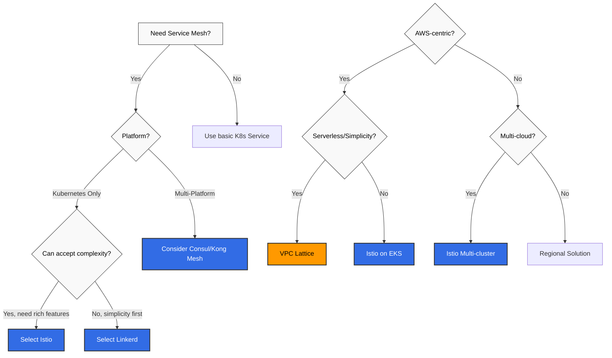

# Guía de comparación

> **Última actualización**: July 7, 2026 **Público objetivo**: Arquitectos, Ingenieros de DevOps, Ingenieros de Plataforma

Esta sección compara varias soluciones de Service Mesh y redes, presentando las ventajas y desventajas de cada solución, así como los casos de uso adecuados.

## Tabla de contenidos

### 1. [Comparación de soluciones de Service Mesh](01-service-mesh-comparison.md)

Comparación de las principales soluciones de Service Mesh disponibles en entornos Kubernetes:

* **Istio** - Service Mesh empresarial rico en funcionalidades
* **Linkerd** - Service Mesh ligero y fácil de usar
* **Kong Mesh** - Service Mesh universal basado en Kuma
* **Consul Connect** - Solución de Service Mesh de HashiCorp

**Criterios de comparación**:

* Arquitectura y componentes
* Rendimiento y uso de recursos
* Conjunto de funcionalidades (gestión del tráfico, seguridad, observabilidad)
* Curva de aprendizaje y complejidad operativa
* Soporte multi-cluster
* Escalabilidad y soporte de plataformas

### 2. [Istio vs VPC Lattice](02-istio-vs-lattice.md)

Comparación entre Kubernetes Service Mesh (Istio) y las redes de servicios nativas de AWS (VPC Lattice):

**Istio Service Mesh**:

* Service mesh centrado en Kubernetes
* Funcionalidades enriquecidas de gestión del tráfico y observabilidad
* Independiente de la nube

**AWS VPC Lattice**:

* Redes de servicios nativas de AWS
* Arquitectura serverless
* Conectividad multi-cuenta/VPC simplificada

**Criterios de comparación**:

* Arquitectura y modelo de despliegue
* Funcionalidades de gestión del tráfico
* Modelo de seguridad
* Sobrecarga operativa
* Estructura de costos
* Soporte híbrido y multi-cloud

### 3. [Guía de selección entre Sidecar y Ambient Mode](03-sidecar-vs-ambient.md)

Una guía de decisión basada en resultados de pruebas para elegir entre el modo sidecar y el modo ambient de Istio en EKS 1.36:

* Resultados de pruebas para 4 requisitos: mTLS, NetworkPolicy, latencia y rollout sin tiempo de inactividad (waypoint 503)
* Datos medidos que muestran una tasa de 503 más alta a través del waypoint ambient que con sidecar
* Una recomendación de despliegue mixto por niveles según el nivel de workload (núcleo / seminúcleo / periferia)

**Criterios de comparación**:

* Aplicación y verificación de mTLS
* Interacción de NetworkPolicy con el puerto HBONE
* Tasa de 503 durante los rollouts (medida)
* Riesgo de la política de reintentos en APIs no idempotentes

## Guía de selección

### Criterios de selección de Service Mesh

### Recomendaciones de casos de uso

#### Gran empresa

**Recomendado**: Istio

* Conjunto de funcionalidades enriquecido
* Control de tráfico detallado
* Seguridad sólida (Authorization Policies, mTLS)
* Federación multi-cluster
* Amplio ecosistema y comunidad

**Alternativa**: Kong Mesh (cuando se necesita un control plane universal)

#### Startup / Inicio rápido

**Recomendado**: Linkerd

* Instalación y operación sencillas
* Baja sobrecarga de recursos
* Curva de aprendizaje rápida
* mTLS y métricas automáticas

**Alternativa**: VPC Lattice (para arquitectura centrada en AWS)

#### Arquitectura nativa de AWS

**Recomendado**: VPC Lattice

* Servicio completamente administrado
* Sin sobrecarga operativa
* Integración con servicios de AWS (Lambda, ECS, EKS)
* Conectividad sencilla entre VPC/cuentas

**Alternativa**: Istio en EKS (cuando se necesitan funcionalidades más enriquecidas)

#### Multi-Cloud / Híbrido

**Recomendado**: Istio o Consul Connect

* Independiente de la nube
* Soporte para workloads de VM
* Federación multi-cluster
* Políticas y observabilidad consistentes

#### Integración de sistemas heredados

**Recomendado**: Consul Connect o Kong Mesh

* Soporte prioritario para workloads de VM
* Migración gradual posible
* Integración de Service Discovery
* Soporte para diversas plataformas

#### Requisitos sólidos de observabilidad

**Recomendado**: Istio

* Métricas enriquecidas (Prometheus, OpenTelemetry)
* Trazabilidad distribuida (Jaeger, Zipkin, Tempo)
* Logs de acceso detallados
* Integración con Kiali
* Paneles de Grafana

**Alternativa**: Linkerd (para requisitos sencillos de observabilidad)

## Tablas de comparación rápida

### Comparación de Service Mesh

| Criterios               | Istio        | Linkerd        | Kong Mesh   | Consul Connect |
| ---------------------- | ------------ | -------------- | ----------- | -------------- |
| **Arquitectura**       | Envoy proxy  | Linkerd2-proxy | Envoy proxy | Consul proxy   |
| **Uso de recursos**     | Alto         | Bajo           | Medio       | Medio          |
| **Curva de aprendizaje**     | Pronunciada        | Suave         | Media      | Media         |
| **Riqueza de funcionalidades**   | 5/5          | 3/5            | 4/5         | 4/5            |
| **Multi-cluster**      | Excelente    | Compatible      | Excelente   | Excelente      |
| **Soporte de VM**         | Limitado      | Ninguno           | Excelente   | Excelente      |
| **Comunidad**          | Muy grande   | Media         | Media      | Grande          |
| **Soporte empresarial** | Google Cloud | Buoyant        | Kong        | HashiCorp      |

### Comparación de Istio vs VPC Lattice

| Criterios                   | Istio             | VPC Lattice                 |
| -------------------------- | ----------------- | --------------------------- |
| **Modelo de despliegue**       | Autoadministrado      | Completamente administrado               |
| **Plataforma**               | Kubernetes        | AWS (EKS, ECS, EC2, Lambda) |
| **Complejidad operativa** | Alta              | Baja                         |
| **Riqueza de funcionalidades**       | 5/5               | 3/5                         |
| **Control de tráfico**        | Muy detallado | Básico                       |
| **Modelo de costos**             | Basado en recursos    | Basado en uso                 |
| **Dependencia de proveedor**         | Baja               | Alta (AWS)                  |
| **Multi-cloud**            | Compatible       | Solo AWS                    |

## Recursos relacionados

### Documentación de Istio

* [Arquitectura de Istio](https://github.com/Atom-oh/kubernetes-docs/blob/main/en/service-mesh/istio/istio/architecture/README.md)
* [Gestión del tráfico de Istio](https://github.com/Atom-oh/kubernetes-docs/blob/main/en/service-mesh/istio/istio/traffic-management/README.md)
* [Seguridad de Istio](https://github.com/Atom-oh/kubernetes-docs/blob/main/en/service-mesh/istio/istio/security/README.md)
* [Observabilidad de Istio](https://github.com/Atom-oh/kubernetes-docs/blob/main/en/service-mesh/istio/istio/observability/README.md)

### Documentación de VPC Lattice

* [Descripción general de VPC Lattice](https://github.com/Atom-oh/kubernetes-docs/blob/main/en/service-mesh/istio/vpc-lattice.md)

### Referencias externas

* [Documentación oficial de Istio](https://istio.io/latest/docs/)
* [Documentación oficial de Linkerd](https://linkerd.io/2.15/overview/)
* [Documentación oficial de Kong Mesh](https://docs.konghq.com/mesh/)
* [Documentación de Consul Connect](https://www.consul.io/docs/connect)
* [Documentación de AWS VPC Lattice](https://docs.aws.amazon.com/vpc-lattice/)

## Guías de migración

### De Linkerd a Istio

* Cuando se necesitan más funcionalidades
* Migración gradual: transición por namespace
* Transición de la configuración basada en anotaciones a Istio CRD

### De Kubernetes básico a Service Mesh

* Necesidades crecientes de gestión del tráfico, seguridad y observabilidad
* Despliegue Canary: comenzar con algunos servicios
* Evaluar el impacto de la inyección de sidecar

### De VPC Lattice a Istio (o viceversa)

* Requisitos multi-cloud frente a preferencia por AWS nativo
* Riqueza de funcionalidades frente a simplicidad operativa
* Enfoque híbrido: posible uso simultáneo

## Preguntas frecuentes

P1: ¿Es Service Mesh absolutamente necesario?

**Respuesta**: Service Mesh se recomienda en los siguientes casos:

* Decenas o más microservicios
* Necesidad de control de tráfico detallado (Canary, pruebas A/B)
* Requisitos de seguridad sólidos (mTLS, Authorization)
* Trazabilidad distribuida y observabilidad
* Comunicación multi-cluster

Para **servicios pequeños** o **arquitecturas simples**, Kubernetes Service e Ingress básicos pueden ser suficientes.

P2: ¿Debo elegir Istio o Linkerd?

**Elija Istio**:

* Cuando se necesitan funcionalidades enriquecidas
* Entornos de grandes empresas
* Control de tráfico y políticas detallados
* Federación multi-cluster

**Elija Linkerd**:

* Cuando se necesita un inicio sencillo y rápido
* Cuando la eficiencia de recursos es importante
* Cuando solo se necesitan funcionalidades básicas de Service Mesh
* Cuando se desea minimizar la complejidad operativa

P3: ¿Cuándo debo usar VPC Lattice?

**VPC Lattice recomendado**:

* Arquitectura centrada en AWS
* Entorno mixto de EKS + ECS + Lambda
* Estrategia centrada en serverless
* Minimizar la sobrecarga operativa
* Conectividad multi-VPC/cuenta simplificada

**Istio recomendado** (en lugar de VPC Lattice):

* Estrategia multi-cloud
* Necesidad de control de tráfico detallado
* Requisitos enriquecidos de observabilidad
* Arquitectura centrada en Kubernetes

P4: ¿Cuál es la sobrecarga de rendimiento de Service Mesh?

**Istio**:

* Aumento de latencia: 1-3ms (promedio)
* Sobrecarga de CPU: 5-15%
* Memoria: +50-150MB por pod

**Linkerd**:

* Aumento de latencia: 0.5-1ms (promedio)
* Sobrecarga de CPU: 3-8%
* Memoria: +20-50MB por pod

**VPC Lattice**:

* Sin sobrecarga de infraestructura al ser un servicio administrado
* Ligero aumento de latencia debido a un salto de red adicional
* Se incurre en un costo basado en uso

P5: ¿Puedo usar varios Service Mesh simultáneamente?

**Respuesta**: Técnicamente es posible, pero no se recomienda.

**Problemas**:

* Posibles conflictos de sidecar
* Resolución de problemas compleja
* Doble sobrecarga
* Separación de responsabilidades poco clara

**Casos de uso excepcionales**:

* **Istio + VPC Lattice**: Istio para el interior del cluster, VPC Lattice para conectividad entre clusters/externa
* **Migración gradual**: De Linkerd a Istio (transición por namespace)

***

**Próximos pasos**: Lea los documentos detallados de comparación y seleccione la solución más adecuada para su entorno.
