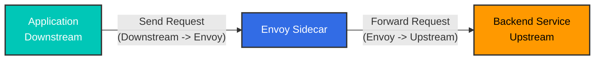
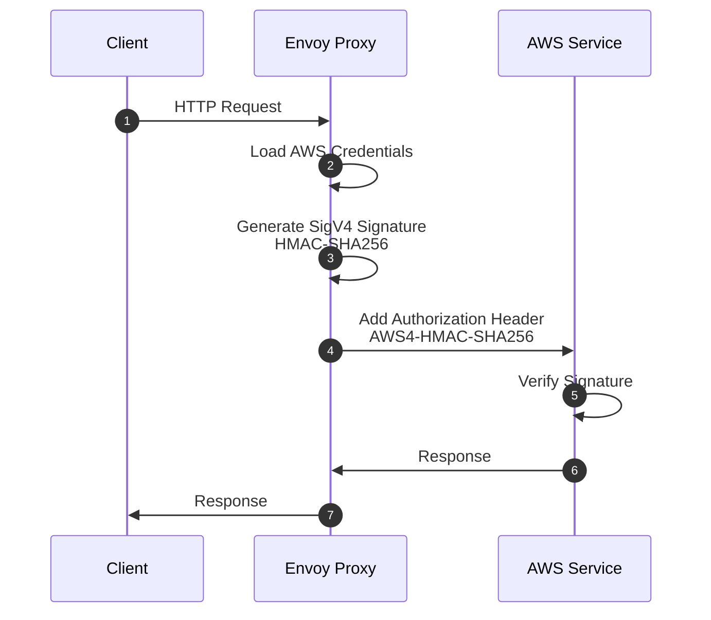

# Glosario de Istio

> **Versión compatible**: Istio 1.28+
> **Última actualización**: February 23, 2026

Este glosario organiza alfabéticamente los términos clave relacionados con Istio y Service Mesh.

## Tabla de contenidos

- [A-C](#a-c)
- [D-F](#d-f)
- [G-I](#g-i)
- [J-L](#j-l)
- [M-O](#m-o)
- [P-R](#p-r)
- [S-U](#s-u)
- [V-Z](#v-z)

---

## A-C

### Ambient Mode

Un nuevo modo de Data Plane introducido en Istio 1.20+ que proporciona funcionalidad de service mesh sin Sidecar Proxies.

**Características**:
- No se requieren contenedores Sidecar
- Usa ztunnel en el nivel de nodo
- Mayor eficiencia de recursos
- Separación de funciones L4 y L7

**Documentación relacionada**: [Ambient Mode](advanced/01-ambient-mode.md)

---

### Certificate Authority (CA)

Una autoridad que emite y administra certificados para la comunicación mTLS entre servicios.

**Función en Istio**:
- La función Citadel de Istiod desempeña el rol de CA
- Emite certificados basados en SPIFFE ID
- Renovación automática de certificados (TTL predeterminado: 24 horas)

**Términos relacionados**: [Citadel](#citadel), [SPIFFE](#spiffe), [mTLS](#mtls)

---

### Circuit Breaker

Un patrón que bloquea las solicitudes hacia servicios con errores para evitar la propagación de fallos en todo el sistema.

**Cómo funciona**:
1. **Closed**: Operación normal
2. **Open**: Bloquea solicitudes después de fallos consecutivos
3. **Half-Open**: Permite algunas solicitudes después de cierto tiempo

**Implementación en Istio**:
```yaml
apiVersion: networking.istio.io/v1
kind: DestinationRule
spec:
  trafficPolicy:
    outlierDetection:
      consecutiveErrors: 5
      interval: 30s
      baseEjectionTime: 30s
```

**Documentación relacionada**: [Circuit Breaker](traffic-management/07-circuit-breaker.md)

---

### Citadel

Un componente de seguridad que existía de forma independiente antes de Istio 1.4. Ahora está integrado en Istiod.

**Funciones principales**:
- Administración de Certificate Authority (CA)
- Emisión y administración de SPIFFE ID
- Generación y renovación de certificados X.509

**Estado actual**: Existe como una función interna dentro de Istiod en Istio 1.5+

**Términos relacionados**: [Istiod](#istiod), [Certificate Authority](#certificate-authority-ca)

---

### CDS (Cluster Discovery Service)

Una de las API xDS que permite a Envoy recibir dinámicamente la configuración de servicios upstream (clusters).

**Información proporcionada**:
- Nombre y tipo de cluster
- Política de Load Balancing
- Configuración de Health Check
- Configuración de Circuit Breaker
- Configuración de TLS

**Términos relacionados**: [xDS](#xds), [Envoy](#envoy)

---

## D-F

### Data Plane

La capa que gestiona el tráfico real en un service mesh.

**Data Plane de Istio**:
- Envoy Proxy (Sidecar o Ambient Mode)
- Gestiona todo el tráfico entrante/saliente
- Cifrado/descifrado mTLS
- Recopilación de métricas

**Términos relacionados**: [Control Plane](#control-plane), [Envoy](#envoy)

---

### DestinationRule

Un CRD de Istio que define políticas para el tráfico enrutado por VirtualService.

**Funciones principales**:
- Definición de Subset (versión, región, etc.)
- Política de Load Balancing
- Configuración de Connection Pool
- Configuración de Circuit Breaker
- Configuración de TLS

```yaml
apiVersion: networking.istio.io/v1
kind: DestinationRule
metadata:
  name: reviews
spec:
  host: reviews
  subsets:
  - name: v1
    labels:
      version: v1
  - name: v2
    labels:
      version: v2
```

**Documentación relacionada**: [DestinationRule](traffic-management/03-destination-rule.md)

---

### eBPF (Extended Berkeley Packet Filter)

Una tecnología que permite ejecutar programas de forma segura dentro del kernel de Linux.

**Uso en Istio**:
- Tecnología principal para Ambient Mode
- Reemplaza iptables (rendimiento más rápido)
- Intercepción de tráfico mediante plugins CNI
- No se requiere Init Container

**Ventajas**:
- Baja sobrecarga
- Procesamiento en el nivel del kernel
- Capacidad de programación dinámica

**Términos relacionados**: [Ambient Mode](#ambient-mode), [iptables](#iptables)

---

### EDS (Endpoint Discovery Service)

Una de las API xDS que proporciona dinámicamente los endpoints reales (IP de Pod) dentro de un cluster.

**Información proporcionada**:
- Direcciones IP y puertos de Endpoint
- Estado de salud
- Pesos de Load Balancing
- Información de localidad

**Ejemplo**:
```json
{
  "cluster_name": "outbound|9080||reviews",
  "endpoints": [
    {
      "lb_endpoints": [
        {"endpoint": {"address": {"socket_address": {"address": "10.244.1.5", "port_value": 9080}}}},
        {"endpoint": {"address": {"socket_address": {"address": "10.244.2.8", "port_value": 9080}}}}
      ]
    }
  ]
}
```

**Términos relacionados**: [xDS](#xds), [CDS](#cds-cluster-discovery-service)

---

### Envoy Proxy

Un proxy L7 de alto rendimiento que forma el Data Plane de Istio.

**Historia**:
- Desarrollado por Matt Klein en Lyft en 2016
- Proyecto CNCF Incubating en 2017
- Proyecto CNCF Graduated en 2018

**Características clave**:
- Proxy de alto rendimiento escrito en C++
- Configuración dinámica mediante la API xDS
- Compatibilidad con HTTP/1.1, HTTP/2 y gRPC
- Amplia observabilidad

**Componentes**:
- Listeners: Escucha de puertos
- Filters: Procesamiento de solicitudes/respuestas
- Routers: Decisiones de enrutamiento
- Clusters: Servicios upstream

**Documentación relacionada**: [Architecture - Envoy Proxy](03-architecture.md#data-plane-envoy-proxy)

---

## G-I

### Galley

Un componente de validación de configuración que existía de forma independiente antes de Istio 1.4. Ahora está integrado en Istiod.

**Funciones principales**:
- Validación de configuración de Istio
- Procesamiento de recursos de Kubernetes
- Comprobación de errores antes de implementar la configuración

**Estado actual**: Existe como una función interna dentro de Istiod en Istio 1.5+

**Términos relacionados**: [Istiod](#istiod)

---

### Gateway

Un CRD de Istio que define los puntos de entrada para el tráfico externo que ingresa al Service Mesh.

**Tipos**:
1. **Ingress Gateway**: Tráfico de externo a interno
2. **Egress Gateway**: Tráfico de interno a externo

```yaml
apiVersion: networking.istio.io/v1
kind: Gateway
metadata:
  name: my-gateway
spec:
  selector:
    istio: ingressgateway
  servers:
  - port:
      number: 80
      name: http
      protocol: HTTP
    hosts:
    - "example.com"
```

**Documentación relacionada**: [Gateway and VirtualService](traffic-management/01-gateway-virtualservice.md)

---

### gRPC

Un framework RPC (Remote Procedure Call) de alto rendimiento desarrollado por Google.

**Relación con Istio**:
- La API xDS se basa en gRPC
- Se utiliza para la comunicación entre Istiod y Envoy
- Basado en HTTP/2 (admite multiplexación)

**Ventajas**:
- Streaming bidireccional
- Baja latencia
- Usa Protocol Buffers

**Términos relacionados**: [xDS](#xds)

---

### Identity

Representa la identidad de un workload dentro del Service Mesh.

**Identity de Istio**:
- Usa el formato SPIFFE ID
- Se basa en Kubernetes ServiceAccount
- Se acredita mediante certificados X.509

**Ejemplo**:
```
spiffe://cluster.local/ns/default/sa/reviews
```

**Términos relacionados**: [SPIFFE](#spiffe), [mTLS](#mtls)

---

### iptables

Una herramienta de firewall que controla el tráfico de red en Linux.

**Rol en Istio**:
- El contenedor istio-init configura las reglas de iptables
- Redirige todo el tráfico de Pod a Envoy
- Usa la tabla NAT (cadenas PREROUTING, OUTPUT)

**Reglas clave**:
```bash
# Outbound: All traffic except Envoy -> 15001
iptables -t nat -A OUTPUT -p tcp -m owner ! --uid-owner 1337 -j REDIRECT --to-port 15001

# Inbound: All traffic -> 15006
iptables -t nat -A PREROUTING -p tcp -j REDIRECT --to-port 15006
```

**Alternativa**: eBPF (Ambient Mode)

**Documentación relacionada**: [Architecture - iptables](03-architecture.md#iptables-and-traffic-interception)

---

### Istiod

El componente unificado de Control Plane en Istio 1.5+.

**Funciones integradas**:
- **Pilot**: Service Discovery, Traffic Management
- **Citadel**: Certificate Authority, Identity
- **Galley**: Configuration Validation

**Método de ejecución**:
- Un único binario de Go: `pilot-discovery`
- Todas las funciones se ejecutan dentro de un único proceso
- Puertos predeterminados: 15012 (xDS), 15017 (Webhook)

**Ventajas**:
- Complejidad reducida
- Operaciones simplificadas
- Eficiencia de recursos

**Documentación relacionada**: [Architecture - Istiod](03-architecture.md#control-plane-istiod)

---

## J-L

### LDS (Listener Discovery Service)

Una de las API xDS que permite a Envoy recibir dinámicamente los puertos que debe escuchar y las cadenas de filtros.

**Información proporcionada**:
- Dirección y puerto de Listener
- Protocolo (HTTP, TCP)
- Configuración de Filter Chain
- Configuración de TLS

**Listeners predeterminados de Istio**:
- `0.0.0.0:15001`: TCP saliente
- `0.0.0.0:15006`: TCP entrante
- `0.0.0.0:15021`: Health Check
- `0.0.0.0:15090`: Métricas de Prometheus

**Términos relacionados**: [xDS](#xds), [Envoy](#envoy)

---

### Locality-aware Load Balancing

Un método de Load Balancing que considera la información de localidad (Region, Zone).

**Prioridad**:
1. Endpoints en la misma Zone
2. Zone diferente en la misma Region
3. Region diferente

**Ejemplo de configuración**:
```yaml
apiVersion: networking.istio.io/v1
kind: DestinationRule
spec:
  trafficPolicy:
    loadBalancer:
      localityLbSetting:
        enabled: true
        distribute:
        - from: us-west/zone-1a/*
          to:
            "us-west/zone-1a/*": 80
            "us-west/zone-1b/*": 20
```

**Documentación relacionada**: [Zone Aware Routing](resilience/03-zone-aware-routing.md)

---

## M-O

### Mixer

Un componente de políticas y telemetría que existía antes de Istio 1.4.

**Funciones principales**:
- Aplicación de políticas (Rate Limiting, Access Control)
- Recopilación de telemetría

**Motivos de su eliminación**:
- Sobrecarga de rendimiento (llamada a Mixer por cada solicitud)
- Arquitectura compleja

**Estado actual**: Eliminado por completo en Istio 1.5+ (la funcionalidad se trasladó a Envoy)

**Términos relacionados**: [Istiod](#istiod)

---

### mTLS (Mutual TLS)

Un método de comunicación TLS bidireccional en el que el cliente y el servidor se autentican mutuamente.

**mTLS de Istio**:
- Emisión y renovación automática de certificados
- Autenticación basada en SPIFFE ID
- Cifrado predeterminado: AES-256-GCM

**Modos**:
1. **STRICT**: Solo se permite mTLS
2. **PERMISSIVE**: Se permiten mTLS + texto sin formato (para migración)
3. **DISABLE**: Solo se permite texto sin formato

```yaml
apiVersion: security.istio.io/v1
kind: PeerAuthentication
metadata:
  name: default
spec:
  mtls:
    mode: STRICT
```

**Documentación relacionada**: [mTLS](security/01-mtls.md)

---

### Outlier Detection

Una función que excluye automáticamente los endpoints que muestran un comportamiento anómalo.

**Condiciones de detección**:
- Recuento de errores consecutivos
- Tasa de errores
- Latencia de respuesta

```yaml
apiVersion: networking.istio.io/v1
kind: DestinationRule
spec:
  trafficPolicy:
    outlierDetection:
      consecutiveErrors: 5
      interval: 30s
      baseEjectionTime: 30s
      maxEjectionPercent: 50
```

**Documentación relacionada**: [Outlier Detection](resilience/01-outlier-detection.md)

---

## P-R

### Downstream

Desde la perspectiva de Envoy, esto se refiere a **la parte que envía solicitudes**. Es decir, el cliente que inicia una conexión con Envoy.

**Downstream de Envoy**:
- Conexiones que entran a Envoy (Inbound)
- Cliente que envía solicitudes
- Conexiones recibidas por Listener

**Flujo de tráfico**:
```
Downstream (Client)  ->  Envoy Proxy  ->  Upstream (Backend)
```

**Escenarios de ejemplo**:

#### 1. Sidecar Mode - Solicitud saliente



**Perspectiva**:
- **Desde el punto de vista de Envoy**: La aplicación es Downstream (envía solicitudes)
- **Desde el punto de vista de Envoy**: El servicio backend es Upstream (recibe solicitudes)

#### 2. Ingress Gateway - Solicitud externa


**Configuración de Envoy relacionada con Downstream**:

```yaml
# Listener - Receive Downstream connections
apiVersion: networking.istio.io/v1alpha3
kind: EnvoyFilter
metadata:
  name: downstream-config
spec:
  configPatches:
  - applyTo: LISTENER
    patch:
      operation: MERGE
      value:
        per_connection_buffer_limit_bytes: 32768  # Downstream buffer
        listener_filters:
        - name: envoy.filters.listener.tls_inspector
```

**Métricas de Downstream**:
```bash
# Downstream connection count
envoy_listener_downstream_cx_active

# Downstream request count
envoy_http_downstream_rq_total

# Downstream response time
envoy_http_downstream_rq_time
```

**Términos relacionados**: [Upstream](#upstream), [Envoy](#envoy-proxy), [Listener](#lds-listener-discovery-service)

---

### Upstream

Desde la perspectiva de Envoy, esto se refiere a **la parte que recibe solicitudes**. Es decir, el servicio backend al que Envoy inicia una conexión.

**Upstream de Envoy**:
- Conexiones que salen de Envoy (Outbound)
- Servicio backend que procesa solicitudes
- Endpoints administrados por Cluster

**Flujo de tráfico**:
```
Downstream (Client)  ->  Envoy Proxy  ->  Upstream (Backend)
```

**Componentes de Upstream**:

#### 1. Cluster (Grupo Upstream)

```yaml
# Define Upstream Cluster with DestinationRule
apiVersion: networking.istio.io/v1
kind: DestinationRule
metadata:
  name: reviews
spec:
  host: reviews  # Upstream service
  trafficPolicy:
    loadBalancer:
      simple: ROUND_ROBIN
    connectionPool:
      tcp:
        maxConnections: 100      # Upstream connection limit
      http:
        http1MaxPendingRequests: 50
        http2MaxRequests: 100
    outlierDetection:
      consecutiveErrors: 5        # Upstream failure detection
      interval: 30s
```

#### 2. Endpoint (Instancia Upstream real)

```bash
# Check upstream endpoints
istioctl proxy-config endpoints <pod-name> | grep reviews

# Example output:
# ENDPOINT              STATUS      CLUSTER
# 10.244.1.5:9080       HEALTHY     outbound|9080||reviews.default.svc.cluster.local
# 10.244.2.8:9080       HEALTHY     outbound|9080||reviews.default.svc.cluster.local
# 10.244.3.12:9080      UNHEALTHY   outbound|9080||reviews.default.svc.cluster.local
```

**Política de tráfico Upstream**:

```yaml
apiVersion: networking.istio.io/v1
kind: DestinationRule
spec:
  host: reviews
  trafficPolicy:
    # Upstream load balancing
    loadBalancer:
      consistentHash:
        httpHeaderName: "x-user-id"

    # Upstream connection pool
    connectionPool:
      tcp:
        maxConnections: 100
        connectTimeout: 30s
      http:
        h2UpgradePolicy: UPGRADE

    # Upstream TLS
    tls:
      mode: ISTIO_MUTUAL

    # Upstream Circuit Breaker
    outlierDetection:
      consecutiveErrors: 5
      interval: 10s
      baseEjectionTime: 30s
```

**Comparación entre Upstream y Downstream**:

| Elemento | Downstream | Upstream |
|------|-----------|----------|
| **Dirección** | Entra a Envoy (Inbound) | Sale de Envoy (Outbound) |
| **Rol** | Envía solicitudes (Client) | Recibe solicitudes (Server) |
| **Configuración de Envoy** | Listener, Filter Chain | Cluster, Endpoint |
| **Ejemplos** | Usuarios externos, otros servicios | API de backend, Database |
| **Métricas** | `downstream_cx_*`, `downstream_rq_*` | `upstream_cx_*`, `upstream_rq_*` |

**Ejemplos del mundo real**:

#### Escenario 1: Llamada de Service A -> Service B

```
+---------------------------------------------------------+
| Service A Pod                                           |
|                                                         |
|  App --> Envoy Sidecar                                 |
|          |                                              |
|          | Downstream: App                              |
|          | Upstream: Service B                          |
+----------|-------------------------------------------------+
           |
           v
+---------------------------------------------------------+
| Service B Pod                                           |
|                                                         |
|          Envoy Sidecar --> App                          |
|          |                                              |
|          | Downstream: Service A Envoy                  |
|          | Upstream: Local App (Service B)              |
+---------------------------------------------------------+
```

**Perspectiva de Envoy de Service A**:
- Downstream: Aplicación de Service A
- Upstream: Service B

**Perspectiva de Envoy de Service B**:
- Downstream: Envoy de Service A
- Upstream: Aplicación de Service B (local)

#### Escenario 2: Ingress Gateway

```
External Client (Downstream)
        |
Ingress Gateway (Envoy)
        |
Internal Service (Upstream)
```

**Métricas de Upstream**:

```bash
# Upstream connection count
envoy_cluster_upstream_cx_active

# Upstream request success rate
envoy_cluster_upstream_rq_success_rate

# Upstream response time
envoy_cluster_upstream_rq_time

# Upstream health check
envoy_cluster_health_check_success

# Upstream Circuit Breaker
envoy_cluster_circuit_breakers_default_remaining
```

**Health Check de Upstream**:

```yaml
apiVersion: networking.istio.io/v1
kind: DestinationRule
spec:
  host: reviews
  trafficPolicy:
    outlierDetection:
      # Upstream health detection
      consecutiveGatewayErrors: 5
      consecutive5xxErrors: 5
      interval: 10s
      baseEjectionTime: 30s
      maxEjectionPercent: 50
```

**Depuración**:

```bash
# 1. Check upstream cluster
istioctl proxy-config clusters <pod-name> --fqdn reviews.default.svc.cluster.local

# 2. Check upstream endpoint status
istioctl proxy-config endpoints <pod-name> --cluster "outbound|9080||reviews.default.svc.cluster.local"

# 3. Check upstream metrics
kubectl exec <pod-name> -c istio-proxy -- \
  curl -s localhost:15000/stats/prometheus | grep upstream

# 4. Check upstream connections
istioctl proxy-config all <pod-name> -o json | \
  jq '.configs[] | select(.["@type"] | contains("ClustersConfigDump"))'
```

**Términos relacionados**: [Downstream](#downstream), [Envoy](#envoy-proxy), [Cluster](#cds-cluster-discovery-service), [Endpoint](#eds-endpoint-discovery-service)

---

### Pilot

Un componente de Traffic Management que existía de forma independiente antes de Istio 1.4. Ahora está integrado en Istiod.

**Funciones principales**:
- Service Discovery
- Traffic Management (procesamiento de VirtualService y DestinationRule)
- Servidor xDS

**Estado actual**: Existe como una función interna dentro de Istiod en Istio 1.5+

**Términos relacionados**: [Istiod](#istiod), [xDS](#xds)

---

### RDS (Route Discovery Service)

Una de las API xDS que proporciona dinámicamente reglas de enrutamiento HTTP.

**Información proporcionada**:
- Reglas de coincidencia de rutas (path, headers, etc.)
- Enrutamiento basado en pesos
- Reglas de redirección y reescritura
- Configuración de Timeout y Retry

**Relación con VirtualService**:
- VirtualService -> Convertido por Istiod -> configuración de RDS

**Términos relacionados**: [xDS](#xds), [VirtualService](#virtualservice)

---

### Rate Limiting

Una función que limita el número de solicitudes permitidas por unidad de tiempo.

**Métodos de implementación**:
1. **Local Rate Limiting**: Procesado localmente por Envoy
2. **Global Rate Limiting**: Usa un servicio externo de Rate Limit

```yaml
apiVersion: networking.istio.io/v1
kind: EnvoyFilter
metadata:
  name: filter-local-ratelimit
spec:
  configPatches:
  - applyTo: HTTP_FILTER
    patch:
      operation: INSERT_BEFORE
      value:
        name: envoy.filters.http.local_ratelimit
        typed_config:
          stat_prefix: http_local_rate_limiter
          token_bucket:
            max_tokens: 100
            tokens_per_fill: 100
            fill_interval: 1s
```

**Documentación relacionada**: [Rate Limiting](resilience/02-rate-limiting.md)

---

## S-U

### SDS (Secret Discovery Service)

Una de las API xDS que proporciona dinámicamente certificados y claves TLS.

**Información proporcionada**:
- Certificados X.509
- Private Key
- CA Root Certificate

**Ventajas**:
- No se requiere sistema de archivos
- Renovación automática de certificados
- Renovación sin tiempo de inactividad

**Términos relacionados**: [xDS](#xds), [mTLS](#mtls)

---

### Service Entry

Un CRD de Istio que registra en la malla los servicios externos al Service Mesh.

**Casos de uso**:
- Control de acceso a API externas
- Aplicar características de Istio a servicios externos (Retry, Timeout, etc.)
- Integración de Egress Gateway

```yaml
apiVersion: networking.istio.io/v1
kind: ServiceEntry
metadata:
  name: external-api
spec:
  hosts:
  - api.external.com
  ports:
  - number: 443
    name: https
    protocol: HTTPS
  location: MESH_EXTERNAL
  resolution: DNS
```

**Documentación relacionada**: [ServiceEntry](traffic-management/12-service-entry.md)

---

### Service Mesh

Una capa de infraestructura que administra la comunicación entre microservicios.

**Características principales**:
- Gestión de tráfico (enrutamiento, Load Balancing)
- Seguridad (mTLS, autenticación/autorización)
- Observabilidad (métricas, logs, tracing)
- Resiliencia (Retry, Circuit Breaker)

**Implementaciones principales**:
- Istio
- Linkerd
- Consul Connect
- AWS App Mesh

---

### SigV4 (AWS Signature Version 4)

Un protocolo de firma para autenticar solicitudes de API de AWS.

**Cómo funciona**:



**Componentes de la firma**:

1. **Canonical Request**: Formato estandarizado de la solicitud
   - Método HTTP
   - Ruta URI
   - Query string
   - Headers
   - Hash de payload

2. **String to Sign**: Cadena que se debe firmar
   - Algoritmo: `AWS4-HMAC-SHA256`
   - Marca de tiempo
   - Credential Scope
   - Hash de Canonical Request

3. **Signing Key**: Cálculo de la clave de firma
   ```
   HMAC(HMAC(HMAC(HMAC("AWS4" + SecretKey, Date), Region), Service), "aws4_request")
   ```

4. **Signature**: Firma final
   ```
   HMAC(SigningKey, StringToSign)
   ```

**Integración con Istio**:

#### 1. Autenticación SigV4 mediante EnvoyFilter

```yaml
apiVersion: networking.istio.io/v1alpha3
kind: EnvoyFilter
metadata:
  name: aws-sigv4-filter
  namespace: istio-system
spec:
  configPatches:
  - applyTo: HTTP_FILTER
    match:
      context: SIDECAR_OUTBOUND
      listener:
        filterChain:
          filter:
            name: envoy.filters.network.http_connection_manager
    patch:
      operation: INSERT_BEFORE
      value:
        name: envoy.filters.http.aws_request_signing
        typed_config:
          "@type": type.googleapis.com/envoy.extensions.filters.http.aws_request_signing.v3.AwsRequestSigning
          service_name: s3
          region: us-west-2
          use_unsigned_payload: false
          match_excluded_headers:
          - prefix: x-envoy
```

#### 2. Integración con autorización externa

```yaml
apiVersion: security.istio.io/v1beta1
kind: RequestAuthentication
metadata:
  name: aws-auth
  namespace: default
spec:
  jwtRules:
  - issuer: "https://sts.amazonaws.com"
    audiences:
    - "sts.amazonaws.com"
    jwksUri: "https://sts.amazonaws.com/.well-known/jwks"
---
apiVersion: security.istio.io/v1beta1
kind: AuthorizationPolicy
metadata:
  name: require-aws-auth
  namespace: default
spec:
  action: CUSTOM
  provider:
    name: aws-sigv4-authorizer
  rules:
  - to:
    - operation:
        paths: ["/api/*"]
```

**Escenarios de casos de uso**:

#### Escenario 1: Acceso a S3

```yaml
# Register S3 with ServiceEntry
apiVersion: networking.istio.io/v1beta1
kind: ServiceEntry
metadata:
  name: s3-external
spec:
  hosts:
  - "*.s3.amazonaws.com"
  ports:
  - number: 443
    name: https
    protocol: HTTPS
  location: MESH_EXTERNAL
  resolution: DNS
---
# Configure TLS with DestinationRule
apiVersion: networking.istio.io/v1beta1
kind: DestinationRule
metadata:
  name: s3-external
spec:
  host: "*.s3.amazonaws.com"
  trafficPolicy:
    tls:
      mode: SIMPLE
```

**Código de la aplicación**:
```python
import requests

# Envoy automatically adds SigV4 signature
response = requests.get("https://my-bucket.s3.us-west-2.amazonaws.com/object.txt")
print(response.text)
```

#### Escenario 2: Integración con API Gateway

```yaml
apiVersion: networking.istio.io/v1beta1
kind: VirtualService
metadata:
  name: aws-api-gateway
spec:
  hosts:
  - api.example.com
  http:
  - match:
    - uri:
        prefix: "/api"
    route:
    - destination:
        host: my-api.execute-api.us-west-2.amazonaws.com
        port:
          number: 443
```

#### Escenario 3: Acceso a DynamoDB

```yaml
apiVersion: networking.istio.io/v1alpha3
kind: EnvoyFilter
metadata:
  name: dynamodb-sigv4
spec:
  configPatches:
  - applyTo: HTTP_FILTER
    patch:
      operation: INSERT_BEFORE
      value:
        name: envoy.filters.http.aws_request_signing
        typed_config:
          "@type": type.googleapis.com/envoy.extensions.filters.http.aws_request_signing.v3.AwsRequestSigning
          service_name: dynamodb
          region: us-west-2
          host_rewrite: dynamodb.us-west-2.amazonaws.com
```

**Métodos para proporcionar credenciales de AWS**:

1. **ServiceAccount + IRSA (recomendado)**:
```yaml
apiVersion: v1
kind: ServiceAccount
metadata:
  name: app-sa
  annotations:
    eks.amazonaws.com/role-arn: arn:aws:iam::123456789012:role/app-role
```

2. **EC2 Instance Profile**:
   - Usa automáticamente el rol de IAM asignado al nodo

3. **Variables de entorno**:
```yaml
env:
- name: AWS_ACCESS_KEY_ID
  valueFrom:
    secretKeyRef:
      name: aws-credentials
      key: access-key-id
- name: AWS_SECRET_ACCESS_KEY
  valueFrom:
    secretKeyRef:
      name: aws-credentials
      key: secret-access-key
```

**Consideraciones de seguridad**:

1. **Rotación de credenciales**:
   - Rotación automática mediante IRSA
   - TTL predeterminado: 1 hora

2. **Principio de privilegio mínimo**:
```json
{
  "Version": "2012-10-17",
  "Statement": [
    {
      "Effect": "Allow",
      "Action": [
        "s3:GetObject"
      ],
      "Resource": "arn:aws:s3:::my-bucket/*"
    }
  ]
}
```

3. **Registro de auditoría**:
   - Registra todas las llamadas de API con CloudTrail
   - Integración con Istio Access Log

**Depuración**:

```bash
# Check SigV4 signature in Envoy logs
kubectl logs <pod-name> -c istio-proxy | grep aws_request_signing

# Check Authorization header
kubectl exec -it <pod-name> -c istio-proxy -- \
  curl -v localhost:15000/config_dump | jq '.configs[] | select(.["@type"] == "type.googleapis.com/envoy.admin.v3.ClustersConfigDump")'

# Test AWS API call
kubectl exec -it <pod-name> -- \
  curl -v https://my-bucket.s3.amazonaws.com/test.txt
```

**Impacto en el rendimiento**:

| Operación | Latencia |
|-----------|---------|
| Cálculo de firma SigV4 | ~1-2ms |
| Carga de credenciales (caché) | ~0.1ms |
| Carga de credenciales (IRSA) | ~50ms (primera solicitud) |
| Sobrecarga total | ~1-3ms |

**Comparación de alternativas**:

| Método | Ventajas | Desventajas |
|--------|------------|---------------|
| **SigV4 (Envoy)** | No se requieren cambios en el código de la aplicación | Se necesita configuración de Envoy |
| **AWS SDK** | Control flexible | Se requiere SDK en todas las aplicaciones |
| **API Gateway** | Solución administrada | Costo adicional |

**Términos relacionados**: [AuthorizationPolicy](#authorizationpolicy), [ServiceEntry](#service-entry), [EnvoyFilter](advanced/03-envoy-filter.md)

**Referencias**:
- [AWS Signature Version 4](https://docs.aws.amazon.com/general/latest/gr/signature-version-4.html)
- [Envoy AWS Request Signing](https://www.envoyproxy.io/docs/envoy/latest/configuration/http/http_filters/aws_request_signing_filter)
- [AWS Integration](04-aws-integration.md)

---

### Sidecar

Un patrón de contenedor auxiliar implementado junto a un contenedor de aplicación.

**Sidecar de Istio**:
- Nombre del contenedor: `istio-proxy`
- Imagen: `istio/proxyv2`
- Ejecuta Envoy Proxy
- Intercepta todo el tráfico (iptables o eBPF)

**Métodos de inyección**:
1. **Automático**: Etiqueta de Namespace
2. **Manual**: `istioctl kube-inject`

```yaml
metadata:
  labels:
    istio-injection: enabled  # Automatic injection
```

**Documentación relacionada**: [Sidecar Injection](advanced/07-sidecar-injection.md)

---

### Sidecar Resource

Un CRD de Istio que limita la información de servicios que recibe Envoy.

**Propósito**:
- Reducir el uso de memoria
- Acortar el tiempo de envío de configuración
- Aislamiento de red

```yaml
apiVersion: networking.istio.io/v1
kind: Sidecar
metadata:
  name: default
  namespace: default
spec:
  egress:
  - hosts:
    - "./*"  # Same namespace only
    - "istio-system/*"
```

**Efecto**:
- Antes: 1000 servicios -> 500 MB de memoria
- Después: 10 servicios -> 80 MB de memoria

**Documentación relacionada**: [Architecture - Sidecar Resource](03-architecture.md#optimization-through-sidecar-resource)

---

### SPIFFE (Secure Production Identity Framework for Everyone)

Un estándar para acreditar la identidad de un workload en entornos cloud-native.

**Formato de SPIFFE ID**:
```
spiffe://trust-domain/path
```

**Ejemplo de Istio**:
```
spiffe://cluster.local/ns/default/sa/reviews
  |         |           |     |      |    |
  |         |           |     |      |    +- ServiceAccount name
  |         |           |     |      +----- "sa" (ServiceAccount)
  |         |           |     +------------ Namespace name
  |         |           +------------------ "ns" (Namespace)
  |         +------------------------------ Trust Domain
  +---------------------------------------- Protocol
```

**Componentes**:
- **SPIFFE ID**: Identificador de workload
- **SVID (SPIFFE Verifiable Identity Document)**: Certificado X.509

**Términos relacionados**: [Identity](#identity), [mTLS](#mtls)

---

### Subset

Una agrupación lógica de servicios definida en DestinationRule.

**Usos comunes**:
- Por versión: `v1`, `v2`, `v3`
- Por etapa de implementación: `stable`, `canary`, `test`
- Por región: `us-west`, `us-east`, `eu-central`

```yaml
apiVersion: networking.istio.io/v1
kind: DestinationRule
spec:
  subsets:
  - name: v1
    labels:
      version: v1
  - name: v2
    labels:
      version: v2
```

**Documentación relacionada**: [DestinationRule - Subset Concept](traffic-management/03-destination-rule.md#subset-concept)

---

## V-Z

### Waypoint Proxy

Un proxy opcional que proporciona funcionalidad L7 en Ambient Mode.

**Rol**:
- Implementado por Service Account o Namespace
- Basado en Envoy Proxy
- Dedicado a funciones de Traffic Management L7
- Funciona junto con ztunnel

**Características proporcionadas**:
- Enrutamiento L7 (basado en Path y Header)
- Retry y Timeout
- Circuit Breaker
- Fault Injection
- Manipulación de Header

**Ejemplo de implementación**:
```yaml
apiVersion: gateway.networking.k8s.io/v1
kind: Gateway
metadata:
  name: reviews-waypoint
  namespace: default
spec:
  gatewayClassName: istio-waypoint
  listeners:
  - name: mesh
    port: 15008
    protocol: HBONE
```

**Características**:
- ztunnel solo gestiona L4; waypoint gestiona L7
- Uso selectivo solo para los servicios que lo necesitan
- Mayor eficiencia de recursos que Sidecar (enfoque compartido)
- Implementado por Service Account o Namespace

**Términos relacionados**: [Ambient Mode](#ambient-mode), [ztunnel](#ztunnel-zero-trust-tunnel)

---

### VirtualService

Un CRD de Istio que define cómo se enruta el tráfico dentro del Service Mesh.

**Funciones principales**:
- Enrutamiento basado en URI, headers y parámetros de query
- Distribución de tráfico basada en pesos
- Configuración de Retry y Timeout
- Fault Injection

```yaml
apiVersion: networking.istio.io/v1
kind: VirtualService
metadata:
  name: reviews
spec:
  hosts:
  - reviews
  http:
  - match:
    - uri:
        prefix: "/v2"
    route:
    - destination:
        host: reviews
        subset: v2
  - route:
    - destination:
        host: reviews
        subset: v1
```

**Documentación relacionada**: [Gateway and VirtualService](traffic-management/01-gateway-virtualservice.md)

---

### WASM (WebAssembly)

Un formato de instrucciones binarias diseñado para ejecutarse en navegadores web. En Istio, se utiliza para ampliar la funcionalidad del proxy Envoy.

**Uso en Istio**:
- Agregar lógica personalizada como Envoy Filter
- Ampliar dinámicamente la funcionalidad sin volver a implementar
- Puede escribirse en varios lenguajes (Rust, C++, Go, etc.)
- Se ejecuta de forma segura en un entorno sandbox

**Casos de uso principales**:
1. **Autenticación/autorización personalizada**: Implementar lógica de negocio compleja
2. **Transformación de solicitudes/respuestas**: Manipulación de Header, transformación de payload
3. **Enrutamiento avanzado**: Lógica de enrutamiento personalizada
4. **Recopilación de métricas**: Telemetría especializada

**Ejemplo de plugin WASM**:
```yaml
apiVersion: extensions.istio.io/v1alpha1
kind: WasmPlugin
metadata:
  name: custom-auth
  namespace: istio-system
spec:
  selector:
    matchLabels:
      istio: ingressgateway
  url: oci://ghcr.io/my-org/custom-auth:v1.0.0
  phase: AUTHN
  pluginConfig:
    api_key_header: "X-API-Key"
    validate_endpoint: "https://auth.example.com/validate"
```

**Métodos de implementación**:

#### 1. Implementación mediante OCI Registry (recomendado)

```yaml
apiVersion: extensions.istio.io/v1alpha1
kind: WasmPlugin
metadata:
  name: rate-limiter
spec:
  url: oci://docker.io/istio/rate-limit:1.0.0
  imagePullPolicy: Always
  imagePullSecret: registry-credential
```

#### 2. Implementación mediante URL HTTP

```yaml
apiVersion: extensions.istio.io/v1alpha1
kind: WasmPlugin
metadata:
  name: custom-filter
spec:
  url: https://example.com/filters/custom-filter.wasm
  sha256: "8a8c3b5e..."
```

#### 3. Implementación de archivo local

```yaml
apiVersion: extensions.istio.io/v1alpha1
kind: WasmPlugin
metadata:
  name: local-filter
spec:
  url: file:///etc/istio/filters/custom.wasm
```

**Ejemplo de desarrollo de WASM (Rust)**:

```rust
use proxy_wasm::traits::*;
use proxy_wasm::types::*;

#[no_mangle]
pub fn _start() {
    proxy_wasm::set_log_level(LogLevel::Trace);
    proxy_wasm::set_http_context(|_, _| -> Box<dyn HttpContext> {
        Box::new(CustomFilter)
    });
}

struct CustomFilter;

impl HttpContext for CustomFilter {
    fn on_http_request_headers(&mut self, _: usize) -> Action {
        // API Key validation
        match self.get_http_request_header("x-api-key") {
            Some(key) if key == "secret-key" => {
                Action::Continue
            }
            _ => {
                self.send_http_response(
                    403,
                    vec![("content-type", "text/plain")],
                    Some(b"Forbidden: Invalid API Key"),
                );
                Action::Pause
            }
        }
    }
}
```

**Compilación e implementación**:

```bash
# 1. Build WASM (Rust)
cargo build --target wasm32-unknown-unknown --release

# 2. Package as OCI image
docker build -t ghcr.io/my-org/custom-auth:v1.0.0 .
docker push ghcr.io/my-org/custom-auth:v1.0.0

# 3. Apply WasmPlugin
kubectl apply -f wasmplugin.yaml
```

**Características de rendimiento**:

| Métrica | Valor |
|--------|-------|
| Tiempo de inicio | ~1-5ms |
| Sobrecarga de memoria | ~100KB por filtro |
| Sobrecarga de ejecución | ~0.1-1ms por solicitud |
| Aislamiento de sandbox | Garantizado |

**Compatibilidad con Ambient Mode**:

```yaml
apiVersion: extensions.istio.io/v1alpha1
kind: WasmPlugin
metadata:
  name: waypoint-filter
spec:
  selector:
    matchLabels:
      gateway.networking.k8s.io/gateway-name: reviews-waypoint
  url: oci://ghcr.io/filters/custom:latest
  phase: AUTHN
```

**Depuración**:

```bash
# Check WASM plugin status
kubectl get wasmplugin -A

# Check WASM-related logs in Envoy logs
kubectl logs <pod-name> -c istio-proxy | grep wasm

# Check WASM module load
istioctl proxy-config all <pod-name> -o json | jq '.configs[] | select(.name | contains("wasm"))'
```

**Consideraciones de seguridad**:
1. **Aislamiento de sandbox**: Los módulos WASM se ejecutan en un entorno aislado del proceso Envoy
2. **Límites de recursos**: Se pueden configurar límites de CPU y memoria
3. **Verificación de firma**: Comprobación de integridad con hash SHA256
4. **Privilegio mínimo**: Otorgar solo los permisos necesarios

**Ventajas**:
- Alto rendimiento (nivel de código nativo)
- Ejecución segura en sandbox
- Actualizable sin volver a implementar
- Compatibilidad con varios lenguajes
- Formato estándar de imagen OCI

**Limitaciones**:
- Algunas llamadas del sistema están restringidas
- E/S de archivos limitada
- Llamadas de red solo mediante la API de Envoy

**Términos relacionados**: [Envoy](#envoy-proxy), [Waypoint Proxy](#waypoint-proxy), [Ambient Mode](#ambient-mode)

**Referencias**:
- [Istio WASM Plugin](https://istio.io/latest/docs/concepts/wasm/)
- [Proxy-Wasm SDK](https://github.com/proxy-wasm)
- [WebAssembly Official Site](https://webassembly.org/)
- [Ambient Mode - WASM](advanced/01-ambient-mode.md#wasm-plugin)

---

### xDS (Discovery Service)

Un conjunto de API para la configuración dinámica de Envoy Proxy.

**Significado de "xDS"**:
- `x`: Variable que representa varios tipos
- `DS`: Discovery Service

**Tipos de API xDS**:

| API | Nombre | Rol |
|-----|------|------|
| **LDS** | Listener Discovery Service | Puertos de escucha y cadenas de filtros |
| **RDS** | Route Discovery Service | Reglas de enrutamiento HTTP |
| **CDS** | Cluster Discovery Service | Configuración del servicio upstream |
| **EDS** | Endpoint Discovery Service | Lista real de IP de Pod |
| **SDS** | Secret Discovery Service | Certificados y claves TLS |

**Método de comunicación**:
- Protocolo: gRPC
- Puerto: 15012 (Istiod)
- Streaming bidireccional

**Orden**:
```
Envoy Start -> LDS -> CDS -> EDS -> RDS -> SDS
```

**Documentación relacionada**: [Architecture - xDS API Communication](03-architecture.md#xds-api-communication)

---

### Zone

Representa una Kubernetes Availability Zone.

**Formato de etiqueta**:
```yaml
topology.kubernetes.io/zone: us-west-1a
```

**Uso en Istio**:
- Locality-aware Load Balancing
- Zone Aware Routing
- Enrutamiento prioritario en la misma Zone

**Términos relacionados**: [Locality-aware Load Balancing](#locality-aware-load-balancing)

---

### ztunnel (Zero Trust Tunnel)

Un componente principal de Ambient Mode, un proxy L4 ligero que se ejecuta en el nivel de nodo.

**Rol**:
- Implementado como DaemonSet en cada nodo
- Gestiona el tráfico L4 de todos los Pods
- Proporciona funcionalidad de service mesh sin Sidecar
- Se integra con el plugin CNI

**Características proporcionadas**:
- **mTLS**: Cifrado/descifrado automático
- **Telemetría L4**: Recopilación de métricas
- **Identity**: Autenticación basada en Service Account
- **Load Balancing L4**: Load Balancing básico

**Características técnicas**:
- Escrito en Rust (alto rendimiento)
- Redirección de tráfico basada en eBPF
- No se requiere Init Container
- Bajo uso de recursos (~50MB por nodo)

**Ejemplo de implementación**:
```yaml
apiVersion: apps/v1
kind: DaemonSet
metadata:
  name: ztunnel
  namespace: istio-system
spec:
  selector:
    matchLabels:
      app: ztunnel
  template:
    spec:
      hostNetwork: true
      containers:
      - name: istio-proxy
        image: istio/ztunnel:1.28.0
        securityContext:
          privileged: true
        resources:
          requests:
            cpu: 100m
            memory: 50Mi
```

**Activación de Namespace**:
```bash
# Enable Ambient Mode
kubectl label namespace default istio.io/dataplane-mode=ambient
```

**Ventajas**:
- Reducción de memoria del 86% en comparación con Sidecar
- No se requiere reiniciar el Pod
- Transparencia para la aplicación
- Latencia inicial minimizada

**Limitaciones**:
- Waypoint Proxy requerido para las características L7
- Se requiere un kernel compatible con eBPF (Linux 4.20+)

**Términos relacionados**: [Ambient Mode](#ambient-mode), [Waypoint Proxy](#waypoint-proxy), [eBPF](#ebpf-extended-berkeley-packet-filter)

---

## Referencias

### Documentación oficial
- [Istio Glossary](https://istio.io/latest/docs/reference/glossary/)
- [Envoy Terminology](https://www.envoyproxy.io/docs/envoy/latest/intro/arch_overview/intro/terminology)
- [SPIFFE Specification](https://github.com/spiffe/spiffe/tree/main/standards)

### Documentación relacionada
- [Istio Architecture](03-architecture.md)
- [Traffic Management](traffic-management/README.md)
- [Security](security/README.md)
- [Observability](observability/README.md)

---

**Última actualización**: November 24, 2025
