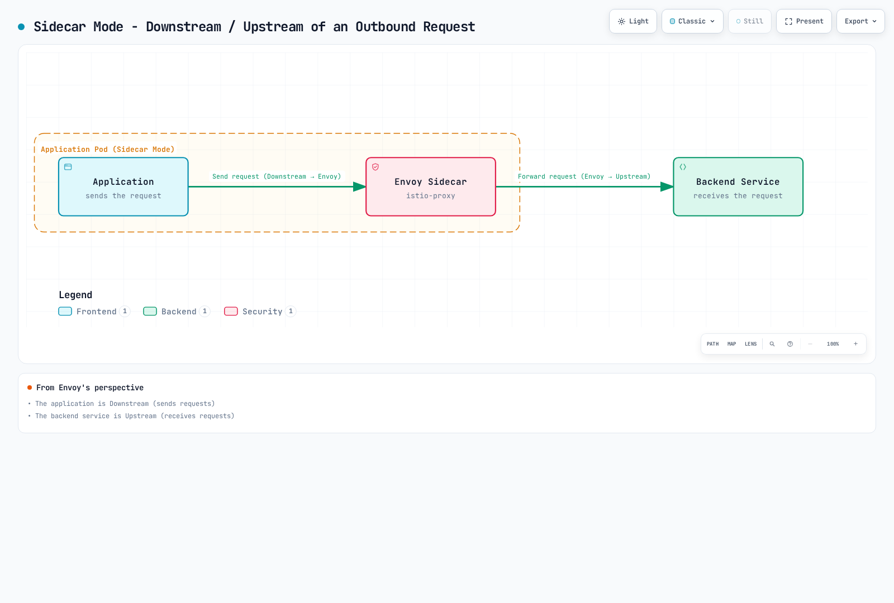
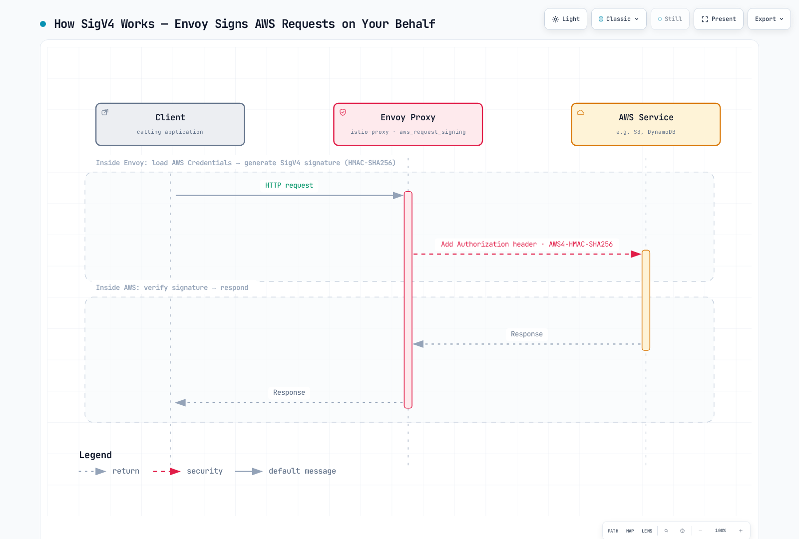

# Glosario de Istio

> **Versión revisada**: Istio 1.31.0
> **Última actualización**: September 13, 2026

Este glosario organiza los términos clave relacionados con Istio y Service Mesh (malla de servicios) en secciones de referencia agrupadas.

> **Idioma de referencia:** los enlaces de las secciones de Arquitectura y DestinationRule que aparecen a continuación apuntan a las guías en inglés, que son las mantenidas. Estos enlaces ofrecen la referencia actual allí donde las traducciones locales aún no se han sincronizado.

## Tabla de contenidos

- [A-C](#a-c)
- [D-F](#d-f)
- [G-I](#g-i)
- [J-L](#j-l)
- [M-O](#m-o)
- [P-R](#p-r)
- [S-U](#s-u)
- [V-Z](#v-z)

---

## A-C

### AuthorizationPolicy

Política de seguridad de Istio que define el comportamiento ALLOW, DENY, CUSTOM o AUDIT para las cargas de trabajo seleccionadas o los recursos de destino. La autenticación y la autorización son independientes; las políticas de waypoint usan targetRefs.

### Control Plane

Capa de configuración, descubrimiento y gestión de identidad, implementada por istiod. Las cargas útiles de las aplicaciones circulan por los proxies del data plane, no a través de istiod.

### Ambient Mode

Modo de data plane que se lanzó por primera vez como alpha en Istio 1.18 y está disponible de forma general desde Istio 1.24, y que proporciona la funcionalidad de service mesh sin Sidecar Proxies.

**Características**:
- No requiere contenedores Sidecar
- Usa ztunnel a nivel de nodo
- Mayor eficiencia de recursos
- Separación de las funciones L4 y L7

**Documentación relacionada**: [Ambient Mode](advanced/01-ambient-mode.md)

---

### Certificate Authority (CA)

Autoridad que emite y gestiona los certificados para la comunicación mTLS entre servicios.

**Función en Istio**:
- La función Citadel de Istiod desempeña el papel de CA
- Emite certificados basados en el SPIFFE ID
- Renovación automática de certificados (TTL predeterminado: 24 horas)

**Términos relacionados**: [Citadel](#citadel), [SPIFFE](#spiffe-secure-production-identity-framework-for-everyone), [mTLS](#mtls-mutual-tls)

---

### Circuit Breaker

Patrón que bloquea las solicitudes hacia servicios con fallos para evitar la propagación del fallo a todo el sistema.

**Cómo funciona**:
1. **Closed**: funcionamiento normal
2. **Open**: bloquea las solicitudes tras fallos consecutivos
3. **Half-Open**: permite algunas solicitudes después de cierto tiempo

**Implementación en Istio**: el corte de circuito del pool de conexiones y la expulsión de endpoints por outlier detection no exponen literalmente esta máquina de tres estados.
```yaml
apiVersion: networking.istio.io/v1
kind: DestinationRule
metadata:
  name: glossary-example-1
spec:
  host: reviews
  trafficPolicy:
    outlierDetection:
      consecutive5xxErrors: 5
      interval: 30s
      baseEjectionTime: 30s
```

**Documentación relacionada**: [Circuit Breaker](traffic-management/07-circuit-breaker.md)

---

### Citadel

Componente de seguridad que existió de forma independiente hasta Istio 1.4. Actualmente está integrado en Istiod.

**Funciones principales**:
- Gestión de la Certificate Authority (CA)
- Emisión y gestión de SPIFFE ID
- Generación y renovación de certificados X.509

**Estado actual**: existe como función interna de Istiod en Istio 1.5+

**Términos relacionados**: [Istiod](#istiod), [Certificate Authority](#certificate-authority-ca)

---

### CDS (Cluster Discovery Service)

Una de las APIs xDS que permite a Envoy recibir dinámicamente la configuración de los servicios upstream (clusters).

**Información que proporciona**:
- Nombre y tipo de cluster
- Política de balanceo de carga
- Configuración de health check
- Configuración de circuit breaker
- Configuración de TLS

**Términos relacionados**: [xDS](#xds-discovery-service), [Envoy](#envoy-proxy)

---

## D-F

### Data Plane

Capa que gestiona el tráfico real en una service mesh.

**El Data Plane de Istio**:
- Sidecars de Envoy, o ztunnel en ambient más waypoints L7 opcionales
- Gestiona el tráfico de la malla incorporado; se aplican exclusiones y límites de protocolo
- Cifrado/descifrado mTLS
- Recolección de métricas

**Términos relacionados**: [Control Plane](#control-plane), [Envoy](#envoy-proxy)

---

### DestinationRule

CRD de Istio que define las políticas para el tráfico enrutado por VirtualService.

**Funciones principales**:
- Definición de subsets (versión, región, etc.)
- Política de balanceo de carga
- Configuración del Connection Pool
- Configuración del Circuit Breaker
- Configuración de TLS

```yaml
apiVersion: networking.istio.io/v1
kind: DestinationRule
metadata:
  name: reviews
spec:
  host: reviews
  subsets:
  - name: v1
    labels:
      version: v1
  - name: v2
    labels:
      version: v2
```

**Documentación relacionada**: [DestinationRule](traffic-management/03-destination-rule.md)

---

### eBPF (Extended Berkeley Packet Filter)

Tecnología que permite ejecutar programas de forma segura dentro del kernel de Linux.

Istio puede coexistir con un CNI principal basado en eBPF, como Cilium. Istio CNI es un plugin encadenado/agente de nodo independiente que configura la redirección; ambient no requiere eBPF y no sustituye al CNI principal.

**Ventajas**:
- Poca sobrecarga
- Procesamiento a nivel de kernel
- Capacidad de programación dinámica

**Términos relacionados**: [Ambient Mode](#ambient-mode), [iptables](#iptables)

---

### EDS (Endpoint Discovery Service)

Una de las APIs xDS que proporciona dinámicamente los endpoints reales (IPs de los Pods) dentro de un cluster.

**Información que proporciona**:
- Direcciones IP y puertos de los endpoints
- Estado de salud
- Pesos de balanceo de carga
- Información de localidad

**Ejemplo**:
```json
{
  "cluster_name": "outbound|9080||reviews",
  "endpoints": [
    {
      "lb_endpoints": [
        {"endpoint": {"address": {"socket_address": {"address": "10.244.1.5", "port_value": 9080}}}},
        {"endpoint": {"address": {"socket_address": {"address": "10.244.2.8", "port_value": 9080}}}}
      ]
    }
  ]
}
```

**Términos relacionados**: [xDS](#xds-discovery-service), [CDS](#cds-cluster-discovery-service)

---

### Envoy Proxy

Proxy L7 de alto rendimiento que constituye el Data Plane de Istio.

**Historia**:
- Desarrollado por Matt Klein en Lyft en 2016
- Proyecto CNCF Incubating en 2017
- Proyecto CNCF Graduated en 2018

**Características clave**:
- Proxy de alto rendimiento escrito en C++
- Configuración dinámica mediante la API xDS
- Compatibilidad con HTTP/1.1, HTTP/2 y gRPC
- Observabilidad rica

**Componentes**:
- Listeners: escucha en puertos
- Filters: procesamiento de solicitudes/respuestas
- Routers: decisiones de enrutamiento
- Clusters: servicios upstream

**Documentación relacionada**: [Architecture - Envoy Proxy](https://www.atomai.click/kubernetes-docs/en/service-mesh/istio/03-architecture#data-plane-envoy-proxy)

---

## G-I

### Galley

Componente de validación de configuración que existió de forma independiente hasta Istio 1.4. Actualmente está integrado en Istiod.

**Funciones principales**:
- Validación de la configuración de Istio
- Procesamiento de recursos de Kubernetes
- Comprobación de errores antes de aplicar la configuración

**Estado actual**: existe como función interna de Istiod en Istio 1.5+

**Términos relacionados**: [Istiod](#istiod)

---

### Gateway

CRD de Istio que define los puntos de entrada del tráfico externo que llega a la Service Mesh.

**Tipos**:
1. **Ingress Gateway**: tráfico del exterior hacia el interior
2. **Egress Gateway**: tráfico del interior hacia el exterior

```yaml
apiVersion: networking.istio.io/v1
kind: Gateway
metadata:
  name: my-gateway
spec:
  selector:
    istio: ingressgateway
  servers:
  - port:
      number: 80
      name: http
      protocol: HTTP
    hosts:
    - "example.com"
```

**Documentación relacionada**: [Gateway and VirtualService](traffic-management/01-gateway-virtualservice.md)

---

### gRPC

Framework RPC (Remote Procedure Call) de alto rendimiento desarrollado por Google.

**Relación con Istio**:
- La API xDS está basada en gRPC
- Se usa para la comunicación entre Istiod y Envoy
- Basado en HTTP/2 (admite multiplexación)

**Ventajas**:
- Streaming bidireccional
- Baja latencia
- Usa Protocol Buffers

**Términos relacionados**: [xDS](#xds-discovery-service)

---

### Identity

Representa la identidad de una carga de trabajo dentro de la Service Mesh.

**La identidad en Istio**:
- Usa el formato SPIFFE ID
- Se basa en el ServiceAccount de Kubernetes
- Se demuestra mediante certificados X.509

**Ejemplo**:
```
spiffe://cluster.local/ns/default/sa/reviews
```

**Términos relacionados**: [SPIFFE](#spiffe-secure-production-identity-framework-for-everyone), [mTLS](#mtls-mutual-tls)

---

### iptables

Herramienta de firewall que controla el tráfico de red en Linux.

**Función en Istio**:
- istio-init o el agente de nodo de Istio CNI configura la redirección del tráfico
- Redirige todo el tráfico del Pod a Envoy
- Usa la tabla NAT (cadenas PREROUTING y OUTPUT)

**Reglas simplificadas (a modo ilustrativo, no es un script de instalación)**:
```bash
# Outbound: All traffic except Envoy -> 15001
iptables -t nat -A OUTPUT -p tcp -m owner ! --uid-owner 1337 -j REDIRECT --to-port 15001

# Inbound: All traffic -> 15006
iptables -t nat -A PREROUTING -p tcp -j REDIRECT --to-port 15006
```

**Alternativa de configuración**: Istio CNI realiza la configuración de red privilegiada a nivel de nodo.

**Documentación relacionada**: [Architecture - iptables](https://www.atomai.click/kubernetes-docs/en/service-mesh/istio/03-architecture#iptables-and-traffic-interception)

---

### Istiod

Componente unificado del Control Plane en Istio 1.5+.

**Funciones integradas**:
- **Pilot**: Service Discovery, Traffic Management
- **Citadel**: Certificate Authority, Identity
- **Galley**: validación de configuración

**Método de ejecución**:
- Un único binario de Go: `pilot-discovery`
- Todas las funciones se ejecutan en un solo proceso
- Puertos predeterminados: 15012 (xDS), 15017 (Webhook)

**Ventajas**:
- Menor complejidad
- Operación simplificada
- Eficiencia de recursos

**Documentación relacionada**: [Architecture - Istiod](https://www.atomai.click/kubernetes-docs/en/service-mesh/istio/03-architecture#control-plane-istiod)

---

## J-L

### LDS (Listener Discovery Service)

Una de las APIs xDS que permite a Envoy recibir dinámicamente los puertos en los que escuchar y las cadenas de filtros.

**Información que proporciona**:
- Dirección y puerto del listener
- Protocolo (HTTP, TCP)
- Configuración de la cadena de filtros
- Configuración de TLS

**Listeners predeterminados de Istio**:
- `0.0.0.0:15001`: TCP outbound
- `0.0.0.0:15006`: TCP inbound
- `0.0.0.0:15021`: health check
- `0.0.0.0:15090`: métricas de Prometheus

**Términos relacionados**: [xDS](#xds-discovery-service), [Envoy](#envoy-proxy)

---

### Locality-aware Load Balancing

Método de balanceo de carga que tiene en cuenta la información de localidad (Region, Zone).

**Prioridad**:
1. Endpoints en la misma Zone
2. Otra Zone en la misma Region
3. Otra Region

**Ejemplo de configuración**:
```yaml
apiVersion: networking.istio.io/v1
kind: DestinationRule
metadata:
  name: glossary-example-2
spec:
  host: reviews
  trafficPolicy:
    loadBalancer:
      localityLbSetting:
        enabled: true
        distribute:
        - from: us-west/zone-1a/*
          to:
            "us-west/zone-1a/*": 80
            "us-west/zone-1b/*": 20
```

**Documentación relacionada**: [Zone Aware Routing](resilience/03-zone-aware-routing.md)

---

## M-O

### Mixer

Componente de políticas y telemetría que existió hasta Istio 1.4.

**Funciones principales**:
- Aplicación de políticas (Rate Limiting, Access Control)
- Recolección de telemetría

**Motivos de su eliminación**:
- Sobrecarga de rendimiento (una llamada a Mixer por cada solicitud)
- Arquitectura compleja

**Estado actual**: quedó obsoleto durante la transición a 1.5; la funcionalidad restante de Mixer se eliminó en 1.8

**Términos relacionados**: [Istiod](#istiod)

---

### mTLS (Mutual TLS)

Método de comunicación TLS bidireccional en el que cliente y servidor se autentican mutuamente.

**El mTLS de Istio**:
- Emisión y renovación automáticas de certificados
- Autenticación basada en SPIFFE ID
- El cifrado TLS se negocia; no está fijado a AES-256-GCM

**Modos**:
1. **STRICT**: solo se permite mTLS
2. **PERMISSIVE**: se permite mTLS + texto plano (para migraciones)
3. **DISABLE**: deshabilita el mTLS de transporte de Istio en modo sidecar; no está soportado en ambient

```yaml
apiVersion: security.istio.io/v1
kind: PeerAuthentication
metadata:
  name: default
spec:
  mtls:
    mode: STRICT
```

**Documentación relacionada**: [mTLS](security/01-mtls.md)

---

### Outlier Detection

Funcionalidad que excluye automáticamente los endpoints que muestran un comportamiento anómalo.

**Condiciones de detección**:
- Número de errores consecutivos
- Tasa de errores
- Fallos de conexión/timeouts; la latencia por sí sola no es un umbral de expulsión por outlier

```yaml
apiVersion: networking.istio.io/v1
kind: DestinationRule
metadata:
  name: glossary-example-3
spec:
  host: reviews
  trafficPolicy:
    outlierDetection:
      consecutive5xxErrors: 5
      interval: 30s
      baseEjectionTime: 30s
      maxEjectionPercent: 50
```

**Documentación relacionada**: [Outlier Detection](resilience/01-outlier-detection.md)

---

## P-R

### Downstream

Desde la perspectiva de Envoy, se refiere a **la parte que envía las solicitudes**. Es decir, el cliente que inicia una conexión hacia Envoy.

**El Downstream de Envoy**:
- Conexiones que llegan a Envoy (Inbound)
- Cliente que envía las solicitudes
- Conexiones recibidas por el Listener

**Flujo de tráfico**:
```
Downstream (Client)  ->  Envoy Proxy  ->  Upstream (Backend)
```

**Escenarios de ejemplo**:

#### 1. Modo Sidecar: solicitud outbound



[🔍 Ver diagrama interactivo](https://www.atomai.click/kubernetes-docs/archmaps/en-service-mesh-istio-glossary-0.html)

**Perspectiva**:
- **Desde la vista de Envoy**: la aplicación es Downstream (envía solicitudes)
- **Desde la vista de Envoy**: el servicio backend es Upstream (recibe solicitudes)

#### 2. Ingress Gateway: solicitud externa


[🔍 Ver diagrama interactivo](https://www.atomai.click/kubernetes-docs/archmaps/en-service-mesh-istio-glossary-1.html)

**Configuración de Envoy relacionada con Downstream**:

```yaml
# Listener - Receive Downstream connections
apiVersion: networking.istio.io/v1alpha3
kind: EnvoyFilter
metadata:
  name: downstream-config
  namespace: default
spec:
  workloadSelector:
    labels:
      app: reviews
  configPatches:
  - applyTo: LISTENER
    match:
      context: SIDECAR_INBOUND
    patch:
      operation: MERGE
      value:
        per_connection_buffer_limit_bytes: 32768  # Downstream buffer
```

**Métricas de Downstream**:
```bash
# Downstream connection count
envoy_listener_downstream_cx_active

# Downstream request count
envoy_http_downstream_rq_total

# Downstream response time
envoy_http_downstream_rq_time
```

**Términos relacionados**: [Upstream](#upstream), [Envoy](#envoy-proxy), [Listener](#lds-listener-discovery-service)

---

### Upstream

Desde la perspectiva de Envoy, se refiere a **la parte que recibe las solicitudes**. Es decir, el servicio backend hacia el que Envoy inicia una conexión.

**El Upstream de Envoy**:
- Conexiones que salen de Envoy (Outbound)
- Servicio backend que procesa las solicitudes
- Endpoints gestionados por el Cluster

**Flujo de tráfico**:
```
Downstream (Client)  ->  Envoy Proxy  ->  Upstream (Backend)
```

**Componentes de Upstream**:

#### 1. Cluster (grupo de Upstream)

```yaml
# Define Upstream Cluster with DestinationRule
apiVersion: networking.istio.io/v1
kind: DestinationRule
metadata:
  name: reviews
spec:
  host: reviews  # Upstream service
  trafficPolicy:
    loadBalancer:
      simple: ROUND_ROBIN
    connectionPool:
      tcp:
        maxConnections: 100      # Upstream connection limit
      http:
        http1MaxPendingRequests: 50
        http2MaxRequests: 100
    outlierDetection:
      consecutive5xxErrors: 5        # Upstream failure detection
      interval: 30s
```

#### 2. Endpoint (instancia real de Upstream)

```bash
# Check upstream endpoints
istioctl proxy-config endpoints <pod-name> | grep reviews

# Example output:
# ENDPOINT              STATUS      CLUSTER
# 10.244.1.5:9080       HEALTHY     outbound|9080||reviews.default.svc.cluster.local
# 10.244.2.8:9080       HEALTHY     outbound|9080||reviews.default.svc.cluster.local
# 10.244.3.12:9080      UNHEALTHY   outbound|9080||reviews.default.svc.cluster.local
```

**Política de tráfico de Upstream**:

```yaml
apiVersion: networking.istio.io/v1
kind: DestinationRule
metadata:
  name: glossary-example-4
spec:
  host: reviews
  trafficPolicy:
    # Upstream load balancing
    loadBalancer:
      consistentHash:
        httpHeaderName: "x-user-id"

    # Upstream connection pool
    connectionPool:
      tcp:
        maxConnections: 100
        connectTimeout: 30s
      http:
        h2UpgradePolicy: UPGRADE

    # Upstream TLS
    tls:
      mode: ISTIO_MUTUAL

    # Upstream Circuit Breaker
    outlierDetection:
      consecutive5xxErrors: 5
      interval: 10s
      baseEjectionTime: 30s
```

**Comparación entre Upstream y Downstream**:

| Elemento | Downstream | Upstream |
|------|-----------|----------|
| **Dirección** | Entra en Envoy (Inbound) | Sale de Envoy (Outbound) |
| **Función** | Envía solicitudes (Client) | Recibe solicitudes (Server) |
| **Configuración de Envoy** | Listener, Filter Chain | Cluster, Endpoint |
| **Ejemplos** | Usuarios externos, otros servicios | API backend, base de datos |
| **Métricas** | `downstream_cx_*`, `downstream_rq_*` | `upstream_cx_*`, `upstream_rq_*` |

**Ejemplos del mundo real**:

#### Escenario 1: llamada del Servicio A -> Servicio B

```
+---------------------------------------------------------+
| Service A Pod                                           |
|                                                         |
|  App --> Envoy Sidecar                                 |
|          |                                              |
|          | Downstream: App                              |
|          | Upstream: Service B                          |
+----------|-------------------------------------------------+
           |
           v
+---------------------------------------------------------+
| Service B Pod                                           |
|                                                         |
|          Envoy Sidecar --> App                          |
|          |                                              |
|          | Downstream: Service A Envoy                  |
|          | Upstream: Local App (Service B)              |
+---------------------------------------------------------+
```

**Perspectiva del Envoy del Servicio A**:
- Downstream: la aplicación del Servicio A
- Upstream: el Servicio B

**Perspectiva del Envoy del Servicio B**:
- Downstream: el Envoy del Servicio A
- Upstream: la aplicación del Servicio B (local)

#### Escenario 2: Ingress Gateway

```
External Client (Downstream)
        |
Ingress Gateway (Envoy)
        |
Internal Service (Upstream)
```

**Métricas de Upstream**:

```bash
# Upstream connection count
envoy_cluster_upstream_cx_active

# Upstream request counter; derive success/error rates from response-class counters
envoy_cluster_upstream_rq_total

# Upstream response time
envoy_cluster_upstream_rq_time

# Upstream health check
envoy_cluster_health_check_success

# Upstream Circuit Breaker
envoy_cluster_circuit_breakers_default_remaining_rq
```

**Detección pasiva del estado de Upstream**: las estadísticas de health check activo requieren una configuración aparte.

```yaml
apiVersion: networking.istio.io/v1
kind: DestinationRule
metadata:
  name: glossary-example-5
spec:
  host: reviews
  trafficPolicy:
    outlierDetection:
      # Upstream health detection
      consecutiveGatewayErrors: 5
      consecutive5xxErrors: 5
      interval: 10s
      baseEjectionTime: 30s
      maxEjectionPercent: 50
```

**Depuración**:

```bash
# 1. Check upstream cluster
istioctl proxy-config clusters <pod-name> --fqdn reviews.default.svc.cluster.local

# 2. Check upstream endpoint status
istioctl proxy-config endpoints <pod-name> --cluster "outbound|9080||reviews.default.svc.cluster.local"

# 3. Check upstream metrics
kubectl exec <pod-name> -c istio-proxy -- \
  curl -s localhost:15000/stats/prometheus | grep upstream

# 4. Check upstream connections
istioctl proxy-config all <pod-name> -o json | \
  jq '.configs[] | select(.["@type"] | contains("ClustersConfigDump"))'
```

**Términos relacionados**: [Downstream](#downstream), [Envoy](#envoy-proxy), [Cluster](#cds-cluster-discovery-service), [Endpoint](#eds-endpoint-discovery-service)

---

### Pilot

Componente de gestión de tráfico que existió de forma independiente hasta Istio 1.4. Actualmente está integrado en Istiod.

**Funciones principales**:
- Service Discovery
- Gestión de tráfico (procesamiento de VirtualService y DestinationRule)
- Servidor xDS

**Estado actual**: existe como función interna de Istiod en Istio 1.5+

**Términos relacionados**: [Istiod](#istiod), [xDS](#xds-discovery-service)

---

### RDS (Route Discovery Service)

Una de las APIs xDS que proporciona dinámicamente las reglas de enrutamiento HTTP.

**Información que proporciona**:
- Reglas de coincidencia de rutas (path, headers, etc.)
- Enrutamiento basado en pesos
- Reglas de redirección y reescritura
- Configuración de timeout y retry

**Relación con VirtualService**:
- VirtualService -> convertido por Istiod -> configuración RDS

**Términos relacionados**: [xDS](#xds-discovery-service), [VirtualService](#virtualservice)

---

### Rate Limiting

Funcionalidad que limita el número de solicitudes permitidas por unidad de tiempo.

**Métodos de implementación**:
1. **Local Rate Limiting**: procesado localmente por Envoy
2. **Global Rate Limiting**: usa un servicio externo de Rate Limit

```yaml
apiVersion: networking.istio.io/v1alpha3
kind: EnvoyFilter
metadata:
  name: filter-local-ratelimit
  namespace: default
spec:
  workloadSelector:
    labels:
      app: reviews
  configPatches:
  - applyTo: HTTP_FILTER
    match:
      context: SIDECAR_INBOUND
      listener:
        filterChain:
          filter:
            name: envoy.filters.network.http_connection_manager
            subFilter:
              name: envoy.filters.http.router
    patch:
      operation: INSERT_BEFORE
      value:
        name: envoy.filters.http.local_ratelimit
        typed_config:
          "@type": type.googleapis.com/envoy.extensions.filters.http.local_ratelimit.v3.LocalRateLimit
          stat_prefix: http_local_rate_limiter
          token_bucket:
            max_tokens: 100
            tokens_per_fill: 100
            fill_interval: 1s
          filter_enabled:
            default_value:
              numerator: 100
              denominator: HUNDRED
          filter_enforced:
            default_value:
              numerator: 100
              denominator: HUNDRED
```

**Documentación relacionada**: [Rate Limiting](resilience/02-rate-limiting.md)

---

## S-U

### SDS (Secret Discovery Service)

Una de las APIs xDS que proporciona dinámicamente certificados y claves TLS.

**Información que proporciona**:
- Certificados X.509
- Clave privada (Private Key)
- Certificado raíz de la CA

**Ventajas**:
- No requiere sistema de archivos
- Renovación automática de certificados
- Renovación sin interrupciones

**Términos relacionados**: [xDS](#xds-discovery-service), [mTLS](#mtls-mutual-tls)

---

### Service Entry

CRD de Istio que registra en la malla servicios externos a la Service Mesh.

**Casos de uso**:
- Control de acceso a APIs externas
- Aplicar funciones de Istio a servicios externos (Retry, Timeout, etc.)
- Integración con Egress Gateway

```yaml
apiVersion: networking.istio.io/v1
kind: ServiceEntry
metadata:
  name: external-api
spec:
  hosts:
  - api.external.com
  ports:
  - number: 443
    name: https
    protocol: HTTPS
  location: MESH_EXTERNAL
  resolution: DNS
```

**Documentación relacionada**: [ServiceEntry](traffic-management/12-service-entry.md)

---

### Service Mesh

Capa de infraestructura que gestiona la comunicación entre microservicios.

**Funciones principales**:
- Gestión de tráfico (enrutamiento, balanceo de carga)
- Seguridad (mTLS, autenticación/autorización)
- Observabilidad (métricas, logs, trazas)
- Resiliencia (Retry, Circuit Breaker)

**Implementaciones principales**:
- Istio
- Linkerd
- Consul Connect
- AWS App Mesh ([el soporte finaliza el 30 de septiembre de 2026](https://docs.aws.amazon.com/app-mesh/latest/userguide/what-is-app-mesh.html))

---

### SigV4 (AWS Signature Version 4)

Protocolo de firma para autenticar las solicitudes a las APIs de AWS.

**Cómo funciona**:



[🔍 Ver diagrama interactivo](https://www.atomai.click/kubernetes-docs/archmaps/en-service-mesh-istio-glossary-2.html)

**Componentes de la firma**:

1. **Canonical Request**: formato estandarizado de la solicitud
   - Método HTTP
   - Ruta URI
   - Cadena de consulta
   - Headers
   - Hash del payload

2. **String to Sign**: cadena que se va a firmar
   - Algoritmo: `AWS4-HMAC-SHA256`
   - Marca de tiempo
   - Credential Scope
   - Hash de la Canonical Request

3. **Signing Key**: cálculo de la clave de firma
   ```
   HMAC(HMAC(HMAC(HMAC("AWS4" + SecretKey, Date), Region), Service), "aws4_request")
   ```

4. **Signature**: firma final
   ```
   HMAC(SigningKey, StringToSign)
   ```

**Integración con Istio**:

Los SDK de AWS y la AWS CLI firman las solicitudes HTTPS con credenciales temporales proporcionadas por IRSA o EKS Pod Identity. Así la firma queda asociada a los permisos de AWS de la carga de trabajo. La identidad mTLS de Istio y la identidad de AWS IAM son independientes.

El filtro HTTP `aws_request_signing` de Envoy es una alternativa avanzada. Requiere una compilación de Envoy que incluya la extensión, credenciales disponibles para el **contenedor del proxy**, el servicio/región de AWS correctos y una coincidencia de filtro restringida al destino de AWS previsto. Insértalo antes del router y después de cualquier reescritura de headers o rutas que afecte a la firma. El HTTPS originado por la aplicación es opaco para este filtro HTTP: Envoy no puede añadir una firma dentro de TLS cifrado. Un diseño de firma en el proxy debe presentar HTTP al proxy que firma y originar TLS verificado hacia el upstream; evita la doble originación de TLS o exponer HTTP sin firmar más allá de la ruta local prevista del proxy.

El diagrama anterior describe esta ruta de proxy de firma configurada explícitamente, no una capacidad predeterminada de Istio. Una anotación de IRSA en el ServiceAccount de la aplicación no demuestra por sí sola que un gateway o un sidecar disponga del entorno de credenciales y del montaje de token que necesita.

**La autenticación no es validación de JWT**:

SigV4 es una firma HMAC de la solicitud, no un JWT. `https://sts.amazonaws.com/.well-known/jwks` no es un endpoint de emisor de JWT para validar firmas de las APIs de AWS. RequestAuthentication de Istio valida JWT de un emisor OIDC real. Una AuthorizationPolicy CUSTOM requiere además un servicio configurado en `extensionProviders` que implemente autorización externa; sin esa implementación no puede validar SigV4. Es preferible usar endpoints de AWS autenticados con IAM o el SDK de AWS para acceder a las APIs de AWS.

**Ejemplo de verificación de solo lectura** (AWS CLI instalada en la carga de trabajo, con su rol de IAM previsto):

```bash
aws sts get-caller-identity
aws s3api head-object --bucket my-bucket --key object.txt --region us-west-2
```

**Consideraciones operativas**:

- Concede a la carga de trabajo solo las acciones y los recursos de AWS necesarios. Evita depender de un rol de instancia de nodo compartido.
- Confirma que el proveedor de credenciales seleccionado admite credenciales temporales y su renovación. La duración de la sesión es configurable, no es universalmente de una hora.
- Los eventos de administración y los eventos de datos de CloudTrail tienen coberturas distintas; el acceso a objetos de S3 requiere la configuración adecuada de eventos de datos.
- Inspecciona la configuración del proxy para confirmar la ubicación del filtro. Un config dump no muestra el header Authorization de cada solicitud en vivo, y un curl sin firmar sobre HTTPS no es una prueba de SigV4.
- Mide la sobrecarga de firma, buffering y obtención de credenciales para los tamaños de solicitud reales; no se garantiza una sobrecarga fija en milisegundos.

**Términos relacionados**: [AuthorizationPolicy](#authorizationpolicy), [ServiceEntry](#service-entry), [EnvoyFilter](advanced/03-envoy-filter.md)

**Referencias**:
- [AWS Signature Version 4](https://docs.aws.amazon.com/general/latest/gr/signature-version-4.html)
- [Envoy AWS Request Signing](https://www.envoyproxy.io/docs/envoy/latest/configuration/http/http_filters/aws_request_signing_filter)
- [AWS Integration](04-aws-integration.md)

---

### Sidecar

Patrón de contenedor auxiliar que se despliega junto al contenedor de la aplicación.

**El Sidecar de Istio**:
- Nombre del contenedor: `istio-proxy`
- Imagen: `istio/proxyv2`
- Ejecuta Envoy Proxy
- Intercepta el tráfico configurado mediante el init-container o la redirección de Istio CNI

**Métodos de inyección**:
1. **Automática**: label del Namespace
2. **Manual**: `istioctl kube-inject`

```yaml
apiVersion: v1
kind: Namespace
metadata:
  name: example-mesh
  labels:
    istio-injection: enabled  # Automatic injection
```

**Documentación relacionada**: [Sidecar Injection](advanced/07-sidecar-injection.md)

---

### Sidecar Resource

CRD de Istio que limita la información de servicios que recibe Envoy.

**Propósito**:
- Reducir el uso de memoria
- Acortar el tiempo de push de configuración
- Delimitar el alcance de la configuración; no es un límite de seguridad de red

```yaml
apiVersion: networking.istio.io/v1
kind: Sidecar
metadata:
  name: default
  namespace: default
spec:
  egress:
  - hosts:
    - "./*"  # Same namespace only
    - "istio-system/*"
```

**Efecto**:
- Importar menos servicios puede reducir la memoria y el trabajo de configuración; mide el ahorro real.

**Documentación relacionada**: [Architecture - Sidecar Resource](https://www.atomai.click/kubernetes-docs/en/service-mesh/istio/03-architecture#optimization-with-sidecar-resource)

---

### SPIFFE (Secure Production Identity Framework for Everyone)

Estándar para demostrar la identidad de las cargas de trabajo en entornos cloud-native.

**Formato del SPIFFE ID**:
```
spiffe://trust-domain/path
```

**Ejemplo en Istio**:
```
spiffe://cluster.local/ns/default/sa/reviews
  |         |           |     |      |    |
  |         |           |     |      |    +- ServiceAccount name
  |         |           |     |      +----- "sa" (ServiceAccount)
  |         |           |     +------------ Namespace name
  |         |           +------------------ "ns" (Namespace)
  |         +------------------------------ Trust Domain
  +---------------------------------------- Protocol
```

**Componentes**:
- **SPIFFE ID**: identificador de la carga de trabajo
- **SVID (SPIFFE Verifiable Identity Document)**: X.509-SVID o JWT-SVID; el mTLS de Istio usa X.509-SVID

**Términos relacionados**: [Identity](#identity), [mTLS](#mtls-mutual-tls)

---

### Subset

Agrupación lógica de servicios definida en un DestinationRule.

**Usos habituales**:
- Por versión: `v1`, `v2`, `v3`
- Por etapa de despliegue: `stable`, `canary`, `test`
- Por región: `us-west`, `us-east`, `eu-central`

```yaml
apiVersion: networking.istio.io/v1
kind: DestinationRule
metadata:
  name: glossary-example-6
spec:
  host: reviews
  subsets:
  - name: v1
    labels:
      version: v1
  - name: v2
    labels:
      version: v2
```

**Documentación relacionada**: [DestinationRule - Subset Concept](https://www.atomai.click/kubernetes-docs/en/service-mesh/istio/traffic-management/03-destination-rule#subset-concept)

---

## V-Z

### Waypoint Proxy

Proxy opcional que proporciona funcionalidad L7 en Ambient Mode.

**Función**:
- Se selecciona con labels de namespace, Service o Pod; no automáticamente por ServiceAccount
- Basado en Envoy Proxy
- Dedicado a las funciones de gestión de tráfico L7
- Funciona junto con ztunnel

**Funciones que proporciona**:
- Enrutamiento L7 (basado en Path y Header)
- Retry y Timeout
- Circuit Breaker
- Fault Injection
- Manipulación de headers

**Ejemplo de despliegue**:
```yaml
apiVersion: gateway.networking.k8s.io/v1
kind: Gateway
metadata:
  name: reviews-waypoint
  namespace: default
spec:
  gatewayClassName: istio-waypoint
  listeners:
  - name: mesh
    port: 15008
    protocol: HBONE
```

**Características**:
- ztunnel gestiona solo L4, el waypoint gestiona L7
- Uso selectivo solo para los servicios que lo necesitan
- Más eficiente en recursos que el Sidecar (enfoque compartido)
- Se selecciona con labels de namespace, Service o Pod; no automáticamente por ServiceAccount

**Términos relacionados**: [Ambient Mode](#ambient-mode), [ztunnel](#ztunnel-zero-trust-tunnel)

---

Después de crear el waypoint, incorpora el servicio previsto, por ejemplo `kubectl label service reviews istio.io/use-waypoint=reviews-waypoint --overwrite`. Desplegar solo un Gateway no hace que el tráfico pase por él.

### VirtualService

CRD de Istio que define cómo se enruta el tráfico dentro de la Service Mesh.

**Funciones principales**:
- Enrutamiento basado en URI, headers y parámetros de consulta
- Distribución del tráfico basada en pesos
- Configuración de Retry y Timeout
- Fault Injection

```yaml
apiVersion: networking.istio.io/v1
kind: VirtualService
metadata:
  name: reviews
spec:
  hosts:
  - reviews
  http:
  - match:
    - uri:
        prefix: "/v2"
    route:
    - destination:
        host: reviews
        subset: v2
  - route:
    - destination:
        host: reviews
        subset: v1
```

**Documentación relacionada**: [Gateway and VirtualService](traffic-management/01-gateway-virtualservice.md)

---

### WASM (WebAssembly)

Formato de instrucciones binario diseñado para ejecutarse en navegadores web. En Istio se usa para ampliar la funcionalidad del proxy Envoy.

**Uso en Istio**:
- Añadir lógica personalizada como filtro de Envoy
- Ampliar la funcionalidad de forma dinámica sin volver a desplegar
- Se puede escribir en varios lenguajes (Rust, C++, Go, etc.)
- Se ejecuta de forma segura en un entorno sandbox

**Casos de uso principales**:
1. **Autenticación/autorización personalizada**: implementar lógica de negocio compleja
2. **Transformación de solicitudes/respuestas**: manipulación de headers, transformación del payload
3. **Enrutamiento avanzado**: lógica de enrutamiento personalizada
4. **Recolección de métricas**: telemetría especializada

Las URLs de registro, los digests, las credenciales y los campos pluginConfig que aparecen a continuación son valores de ejemplo para tu propio plugin compilado; Istio no proporciona esas imágenes de ejemplo ni interpreta las opciones específicas del plugin. Un módulo file:// debe existir dentro del contenedor del proxy.

**Ejemplo de plugin WASM**:
```yaml
apiVersion: extensions.istio.io/v1alpha1
kind: WasmPlugin
metadata:
  name: custom-auth
  namespace: istio-system
spec:
  selector:
    matchLabels:
      istio: ingressgateway
  url: oci://ghcr.io/my-org/custom-auth:v1.0.0
  phase: AUTHN
  pluginConfig:
    api_key_header: "X-API-Key"
    validate_endpoint: "https://auth.example.com/validate"
```

**Métodos de despliegue**:

#### 1. Despliegue mediante registro OCI (recomendado)

```yaml
apiVersion: extensions.istio.io/v1alpha1
kind: WasmPlugin
metadata:
  name: rate-limiter
spec:
  url: oci://ghcr.io/my-org/rate-limit:v1.0.0
  imagePullPolicy: Always
  imagePullSecret: registry-credential
```

#### 2. Despliegue mediante URL HTTP

```yaml
apiVersion: extensions.istio.io/v1alpha1
kind: WasmPlugin
metadata:
  name: custom-filter
spec:
  url: https://example.com/filters/custom-filter.wasm
  # Add sha256: with the actual 64-character module digest before deployment
```

#### 3. Despliegue desde archivo local

```yaml
apiVersion: extensions.istio.io/v1alpha1
kind: WasmPlugin
metadata:
  name: local-filter
spec:
  url: file:///etc/istio/filters/custom.wasm
```

**Ejemplo de desarrollo WASM (Rust)**:

```rust
use proxy_wasm::traits::*;
use proxy_wasm::types::*;

proxy_wasm::main! {{
    proxy_wasm::set_http_context(|_, _| -> Box<dyn HttpContext> {
        Box::new(CustomFilter)
    });
}}

struct CustomFilter;
impl Context for CustomFilter {}

impl HttpContext for CustomFilter {
    fn on_http_request_headers(&mut self, _: usize, _: bool) -> Action {
        // Demonstrate header mutation, not production API-key authentication.
        self.set_http_request_header("x-mesh-demo", Some("wasm"));
        Action::Continue
    }
}
```

**Requisitos previos de compilación y despliegue**:

Usa un crate de Rust `cdylib` con una dependencia `proxy-wasm` compatible y una versión de dependencia fijada. El callback anterior sigue el [ejemplo oficial del SDK de Rust](https://github.com/proxy-wasm/proxy-wasm-rust-sdk/tree/main/examples/http_headers). Instala el target `wasm32-unknown-unknown`, compila el módulo y empaqueta el `.wasm` resultante en una imagen OCI Wasm compatible antes de referenciarlo desde WasmPlugin. Un `docker build` genérico sin Dockerfile no realiza ese empaquetado.

```bash
rustup target add wasm32-unknown-unknown
cargo build --target wasm32-unknown-unknown --release
```

Mide el tiempo de arranque, la memoria y la sobrecarga por solicitud del plugin concreto. Wasm se ejecuta en un sandbox de runtime dentro del proceso del proxy; no es un proceso aparte ni una garantía incondicional de seguridad o rendimiento.

**Compatibilidad con Ambient Mode**:

```yaml
apiVersion: extensions.istio.io/v1alpha1
kind: WasmPlugin
metadata:
  name: waypoint-filter
spec:
  targetRefs:
  - group: gateway.networking.k8s.io
    kind: Gateway
    name: reviews-waypoint
  url: oci://ghcr.io/filters/custom:latest
  phase: AUTHN
```

**Depuración**:

```bash
# Check WASM plugin status
kubectl get wasmplugin -A

# Check WASM-related logs in Envoy logs
kubectl logs <pod-name> -c istio-proxy | grep wasm

# Check WASM module load
istioctl proxy-config all <pod-name> -o json | jq '.. | objects | select(has("@type")) | select(.["@type"] | test("wasm"; "i"))'
```

**Consideraciones de seguridad**:
1. **Aislamiento del sandbox**: sandbox de runtime dentro de Envoy; revisa la confianza en el plugin y su uso de recursos
2. **Límites de recursos**: se pueden configurar límites de CPU y memoria
3. **Verificación de integridad**: SHA256 comprueba el contenido, no autentica al publicador
4. **Mínimo privilegio**: concede solo los permisos necesarios

**Ventajas**:
- Alto rendimiento (a nivel de código nativo)
- Ejecución segura en sandbox
- Actualizable sin volver a desplegar
- Compatibilidad con múltiples lenguajes
- Formato estándar de imagen OCI

**Limitaciones**:
- Algunas llamadas al sistema están restringidas
- E/S de archivos limitada
- Llamadas de red solo a través de la API de Envoy

**Términos relacionados**: [Envoy](#envoy-proxy), [Waypoint Proxy](#waypoint-proxy), [Ambient Mode](#ambient-mode)

**Referencias**:
- [Istio WASM Plugin](https://istio.io/latest/docs/reference/config/proxy_extensions/wasm-plugin/)
- [Proxy-Wasm SDK](https://github.com/proxy-wasm)
- [WebAssembly Official Site](https://webassembly.org/)
- [Ambient Mode - WASM](https://istio.io/latest/docs/ambient/usage/extend-waypoint-wasm/)

---

### xDS (Discovery Service)

Conjunto de APIs para la configuración dinámica de Envoy Proxy.

**Significado de "xDS"**:
- `x`: variable que representa varios tipos
- `DS`: Discovery Service

**Tipos de API xDS**:

| API | Nombre | Función |
|-----|------|------|
| **LDS** | Listener Discovery Service | Puertos de escucha y cadenas de filtros |
| **RDS** | Route Discovery Service | Reglas de enrutamiento HTTP |
| **CDS** | Cluster Discovery Service | Configuración de los servicios upstream |
| **EDS** | Endpoint Discovery Service | Lista real de IPs de Pods |
| **SDS** | Secret Discovery Service | Certificados y claves TLS |

**Método de comunicación**:
- Protocolo: gRPC
- Puerto: 15012 (Istiod)
- Streaming bidireccional

**Orden**:
```
Agent bootstraps identity -> Envoy subscribes to ADS resources
Istiod pushes LDS/CDS/EDS/RDS updates; local agent serves SDS certificates
```

**Documentación relacionada**: [Architecture - xDS API Communication](https://www.atomai.click/kubernetes-docs/en/service-mesh/istio/03-architecture#xds-api-communication)

---

### Zone

Representa una Availability Zone de Kubernetes.

**Formato del label**:
```yaml
topology.kubernetes.io/zone: us-west-1a
```

**Uso en Istio**:
- Locality-aware Load Balancing
- Zone Aware Routing
- Enrutamiento con prioridad a la misma Zone

**Términos relacionados**: [Locality-aware Load Balancing](#locality-aware-load-balancing)

---

### ztunnel (Zero Trust Tunnel)

Componente central de Ambient Mode: un proxy L4 ligero que se ejecuta a nivel de nodo.

**Función**:
- Se despliega como DaemonSet en cada nodo
- Gestiona el tráfico L4 de todos los Pods
- Proporciona funcionalidad de service mesh sin Sidecar
- Se integra con el plugin CNI

**Funciones que proporciona**:
- **mTLS**: cifrado/descifrado automático
- **Telemetría L4**: recolección de métricas
- **Identity**: autenticación basada en Service Account
- **Balanceo de carga L4**: balanceo de carga básico

**Características técnicas**:
- Escrito en Rust (alto rendimiento)
- Redirección de tráfico gestionada por Istio CNI
- No requiere Init Container
- Recursos de proxy L4 compartidos; dimensiónalos según la carga de trabajo medida del nodo

**Ejemplo de despliegue**:
```bash
# Use the reviewed istioctl version and the complete ambient installation profile
istioctl install --set profile=ambient
kubectl rollout status daemonset/ztunnel -n istio-system
```

Para una carga de trabajo existente con sidecar, elimina los labels de inyección/revisión y reinicia los Pods para quitar los sidecars antes de incorporarla a ambient; una carga de trabajo nueva sin sidecar no necesita reinicio.

**Activación por Namespace**:
```bash
# Enable Ambient Mode
kubectl label namespace default istio-injection- istio.io/rev-
kubectl label namespace default istio.io/dataplane-mode=ambient --overwrite
```

**Ventajas**:
- El posible ahorro de memoria depende del nodo/carga de trabajo y de la capacidad del waypoint
- No requiere reiniciar los Pods
- Transparencia para la aplicación
- Latencia inicial minimizada

**Limitaciones**:
- Se requiere Waypoint Proxy para las funciones L7
- Requiere una plataforma de Kubernetes sobre Linux compatible, un CNI principal y los requisitos previos de Istio CNI

**Términos relacionados**: [Ambient Mode](#ambient-mode), [Waypoint Proxy](#waypoint-proxy), [eBPF](#ebpf-extended-berkeley-packet-filter)

---

## Referencias

### Documentación oficial
- [Istio Glossary](https://istio.io/latest/docs/reference/glossary/)
- [Envoy Terminology](https://www.envoyproxy.io/docs/envoy/latest/intro/arch_overview/intro/terminology)
- [SPIFFE Specification](https://github.com/spiffe/spiffe/tree/main/standards)

### Documentación relacionada
- [Istio Architecture](03-architecture.md)
- [Traffic Management](traffic-management/README.md)
- [Security](security/README.md)
- [Observability](observability/README.md)

---

**Última actualización**: September 13, 2026

- [Destination Rule](https://istio.io/latest/docs/reference/config/networking/destination-rule/)
- [Install the Istio CNI node agent](https://istio.io/latest/docs/setup/additional-setup/cni/)
- [Ztunnel traffic redirection](https://istio.io/latest/docs/ambient/architecture/traffic-redirection/)
- [Install with istioctl](https://istio.io/latest/docs/ambient/install/istioctl/)
- [Configure waypoint proxies](https://istio.io/latest/docs/ambient/usage/waypoint/)
- [Enabling Rate Limits using Envoy](https://istio.io/latest/docs/tasks/policy-enforcement/rate-limit/)
- [Wasm Plugin](https://istio.io/latest/docs/reference/config/proxy_extensions/wasm-plugin/)
- [Proxy-Wasm Rust SDK HTTP example](https://raw.githubusercontent.com/proxy-wasm/proxy-wasm-rust-sdk/main/examples/http_headers/src/lib.rs)
- [AWS Signature Version 4 for API requests - AWS Identity and Access Management](https://docs.aws.amazon.com/IAM/latest/UserGuide/reference_sigv.html)
- [AWS Request Signing](https://www.envoyproxy.io/docs/envoy/latest/configuration/http/http_filters/aws_request_signing_filter)
- [Statistics](https://www.envoyproxy.io/docs/envoy/latest/configuration/upstream/cluster_manager/cluster_stats)
- [Istio 1.8 Change Notes](https://istio.io/latest/news/releases/1.8.x/announcing-1.8/change-notes/)
- [What Is AWS App Mesh? - AWS App Mesh](https://docs.aws.amazon.com/app-mesh/latest/userguide/what-is-app-mesh.html)

- [CloudTrail data event coverage](https://docs.aws.amazon.com/awscloudtrail/latest/userguide/logging-data-events-with-cloudtrail.html)
