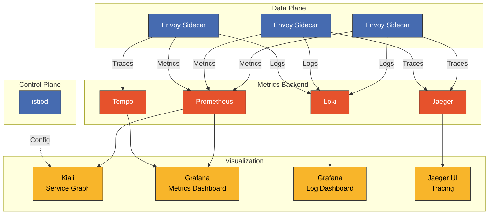

# Dashboards de Istio

> **Versiones compatibles**: Istio 1.28
> **Última actualización**: February 19, 2026

Visualice y supervise de forma integral el service mesh de Istio con Grafana, Kiali y Prometheus.

## Tabla de contenido

1. [Descripción general de los dashboards](#dashboard-overview)
2. [Kiali](#kiali)
3. [Dashboards de Grafana](#grafana-dashboards)
4. [Prometheus](#prometheus)
5. [Creación de dashboards personalizados](#creating-custom-dashboards)
6. [Integración de dashboards](#dashboard-integration)
7. [Mejores prácticas](#best-practices)

## Descripción general de los dashboards

### Arquitectura del stack de observabilidad



### Propósito por herramienta

| Herramienta | Uso principal | Fuente de datos |
|------|-------------|-------------|
| **Kiali** | Topología de Service, análisis de tráfico, validación de configuración | Prometheus, configuración de Istio |
| **Grafana** | Visualización de métricas, alertas, análisis de logs | Prometheus, Loki, Tempo |
| **Prometheus** | Recopilación y consultas de métricas | Envoy, istiod |
| **Jaeger** | Análisis de trazas distribuidas | spans de Envoy |

## Kiali

<p align="center">
  
</p>

Kiali es una **consola de observabilidad** para el service mesh de Istio. Visualiza la topología de Service en tiempo real, analiza el flujo de tráfico y valida las configuraciones de Istio.

### Valor fundamental de Kiali

1. **Visualización del grafo de servicios**: Representa de forma intuitiva las relaciones y el flujo de tráfico entre microservicios
2. **Supervisión en tiempo real**: Consulte en tiempo real la tasa de solicitudes, la tasa de errores y el tiempo de respuesta
3. **Validación de configuración**: Detecta errores en CRD de Istio como VirtualService y DestinationRule
4. **Verificación del estado de mTLS**: Confirma visualmente la aplicación de mTLS entre Services
5. **Integración de tracing distribuido**: Consulte trazas directamente desde el grafo de servicios mediante la integración con Jaeger

### Despliegue en producción

#### 1. Instalar Kiali Operator

```bash
# Deploy Kiali Operator
kubectl create namespace kiali-operator
kubectl apply -f https://raw.githubusercontent.com/kiali/kiali-operator/v1.79/deploy/kiali-operator.yaml

# Verify installation
kubectl get pods -n kiali-operator
```

#### 2. Crear Kiali CR (configuración de producción)

```yaml
apiVersion: kiali.io/v1alpha1
kind: Kiali
metadata:
  name: kiali
  namespace: istio-system
spec:
  # Deployment settings
  deployment:
    accessible_namespaces:
    - "**"  # Access all namespaces
    image_name: quay.io/kiali/kiali
    image_version: v1.79
    replicas: 2
    resources:
      requests:
        cpu: 100m
        memory: 256Mi
      limits:
        cpu: 500m
        memory: 1Gi

    # Ingress settings
    ingress:
      enabled: true
      class_name: nginx
      override_yaml:
        metadata:
          annotations:
            cert-manager.io/cluster-issuer: letsencrypt-prod
        spec:
          rules:
          - host: kiali.example.com
            http:
              paths:
              - path: /
                pathType: Prefix
                backend:
                  service:
                    name: kiali
                    port:
                      number: 20001
          tls:
          - hosts:
            - kiali.example.com
            secretName: kiali-tls

  # Authentication settings
  auth:
    strategy: token  # token, openid, openshift, anonymous

  # External service integration
  external_services:
    # Prometheus
    prometheus:
      url: http://prometheus.istio-system:9090

    # Grafana
    grafana:
      enabled: true
      url: http://grafana.observability:3000
      in_cluster_url: http://grafana.observability:3000
      dashboards:
      - name: "Istio Service Dashboard"
        variables:
          namespace: "var-namespace"
          service: "var-service"
      - name: "Istio Workload Dashboard"
        variables:
          namespace: "var-namespace"
          workload: "var-workload"

    # Jaeger
    jaeger:
      enabled: true
      url: http://jaeger-query.observability:16686
      in_cluster_url: http://jaeger-query.observability:16686

    # Custom Dashboards
    custom_dashboards:
    - name: "Loki Istio Logs"
      title: "Istio Access Logs"
      runtime: Grafana
      template: "/dashboards/loki-istio.json"

  # Kiali feature settings
  kiali_feature_flags:
    # Enable validation features
    validations:
      ignore:
      - "KIA1301"  # Ignore specific validation rules

    # UI features
    ui_defaults:
      graph:
        find_options:
        - description: "Find: slow edges (> 1s)"
          expression: "rt > 1000"
        - description: "Find: error edges (>= 5%)"
          expression: "error > 5"
        impl: cy  # cytoscape graph engine

      metrics_per_refresh: "1m"
      namespaces:
      - istio-system
      refresh_interval: "60s"
```

**Desplegar**:
```bash
kubectl apply -f kiali-cr.yaml

# Verify installation
kubectl get kiali -n istio-system
kubectl get pods -n istio-system -l app=kiali
```

### Acceso a Kiali

#### Entorno de desarrollo

```bash
# Access via port-forward
kubectl port-forward -n istio-system svc/kiali 20001:20001

# Browser: http://localhost:20001
```

#### Entorno de producción (autenticación mediante token)

```bash
# Create ServiceAccount Token
kubectl create token kiali -n istio-system --duration=24h

# Login with Token
# Browser: https://kiali.example.com
# Username: (leave empty)
# Token: (token generated above)
```

### Funciones clave de Kiali

#### 1. Grafo de servicios (Graph)

<p align="center">
  
</p>

**Descripción general**:
- Visualice la topología de Service por namespace
- Muestre el flujo de tráfico y la tasa de solicitudes (RPS)
- Visualice la tasa de errores y el tiempo de respuesta
- Verifique la distribución de tráfico por versión

<p align="center">
  
</p>

La imagen anterior muestra la función **Traffic Animation** de Kiali, que presenta el flujo de tráfico en tiempo real con animación. El tamaño y la frecuencia de los puntos muestran intuitivamente el volumen de tráfico.

**Tipos de vista de grafo**:

| Tipo de vista | Descripción | Escenario de uso |
|-----------|-------------|--------------|
| **App Graph** | Nivel de aplicación | Comprensión de las dependencias de Service |
| **Versioned App Graph** | Aplicación por versión | Supervisión de despliegues Canary |
| **Workload Graph** | Nivel de Workload | Análisis a nivel de Deployment/StatefulSet |
| **Service Graph** | Nivel de Service | Vista centrada en Kubernetes Service |

**Opciones de filtro de grafo**:

```yaml
# Edge label display
- Request percentage: Traffic distribution rate (%)
- Request rate: Request rate (RPS)
- Response time: P95 response time
- Throughput: Throughput (bytes/sec)

# Display options
- Traffic Animation: Real-time traffic flow
- Service Nodes: Show service nodes
- Traffic Distribution: Version-based traffic distribution
- Security: mTLS lock icon
- Circuit Breakers: Circuit breaker status
- Virtual Services: VirtualService icon
```

**Función de buscar/ocultar**:
```
# Find slow edges
Find: response time > 1s
Expression: rt > 1000

# Find edges with errors
Find: error rate >= 5%
Expression: error >= 5

# Hide specific services
Hide: kube-system namespace
```

#### 2. Vista de aplicaciones

Información detallada de cada aplicación:

- **Descripción general**: Resumen del estado general
- **Tráfico**: Métricas de tráfico entrante/saliente
  - Volumen de solicitudes (RPS)
  - Duración de las solicitudes (P50, P95, P99)
  - Tamaño de la solicitud / tamaño de la respuesta
- **Métricas entrantes**: Análisis del tráfico entrante
  - Workloads de origen
  - Protocolos de solicitud (HTTP/gRPC/TCP)
  - Códigos de respuesta
- **Métricas salientes**: Análisis del tráfico saliente
  - Services de destino
  - Tiempos de respuesta
  - Tasas de error

#### 3. Vista de Workloads

<p align="center">
  
</p>

Información detallada por Workload (Deployment, StatefulSet, etc.):

- **Pods**: Lista y estado de los Pod
- **Services**: Lista de Service conectados
- **Logs**: Logs de Pod en tiempo real (Envoy + aplicación)
- **Métricas**: Métricas de Workload
  - Volumen de solicitudes
  - Duración (P50/P95/P99)
  - Tasa de error
- **Trazas**: Tracing distribuido mediante la integración con Jaeger
- **Envoy**: Verificación de la configuración de Envoy
  - Clusters
  - Listeners
  - Routes
  - Configuración Bootstrap

#### 4. Vista de Services

Información detallada por Kubernetes Service:

- **Descripción general**: Metadatos de Service
- **Tráfico**: Métricas de tráfico
- **Métricas entrantes**: Análisis de solicitudes por cliente
- **Trazas**: Trazado de llamadas de Service

#### 5. Validación de configuración de Istio (Istio Config)

<p align="center">
  
</p>

Validación y administración de todos los recursos de Istio:

**Objetivos de validación**:
- VirtualService
- DestinationRule
- Gateway
- ServiceEntry
- Sidecar
- PeerAuthentication
- RequestAuthentication
- AuthorizationPolicy
- Telemetry

**Niveles de validación**:

| Icono | Nivel | Descripción |
|------|-------|-------------|
| ✅ | Válido | La configuración es correcta |
| ⚠️ | Advertencia | Posible problema (incumplimiento de mejores prácticas) |
| ❌ | Error | Error de configuración (fallo de la aplicación) |

**Ejemplos de errores de validación comunes**:

```yaml
# KIA0101: DestinationRule and VirtualService don't reference the same host
---
apiVersion: networking.istio.io/v1beta1
kind: VirtualService
metadata:
  name: reviews
spec:
  hosts:
  - reviews  # ❌ Mismatch with DestinationRule host
  http:
  - route:
    - destination:
        host: reviews
        subset: v1
---
apiVersion: networking.istio.io/v1beta1
kind: DestinationRule
metadata:
  name: reviews
spec:
  host: reviews.default.svc.cluster.local  # ⚠️ Using FQDN
  subsets:
  - name: v1
    labels:
      version: v1
```

**Versión corregida**:
```yaml
# Both resources use FQDN
apiVersion: networking.istio.io/v1beta1
kind: VirtualService
metadata:
  name: reviews
spec:
  hosts:
  - reviews.default.svc.cluster.local  # ✅
  http:
  - route:
    - destination:
        host: reviews.default.svc.cluster.local
        subset: v1
---
apiVersion: networking.istio.io/v1beta1
kind: DestinationRule
metadata:
  name: reviews
spec:
  host: reviews.default.svc.cluster.local  # ✅
  subsets:
  - name: v1
    labels:
      version: v1
```

#### 6. Seguridad

<p align="center">
  
</p>

**Verificación del estado de mTLS**:

Verifique visualmente el estado de mTLS en el grafo de Kiali:

- 🔒 **Icono de candado**: mTLS habilitado
- 🔓 **Desbloqueado**: mTLS deshabilitado
- ⚠️ **Icono de advertencia**: mTLS parcial (PERMISSIVE)

**Dashboard de seguridad**:
- Estado de mTLS por namespace
- Estado de aplicación de la política PeerAuthentication
- Efectos de AuthorizationPolicy

#### 7. Integración de tracing distribuido

<p align="center">
  
</p>

Kiali se integra con Jaeger para consultar trazas directamente desde el grafo de servicios.

**Cómo usarlo**:
1. Haga clic en un nodo de Service en el grafo
2. Haga clic en el enlace "View Traces"
3. Navegue automáticamente a Jaeger UI para consultar las trazas de ese Service

**Detalles de la traza**:
- Duración del span (tiempo de procesamiento de cada Service)
- Headers de Request/Response
- Detalles de error
- Mapa de dependencias de Service

### Funciones avanzadas de Kiali

#### Visualización de cambio de tráfico

<p align="center">
  
</p>

```yaml
# Canary deployment VirtualService
apiVersion: networking.istio.io/v1beta1
kind: VirtualService
metadata:
  name: reviews-canary
spec:
  hosts:
  - reviews
  http:
  - route:
    - destination:
        host: reviews
        subset: v1
      weight: 90  # Displayed as 90% in Kiali
    - destination:
        host: reviews
        subset: v2
      weight: 10  # Displayed as 10% in Kiali
```

El grafo de Kiali muestra las tasas de distribución de tráfico en tiempo real como etiquetas de borde.

**Supervisión de despliegues Canary**:
- Tasa de solicitudes por versión (v1: 90 %, v2: 10 %)
- Comparación de la tasa de error por versión
- Tiempo de respuesta por versión (P50, P95, P99)
- Verifique la distribución con animación de tráfico en tiempo real

#### Aislamiento de namespace y control de acceso

```yaml
# Kiali with access to specific namespaces only
apiVersion: kiali.io/v1alpha1
kind: Kiali
metadata:
  name: kiali-team-a
  namespace: team-a
spec:
  deployment:
    accessible_namespaces:
    - team-a
    - istio-system
  auth:
    strategy: openid
    openid:
      client_id: kiali-team-a
      issuer_uri: https://keycloak.example.com/auth/realms/kubernetes
```

## Dashboards de Grafana

### Dashboards oficiales de Istio

Istio proporciona los siguientes dashboards oficiales de Grafana:

#### 1. Istio Mesh Dashboard

**Propósito**: Descripción general del estado del mesh

**Paneles clave**:
- Volumen global de solicitudes
- Tasa de éxito global (respuestas que no son 5xx)
- Códigos de respuesta 4xx
- Códigos de respuesta 5xx
- Tiempo de respuesta promedio
- Latencia P50/P90/P95/P99

**Acceso**:
```bash
# In Grafana UI
Dashboards → Istio → Istio Mesh Dashboard
```

#### 2. Istio Service Dashboard

**Propósito**: Análisis detallado de métricas por Service

**Paneles clave**:
- Volumen de solicitudes del Service
- Tasa de éxito del Service
- Duración de las solicitudes del Service (percentiles)
- Solicitudes entrantes por origen
- Solicitudes salientes por destino
- Workloads del Service

**Variables**:
- `$namespace`: Selección de namespace
- `$service`: Selección de Service

#### 3. Istio Workload Dashboard

**Propósito**: Métricas de Workload (Deployment/StatefulSet)

**Paneles clave**:
- Volumen de solicitudes del Workload
- Tasa de éxito del Workload
- Duración de las solicitudes del Workload
- Solicitudes entrantes por origen
- Solicitudes salientes por destino
- Bytes TCP enviados/recibidos

**Variables**:
- `$namespace`: Namespace
- `$workload`: Nombre del Workload

#### 4. Istio Performance Dashboard

**Propósito**: Supervisión del rendimiento de los componentes de Istio

**Paneles clave**:
- Métricas de Pilot
  - Tiempo de Proxy Push
  - XDS Pushes de Pilot
  - Errores de XDS de Pilot
- Métricas de Envoy Proxy
  - Uso de memoria
  - Uso de CPU
  - Conexiones activas

#### 5. Istio Control Plane Dashboard

**Propósito**: Supervisión del estado de istiod

**Paneles clave**:
- Memoria de Pilot
- CPU de Pilot
- Goroutines de Pilot
- Errores de validación de configuración
- Profundidad de la cola de Push
- Tiempo de XDS Push

### Dashboard de Grafana Loki para Istio (#14876)

**ID del dashboard**: 14876
**URL**: https://grafana.com/grafana/dashboards/14876

Este dashboard utiliza Grafana Loki para analizar los Access Logs de Istio.

#### Método de instalación

**1. Importar mediante Grafana UI**:

```bash
# Access Grafana
kubectl port-forward -n observability svc/grafana 3000:3000

# Browser: http://localhost:3000
# 1. Dashboards → Import
# 2. Enter Dashboard ID: 14876
# 3. Select Loki datasource
# 4. Click Import
```

**2. Importar mediante archivo JSON** (automatización):

```bash
# Download Dashboard JSON
curl -o istio-loki-dashboard.json \
  https://grafana.com/api/dashboards/14876/revisions/latest/download

# Deploy as ConfigMap
kubectl create configmap grafana-dashboard-loki-istio \
  --from-file=istio-loki-dashboard.json \
  -n observability \
  --dry-run=client -o yaml | kubectl apply -f -

# Add label for auto-loading in Grafana
kubectl label configmap grafana-dashboard-loki-istio \
  -n observability \
  grafana_dashboard=1
```

#### Paneles clave

**1. Paneles de descripción general**:
- **Total de solicitudes**: Recuento total de solicitudes
- **Tasa de solicitudes**: Solicitudes por segundo (RPS)
- **Tasa de error**: Tasa de errores 5xx
- **Latencia P95**: Latencia del percentil 95

**2. Análisis de tráfico**:
- **Principales Services por volumen de solicitudes**: Services con mayor volumen de solicitudes
- **Tasa de solicitudes por Service**: Tendencias de solicitudes por Service
- **Distribución de códigos de respuesta**: Distribución de códigos de estado HTTP

**3. Métricas de rendimiento**:
- **Mapa de calor de latencia**: Mapa de calor de la distribución del tiempo de respuesta
- **Latencia P50/P95/P99**: Latencia por percentil
- **Solicitudes lentas**: Lista de solicitudes lentas (> 1 s)

**4. Análisis de errores**:
- **Errores 4xx**: Errores de cliente (solicitudes incorrectas)
- **Errores 5xx**: Errores de servidor (errores internos)
- **Logs de errores**: Detalles del log de errores

**5. Seguridad**:
- **Uso de mTLS**: Tasa de uso de mTLS
- **Tráfico sin mTLS**: Advertencia de tráfico sin mTLS

#### Ejemplos de consultas LogQL

Consultas LogQL utilizadas en este dashboard:

```logql
# Request rate
sum(rate({container="istio-proxy"} | json [5m]))

# Error rate
sum(rate({container="istio-proxy"} | json | response_code >= "500" [5m]))
/
sum(rate({container="istio-proxy"} | json [5m]))

# P95 latency
quantile_over_time(0.95, {container="istio-proxy"} | json | unwrap duration [5m])

# Request distribution by service
sum(count_over_time({container="istio-proxy"} | json [5m])) by (destination_service_name)

# Find slow requests
{container="istio-proxy"}
| json
| duration > 1000
| line_format "{{.method}} {{.path}} - {{.duration}}ms"
```

### Dashboards adicionales de la comunidad

#### Istio Workload Dashboard (#7636)

**URL**: https://grafana.com/grafana/dashboards/7636

Métricas centradas en Workload:
- Volumen de solicitudes
- Duración de las solicitudes
- Tamaño de las solicitudes
- Tamaño de las respuestas
- Conexiones TCP

**Importar**:
```bash
# Dashboard ID: 7636
Dashboards → Import → 7636 → Load
```

#### Istio Service Mesh Dashboard (#11829)

**URL**: https://grafana.com/grafana/dashboards/11829

Descripción general del mesh:
- Datos de Service Graph
- Golden Signals (latencia, tráfico, errores, saturación)
- Estado de Control Plane

#### Istio Gateway Dashboard (#13277)

**URL**: https://grafana.com/grafana/dashboards/13277

Supervisión de Ingress/Egress Gateway:
- Volumen de solicitudes de Gateway
- Latencia de Gateway
- Errores de TLS Handshake
- Métricas de conexión

### Alertas de Grafana

#### Reglas de alerta para Istio

```yaml
apiVersion: v1
kind: ConfigMap
metadata:
  name: grafana-alerting
  namespace: observability
data:
  istio-alerts.yaml: |
    groups:
    - name: istio-service-alerts
      interval: 1m
      rules:
      # High error rate
      - alert: HighErrorRate
        expr: |
          (sum(rate(istio_requests_total{response_code=~"5..", reporter="destination"}[5m])) by (destination_service_name)
          /
          sum(rate(istio_requests_total{reporter="destination"}[5m])) by (destination_service_name))
          * 100 > 5
        for: 2m
        labels:
          severity: critical
        annotations:
          summary: "High error rate for {{ $labels.destination_service_name }}"
          description: "Error rate is {{ $value | humanizePercentage }}"

      # High latency
      - alert: HighLatency
        expr: |
          histogram_quantile(0.95,
            sum(rate(istio_request_duration_milliseconds_bucket{reporter="destination"}[5m]))
            by (destination_service_name, le)
          ) > 1000
        for: 5m
        labels:
          severity: warning
        annotations:
          summary: "High P95 latency for {{ $labels.destination_service_name }}"
          description: "P95 latency is {{ $value }}ms"

      # Circuit Breaker triggered
      - alert: CircuitBreakerTriggered
        expr: |
          rate(istio_requests_total{response_flags=~".*UO.*", reporter="destination"}[1m]) > 0
        for: 1m
        labels:
          severity: warning
        annotations:
          summary: "Circuit breaker triggered for {{ $labels.destination_service_name }}"
          description: "Requests are being rejected by circuit breaker"

      # Non-mTLS traffic
      - alert: NonMTLSTraffic
        expr: |
          sum(rate(istio_requests_total{connection_security_policy="none", reporter="destination"}[5m])) by (source_workload, destination_workload) > 0
        for: 5m
        labels:
          severity: warning
        annotations:
          summary: "Non-mTLS traffic detected"
          description: "{{ $labels.source_workload }} → {{ $labels.destination_workload }} is not using mTLS"
```

## Prometheus

### Despliegue en producción

#### Uso de Prometheus Operator

```yaml
apiVersion: monitoring.coreos.com/v1
kind: Prometheus
metadata:
  name: istio
  namespace: istio-system
spec:
  replicas: 2
  retention: 15d
  retentionSize: "50GB"

  serviceAccountName: prometheus
  serviceMonitorSelector:
    matchLabels:
      monitoring: istio

  podMonitorSelector:
    matchLabels:
      monitoring: istio-proxies

  resources:
    requests:
      cpu: 1000m
      memory: 4Gi
    limits:
      cpu: 2000m
      memory: 8Gi

  storage:
    volumeClaimTemplate:
      spec:
        accessModes:
        - ReadWriteOnce
        resources:
          requests:
            storage: 100Gi
        storageClassName: gp3

  # Remote Write (long-term storage)
  remoteWrite:
  - url: http://victoria-metrics:8428/api/v1/write
    queueConfig:
      capacity: 10000
      maxShards: 5
      minShards: 1
      maxSamplesPerSend: 5000
```

### Ejemplos de consultas de Prometheus

#### Golden Signals

```promql
# 1. Latency
histogram_quantile(0.95,
  sum(rate(istio_request_duration_milliseconds_bucket{
    reporter="destination"
  }[5m])) by (destination_service_name, le)
)

# 2. Traffic
sum(rate(istio_requests_total{reporter="destination"}[1m])) by (destination_service_name)

# 3. Errors (error rate)
sum(rate(istio_requests_total{response_code=~"5..", reporter="destination"}[5m])) by (destination_service_name)
/
sum(rate(istio_requests_total{reporter="destination"}[5m])) by (destination_service_name)
* 100

# 4. Saturation
envoy_cluster_upstream_cx_active / envoy_cluster_circuit_breakers_default_cx_max * 100
```

## Creación de dashboards personalizados

### Plantilla JSON de dashboard de Grafana

```json
{
  "dashboard": {
    "title": "Custom Istio Service Dashboard",
    "tags": ["istio", "custom"],
    "timezone": "browser",
    "schemaVersion": 38,
    "version": 1,

    "panels": [
      {
        "id": 1,
        "title": "Request Rate",
        "type": "timeseries",
        "gridPos": {"h": 8, "w": 12, "x": 0, "y": 0},
        "targets": [
          {
            "expr": "sum(rate(istio_requests_total{destination_service_name=\"$service\"}[5m])) by (response_code)",
            "legendFormat": "{{ response_code }}",
            "refId": "A"
          }
        ],
        "fieldConfig": {
          "defaults": {
            "color": {"mode": "palette-classic"},
            "custom": {
              "drawStyle": "line",
              "lineInterpolation": "linear",
              "fillOpacity": 10
            },
            "unit": "reqps"
          }
        }
      },

      {
        "id": 2,
        "title": "P95 Latency",
        "type": "gauge",
        "gridPos": {"h": 8, "w": 6, "x": 12, "y": 0},
        "targets": [
          {
            "expr": "histogram_quantile(0.95, sum(rate(istio_request_duration_milliseconds_bucket{destination_service_name=\"$service\"}[5m])) by (le))",
            "refId": "A"
          }
        ],
        "fieldConfig": {
          "defaults": {
            "unit": "ms",
            "thresholds": {
              "mode": "absolute",
              "steps": [
                {"value": 0, "color": "green"},
                {"value": 500, "color": "yellow"},
                {"value": 1000, "color": "red"}
              ]
            },
            "max": 2000
          }
        },
        "options": {
          "showThresholdLabels": true,
          "showThresholdMarkers": true
        }
      },

      {
        "id": 3,
        "title": "Error Rate",
        "type": "stat",
        "gridPos": {"h": 8, "w": 6, "x": 18, "y": 0},
        "targets": [
          {
            "expr": "sum(rate(istio_requests_total{destination_service_name=\"$service\", response_code=~\"5..\"}[5m])) / sum(rate(istio_requests_total{destination_service_name=\"$service\"}[5m])) * 100",
            "refId": "A"
          }
        ],
        "fieldConfig": {
          "defaults": {
            "unit": "percent",
            "thresholds": {
              "mode": "absolute",
              "steps": [
                {"value": 0, "color": "green"},
                {"value": 1, "color": "yellow"},
                {"value": 5, "color": "red"}
              ]
            }
          }
        }
      },

      {
        "id": 4,
        "title": "Request by Source",
        "type": "table",
        "gridPos": {"h": 8, "w": 12, "x": 0, "y": 8},
        "targets": [
          {
            "expr": "sum(rate(istio_requests_total{destination_service_name=\"$service\"}[5m])) by (source_workload, response_code)",
            "format": "table",
            "instant": true,
            "refId": "A"
          }
        ],
        "transformations": [
          {
            "id": "organize",
            "options": {
              "excludeByName": {"Time": true},
              "indexByName": {
                "source_workload": 0,
                "response_code": 1,
                "Value": 2
              },
              "renameByName": {
                "source_workload": "Source",
                "response_code": "Code",
                "Value": "RPS"
              }
            }
          }
        ]
      },

      {
        "id": 5,
        "title": "Circuit Breaker Status",
        "type": "timeseries",
        "gridPos": {"h": 8, "w": 12, "x": 12, "y": 8},
        "targets": [
          {
            "expr": "sum(rate(istio_requests_total{destination_service_name=\"$service\", response_flags=~\".*UO.*\"}[5m]))",
            "legendFormat": "Circuit Breaker Open",
            "refId": "A"
          },
          {
            "expr": "sum(rate(istio_requests_total{destination_service_name=\"$service\", response_flags=~\".*URX.*\"}[5m]))",
            "legendFormat": "Rejected by CB",
            "refId": "B"
          }
        ]
      }
    ],

    "templating": {
      "list": [
        {
          "name": "namespace",
          "type": "query",
          "query": "label_values(istio_requests_total, destination_service_namespace)",
          "datasource": "Prometheus",
          "current": {"selected": true, "text": "default", "value": "default"},
          "multi": false
        },
        {
          "name": "service",
          "type": "query",
          "query": "label_values(istio_requests_total{destination_service_namespace=\"$namespace\"}, destination_service_name)",
          "datasource": "Prometheus",
          "current": {},
          "multi": false
        }
      ]
    },

    "time": {
      "from": "now-1h",
      "to": "now"
    },
    "refresh": "30s"
  }
}
```

### Despliegue automático de dashboards

```yaml
apiVersion: v1
kind: ConfigMap
metadata:
  name: grafana-dashboard-custom-istio
  namespace: observability
  labels:
    grafana_dashboard: "1"
data:
  custom-istio-service.json: |
    {
      "dashboard": {
        "title": "Custom Istio Service Dashboard",
        ...
      }
    }
```

**Configuración de Grafana**:
```yaml
# Grafana Deployment sidecar configuration
apiVersion: apps/v1
kind: Deployment
metadata:
  name: grafana
spec:
  template:
    spec:
      containers:
      - name: grafana-sc-dashboard
        image: quay.io/kiwigrid/k8s-sidecar:1.25.2
        env:
        - name: LABEL
          value: "grafana_dashboard"
        - name: FOLDER
          value: "/tmp/dashboards"
        - name: NAMESPACE
          value: "ALL"
        volumeMounts:
        - name: sc-dashboard-volume
          mountPath: /tmp/dashboards
```

## Integración de dashboards

### Enlace de Kiali → Grafana

Navegación con un clic desde Kiali a los dashboards de Grafana:

```yaml
# Kiali CR configuration
external_services:
  grafana:
    enabled: true
    url: http://grafana.observability:3000
    dashboards:
    - name: "Istio Service Dashboard"
      variables:
        namespace: "var-namespace"
        service: "var-service"
    - name: "Istio Workload Dashboard"
      variables:
        namespace: "var-namespace"
        workload: "var-workload"
```

**Cómo usarlo**:
1. Haga clic en un Service en Kiali
2. Haga clic en el enlace "View in Grafana" de la pestaña "Metrics"
3. Navegue automáticamente al dashboard de Grafana (las variables de namespace y Service se configuran automáticamente)

### Enlace de Grafana → Jaeger

Navegue desde logs/métricas en Grafana a las trazas:

```yaml
# Prometheus datasource configuration
apiVersion: v1
kind: ConfigMap
metadata:
  name: grafana-datasources
data:
  prometheus.yaml: |
    apiVersion: 1
    datasources:
    - name: Prometheus
      type: prometheus
      jsonData:
        exemplarTraceIdDestinations:
        - datasourceUid: jaeger
          name: TraceID
          urlDisplayLabel: "View Trace"
```

### Integración de Loki → Tempo

Salte de los logs a las trazas:

```yaml
# Loki datasource configuration
apiVersion: 1
datasources:
- name: Loki
  type: loki
  jsonData:
    derivedFields:
    - datasourceUid: tempo
      matcherRegex: '"request_id":"([^"]+)"'
      name: TraceID
      url: '$${__value.raw}'
      urlDisplayLabel: 'View Trace'
```

## Mejores prácticas

### 1. Organización de dashboards

```
Grafana Folder Structure:
├── Istio/
│   ├── Overview/
│   │   ├── Istio Mesh Dashboard
│   │   └── Istio Control Plane Dashboard
│   ├── Services/
│   │   ├── Istio Service Dashboard
│   │   └── Custom Service Dashboards
│   ├── Workloads/
│   │   └── Istio Workload Dashboard
│   ├── Gateways/
│   │   └── Istio Gateway Dashboard
│   └── Logs/
│       ├── Loki Istio Dashboard (#14876)
│       └── Access Log Analysis
```

### 2. Uso de variables

Utilice variables coherentes en todos los dashboards:

```json
{
  "templating": {
    "list": [
      {"name": "datasource", "type": "datasource"},
      {"name": "namespace", "type": "query"},
      {"name": "service", "type": "query"},
      {"name": "workload", "type": "query"},
      {"name": "interval", "type": "interval", "auto": true}
    ]
  }
}
```

### 3. Gestión de alertas

- **Alertas por niveles**: Crítica (PagerDuty) → Advertencia (Slack) → Información (correo electrónico)
- **Agrupación de alertas**: Agrupe por Service y namespace
- **Reglas de silenciamiento**: Silencie las alertas durante el mantenimiento

### 4. Optimización del rendimiento

```yaml
# Grafana configuration
[dashboards]
min_refresh_interval = 10s

[panels]
disable_sanitize_html = false

[dataproxy]
timeout = 30
```

**Optimización de consultas**:
- Utilice Recording Rules para precalcular consultas de uso frecuente
- Utilice la variable `$__interval` para el ajuste dinámico del rango de tiempo
- Utilice `increase()` en lugar de `rate()` (cuando el contador no se reinicia)

### 5. Control de acceso

```yaml
# Grafana RBAC
apiVersion: v1
kind: ConfigMap
metadata:
  name: grafana-config
data:
  grafana.ini: |
    [auth]
    disable_login_form = false

    [auth.anonymous]
    enabled = false

    [auth.basic]
    enabled = true

    [users]
    allow_sign_up = false
    auto_assign_org = true
    auto_assign_org_role = Viewer

    [security]
    admin_user = admin
    admin_password = ${GF_SECURITY_ADMIN_PASSWORD}
```

### 6. Copia de seguridad y recuperación

```bash
# Grafana dashboard backup
kubectl exec -n observability grafana-xxx -- \
  grafana-cli admin export-dashboard > dashboards-backup.json

# Prometheus data backup
kubectl exec -n istio-system prometheus-xxx -- \
  promtool tsdb snapshot /prometheus
```

## Referencias

### Documentación oficial
- [Documentación de Kiali](https://kiali.io/docs/)
- [Observabilidad de Istio](https://istio.io/latest/docs/tasks/observability/)
- [Dashboards de Grafana](https://grafana.com/grafana/dashboards/)
- [Prometheus Operator](https://prometheus-operator.dev/)

### Dashboards de la comunidad
- [Dashboard de Grafana Loki para Istio (#14876)](https://grafana.com/grafana/dashboards/14876)
- [Istio Workload Dashboard (#7636)](https://grafana.com/grafana/dashboards/7636)
- [Istio Service Mesh Dashboard (#11829)](https://grafana.com/grafana/dashboards/11829)
- [Istio Gateway Dashboard (#13277)](https://grafana.com/grafana/dashboards/13277)

### Materiales de referencia
- [Arquitectura de Kiali](https://kiali.io/docs/architecture/architecture/)
- [Mejores prácticas de Grafana](https://grafana.com/docs/grafana/latest/best-practices/)
- [Ejemplos de consultas de Prometheus](https://prometheus.io/docs/prometheus/latest/querying/examples/)
