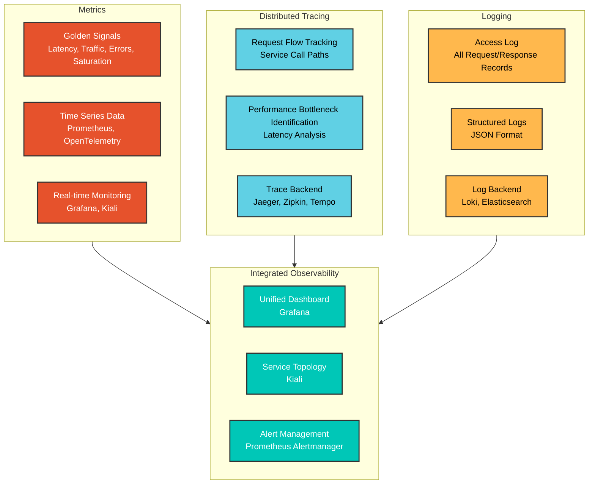
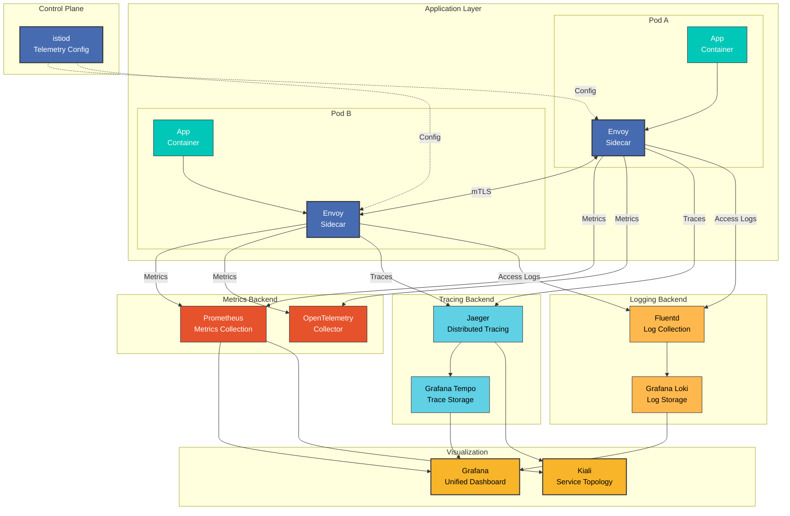

# Observabilidad

> **Versiones compatibles**: Istio 1.28
> **Última actualización**: February 19, 2026

Istio proporciona observabilidad integral dentro del service mesh. Recopila automáticamente métricas, logs y trazas de toda la comunicación de Service a Service sin requerir ningún cambio en el código de la aplicación.

## Tabla de contenido

1. [Descripción general de la observabilidad](#observability-overview)
2. [Tres pilares de la observabilidad](#three-pillars-of-observability)
3. [Arquitectura de observabilidad](#observability-architecture)
4. [Señales doradas](#golden-signals)
5. [Documentación detallada](#detailed-documentation)
6. [Prácticas recomendadas de observabilidad](#observability-best-practices)
7. [Siguientes pasos](#next-steps)

## Descripción general de la observabilidad

<p align="center">
  
</p>

Las características de observabilidad de Istio siguen el principio de **instrumentación cero**:
- No se requieren cambios en el código de la aplicación
- Recopilación y transmisión automática de métricas
- Generación automática de trazas distribuidas
- Formatos de logs estandarizados

## Tres pilares de la observabilidad

### Los tres elementos de la observabilidad



### 1. Métricas

**¿Qué se mide?**
- Cantidad de solicitudes, tiempo de respuesta, tasa de errores
- Utilización de recursos (CPU, memoria)
- Tráfico de red (Bytes, Packets)

**¿Cuándo usarlo?**
- Monitoreo del estado del sistema
- Seguimiento de SLO/SLI
- Planificación de capacidad

**Herramientas clave**: Prometheus, Grafana, VictoriaMetrics

### 2. Trazas distribuidas

**¿Qué se rastrea?**
- Ruta completa de una única solicitud
- Tiempo de procesamiento de cada Service
- Dependencias de Service

**¿Cuándo usarlo?**
- Identificación de cuellos de botella de rendimiento
- Análisis de la causa raíz de fallas
- Depuración de microservicios

**Herramientas clave**: Jaeger, Zipkin, Grafana Tempo

### 3. Logs

**¿Qué se registra?**
- Todas las solicitudes/respuestas HTTP
- Errores y excepciones
- Eventos de seguridad

**¿Cuándo usarlo?**
- Depuración detallada
- Auditorías de seguridad
- Requisitos de cumplimiento

**Herramientas clave**: Grafana Loki, Elasticsearch, Fluentd

## Arquitectura de observabilidad

### Arquitectura general



### Flujo de datos

**1. Flujo de recopilación de métricas**:
```
App → Envoy (metric generation)
    → Prometheus (Scrape /stats/prometheus)
    → Grafana (visualization)
```

**2. Flujo de trazas distribuidas**:
```
App → Envoy (Span generation)
    → Jaeger/Zipkin (trace collection)
    → Tempo (long-term storage)
    → Grafana (trace visualization)
```

**3. Flujo de logs**:
```
App → Envoy (Access Log generation)
    → Fluentd/Fluent Bit (log collection)
    → Loki (log storage)
    → Grafana (log query and visualization)
```

## Señales doradas

Métricas centrales que siguen los principios de Google SRE:

### 1. Latencia

```promql
# P50 latency
histogram_quantile(0.50,
  sum(rate(istio_request_duration_milliseconds_bucket[5m])) by (le)
)

# P95 latency
histogram_quantile(0.95,
  sum(rate(istio_request_duration_milliseconds_bucket[5m])) by (le)
)

# P99 latency
histogram_quantile(0.99,
  sum(rate(istio_request_duration_milliseconds_bucket[5m])) by (le)
)
```

### 2. Tráfico

```promql
# Requests per second (RPS)
sum(rate(istio_requests_total[5m]))

# Traffic by service
sum(rate(istio_requests_total[5m])) by (destination_service)
```

### 3. Errores

```promql
# Error rate (%)
sum(rate(istio_requests_total{response_code=~"5.."}[5m]))
/
sum(rate(istio_requests_total[5m]))
* 100

# 4xx vs 5xx errors
sum(rate(istio_requests_total{response_code=~"4.."}[5m])) by (response_code)
sum(rate(istio_requests_total{response_code=~"5.."}[5m])) by (response_code)
```

### 4. Saturación

```promql
# CPU utilization
rate(container_cpu_usage_seconds_total{pod=~".*"}[5m])

# Memory utilization
container_memory_working_set_bytes{pod=~".*"}
/
container_spec_memory_limit_bytes{pod=~".*"}
* 100
```

## Prácticas recomendadas de observabilidad

### 1. Usar métricas estándar

**Recomendado**:
- Priorizar el uso de métricas estándar de Istio
- Agregar métricas personalizadas solo cuando sea necesario
- Minimizar las etiquetas considerando la cardinalidad

**Evitar**:
- Métricas personalizadas excesivas
- Etiquetas de alta cardinalidad (user_id, request_id, etc.)

### 2. Muestreo de trazas

Establezca tasas de muestreo adecuadas para entornos de producción:

```yaml
apiVersion: install.istio.io/v1alpha1
kind: IstioOperator
spec:
  meshConfig:
    defaultConfig:
      tracing:
        sampling: 1.0  # Dev: 100%, Prod: 1-10%
```

**Tasas de muestreo recomendadas**:
- Desarrollo: 100%
- Staging: 10-50%
- Producción: 1-10%

### 3. Optimización de Access Log

Registre selectivamente solo los campos necesarios:

```yaml
apiVersion: telemetry.istio.io/v1alpha1
kind: Telemetry
metadata:
  name: mesh-default
  namespace: istio-system
spec:
  accessLogging:
  - providers:
    - name: envoy
    filter:
      expression: response.code >= 400  # Record only errors
```

### 4. Política de retención de métricas

Establezca períodos de retención de datos:
- **Métricas en tiempo real**: 1-7 días (alta resolución)
- **Métricas a largo plazo**: 30-90 días (con reducción de resolución)
- **Trazas**: 7-30 días
- **Logs**: Según las normativas (30-365 días)

### 5. Configuración de alertas

**Alertas críticas** (respuesta inmediata):
- Tasa de errores > 5%
- Latencia P99 > umbral
- Service inactivo

**Alertas de advertencia** (monitoreo):
- Tasa de errores > 1%
- Aumento de la latencia P95
- Utilización de recursos > 80%

## Documentación detallada

Guías detalladas para cada área de observabilidad:

### 1. Métricas

Aprenda lo siguiente en la **[Guía de métricas](01-metrics.md)**:
- Métricas estándar de Istio
- Integración de Prometheus
- Integración de OpenTelemetry
- Adición de métricas personalizadas
- Optimización de métricas

**Temas clave**:
- `istio_requests_total`: Cantidad total de solicitudes
- `istio_request_duration_milliseconds`: Latencia de solicitudes
- `istio_request_bytes`: Tamaño de solicitud/respuesta
- Métricas de Circuit Breaker
- Personalización de Telemetry API

### 2. Trazas distribuidas

Aprenda lo siguiente en la **[Guía de trazas distribuidas](02-tracing.md)**:
- Integración de Jaeger
- Integración de Zipkin
- Muestreo de trazas
- Propagación de contexto
- Análisis de rendimiento

**Temas clave**:
- Propagación de Trace Context (W3C Trace Context)
- Creación y gestión de Span
- Selección de backend (Jaeger, Zipkin, Tempo)
- Estrategias de muestreo
- Análisis de trazas

### 3. Logs

Aprenda lo siguiente en la **[Guía de logs](03-logging.md)**:
- Configuración de Access Log
- Personalización del formato de logs
- Integración de Grafana Loki
- Filtrado de logs
- Agregación de logs

**Temas clave**:
- Formato de Envoy Access Log
- Logs estructurados en JSON
- Configuración del nivel de logs
- Recopilación de logs (Fluentd, Fluent Bit)
- Consultas de logs (LogQL)

### 4. Paneles

Aprenda lo siguiente en la **[Guía de paneles](04-dashboards.md)**:
- Paneles de Grafana
- Grafo de Service de Kiali
- Creación de paneles personalizados
- Configuración de reglas de alerta

**Temas clave**:
- Paneles estándar de Istio
- Panel de Service Mesh
- Panel de Workload
- Visualización de tráfico de Kiali
- Paneles de SLO

## Siguientes pasos

1. **[Métricas](01-metrics.md)**: Recopilación y consultas de métricas de Prometheus
2. **[Trazas distribuidas](02-tracing.md)**: Análisis de trazas de Jaeger/Zipkin
3. **[Logs](03-logging.md)**: Integración de Access Log y Loki
4. **[Paneles](04-dashboards.md)**: Paneles de Grafana y Kiali

## Referencias

### Documentación oficial
- [Observabilidad de Istio](https://istio.io/latest/docs/tasks/observability/)
- [Métricas](https://istio.io/latest/docs/tasks/observability/metrics/)
- [Trazas distribuidas](https://istio.io/latest/docs/tasks/observability/distributed-tracing/)
- [Logs](https://istio.io/latest/docs/tasks/observability/logs/)

### Proyectos relacionados
- [Prometheus](https://prometheus.io/)
- [Grafana](https://grafana.com/)
- [Jaeger](https://www.jaegertracing.io/)
- [Grafana Loki](https://grafana.com/oss/loki/)
- [Kiali](https://kiali.io/)

### Estándares y especificaciones
- [OpenTelemetry](https://opentelemetry.io/)
- [W3C Trace Context](https://www.w3.org/TR/trace-context/)
- [Google SRE - Señales doradas](https://sre.google/sre-book/monitoring-distributed-systems/)

## Cuestionario

Para comprobar sus conocimientos de este capítulo, pruebe el [Cuestionario de observabilidad de Istio](../../../quizzes/service-mesh/istio/observability.md).
