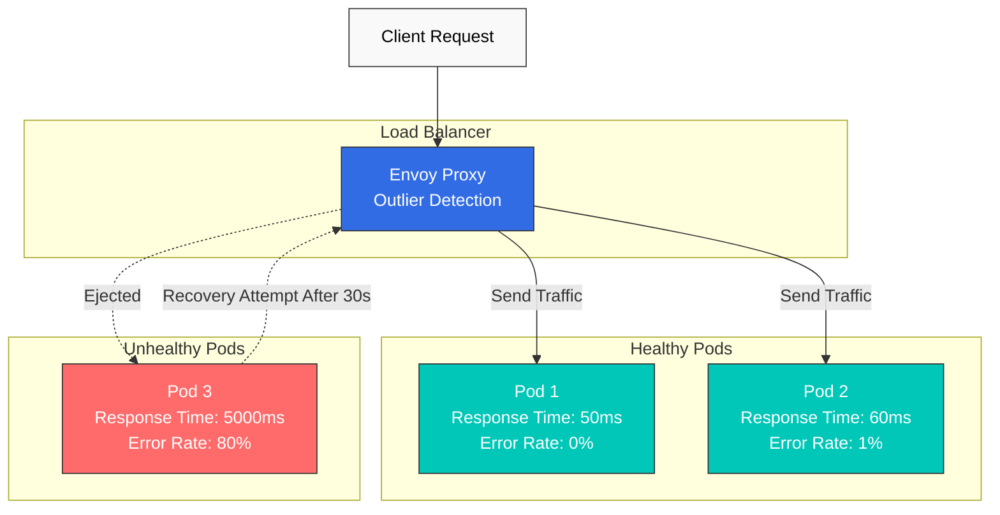
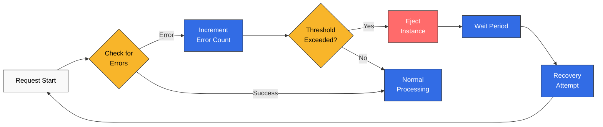
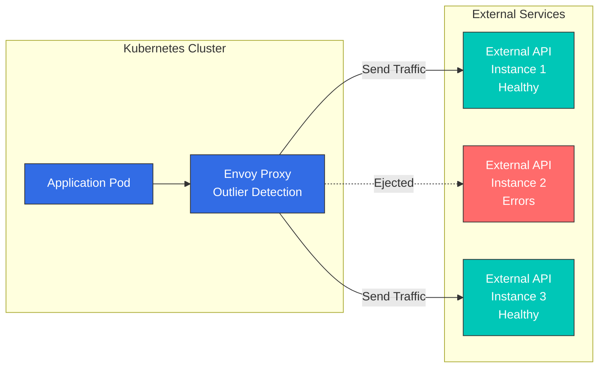

# Detección de valores atípicos (Outlier Detection)

Outlier Detection es una forma del patrón Circuit Breaker que detecta automáticamente instancias de servicio con comportamiento anómalo y las elimina del conjunto de tráfico.

## Tabla de contenido

1. [Descripción general](#overview)
2. [Cómo funciona](#how-it-works)
3. [Configuración básica](#basic-configuration)
4. [Configuración avanzada](#advanced-configuration)
5. [Protección de servicios externos (ServiceEntry)](#protecting-external-services-serviceentry)
6. [Ejemplos prácticos](#practical-examples)
7. [Monitorización](#monitoring)
8. [Solución de problemas](#troubleshooting)

## Descripción general

Outlier Detection elimina automáticamente instancias en las siguientes situaciones:



### Características principales

1. **Detección automática**: supervisa automáticamente la tasa de errores, la latencia y los fallos de respuesta
2. **Expulsión automática**: elimina automáticamente del tráfico cuando se supera el umbral
3. **Recuperación automática**: intenta automáticamente la recuperación después de un tiempo establecido

## Cómo funciona

### Proceso de Outlier Detection



### Métodos de detección

| Método | Descripción | Escenario de uso |
|--------|-------------|--------------|
| **Errores consecutivos** | Detecta errores 5xx consecutivos | Fallo de la aplicación |
| **Errores de gateway** | Detecta errores 502, 503, 504 | Sobrecarga del Service |
| **Fallos de conexión** | Detecta fallos de conexión TCP | Problemas de red |
| **Latencia** | Se supera el umbral de tiempo de respuesta | Degradación del rendimiento |

## Configuración básica

### Detección basada en errores consecutivos

```yaml
apiVersion: networking.istio.io/v1
kind: DestinationRule
metadata:
  name: reviews-outlier
  namespace: default
spec:
  host: reviews
  trafficPolicy:
    outlierDetection:
      # Consecutive error threshold
      consecutiveErrors: 5

      # Analysis interval (evaluate every 30 seconds)
      interval: 30s

      # Ejection time (30 seconds)
      baseEjectionTime: 30s

      # Maximum ejection percentage (50%)
      maxEjectionPercent: 50

      # Minimum request count (evaluate only when 10+ requests)
      minHealthPercent: 50
```

### Descripciones de parámetros clave

#### consecutiveErrors
- **Descripción**: umbral para ocurrencias de errores consecutivos
- **Predeterminado**: 5
- **Recomendado**: 3-10 (según las características del Service)

```yaml
# Sensitive service (fast detection)
consecutiveErrors: 3

# General service
consecutiveErrors: 5

# Lenient setting (prevent false positives)
consecutiveErrors: 10
```

#### interval
- **Descripción**: intervalo de análisis de Outlier Detection
- **Predeterminado**: 10s
- **Recomendado**: 10s-60s

```yaml
# Fast detection (high load)
interval: 10s

# General case
interval: 30s

# Stable service
interval: 60s
```

#### baseEjectionTime
- **Descripción**: tiempo mínimo durante el que una instancia se expulsa
- **Predeterminado**: 30s
- **Recomendado**: 30s-300s

```yaml
# Fast recovery attempt
baseEjectionTime: 30s

# General case
baseEjectionTime: 60s

# Cautious recovery
baseEjectionTime: 300s
```

#### maxEjectionPercent
- **Descripción**: porcentaje máximo de instancias que se pueden expulsar simultáneamente
- **Predeterminado**: 10%
- **Recomendado**: 10%-50%

```yaml
# Conservative (stability first)
maxEjectionPercent: 10

# Balanced setting
maxEjectionPercent: 30

# Aggressive (quality first)
maxEjectionPercent: 50
```

## Configuración avanzada

### Detección basada en errores de gateway

```yaml
apiVersion: networking.istio.io/v1
kind: DestinationRule
metadata:
  name: reviews-gateway-errors
spec:
  host: reviews
  trafficPolicy:
    outlierDetection:
      # Consecutive gateway errors
      consecutiveGatewayErrors: 3

      # Respond sensitively to 502, 503, 504 errors
      interval: 10s
      baseEjectionTime: 60s

      # Eject faster for gateway errors
      maxEjectionPercent: 50
```

### Prevención de Split Brain

```yaml
apiVersion: networking.istio.io/v1
kind: DestinationRule
metadata:
  name: reviews-split-brain-safe
spec:
  host: reviews
  trafficPolicy:
    outlierDetection:
      consecutiveErrors: 5
      interval: 30s
      baseEjectionTime: 30s

      # Maintain minimum healthy instance percentage
      minHealthPercent: 50

      # Limit maximum ejection percentage
      maxEjectionPercent: 30
```

**Importante**: use `minHealthPercent` y `maxEjectionPercent` juntos para evitar que se expulsen todas las instancias.

### Detección basada en fallos de conexión

```yaml
apiVersion: networking.istio.io/v1
kind: DestinationRule
metadata:
  name: reviews-connection-errors
spec:
  host: reviews
  trafficPolicy:
    connectionPool:
      tcp:
        maxConnections: 100
      http:
        http1MaxPendingRequests: 10
        maxRequestsPerConnection: 2

    outlierDetection:
      # Detect consecutive connection failures
      consecutiveLocalOriginFailures: 5

      interval: 10s
      baseEjectionTime: 30s
      maxEjectionPercent: 50
```

### Detección basada en la tasa de éxito (avanzada)

```yaml
apiVersion: networking.istio.io/v1
kind: DestinationRule
metadata:
  name: reviews-success-rate
spec:
  host: reviews
  trafficPolicy:
    outlierDetection:
      # Minimum requests needed for analysis
      splitExternalLocalOriginErrors: true

      # Success rate threshold (eject if below 95%)
      consecutiveErrors: 5
      interval: 30s
      baseEjectionTime: 60s

      # Minimum request count
      enforcingConsecutiveErrors: 100
      enforcingSuccessRate: 100
```

## Protección de servicios externos (ServiceEntry)

Registre las API externas o los sistemas heredados como ServiceEntry y aplique Outlier Detection para evitar la propagación de fallos.

### Arquitectura de protección de API externas



### Ejemplo 1: API externa única (basada en DNS)

```yaml
# Register external REST API service
apiVersion: networking.istio.io/v1
kind: ServiceEntry
metadata:
  name: external-payment-api
  namespace: payment
spec:
  hosts:
  - api.payment-provider.com

  # DNS-based load balancing
  resolution: DNS

  # HTTPS port
  ports:
  - number: 443
    name: https
    protocol: HTTPS

  # External service
  location: MESH_EXTERNAL
---
# Apply Outlier Detection
apiVersion: networking.istio.io/v1
kind: DestinationRule
metadata:
  name: external-payment-api
  namespace: payment
spec:
  host: api.payment-provider.com

  trafficPolicy:
    # TLS configuration
    tls:
      mode: SIMPLE

    # Connection Pool (Circuit Breaker)
    connectionPool:
      tcp:
        maxConnections: 100
        connectTimeout: 3s
      http:
        http1MaxPendingRequests: 50
        http2MaxRequests: 100
        maxRequestsPerConnection: 10
        maxRetries: 3

    # Outlier Detection
    outlierDetection:
      # Detect external API quickly
      consecutiveErrors: 3
      consecutiveGatewayErrors: 2

      # Evaluate every 10 seconds
      interval: 10s

      # Eject for 30 seconds
      baseEjectionTime: 30s

      # Allow up to 50% ejection
      maxEjectionPercent: 50

      # Also detect local errors (timeout, connection failure)
      splitExternalLocalOriginErrors: true
      consecutiveLocalOriginFailures: 3
```

**Ejemplo de uso**:
```go
// Go application code
func processPayment(ctx context.Context, amount float64) error {
    // Istio automatically routes to api.payment-provider.com
    // On error, automatically retries to another instance
    resp, err := http.Post(
        "https://api.payment-provider.com/v1/charge",
        "application/json",
        bytes.NewBuffer(paymentData),
    )

    if err != nil {
        // Outlier Detection triggers after 3 consecutive errors
        return fmt.Errorf("payment failed: %w", err)
    }

    return nil
}
```

### Ejemplo 2: Varios endpoints de API externa

```yaml
# External API endpoints across multiple regions
apiVersion: networking.istio.io/v1
kind: ServiceEntry
metadata:
  name: external-weather-api
  namespace: weather
spec:
  hosts:
  - weather.api.com

  # Static IP address specification
  resolution: STATIC

  ports:
  - number: 443
    name: https
    protocol: HTTPS

  location: MESH_EXTERNAL

  # Multiple endpoints
  endpoints:
  - address: 203.0.113.10
    labels:
      region: us-east-1
  - address: 203.0.113.20
    labels:
      region: us-west-2
  - address: 203.0.113.30
    labels:
      region: eu-central-1
---
apiVersion: networking.istio.io/v1
kind: DestinationRule
metadata:
  name: external-weather-api
  namespace: weather
spec:
  host: weather.api.com

  trafficPolicy:
    tls:
      mode: SIMPLE

    # Load balancer configuration
    loadBalancer:
      simple: LEAST_REQUEST

    connectionPool:
      tcp:
        maxConnections: 50
        connectTimeout: 5s
      http:
        http1MaxPendingRequests: 20
        maxRequestsPerConnection: 5

    outlierDetection:
      # Adjust for external API characteristics
      consecutiveErrors: 5
      consecutiveGatewayErrors: 3
      consecutiveLocalOriginFailures: 5

      interval: 30s
      baseEjectionTime: 60s

      # Eject up to 1 per region
      maxEjectionPercent: 33  # 1 out of 3

      splitExternalLocalOriginErrors: true
```

### Ejemplo 3: Protección de base de datos heredada

```yaml
# External PostgreSQL database
apiVersion: networking.istio.io/v1
kind: ServiceEntry
metadata:
  name: legacy-postgres
  namespace: database
spec:
  hosts:
  - legacy-db.company.internal

  resolution: DNS

  ports:
  - number: 5432
    name: tcp-postgres
    protocol: TCP

  location: MESH_EXTERNAL
---
apiVersion: networking.istio.io/v1
kind: DestinationRule
metadata:
  name: legacy-postgres
  namespace: database
spec:
  host: legacy-db.company.internal

  trafficPolicy:
    connectionPool:
      tcp:
        maxConnections: 50
        connectTimeout: 10s

    outlierDetection:
      # Detect database cautiously
      consecutiveErrors: 10

      # TCP connection failure detection
      consecutiveLocalOriginFailures: 5

      interval: 60s
      baseEjectionTime: 300s  # 5 minutes

      # Be conservative for database
      maxEjectionPercent: 20

      splitExternalLocalOriginErrors: true
```

### Ejemplo 4: API externa con reintentos

```yaml
# External RESTful API
apiVersion: networking.istio.io/v1
kind: ServiceEntry
metadata:
  name: external-geocoding-api
  namespace: location
spec:
  hosts:
  - maps.googleapis.com

  resolution: DNS

  ports:
  - number: 443
    name: https
    protocol: HTTPS

  location: MESH_EXTERNAL
---
apiVersion: networking.istio.io/v1
kind: VirtualService
metadata:
  name: external-geocoding-api
  namespace: location
spec:
  hosts:
  - maps.googleapis.com

  http:
  - timeout: 5s
    retries:
      attempts: 3
      perTryTimeout: 2s
      retryOn: 5xx,reset,connect-failure,refused-stream
    route:
    - destination:
        host: maps.googleapis.com
---
apiVersion: networking.istio.io/v1
kind: DestinationRule
metadata:
  name: external-geocoding-api
  namespace: location
spec:
  host: maps.googleapis.com

  trafficPolicy:
    tls:
      mode: SIMPLE

    connectionPool:
      tcp:
        maxConnections: 100
        connectTimeout: 3s
      http:
        http1MaxPendingRequests: 50
        maxRequestsPerConnection: 10
        maxRetries: 3

    outlierDetection:
      # Fast detection
      consecutiveErrors: 3
      consecutiveGatewayErrors: 2
      consecutiveLocalOriginFailures: 3

      interval: 10s
      baseEjectionTime: 30s
      maxEjectionPercent: 50

      # Track local errors (timeout, connection failure) separately
      splitExternalLocalOriginErrors: true
```

### Ejemplo 5: Servicio externo con limitación de tasa

```yaml
# External API with Rate Limiting
apiVersion: networking.istio.io/v1
kind: ServiceEntry
metadata:
  name: external-rate-limited-api
  namespace: api
spec:
  hosts:
  - api.third-party.com

  resolution: DNS

  ports:
  - number: 443
    name: https
    protocol: HTTPS

  location: MESH_EXTERNAL
---
# Rate Limiting configuration
apiVersion: v1
kind: ConfigMap
metadata:
  name: ratelimit-config
  namespace: api
data:
  config.yaml: |
    domain: external-api-ratelimit
    descriptors:
    - key: destination_cluster
      value: outbound|443||api.third-party.com
      rate_limit:
        unit: second
        requests_per_unit: 100
---
apiVersion: networking.istio.io/v1
kind: DestinationRule
metadata:
  name: external-rate-limited-api
  namespace: api
spec:
  host: api.third-party.com

  trafficPolicy:
    tls:
      mode: SIMPLE

    connectionPool:
      tcp:
        maxConnections: 100
      http:
        http1MaxPendingRequests: 50
        http2MaxRequests: 100
        maxRequestsPerConnection: 10

    outlierDetection:
      # Detect quickly when rate limit exceeded
      consecutiveErrors: 3
      consecutiveGatewayErrors: 2  # 429 Too Many Requests

      interval: 10s
      baseEjectionTime: 60s  # Wait for rate limit reset
      maxEjectionPercent: 50

      splitExternalLocalOriginErrors: true
      consecutiveLocalOriginFailures: 3
```

### Prácticas recomendadas de Outlier Detection para servicios externos

#### 1. Distinguir los tipos de error

```yaml
outlierDetection:
  # Gateway errors (502, 503, 504)
  consecutiveGatewayErrors: 2  # Detect quickly

  # 5xx errors (500, 501, etc.)
  consecutiveErrors: 3

  # Local errors (timeout, connection failure)
  consecutiveLocalOriginFailures: 3

  # Track local and remote errors separately
  splitExternalLocalOriginErrors: true
```

**Importante**: al establecer `splitExternalLocalOriginErrors: true`:
- **Fallos de origen local**: timeout de conexión, fallo de DNS, conexión rechazada
- **Fallos upstream**: errores 5xx devueltos por la API externa

Estos se contabilizan por separado para una detección más precisa.

#### 2. Configuración de timeout

```yaml
apiVersion: networking.istio.io/v1
kind: VirtualService
metadata:
  name: external-api
spec:
  hosts:
  - api.external.com
  http:
  - timeout: 5s  # Overall request timeout
    retries:
      attempts: 3
      perTryTimeout: 2s  # Per-retry timeout
    route:
    - destination:
        host: api.external.com
---
apiVersion: networking.istio.io/v1
kind: DestinationRule
metadata:
  name: external-api
spec:
  host: api.external.com
  trafficPolicy:
    connectionPool:
      tcp:
        connectTimeout: 3s  # TCP connection timeout
    outlierDetection:
      consecutiveLocalOriginFailures: 3  # Timeout also counts
      splitExternalLocalOriginErrors: true
```

#### 3. Monitorización de servicios externos

```promql
# Outlier Detection metrics
# 1. Ejected external endpoints
envoy_cluster_outlier_detection_ejections_active{
  cluster_name=~"outbound.*api\\.external\\.com.*"
}

# 2. Local errors (timeout, connection failure)
rate(envoy_cluster_upstream_rq_timeout{
  cluster_name=~"outbound.*api\\.external\\.com.*"
}[5m])

# 3. External API 5xx errors
rate(istio_requests_total{
  destination_service="api.external.com",
  response_code=~"5.."
}[5m])

# 4. External API response time
histogram_quantile(0.95,
  sum(rate(istio_request_duration_milliseconds_bucket{
    destination_service="api.external.com"
  }[5m])) by (le)
)
```

#### 4. Configuración de alertas

```yaml
# Prometheus Alert Rules
groups:
- name: external_api_alerts
  interval: 1m
  rules:
  # High external API error rate
  - alert: ExternalAPIHighErrorRate
    expr: |
      (sum(rate(istio_requests_total{
        destination_service=~".*external.*",
        response_code=~"5.."
      }[5m])) by (destination_service)
      /
      sum(rate(istio_requests_total{
        destination_service=~".*external.*"
      }[5m])) by (destination_service))
      * 100 > 5
    for: 2m
    labels:
      severity: warning
    annotations:
      summary: "High error rate for external API {{ $labels.destination_service }}"
      description: "Error rate is {{ $value }}%"

  # External API instance ejected
  - alert: ExternalAPIInstanceEjected
    expr: |
      envoy_cluster_outlier_detection_ejections_active{
        cluster_name=~"outbound.*external.*"
      } > 0
    for: 1m
    labels:
      severity: warning
    annotations:
      summary: "External API instance ejected"
      description: "{{ $value }} instances ejected from {{ $labels.cluster_name }}"

  # Increased external API timeouts
  - alert: ExternalAPIHighTimeout
    expr: |
      rate(envoy_cluster_upstream_rq_timeout{
        cluster_name=~"outbound.*external.*"
      }[5m]) > 0.1
    for: 2m
    labels:
      severity: warning
    annotations:
      summary: "High timeout rate for external API"
      description: "Timeout rate is {{ $value }} req/s"
```

#### 5. Solución de problemas

```bash
# 1. Check ServiceEntry
kubectl get serviceentry -A
kubectl describe serviceentry external-api -n <namespace>

# 2. Verify DestinationRule application
istioctl proxy-config clusters <pod-name> -n <namespace> --fqdn api.external.com -o json | \
  jq '.[] | {name: .name, outlierDetection: .outlierDetection}'

# 3. Test external API connection
kubectl exec -it <pod-name> -n <namespace> -c istio-proxy -- \
  curl -v https://api.external.com/health

# 4. Check Envoy statistics
kubectl exec -it <pod-name> -n <namespace> -c istio-proxy -- \
  curl localhost:15000/stats/prometheus | grep "outbound.*external"

# 5. Outlier Detection status
kubectl exec -it <pod-name> -n <namespace> -c istio-proxy -- \
  curl localhost:15000/clusters | grep -A 20 "outbound|443||api.external.com"
```

### Escenarios de fallo de servicios externos

#### Escenario 1: Fallo temporal de API externa

```yaml
# Configuration: Fast detection and recovery
outlierDetection:
  consecutiveErrors: 3           # 3 consecutive errors
  consecutiveGatewayErrors: 2    # 2 gateway errors
  interval: 10s                  # Evaluate every 10 seconds
  baseEjectionTime: 30s          # Recovery attempt after 30 seconds
  maxEjectionPercent: 50         # Maximum 50% ejection
```

**Resultado**:
1. La API externa devuelve errores 502/503
2. Expulsión inmediata después de 2 errores consecutivos
3. Intento de recuperación automático después de 30 segundos
4. Si la recuperación falla, se expulsa durante otros 30 segundos (backoff exponencial)

#### Escenario 2: API externa completamente caída

```yaml
# Configuration: Failover to multiple endpoints
apiVersion: networking.istio.io/v1
kind: ServiceEntry
metadata:
  name: external-api-ha
spec:
  hosts:
  - api.external.com
  resolution: STATIC
  endpoints:
  - address: 203.0.113.10    # Primary
    labels:
      tier: primary
  - address: 203.0.113.20    # Secondary
    labels:
      tier: secondary
  - address: 203.0.113.30    # Tertiary
    labels:
      tier: tertiary
---
apiVersion: networking.istio.io/v1
kind: DestinationRule
metadata:
  name: external-api-ha
spec:
  host: api.external.com
  trafficPolicy:
    outlierDetection:
      consecutiveErrors: 3
      consecutiveLocalOriginFailures: 3
      interval: 10s
      baseEjectionTime: 60s
      maxEjectionPercent: 66  # Allow ejecting up to 2 out of 3
      minHealthPercent: 33    # Keep at least 1
```

**Resultado**:
1. El endpoint principal se cae → se expulsa
2. El tráfico pasa automáticamente al endpoint secundario
3. Si el secundario también falla, pasa al terciario
4. El principal se vuelve a incluir automáticamente después de 60 segundos cuando se recupera

## Ejemplos prácticos

### Ejemplo 1: Cadena de microservicios

```yaml
# Frontend → Backend → Database
apiVersion: networking.istio.io/v1
kind: DestinationRule
metadata:
  name: backend-outlier
spec:
  host: backend
  trafficPolicy:
    outlierDetection:
      # Fast detection for backend service
      consecutiveErrors: 3
      interval: 10s
      baseEjectionTime: 30s
      maxEjectionPercent: 50
---
apiVersion: networking.istio.io/v1
kind: DestinationRule
metadata:
  name: database-outlier
spec:
  host: database
  trafficPolicy:
    outlierDetection:
      # Cautious detection for database
      consecutiveErrors: 10
      interval: 60s
      baseEjectionTime: 300s
      maxEjectionPercent: 20
```

### Ejemplo 2: Uso con Canary Deployment

```yaml
apiVersion: networking.istio.io/v1
kind: VirtualService
metadata:
  name: reviews-canary
spec:
  hosts:
  - reviews
  http:
  - route:
    - destination:
        host: reviews
        subset: v1
      weight: 90
    - destination:
        host: reviews
        subset: v2
      weight: 10
---
apiVersion: networking.istio.io/v1
kind: DestinationRule
metadata:
  name: reviews
spec:
  host: reviews
  subsets:
  - name: v1
    labels:
      version: v1
  - name: v2
    labels:
      version: v2
    trafficPolicy:
      # Strict detection for canary version
      outlierDetection:
        consecutiveErrors: 3
        interval: 10s
        baseEjectionTime: 60s
        maxEjectionPercent: 100  # Allow full ejection for canary
```

### Ejemplo 3: Deployment multirregional

```yaml
apiVersion: networking.istio.io/v1
kind: DestinationRule
metadata:
  name: api-multi-region
spec:
  host: api
  trafficPolicy:
    loadBalancer:
      localityLbSetting:
        enabled: true
        distribute:
        - from: us-east-1/*
          to:
            "us-east-1/*": 80
            "us-west-2/*": 20

    outlierDetection:
      # Be more lenient for cross-region
      consecutiveErrors: 10
      interval: 60s
      baseEjectionTime: 120s
      maxEjectionPercent: 30
```

### Ejemplo 4: Connection Pool + Outlier Detection

```yaml
apiVersion: networking.istio.io/v1
kind: DestinationRule
metadata:
  name: reviews-full-protection
spec:
  host: reviews
  trafficPolicy:
    # Connection Pool (Circuit Breaker)
    connectionPool:
      tcp:
        maxConnections: 100
      http:
        http1MaxPendingRequests: 50
        http2MaxRequests: 100
        maxRequestsPerConnection: 2

    # Outlier Detection
    outlierDetection:
      consecutiveErrors: 5
      consecutiveGatewayErrors: 3
      interval: 30s
      baseEjectionTime: 30s
      maxEjectionPercent: 50
      minHealthPercent: 50
```

## Monitorización

### Métricas de Prometheus

```yaml
# Grafana Dashboard Prometheus queries

# 1. Number of ejected instances
envoy_cluster_outlier_detection_ejections_active

# 2. Total ejection count
rate(envoy_cluster_outlier_detection_ejections_total[5m])

# 3. Ejection percentage
(envoy_cluster_outlier_detection_ejections_active
 /
 envoy_cluster_membership_healthy) * 100

# 4. Ejections due to consecutive 5xx errors
rate(envoy_cluster_outlier_detection_ejections_consecutive_5xx[5m])

# 5. Ejections due to gateway errors
rate(envoy_cluster_outlier_detection_ejections_consecutive_gateway_failure[5m])
```

### Ejemplo de dashboard de Grafana

```json
{
  "dashboard": {
    "title": "Istio Outlier Detection",
    "panels": [
      {
        "title": "Ejected Instances",
        "targets": [
          {
            "expr": "envoy_cluster_outlier_detection_ejections_active",
            "legendFormat": "{{cluster_name}}"
          }
        ]
      },
      {
        "title": "Ejection Rate",
        "targets": [
          {
            "expr": "rate(envoy_cluster_outlier_detection_ejections_total[5m])",
            "legendFormat": "{{cluster_name}}"
          }
        ]
      },
      {
        "title": "Ejection Percentage",
        "targets": [
          {
            "expr": "(envoy_cluster_outlier_detection_ejections_active / envoy_cluster_membership_healthy) * 100",
            "legendFormat": "{{cluster_name}}"
          }
        ]
      }
    ]
  }
}
```

### Monitorización en tiempo real

```bash
# Check Envoy statistics
kubectl exec -n <namespace> <pod-name> -c istio-proxy -- \
  curl localhost:15000/stats/prometheus | grep outlier

# Key metrics:
# envoy_cluster_outlier_detection_ejections_active: Currently ejected instances
# envoy_cluster_outlier_detection_ejections_total: Total ejection count
# envoy_cluster_outlier_detection_ejections_consecutive_5xx: Ejections due to 5xx errors
```

### Verificación en Kiali

```bash
# Access Kiali
istioctl dashboard kiali

# Things to check:
# 1. Graph → Select service → Traffic tab
# 2. Unhealthy instances shown in red
# 3. Check Outlier Detection metrics
```

## Solución de problemas

### Outlier Detection no funciona

```bash
# 1. Check DestinationRule
kubectl get destinationrule -n <namespace>
kubectl describe destinationrule <name> -n <namespace>

# 2. Check Envoy cluster configuration
istioctl proxy-config clusters <pod-name> -n <namespace> --fqdn <service-fqdn> -o json | \
  jq '.[] | .outlierDetection'

# 3. Check Envoy logs
kubectl logs -n <namespace> <pod-name> -c istio-proxy | grep outlier

# 4. Check Pilot logs
kubectl logs -n istio-system -l app=istiod | grep outlier
```

### Se expulsan demasiadas instancias

```yaml
# Solution 1: Adjust maxEjectionPercent
outlierDetection:
  maxEjectionPercent: 30  # Reduce from 50 to 30

# Solution 2: Increase consecutiveErrors
outlierDetection:
  consecutiveErrors: 10  # Increase from 5 to 10

# Solution 3: Increase interval
outlierDetection:
  interval: 60s  # Increase from 30s to 60s
```

### Split Brain (todas las instancias expulsadas)

```yaml
# Solution: Set minHealthPercent
outlierDetection:
  consecutiveErrors: 5
  interval: 30s
  baseEjectionTime: 30s
  maxEjectionPercent: 50
  minHealthPercent: 50  # Keep at least 50%
```

### Recuperación demasiado lenta después de la expulsión

```yaml
# Solution: Decrease baseEjectionTime
outlierDetection:
  baseEjectionTime: 15s  # Reduce from 30s to 15s
```

### Falsos positivos por errores temporales

```yaml
# Solution: Increase consecutiveErrors + interval
outlierDetection:
  consecutiveErrors: 10  # Increase threshold
  interval: 60s          # Increase analysis interval
```

## Prácticas recomendadas

### 1. Configuración por tipo de Service

```yaml
# Critical service (fast detection)
outlierDetection:
  consecutiveErrors: 3
  interval: 10s
  baseEjectionTime: 30s
  maxEjectionPercent: 50

# General service
outlierDetection:
  consecutiveErrors: 5
  interval: 30s
  baseEjectionTime: 60s
  maxEjectionPercent: 30

# Stable service (lenient settings)
outlierDetection:
  consecutiveErrors: 10
  interval: 60s
  baseEjectionTime: 120s
  maxEjectionPercent: 20
```

### 2. Usar siempre con Connection Pool

```yaml
# Always use with Connection Pool
trafficPolicy:
  connectionPool:
    tcp:
      maxConnections: 100
    http:
      http1MaxPendingRequests: 50
  outlierDetection:
    consecutiveErrors: 5
    interval: 30s
```

### 3. Establecer el porcentaje mínimo de instancias saludables

```yaml
# Prevent Split Brain
outlierDetection:
  minHealthPercent: 50  # Keep at least 50%
  maxEjectionPercent: 30
```

### 4. Despliegue gradual

```yaml
# Phase 1: Observation mode (no ejection)
outlierDetection:
  consecutiveErrors: 5
  interval: 30s
  baseEjectionTime: 30s
  maxEjectionPercent: 0  # No ejection

# Phase 2: Minor ejection
outlierDetection:
  maxEjectionPercent: 10

# Phase 3: Normal operation
outlierDetection:
  maxEjectionPercent: 30
```

### 5. Monitorización y alertas

```yaml
# Prometheus Alerting Rule
groups:
- name: istio_outlier_detection
  rules:
  - alert: HighEjectionRate
    expr: rate(envoy_cluster_outlier_detection_ejections_total[5m]) > 0.1
    for: 5m
    labels:
      severity: warning
    annotations:
      summary: "High outlier ejection rate"
      description: "{{ $labels.cluster_name }} has ejection rate > 0.1 req/s"
```

## Referencias

- [Istio Outlier Detection](https://istio.io/latest/docs/reference/config/networking/destination-rule/#OutlierDetection)
- [Envoy Outlier Detection](https://www.envoyproxy.io/docs/envoy/latest/intro/arch_overview/upstream/outlier)
- [Circuit Breaking](https://istio.io/latest/docs/tasks/traffic-management/circuit-breaking/)
