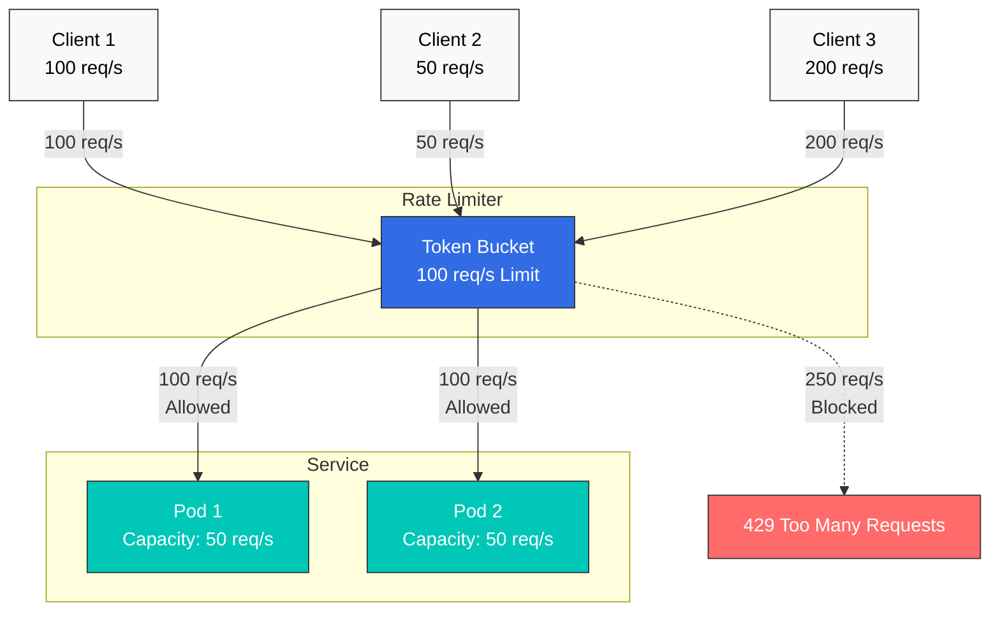
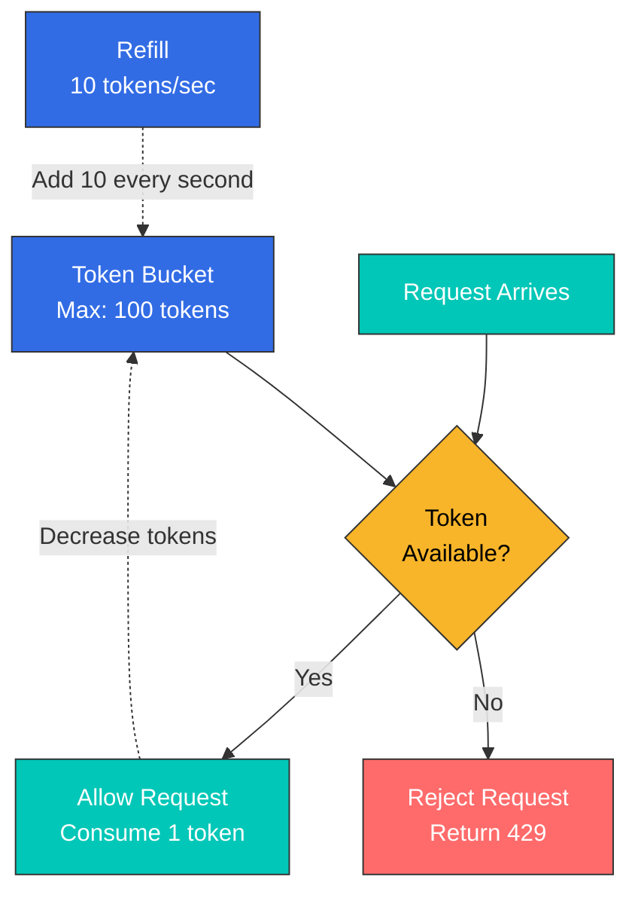
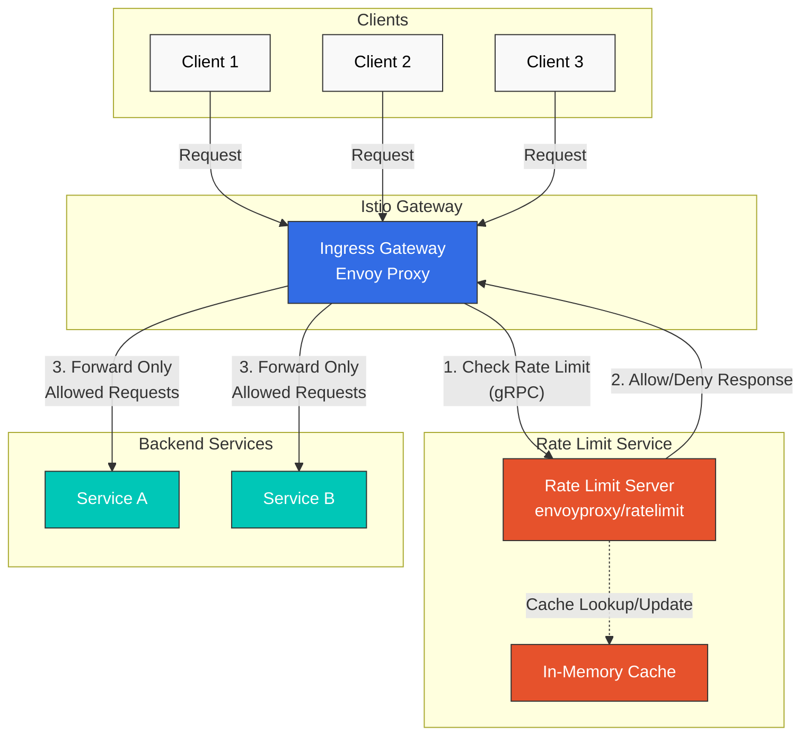

# Limitación de tasa

La limitación de tasa es una funcionalidad que limita las tasas de solicitudes para proteger los servicios de sobrecargas, garantizar un uso justo de los recursos y controlar los costos.

## Tabla de contenido

1. [Descripción general](#overview)
2. [Tipos de limitación de tasa](#rate-limiting-types)
3. [Limitación de tasa local](#local-rate-limiting)
4. [Limitación de tasa global](#global-rate-limiting)
5. [Ejemplos prácticos](#practical-examples)
6. [Monitoreo](#monitoring)
7. [Solución de problemas](#troubleshooting)

## Descripción general

La limitación de tasa se necesita en las siguientes situaciones:



### Propósito de la limitación de tasa

1. **Protección del servicio**: Evitar la sobrecarga
2. **Equidad**: Distribución justa de recursos para todos los clientes
3. **Control de costos**: Gestionar los costos de llamadas a API externas
4. **Seguridad**: Defensa contra ataques DDoS

## Tipos de limitación de tasa

### 1. Limitación de tasa local

**Características**:
- Cada proxy Envoy limita de forma independiente
- Respuesta rápida (sin llamadas de red adicionales)
- En entornos distribuidos, el límite total se aplica por instancia

```yaml
# 100 req/s limit per pod
# With 3 pods, up to 300 req/s total allowed
```

### 2. Limitación de tasa global

**Características**:
- Utiliza un servidor de Rate Limit centralizado
- Límite total preciso (compartido entre todas las instancias)
- Ligera latencia (llamada a un servicio externo)

```yaml
# 100 req/s total limit
# Only 100 req/s allowed regardless of pod count
```

### Comparación

| Característica | Limitación de tasa local | Limitación de tasa global |
|----------------|---------------------|----------------------|
| **Precisión** | Baja (por instancia) | Alta (total) |
| **Rendimiento** | Muy rápido | Ligeramente más lento |
| **Complejidad** | Baja | Alta (se requiere un servicio externo) |
| **Caso de uso** | Protección general | Cuando se necesita una limitación precisa |

## Limitación de tasa local

### Algoritmo Token Bucket



### Configuración básica

```yaml
apiVersion: networking.istio.io/v1
kind: EnvoyFilter
metadata:
  name: local-ratelimit
  namespace: default
spec:
  workloadSelector:
    labels:
      app: myapp
  configPatches:
  - applyTo: HTTP_FILTER
    match:
      context: SIDECAR_INBOUND
      listener:
        filterChain:
          filter:
            name: "envoy.filters.network.http_connection_manager"
            subFilter:
              name: "envoy.filters.http.router"
    patch:
      operation: INSERT_BEFORE
      value:
        name: envoy.filters.http.local_ratelimit
        typed_config:
          "@type": type.googleapis.com/envoy.extensions.filters.http.local_ratelimit.v3.LocalRateLimit
          stat_prefix: http_local_rate_limiter
          token_bucket:
            max_tokens: 100        # Maximum token count
            tokens_per_fill: 10    # Tokens to add
            fill_interval: 1s      # Fill interval
          filter_enabled:
            runtime_key: local_rate_limit_enabled
            default_value:
              numerator: 100
              denominator: HUNDRED
          filter_enforced:
            runtime_key: local_rate_limit_enforced
            default_value:
              numerator: 100
              denominator: HUNDRED
          response_headers_to_add:
          - append: false
            header:
              key: x-local-rate-limit
              value: 'true'
```

**Parámetros clave**:
- `max_tokens`: Máximo de tokens que puede contener el bucket (permite ráfagas)
- `tokens_per_fill`: Tokens que se añaden por fill_interval
- `fill_interval`: Intervalo de adición de tokens

**Ejemplo**:
```yaml
# 10 requests per second, 100 burst allowed
token_bucket:
  max_tokens: 100
  tokens_per_fill: 10
  fill_interval: 1s

# Result:
# - Average: 10 req/s
# - Burst: 100 req/s (for short periods)
```

### Limitación de tasa basada en rutas

```yaml
apiVersion: networking.istio.io/v1
kind: EnvoyFilter
metadata:
  name: path-based-ratelimit
  namespace: default
spec:
  workloadSelector:
    labels:
      app: api-service
  configPatches:
  - applyTo: HTTP_FILTER
    match:
      context: SIDECAR_INBOUND
    patch:
      operation: INSERT_BEFORE
      value:
        name: envoy.filters.http.local_ratelimit
        typed_config:
          "@type": type.googleapis.com/envoy.extensions.filters.http.local_ratelimit.v3.LocalRateLimit
          stat_prefix: http_local_rate_limiter

          # Different limits per path
          descriptors:
          # /api/v1/users - High limit
          - entries:
            - key: header_match
              value: "/api/v1/users"
            token_bucket:
              max_tokens: 1000
              tokens_per_fill: 100
              fill_interval: 1s

          # /api/v1/admin - Low limit
          - entries:
            - key: header_match
              value: "/api/v1/admin"
            token_bucket:
              max_tokens: 100
              tokens_per_fill: 10
              fill_interval: 1s
```

### Limitación de tasa basada en encabezados

```yaml
apiVersion: networking.istio.io/v1
kind: EnvoyFilter
metadata:
  name: user-based-ratelimit
  namespace: default
spec:
  workloadSelector:
    labels:
      app: api-service
  configPatches:
  - applyTo: HTTP_FILTER
    match:
      context: SIDECAR_INBOUND
    patch:
      operation: INSERT_BEFORE
      value:
        name: envoy.filters.http.local_ratelimit
        typed_config:
          "@type": type.googleapis.com/envoy.extensions.filters.http.local_ratelimit.v3.LocalRateLimit
          stat_prefix: http_local_rate_limiter

          # Limits by user tier
          descriptors:
          # Premium users
          - entries:
            - key: header_match
              value: "x-user-tier:premium"
            token_bucket:
              max_tokens: 1000
              tokens_per_fill: 100
              fill_interval: 1s

          # Free users
          - entries:
            - key: header_match
              value: "x-user-tier:free"
            token_bucket:
              max_tokens: 100
              tokens_per_fill: 10
              fill_interval: 1s
```

## Limitación de tasa global

La limitación de tasa global utiliza un servicio Rate Limit centralizado para aplicar límites de tasa precisos en todo el clúster.

### Arquitectura



### Método de configuración

La limitación de tasa global requiere desplegar un servicio Rate Limit externo e integrarlo con EnvoyFilter.

#### 1. Desplegar el servicio Rate Limit

**Nota**: Istio utiliza el servicio [envoyproxy/ratelimit](https://github.com/envoyproxy/ratelimit) como dependencia externa.

```yaml
apiVersion: v1
kind: ConfigMap
metadata:
  name: ratelimit-config
  namespace: istio-system
data:
  config.yaml: |
    domain: production-ratelimit
    descriptors:
      # Global limit: 100 per second
      - key: generic_key
        value: "global"
        rate_limit:
          unit: second
          requests_per_unit: 100

      # Per-path limit
      - key: header_match
        value: "/api/v1/*"
        rate_limit:
          unit: second
          requests_per_unit: 50

      # Per-user limit (per minute)
      - key: remote_address
        rate_limit:
          unit: minute
          requests_per_unit: 1000
---
apiVersion: apps/v1
kind: Deployment
metadata:
  name: ratelimit
  namespace: istio-system
spec:
  replicas: 1
  selector:
    matchLabels:
      app: ratelimit
  template:
    metadata:
      labels:
        app: ratelimit
    spec:
      containers:
      - name: ratelimit
        image: envoyproxy/ratelimit:19f2079f  # Use stable version
        ports:
        - containerPort: 8080
          name: http
        - containerPort: 8081
          name: grpc
        env:
        - name: LOG_LEVEL
          value: debug
        - name: RUNTIME_ROOT
          value: /data
        - name: RUNTIME_SUBDIRECTORY
          value: ratelimit
        - name: RUNTIME_IGNOREDOTFILES
          value: "true"
        - name: USE_STATSD
          value: "false"
        volumeMounts:
        - name: config-volume
          mountPath: /data/ratelimit/config
          readOnly: true
        command: ["/bin/ratelimit"]
        resources:
          requests:
            memory: "128Mi"
            cpu: "100m"
          limits:
            memory: "512Mi"
            cpu: "500m"
      volumes:
      - name: config-volume
        configMap:
          name: ratelimit-config
---
apiVersion: v1
kind: Service
metadata:
  name: ratelimit
  namespace: istio-system
spec:
  ports:
  - port: 8080
    name: http
    targetPort: 8080
  - port: 8081
    name: grpc
    targetPort: 8081
  selector:
    app: ratelimit
```

#### 2. Configurar la limitación de tasa global con EnvoyFilter

```yaml
apiVersion: networking.istio.io/v1alpha3
kind: EnvoyFilter
metadata:
  name: filter-ratelimit
  namespace: istio-system
spec:
  workloadSelector:
    labels:
      istio: ingressgateway
  configPatches:
    # Add HTTP filter
    - applyTo: HTTP_FILTER
      match:
        context: GATEWAY
        listener:
          filterChain:
            filter:
              name: "envoy.filters.network.http_connection_manager"
              subFilter:
                name: "envoy.filters.http.router"
      patch:
        operation: INSERT_BEFORE
        value:
          name: envoy.filters.http.ratelimit
          typed_config:
            "@type": type.googleapis.com/envoy.extensions.filters.http.ratelimit.v3.RateLimit
            domain: production-ratelimit
            failure_mode_deny: true
            timeout: 5s
            rate_limit_service:
              grpc_service:
                envoy_grpc:
                  cluster_name: rate_limit_cluster
              transport_api_version: V3

    # Add Rate Limit cluster
    - applyTo: CLUSTER
      match:
        context: GATEWAY
      patch:
        operation: ADD
        value:
          name: rate_limit_cluster
          type: STRICT_DNS
          connect_timeout: 5s
          lb_policy: ROUND_ROBIN
          http2_protocol_options: {}
          load_assignment:
            cluster_name: rate_limit_cluster
            endpoints:
            - lb_endpoints:
              - endpoint:
                  address:
                    socket_address:
                      address: ratelimit.istio-system.svc.cluster.local
                      port_value: 8081
---
apiVersion: networking.istio.io/v1alpha3
kind: EnvoyFilter
metadata:
  name: filter-ratelimit-svc
  namespace: istio-system
spec:
  workloadSelector:
    labels:
      istio: ingressgateway
  configPatches:
    # Add rate limit action to VirtualHost
    - applyTo: VIRTUAL_HOST
      match:
        context: GATEWAY
      patch:
        operation: MERGE
        value:
          rate_limits:
            # Global limit
            - actions:
              - generic_key:
                  descriptor_value: "global"
```

#### 3. Agregar acciones de Rate Limit a VirtualService

```yaml
apiVersion: networking.istio.io/v1alpha3
kind: EnvoyFilter
metadata:
  name: filter-ratelimit-actions
  namespace: default
spec:
  workloadSelector:
    labels:
      istio: ingressgateway
  configPatches:
    - applyTo: VIRTUAL_HOST
      match:
        context: GATEWAY
        routeConfiguration:
          vhost:
            name: "*:80"
      patch:
        operation: MERGE
        value:
          rate_limits:
            # Path-based Rate Limiting
            - actions:
              - header_value_match:
                  descriptor_value: "/api/v1/*"
                  headers:
                  - name: ":path"
                    string_match:
                      prefix: "/api/v1/"

            # IP-based Rate Limiting
            - actions:
              - remote_address: {}
```

### Descripciones de parámetros clave

| Parámetro | Descripción |
|-----------|-------------|
| `domain` | Dominio de configuración del servicio Rate Limit (debe coincidir con ConfigMap) |
| `failure_mode_deny` | Indica si se deben rechazar solicitudes cuando falla el servicio Rate Limit |
| `timeout` | Tiempo de espera de la respuesta del servicio Rate Limit |
| `rate_limit_service` | Endpoint gRPC del servicio Rate Limit externo |

### Criterios de selección entre limitación de tasa global y local

**Usar limitación de tasa local**:
- Configuración sencilla
- Velocidad de respuesta rápida
- Sin dependencias externas
- Límites por Pod (límite total impreciso)

**Usar limitación de tasa global**:
- Límites totales precisos
- Reglas complejas (por usuario, por IP, por ruta)
- Administración centralizada
- Se requiere un servicio externo (mayor complejidad)
- Ligera latencia (llamada gRPC)

**Recomendaciones**:
- **API Gateway de producción**: Limitación de tasa global (se necesita control preciso)
- **Protección de microservicios**: Limitación de tasa local (respuesta rápida)
- **Híbrido**: Global en Gateway, local para servicios internos

## Ejemplos prácticos

### Ejemplo 1: Limitación de tasa de API Gateway

```yaml
apiVersion: networking.istio.io/v1
kind: EnvoyFilter
metadata:
  name: api-gateway-ratelimit
  namespace: istio-system
spec:
  workloadSelector:
    labels:
      istio: ingressgateway
  configPatches:
  - applyTo: HTTP_FILTER
    match:
      context: GATEWAY
    patch:
      operation: INSERT_BEFORE
      value:
        name: envoy.filters.http.local_ratelimit
        typed_config:
          "@type": type.googleapis.com/envoy.extensions.filters.http.local_ratelimit.v3.LocalRateLimit
          stat_prefix: http_local_rate_limiter

          # Public API: Low limit
          descriptors:
          - entries:
            - key: header_match
              value: "/api/v1/public/*"
            token_bucket:
              max_tokens: 100
              tokens_per_fill: 10
              fill_interval: 1s

          # Authenticated API: High limit
          - entries:
            - key: header_match
              value: "/api/v1/protected/*"
            token_bucket:
              max_tokens: 1000
              tokens_per_fill: 100
              fill_interval: 1s

          # GraphQL: Medium limit
          - entries:
            - key: header_match
              value: "/graphql"
            token_bucket:
              max_tokens: 500
              tokens_per_fill: 50
              fill_interval: 1s
```

### Ejemplo 2: Limitación de tasa por niveles según el usuario

```yaml
apiVersion: networking.istio.io/v1
kind: EnvoyFilter
metadata:
  name: tiered-ratelimit
  namespace: default
spec:
  workloadSelector:
    labels:
      app: api-service
  configPatches:
  - applyTo: HTTP_FILTER
    match:
      context: SIDECAR_INBOUND
    patch:
      operation: INSERT_BEFORE
      value:
        name: envoy.filters.http.local_ratelimit
        typed_config:
          "@type": type.googleapis.com/envoy.extensions.filters.http.local_ratelimit.v3.LocalRateLimit
          stat_prefix: http_local_rate_limiter

          descriptors:
          # Enterprise: 1000 req/s
          - entries:
            - key: header_match
              value: "x-api-tier:enterprise"
            token_bucket:
              max_tokens: 10000
              tokens_per_fill: 1000
              fill_interval: 1s

          # Premium: 100 req/s
          - entries:
            - key: header_match
              value: "x-api-tier:premium"
            token_bucket:
              max_tokens: 1000
              tokens_per_fill: 100
              fill_interval: 1s

          # Free: 10 req/s
          - entries:
            - key: header_match
              value: "x-api-tier:free"
            token_bucket:
              max_tokens: 100
              tokens_per_fill: 10
              fill_interval: 1s
```

### Ejemplo 3: Protección de API externas

```yaml
# External API call limiting (Egress)
apiVersion: networking.istio.io/v1
kind: EnvoyFilter
metadata:
  name: external-api-ratelimit
  namespace: default
spec:
  workloadSelector:
    labels:
      app: myapp
  configPatches:
  - applyTo: HTTP_FILTER
    match:
      context: SIDECAR_OUTBOUND
    patch:
      operation: INSERT_BEFORE
      value:
        name: envoy.filters.http.local_ratelimit
        typed_config:
          "@type": type.googleapis.com/envoy.extensions.filters.http.local_ratelimit.v3.LocalRateLimit
          stat_prefix: egress_rate_limiter

          # External API limit (cost savings)
          token_bucket:
            max_tokens: 1000   # Allow burst
            tokens_per_fill: 10  # 10 per second
            fill_interval: 1s

          # Log when limit exceeded
          response_headers_to_add:
          - header:
              key: x-rate-limit-exceeded
              value: "true"
```

## Monitoreo

### Métricas de Prometheus

```yaml
# Rate Limiting metrics

# 1. Limited request count
rate(envoy_http_local_rate_limit_rate_limited[5m])

# 2. Allowed request count
rate(envoy_http_local_rate_limit_ok[5m])

# 3. Rate Limit application rate
(rate(envoy_http_local_rate_limit_rate_limited[5m])
 /
 (rate(envoy_http_local_rate_limit_rate_limited[5m]) + rate(envoy_http_local_rate_limit_ok[5m]))) * 100

# 4. Global Rate Limit calls
rate(envoy_cluster_ratelimit_over_limit[5m])
```

### Panel de Grafana

```json
{
  "dashboard": {
    "title": "Istio Rate Limiting",
    "panels": [
      {
        "title": "Rate Limited Requests",
        "targets": [
          {
            "expr": "rate(envoy_http_local_rate_limit_rate_limited[5m])",
            "legendFormat": "{{pod_name}}"
          }
        ]
      },
      {
        "title": "Rate Limit Hit Rate",
        "targets": [
          {
            "expr": "(rate(envoy_http_local_rate_limit_rate_limited[5m]) / (rate(envoy_http_local_rate_limit_rate_limited[5m]) + rate(envoy_http_local_rate_limit_ok[5m]))) * 100",
            "legendFormat": "Hit Rate %"
          }
        ]
      }
    ]
  }
}
```

## Solución de problemas

### La limitación de tasa no funciona

```bash
# 1. Check EnvoyFilter
kubectl get envoyfilter -A

# 2. Check Envoy configuration
istioctl proxy-config listeners <pod-name> -n <namespace> -o json | \
  jq '.[] | select(.name | contains("0.0.0.0")) | .filterChains[].filters[] | select(.name == "envoy.filters.network.http_connection_manager") | .typedConfig.httpFilters[] | select(.name == "envoy.filters.http.local_ratelimit")'

# 3. Check logs
kubectl logs -n <namespace> <pod-name> -c istio-proxy | grep ratelimit
```

### Fallo de conexión de la limitación de tasa global

```bash
# Check Rate Limit Service
kubectl get pods -n istio-system -l app=ratelimit
kubectl logs -n istio-system -l app=ratelimit

# Check Redis connection
kubectl exec -n istio-system -it deploy/ratelimit -- redis-cli -h redis-ratelimit ping
```

## Referencias

- [Limitación de tasa de Istio](https://istio.io/latest/docs/tasks/policy-enforcement/rate-limit/)
- [Limitación de tasa de Envoy](https://www.envoyproxy.io/docs/envoy/latest/configuration/http/http_filters/local_rate_limit_filter)
- [Limitación de tasa global de Envoy](https://github.com/envoyproxy/ratelimit)
