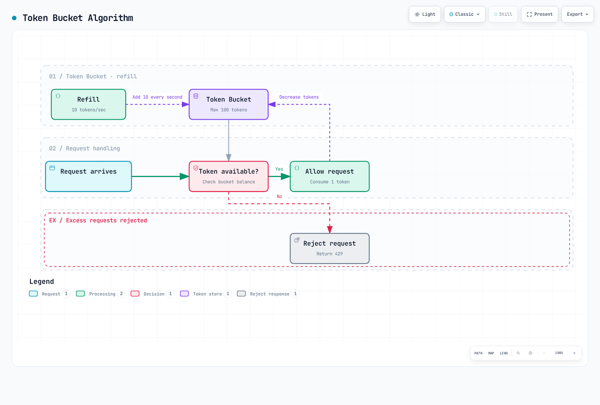

# Limitación de tasa

> **Última actualización**: 11 de septiembre de 2026 · Istio 1.31. Ejemplos independientes; elija una política local por carga/listener. Las aplicaciones sidecar usan HTTP 8080 en `default`; los gateways seleccionan uno dedicado con `istio: ingressgateway` en `istio-system`. Verifique etiquetas/listeners antes de aplicar. No se desplegaron ni probaron con carga.

La limitación de tasa restringe solicitudes para proteger servicios de sobrecarga, asegurar uso justo y controlar costes.

## Índice

1. [Descripción general](#overview)
2. [Tipos](#rate-limiting-types)
3. [Limitación local](#local-rate-limiting)
4. [Limitación global](#global-rate-limiting)
5. [Ejemplos prácticos](#practical-examples)
6. [Monitorización](#monitoring)
7. [Resolución de problemas](#troubleshooting)

## Descripción general {#overview}

Se necesita limitación en estas situaciones:


[🔍 Ver diagrama interactivo](https://www.atomai.click/kubernetes-docs/archmaps/en-service-mesh-istio-resilience-02-rate-limiting-0.html)

### Objetivos

1. **Protección del servicio**: Evitar sobrecarga
2. **Equidad**: Requiere un modelo deliberado de descriptores/identidad; un bucket compartido no implica equidad por cliente.
3. **Control de costes**: Gestionar costes de llamadas a API externas
4. **Reducir abuso**: Limita solicitudes HTTP seleccionadas; no sustituye protección edge/DDoS ni evita agotamiento de conexiones/TLS.

## Tipos de limitación {#rate-limiting-types}

### 1. Limitación local

**Características**:
- Cada proxy Envoy limita de forma independiente
- Respuesta rápida sin llamadas adicionales
- En entornos distribuidos, el límite total se aplica por instancia

```yaml
# 100 req/s limit per pod
# Three independently configured buckets can sustain roughly 300 req/s in aggregate,
# subject to traffic distribution; each bucket also has its own burst allowance.
```

### 2. Limitación global

**Características**:
- Usa servidor centralizado
- Contadores compartidos por dominio/descriptor y ventana; importa el comportamiento de backend/fallo
- Ligera latencia por llamada externa

```yaml
# Shared descriptor quota:100 per backend second-window
# Replicas must use the same counter; test window boundaries and backend failures.
```

### Comparación

| Característica | Local | Global |
|----------------|---------------------|----------------------|
| **Alcance de cuota** | Por bucket local configurado | Dominio/descriptor compartido |
| **Rendimiento** | Muy rápido | Algo más lento |
| **Complejidad** | Baja | Alta, requiere servicio externo |
| **Uso** | Protección general | Control preciso |

## Limitación local {#local-rate-limiting}

### Algoritmo token bucket



[🔍 Ver diagrama interactivo](https://www.atomai.click/kubernetes-docs/archmaps/en-service-mesh-istio-resilience-02-rate-limiting-1.html)

### Configuración básica

```yaml
apiVersion: networking.istio.io/v1alpha3
kind: EnvoyFilter
metadata:
  name: local-ratelimit
  namespace: default
spec:
  workloadSelector:
    labels:
      app: myapp
  configPatches:
  - applyTo: HTTP_FILTER
    match:
      context: SIDECAR_INBOUND
      listener:
        filterChain:
          filter:
            name: envoy.filters.network.http_connection_manager
            subFilter:
              name: envoy.filters.http.router
        portNumber: 8080
    patch:
      operation: INSERT_BEFORE
      value:
        name: envoy.filters.http.local_ratelimit
        typed_config:
          '@type': type.googleapis.com/envoy.extensions.filters.http.local_ratelimit.v3.LocalRateLimit
          stat_prefix: http_local_rate_limiter
          token_bucket:
            max_tokens: 100
            tokens_per_fill: 10
            fill_interval: 1s
          filter_enabled:
            default_value:
              numerator: 100
              denominator: HUNDRED
          filter_enforced:
            default_value:
              numerator: 100
              denominator: HUNDRED
          response_headers_to_add:
          - header:
              key: x-local-rate-limit
              value: 'true'
            append_action: OVERWRITE_IF_EXISTS_OR_ADD
```

**Parámetros principales**:
- `max_tokens`: Máximo de tokens del bucket, permite ráfagas
- `tokens_per_fill`: Tokens añadidos por fill_interval
- `fill_interval`: Intervalo de reposición

**Ejemplo**:
```yaml
# 10 requests per second, 100 burst allowed
token_bucket:
  max_tokens: 100
  tokens_per_fill: 10
  fill_interval: 1s

# Result:
# - Average: 10 req/s
# - Burst: up to100 immediately available tokens, not a second sustained rate
```

### Limitación por ruta

```yaml
apiVersion: networking.istio.io/v1alpha3
kind: EnvoyFilter
metadata:
  name: path-based-ratelimit
  namespace: default
spec:
  workloadSelector:
    labels:
      app: api-service
  configPatches:
  - applyTo: HTTP_FILTER
    match:
      context: SIDECAR_INBOUND
      listener:
        filterChain:
          filter:
            name: envoy.filters.network.http_connection_manager
            subFilter:
              name: envoy.filters.http.router
        portNumber: 8080
    patch:
      operation: INSERT_BEFORE
      value:
        name: envoy.filters.http.local_ratelimit
        typed_config:
          '@type': type.googleapis.com/envoy.extensions.filters.http.local_ratelimit.v3.LocalRateLimit
          stat_prefix: http_local_rate_limiter
          descriptors:
          - entries:
            - key: header_match
              value: /api/v1/users
            token_bucket:
              max_tokens: 1000
              tokens_per_fill: 100
              fill_interval: 1s
          - entries:
            - key: header_match
              value: /api/v1/admin
            token_bucket:
              max_tokens: 100
              tokens_per_fill: 10
              fill_interval: 1s
          filter_enabled:
            default_value:
              numerator: 100
              denominator: HUNDRED
          filter_enforced:
            default_value:
              numerator: 100
              denominator: HUNDRED
          token_bucket:
            max_tokens: 100
            tokens_per_fill: 10
            fill_interval: 1s
          always_consume_default_token_bucket: false
          rate_limits:
          - actions:
            - header_value_match:
                descriptor_value: /api/v1/users
                headers:
                - name: :path
                  string_match:
                    prefix: /api/v1/users
          - actions:
            - header_value_match:
                descriptor_value: /api/v1/admin
                headers:
                - name: :path
                  string_match:
                    prefix: /api/v1/admin
```

`rate_limits` genera entradas `header_match` y `descriptors` elige buckets coincidentes. El campo existe en la API Envoy fijada por Istio 1.31; aquí sustituye la búsqueda local de acciones de ruta/vhost. Los valores de ruta son claves literales de descriptor; la coincidencia de prefijo real está en `headers`. Los prefijos también coinciden con rutas más largas que empiezan igual. El bucket fallback limita solicitudes no coincidentes; `always_consume_default_token_bucket: false` evita limitar adicionalmente usuarios de 100 req/s al fallback de 10 req/s.

### Limitación por cabeceras

```yaml
apiVersion: networking.istio.io/v1alpha3
kind: EnvoyFilter
metadata:
  name: user-based-ratelimit
  namespace: default
spec:
  workloadSelector:
    labels:
      app: api-service
  configPatches:
  - applyTo: HTTP_FILTER
    match:
      context: SIDECAR_INBOUND
      listener:
        filterChain:
          filter:
            name: envoy.filters.network.http_connection_manager
            subFilter:
              name: envoy.filters.http.router
        portNumber: 8080
    patch:
      operation: INSERT_BEFORE
      value:
        name: envoy.filters.http.local_ratelimit
        typed_config:
          '@type': type.googleapis.com/envoy.extensions.filters.http.local_ratelimit.v3.LocalRateLimit
          stat_prefix: http_local_rate_limiter
          descriptors:
          - entries:
            - key: header_match
              value: x-user-tier:premium
            token_bucket:
              max_tokens: 1000
              tokens_per_fill: 100
              fill_interval: 1s
          - entries:
            - key: header_match
              value: x-user-tier:free
            token_bucket:
              max_tokens: 100
              tokens_per_fill: 10
              fill_interval: 1s
          filter_enabled:
            default_value:
              numerator: 100
              denominator: HUNDRED
          filter_enforced:
            default_value:
              numerator: 100
              denominator: HUNDRED
          token_bucket:
            max_tokens: 100
            tokens_per_fill: 10
            fill_interval: 1s
          always_consume_default_token_bucket: false
          rate_limits:
          - actions:
            - header_value_match:
                descriptor_value: x-user-tier:premium
                headers:
                - name: x-user-tier
                  string_match:
                    exact: premium
          - actions:
            - header_value_match:
                descriptor_value: x-user-tier:free
                headers:
                - name: x-user-tier
                  string_match:
                    exact: free
```

Los descriptores de nivel son buckets compartidos por nivel en cada proxy, no por usuario. Un upstream autenticado debe retirar cabeceras de nivel del cliente e insertar un nivel confiable, y el servicio debe impedir bypass. Niveles ausentes/desconocidos usan fallback acotado. Una cabecera premium sola no autentica.

## Limitación global {#global-rate-limiting}

Consulta un servicio compartido de decisión sobre dominio/descriptor. Puede abarcar réplicas gateway, pero no automáticamente cada solicitud del clúster. Almacenamiento de contadores, límites de ventana, failover y política de fallos afectan la garantía real.

### Arquitectura


[🔍 Ver diagrama interactivo](https://www.atomai.click/kubernetes-docs/archmaps/en-service-mesh-istio-resilience-02-rate-limiting-2.html)

### Método de configuración

La limitación global requiere desplegar servicio externo e integrarlo mediante EnvoyFilter.

La caché del diagrama debe respaldarse con contadores compartidos como Redis; cachés independientes en proceso no crean cuota global. El Deployment supone un **servicio Redis TCP ya disponible** en `redis-ratelimit.istio-system.svc.cluster.local:6379` dentro de laboratorio aislado. Aprovisionamiento, autenticación/TLS, persistencia/HA y failover son requisitos separados; no se crea aquí. Configure REDIS_AUTH/REDIS_TLS/certificados del servicio fijado mediante Secrets/montajes apropiados.

La imagen corresponde al commit publicado 8fe6ea42 del 24 de agosto de 2026, fijado por digest de manifiesto y disponible para linux/amd64 y linux/arm64. Upstream usa etiquetas de commit, no releases semánticas posteriores a v1.4.0; no afirma una release productiva/estable certificada. Revise y pruebe actualizaciones. Deployment pide sidecar explícito: verifique selección del injector y acceso gateway a gRPC bajo políticas reales.

#### 1. Desplegar el servicio de límites

**Nota**: Istio usa [envoyproxy/ratelimit](https://github.com/envoyproxy/ratelimit) como dependencia externa.

```yaml
apiVersion: v1
kind: ConfigMap
metadata:
  name: ratelimit-config
  namespace: istio-system
data:
  config.yaml: "domain: production-ratelimit\ndescriptors:\n  # Global limit: 100 per second\n  - key: generic_key\n    value: \"global\"\n    rate_limit:\n      unit: second\n      requests_per_unit: 100\n\n  # Per-path limit\n  - key: header_match\n    value: \"/api/v1/*\"\n    rate_limit:\n      unit: second\n      requests_per_unit: 50\n\n  # Per-user limit (per minute)\n  - key: remote_address\n    rate_limit:\n      unit: minute\n      requests_per_unit: 1000\n"
---
apiVersion: apps/v1
kind: Deployment
metadata:
  name: ratelimit
  namespace: istio-system
spec:
  replicas: 1
  selector:
    matchLabels:
      app: ratelimit
  template:
    metadata:
      labels:
        app: ratelimit
      annotations:
        sidecar.istio.io/inject: 'true'
    spec:
      containers:
      - name: ratelimit
        image: docker.io/envoyproxy/ratelimit:8fe6ea42@sha256:a61547259607d40aff153050c2a87873ca1676d1d9f5f06937d412000dcc2df1
        ports:
        - containerPort: 8080
          name: http
        - containerPort: 8081
          name: grpc
        env:
        - name: LOG_LEVEL
          value: info
        - name: CONFIG_TYPE
          value: FILE
        - name: RUNTIME_ROOT
          value: /data
        - name: RUNTIME_SUBDIRECTORY
          value: ratelimit
        - name: RUNTIME_APPDIRECTORY
          value: config
        - name: RUNTIME_WATCH_ROOT
          value: 'false'
        - name: RUNTIME_IGNOREDOTFILES
          value: 'true'
        - name: USE_STATSD
          value: 'false'
        - name: REDIS_SOCKET_TYPE
          value: tcp
        - name: REDIS_URL
          value: redis-ratelimit.istio-system.svc.cluster.local:6379
        - name: HOST
          value: '::'
        - name: GRPC_HOST
          value: '::'
        - name: HEALTHY_WITH_AT_LEAST_ONE_CONFIG_LOADED
          value: 'true'
        volumeMounts:
        - name: config-volume
          mountPath: /data/ratelimit/config
          readOnly: true
        command:
        - /bin/ratelimit
        resources:
          requests:
            memory: 128Mi
            cpu: 100m
          limits:
            memory: 512Mi
            cpu: 500m
        readinessProbe:
          httpGet:
            path: /healthcheck
            port: 8080
          initialDelaySeconds: 5
          periodSeconds: 5
      volumes:
      - name: config-volume
        configMap:
          name: ratelimit-config
---
apiVersion: v1
kind: Service
metadata:
  name: ratelimit
  namespace: istio-system
spec:
  ports:
  - port: 8080
    name: http
    targetPort: 8080
  - port: 8081
    name: grpc
    targetPort: 8081
  selector:
    app: ratelimit
```

#### 2. Configurar límites globales con EnvoyFilter

```yaml
apiVersion: networking.istio.io/v1alpha3
kind: EnvoyFilter
metadata:
  name: filter-ratelimit
  namespace: istio-system
spec:
  workloadSelector:
    labels:
      istio: ingressgateway
  configPatches:
  - applyTo: HTTP_FILTER
    match:
      context: GATEWAY
      listener:
        filterChain:
          filter:
            name: envoy.filters.network.http_connection_manager
            subFilter:
              name: envoy.filters.http.router
    patch:
      operation: INSERT_BEFORE
      value:
        name: envoy.filters.http.ratelimit
        typed_config:
          '@type': type.googleapis.com/envoy.extensions.filters.http.ratelimit.v3.RateLimit
          domain: production-ratelimit
          failure_mode_deny: true
          timeout: 0.1s
          rate_limit_service:
            grpc_service:
              envoy_grpc:
                cluster_name: outbound|8081||ratelimit.istio-system.svc.cluster.local
                authority: ratelimit.istio-system.svc.cluster.local
            transport_api_version: V3
```

#### 3. Añadir acciones al VirtualHost del gateway

Aplique el conjunto una vez al mismo gateway dedicado. Cubre deliberadamente todos sus virtual hosts HTTP; en uno compartido, limite a un vhost generado verificado. Genera descriptores globales, por prefijo y por IP correspondientes al ConfigMap. `remote_address` es una IP downstream confiable, no identidad de usuario; configure la cadena proxy/XFF real y considere NAT antes de usarla como cuota.


```yaml
apiVersion: networking.istio.io/v1alpha3
kind: EnvoyFilter
metadata:
  name: filter-ratelimit-actions
  namespace: istio-system
spec:
  workloadSelector:
    labels:
      istio: ingressgateway
  configPatches:
  - applyTo: VIRTUAL_HOST
    match:
      context: GATEWAY
    patch:
      operation: MERGE
      value:
        rate_limits:
        - actions:
          - generic_key:
              descriptor_value: global
        - actions:
          - header_value_match:
              descriptor_value: /api/v1/*
              headers:
              - name: :path
                string_match:
                  prefix: /api/v1/
        - actions:
          - remote_address: {}
```

El filtro usa el clúster gRPC generado por Istio, con descubrimiento normal y TLS de malla. No añade un clúster manual en texto plano. `failure_mode_deny: true` normalmente devuelve HTTP 500 ante error de decisión y 429 al exceder límites; false puede permitir ante fallo. El presupuesto 100ms es ilustrativo: alinee timeouts Redis, latencia y plazos del llamante. Pruebe contadores entre ventanas, reinicio/failover Redis y cambios de réplicas. Confirme recarga/reinicio tras cambiar ConfigMap; un Pod Running no prueba política cargada.

### Parámetros principales

| Parámetro | Descripción |
|-----------|-------------|
| `domain` | Dominio de configuración del servicio, debe coincidir con ConfigMap |
| `failure_mode_deny` | Rechazar o no cuando falla el servicio de decisión |
| `timeout` | Espera de respuesta del servicio |
| `rate_limit_service` | Endpoint gRPC externo |

### Criterios para elegir global o local

**Usar local**:
- Configuración sencilla
- Respuesta rápida
- Sin dependencias externas
- Alcance por bucket; réplicas/distribución afectan throughput agregado

**Usar global**:
- Límites compartidos para descriptores elegidos
- Reglas complejas por usuario/IP/ruta
- Gestión central
- Requiere servicio externo, con más complejidad
- Pequeña latencia por gRPC

**Recomendaciones**:
- **API Gateway productivo**: Global para control preciso
- **Protección de microservicios**: Local para respuesta rápida
- **Híbrido**: Global en gateway, local dentro

## Ejemplos prácticos {#practical-examples}

### Ejemplo 1: Limitar API Gateway

```yaml
apiVersion: networking.istio.io/v1alpha3
kind: EnvoyFilter
metadata:
  name: api-gateway-ratelimit
  namespace: istio-system
spec:
  workloadSelector:
    labels:
      istio: ingressgateway
  configPatches:
  - applyTo: HTTP_FILTER
    match:
      context: GATEWAY
      listener:
        filterChain:
          filter:
            name: envoy.filters.network.http_connection_manager
            subFilter:
              name: envoy.filters.http.router
    patch:
      operation: INSERT_BEFORE
      value:
        name: envoy.filters.http.local_ratelimit
        typed_config:
          '@type': type.googleapis.com/envoy.extensions.filters.http.local_ratelimit.v3.LocalRateLimit
          stat_prefix: http_local_rate_limiter
          descriptors:
          - entries:
            - key: header_match
              value: /api/v1/public/*
            token_bucket:
              max_tokens: 100
              tokens_per_fill: 10
              fill_interval: 1s
          - entries:
            - key: header_match
              value: /api/v1/protected/*
            token_bucket:
              max_tokens: 1000
              tokens_per_fill: 100
              fill_interval: 1s
          - entries:
            - key: header_match
              value: /graphql
            token_bucket:
              max_tokens: 500
              tokens_per_fill: 50
              fill_interval: 1s
          filter_enabled:
            default_value:
              numerator: 100
              denominator: HUNDRED
          filter_enforced:
            default_value:
              numerator: 100
              denominator: HUNDRED
          token_bucket:
            max_tokens: 100
            tokens_per_fill: 10
            fill_interval: 1s
          always_consume_default_token_bucket: false
          rate_limits:
          - actions:
            - header_value_match:
                descriptor_value: /api/v1/public/*
                headers:
                - name: :path
                  string_match:
                    prefix: /api/v1/public/
          - actions:
            - header_value_match:
                descriptor_value: /api/v1/protected/*
                headers:
                - name: :path
                  string_match:
                    prefix: /api/v1/protected/
          - actions:
            - header_value_match:
                descriptor_value: /graphql
                headers:
                - name: :path
                  string_match:
                    prefix: /graphql
```

El ejemplo local clasifica prefijos; `/protected` no exige autenticación por sí solo. Cada réplica gateway tiene buckets independientes. Rutas desconocidas usan fallback. `rate_limits` propio evita depender de un nombre de ruta generado adivinado.

### Ejemplo 2: Límites por nivel de usuario

```yaml
apiVersion: networking.istio.io/v1alpha3
kind: EnvoyFilter
metadata:
  name: tiered-ratelimit
  namespace: default
spec:
  workloadSelector:
    labels:
      app: api-service
  configPatches:
  - applyTo: HTTP_FILTER
    match:
      context: SIDECAR_INBOUND
      listener:
        filterChain:
          filter:
            name: envoy.filters.network.http_connection_manager
            subFilter:
              name: envoy.filters.http.router
        portNumber: 8080
    patch:
      operation: INSERT_BEFORE
      value:
        name: envoy.filters.http.local_ratelimit
        typed_config:
          '@type': type.googleapis.com/envoy.extensions.filters.http.local_ratelimit.v3.LocalRateLimit
          stat_prefix: http_local_rate_limiter
          descriptors:
          - entries:
            - key: header_match
              value: x-api-tier:enterprise
            token_bucket:
              max_tokens: 10000
              tokens_per_fill: 1000
              fill_interval: 1s
          - entries:
            - key: header_match
              value: x-api-tier:premium
            token_bucket:
              max_tokens: 1000
              tokens_per_fill: 100
              fill_interval: 1s
          - entries:
            - key: header_match
              value: x-api-tier:free
            token_bucket:
              max_tokens: 100
              tokens_per_fill: 10
              fill_interval: 1s
          filter_enabled:
            default_value:
              numerator: 100
              denominator: HUNDRED
          filter_enforced:
            default_value:
              numerator: 100
              denominator: HUNDRED
          token_bucket:
            max_tokens: 100
            tokens_per_fill: 10
            fill_interval: 1s
          always_consume_default_token_bucket: false
          rate_limits:
          - actions:
            - header_value_match:
                descriptor_value: x-api-tier:enterprise
                headers:
                - name: x-api-tier
                  string_match:
                    exact: enterprise
          - actions:
            - header_value_match:
                descriptor_value: x-api-tier:premium
                headers:
                - name: x-api-tier
                  string_match:
                    exact: premium
          - actions:
            - header_value_match:
                descriptor_value: x-api-tier:free
                headers:
                - name: x-api-tier
                  string_match:
                    exact: free
```

Las cuotas enterprise/premium/free se comparten por nivel y bucket de proxy configurado. Requieren los mismos controles de cabecera confiable y anti-bypass. No interprete 1000 req/s como asignación independiente de cada usuario enterprise.

### Ejemplo 3: Proteger API externa

```yaml
apiVersion: networking.istio.io/v1alpha3
kind: EnvoyFilter
metadata:
  name: external-api-ratelimit
  namespace: default
spec:
  workloadSelector:
    labels:
      app: myapp
  configPatches:
  - applyTo: HTTP_FILTER
    match:
      context: SIDECAR_OUTBOUND
      listener:
        filterChain:
          filter:
            name: envoy.filters.network.http_connection_manager
            subFilter:
              name: envoy.filters.http.router
    patch:
      operation: INSERT_BEFORE
      value:
        name: envoy.filters.http.local_ratelimit
        typed_config:
          '@type': type.googleapis.com/envoy.extensions.filters.http.local_ratelimit.v3.LocalRateLimit
          stat_prefix: egress_rate_limiter
  - applyTo: VIRTUAL_HOST
    match:
      context: SIDECAR_OUTBOUND
      routeConfiguration:
        vhost:
          name: api.external.com:80
    patch:
      operation: MERGE
      value:
        typed_per_filter_config:
          envoy.filters.http.local_ratelimit:
            '@type': type.googleapis.com/envoy.extensions.filters.http.local_ratelimit.v3.LocalRateLimit
            stat_prefix: egress_rate_limiter
            token_bucket:
              max_tokens: 1000
              tokens_per_fill: 10
              fill_interval: 1s
            response_headers_to_add:
            - header:
                key: x-rate-limit-exceeded
                value: 'true'
              append_action: OVERWRITE_IF_EXISTS_OR_ADD
            filter_enabled:
              default_value:
                numerator: 100
                denominator: HUNDRED
            filter_enforced:
              default_value:
                numerator: 100
                denominator: HUNDRED
```

El ejemplo egress supone ServiceEntry/DestinationRule `api.external.com` HTTP 80→TLS 443 de [protección externa](01-outlier-detection.md#protecting-external-services-serviceentry). Verifique vhost `api.external.com:80`. El listener instala filtro inactivo; solo ese vhost recibe bucket habilitado. Los demás hosts HTTP salientes no se limitan aquí. HTTPS opaco de aplicación no puede clasificarse con HTTP. Cada llamante tiene bucket propio: no es cuota compartida del proveedor/cuenta. La cabecera marca respuestas rechazadas; no configura logging.

## Monitorización {#monitoring}

### Métricas Prometheus

Combine la anotación en la plantilla Pod de aplicación/gateway y despliegue proxies nuevos. Use recogida de [métricas](../observability/01-metrics.md); las consultas suponen etiquetas `namespace`/`pod` y un scrape por proxy. Descubra nombres reales porque el prefijo local depende de `stat_prefix`.

```yaml
spec:
  template:
    metadata:
      annotations:
        proxy.istio.io/config: |
          proxyStatsMatcher:
            inclusionRegexps:
            - ".*http_local_rate_limit.*"
            - ".*ratelimit.*"
```

En orden: rechazos locales aplicados/s, decisiones bajo límite/s, fracción aplicada de solicitudes consultadas, y resultados globales sobre límite/OK/error/fail-open por segundo. `rate_limited` cuenta ausencia de tokens incluso sin enforcement; `enforced` cuenta rechazos efectivos. `over_limit` no es total de llamadas globales. Los contadores globales pertenecen al clúster destino enrutado, no necesariamente al del servicio de límites.

```promql
sum by (namespace, pod) (rate({__name__=~"envoy_.*http_local_rate_limit_enforced",namespace="default"}[5m]))

sum by (namespace, pod) (rate({__name__=~"envoy_.*http_local_rate_limit_ok",namespace="default"}[5m]))

100 * sum by (namespace, pod) (rate({__name__=~"envoy_.*http_local_rate_limit_enforced",namespace="default"}[5m])) / sum by (namespace, pod) (rate({__name__=~"envoy_.*http_local_rate_limit_enabled",namespace="default"}[5m]))

rate(envoy_cluster_ratelimit_over_limit{namespace="istio-system"}[5m])

rate(envoy_cluster_ratelimit_ok{namespace="istio-system"}[5m])

rate(envoy_cluster_ratelimit_error{namespace="istio-system"}[5m])

rate(envoy_cluster_ratelimit_failure_mode_allowed{namespace="istio-system"}[5m])
```

Para políticas locales de gateway use `namespace="istio-system"`; restrinja etiquetas Pod/clúster/prefijo. Denominador cero, estadística ausente o scrape fallido necesitan manejo explícito de no-data. La aplicación puede devolver 429 por sí misma, así que ese estado no demuestra aplicación de esta cuota.

### Dashboard Grafana

El objeto requiere UID `prometheus` y etiquetas anteriores. Use [provisioning de archivo](../observability/04-dashboards.md); una etiqueta ConfigMap no es un cargador.

```json
{
  "uid": "istio-rate-limiting",
  "title": "Istio Rate Limiting",
  "panels": [
    {
      "id": 1,
      "title": "Local Enforced Rejections per Second",
      "type": "timeseries",
      "datasource": {
        "type": "prometheus",
        "uid": "prometheus"
      },
      "targets": [
        {
          "expr": "sum by (namespace, pod) (rate({__name__=~\"envoy_.*http_local_rate_limit_enforced\",namespace=\"default\"}[5m]))",
          "legendFormat": "{{namespace}} / {{pod}}",
          "refId": "A"
        }
      ],
      "gridPos": {
        "x": 0,
        "y": 0,
        "w": 24,
        "h": 8
      },
      "fieldConfig": {
        "defaults": {
          "unit": "short"
        }
      }
    },
    {
      "id": 2,
      "title": "Local Enforced Fraction",
      "type": "timeseries",
      "datasource": {
        "type": "prometheus",
        "uid": "prometheus"
      },
      "targets": [
        {
          "expr": "100 * sum by (namespace, pod) (rate({__name__=~\"envoy_.*http_local_rate_limit_enforced\",namespace=\"default\"}[5m])) / sum by (namespace, pod) (rate({__name__=~\"envoy_.*http_local_rate_limit_enabled\",namespace=\"default\"}[5m]))",
          "legendFormat": "{{namespace}} / {{pod}}",
          "refId": "A"
        }
      ],
      "gridPos": {
        "x": 0,
        "y": 8,
        "w": 24,
        "h": 8
      },
      "fieldConfig": {
        "defaults": {
          "unit": "percent"
        }
      }
    }
  ],
  "time": {
    "from": "now-1h",
    "to": "now"
  },
  "refresh": "30s"
}
```

## Resolución de problemas {#troubleshooting}

### Los límites no funcionan

```bash
# 1. Check EnvoyFilter
kubectl get envoyfilter -A

# 2. Check Envoy configuration
istioctl proxy-config listeners <pod-name> -n <namespace> -o json | \
  jq '.. | objects | select(.name? == "envoy.filters.http.local_ratelimit" or .name? == "envoy.filters.http.ratelimit")'

# 3. Check route/vhost overrides and actual optional counters
istioctl proxy-config routes <pod-name> -n <namespace> -o json
istioctl x envoy-stats <pod-name> -n <namespace> --output prom | grep -E "rate_limit|ratelimit"
```

### Fallo de conexión de límites globales

```bash
# Check Rate Limit Service
kubectl get pods -n istio-system -l app=ratelimit
kubectl logs -n istio-system -l app=ratelimit

# Check Redis connection
kubectl exec <redis-client-pod> -n istio-system -c <client-container> -- \
  redis-cli -h redis-ratelimit.istio-system.svc.cluster.local -p 6379 PING

# Check the gateway-to-service cluster and ready backend endpoints
istioctl proxy-config clusters <gateway-pod> -n istio-system --fqdn ratelimit.istio-system.svc.cluster.local
kubectl get endpointslice -n istio-system -l kubernetes.io/service-name=ratelimit
```

El comando Redis requiere contenedor cliente autorizado existente con redis-cli y TLS/autenticación adecuados. La imagen de límites fijada es distroless, sin shell ni redis-cli. Inspeccione logs, `/healthcheck`, configuración cargada, selectores, política de malla y descriptores iguales. Un Pod verde o log predeterminado vacío no prueba enforcement.

## Referencias

- [Limitación de tasa Istio](https://istio.io/latest/docs/tasks/policy-enforcement/rate-limit/)
- [Limitación Envoy](https://www.envoyproxy.io/docs/envoy/latest/configuration/http/http_filters/local_rate_limit_filter)
- [Limitación global Envoy](https://github.com/envoyproxy/ratelimit)
