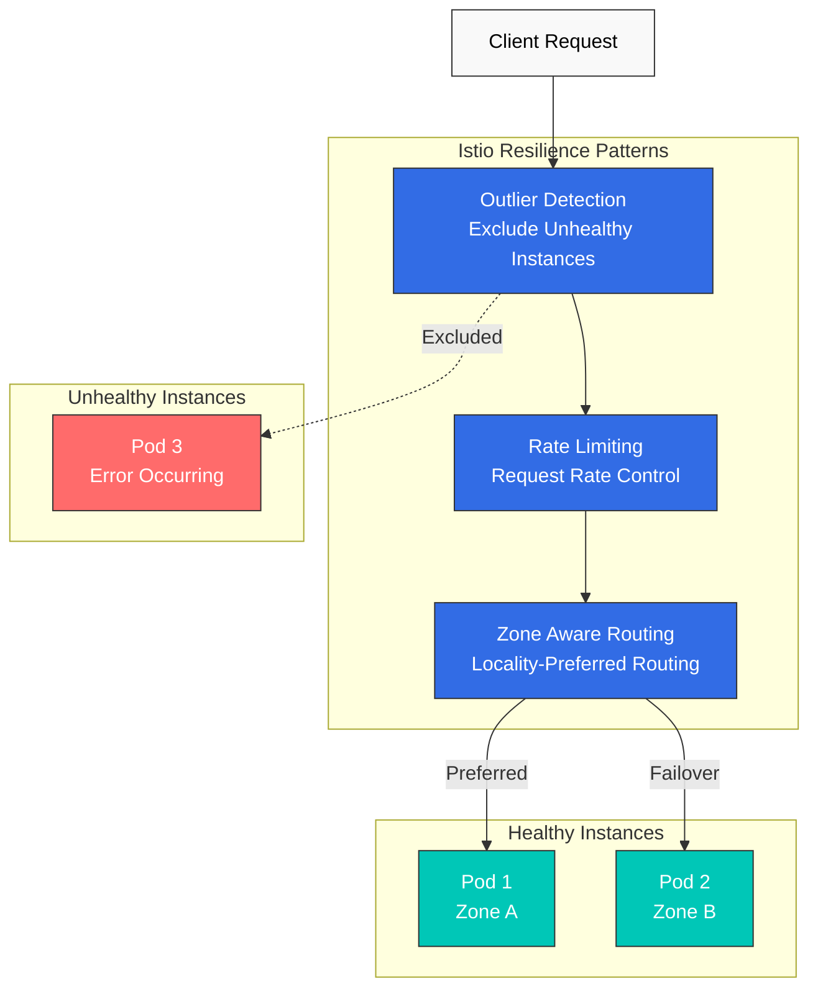
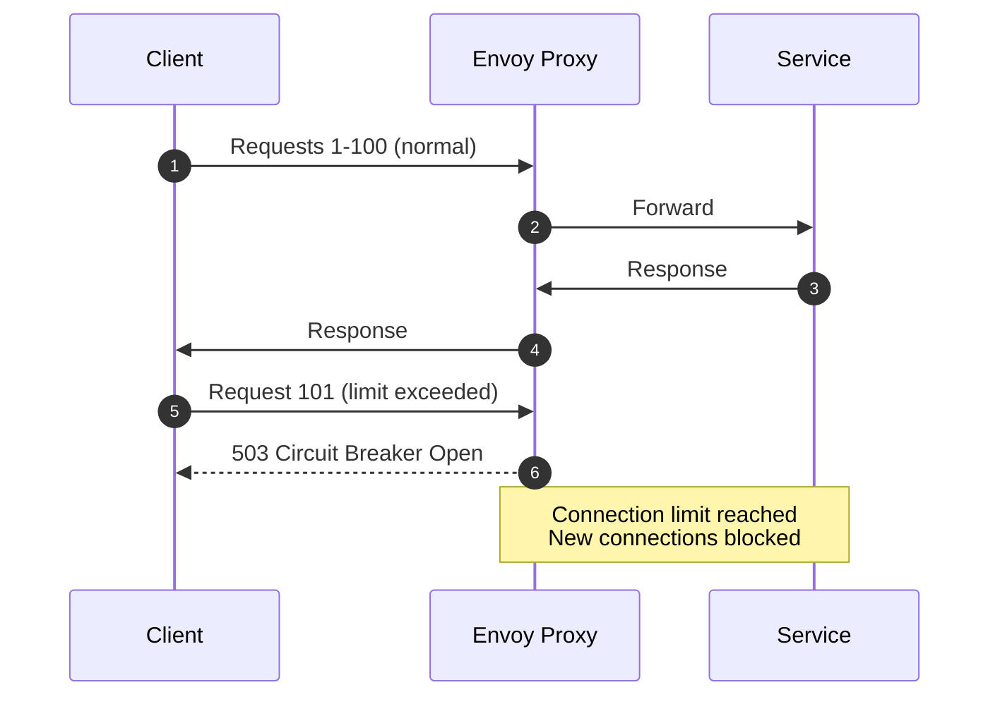
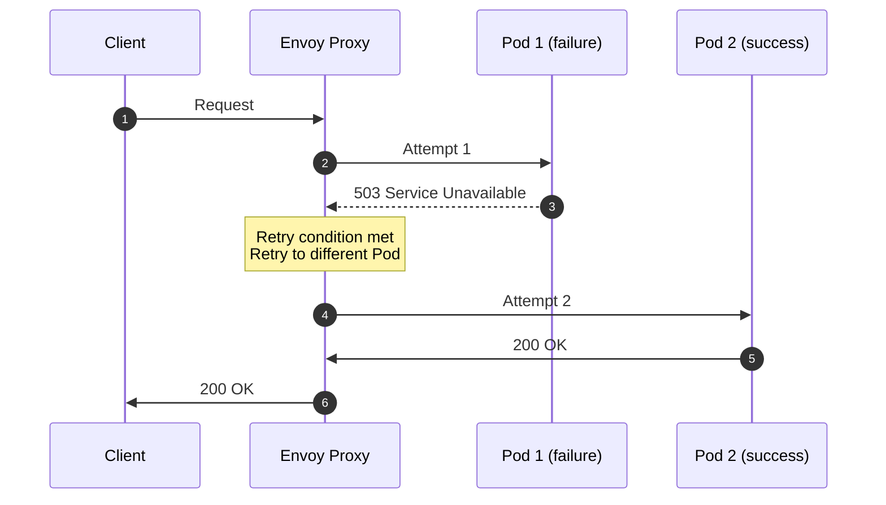
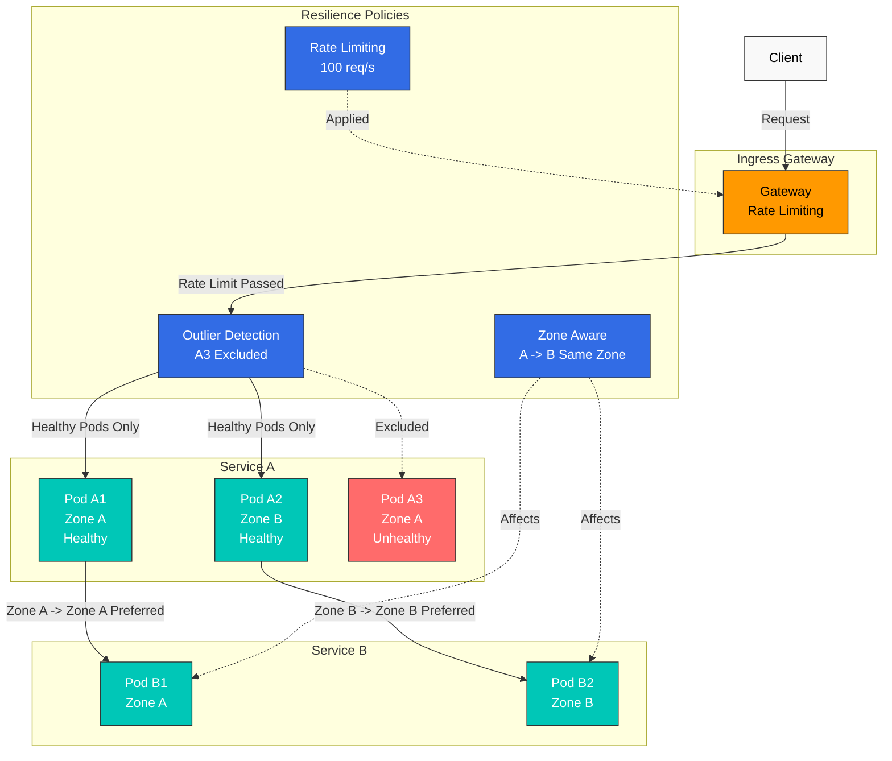

# Resiliencia

Las características de resiliencia de Istio garantizan que el service mesh funcione de forma fiable incluso en escenarios de fallo.

## Tabla de contenido

1. [Detección de valores atípicos](01-outlier-detection.md)
2. [Limitación de velocidad](02-rate-limiting.md)
3. [Enrutamiento consciente de zona](03-zone-aware-routing.md)

### Patrones adicionales de resiliencia

Esta documentación también cubre los siguientes patrones:
- **Circuit Breaker**: Interrupción de circuito mediante Connection Pool
- **Retry**: Políticas de reintento
- **Timeout**: Límites de tiempo de solicitud
- **Fault Injection**: Pruebas de inyección de fallos

## Descripción general

La resiliencia es una característica crítica en los sistemas distribuidos. Istio puede implementar automáticamente diversos patrones de resiliencia.

### Patrones principales de resiliencia



### 1. Detección de valores atípicos

Detecta automáticamente las instancias de Service que presentan un comportamiento anómalo y las excluye del conjunto de tráfico.

```yaml
apiVersion: networking.istio.io/v1
kind: DestinationRule
metadata:
  name: myapp
spec:
  host: myapp
  trafficPolicy:
    outlierDetection:
      consecutiveErrors: 5
      interval: 30s
      baseEjectionTime: 30s
      maxEjectionPercent: 50
```

**Características principales**:
- Detección de errores consecutivos
- Exclusión y recuperación automáticas
- Funciona con Circuit Breaker

### 2. Limitación de velocidad

Limita la tasa de solicitudes para proteger los Services de la sobrecarga.

```yaml
apiVersion: networking.istio.io/v1
kind: EnvoyFilter
metadata:
  name: ratelimit
spec:
  configPatches:
  - applyTo: HTTP_FILTER
    match:
      context: SIDECAR_INBOUND
    patch:
      operation: INSERT_BEFORE
      value:
        name: envoy.filters.http.local_ratelimit
        typed_config:
          "@type": type.googleapis.com/envoy.extensions.filters.http.local_ratelimit.v3.LocalRateLimit
          stat_prefix: http_local_rate_limiter
          token_bucket:
            max_tokens: 100
            tokens_per_fill: 10
            fill_interval: 1s
```

**Características principales**:
- Algoritmo Token Bucket
- Limitación de velocidad local y global
- Límites por cliente y por ruta

### 3. Enrutamiento consciente de zona

Optimiza el tráfico entre Availability Zones para reducir la latencia y ahorrar costos.

```yaml
apiVersion: networking.istio.io/v1
kind: DestinationRule
metadata:
  name: myapp
spec:
  host: myapp
  trafficPolicy:
    loadBalancer:
      localityLbSetting:
        enabled: true
        distribute:
        - from: us-east-1a/*
          to:
            "us-east-1a/*": 80
            "us-east-1b/*": 20
```

**Características principales**:
- Prioriza el tráfico en la misma AZ
- Reduce los costos entre AZ
- Failover automático ante fallos

### 4. Circuit Breaker

Limita los conteos de conexiones y solicitudes para evitar la sobrecarga del Service.

```yaml
apiVersion: networking.istio.io/v1
kind: DestinationRule
metadata:
  name: circuit-breaker
spec:
  host: myapp
  trafficPolicy:
    connectionPool:
      tcp:
        maxConnections: 100              # Maximum TCP connections
      http:
        http1MaxPendingRequests: 10      # Maximum pending requests
        http2MaxRequests: 100            # Maximum HTTP/2 requests
        maxRequestsPerConnection: 2       # Maximum requests per connection
    outlierDetection:
      consecutiveErrors: 5
      interval: 30s
      baseEjectionTime: 30s
```

**Cómo funciona**:


**Características principales**:
- Límites de conexiones TCP
- Límites de solicitudes HTTP
- Límites de solicitudes pendientes
- Fail Fast ante desbordamiento

### 5. Retry

Reintenta automáticamente las solicitudes ante fallos transitorios.

```yaml
apiVersion: networking.istio.io/v1
kind: VirtualService
metadata:
  name: myapp
spec:
  hosts:
  - myapp
  http:
  - route:
    - destination:
        host: myapp
    retries:
      attempts: 3                        # Maximum 3 retries
      perTryTimeout: 2s                  # Timeout per attempt
      retryOn: 5xx,reset,connect-failure,refused-stream  # Retry conditions
    timeout: 10s                         # Total request timeout
```

**Condiciones de reintento** (`retryOn`):
- `5xx`: Errores del servidor (500, 502, 503, 504)
- `reset`: Restablecimiento de conexión TCP
- `connect-failure`: Fallo de conexión
- `refused-stream`: Flujo HTTP/2 rechazado
- `retriable-4xx`: 4xx reintentable (p. ej., 409)
- `gateway-error`: Errores de Gateway (502, 503, 504)

**Espera exponencial**:
```yaml
retries:
  attempts: 5
  perTryTimeout: 2s
  retryOn: 5xx
  retryRemoteLocalities: true            # Retry to other localities
```

**Cómo funciona**:


### 6. Timeout

Establece límites de tiempo para evitar que las solicitudes esperen indefinidamente.

```yaml
apiVersion: networking.istio.io/v1
kind: VirtualService
metadata:
  name: myapp
spec:
  hosts:
  - myapp
  http:
  - route:
    - destination:
        host: myapp
    timeout: 5s                          # Request timeout
    retries:
      attempts: 3
      perTryTimeout: 2s                  # Per-retry timeout
```

**Jerarquía de Timeout**:
```yaml
# Gateway level timeout
apiVersion: networking.istio.io/v1
kind: VirtualService
metadata:
  name: gateway-timeout
spec:
  gateways:
  - my-gateway
  hosts:
  - example.com
  http:
  - route:
    - destination:
        host: frontend
    timeout: 30s                         # Gateway -> Frontend: 30 seconds

---
# Service level timeout
apiVersion: networking.istio.io/v1
kind: VirtualService
metadata:
  name: service-timeout
spec:
  hosts:
  - backend
  http:
  - route:
    - destination:
        host: backend
    timeout: 5s                          # Frontend -> Backend: 5 seconds
```

**Configuración recomendada**:
- Gateway -> Frontend: 30-60 segundos (orientado al usuario)
- Service -> Service: 5-10 segundos (comunicación interna)
- Consultas a base de datos: 2-5 segundos
- APIs externas: 10-30 segundos

### 7. Fault Injection

Inyecta fallos intencionadamente para la ingeniería del caos.

```yaml
apiVersion: networking.istio.io/v1
kind: VirtualService
metadata:
  name: fault-injection
spec:
  hosts:
  - myapp
  http:
  - fault:
      # Delay injection
      delay:
        percentage:
          value: 10.0                    # 10% of requests delayed
        fixedDelay: 5s                   # 5 second delay

      # Error injection
      abort:
        percentage:
          value: 5.0                     # 5% of requests fail
        httpStatus: 503                  # Return 503 error

    route:
    - destination:
        host: myapp
```

**Escenarios de caso de uso**:

1. **Simulación de latencia de red**:
```yaml
fault:
  delay:
    percentage:
      value: 100.0
    fixedDelay: 7s
```

2. **Pruebas de fallos intermitentes**:
```yaml
fault:
  abort:
    percentage:
      value: 20.0                        # 20% failure rate
    httpStatus: 500
```

3. **Inyectar fallos solo para usuarios específicos**:
```yaml
apiVersion: networking.istio.io/v1
kind: VirtualService
metadata:
  name: fault-injection-user
spec:
  hosts:
  - myapp
  http:
  - match:
    - headers:
        end-user:
          exact: test-user               # Apply only to test-user
    fault:
      abort:
        percentage:
          value: 100.0
        httpStatus: 503
    route:
    - destination:
        host: myapp
```

## Combinaciones de patrones de resiliencia

### Detección de valores atípicos + Circuit Breaker

```yaml
apiVersion: networking.istio.io/v1
kind: DestinationRule
metadata:
  name: myapp-resilient
spec:
  host: myapp
  trafficPolicy:
    # Connection Pool (Circuit Breaker)
    connectionPool:
      tcp:
        maxConnections: 100
      http:
        http1MaxPendingRequests: 50
        maxRequestsPerConnection: 2

    # Outlier Detection
    outlierDetection:
      consecutiveErrors: 5
      interval: 30s
      baseEjectionTime: 30s
      maxEjectionPercent: 50
      minHealthPercent: 50
```

### Limitación de velocidad + Retry

```yaml
apiVersion: networking.istio.io/v1
kind: VirtualService
metadata:
  name: myapp
spec:
  hosts:
  - myapp
  http:
  - route:
    - destination:
        host: myapp
    retries:
      attempts: 3
      perTryTimeout: 2s
      retryOn: 5xx,reset,connect-failure
    timeout: 10s
---
apiVersion: networking.istio.io/v1
kind: EnvoyFilter
metadata:
  name: ratelimit
spec:
  workloadSelector:
    labels:
      app: myapp
  configPatches:
  - applyTo: HTTP_FILTER
    match:
      context: SIDECAR_INBOUND
    patch:
      operation: INSERT_BEFORE
      value:
        name: envoy.filters.http.local_ratelimit
        typed_config:
          "@type": type.googleapis.com/envoy.extensions.filters.http.local_ratelimit.v3.LocalRateLimit
          stat_prefix: http_local_rate_limiter
          token_bucket:
            max_tokens: 1000
            tokens_per_fill: 100
            fill_interval: 1s
```

## Arquitectura de resiliencia



## Métricas de resiliencia

### Consultas de Prometheus

```promql
# 1. Outlier Detection: Ejected instance count
envoy_cluster_outlier_detection_ejections_active

# 2. Rate Limiting: Rate-limited request count
rate(envoy_http_local_rate_limit_rate_limited[5m])

# 3. Zone Aware: Traffic ratio between zones
sum(rate(istio_requests_total[5m])) by (source_zone, destination_zone)

# 4. Circuit Breaker: Open circuit count
envoy_cluster_circuit_breakers_default_rq_open

# 5. Circuit Breaker: Requests rejected due to overflow
envoy_cluster_circuit_breakers_default_rq_overflow

# 6. Retry: Retried request count
sum(rate(envoy_cluster_upstream_rq_retry[5m]))

# 7. Retry: Retry success rate
sum(rate(envoy_cluster_upstream_rq_retry_success[5m])) /
sum(rate(envoy_cluster_upstream_rq_retry[5m])) * 100

# 8. Timeout: Timeout occurrence count
sum(rate(envoy_cluster_upstream_rq_timeout[5m]))

# 9. Overall request success rate
sum(rate(istio_requests_total{response_code!~"5.."}[5m])) /
sum(rate(istio_requests_total[5m])) * 100
```

### Paneles del dashboard de Grafana

**Estado de Circuit Breaker**:
```promql
# Active connections vs max connections
envoy_cluster_upstream_cx_active /
envoy_cluster_circuit_breakers_default_cx_max * 100
```

**Eficacia de Retry**:
```promql
# Error rate without retries
sum(rate(envoy_cluster_upstream_rq_xx{envoy_response_code_class="5"}[5m])) /
sum(rate(envoy_cluster_upstream_rq_xx[5m])) * 100

# Actual error rate after retries
sum(rate(istio_requests_total{response_code=~"5.."}[5m])) /
sum(rate(istio_requests_total[5m])) * 100
```

## Prácticas recomendadas

### 1. Ajuste de umbrales de detección de valores atípicos

```yaml
# Adjust according to service characteristics
outlierDetection:
  consecutiveErrors: 5          # 5 consecutive failures
  interval: 30s                 # Evaluate every 30 seconds
  baseEjectionTime: 30s         # 30 second ejection
  maxEjectionPercent: 50        # Maximum 50% ejected
  minHealthPercent: 50          # Maintain at least 50%
```

### 2. Limitación de velocidad por etapas

```yaml
# Apply limits at Gateway -> Service stages
# Gateway: Overall traffic limit
# Service: Individual service limit
```

### 3. Prioridad de enrutamiento consciente de zona

```yaml
# Prioritize same AZ, use other AZs for failover
distribute:
- from: us-east-1a/*
  to:
    "us-east-1a/*": 80    # Same AZ 80%
    "us-east-1b/*": 20    # Other AZ 20% (failover)
```

### 4. Configuración de Circuit Breaker

```yaml
# Configure according to service capacity
connectionPool:
  tcp:
    maxConnections: 100              # Maximum connections per pod
  http:
    http1MaxPendingRequests: 10      # Queue size (keep small)
    http2MaxRequests: 100
    maxRequestsPerConnection: 2       # Keep-alive limit

# Avoid overly large values
connectionPool:
  tcp:
    maxConnections: 10000            # Excessively large
  http:
    http1MaxPendingRequests: 1000    # Queue too long
```

**Valores recomendados**:
- `maxConnections`: Conteo de Pod x conexiones simultáneas esperadas x 1.5
- `http1MaxPendingRequests`: 10-50 (es importante fallar rápidamente)
- `maxRequestsPerConnection`: 1-5 (limita la reutilización de conexiones)

### 5. Política de Retry

```yaml
# Retry only idempotent requests
retries:
  attempts: 3
  perTryTimeout: 2s
  retryOn: 5xx,reset,connect-failure    # GET requests

# Avoid indiscriminate retries on POST/PUT requests
retries:
  attempts: 5
  retryOn: 5xx                           # Risk of duplicate data creation
```

**Pautas para Retry**:
- **GET, HEAD, OPTIONS**: Es seguro reintentar
- **POST, PUT, PATCH**: Reintenta solo si se garantiza la idempotencia
- **DELETE**: Es seguro reintentar (idempotente)

### 6. Configuración de Timeout

```yaml
# Hierarchical timeouts (parent > child)
# Gateway
timeout: 30s
retries:
  perTryTimeout: 10s

# Service A -> Service B
timeout: 10s
retries:
  perTryTimeout: 3s

# Avoid child timeout larger than parent
timeout: 5s
retries:
  perTryTimeout: 10s                     # perTryTimeout > timeout
```

**Fórmula de Timeout**:
```
total timeout >= (perTryTimeout x attempts) + overhead
```

Ejemplo: `timeout: 10s`, `perTryTimeout: 2s`, `attempts: 3`
- Mínimo requerido: 2s x 3 = 6s
- Recomendado: 10s (con margen)

### 7. Pruebas de Fault Injection

```yaml
# In production, limit to specific users/headers
- match:
  - headers:
      x-chaos-test:
        exact: "true"
  fault:
    delay:
      percentage:
        value: 100.0
      fixedDelay: 5s

# Avoid indiscriminate fault injection in production
fault:
  abort:
    percentage:
      value: 50.0                        # 50% failure!
    httpStatus: 500
```

**Etapas de prueba**:
1. **Desarrollo**: Prueba exhaustivamente con inyección de fallos al 100 %
2. **Staging**: Aplica únicamente a grupos de usuarios específicos
3. **Producción**: Enfoque canary gradual (1% -> 5% -> 10%)

## Solución de problemas

### La detección de valores atípicos no funciona

```bash
# 1. Check DestinationRule
kubectl get destinationrule -A

# 2. Check Envoy cluster status
istioctl proxy-config clusters <pod-name> -n <namespace>

# 3. Check Outlier Detection metrics
kubectl exec -n <namespace> <pod-name> -c istio-proxy -- \
  curl localhost:15000/stats/prometheus | grep outlier
```

### La limitación de velocidad no se aplica

```bash
# 1. Check EnvoyFilter
kubectl get envoyfilter -A

# 2. Check Envoy configuration
istioctl proxy-config listener <pod-name> -n <namespace> -o json

# 3. Check Rate Limit metrics
kubectl exec -n <namespace> <pod-name> -c istio-proxy -- \
  curl localhost:15000/stats/prometheus | grep rate_limit
```

### El enrutamiento consciente de zona no funciona

```bash
# 1. Check DestinationRule
kubectl get destinationrule -A

# 2. Check Pod Zone labels
kubectl get pods -n <namespace> -o wide \
  -L topology.kubernetes.io/zone

# 3. Check Locality information
istioctl proxy-config endpoints <pod-name> -n <namespace>
```

### Circuit Breaker no se abre

```bash
# 1. Check DestinationRule connectionPool settings
kubectl get destinationrule <name> -o yaml

# 2. Check Circuit Breaker metrics
kubectl exec -n <namespace> <pod-name> -c istio-proxy -- \
  curl localhost:15000/stats/prometheus | grep circuit_breakers

# 3. Check for overflow
kubectl exec -n <namespace> <pod-name> -c istio-proxy -- \
  curl localhost:15000/stats/prometheus | grep overflow

# 4. Check active connection count
kubectl exec -n <namespace> <pod-name> -c istio-proxy -- \
  curl localhost:15000/stats/prometheus | grep upstream_cx_active
```

### Retry no funciona

```bash
# 1. Check VirtualService
kubectl get virtualservice <name> -o yaml

# 2. Check Retry metrics
kubectl exec -n <namespace> <pod-name> -c istio-proxy -- \
  curl localhost:15000/stats/prometheus | grep retry

# 3. Check Envoy logs for retries
kubectl logs -n <namespace> <pod-name> -c istio-proxy | grep retry

# 4. Check retry conditions
istioctl proxy-config routes <pod-name> -n <namespace> -o json | \
  jq '.[] | select(.name | contains("your-service")) | .virtualHosts[].routes[].route.retryPolicy'
```

### Timeout no se aplica

```bash
# 1. Check VirtualService timeout
kubectl get virtualservice <name> -o yaml | grep timeout

# 2. Check Timeout metrics
kubectl exec -n <namespace> <pod-name> -c istio-proxy -- \
  curl localhost:15000/stats/prometheus | grep timeout

# 3. Check request duration
kubectl exec -n <namespace> <pod-name> -c istio-proxy -- \
  curl localhost:15000/stats/prometheus | grep request_duration

# 4. Check Envoy route configuration
istioctl proxy-config routes <pod-name> -n <namespace> -o json | \
  jq '.[] | .virtualHosts[].routes[].route.timeout'
```

### Fault Injection no funciona

```bash
# 1. Check VirtualService fault configuration
kubectl get virtualservice <name> -o yaml | grep -A 10 fault

# 2. Check request headers (if match conditions exist)
curl -H "end-user: test-user" http://your-service/api

# 3. Check Envoy filters
istioctl proxy-config routes <pod-name> -n <namespace> -o json | \
  jq '.[] | .virtualHosts[].routes[].route.rateLimits'

# 4. Check Fault metrics
kubectl exec -n <namespace> <pod-name> -c istio-proxy -- \
  curl localhost:15000/stats/prometheus | grep fault
```

## Próximos pasos

1. **[Detección de valores atípicos](01-outlier-detection.md)**: Detección automática de instancias no saludables
2. **[Limitación de velocidad](02-rate-limiting.md)**: Control de tasa de solicitudes
3. **[Enrutamiento consciente de zona](03-zone-aware-routing.md)**: Enrutamiento consciente de localidad

## Referencias

### Documentación oficial
- [Resiliencia de Istio](https://istio.io/latest/docs/concepts/traffic-management/#network-resilience-and-testing)
- [Detección de valores atípicos](https://istio.io/latest/docs/reference/config/networking/destination-rule/#OutlierDetection)
- [Circuit Breaking](https://istio.io/latest/docs/tasks/traffic-management/circuit-breaking/)
- [Timeouts de solicitudes](https://istio.io/latest/docs/tasks/traffic-management/request-timeouts/)
- [Reintentos](https://istio.io/latest/docs/concepts/traffic-management/#retries)
- [Limitación de velocidad](https://istio.io/latest/docs/tasks/policy-enforcement/rate-limit/)
- [Fault Injection](https://istio.io/latest/docs/tasks/traffic-management/fault-injection/)
- [Balanceo de carga por localidad](https://istio.io/latest/docs/tasks/traffic-management/locality-load-balancing/)

### Recursos relacionados con AWS
- [Mejora de la resiliencia de red con Istio en Amazon EKS](https://aws.amazon.com/blogs/opensource/enhancing-network-resilience-with-istio-on-amazon-eks/)
- [Prácticas recomendadas de Amazon EKS - Service Mesh](https://aws.github.io/aws-eks-best-practices/reliability/docs/networkmanagement/#service-mesh)

### Patrones y arquitectura
- [Patrones de microservicios - Circuit Breaker](https://microservices.io/patterns/reliability/circuit-breaker.html)
- [Release It! - Patrones de estabilidad](https://pragprog.com/titles/mnee2/release-it-second-edition/)
- [Principios de ingeniería del caos](https://principlesofchaos.org/)

## Cuestionario

Para comprobar tus conocimientos de este capítulo, prueba el [cuestionario de resiliencia de Istio](../../../quizzes/service-mesh/istio/resilience.md).
