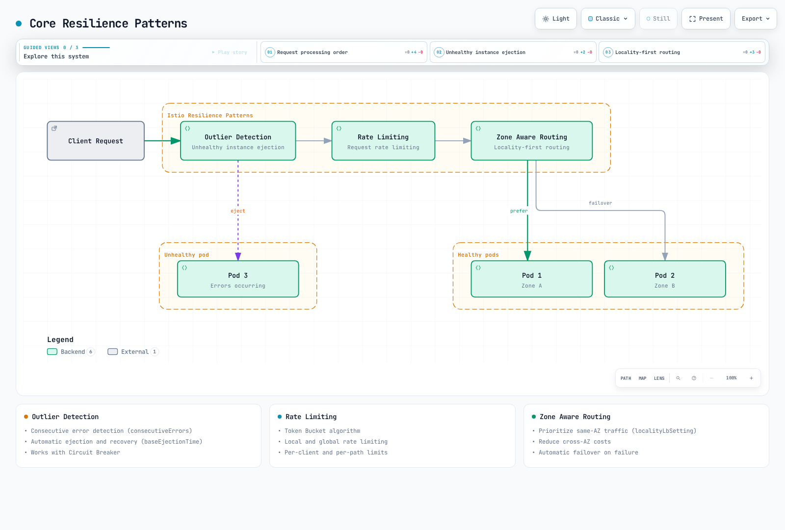
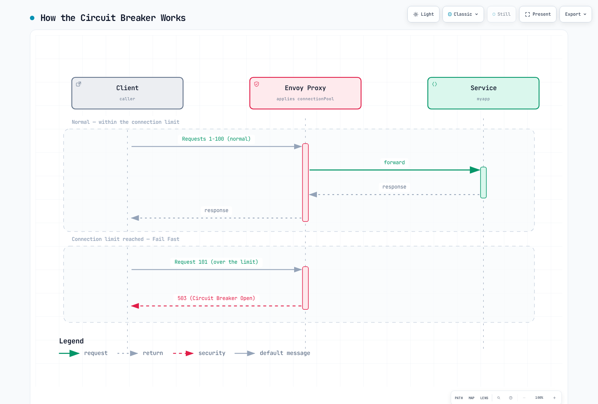
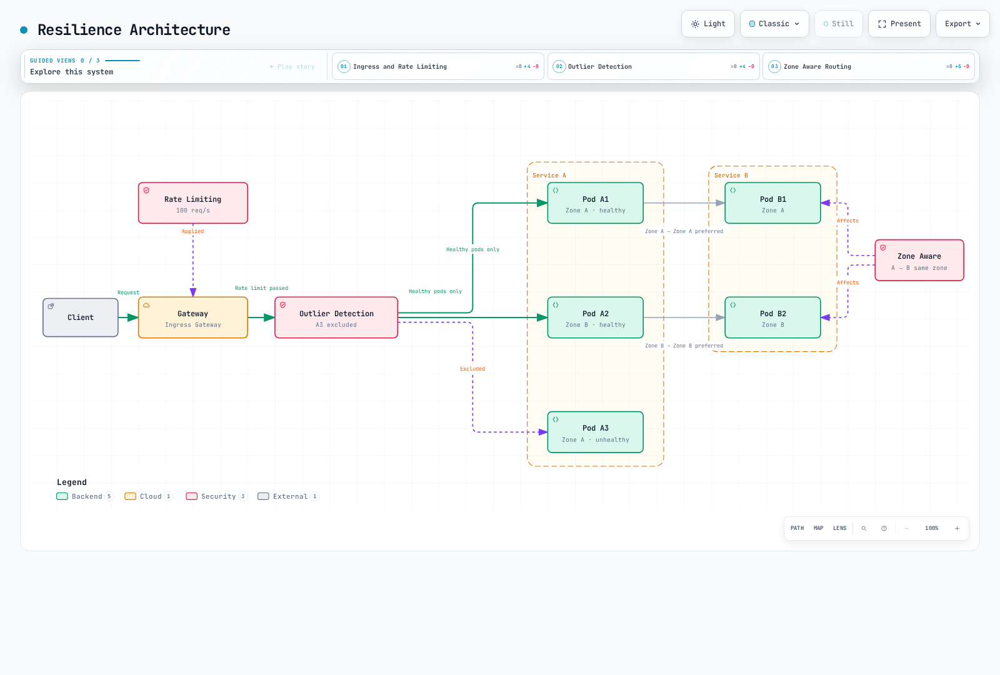

# Resiliencia

> **Última actualización**: 11 de septiembre de 2026 · Istio 1.31. Ejemplos sidecar independientes en `default`, con HTTP `myapp` en 8080. No aplique juntos todos los ejemplos del mismo host. Valide configuración real y capacidad; no se desplegaron ni probaron con carga. Ambient L7 requiere waypoint y asociación de política admitida.

Las funciones de resiliencia Istio ayudan a contener fallos cuando se configuran según semántica y capacidad de la aplicación.

## Índice

1. [Detección de anomalías](01-outlier-detection.md)
2. [Limitación de tasa](02-rate-limiting.md)
3. [Enrutamiento consciente de zona](03-zone-aware-routing.md)

### Patrones adicionales

La documentación también cubre:

- **Circuit breaker**: Interrupción mediante pools de conexiones
- **Reintento**: Políticas de retry
- **Timeout**: Límites temporales
- **Inyección de fallos**: Pruebas de fallos inducidos

## Descripción general

La resiliencia es esencial en sistemas distribuidos. Istio puede implementar automáticamente varios patrones.

### Patrones principales



[🔍 Ver diagrama interactivo](https://www.atomai.click/kubernetes-docs/archmaps/en-service-mesh-istio-resilience-readme-0.html)

Las figuras resumen conceptos, no una secuencia fija de servicios de red. Outlier detection y localidad son decisiones de balanceo del proxy; los filtros HTTP de tasa se ejecutan en listener/ruta seleccionados.

### 1. Detección de anomalías

Detecta automáticamente instancias con comportamiento anómalo y las excluye del pool de tráfico.

```yaml
apiVersion: networking.istio.io/v1
kind: DestinationRule
metadata:
  name: myapp
  namespace: default
spec:
  host: myapp
  trafficPolicy:
    outlierDetection:
      consecutive5xxErrors: 5
      interval: 30s
      baseEjectionTime: 30s
      maxEjectionPercent: 50
```

**Funciones principales**:
- Detección de errores consecutivos
- Expulsión temporal y elegibilidad para tráfico posterior
- Funciona con circuit breaker

La expulsión es local a cada proxy observador, no elimina Pod ni da un veredicto global de salud. Fallos consecutivos pueden detectar inmediatamente; `interval` es el período de barrido. La expulsión caduca y puede repetirse; no prueba recuperación.

### 2. Limitación de tasa

Limita solicitudes para proteger de sobrecarga.

```yaml
apiVersion: networking.istio.io/v1alpha3
kind: EnvoyFilter
metadata:
  name: ratelimit
  namespace: default
spec:
  configPatches:
  - applyTo: HTTP_FILTER
    match:
      context: SIDECAR_INBOUND
      listener:
        portNumber: 8080
        filterChain:
          filter:
            name: envoy.filters.network.http_connection_manager
            subFilter:
              name: envoy.filters.http.router
    patch:
      operation: INSERT_BEFORE
      value:
        name: envoy.filters.http.local_ratelimit
        typed_config:
          '@type': type.googleapis.com/envoy.extensions.filters.http.local_ratelimit.v3.LocalRateLimit
          stat_prefix: http_local_rate_limiter
          token_bucket:
            max_tokens: 100
            tokens_per_fill: 10
            fill_interval: 1s
          filter_enabled:
            default_value:
              numerator: 100
              denominator: HUNDRED
          filter_enforced:
            default_value:
              numerator: 100
              denominator: HUNDRED
  workloadSelector:
    labels:
      app: myapp
```

**Funciones principales**:
- Algoritmo token bucket
- Límites locales y globales
- Límites por cliente y ruta

El ejemplo aplica un bucket por proceso Envoy al listener HTTP coincidente: 100 tokens iniciales y después 10/s. No es cuota de todo el servicio; réplicas y distribución afectan throughput agregado. Una cuota global necesita servicio y descriptores. Clasificar clientes/rutas requiere confianza adicional; una cabecera del llamante no es identidad autenticada.

### 3. Enrutamiento consciente de zona

Optimiza tráfico entre AZ para reducir latencia y costes.

```yaml
apiVersion: networking.istio.io/v1
kind: DestinationRule
metadata:
  name: myapp
  namespace: default
spec:
  host: myapp
  trafficPolicy:
    loadBalancer:
      localityLbSetting:
        enabled: true
        distribute:
        - from: us-east-1/us-east-1a/*
          to:
            us-east-1/us-east-1a/*: 80
            us-east-1/us-east-1b/*: 20
    outlierDetection:
      consecutive5xxErrors: 5
      interval: 10s
      baseEjectionTime: 30s
      maxEjectionPercent: 50
      minHealthPercent: 0
```

**Funciones principales**:
- Prioriza tráfico de la misma AZ
- Reduce costes entre AZ
- Permite configurar una política separada de failover por localidad

Las rutas de localidad son `region/zone/subzone`. El ejemplo distribuye deliberadamente 80/20 con ambas zonas sanas; el 20% es tráfico normal entre zonas, no reserva de failover. Use otro patrón de prioridades para preferencia local con desbordamiento y no combine `distribute` con `failover`/`failoverPriority`. Requiere detección de anomalías, endpoints Ready y capacidad de reserva; el ahorro depende del tráfico facturado.

### 4. Circuit breaker

Limita conexiones y solicitudes para evitar sobrecarga.

```yaml
apiVersion: networking.istio.io/v1
kind: DestinationRule
metadata:
  name: circuit-breaker
  namespace: default
spec:
  host: myapp
  trafficPolicy:
    connectionPool:
      tcp:
        maxConnections: 100
      http:
        http1MaxPendingRequests: 10
        http2MaxRequests: 100
        maxRequestsPerConnection: 2
    outlierDetection:
      consecutive5xxErrors: 5
      interval: 30s
      baseEjectionTime: 30s
```

**Funcionamiento**:


[🔍 Ver diagrama interactivo](https://www.atomai.click/kubernetes-docs/archmaps/en-service-mesh-istio-resilience-readme-1.html)

**Funciones principales**:
- Límites de conexiones TCP
- Límites de solicitudes HTTP
- Límites de solicitudes pendientes
- Fallo rápido al desbordarse

Los breakers son locales al clúster upstream y prioridad de cada proxy, no un límite global por Pod servidor. `http2MaxRequests` también aplica a HTTP/1.1. Alcanzar conexiones puede encolar una solicitud hasta superar límites pendientes/activos; la figura ilustra overflow HTTP 503/UO, no toda conexión que alcanza umbral. Overflow TCP no tiene estado HTTP.

### 5. Reintento

Reintenta solicitudes automáticamente ante fallos transitorios.

```yaml
apiVersion: networking.istio.io/v1
kind: VirtualService
metadata:
  name: myapp
  namespace: default
spec:
  hosts:
  - myapp
  http:
  - name: writes-no-retry
    match:
    - method:
        regex: ^(POST|PUT|PATCH|DELETE)$
    route:
    - destination:
        host: myapp
    timeout: 10s
    retries:
      attempts: 0
  - route:
    - destination:
        host: myapp
    retries:
      attempts: 3
      perTryTimeout: 2s
      retryOn: gateway-error,connect-failure,refused-stream
    timeout: 10s
    name: idempotent-reads
    match:
    - method:
        regex: ^(GET|HEAD|OPTIONS)$
  - name: other-methods-no-retry
    route:
    - destination:
        host: myapp
    timeout: 10s
    retries:
      attempts: 0
```

**Condiciones de retry** (`retryOn`):
- `5xx`: Errores servidor 500, 502, 503, 504
- `reset`: Reset de conexión TCP
- `connect-failure`: Fallo de conexión
- `refused-stream`: Flujo HTTP/2 rechazado
- `retriable-4xx`: Solo HTTP 409 bajo esta política Envoy
- `gateway-error`: Errores gateway 502, 503, 504

**Backoff y localidad, fragmento para la ruta de lectura anterior**:
```yaml
retries:
  attempts: 5
  perTryTimeout: 2s
  retryOn: gateway-error,connect-failure,refused-stream
  backoff: 25ms
  retryRemoteLocalities: true
```

**Funcionamiento**:


[🔍 Ver diagrama interactivo](https://www.atomai.click/kubernetes-docs/archmaps/en-service-mesh-istio-resilience-readme-2.html)

`attempts: 3` permite hasta tres reintentos después del inicial. El timeout puede detener antes. Coincidir por método de lectura supone idempotencia; PUT/DELETE y claves de idempotencia requieren verificación antes de habilitar retries. Omitir puede heredar retries de malla, por eso escritura/fallback usan `attempts: 0`. Un retry puede volver al mismo host y no garantiza éxito. El backoff es exponencial con jitter; permitir localidades remotas no lo configura.

### 6. Timeout

Establece límites para evitar esperas indefinidas.

```yaml
apiVersion: networking.istio.io/v1
kind: VirtualService
metadata:
  name: myapp
  namespace: default
spec:
  hosts:
  - myapp
  http:
  - name: writes-no-retry
    match:
    - method:
        regex: ^(POST|PUT|PATCH|DELETE)$
    route:
    - destination:
        host: myapp
    timeout: 5s
    retries:
      attempts: 0
  - route:
    - destination:
        host: myapp
    timeout: 5s
    retries:
      attempts: 3
      perTryTimeout: 2s
      retryOn: gateway-error,connect-failure,refused-stream
    name: idempotent-reads
    match:
    - method:
        regex: ^(GET|HEAD|OPTIONS)$
  - name: other-methods-no-retry
    route:
    - destination:
        host: myapp
    timeout: 5s
    retries:
      attempts: 0
```

**Jerarquía de timeout**, requiere `my-gateway` configurado aparte en `default`:
```yaml
apiVersion: networking.istio.io/v1
kind: VirtualService
metadata:
  name: gateway-timeout
  namespace: default
spec:
  gateways:
  - my-gateway
  hosts:
  - example.com
  http:
  - route:
    - destination:
        host: frontend
    timeout: 30s
    retries:
      attempts: 0
---
apiVersion: networking.istio.io/v1
kind: VirtualService
metadata:
  name: service-timeout
  namespace: default
spec:
  hosts:
  - backend
  http:
  - route:
    - destination:
        host: backend
    timeout: 5s
    retries:
      attempts: 0
```

**Presupuestos ilustrativos, derive valores reales de SLO y dependencias**:
- Gateway -> Frontend: 30-60 segundos, orientado al usuario
- Service -> Service: 5-10 segundos, comunicación interna
- Consultas DB: 2-5 segundos
- API externas: 10-30 segundos

Timeouts HTTP no configuran timeouts cliente/consulta DB ni garantizan cancelar trabajo downstream. Propague deadlines; un total menor permite deliberadamente menos reintentos.

### 7. Inyección de fallos

Introduce fallos deliberados para ingeniería del caos.

```yaml
apiVersion: networking.istio.io/v1
kind: VirtualService
metadata:
  name: fault-injection
  namespace: default
spec:
  hosts:
  - myapp
  http:
  - fault:
      delay:
        percentage:
          value: 10.0
        fixedDelay: 5s
      abort:
        percentage:
          value: 5.0
        httpStatus: 503
    route:
    - destination:
        host: myapp
```

**Escenarios de uso**:

1. **Simular latencia de red**:
```yaml
fault:
  delay:
    percentage:
      value: 100.0
    fixedDelay: 7s
```

2. **Probar fallos intermitentes**:
```yaml
fault:
  abort:
    percentage:
      value: 20.0
    httpStatus: 500
```

3. **Inyectar solo para usuarios concretos**:
```yaml
apiVersion: networking.istio.io/v1
kind: VirtualService
metadata:
  name: fault-injection-user
  namespace: default
spec:
  hosts:
  - myapp
  http:
  - match:
    - headers:
        end-user:
          exact: test-user
    fault:
      abort:
        percentage:
          value: 100.0
        httpStatus: 503
    route:
    - destination:
        host: myapp
  - name: ordinary-traffic
    route:
    - destination:
        host: myapp
    retries:
      attempts: 0
```

Es una operación de laboratorio controlada. En una ruta cliente con `fault`, Istio no habilita retries/timeouts de esa ruta. Pruebe retries con fallos en otro salto downstream. Una cabecera de usuario de prueba solo delimita tráfico; controle quién puede enviarla. El fallback normal evita dejar solicitudes sin coincidencia.

## Combinaciones de patrones

### Detección de anomalías + circuit breaker

```yaml
apiVersion: networking.istio.io/v1
kind: DestinationRule
metadata:
  name: myapp-resilient
  namespace: default
spec:
  host: myapp
  trafficPolicy:
    connectionPool:
      tcp:
        maxConnections: 100
      http:
        http1MaxPendingRequests: 50
        maxRequestsPerConnection: 2
    outlierDetection:
      consecutive5xxErrors: 5
      interval: 30s
      baseEjectionTime: 30s
      maxEjectionPercent: 50
      minHealthPercent: 0
```

### Limitación de tasa + retry

```yaml
apiVersion: networking.istio.io/v1
kind: VirtualService
metadata:
  name: myapp
  namespace: default
spec:
  hosts:
  - myapp
  http:
  - name: writes-no-retry
    match:
    - method:
        regex: ^(POST|PUT|PATCH|DELETE)$
    route:
    - destination:
        host: myapp
    timeout: 10s
    retries:
      attempts: 0
  - route:
    - destination:
        host: myapp
    retries:
      attempts: 3
      perTryTimeout: 2s
      retryOn: gateway-error,connect-failure,refused-stream
    timeout: 10s
    name: idempotent-reads
    match:
    - method:
        regex: ^(GET|HEAD|OPTIONS)$
  - name: other-methods-no-retry
    route:
    - destination:
        host: myapp
    timeout: 10s
    retries:
      attempts: 0
---
apiVersion: networking.istio.io/v1alpha3
kind: EnvoyFilter
metadata:
  name: ratelimit
  namespace: default
spec:
  workloadSelector:
    labels:
      app: myapp
  configPatches:
  - applyTo: HTTP_FILTER
    match:
      context: SIDECAR_INBOUND
      listener:
        portNumber: 8080
        filterChain:
          filter:
            name: envoy.filters.network.http_connection_manager
            subFilter:
              name: envoy.filters.http.router
    patch:
      operation: INSERT_BEFORE
      value:
        name: envoy.filters.http.local_ratelimit
        typed_config:
          '@type': type.googleapis.com/envoy.extensions.filters.http.local_ratelimit.v3.LocalRateLimit
          stat_prefix: http_local_rate_limiter
          token_bucket:
            max_tokens: 1000
            tokens_per_fill: 100
            fill_interval: 1s
          filter_enabled:
            default_value:
              numerator: 100
              denominator: HUNDRED
          filter_enforced:
            default_value:
              numerator: 100
              denominator: HUNDRED
```

## Arquitectura de resiliencia



[🔍 Ver diagrama interactivo](https://www.atomai.click/kubernetes-docs/archmaps/en-service-mesh-istio-resilience-readme-3.html)

## Métricas de resiliencia {#resilience-metrics}

Recoja un endpoint proxy previsto por Pod como en [métricas](../observability/01-metrics.md). Envoy no exporta toda estadística opcional por defecto. Combine la anotación en la plantilla relevante y despliegue proxies nuevos antes de comprobar nombres/etiquetas reales:

```yaml
spec:
  template:
    metadata:
      annotations:
        proxy.istio.io/config: |
          proxyStatsMatcher:
            inclusionRegexps:
            - ".*outlier_detection.*"
            - ".*circuit_breakers.*"
            - ".*upstream_rq_retry.*"
            - ".*upstream_rq_timeout.*"
            - ".*upstream_rq_.*overflow.*"
            - ".*http_local_rate_limit.*"
            - ".*fault.*"
```

### Consultas Prometheus

Las tasas son por segundo; `_open` es gauge de estado de capacidad 0/1 y `ejections_active` cuenta hosts actuales. Se suponen etiquetas `namespace`/`pod` de un clúster; restrinja clúster destino para una dependencia. El prefijo de rate limit depende de `stat_prefix` y nombre emitido. `rate_limited` cuenta escasez de tokens aunque no se aplique; `enforced`, límites efectivos. Los contadores de overflow activo varían por Envoy: examine `upstream_rq_active_overflow` si está expuesto, sin asumir que todo aumenta pending.

```promql
# Active ejections per observed cluster
 envoy_cluster_outlier_detection_ejections_active{namespace="default"}

# Locally rate-limited requests per second, retaining Pod identity
sum by (namespace, pod) (rate({__name__=~"envoy_.*http_local_rate_limit_enforced",namespace="default"}[5m]))

# Request circuit breaker currently at capacity (not a cumulative count)
envoy_cluster_circuit_breakers_default_rq_open{namespace="default"}

# Pending-queue circuit-breaker overflows per second
sum(rate(envoy_cluster_upstream_rq_pending_overflow{namespace="default"}[5m]))

# Retry attempts and retry-success events per second (different event counters)
sum(rate(envoy_cluster_upstream_rq_retry{namespace="default"}[5m]))
sum(rate(envoy_cluster_upstream_rq_retry_success{namespace="default"}[5m]))

# Upstream request timeouts per second
sum(rate(envoy_cluster_upstream_rq_timeout{namespace="default"}[5m]))

# Observed destination HTTP 2xx/3xx fraction; define your own SLI for 4xx/gRPC
sum(rate(istio_requests_total{reporter="destination",destination_service_namespace="default",response_code=~"[23].."}[5m])) /
sum(rate(istio_requests_total{reporter="destination",destination_service_namespace="default"}[5m]))
```

`source_zone` y `destination_zone` no son etiquetas estándar. Informes AZ necesitan enriquecimiento validado u otra fuente zonal; IDs de clúster no son IDs de AZ. Destination omite solicitudes que nunca llegaron, así que revise también señales de fallo source.

### Paneles Grafana

Muestre conexiones activas, estado abierto/cerrado y tasa de overflow aparte. No hay gauge estándar de capacidad `envoy_cluster_circuit_breakers_default_cx_max` ni breaker `...rq_overflow`. Use umbrales efectivos al calcular capacidad; nunca divida por un flag abierto 0/1.

```promql
envoy_cluster_upstream_cx_active{namespace="default"}
envoy_cluster_circuit_breakers_default_cx_open{namespace="default"}

# Source-side observed final HTTP 5xx fraction, not hypothetical no-retry errors
sum(rate(istio_requests_total{reporter="source",destination_service_namespace="default",response_code=~"5.."}[5m])) /
sum(rate(istio_requests_total{reporter="source",destination_service_namespace="default"}[5m]))
```

Los contadores de retry no reconstruyen una «tasa de errores sin reintentos» contrafactual. Correlacione intentos, resultados finales, latencia y carga con mediciones acotadas; tráfico cero/series ausentes requieren otro tratamiento.

## Buenas prácticas

### 1. Ajustar umbrales de anomalías

```yaml
# Adjust according to service characteristics
outlierDetection:
  consecutive5xxErrors: 5          # 5 consecutive failures
  interval: 30s                 # Evaluate every 30 seconds
  baseEjectionTime: 30s         # 30 second ejection
  maxEjectionPercent: 50        # Maximum 50% ejected
  minHealthPercent: 0           # Disable unhealthy-pool fail-open threshold
```

`minHealthPercent` no garantiza capacidad saludable: bajo un umbral no nulo se desactiva outlier detection y el proxy puede usar hosts sanos y enfermos. `0` desactiva ese umbral. Expulsiones repetidas pueden durar más que `baseEjectionTime`; monitorice hosts expulsados y capacidad restante.

### 2. Limitación por etapas

```yaml
# Apply limits at Gateway -> Service stages
# Gateway: Overall traffic limit
# Service: Individual service limit
```

### 3. Prioridad de routing zonal

Para preferencia local con failover use prioridades, no distribución 80/20. Confirme etiquetas región/zona de nodos y endpoints disponibles. El [capítulo zonal](03-zone-aware-routing.md) trata distribución y failover como modos distintos.

### 4. Configurar circuit breaker

Dimensione límites de clúster destino de cada proxy llamante según concurrencia medida y capacidad. Importan llamantes, multiplexación HTTP, distribución y aumentos de rollout; multiplicar Pods por un factor arbitrario no crea límite global de admisión. Colas grandes pueden ocultar sobrecarga.

```yaml
# DestinationRule trafficPolicy fragment; example values require load tests
connectionPool:
  tcp:
    maxConnections: 100
  http:
    http1MaxPendingRequests: 10
    http2MaxRequests: 100
    maxRequestsPerConnection: 0
    maxRetries: 10
```

`maxRequestsPerConnection: 0` permite reutilizar sin ese máximo; `1` desactiva keep-alive. Valores 1–5 no son optimización universal. `maxRetries` limita retries concurrentes pendientes por clúster upstream, no por solicitud.

### 5. Política de reintentos

Use la protección de escritura y coincidencia de lectura explícitas del ejemplo completo. Un comentario YAML «solo GET» no restringe coincidencias. Reintente solo operaciones seguras de repetir, con intentos/backoff acotados y deadline total. No reintente automáticamente 429 o sobrecarga: puede neutralizar límites y agravar fallos. El ejemplo combinado usa bucket local mayor, 1000 tokens iniciales y 100/s, no cuota global.

### 6. Configurar timeout

Presupueste todo el grafo: primer intento, retries, backoff y procesamiento. Si deben caber todos:

```text
route budget >= (1 + attempts) × perTryTimeout + backoff + other overhead
```

Con `attempts: 3` y `perTryTimeout: 2s`, cuatro intentos completos consumen 8 segundos antes del backoff/otros costes. `timeout: 10s` es presupuesto de ejemplo, no garantía; `timeout: 5s` no puede acomodar deliberadamente cuatro intentos completos de dos segundos. Los deadlines de aplicación deben incluir carga/streaming y propagar cancelación apropiadamente.

### 7. Pruebas de inyección de fallos

Use ruta completa por cabecera y fallback normal. Separe el salto que produce el fallo de la política retry/timeout probada. Empiece en entorno desechable y luego grupo acotado con criterios de aborto en staging. Producción requiere autorización por carga, observabilidad y umbrales de rollback; un calendario fijo 1%→5%→10% no es universalmente seguro.

## Resolución de problemas

### No funciona outlier detection

```bash
# 1. Check DestinationRule
kubectl get destinationrule -A

# 2. Check Envoy cluster status
istioctl proxy-config clusters <pod-name> -n <namespace>

# 3. Check Outlier Detection metrics
istioctl x envoy-stats <pod-name> -n <namespace> --output prom | grep outlier
```

### No se aplica rate limiting

```bash
# 1. Check EnvoyFilter
kubectl get envoyfilter -A

# 2. Check Envoy configuration
istioctl proxy-config listener <pod-name> -n <namespace> -o json

# 3. Check Rate Limit metrics
istioctl x envoy-stats <pod-name> -n <namespace> --output prom | grep rate_limit
```

### No funciona routing zonal

```bash
# 1. Check DestinationRule
kubectl get destinationrule -A

# 2. Map Pods to node topology; Pod zone labels are not added automatically
kubectl get pods -n <namespace> -o wide
kubectl get nodes -L topology.kubernetes.io/region,topology.kubernetes.io/zone

# 3. Check Locality information
istioctl proxy-config endpoints <pod-name> -n <namespace>
```

### Circuit breaker no abre

```bash
# 1. Check DestinationRule connectionPool settings
kubectl get destinationrule <name> -o yaml

# 2. Check Circuit Breaker metrics
istioctl x envoy-stats <pod-name> -n <namespace> --output prom | grep circuit_breakers

# 3. Check for overflow
istioctl x envoy-stats <pod-name> -n <namespace> --output prom | grep overflow

# 4. Check active connection count
istioctl x envoy-stats <pod-name> -n <namespace> --output prom | grep upstream_cx_active
```

### Retry no funciona

```bash
# 1. Check VirtualService
kubectl get virtualservice <name> -o yaml

# 2. Check Retry metrics
istioctl x envoy-stats <pod-name> -n <namespace> --output prom | grep retry

# 3. Inspect enabled access/debug logs; default logs need not contain each retry
kubectl logs -n <namespace> <pod-name> -c istio-proxy | grep retry

# 4. Check retry conditions
istioctl proxy-config routes <pod-name> -n <namespace> -o json | \
  jq '.[] | .virtualHosts[]? | {name, domains, routes: [.routes[]? | {name, match, retryPolicy: .route.retryPolicy}]}'
```

### Timeout no se aplica

```bash
# 1. Check VirtualService timeout
kubectl get virtualservice <name> -o yaml | grep timeout

# 2. Check Timeout metrics
istioctl x envoy-stats <pod-name> -n <namespace> --output prom | grep timeout

# 3. Check request duration
istioctl x envoy-stats <pod-name> -n <namespace> --output prom | grep request_duration

# 4. Check Envoy route configuration
istioctl proxy-config routes <pod-name> -n <namespace> -o json | \
  jq '.[] | .virtualHosts[].routes[].route.timeout'
```

### Inyección de fallos no funciona

```bash
# 1. Check VirtualService fault configuration
kubectl get virtualservice <name> -o yaml | grep -A 10 fault

# 2. Check request headers (if match conditions exist)
curl -H "end-user: test-user" http://your-service/api

# 3. Check Envoy filters
istioctl proxy-config routes <pod-name> -n <namespace> -o json | \
  jq '.[] | .virtualHosts[]?.routes[]? | select(.typedPerFilterConfig["envoy.filters.http.fault"] != null) | {name, fault: .typedPerFilterConfig["envoy.filters.http.fault"]}'

# 4. Check Fault metrics
istioctl x envoy-stats <pod-name> -n <namespace> --output prom | grep fault
```

## Siguientes pasos

1. **[Detección de anomalías](01-outlier-detection.md)**: Detectar instancias no saludables automáticamente
2. **[Limitación de tasa](02-rate-limiting.md)**: Controlar tasa de solicitudes
3. **[Routing consciente de zona](03-zone-aware-routing.md)**: Enrutamiento por localidad

## Referencias

### Documentación oficial
- [Resiliencia Istio](https://istio.io/latest/docs/concepts/traffic-management/#network-resilience-and-testing)
- [Detección de anomalías](https://istio.io/latest/docs/reference/config/networking/destination-rule/#OutlierDetection)
- [Circuit breaking](https://istio.io/latest/docs/tasks/traffic-management/circuit-breaking/)
- [Timeouts de solicitudes](https://istio.io/latest/docs/tasks/traffic-management/request-timeouts/)
- [Reintentos](https://istio.io/latest/docs/concepts/traffic-management/#retries)
- [Limitación de tasa](https://istio.io/latest/docs/tasks/policy-enforcement/rate-limit/)
- [Inyección de fallos](https://istio.io/latest/docs/tasks/traffic-management/fault-injection/)
- [Balanceo por localidad](https://istio.io/latest/docs/tasks/traffic-management/locality-load-balancing/)

### Recursos AWS
- [Mejorar resiliencia de red con Istio en EKS](https://aws.amazon.com/blogs/opensource/enhancing-network-resilience-with-istio-on-amazon-eks/)
- [Buenas prácticas EKS: fiabilidad](https://docs.aws.amazon.com/eks/latest/best-practices/reliability.html)

### Patrones y arquitectura
- [Patrones de microservicios: circuit breaker](https://microservices.io/patterns/reliability/circuit-breaker.html)
- [Release It!: patrones de estabilidad](https://pragprog.com/titles/mnee2/release-it-second-edition/)
- [Principios de ingeniería del caos](https://principlesofchaos.org/)

## Cuestionario

Pruebe lo aprendido con el [cuestionario de resiliencia Istio](../../../quizzes/service-mesh/istio/resilience.md).
