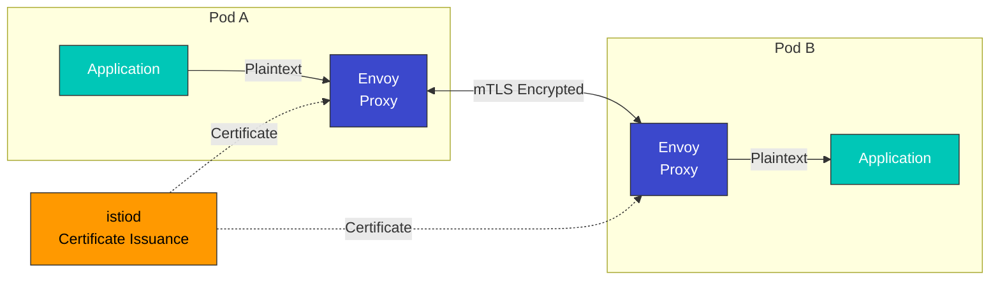
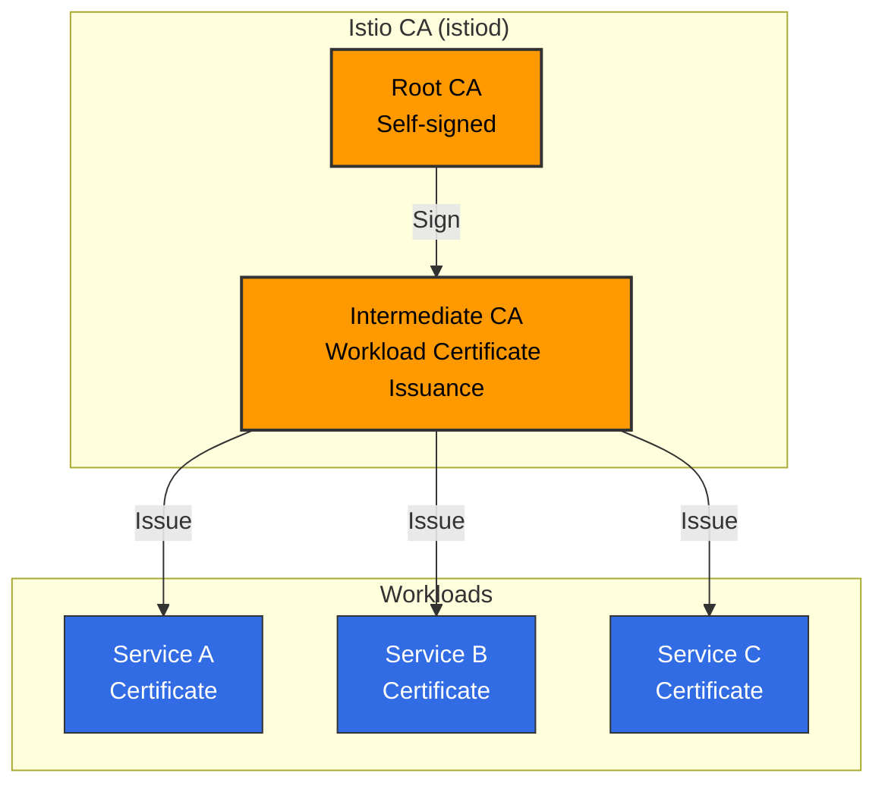
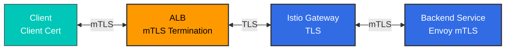
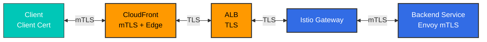
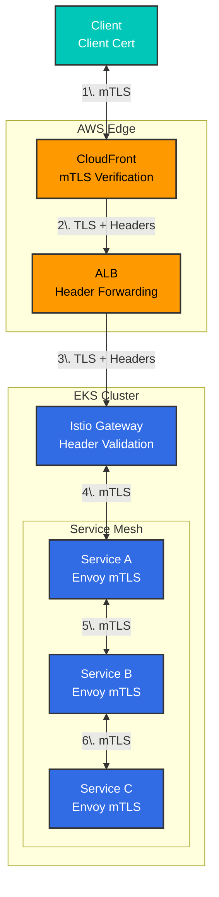

# mTLS

Mutual TLS (mTLS) es una funcionalidad de seguridad central de Istio que cifra y autentica automáticamente la comunicación entre servicios.

## Índice

1. [Descripción general de mTLS](#mtls-overview)
2. [Modos de mTLS](#mtls-modes)
3. [Administración de certificados](#certificate-management)
4. [Configuración de PeerAuthentication](#peerauthentication-configuration)
5. [Integración de mTLS con servicios de AWS](#mtls-integration-with-aws-services)
6. [mTLS con servicios externos](#mtls-with-external-services)
7. [Estrategia de migración](#migration-strategy)
8. [Problemas comunes y soluciones](#common-issues-and-solutions)
9. [Rendimiento y monitoreo](#performance-and-monitoring)

## Descripción general de mTLS

<p align="center">
  
</p>

Istio aplica automáticamente mTLS a la comunicación entre servicios, implementando una red Zero Trust.

### Seguridad basada en identidad

Istio utiliza el estándar **SPIFFE (Secure Production Identity Framework for Everyone)** para asignar identidades sólidas a cada workload:

```
spiffe://cluster.local/ns/default/sa/productpage
  |         |           |     |      |    |
  |         |           |     |      |    +- ServiceAccount name
  |         |           |     |      +----- "sa" (ServiceAccount)
  |         |           |     +------------ Namespace name
  |         |           +------------------ "ns" (Namespace)
  |         +------------------------------ Trust Domain
  +---------------------------------------- Protocol
```

**Proceso de aprovisionamiento de identidad**:
1. Kubernetes crea un Pod y asigna un ServiceAccount
2. Istio Agent se inicia dentro del Pod
3. Agent envía una CSR (Certificate Signing Request) a Istiod
4. Istiod emite un certificado X.509 según el SPIFFE ID
5. Agent entrega el certificado a Envoy (protocolo SDS)
6. Renovación automática de certificados (TTL predeterminado: 24 horas)



## Modos de mTLS

### Modo STRICT (recomendado)

```yaml
apiVersion: security.istio.io/v1
kind: PeerAuthentication
metadata:
  name: default
  namespace: istio-system
spec:
  mtls:
    mode: STRICT  # Only mTLS allowed
```

### Modo PERMISSIVE (para migración)

```yaml
apiVersion: security.istio.io/v1
kind: PeerAuthentication
metadata:
  name: default
  namespace: default
spec:
  mtls:
    mode: PERMISSIVE  # Both mTLS and plaintext allowed
```

### Modo DISABLE

```yaml
apiVersion: security.istio.io/v1
kind: PeerAuthentication
metadata:
  name: disable-mtls
  namespace: default
spec:
  mtls:
    mode: DISABLE  # mTLS disabled
```

## Administración de certificados

<p align="center">
  
</p>

### Certificado de CA predeterminado de Istio

Istio genera automáticamente una CA raíz autofirmada durante la instalación. El diagrama anterior muestra la jerarquía de certificados de Istio:

- **CA raíz**: Ancla de confianza de nivel superior
- **CA intermedia**: CA intermedia para emitir certificados de workload
- **Certificados de workload**: Certificados mTLS para cada servicio (renovación automática)



**Propiedades predeterminadas del certificado**:
- Período de validez: **90 días** (renovación automática: 24 horas antes de la expiración)
- Tamaño de clave: RSA de 2048 bits
- Algoritmo de firma: SHA-256

### Verificación de certificados

```bash
# 1. Check CA certificate
kubectl get secret istio-ca-secret -n istio-system -o yaml

# 2. Check workload certificate
istioctl proxy-config secret <pod-name> -n <namespace>

# 3. Certificate details
istioctl proxy-config secret <pod-name> -n <namespace> -o json | \
  jq -r '.dynamicActiveSecrets[0].secret.tlsCertificate.certificateChain.inlineBytes' | \
  base64 -d | openssl x509 -text -noout

# 4. Check certificate expiration date
istioctl proxy-config secret <pod-name> -n <namespace> -o json | \
  jq -r '.dynamicActiveSecrets[0].secret.tlsCertificate.certificateChain.inlineBytes' | \
  base64 -d | openssl x509 -noout -dates
```

### Uso de certificados de CA personalizados

En entornos de producción, se recomienda usar CA internas empresariales o CA públicas.

#### Paso 1: Generar el certificado y la clave de CA

```bash
# 1. Generate Root CA
openssl genrsa -out root-key.pem 4096

openssl req -new -x509 -days 3650 -key root-key.pem \
  -out root-cert.pem \
  -subj "/C=US/ST=California/L=San Francisco/O=MyOrg/OU=IT/CN=Root CA"

# 2. Generate Intermediate CA
openssl genrsa -out ca-key.pem 4096

openssl req -new -key ca-key.pem -out ca-cert.csr \
  -subj "/C=US/ST=California/L=San Francisco/O=MyOrg/OU=IT/CN=Intermediate CA"

# 3. Sign Intermediate CA with Root CA
cat > ca-extensions.txt <<EOF
basicConstraints=CA:TRUE
keyUsage=keyCertSign,cRLSign
EOF

openssl x509 -req -days 1825 -in ca-cert.csr \
  -CA root-cert.pem -CAkey root-key.pem -CAcreateserial \
  -out ca-cert.pem -extfile ca-extensions.txt

# 4. Create Certificate Chain
cat ca-cert.pem root-cert.pem > cert-chain.pem
```

#### Paso 2: Crear un Secret de Kubernetes

```bash
kubectl create secret generic cacerts -n istio-system \
  --from-file=ca-cert.pem=ca-cert.pem \
  --from-file=ca-key.pem=ca-key.pem \
  --from-file=root-cert.pem=root-cert.pem \
  --from-file=cert-chain.pem=cert-chain.pem
```

#### Paso 3: Reiniciar Istio

```bash
# Restart istiod to load new CA certificate
kubectl rollout restart deployment/istiod -n istio-system

# Restart all workloads to issue new certificates
kubectl rollout restart deployment -n <namespace>
```

#### Paso 4: Verificación

```bash
# Verify CA certificate is loaded correctly
kubectl logs -l app=istiod -n istio-system | grep "Use plugged-in cert"

# Verify workload certificates are issued by new CA
istioctl proxy-config secret <pod-name> -n <namespace> -o json | \
  jq -r '.dynamicActiveSecrets[0].secret.tlsCertificate.certificateChain.inlineBytes' | \
  base64 -d | openssl x509 -noout -issuer
```

### Integración con AWS Certificate Manager (ACM)

Puede usar ACM Private CA para administrar los certificados de Istio.

#### Paso 1: Crear una ACM Private CA

```bash
# Create ACM Private CA
aws acm-pca create-certificate-authority \
  --certificate-authority-configuration \
    "KeyAlgorithm=RSA_4096,SigningAlgorithm=SHA256WITHRSA,Subject={CommonName=Istio CA}" \
  --certificate-authority-type ROOT \
  --tags Key=Name,Value=istio-root-ca

# Save CA ARN
CA_ARN=$(aws acm-pca list-certificate-authorities \
  --query 'CertificateAuthorities[0].Arn' --output text)

# Generate Root CA certificate
aws acm-pca get-certificate-authority-csr \
  --certificate-authority-arn $CA_ARN \
  --output text > ca.csr

aws acm-pca issue-certificate \
  --certificate-authority-arn $CA_ARN \
  --csr fileb://ca.csr \
  --signing-algorithm SHA256WITHRSA \
  --template-arn arn:aws:acm-pca:::template/RootCACertificate/V1 \
  --validity Value=10,Type=YEARS

# Install certificate
CERT_ARN=$(aws acm-pca list-certificates \
  --certificate-authority-arn $CA_ARN \
  --query 'Certificates[0].Arn' --output text)

aws acm-pca get-certificate \
  --certificate-authority-arn $CA_ARN \
  --certificate-arn $CERT_ARN \
  --output text > root-cert.pem

aws acm-pca import-certificate-authority-certificate \
  --certificate-authority-arn $CA_ARN \
  --certificate fileb://root-cert.pem
```

#### Paso 2: Instalar Cert-Manager + AWS PCA Issuer

```bash
# Install Cert-Manager
kubectl apply -f https://github.com/cert-manager/cert-manager/releases/download/v1.13.0/cert-manager.yaml

# Install AWS PCA Issuer
helm repo add awspca https://cert-manager.github.io/aws-privateca-issuer
helm install aws-pca-issuer awspca/aws-privateca-issuer -n cert-manager
```

#### Paso 3: Crear AWSPCAIssuer

```yaml
apiVersion: awspca.cert-manager.io/v1beta1
kind: AWSPCAClusterIssuer
metadata:
  name: istio-ca
spec:
  arn: ${CA_ARN}
  region: us-west-2
```

#### Paso 4: Usar en Istio

```yaml
apiVersion: cert-manager.io/v1
kind: Certificate
metadata:
  name: istio-ca-cert
  namespace: istio-system
spec:
  secretName: cacerts
  commonName: "Istio CA"
  isCA: true
  duration: 87600h  # 10 years
  renewBefore: 720h  # 30 days
  issuerRef:
    kind: AWSPCAClusterIssuer
    name: istio-ca
```

### Política de renovación de certificados

```yaml
# Configure certificate policy with Istio Operator
apiVersion: install.istio.io/v1alpha1
kind: IstioOperator
metadata:
  name: istio-control-plane
  namespace: istio-system
spec:
  meshConfig:
    certificates:
      - secretName: dns.istio-system-service-account
        dnsNames:
          - istiod.istio-system.svc
          - istiod.istio-system
    caCertificates:
      - secretName: cacerts
        certProvider: cert-manager
  values:
    pilot:
      env:
        # Workload certificate TTL (default: 24 hours)
        CITADEL_CERT_TTL: "24h"
        # Certificate renewal grace period (default: 15 minutes)
        CITADEL_GRACE_PERIOD: "15m"
```

### Rotación de certificados

```bash
# 1. Generate new CA certificate (repeat steps above)

# 2. Update existing Secret
kubectl create secret generic cacerts -n istio-system \
  --from-file=ca-cert.pem=new-ca-cert.pem \
  --from-file=ca-key.pem=new-ca-key.pem \
  --from-file=root-cert.pem=new-root-cert.pem \
  --from-file=cert-chain.pem=new-cert-chain.pem \
  --dry-run=client -o yaml | kubectl apply -f -

# 3. Restart istiod (zero-downtime rolling update)
kubectl rollout restart deployment/istiod -n istio-system

# 4. Gradual workload certificate renewal
# Method 1: Wait for automatic renewal (within 24 hours)
# Method 2: Manual rolling restart
for ns in $(kubectl get ns -o jsonpath='{.items[*].metadata.name}'); do
  echo "Restarting deployments in namespace: $ns"
  kubectl rollout restart deployment -n $ns
done
```

## Configuración de PeerAuthentication

### Configuración global

```yaml
apiVersion: security.istio.io/v1
kind: PeerAuthentication
metadata:
  name: default
  namespace: istio-system
spec:
  mtls:
    mode: STRICT
```

### Configuración a nivel de Namespace

```yaml
apiVersion: security.istio.io/v1
kind: PeerAuthentication
metadata:
  name: namespace-policy
  namespace: production
spec:
  mtls:
    mode: STRICT
```

### Configuración a nivel de workload

```yaml
apiVersion: security.istio.io/v1
kind: PeerAuthentication
metadata:
  name: workload-policy
  namespace: default
spec:
  selector:
    matchLabels:
      app: reviews
      version: v1
  mtls:
    mode: STRICT
```

### Configuración a nivel de puerto

```yaml
apiVersion: security.istio.io/v1
kind: PeerAuthentication
metadata:
  name: port-policy
  namespace: default
spec:
  selector:
    matchLabels:
      app: myapp
  mtls:
    mode: STRICT
  portLevelMtls:
    8080:
      mode: DISABLE  # mTLS disabled for port 8080
```

## Integración de mTLS con servicios de AWS

### AWS Application Load Balancer (ALB) y mTLS

ALB admite mTLS basado en certificados de cliente.



#### Paso 1: Configurar mTLS en ALB

```bash
# 1. Create Trust Store (upload CA certificate)
aws elbv2 create-trust-store \
  --name istio-client-trust-store \
  --ca-certificates-bundle-s3-bucket my-bucket \
  --ca-certificates-bundle-s3-key ca-bundle.pem

# 2. Configure mTLS on ALB listener
aws elbv2 modify-listener \
  --listener-arn arn:aws:elasticloadbalancing:region:account:listener/app/my-alb/xxx \
  --mutual-authentication Mode=verify,TrustStoreArn=arn:aws:elasticloadbalancing:region:account:truststore/istio-client-trust-store/xxx
```

#### Paso 2: Configuración de AWS Load Balancer Controller

```yaml
apiVersion: v1
kind: Service
metadata:
  name: istio-gateway
  namespace: istio-system
  annotations:
    service.beta.kubernetes.io/aws-load-balancer-type: "external"
    service.beta.kubernetes.io/aws-load-balancer-nlb-target-type: "ip"
    service.beta.kubernetes.io/aws-load-balancer-scheme: "internet-facing"
    # mTLS configuration
    service.beta.kubernetes.io/aws-load-balancer-ssl-cert: "arn:aws:acm:region:account:certificate/xxx"
    service.beta.kubernetes.io/aws-load-balancer-ssl-negotiation-policy: "ELBSecurityPolicy-TLS13-1-2-2021-06"
    service.beta.kubernetes.io/aws-load-balancer-mutual-authentication: '[{"port": 443, "mode": "verify", "trustStore": "arn:aws:elasticloadbalancing:region:account:truststore/istio-client-trust-store/xxx"}]'
spec:
  type: LoadBalancer
  selector:
    istio: ingressgateway
  ports:
  - name: https
    port: 443
    targetPort: 8443
```

#### Paso 3: Verificar el certificado de cliente en Istio Gateway

```yaml
apiVersion: networking.istio.io/v1
kind: Gateway
metadata:
  name: public-gateway
  namespace: istio-system
spec:
  selector:
    istio: ingressgateway
  servers:
  - port:
      number: 8443
      name: https
      protocol: HTTPS
    tls:
      mode: SIMPLE  # ALB already completed mTLS verification
      credentialName: gateway-cert
    hosts:
    - "*.example.com"
---
apiVersion: v1
kind: ConfigMap
metadata:
  name: istio-envoy-custom
  namespace: istio-system
data:
  custom-bootstrap.yaml: |
    static_resources:
      listeners:
      - name: http_listener
        address:
          socket_address:
            address: 0.0.0.0
            port_value: 8443
        filter_chains:
        - filters:
          - name: envoy.filters.network.http_connection_manager
            typed_config:
              "@type": type.googleapis.com/envoy.extensions.filters.network.http_connection_manager.v3.HttpConnectionManager
              # Verify client certificate headers forwarded from ALB
              forward_client_cert_details: APPEND_FORWARD
              set_current_client_cert_details:
                subject: true
                cert: true
                chain: true
                dns: true
                uri: true
```

#### Paso 4: Reenviar la información del certificado de cliente

ALB reenvía la información del certificado de cliente como encabezados HTTP:

```yaml
apiVersion: security.istio.io/v1beta1
kind: AuthorizationPolicy
metadata:
  name: verify-client-cert
  namespace: default
spec:
  action: ALLOW
  rules:
  - when:
    - key: request.headers[x-amzn-mtls-clientcert-serial-number]
      values: ["*"]
    - key: request.headers[x-amzn-mtls-clientcert-subject]
      values: ["CN=trusted-client,O=MyOrg*"]
```

**Encabezados reenviados por ALB**:
- `X-Amzn-Mtls-Clientcert-Serial-Number`: Número de serie del certificado
- `X-Amzn-Mtls-Clientcert-Subject`: Subject DN del certificado
- `X-Amzn-Mtls-Clientcert-Issuer`: Issuer DN del certificado
- `X-Amzn-Mtls-Clientcert-Validity`: Período de validez
- `X-Amzn-Mtls-Clientcert-Leaf`: Certificado de cliente (PEM)

### Amazon CloudFront y mTLS

CloudFront admite la verificación de certificados de cliente.



#### Paso 1: Crear una distribución de CloudFront

```bash
# 1. Upload Trust Store (CA certificate) to S3
aws s3 cp ca-bundle.pem s3://my-bucket/ca-bundle.pem

# 2. Create CloudFront distribution
cat > cloudfront-config.json <<EOF
{
  "CallerReference": "istio-mtls-$(date +%s)",
  "Origins": {
    "Quantity": 1,
    "Items": [
      {
        "Id": "istio-gateway",
        "DomainName": "k8s-istiosystem-istiogateway-xxx.elb.us-west-2.amazonaws.com",
        "CustomOriginConfig": {
          "HTTPPort": 80,
          "HTTPSPort": 443,
          "OriginProtocolPolicy": "https-only",
          "OriginSslProtocols": {
            "Quantity": 1,
            "Items": ["TLSv1.2"]
          }
        }
      }
    ]
  },
  "DefaultCacheBehavior": {
    "TargetOriginId": "istio-gateway",
    "ViewerProtocolPolicy": "https-only",
    "TrustedSigners": {
      "Enabled": false,
      "Quantity": 0
    },
    "ForwardedValues": {
      "QueryString": true,
      "Headers": {
        "Quantity": 1,
        "Items": ["*"]
      }
    },
    "MinTTL": 0
  },
  "ViewerCertificate": {
    "CloudFrontDefaultCertificate": false,
    "ACMCertificateArn": "arn:aws:acm:us-east-1:account:certificate/xxx",
    "SSLSupportMethod": "sni-only",
    "MinimumProtocolVersion": "TLSv1.2_2021"
  }
}
EOF

aws cloudfront create-distribution --distribution-config file://cloudfront-config.json

# 3. Configure mTLS on CloudFront
DIST_ID=$(aws cloudfront list-distributions --query 'DistributionList.Items[0].Id' --output text)

aws cloudfront update-distribution \
  --id $DIST_ID \
  --distribution-config '{
    "ViewerCertificate": {
      "ACMCertificateArn": "arn:aws:acm:us-east-1:account:certificate/xxx",
      "SSLSupportMethod": "sni-only",
      "MinimumProtocolVersion": "TLSv1.2_2021",
      "CertificateSource": "acm"
    },
    "CustomOriginConfig": {
      "OriginSslProtocols": {
        "Quantity": 1,
        "Items": ["TLSv1.2"]
      }
    }
  }'
```

#### Paso 2: Verificar el certificado con CloudFront Function

```javascript
function handler(event) {
    var request = event.request;
    var headers = request.headers;

    // Headers forwarded by CloudFront after client certificate verification
    var clientCertSerial = headers['cloudfront-viewer-tls-client-cert-serial-number'];
    var clientCertSubject = headers['cloudfront-viewer-tls-client-cert-subject'];

    if (!clientCertSerial || !clientCertSubject) {
        return {
            statusCode: 403,
            statusDescription: 'Forbidden',
            body: 'Client certificate required'
        };
    }

    // Check allowed certificate serial numbers
    var allowedSerials = ['1234567890ABCDEF', 'FEDCBA0987654321'];
    if (!allowedSerials.includes(clientCertSerial.value)) {
        return {
            statusCode: 403,
            statusDescription: 'Forbidden',
            body: 'Invalid client certificate'
        };
    }

    // Forward certificate information to Istio
    headers['x-client-cert-serial'] = clientCertSerial;
    headers['x-client-cert-subject'] = clientCertSubject;

    return request;
}
```

#### Paso 3: Verificar los encabezados de CloudFront en Istio

```yaml
apiVersion: security.istio.io/v1beta1
kind: AuthorizationPolicy
metadata:
  name: verify-cloudfront-client-cert
  namespace: default
spec:
  action: ALLOW
  rules:
  - when:
    - key: request.headers[x-client-cert-serial]
      values:
      - "1234567890ABCDEF"
      - "FEDCBA0987654321"
    - key: request.headers[x-client-cert-subject]
      values: ["CN=trusted-client,O=MyOrg*"]
```

### Arquitectura mTLS de extremo a extremo

mTLS en toda la ruta desde el cliente hasta el backend:



**Seguridad por segmento**:
1. **Cliente -> CloudFront**: mTLS (verificación del certificado de cliente)
2. **CloudFront -> ALB**: TLS + encabezados con información del certificado
3. **ALB -> Istio Gateway**: TLS + encabezados con información del certificado
4. **Dentro de Istio Mesh**: mTLS automático (Envoy a Envoy)

## mTLS con servicios externos

### Integración con sistemas heredados

```yaml
# When legacy system doesn't support mTLS
apiVersion: networking.istio.io/v1beta1
kind: DestinationRule
metadata:
  name: legacy-system
  namespace: default
spec:
  host: legacy.external.com
  trafficPolicy:
    tls:
      mode: SIMPLE  # Use one-way TLS only
---
apiVersion: networking.istio.io/v1beta1
kind: ServiceEntry
metadata:
  name: legacy-system
  namespace: default
spec:
  hosts:
  - legacy.external.com
  ports:
  - number: 443
    name: https
    protocol: HTTPS
  location: MESH_EXTERNAL
  resolution: DNS
```

### Autenticación de cliente mTLS para API externas

Cuando Istio necesita presentar un certificado de cliente a una API externa:

```yaml
# 1. Create client certificate Secret
apiVersion: v1
kind: Secret
metadata:
  name: client-mtls-credential
  namespace: istio-system
type: kubernetes.io/tls
data:
  tls.crt: <base64-encoded-cert>
  tls.key: <base64-encoded-key>
  ca.crt: <base64-encoded-ca>
---
# 2. Configure client certificate in DestinationRule
apiVersion: networking.istio.io/v1beta1
kind: DestinationRule
metadata:
  name: external-api-mtls
  namespace: default
spec:
  host: api.external.com
  trafficPolicy:
    tls:
      mode: MUTUAL  # Use mTLS
      clientCertificate: /etc/certs/tls.crt
      privateKey: /etc/certs/tls.key
      caCertificates: /etc/certs/ca.crt
---
# 3. Register external API with ServiceEntry
apiVersion: networking.istio.io/v1beta1
kind: ServiceEntry
metadata:
  name: external-api
  namespace: default
spec:
  hosts:
  - api.external.com
  ports:
  - number: 443
    name: https
    protocol: HTTPS
  location: MESH_EXTERNAL
  resolution: DNS
```

### mTLS externo mediante Egress Gateway

```yaml
# 1. Deploy Egress Gateway
apiVersion: install.istio.io/v1alpha1
kind: IstioOperator
spec:
  components:
    egressGateways:
    - name: istio-egressgateway
      enabled: true
      k8s:
        serviceAnnotations:
          networking.istio.io/exportTo: "*"
---
# 2. Gateway resource
apiVersion: networking.istio.io/v1
kind: Gateway
metadata:
  name: egress-gateway
  namespace: istio-system
spec:
  selector:
    istio: egressgateway
  servers:
  - port:
      number: 443
      name: tls
      protocol: TLS
    hosts:
    - api.external.com
    tls:
      mode: ISTIO_MUTUAL  # mTLS inside mesh
---
# 3. Route traffic with VirtualService
apiVersion: networking.istio.io/v1
kind: VirtualService
metadata:
  name: external-api-through-egress
  namespace: default
spec:
  hosts:
  - api.external.com
  gateways:
  - mesh  # From inside mesh
  - istio-system/egress-gateway  # To Egress Gateway
  http:
  - match:
    - gateways:
      - mesh
      port: 443
    route:
    - destination:
        host: istio-egressgateway.istio-system.svc.cluster.local
        port:
          number: 443
  - match:
    - gateways:
      - istio-system/egress-gateway
      port: 443
    route:
    - destination:
        host: api.external.com
        port:
          number: 443
---
# 4. DestinationRule (from Egress Gateway to external)
apiVersion: networking.istio.io/v1beta1
kind: DestinationRule
metadata:
  name: external-api-mtls
  namespace: istio-system
spec:
  host: api.external.com
  trafficPolicy:
    tls:
      mode: MUTUAL
      clientCertificate: /etc/istio/egress-certs/tls.crt
      privateKey: /etc/istio/egress-certs/tls.key
      caCertificates: /etc/istio/egress-certs/ca.crt
```

## Estrategia de migración

### Paso 1: Comprobar el estado actual

```bash
# Check current mTLS configuration
kubectl get peerauthentication -A

# Check mTLS status by service
istioctl authn tls-check <pod-name> -n <namespace>
```

### Paso 2: Cambiar al modo PERMISSIVE

```yaml
apiVersion: security.istio.io/v1
kind: PeerAuthentication
metadata:
  name: default
  namespace: istio-system
spec:
  mtls:
    mode: PERMISSIVE  # Allow both mTLS and plaintext
```

### Paso 3: Monitoreo

```bash
# Verify mTLS connections
kubectl exec -it <pod-name> -c istio-proxy -- \
  curl -s localhost:15000/stats/prometheus | grep ssl

# Verify plaintext connections
kubectl exec -it <pod-name> -c istio-proxy -- \
  curl -s localhost:15000/stats/prometheus | grep plaintext
```

### Paso 4: Cambiar al modo STRICT

```yaml
apiVersion: security.istio.io/v1
kind: PeerAuthentication
metadata:
  name: default
  namespace: istio-system
spec:
  mtls:
    mode: STRICT  # Only mTLS allowed
```

## Problemas comunes y soluciones

### 1. Error de conexión mTLS

**Síntomas**:
```
upstream connect error or disconnect/reset before headers. reset reason: connection failure
```

**Análisis de la causa raíz**:

```bash
# 1. Check PeerAuthentication
kubectl get peerauthentication -A

# 2. Check DestinationRule mTLS mode
kubectl get destinationrule -A -o yaml | grep -A 5 "trafficPolicy"

# 3. Check certificates
istioctl proxy-config secret <pod-name> -n <namespace>

# 4. Verify TLS connection
istioctl authn tls-check <source-pod> <dest-service> -n <namespace>

# 5. Check Envoy logs in detail
kubectl logs <pod-name> -c istio-proxy -n <namespace> | grep -E "(TLS|SSL|certificate)"
```

**Soluciones**:

1. **Incompatibilidad entre PeerAuthentication y DestinationRule**:
```yaml
# Problem: PeerAuthentication is STRICT, DestinationRule is DISABLE
# Solution: Change DestinationRule to ISTIO_MUTUAL
apiVersion: networking.istio.io/v1beta1
kind: DestinationRule
metadata:
  name: fix-mtls
spec:
  host: myservice.default.svc.cluster.local
  trafficPolicy:
    tls:
      mode: ISTIO_MUTUAL  # Match STRICT mode
```

2. **Pod sin inyección de sidecar**:
```bash
# Add istio-injection label to namespace
kubectl label namespace default istio-injection=enabled

# Restart pod
kubectl rollout restart deployment/<deployment-name> -n default
```

### 2. Problema de expiración de certificados

**Síntomas**:
```
TLS error: Secret is not supplied by SDS
x509: certificate has expired
```

**Comprobar la expiración de certificados**:

```bash
# Check workload certificate expiration date
istioctl proxy-config secret <pod-name> -n <namespace> -o json | \
  jq -r '.dynamicActiveSecrets[0].secret.tlsCertificate.certificateChain.inlineBytes' | \
  base64 -d | openssl x509 -noout -dates

# Check CA certificate expiration
kubectl get secret istio-ca-secret -n istio-system -o json | \
  jq -r '.data."ca-cert.pem"' | base64 -d | openssl x509 -noout -dates

# Check certificate expiration for all workloads
for pod in $(kubectl get pods -n default -o jsonpath='{.items[*].metadata.name}'); do
  echo "Pod: $pod"
  istioctl proxy-config secret $pod -n default -o json 2>/dev/null | \
    jq -r '.dynamicActiveSecrets[0].secret.tlsCertificate.certificateChain.inlineBytes' | \
    base64 -d 2>/dev/null | openssl x509 -noout -dates 2>/dev/null || echo "No cert found"
done
```

**Soluciones**:

```bash
# 1. Restart istiod (trigger new certificate issuance)
kubectl rollout restart deployment/istiod -n istio-system

# 2. Restart specific workload (renew certificate)
kubectl delete pod <pod-name> -n <namespace>

# 3. Renew CA certificate (see "Certificate Rotation" section above)
```

### 3. Desfase de reloj (problema de sincronización de hora)

**Síntomas**:
```
certificate is not valid yet
certificate verify failed
```

**Causa**: Error de verificación del certificado debido a una diferencia de hora entre Pods/nodos

**Verificación**:

```bash
# Check node time
kubectl get nodes -o wide
for node in $(kubectl get nodes -o jsonpath='{.items[*].metadata.name}'); do
  echo "Node: $node"
  kubectl debug node/$node -it --image=busybox -- date
done

# Check pod time
kubectl exec -it <pod-name> -c istio-proxy -n <namespace> -- date

# Check time difference (acceptable range: +/- 5 minutes)
```

**Soluciones**:

```bash
# 1. NTP configuration (node level)
sudo systemctl restart chrony
sudo chronyc tracking

# 2. NTP sync is default on EKS
# Verify Amazon Time Sync Service usage
curl http://169.254.169.123/latest/meta-data/system

# 3. Add grace period to certificate start time
# Istio Operator configuration
apiVersion: install.istio.io/v1alpha1
kind: IstioOperator
spec:
  values:
    pilot:
      env:
        CERT_NOTBEFORE_GRACE_DURATION: "10m"  # Start time grace period
```

### 4. Dependencia circular

**Síntomas**:
```
upstream connect error or disconnect/reset before headers
```

**Causa**: Tiempo de espera del handshake mTLS durante llamadas de Service A -> Service B -> Service A

**Verificación**:

```bash
# Check service call chain
istioctl analyze -n <namespace>

# Check Envoy clusters
istioctl proxy-config cluster <pod-name> -n <namespace>
```

**Solución**:

```yaml
# Set appropriate timeout in DestinationRule
apiVersion: networking.istio.io/v1beta1
kind: DestinationRule
metadata:
  name: service-with-timeout
spec:
  host: myservice.default.svc.cluster.local
  trafficPolicy:
    connectionPool:
      tcp:
        connectTimeout: 30s  # Increase connection timeout
    tls:
      mode: ISTIO_MUTUAL
```

### 5. Protocolo mixto (mTLS + texto sin cifrar)

**Síntomas**:
```
SSL routines:OPENSSL_internal:WRONG_VERSION_NUMBER
```

**Causa**: Algunos servicios usan mTLS, mientras que otros usan texto sin cifrar

**Verificación**:

```bash
# Check mTLS status for all services
for svc in $(kubectl get svc -n default -o jsonpath='{.items[*].metadata.name}'); do
  echo "Service: $svc"
  istioctl authn tls-check $(kubectl get pod -n default -l app=test -o jsonpath='{.items[0].metadata.name}') $svc.default.svc.cluster.local -n default
done
```

**Solución**:

```yaml
# Gradual migration with PERMISSIVE mode
apiVersion: security.istio.io/v1
kind: PeerAuthentication
metadata:
  name: migration-policy
  namespace: default
spec:
  mtls:
    mode: PERMISSIVE  # Allow both mTLS and plaintext
```

### 6. mTLS de Headless Service

**Síntomas**: Error de conexión mTLS en Headless Service

**Solución**:

```yaml
apiVersion: networking.istio.io/v1beta1
kind: DestinationRule
metadata:
  name: headless-service-mtls
spec:
  host: headless-service.default.svc.cluster.local
  trafficPolicy:
    tls:
      mode: ISTIO_MUTUAL
    portLevelSettings:
    - port:
        number: 3306
      tls:
        mode: ISTIO_MUTUAL
```

### 7. Conflicto entre mTLS y NetworkPolicy

**Síntomas**: Error de conexión mTLS después de aplicar NetworkPolicy

**Solución**:

```yaml
apiVersion: networking.k8s.io/v1
kind: NetworkPolicy
metadata:
  name: allow-istio-mtls
  namespace: default
spec:
  podSelector: {}
  policyTypes:
  - Ingress
  - Egress
  ingress:
  - from:
    - namespaceSelector:
        matchLabels:
          name: istio-system  # Allow istiod
    - podSelector: {}  # Allow pods in same namespace
    ports:
    - protocol: TCP
      port: 15008  # Envoy mTLS port
    - protocol: TCP
      port: 15012  # Pilot discovery
  egress:
  - to:
    - namespaceSelector:
        matchLabels:
          name: istio-system
    ports:
    - protocol: TCP
      port: 15012
  - to:
    - podSelector: {}
    ports:
    - protocol: TCP
      port: 15008
```

## Rendimiento y monitoreo

### Impacto de mTLS en el rendimiento

| Métrica | Texto sin cifrar | mTLS | Aumento |
|--------|-----------|------|----------|
| **Latencia (p50)** | 5ms | 6ms | +20% |
| **Latencia (p99)** | 15ms | 18ms | +20% |
| **Uso de CPU** | 10% | 15% | +50% |
| **Uso de memoria** | 100MB | 120MB | +20% |
| **Rendimiento (RPS)** | 10000 | 8500 | -15% |

**Métodos de optimización**:

1. **Aceleración de hardware (AES-NI)**:
```bash
# Check AES-NI support on CPU
grep -m1 -o aes /proc/cpuinfo

# Recommended EC2 instance types:
# - c5.*, c6i.*, c7g.*: AES-NI supported
# - m5.*, m6i.*, r5.*: General purpose
```

2. **Usar TLS 1.3** (handshake más rápido):
```yaml
apiVersion: install.istio.io/v1alpha1
kind: IstioOperator
spec:
  meshConfig:
    defaultConfig:
      proxyMetadata:
        TLS_MIN_PROTOCOL_VERSION: TLSv1_3
```

3. **Agrupación de conexiones**:
```yaml
apiVersion: networking.istio.io/v1beta1
kind: DestinationRule
metadata:
  name: connection-pool
spec:
  host: myservice.default.svc.cluster.local
  trafficPolicy:
    connectionPool:
      tcp:
        maxConnections: 100
        connectTimeout: 30ms
      http:
        http1MaxPendingRequests: 1024
        http2MaxRequests: 1024
        maxRequestsPerConnection: 10
        idleTimeout: 900s
```

### Métricas de Prometheus

**Métricas de conexión mTLS**:

```promql
# mTLS connection success rate
sum(rate(istio_tcp_connections_opened_total{connection_security_policy="mutual_tls"}[5m])) by (destination_service_name)
/
sum(rate(istio_tcp_connections_opened_total[5m])) by (destination_service_name)

# mTLS handshake time (p99)
histogram_quantile(0.99,
  sum(rate(envoy_listener_ssl_connection_handshake_duration_bucket[5m])) by (le)
)

# Days until first certificate expires
envoy_server_days_until_first_cert_expiring

# mTLS error rate
sum(rate(istio_requests_total{response_code=~"5.*",connection_security_policy="mutual_tls"}[5m]))
/
sum(rate(istio_requests_total{connection_security_policy="mutual_tls"}[5m]))
```

### Panel de Grafana

```yaml
apiVersion: v1
kind: ConfigMap
metadata:
  name: istio-mtls-dashboard
  namespace: istio-system
data:
  dashboard.json: |
    {
      "dashboard": {
        "title": "Istio mTLS Monitoring",
        "panels": [
          {
            "title": "mTLS Connection Success Rate",
            "targets": [{
              "expr": "sum(rate(istio_tcp_connections_opened_total{connection_security_policy=\"mutual_tls\"}[5m])) / sum(rate(istio_tcp_connections_opened_total[5m]))"
            }]
          },
          {
            "title": "Certificate Expiration",
            "targets": [{
              "expr": "envoy_server_days_until_first_cert_expiring"
            }]
          },
          {
            "title": "mTLS Handshake Duration (p99)",
            "targets": [{
              "expr": "histogram_quantile(0.99, sum(rate(envoy_listener_ssl_connection_handshake_duration_bucket[5m])) by (le))"
            }]
          }
        ]
      }
    }
```

### Alertas de expiración de certificados

```yaml
apiVersion: monitoring.coreos.com/v1
kind: PrometheusRule
metadata:
  name: istio-cert-expiration-alert
  namespace: istio-system
spec:
  groups:
  - name: istio-certificates
    interval: 30s
    rules:
    - alert: IstioCertificateExpiringSoon
      expr: envoy_server_days_until_first_cert_expiring < 7
      for: 1h
      labels:
        severity: warning
      annotations:
        summary: "Istio certificate expiring in {{ $value }} days"
        description: "Certificate for {{ $labels.pod }} will expire in {{ $value }} days"

    - alert: IstioCertificateExpired
      expr: envoy_server_days_until_first_cert_expiring < 0
      for: 5m
      labels:
        severity: critical
      annotations:
        summary: "Istio certificate has expired"
        description: "Certificate for {{ $labels.pod }} has expired"

    - alert: IstioMTLSConnectionFailure
      expr: |
        sum(rate(istio_requests_total{response_code=~"5.*",connection_security_policy="mutual_tls"}[5m]))
        /
        sum(rate(istio_requests_total{connection_security_policy="mutual_tls"}[5m])) > 0.05
      for: 5m
      labels:
        severity: warning
      annotations:
        summary: "High mTLS connection failure rate"
        description: "mTLS error rate is {{ $value | humanizePercentage }} for {{ $labels.destination_service_name }}"
```

### Registro y depuración

```bash
# 1. Change Envoy log level dynamically
istioctl proxy-config log <pod-name> -n <namespace> --level connection:debug,tls:debug

# 2. Filter mTLS-related logs
kubectl logs <pod-name> -c istio-proxy -n <namespace> | grep -E "(TLS|SSL|certificate|handshake)"

# 3. Check certificates from Envoy Admin Interface
kubectl exec -it <pod-name> -c istio-proxy -n <namespace> -- \
  curl -s localhost:15000/certs | jq '.'

# 4. TLS connection statistics
kubectl exec -it <pod-name> -c istio-proxy -n <namespace> -- \
  curl -s localhost:15000/stats | grep ssl

# 5. Real-time mTLS traffic verification
istioctl dashboard envoy <pod-name>.<namespace>
# Check ssl metrics at http://localhost:15000/stats/prometheus
```

### Prácticas recomendadas

1. **Entorno de producción**:
   - Usar el modo STRICT
   - Usar certificados de CA personalizados
   - Configurar la renovación automática de certificados
   - Configurar alertas de expiración

2. **Optimización del rendimiento**:
   - Usar TLS 1.3
   - Habilitar la agrupación de conexiones
   - Usar instancias compatibles con AES-NI

3. **Monitoreo**:
   - Realizar seguimiento de la expiración de certificados
   - Monitorear la tasa de éxito de las conexiones mTLS
   - Realizar seguimiento de la latencia del handshake

4. **Seguridad**:
   - Rotación periódica de CA
   - Principio de mínimo privilegio
   - Usar junto con NetworkPolicy

## Referencias

- [Istio mTLS](https://istio.io/latest/docs/concepts/security/#mutual-tls-authentication)
- [Referencia de PeerAuthentication](https://istio.io/latest/docs/reference/config/security/peer_authentication/)
- [TLS de DestinationRule](https://istio.io/latest/docs/reference/config/networking/destination-rule/#ClientTLSSettings)
- [Cert-Manager](https://cert-manager.io/docs/)
- [AWS Certificate Manager](https://docs.aws.amazon.com/acm/)
- [AWS ALB mTLS](https://docs.aws.amazon.com/elasticloadbalancing/latest/application/mutual-authentication.html)
