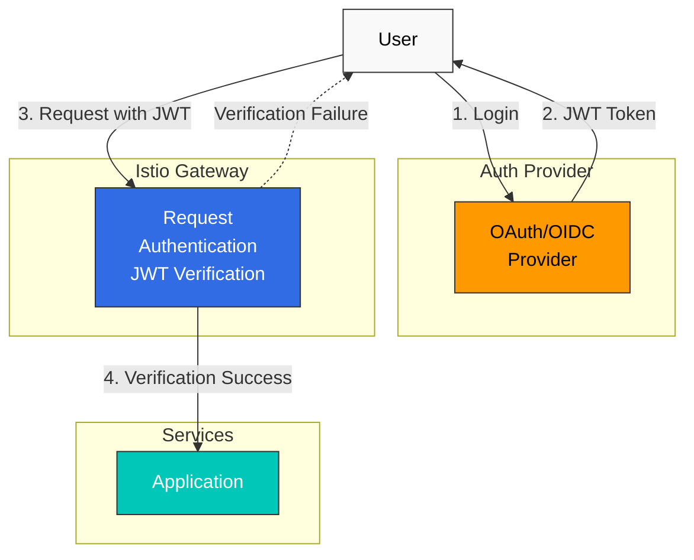

# Autenticación

Istio admite la autenticación de servicio a servicio (Peer Authentication) y la autenticación de usuarios finales (Request Authentication).

## Tabla de contenido

1. [Descripción general de la autenticación](#authentication-overview)
2. [Autenticación de solicitudes (JWT)](#request-authentication-jwt)
3. [Integración de OAuth/OIDC](#oauthoidc-integration)
4. [Ejemplos prácticos](#practical-examples)
5. [Solución de problemas](#troubleshooting)

## Descripción general de la autenticación

<p align="center">
  
</p>

Istio proporciona dos tipos de autenticación:

1. **Peer Authentication (autenticación de servicio a servicio)**
   - Autenticación de servicio a servicio mediante mTLS
   - Verificación de identidad basada en SPIFFE ID
   - Configurada con el CRD PeerAuthentication

2. **Request Authentication (autenticación de usuarios finales)**
   - Autenticación de usuarios basada en tokens JWT
   - Integración con proveedores OAuth/OIDC
   - Configurada con el CRD RequestAuthentication



## Autenticación de solicitudes (JWT)

### Verificación básica de JWT

```yaml
apiVersion: security.istio.io/v1
kind: RequestAuthentication
metadata:
  name: jwt-auth
  namespace: default
spec:
  selector:
    matchLabels:
      app: myapp
  jwtRules:
  - issuer: "https://accounts.google.com"
    jwksUri: "https://www.googleapis.com/oauth2/v3/certs"
```

### Compatibilidad con varios emisores

```yaml
apiVersion: security.istio.io/v1
kind: RequestAuthentication
metadata:
  name: multi-issuer-jwt
  namespace: default
spec:
  jwtRules:
  - issuer: "https://accounts.google.com"
    jwksUri: "https://www.googleapis.com/oauth2/v3/certs"
  - issuer: "https://login.microsoftonline.com/tenant-id/v2.0"
    jwksUri: "https://login.microsoftonline.com/tenant-id/discovery/v2.0/keys"
```

### Encabezado personalizado

```yaml
apiVersion: security.istio.io/v1
kind: RequestAuthentication
metadata:
  name: jwt-custom-header
  namespace: default
spec:
  jwtRules:
  - issuer: "https://auth.example.com"
    jwksUri: "https://auth.example.com/.well-known/jwks.json"
    fromHeaders:
    - name: "X-Auth-Token"
      prefix: "Bearer "
```

## Integración de OAuth/OIDC

### AWS Cognito

```yaml
apiVersion: security.istio.io/v1
kind: RequestAuthentication
metadata:
  name: cognito-jwt
  namespace: default
spec:
  jwtRules:
  - issuer: "https://cognito-idp.{region}.amazonaws.com/{userPoolId}"
    jwksUri: "https://cognito-idp.{region}.amazonaws.com/{userPoolId}/.well-known/jwks.json"
```

### Keycloak

```yaml
apiVersion: security.istio.io/v1
kind: RequestAuthentication
metadata:
  name: keycloak-jwt
  namespace: default
spec:
  jwtRules:
  - issuer: "https://keycloak.example.com/auth/realms/myrealm"
    jwksUri: "https://keycloak.example.com/auth/realms/myrealm/protocol/openid-connect/certs"
```

### Auth0

```yaml
apiVersion: security.istio.io/v1
kind: RequestAuthentication
metadata:
  name: auth0-jwt
  namespace: default
spec:
  jwtRules:
  - issuer: "https://your-tenant.auth0.com/"
    jwksUri: "https://your-tenant.auth0.com/.well-known/jwks.json"
    audiences:
    - "https://your-api.example.com"
```

## Ejemplos prácticos

### Verificación de JWT + autorización

```yaml
# JWT Verification
apiVersion: security.istio.io/v1
kind: RequestAuthentication
metadata:
  name: jwt-auth
  namespace: default
spec:
  selector:
    matchLabels:
      app: myapp
  jwtRules:
  - issuer: "https://auth.example.com"
    jwksUri: "https://auth.example.com/.well-known/jwks.json"
---
# Deny requests without JWT
apiVersion: security.istio.io/v1
kind: AuthorizationPolicy
metadata:
  name: require-jwt
  namespace: default
spec:
  selector:
    matchLabels:
      app: myapp
  action: DENY
  rules:
  - from:
    - source:
        notRequestPrincipals: ["*"]
```

## Solución de problemas

### Error en la verificación de JWT

```bash
# 1. Check RequestAuthentication
kubectl get requestauthentication -A
kubectl describe requestauthentication <name> -n <namespace>

# 2. Decode JWT token
echo "<jwt-token>" | cut -d'.' -f2 | base64 -d | jq

# 3. Verify JWKS endpoint
curl https://auth.example.com/.well-known/jwks.json

# 4. Check Envoy logs
kubectl logs <pod-name> -c istio-proxy -n <namespace> | grep JWT
```

## Referencias

- [Autenticación de solicitudes de Istio](https://istio.io/latest/docs/reference/config/security/request_authentication/)
- [Autenticación JWT](https://istio.io/latest/docs/tasks/security/authentication/authn-policy/)
