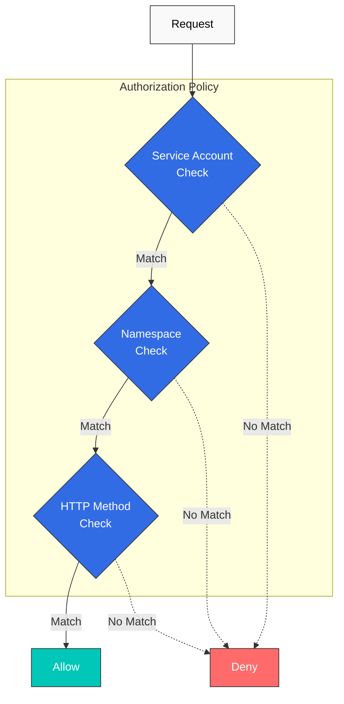

# Autorización

AuthorizationPolicy permite controlar de forma detallada los permisos de acceso a los servicios.

## Tabla de contenido

1. [Descripción general de la autorización](#authorization-overview)
2. [Políticas básicas](#basic-policies)
3. [Políticas avanzadas](#advanced-policies)
4. [Ejemplos prácticos](#practical-examples)
5. [Mejores prácticas](#best-practices)

## Descripción general de la autorización

<p align="center">
  
</p>

Istio AuthorizationPolicy proporciona control de acceso detallado para los servicios. El diagrama anterior muestra cómo funciona Authorization Policy:

1. **Recepción de solicitudes**: Envoy recibe solicitudes entrantes
2. **Evaluación de políticas**: Las reglas de AuthorizationPolicy se evalúan en orden
3. **Decisión de acceso**: Se aplica la acción ALLOW, DENY o CUSTOM
4. **Registro de auditoría**: Todas las decisiones se registran

**Condiciones compatibles**:
- **Origen**: Origen de la solicitud (ServiceAccount, Namespace, IP)
- **Operación**: Método HTTP, ruta, puerto
- **Condiciones**: Condiciones personalizadas (encabezados, claims de JWT, etc.)



## Políticas básicas

### Denegación predeterminada (Denegar todo)

```yaml
apiVersion: security.istio.io/v1
kind: AuthorizationPolicy
metadata:
  name: deny-all
  namespace: default
spec:
  action: DENY
  rules:
  - {}  # Deny all requests
```

### Permitir de forma predeterminada (Permitir todo)

```yaml
apiVersion: security.istio.io/v1
kind: AuthorizationPolicy
metadata:
  name: allow-all
  namespace: default
spec:
  action: ALLOW
  rules:
  - {}  # Allow all requests
```

### Basada en método HTTP

```yaml
apiVersion: security.istio.io/v1
kind: AuthorizationPolicy
metadata:
  name: httpbin-get-only
  namespace: default
spec:
  selector:
    matchLabels:
      app: httpbin
  action: ALLOW
  rules:
  - to:
    - operation:
        methods: ["GET"]  # Allow only GET
```

## Políticas avanzadas

### Basada en ServiceAccount

```yaml
apiVersion: security.istio.io/v1
kind: AuthorizationPolicy
metadata:
  name: ratings-sa-policy
  namespace: default
spec:
  selector:
    matchLabels:
      app: ratings
  action: ALLOW
  rules:
  - from:
    - source:
        principals: ["cluster.local/ns/default/sa/reviews"]  # Allow only reviews SA
```

### Basada en Namespace

```yaml
apiVersion: security.istio.io/v1
kind: AuthorizationPolicy
metadata:
  name: db-namespace-policy
  namespace: database
spec:
  selector:
    matchLabels:
      app: postgresql
  action: ALLOW
  rules:
  - from:
    - source:
        namespaces: ["production", "staging"]  # Specific namespaces only
```

### Basada en ruta

```yaml
apiVersion: security.istio.io/v1
kind: AuthorizationPolicy
metadata:
  name: path-based-policy
  namespace: default
spec:
  selector:
    matchLabels:
      app: api
  action: ALLOW
  rules:
  - to:
    - operation:
        paths: ["/api/public/*"]  # Allow only public API
  - from:
    - source:
        principals: ["cluster.local/ns/default/sa/admin"]
    to:
    - operation:
        paths: ["/api/admin/*"]  # admin SA can access admin API
```

### Basada en claims de JWT

```yaml
apiVersion: security.istio.io/v1
kind: AuthorizationPolicy
metadata:
  name: jwt-claims-policy
  namespace: default
spec:
  selector:
    matchLabels:
      app: myapp
  action: ALLOW
  rules:
  - when:
    - key: request.auth.claims[role]
      values: ["admin", "superuser"]  # role claim is admin or superuser
```

## Referencias

- [Política de autorización de Istio](https://istio.io/latest/docs/reference/config/security/authorization-policy/)
- [Ejemplos de autorización](https://istio.io/latest/docs/tasks/security/authorization/)
