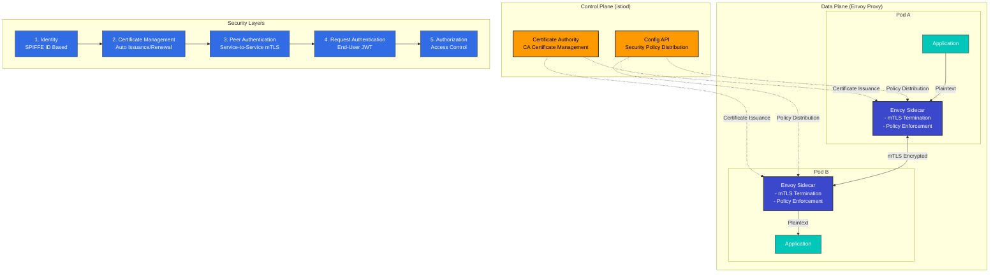

# Seguridad

> **Versiones compatibles**: Istio 1.28
> **Última actualización**: February 19, 2026

Istio proporciona sólidas características de seguridad dentro de la service mesh. Basado en el modelo de seguridad Zero Trust, cifra automáticamente la comunicación de servicio a servicio y proporciona control de acceso granular.

## Tabla de contenidos

1. [Descripción general de la arquitectura de seguridad](#security-architecture-overview)
2. [Características principales de seguridad](#core-security-features)
3. [Componentes de seguridad](#security-components)
4. [Documentación detallada](#detailed-documentation)
5. [Mejores prácticas de seguridad](#security-best-practices)
6. [Monitoreo de seguridad](#security-monitoring)

## Descripción general de la arquitectura de seguridad

<p align="center">
  
</p>

Istio implementa un **modelo de seguridad Zero Trust** para proteger toda la comunicación dentro de la service mesh. La arquitectura de seguridad consta de 4 capas principales:

### Capas de la arquitectura de seguridad



**Componentes principales de la arquitectura**:

1. **Control Plane (istiod)**
   - Certificate Authority (CA): emisión y administración de certificados X.509
   - Configuration API: distribución y administración de políticas de seguridad
   - Service Discovery: administración de identidades de workloads

2. **Data Plane (Envoy Proxy)**
   - Puntos de terminación mTLS: comunicación cifrada entre servicios
   - Aplicación de políticas: aplicación de políticas de autenticación/autorización
   - Telemetría de seguridad: recopilación de métricas de seguridad

3. **Administración de identidades**
   - Administración robusta de identidades basada en el estándar SPIFFE
   - Integración con Kubernetes ServiceAccount
   - Renovación automática de certificados (24 horas de forma predeterminada)

4. **Motor de políticas**
   - Políticas de seguridad declarativas (basadas en CRD)
   - Control de acceso granular (RBAC)
   - Compatibilidad con registros de auditoría

## Características principales de seguridad

Istio proporciona las siguientes características principales de seguridad:

### 1. Seguridad de la comunicación (mTLS)

<p align="center">
  
</p>

Toda la comunicación de servicio a servicio se cifra automáticamente. Istio admite una migración gradual mediante el modo **PERMISSIVE**.

```yaml
apiVersion: security.istio.io/v1
kind: PeerAuthentication
metadata:
  name: default
  namespace: istio-system
spec:
  mtls:
    mode: STRICT  # Production: STRICT, Migration: PERMISSIVE
```

**Descripciones de los modos**:
- **STRICT**: solo se permite mTLS (recomendado para producción)
- **PERMISSIVE**: se permiten tanto mTLS como texto sin cifrar (para migración)
- **DISABLE**: mTLS está deshabilitado

### 2. Autenticación

<p align="center">
  
</p>

Istio proporciona dos capas de autenticación:

- **Peer Authentication**: autenticación de servicio a servicio (mTLS + SPIFFE ID)
- **Request Authentication**: autenticación de usuarios finales (JWT + OAuth/OIDC)

**Ejemplo**:
```yaml
# Request Authentication (JWT)
apiVersion: security.istio.io/v1
kind: RequestAuthentication
metadata:
  name: jwt-auth
spec:
  jwtRules:
  - issuer: "https://accounts.google.com"
    jwksUri: "https://www.googleapis.com/oauth2/v3/certs"
```

### 3. Autorización

<p align="center">
  
</p>

Se aplican políticas de control de acceso granular. AuthorizationPolicy controla en función de:
- Service Account / Namespace
- Método HTTP / Ruta
- Dirección IP
- JWT Claims

```yaml
apiVersion: security.istio.io/v1
kind: AuthorizationPolicy
metadata:
  name: allow-read
spec:
  action: ALLOW
  rules:
  - from:
    - source:
        principals: ["cluster.local/ns/default/sa/myapp"]
    to:
    - operation:
        methods: ["GET"]
        paths: ["/api/*"]
```

## Mejores prácticas de seguridad

### 1. Defensa en profundidad

<p align="center">
  
</p>

Implemente una defensa en profundidad aplicando seguridad en múltiples capas:

**Capa de red**:
```yaml
# 1. Enable mTLS STRICT mode
apiVersion: security.istio.io/v1
kind: PeerAuthentication
metadata:
  name: default
  namespace: istio-system
spec:
  mtls:
    mode: STRICT
```

**Capa de aplicación**:
```yaml
# 2. Enable JWT authentication
apiVersion: security.istio.io/v1
kind: RequestAuthentication
metadata:
  name: require-jwt
spec:
  jwtRules:
  - issuer: "https://your-auth-provider.com"
    jwksUri: "https://your-auth-provider.com/.well-known/jwks.json"
```

**Capa de control de acceso**:
```yaml
# 3. Default deny policy
apiVersion: security.istio.io/v1
kind: AuthorizationPolicy
metadata:
  name: deny-all
spec:
  action: DENY
  rules:
  - {}
---
# 4. Allow only required access
apiVersion: security.istio.io/v1
kind: AuthorizationPolicy
metadata:
  name: allow-specific
spec:
  action: ALLOW
  rules:
  - from:
    - source:
        principals: ["cluster.local/ns/frontend/sa/webapp"]
    to:
    - operation:
        methods: ["GET", "POST"]
```

### 2. Principio de privilegio mínimo

- Otorgue solo los permisos mínimos necesarios a cada servicio
- Separe los ServiceAccounts de forma granular
- Utilice el aislamiento de namespace

### 3. Monitoreo de seguridad

- Habilite Istio Access Logs
- Recopile métricas de seguridad con Prometheus
- Supervise el estado de mTLS con Kiali

## Próximos pasos

1. **[mTLS](01-mtls.md)**: cifrado de servicio a servicio y administración de identidades
2. **[Autenticación](02-authentication.md)**: integración de JWT y OAuth/OIDC
3. **[Autorización](03-authorization.md)**: políticas de control de acceso granular

## Referencias

### Documentación oficial
- [Conceptos de seguridad de Istio](https://istio.io/latest/docs/concepts/security/)
- [Mejores prácticas de seguridad](https://istio.io/latest/docs/ops/best-practices/security/)
- [Referencia de seguridad](https://istio.io/latest/docs/reference/config/security/)

### Estándares relacionados
- [Especificación SPIFFE](https://github.com/spiffe/spiffe)
- [OAuth 2.0 / OIDC](https://oauth.net/2/)
- [JWT (RFC 7519)](https://datatracker.ietf.org/doc/html/rfc7519)

## Cuestionario

Para poner a prueba sus conocimientos de este capítulo, pruebe el [Cuestionario de seguridad de Istio](../../../quizzes/service-mesh/istio/security.md).
