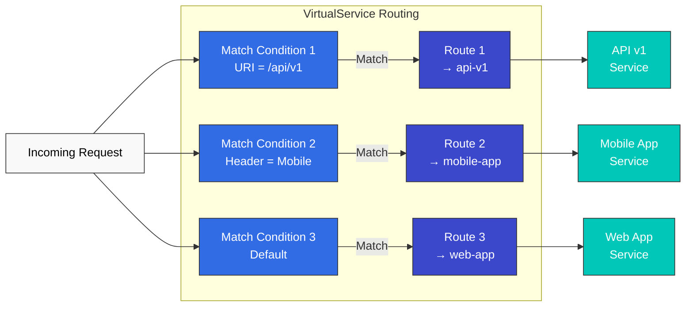

# Enrutamiento

Las funciones avanzadas de enrutamiento de Istio permiten un control detallado del tráfico según diversos atributos de la solicitud.

## Tabla de contenido

1. [Resumen del enrutamiento](#routing-overview)
2. [Condiciones de Match](#match-conditions)
3. [Enrutamiento basado en URI](#uri-based-routing)
4. [Enrutamiento basado en encabezados](#header-based-routing)
5. [Enrutamiento basado en parámetros de consulta](#query-parameter-based-routing)
6. [Enrutamiento basado en métodos HTTP](#http-method-based-routing)
7. [Enrutamiento basado en origen](#source-based-routing)
8. [Prioridad y alternativa](#priority-and-fallback)
9. [Ejemplos prácticos](#practical-examples)
10. [Solución de problemas](#troubleshooting)

## Resumen del enrutamiento

Las reglas de enrutamiento de VirtualService constan de **condiciones de Match** y **destinos de Route**.



### Estructura básica

```yaml
apiVersion: networking.istio.io/v1
kind: VirtualService
metadata:
  name: routing-example
spec:
  hosts:
  - myapp.example.com
  http:
  - match:
    - uri:
        prefix: "/api/v1"
    route:
    - destination:
        host: api-v1
  - match:
    - headers:
        user-agent:
          regex: ".*Mobile.*"
    route:
    - destination:
        host: mobile-app
  - route:  # Default route (no match)
    - destination:
        host: web-app
```

## Condiciones de Match

### Tipos de condiciones de Match

| Condición | Descripción | Tipo de Match |
|-----------|-------------|------------|
| **uri** | Ruta de la solicitud | `exact`, `prefix`, `regex` |
| **scheme** | HTTP/HTTPS | `exact`, `prefix`, `regex` |
| **method** | Método HTTP | `exact`, `prefix`, `regex` |
| **authority** | Encabezado Host | `exact`, `prefix`, `regex` |
| **headers** | Encabezados HTTP | `exact`, `prefix`, `regex` |
| **queryParams** | Parámetros de consulta | `exact`, `prefix`, `regex` |
| **sourceLabels** | Etiquetas del workload de origen | Selector de etiquetas |
| **gateways** | Nombre del Gateway | Lista |

### Tipos de Match

```yaml
# exact: Exact match
match:
- uri:
    exact: "/login"

# prefix: Prefix match
match:
- uri:
    prefix: "/api/"

# regex: Regular expression match
match:
- uri:
    regex: "^/api/v[0-9]+/.*"
```

### Combinación de múltiples condiciones

```yaml
# AND condition: All conditions must match
http:
- match:
  - uri:
      prefix: "/api"
    headers:
      x-api-version:
        exact: "v2"
    queryParams:
      debug:
        exact: "true"
  route:
  - destination:
      host: api-debug

# OR condition: Use multiple match blocks
http:
- match:
  - uri:
      prefix: "/api/v1"
  - uri:
      prefix: "/api/v2"
  route:
  - destination:
      host: api-service
```

## Enrutamiento basado en URI

### Coincidencia por prefijo

```yaml
apiVersion: networking.istio.io/v1
kind: VirtualService
metadata:
  name: uri-prefix-routing
spec:
  hosts:
  - myapp.example.com
  http:
  # API traffic
  - match:
    - uri:
        prefix: "/api/"
    route:
    - destination:
        host: api-service
        port:
          number: 8080

  # Admin traffic
  - match:
    - uri:
        prefix: "/admin/"
    route:
    - destination:
        host: admin-service
        port:
          number: 9000

  # Static files
  - match:
    - uri:
        prefix: "/static/"
    route:
    - destination:
        host: static-service
        port:
          number: 8000

  # Default traffic
  - route:
    - destination:
        host: frontend-service
        port:
          number: 3000
```

### Coincidencia exacta

```yaml
apiVersion: networking.istio.io/v1
kind: VirtualService
metadata:
  name: uri-exact-routing
spec:
  hosts:
  - myapp.example.com
  http:
  # Login page
  - match:
    - uri:
        exact: "/login"
    route:
    - destination:
        host: auth-service

  # Logout
  - match:
    - uri:
        exact: "/logout"
    route:
    - destination:
        host: auth-service

  # Health check
  - match:
    - uri:
        exact: "/health"
    route:
    - destination:
        host: health-service
```

### Coincidencia por expresiones regulares

```yaml
apiVersion: networking.istio.io/v1
kind: VirtualService
metadata:
  name: uri-regex-routing
spec:
  hosts:
  - myapp.example.com
  http:
  # API version routing: /api/v1/, /api/v2/, etc.
  - match:
    - uri:
        regex: "^/api/v[0-9]+/.*"
    route:
    - destination:
        host: api-service

  # Numeric resource ID: /users/123
  - match:
    - uri:
        regex: "^/users/[0-9]+$"
    route:
    - destination:
        host: user-service

  # File extension: .jpg, .png, .gif
  - match:
    - uri:
        regex: ".*\\.(jpg|png|gif)$"
    route:
    - destination:
        host: image-service
```

## Enrutamiento basado en encabezados

### Enrutamiento basado en User-Agent

```yaml
apiVersion: networking.istio.io/v1
kind: VirtualService
metadata:
  name: header-user-agent-routing
spec:
  hosts:
  - reviews
  http:
  # Mobile devices
  - match:
    - headers:
        user-agent:
          regex: ".*Mobile.*"
    route:
    - destination:
        host: reviews
        subset: mobile

  # Tablet devices
  - match:
    - headers:
        user-agent:
          regex: ".*(iPad|Tablet).*"
    route:
    - destination:
        host: reviews
        subset: tablet

  # Desktop (default)
  - route:
    - destination:
        host: reviews
        subset: desktop
```

### Enrutamiento basado en encabezados personalizados

```yaml
apiVersion: networking.istio.io/v1
kind: VirtualService
metadata:
  name: header-custom-routing
spec:
  hosts:
  - myapp
  http:
  # Developer/Tester routing
  - match:
    - headers:
        x-dev-user:
          exact: "true"
    route:
    - destination:
        host: myapp
        subset: dev

  # Beta testers
  - match:
    - headers:
        x-beta-tester:
          exact: "true"
    route:
    - destination:
        host: myapp
        subset: beta

  # VIP users
  - match:
    - headers:
        x-user-tier:
          exact: "vip"
    route:
    - destination:
        host: myapp
        subset: vip

  # Regular users
  - route:
    - destination:
        host: myapp
        subset: stable
```

### Enrutamiento basado en la versión de API

```yaml
apiVersion: networking.istio.io/v1
kind: VirtualService
metadata:
  name: header-api-version-routing
spec:
  hosts:
  - api.example.com
  http:
  # API v3
  - match:
    - headers:
        x-api-version:
          exact: "v3"
    route:
    - destination:
        host: api-service
        subset: v3

  # API v2
  - match:
    - headers:
        x-api-version:
          exact: "v2"
    route:
    - destination:
        host: api-service
        subset: v2

  # API v1 (default)
  - route:
    - destination:
        host: api-service
        subset: v1
```

## Enrutamiento basado en parámetros de consulta

### Coincidencia básica de parámetros de consulta

```yaml
apiVersion: networking.istio.io/v1
kind: VirtualService
metadata:
  name: query-param-routing
spec:
  hosts:
  - search.example.com
  http:
  # Debug mode: ?debug=true
  - match:
    - queryParams:
        debug:
          exact: "true"
    route:
    - destination:
        host: search-service
        subset: debug

  # Premium search: ?premium=1
  - match:
    - queryParams:
        premium:
          exact: "1"
    route:
    - destination:
        host: search-service
        subset: premium

  # A/B testing: ?variant=b
  - match:
    - queryParams:
        variant:
          exact: "b"
    route:
    - destination:
        host: search-service
        subset: variant-b

  # Default search
  - route:
    - destination:
        host: search-service
        subset: standard
```

### Combinación de múltiples parámetros de consulta

```yaml
apiVersion: networking.istio.io/v1
kind: VirtualService
metadata:
  name: query-param-combined-routing
spec:
  hosts:
  - api.example.com
  http:
  # Debug mode + verbose logging
  - match:
    - queryParams:
        debug:
          exact: "true"
        verbose:
          exact: "true"
    route:
    - destination:
        host: api-service
        subset: debug-verbose

  # Debug mode only
  - match:
    - queryParams:
        debug:
          exact: "true"
    route:
    - destination:
        host: api-service
        subset: debug

  # Normal mode
  - route:
    - destination:
        host: api-service
        subset: production
```

## Enrutamiento basado en métodos HTTP

```yaml
apiVersion: networking.istio.io/v1
kind: VirtualService
metadata:
  name: method-based-routing
spec:
  hosts:
  - api.example.com
  http:
  # POST requests → Write-only service
  - match:
    - method:
        exact: "POST"
      uri:
        prefix: "/api/"
    route:
    - destination:
        host: api-write-service

  # PUT/PATCH requests → Update service
  - match:
    - method:
        regex: "PUT|PATCH"
      uri:
        prefix: "/api/"
    route:
    - destination:
        host: api-update-service

  # DELETE requests → Delete service
  - match:
    - method:
        exact: "DELETE"
      uri:
        prefix: "/api/"
    route:
    - destination:
        host: api-delete-service

  # GET requests → Read-only service
  - match:
    - method:
        exact: "GET"
      uri:
        prefix: "/api/"
    route:
    - destination:
        host: api-read-service
```

## Enrutamiento basado en origen

### Enrutamiento basado en Namespace

```yaml
apiVersion: networking.istio.io/v1
kind: VirtualService
metadata:
  name: source-namespace-routing
  namespace: production
spec:
  hosts:
  - database.production.svc.cluster.local
  http:
  # Requests from production namespace
  - match:
    - sourceNamespace: production
    route:
    - destination:
        host: database
        subset: production

  # Requests from staging namespace
  - match:
    - sourceNamespace: staging
    route:
    - destination:
        host: database
        subset: staging

  # Block other namespaces
  - route:
    - destination:
        host: access-denied
```

### Enrutamiento basado en Service Account

```yaml
apiVersion: networking.istio.io/v1
kind: VirtualService
metadata:
  name: source-sa-routing
spec:
  hosts:
  - payment-service
  http:
  # Allow access only from specific Service Account
  - match:
    - sourceLabels:
        app: frontend
        version: v2
    route:
    - destination:
        host: payment-service
        subset: v2

  # Legacy service
  - match:
    - sourceLabels:
        app: frontend
        version: v1
    route:
    - destination:
        host: payment-service
        subset: v1
```

## Prioridad y alternativa

### Prioridad de reglas Match

Istio evalúa las reglas de enrutamiento HTTP de VirtualService **de arriba hacia abajo**.

```yaml
apiVersion: networking.istio.io/v1
kind: VirtualService
metadata:
  name: priority-example
spec:
  hosts:
  - myapp.example.com
  http:
  # Priority 1: Most specific condition
  - match:
    - uri:
        exact: "/api/v2/users/admin"
      headers:
        x-admin:
          exact: "true"
    route:
    - destination:
        host: admin-api-v2

  # Priority 2: Medium specificity
  - match:
    - uri:
        prefix: "/api/v2/"
    route:
    - destination:
        host: api-v2

  # Priority 3: Less specific
  - match:
    - uri:
        prefix: "/api/"
    route:
    - destination:
        host: api-v1

  # Priority 4 (last): Default fallback
  - route:
    - destination:
        host: frontend
```

### Estrategia de alternativa

```yaml
apiVersion: networking.istio.io/v1
kind: VirtualService
metadata:
  name: fallback-strategy
spec:
  hosts:
  - myapp
  http:
  # Requests matching specific conditions
  - match:
    - headers:
        x-canary:
          exact: "true"
    route:
    - destination:
        host: myapp
        subset: canary
    fault:
      abort:
        percentage:
          value: 0
        httpStatus: 503
    # No fallback on canary failure - return error

  # Default requests - with fallback
  - route:
    - destination:
        host: myapp
        subset: stable
      weight: 100
```

## Ejemplos prácticos

### Ejemplo 1: Enrutamiento multiinquilino

```yaml
apiVersion: networking.istio.io/v1
kind: VirtualService
metadata:
  name: multi-tenant-routing
spec:
  hosts:
  - api.example.com
  http:
  # Tenant A (identified by header)
  - match:
    - headers:
        x-tenant-id:
          exact: "tenant-a"
    route:
    - destination:
        host: api-service
        subset: tenant-a

  # Tenant B (identified by subdomain)
  - match:
    - authority:
        exact: "tenant-b.api.example.com"
    route:
    - destination:
        host: api-service
        subset: tenant-b

  # Tenant C (identified by path)
  - match:
    - uri:
        prefix: "/tenant-c/"
    rewrite:
      uri: "/"
    route:
    - destination:
        host: api-service
        subset: tenant-c
```

### Ejemplo 2: Enrutamiento basado en Feature Flag

```yaml
apiVersion: networking.istio.io/v1
kind: VirtualService
metadata:
  name: feature-flag-routing
spec:
  hosts:
  - myapp
  http:
  # Users with new feature enabled
  - match:
    - headers:
        x-feature-new-ui:
          exact: "enabled"
    route:
    - destination:
        host: myapp
        subset: new-ui

  # Beta feature testers
  - match:
    - headers:
        x-feature-beta:
          exact: "enabled"
    route:
    - destination:
        host: myapp
        subset: beta

  # Experimental features (employees only)
  - match:
    - headers:
        x-feature-experimental:
          exact: "enabled"
      sourceLabels:
        role: employee
    route:
    - destination:
        host: myapp
        subset: experimental

  # Default (stable version)
  - route:
    - destination:
        host: myapp
        subset: stable
```

### Ejemplo 3: Enrutamiento geográfico

```yaml
apiVersion: networking.istio.io/v1
kind: VirtualService
metadata:
  name: geo-routing
spec:
  hosts:
  - content.example.com
  http:
  # Korean users
  - match:
    - headers:
        x-country-code:
          exact: "KR"
    route:
    - destination:
        host: content-service
        subset: korea

  # Japanese users
  - match:
    - headers:
        x-country-code:
          exact: "JP"
    route:
    - destination:
        host: content-service
        subset: japan

  # US users
  - match:
    - headers:
        x-country-code:
          exact: "US"
    route:
    - destination:
        host: content-service
        subset: us

  # European users
  - match:
    - headers:
        x-country-code:
          regex: "DE|FR|UK|IT|ES"
    route:
    - destination:
        host: content-service
        subset: europe

  # Other regions (global)
  - route:
    - destination:
        host: content-service
        subset: global
```

### Ejemplo 4: Patrón de API Gateway

```yaml
apiVersion: networking.istio.io/v1
kind: VirtualService
metadata:
  name: api-gateway-routing
spec:
  hosts:
  - api.example.com
  gateways:
  - api-gateway
  http:
  # APIs requiring authentication
  - match:
    - uri:
        prefix: "/api/v1/protected/"
      headers:
        authorization:
          regex: "Bearer .*"
    route:
    - destination:
        host: protected-api-service

  # Public APIs
  - match:
    - uri:
        prefix: "/api/v1/public/"
    route:
    - destination:
        host: public-api-service

  # GraphQL endpoint
  - match:
    - uri:
        exact: "/graphql"
      method:
        exact: "POST"
    route:
    - destination:
        host: graphql-service

  # REST API
  - match:
    - uri:
        prefix: "/api/v1/"
    route:
    - destination:
        host: rest-api-service

  # Health check
  - match:
    - uri:
        exact: "/health"
    route:
    - destination:
        host: health-service

  # 404 handling
  - route:
    - destination:
        host: error-service
```

## Solución de problemas

### El enrutamiento no funciona

```bash
# 1. Check VirtualService status
kubectl get virtualservice -A
kubectl describe virtualservice <name> -n <namespace>

# 2. Check routing rules
istioctl proxy-config routes <pod-name> -n <namespace>

# 3. Check routing to specific service
istioctl proxy-config routes <pod-name> -n <namespace> --name <route-name> -o json

# 4. Validate configuration
istioctl analyze -n <namespace>
```

### Depuración de condiciones de Match

```bash
# Increase Envoy log level
istioctl proxy-config log <pod-name> -n <namespace> --level debug

# Trace requests
kubectl logs -n <namespace> <pod-name> -c istio-proxy -f

# Debug Pilot
kubectl logs -n istio-system -l app=istiod --tail=100
```

### Problemas comunes

#### 1. Problemas de orden de Match

```yaml
# ❌ Wrong order - default route first ignores other rules
http:
- route:  # All traffic goes here
  - destination:
      host: myapp
- match:  # Never executed
  - uri:
      prefix: "/api"
  route:
  - destination:
      host: api-service

# ✅ Correct order
http:
- match:  # Specific rules first
  - uri:
      prefix: "/api"
  route:
  - destination:
      host: api-service
- route:  # Default route last
  - destination:
      host: myapp
```

#### 2. Errores de sintaxis de expresiones regulares

```yaml
# ❌ Incorrect regex
match:
- uri:
    regex: "/api/v[1-3]"  # Missing anchor

# ✅ Correct regex
match:
- uri:
    regex: "^/api/v[1-3].*"
```

#### 3. Problemas de distinción entre mayúsculas y minúsculas en encabezados

```yaml
# HTTP headers are case-insensitive
# Istio automatically converts to lowercase
match:
- headers:
    X-Custom-Header:  # Automatically converted to x-custom-header
      exact: "value"
```

## Buenas prácticas

### 1. Coloque primero las reglas específicas

```yaml
# ✅ Good example
http:
- match:
  - uri:
      exact: "/api/v2/admin"  # Most specific
  route:
  - destination:
      host: admin-v2
- match:
  - uri:
      prefix: "/api/v2/"  # Medium
  route:
  - destination:
      host: api-v2
- match:
  - uri:
      prefix: "/api/"  # General
  route:
  - destination:
      host: api-v1
- route:  # Default
  - destination:
      host: frontend
```

### 2. Minimice las expresiones regulares

```yaml
# ❌ Avoid - complex regex degrades performance
match:
- uri:
    regex: "^/(api|admin|public)/v[0-9]+/(users|products|orders)/[a-zA-Z0-9_-]+$"

# ✅ Recommended - use prefix or exact
match:
- uri:
    prefix: "/api/v1/"
```

### 3. Nombres claros

```yaml
# ✅ Use clear names
apiVersion: networking.istio.io/v1
kind: VirtualService
metadata:
  name: product-api-routing  # Clear name
  labels:
    app: product-service
    purpose: routing
spec:
  hosts:
  - product-api.example.com
```

### 4. Documentación

```yaml
apiVersion: networking.istio.io/v1
kind: VirtualService
metadata:
  name: myapp-routing
  annotations:
    description: "Routes traffic based on API version and user type"
    owner: "platform-team"
spec:
  hosts:
  - myapp.example.com
  http:
  # Route VIP users to dedicated instance
  - match:
    - headers:
        x-user-tier:
          exact: "vip"
    route:
    - destination:
        host: myapp
        subset: vip
```

### 5. Estrategia de pruebas

```bash
# Routing rule test script
#!/bin/bash

# API v1 test
curl -H "Host: api.example.com" http://$GATEWAY_URL/api/v1/users

# API v2 test
curl -H "Host: api.example.com" http://$GATEWAY_URL/api/v2/users

# Mobile user test
curl -H "User-Agent: Mobile" http://$GATEWAY_URL/

# Header-based test
curl -H "x-canary: true" http://$GATEWAY_URL/
```

## Referencias

- [Gestión de tráfico de Istio](https://istio.io/latest/docs/concepts/traffic-management/)
- [Referencia de VirtualService](https://istio.io/latest/docs/reference/config/networking/virtual-service/)
- [Coincidencia de rutas HTTP](https://istio.io/latest/docs/reference/config/networking/virtual-service/#HTTPMatchRequest)
- [Enrutamiento de tráfico](https://istio.io/latest/docs/tasks/traffic-management/request-routing/)
