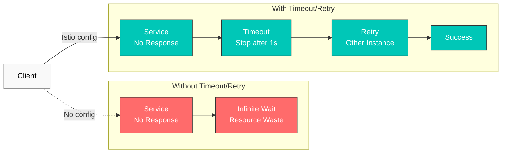
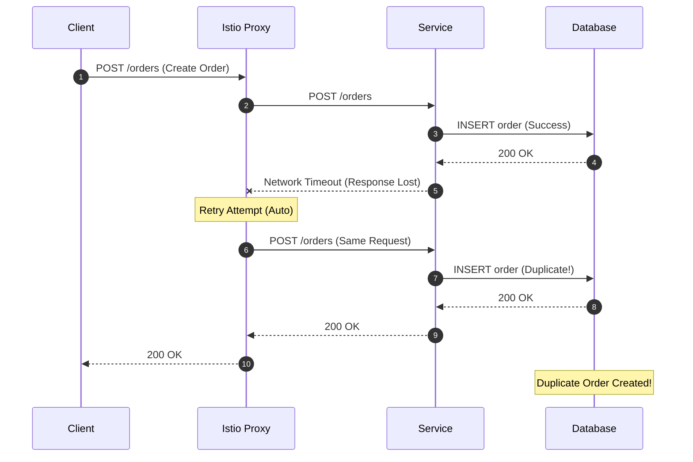

# Reintentos y tiempos de espera

Retry y Timeout son mecanismos fundamentales para mejorar la resiliencia de los microservicios. Con Istio, puede configurar estas políticas sin cambiar el código de la aplicación.

## Tabla de contenido

1. [Descripción general](#overview)
2. [Configuración de Timeout](#timeout-configuration)
3. [Configuración de Retry](#retry-configuration)
4. [Combinación de Retry y Timeout](#combining-retry-and-timeout)
5. [Ejemplos prácticos](#practical-examples)
6. [Advertencias importantes](#important-warnings)
7. [Mejores prácticas](#best-practices)
8. [Solución de problemas](#troubleshooting)

## Descripción general

### ¿Por qué Timeout y Retry?



## Configuración de Timeout

### Timeout básico

```yaml
apiVersion: networking.istio.io/v1
kind: VirtualService
metadata:
  name: reviews-timeout
spec:
  hosts:
  - reviews
  http:
  - route:
    - destination:
        host: reviews
    timeout: 10s  # Timeout after 10 seconds
```

### Timeout específico por ruta

```yaml
apiVersion: networking.istio.io/v1
kind: VirtualService
metadata:
  name: api-timeouts
spec:
  hosts:
  - api.example.com
  http:
  # Fast response API - short timeout
  - match:
    - uri:
        prefix: "/api/quick"
    route:
    - destination:
        host: api-service
    timeout: 1s

  # Standard API
  - match:
    - uri:
        prefix: "/api/standard"
    route:
    - destination:
        host: api-service
    timeout: 5s

  # Heavy operations - long timeout
  - match:
    - uri:
        prefix: "/api/batch"
    route:
    - destination:
        host: api-service
    timeout: 30s
```

## Configuración de Retry

> **Importante:** Omitir `retries` no significa necesariamente que Retry esté desactivado. El valor predeterminado de Istio en todo el clúster es `attempts: 2` con `retryOn: connect-failure,refused-stream,unavailable,cancelled`. `attempts` cuenta los **reintentos adicionales después de la solicitud original**, por lo que esto puede dar lugar a tres entregas en total. Establezca `attempts: 0` en la ruta para desactivar explícitamente los reintentos del Proxy.

### Retry básico

```yaml
apiVersion: networking.istio.io/v1
kind: VirtualService
metadata:
  name: reviews-retry
spec:
  hosts:
  - reviews
  http:
  - route:
    - destination:
        host: reviews
    retries:
      attempts: 3  # Maximum 3 retries
      perTryTimeout: 2s  # 2s timeout per attempt
      retryOn: 5xx,reset,connect-failure,refused-stream  # Retry conditions
```

### Condiciones de Retry

| Condición | Descripción |
|-----------|-------------|
| `5xx` | Errores HTTP 5xx |
| `gateway-error` | Errores 502, 503, 504 |
| `reset` | Restablecimiento de conexión |
| `connect-failure` | Error de conexión |
| `refused-stream` | HTTP/2 REFUSED_STREAM |
| `retriable-4xx` | 409 Conflict |
| `retriable-status-codes` | Códigos de estado personalizados |

### Configuración avanzada de Retry

`payment-service` acepta escrituras no idempotentes (envío de cargos), por lo que una única política de Retry aplicada a todos los métodos permitiría que la malla repitiera un POST ante `reset` o `5xx`: exactamente el riesgo de repetición ambigua sobre el que advierte esta página. En su lugar, divida la ruta por método: reintente generosamente las comprobaciones de estado de solo lectura y desactive por completo Retry de la malla para la ruta de escritura.

```yaml
apiVersion: networking.istio.io/v1
kind: VirtualService
metadata:
  name: advanced-retry
spec:
  hosts:
  - payment-service
  http:
  - name: reads-retryable
    match:
    - method:
        regex: "^(GET|HEAD)$"
    route:
    - destination:
        host: payment-service
    retries:
      attempts: 3
      perTryTimeout: 2s
      retryOn: connect-failure,refused-stream
      retryRemoteLocalities: true  # Retry to other regions
  - name: writes-no-mesh-retry
    match:
    - method:
        regex: "^(POST|PUT|PATCH|DELETE)$"
    route:
    - destination:
        host: payment-service
    retries:
      attempts: 0
```

## Combinación de Retry y Timeout

### Tiempos de espera en capas

```yaml
apiVersion: networking.istio.io/v1
kind: VirtualService
metadata:
  name: layered-timeouts
spec:
  hosts:
  - frontend
  http:
  - route:
    - destination:
        host: frontend
    timeout: 10s  # Total timeout
    retries:
      attempts: 3
      perTryTimeout: 3s  # Timeout for each delivery, including the original
```

**Cálculo**: el límite teórico de tiempo de entrega es `(1 + attempts) × perTryTimeout = 4 × 3s = 12s`, pero primero se aplica el `timeout: 10s` de nivel de ruta. El backoff y el tiempo de espera restante de la ruta pueden reducir el número de reintentos que realmente se intentan.

### Dividir la política de Retry por método HTTP

```yaml
apiVersion: networking.istio.io/v1
kind: VirtualService
metadata:
  name: order-service
spec:
  hosts:
  - order-service
  http:
  # POST/PATCH: do not replay an ambiguous write in the mesh
  - name: writes-no-mesh-retry
    match:
    - method:
        regex: "^(POST|PATCH)$"
    route:
    - destination:
        host: order-service
    timeout: 10s
    retries:
      attempts: 0

  # GET/HEAD: retry only connection establishment and REFUSED_STREAM failures
  - name: reads-limited-retry
    match:
    - method:
        regex: "^(GET|HEAD)$"
    route:
    - destination:
        host: order-service
    timeout: 5s
    retries:
      attempts: 2
      perTryTimeout: 2s
      retryOn: connect-failure,refused-stream
```

Desactive los reintentos de la malla de forma predeterminada para POST/PATCH y cualquier operación que el dominio defina como escritura. No deduzca que PUT o DELETE son seguros únicamente por el método HTTP: reinténtelos solo cuando el contrato real de la aplicación haga segura la ejecución repetida.

## Ejemplos prácticos

### Ejemplo 1: Cadena de microservicios

```yaml
# Frontend → Backend → Database
apiVersion: networking.istio.io/v1
kind: VirtualService
metadata:
  name: frontend
spec:
  hosts:
  - frontend
  http:
  - route:
    - destination:
        host: frontend
    timeout: 15s  # Consider entire chain
    retries:
      attempts: 2
      perTryTimeout: 7s
---
apiVersion: networking.istio.io/v1
kind: VirtualService
metadata:
  name: backend
spec:
  hosts:
  - backend
  http:
  - route:
    - destination:
        host: backend
    timeout: 10s  # Consider database call
    retries:
      attempts: 3
      perTryTimeout: 3s
      retryOn: 5xx,reset
---
apiVersion: networking.istio.io/v1
kind: VirtualService
metadata:
  name: database
spec:
  hosts:
  - database
  http:
  - route:
    - destination:
        host: database
    timeout: 5s
    retries:
      attempts: 2
      perTryTimeout: 2s
      retryOn: connect-failure,refused-stream
```

### Ejemplo 2: Llamada a una API externa

```yaml
apiVersion: networking.istio.io/v1
kind: VirtualService
metadata:
  name: external-api
spec:
  hosts:
  - api.external.com
  http:
  - route:
    - destination:
        host: api.external.com
    timeout: 30s  # External APIs can be slow
    retries:
      attempts: 5  # External APIs have frequent transient failures
      perTryTimeout: 5s
      retryOn: 5xx,reset,connect-failure,gateway-error
---
apiVersion: networking.istio.io/v1
kind: ServiceEntry
metadata:
  name: external-api
spec:
  hosts:
  - api.external.com
  ports:
  - number: 443
    name: https
    protocol: HTTPS
  location: MESH_EXTERNAL
  resolution: DNS
```

### Ejemplo 3: Combinado con Circuit Breaker

`payment` procesa escrituras no idempotentes, por lo que este ejemplo divide las rutas por método de la misma manera que el ejemplo anterior de `payment-service`: las lecturas realizan Retry generosamente, las escrituras desactivan Retry de la malla y el Circuit Breaker siguiente se aplica a ambas.

```yaml
apiVersion: networking.istio.io/v1
kind: VirtualService
metadata:
  name: resilient-service
spec:
  hosts:
  - payment
  http:
  - name: reads-retryable
    match:
    - method:
        regex: "^(GET|HEAD)$"
    route:
    - destination:
        host: payment
    timeout: 10s
    retries:
      attempts: 3
      perTryTimeout: 3s
      retryOn: connect-failure,refused-stream
  - name: writes-no-mesh-retry
    match:
    - method:
        regex: "^(POST|PUT|PATCH|DELETE)$"
    route:
    - destination:
        host: payment
    timeout: 10s
    retries:
      attempts: 0
---
apiVersion: networking.istio.io/v1
kind: DestinationRule
metadata:
  name: payment-circuit-breaker
spec:
  host: payment
  trafficPolicy:
    connectionPool:
      tcp:
        maxConnections: 100
      http:
        http1MaxPendingRequests: 50
        maxRequestsPerConnection: 2
    outlierDetection:
      consecutiveErrors: 5
      interval: 30s
      baseEjectionTime: 30s
      maxEjectionPercent: 50
```

## Advertencias importantes

### Riesgos de Retry para solicitudes no idempotentes

**Principio fundamental**: los reintentos automáticos del Istio Proxy para POST/PATCH y escrituras no idempotentes definidas por el dominio pueden causar **problemas de consistencia de datos**. Considere PUT/DELETE como excepciones únicamente cuando el contrato real de la aplicación garantice la idempotencia.

#### Escenario problemático



#### ¿Por qué es peligroso?

1. **Creación duplicada**: la solicitud POST realmente se completó correctamente, pero la respuesta se perdió por problemas de red; el Proxy vuelve a intentar crear **registros duplicados**.
2. **Cambios de estado incorrectos**: las operaciones críticas para el negocio, como los **pagos y deducciones de inventario**, pueden ejecutarse varias veces.
3. **No verificable**: Istio Proxy no tiene forma de confirmar si la solicitud se completó correctamente.

#### Estrategia de Retry segura

**Recomendado: desactive Retry de la malla y aplique la deduplicación a nivel de aplicación**

```yaml
# Istio: explicitly do not retry a non-idempotent write
apiVersion: networking.istio.io/v1
kind: VirtualService
metadata:
  name: order-service
spec:
  hosts:
  - order-service
  http:
  - match:
    - method:
        exact: POST
    route:
    - destination:
        host: order-service
    timeout: 10s
    retries:
      attempts: 0  # No delivery after the original request
```

`reset`, `503` y Timeout no demuestran que el servidor rechazó la solicitud. El servidor puede confirmar la transacción de la base de datos y después perder solo la respuesta, por lo que un Proxy no puede determinar si es seguro repetirla. Tras un resultado ambiguo, la aplicación debe consultar el estado de la operación en lugar de reenviarla a ciegas.

```python
# Application: Use Idempotency Key
import uuid
import requests
from requests.adapters import HTTPAdapter
from requests.packages.urllib3.util.retry import Retry

def create_order_with_idempotency(order_data):
    # Generate unique Idempotency Key
    idempotency_key = str(uuid.uuid4())

    session = requests.Session()
    retry_strategy = Retry(
        total=3,
        status_forcelist=[500, 502, 503, 504],
        allowed_methods=["POST"],  # Allow POST retry
        backoff_factor=1
    )
    adapter = HTTPAdapter(max_retries=retry_strategy)
    session.mount("http://", adapter)

    headers = {
        "X-Idempotency-Key": idempotency_key  # Prevent duplicates
    }

    response = session.post(
        "http://order-service/orders",
        json=order_data,
        headers=headers
    )
    return response

# Server side: Validate Idempotency Key
@app.route('/orders', methods=['POST'])
def create_order():
    idempotency_key = request.headers.get('X-Idempotency-Key')

    # Check if already processed in Redis/DB
    if redis.exists(f"order:idempotency:{idempotency_key}"):
        # Already processed - return cached result
        cached_result = redis.get(f"order:result:{idempotency_key}")
        return jsonify(json.loads(cached_result)), 200

    # Create new order
    order = create_order_in_db(request.json)

    # Cache Idempotency Key and result (24h TTL)
    redis.setex(f"order:idempotency:{idempotency_key}", 86400, "1")
    redis.setex(f"order:result:{idempotency_key}", 86400, json.dumps(order))

    return jsonify(order), 201
```

Combine estas salvaguardas para las API de escritura de producción:

- una `Idempotency-Key` respaldada por una restricción única de base de datos en la misma transacción
- `ETag`/`If-Match` o una comparación e intercambio de campo de versión para actualizaciones
- consulta de estado mediante ID de transacción o ID de comando después de un Timeout/reset
- un transactional outbox para efectos posteriores irreversibles, como pagos o publicación de eventos

#### Seguridad de Retry por método HTTP

| Método | Idempotente | Seguridad de Retry de Istio | Configuración recomendada |
|--------|------------|-------------------|---------------------|
| **GET** | Sí | Seguro | `attempts: 3, retryOn: 5xx,reset` |
| **HEAD** | Sí | Seguro | `attempts: 3, retryOn: 5xx,reset` |
| **OPTIONS** | Sí | Seguro | `attempts: 3, retryOn: 5xx,reset` |
| **PUT** | Depende del contrato | Precaución | Contrato de idempotencia real + actualización condicional |
| **DELETE** | Depende del contrato | Precaución | Contrato de idempotencia real + consulta de resultado |
| **POST** | Normalmente no | Peligroso | `attempts: 0`, Idempotency Key |
| **PATCH** | Normalmente no | Peligroso | `attempts: 0`, versión/ETag |

#### Casos seguros de Retry

```yaml
# Read-only requests - safe
apiVersion: networking.istio.io/v1
kind: VirtualService
metadata:
  name: api-service-reads
spec:
  hosts:
  - api-service
  http:
  - match:
    - method:
        regex: "GET|HEAD|OPTIONS"
    route:
    - destination:
        host: api-service
    retries:
      attempts: 3
      perTryTimeout: 2s
      retryOn: 5xx,reset,connect-failure
```

```yaml
# Write requests with idempotency guaranteed
apiVersion: networking.istio.io/v1
kind: VirtualService
metadata:
  name: idempotent-writes
spec:
  hosts:
  - api-service
  http:
  - match:
    - method:
        exact: PUT
    - headers:
        x-idempotency-key:
          regex: ".+"  # Only when Idempotency Key present
    route:
    - destination:
        host: api-service
    retries:
      attempts: 3
      perTryTimeout: 2s
      retryOn: 5xx,reset
```

#### Precaución al usar con Circuit Breaker

Circuit Breaker es efectivo para el **aislamiento de fallos**, pero **no puede impedir la ejecución duplicada** de solicitudes no idempotentes.

```yaml
# Bad example: POST + Circuit Breaker + Retry
apiVersion: networking.istio.io/v1
kind: VirtualService
metadata:
  name: payment-service
spec:
  hosts:
  - payment-service
  http:
  - route:
    - destination:
        host: payment-service
    retries:
      attempts: 3  # 3 retries for POST is dangerous
      retryOn: 5xx
---
apiVersion: networking.istio.io/v1
kind: DestinationRule
metadata:
  name: payment-circuit-breaker
spec:
  host: payment-service
  trafficPolicy:
    outlierDetection:
      consecutiveErrors: 5
      baseEjectionTime: 30s

# Result: Before the Circuit Breaker opens,
# duplicate payments can occur 3 times!
```

```yaml
# Good example: Use Circuit Breaker only, retry at application level
apiVersion: networking.istio.io/v1
kind: VirtualService
metadata:
  name: payment-service
spec:
  hosts:
  - payment-service
  http:
  - route:
    - destination:
        host: payment-service
    timeout: 10s
    retries:
      attempts: 0  # Completely disable retry
---
apiVersion: networking.istio.io/v1
kind: DestinationRule
metadata:
  name: payment-circuit-breaker
spec:
  host: payment-service
  trafficPolicy:
    outlierDetection:
      consecutiveErrors: 5
      baseEjectionTime: 30s
```

#### Pautas prácticas

1. **GET/HEAD/OPTIONS**: pueden usar Istio Proxy Retry
2. **POST/PATCH**: desactive Istio Retry y use Retry a nivel de aplicación + Idempotency Key
3. **PUT/DELETE**: use Istio Retry solo cuando la idempotencia esté garantizada
4. **Operaciones críticas (pagos/inventario/puntos)**: deben tener validación a nivel de aplicación + Idempotency Key

## Mejores prácticas

### 1. Guía de configuración de Timeout

```yaml
# Good example: Appropriate timeout per layer
# Frontend: 15s
# API Gateway: 10s
# Backend Service: 5s
# Database: 3s

apiVersion: networking.istio.io/v1
kind: VirtualService
metadata:
  name: api-gateway
spec:
  hosts:
  - api-gateway
  http:
  - route:
    - destination:
        host: api-gateway
    timeout: 10s
    retries:
      attempts: 2
      perTryTimeout: 4s
```

```yaml
# Bad example: Timeout too long
apiVersion: networking.istio.io/v1
kind: VirtualService
metadata:
  name: api-gateway
spec:
  hosts:
  - api-gateway
  http:
  - route:
    - destination:
        host: api-gateway
    timeout: 300s  # 5 minutes is too long
```

### 2. Estrategia de Retry

```yaml
# Good example: Consider idempotency
apiVersion: networking.istio.io/v1
kind: VirtualService
metadata:
  name: api-service
spec:
  hosts:
  - api-service
  http:
  # GET - safe to retry
  - match:
    - method:
        exact: GET
    route:
    - destination:
        host: api-service
    retries:
      attempts: 3
      perTryTimeout: 2s
      retryOn: 5xx,reset,connect-failure

  # POST/PATCH - explicitly disable mesh retry
  - match:
    - method:
        regex: "^(POST|PATCH)$"
    route:
    - destination:
        host: api-service
    retries:
      attempts: 0
```

### 3. Backoff exponencial

Istio realiza Retry con un intervalo predeterminado de 25 ms, pero aquí se muestra cómo configurar un backoff personalizado. Esto se aplica solo a la ruta de lectura: `payment` sigue desactivando Retry de la malla para las escrituras, como se mostró anteriormente en esta página:

```yaml
apiVersion: networking.istio.io/v1
kind: VirtualService
metadata:
  name: backoff-retry
spec:
  hosts:
  - payment
  http:
  - match:
    - method:
        regex: "^(GET|HEAD)$"
    route:
    - destination:
        host: payment
    retries:
      attempts: 5
      perTryTimeout: 2s
      retryOn: connect-failure,refused-stream
      # Istio automatically increases retry interval
      # 25ms, 50ms, 100ms, 200ms, 400ms
```

### 4. Cálculo del Timeout total del sistema

```yaml
# Frontend → API Gateway → Backend → Database
# Frontend: 20s
# API Gateway: 15s (must be less than Frontend)
# Backend: 10s (must be less than API Gateway)
# Database: 5s (must be less than Backend)

# Each layer should consider downstream timeout + overhead
```

## Solución de problemas

### Timeout no funciona

```bash
# 1. Check VirtualService
kubectl get virtualservice -n <namespace>
kubectl describe virtualservice <name> -n <namespace>

# 2. Check Envoy configuration
istioctl proxy-config routes <pod-name> -n <namespace> -o json | grep timeout

# 3. Test actual timeout
kubectl exec -it <pod-name> -n <namespace> -c istio-proxy -- \
  curl -v --max-time 5 http://backend-service
```

### Demasiados reintentos

```bash
# Check retry metrics
kubectl exec -n <namespace> <pod-name> -c istio-proxy -- \
  curl -s localhost:15000/stats/prometheus | grep retry

# Check retries for specific service
istio_requests_total{destination_service="backend.default.svc.cluster.local",response_flags="UR"}
```

### Prevención de tormentas de Retry

```yaml
# Use with Circuit Breaker
apiVersion: networking.istio.io/v1
kind: DestinationRule
metadata:
  name: prevent-retry-storm
spec:
  host: backend
  trafficPolicy:
    connectionPool:
      tcp:
        maxConnections: 100
      http:
        http1MaxPendingRequests: 10  # Limit pending requests
        http2MaxRequests: 100
        maxRequestsPerConnection: 1
    outlierDetection:
      consecutiveErrors: 3  # Fast circuit break
      interval: 10s
      baseEjectionTime: 30s
```

## Referencias

- [Istio Timeout](https://istio.io/latest/docs/reference/config/networking/virtual-service/#HTTPRoute)
- [Istio Retry](https://istio.io/latest/docs/reference/config/networking/virtual-service/#HTTPRetry)
- [Envoy Retry Policy](https://www.envoyproxy.io/docs/envoy/latest/configuration/http/http_filters/router_filter#config-http-filters-router-x-envoy-retry-on)
- [RFC 9110: Idempotent Methods](https://www.rfc-editor.org/rfc/rfc9110.html#name-idempotent-methods)
