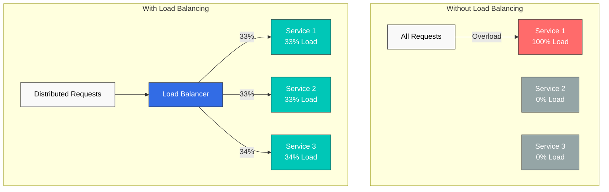
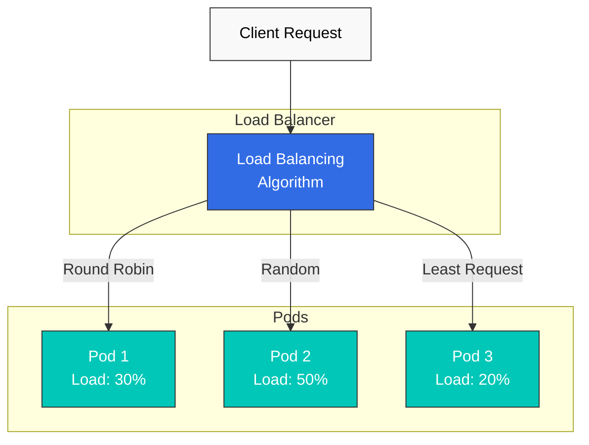
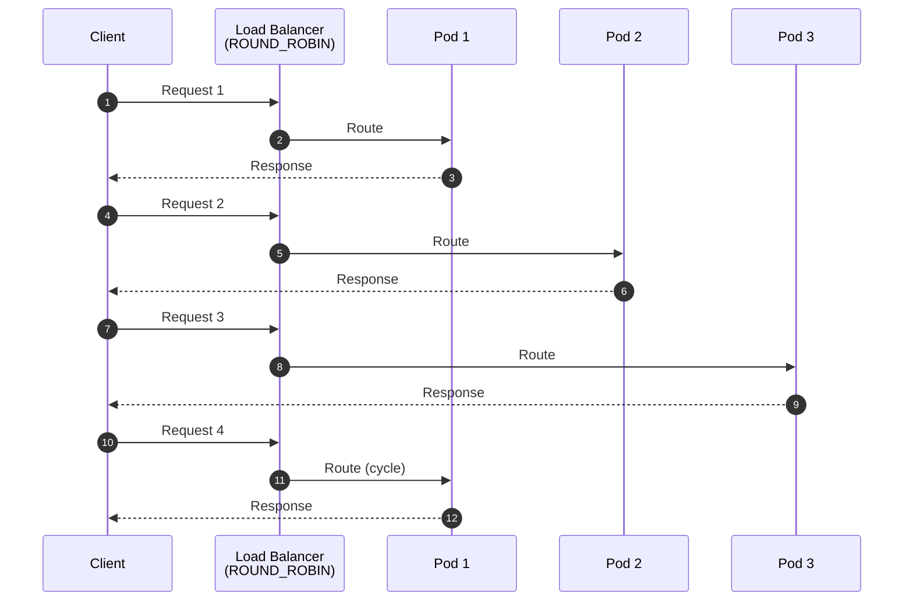
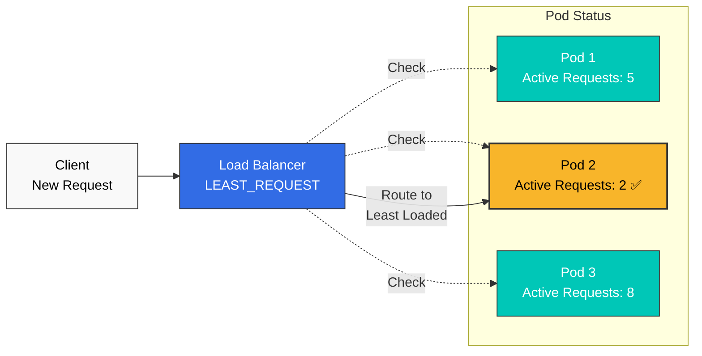
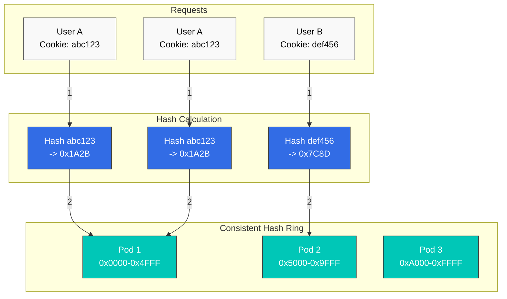
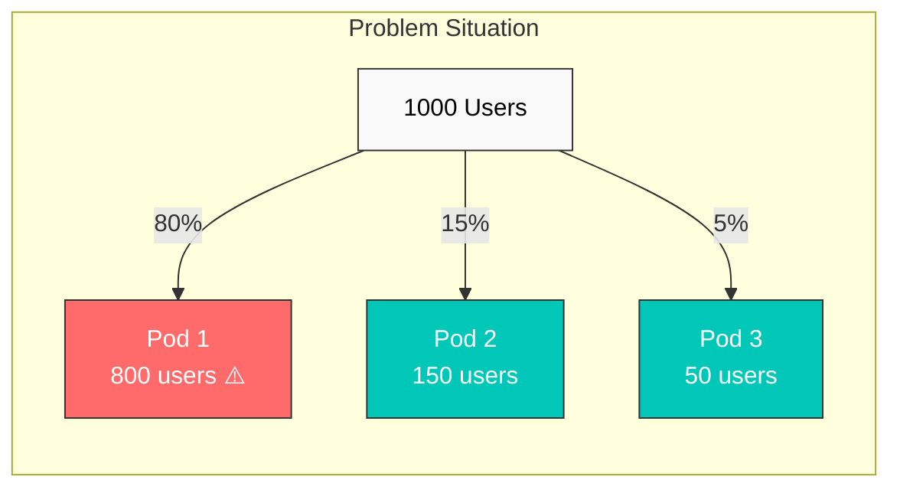
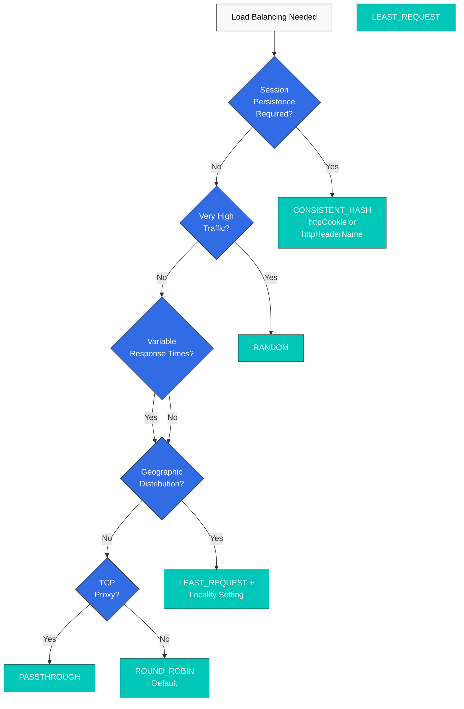

# Balanceo de carga

Istio proporciona varios algoritmos de balanceo de carga mediante Envoy para distribuir el tráfico de forma eficiente.

## Tabla de contenido

1. [¿Por qué el balanceo de carga?](#why-load-balancing)
2. [Descripción general del balanceo de carga](#load-balancing-overview)
3. [Algoritmos de balanceo de carga](#load-balancing-algorithms)
4. [Detalles de Consistent Hash](#consistent-hash-details)
5. [Balanceo de carga basado en localidad](#locality-based-load-balancing)
6. [Configuración de Connection Pool](#connection-pool-settings)
7. [Ejemplos prácticos](#practical-examples)
8. [Guía de selección de algoritmos](#algorithm-selection-guide)
9. [Mejores prácticas](#best-practices)
10. [Solución de problemas](#troubleshooting)

## ¿Por qué el balanceo de carga?

### Uso eficiente de recursos

El balanceo de carga distribuye el tráfico entre varias instancias para mejorar el rendimiento general y la estabilidad del sistema.



### Beneficios principales

| Problema | Sin balanceo de carga | Con balanceo de carga |
|---------|------------------------|---------------------|
| **Disponibilidad** | Punto único de fallo (SPOF) | Failover automático ante fallos |
| **Rendimiento** | Sobrecarga de una instancia específica | Distribución uniforme de carga |
| **Escalabilidad** | Escalado horizontal difícil | Scale-out sencillo |
| **Tiempo de respuesta** | Inconsistente (0-1000 ms+) | Tiempo de respuesta consistente |
| **Uso de recursos** | Ineficiente (uso parcial) | Uso eficiente de recursos |

## Descripción general del balanceo de carga



## Algoritmos de balanceo de carga

Istio proporciona los siguientes algoritmos de balanceo de carga.

### Comparación de algoritmos

| Algoritmo | Descripción | Casos de uso | Ventajas | Desventajas |
|-----------|-------------|-----------|------|------|
| **ROUND_ROBIN** | Distribución secuencial (predeterminado) | Servicios sin estado | Simple, equitativo | Posible desequilibrio de carga |
| **LEAST_REQUEST** | Mínimo de solicitudes activas | APIs de alto rendimiento, conexiones de DB | Ecualización de carga | Ligera sobrecarga |
| **RANDOM** | Distribución aleatoria | Alto volumen de tráfico | Simple, rápido | Posible desequilibrio a corto plazo |
| **PASSTHROUGH** | Destino original | Proxy TCP, enrutamiento SNI | Flexibilidad | Control limitado |
| **CONSISTENT_HASH** | Persistencia basada en hash | Persistencia de sesión, caché | Sesiones persistentes | Posible desequilibrio |

### 1. ROUND_ROBIN (predeterminado)

Distribuye las solicitudes secuencialmente a cada endpoint.



**Ejemplo de configuración:**

```yaml
apiVersion: networking.istio.io/v1
kind: DestinationRule
metadata:
  name: reviews-round-robin
spec:
  host: reviews
  trafficPolicy:
    loadBalancer:
      simple: ROUND_ROBIN
```

**Casos de uso:**
- APIs REST sin estado
- Pods con rendimiento idéntico
- Cuando la configuración predeterminada es suficiente

**Ventajas:**
- Implementación simple y predecible
- Distribución equitativa

**Desventajas:**
- No considera las diferencias de carga por Pod
- Las solicitudes largas pueden provocar desequilibrio

### 2. LEAST_REQUEST

Enruta al endpoint con menos solicitudes activas.



**Ejemplo de configuración:**

```yaml
apiVersion: networking.istio.io/v1
kind: DestinationRule
metadata:
  name: api-least-request
spec:
  host: api-service
  trafficPolicy:
    loadBalancer:
      simple: LEAST_REQUEST
      warmupDurationSecs: 60  # 60 second warmup (optional)
```

**Configuración avanzada:**

```yaml
apiVersion: networking.istio.io/v1
kind: DestinationRule
metadata:
  name: api-least-request-advanced
spec:
  host: api-service
  trafficPolicy:
    loadBalancer:
      simple: LEAST_REQUEST
      warmupDurationSecs: 120  # New pod warmup
    connectionPool:
      http:
        http2MaxRequests: 100
        maxRequestsPerConnection: 10
```

**Casos de uso:**
- APIs con tiempos de respuesta variables
- Pools de conexiones de base de datos
- Servicios con procesamiento intensivo
- Cuando el balanceo de carga en tiempo real es importante

**Ventajas:**
- Se adapta a la carga en tiempo real
- Mejora la consistencia del tiempo de respuesta
- Absorbe las diferencias de rendimiento por Pod

**Desventajas:**
- Ligera sobrecarga (seguimiento de solicitudes activas)

### 3. RANDOM

Selecciona un endpoint aleatoriamente.

```yaml
apiVersion: networking.istio.io/v1
kind: DestinationRule
metadata:
  name: reviews-random
spec:
  host: reviews
  trafficPolicy:
    loadBalancer:
      simple: RANDOM
```

**Casos de uso:**
- Tráfico de alto volumen (estadísticamente uniforme)
- Cuando se necesita una selección simple y rápida
- Cuando el rendimiento de los Pods es idéntico

**Ventajas:**
- Selección muy rápida
- Implementación simple
- Estadísticamente uniforme a escala

**Desventajas:**
- Posible desequilibrio a corto plazo
- Impredecible

### 4. PASSTHROUGH

Se conecta directamente al destino original especificado por el cliente.

```yaml
apiVersion: networking.istio.io/v1
kind: DestinationRule
metadata:
  name: tcp-passthrough
spec:
  host: "*.external-service.com"
  trafficPolicy:
    loadBalancer:
      simple: PASSTHROUGH
```

**Casos de uso:**
- Proxy TCP
- Enrutamiento basado en SNI
- Conexiones directas a servicios externos
- Modo TLS PASSTHROUGH

**Ventajas:**
- Conserva la dirección de destino original
- Enrutamiento flexible

**Desventajas:**
- Control limitado del balanceo de carga

### 5. LEAST_CONN (obsoleto -> LEAST_REQUEST)

**Nota**: `LEAST_CONN` está **obsoleto** y se sustituye por `LEAST_REQUEST`.

**Migración:**
```yaml
# Old version (deprecated)
trafficPolicy:
  loadBalancer:
    simple: LEAST_CONN

# New version
trafficPolicy:
  loadBalancer:
    simple: LEAST_REQUEST
```

## Detalles de Consistent Hash

Consistent Hash enruta al mismo endpoint según atributos específicos para garantizar la persistencia de sesión.

### Principio de funcionamiento de Consistent Hash



### 1. Basado en encabezado HTTP

Calcula el hash a partir del valor de un encabezado HTTP específico.

```yaml
apiVersion: networking.istio.io/v1
kind: DestinationRule
metadata:
  name: user-hash
spec:
  host: api-service
  trafficPolicy:
    loadBalancer:
      consistentHash:
        httpHeaderName: "x-user-id"
```

**Casos de uso:**
- Persistencia de sesión por usuario
- Enrutamiento basado en clave de API
- Aislamiento por tenant

### 2. Basado en cookie HTTP

Calcula el hash a partir del valor de la cookie y genera automáticamente una cookie si no existe.

```yaml
apiVersion: networking.istio.io/v1
kind: DestinationRule
metadata:
  name: cookie-hash
spec:
  host: web-service
  trafficPolicy:
    loadBalancer:
      consistentHash:
        httpCookie:
          name: "user-session"
          ttl: 3600s  # 1 hour TTL
```

**Casos de uso:**
- Persistencia de sesión de aplicaciones web
- Persistencia del carrito de compra
- Consistencia de la experiencia de usuario

### 3. Basado en IP de origen

Calcula el hash a partir de la dirección IP de origen del cliente.

```yaml
apiVersion: networking.istio.io/v1
kind: DestinationRule
metadata:
  name: source-ip-hash
spec:
  host: api-service
  trafficPolicy:
    loadBalancer:
      consistentHash:
        useSourceIp: true
```

**Casos de uso:**
- Persistencia de sesión basada en IP
- Limitación de tasa (por IP)
- Caché regional

**Precauciones:**
- Los clientes detrás de NAT pueden enrutarse al mismo Pod
- Al usar proxies, verifique la IP real del cliente

### 4. Basado en parámetro de consulta HTTP

Calcula el hash a partir del valor de un parámetro de consulta.

```yaml
apiVersion: networking.istio.io/v1
kind: DestinationRule
metadata:
  name: query-param-hash
spec:
  host: api-service
  trafficPolicy:
    loadBalancer:
      consistentHash:
        httpQueryParameterName: "user_id"
```

**Casos de uso:**
- Enrutamiento basado en ID de recurso en APIs RESTful
- Enrutamiento compatible con caché
- Estrategias de sharding

### 5. Configuración de tamaño mínimo del anillo

Establezca el tamaño mínimo del anillo de Consistent Hash para minimizar la redistribución.

```yaml
apiVersion: networking.istio.io/v1
kind: DestinationRule
metadata:
  name: hash-with-ring-size
spec:
  host: cache-service
  trafficPolicy:
    loadBalancer:
      consistentHash:
        httpHeaderName: "x-cache-key"
        minimumRingSize: 1024  # Default: 1024
```

**Explicación:**
- Un tamaño de anillo mayor proporciona una distribución más uniforme
- Reduce la proporción de claves redistribuidas al añadir o eliminar un Pod
- Uso de memoria ligeramente mayor

**Valores recomendados:**
- Escala pequeña (< 10 Pods): 1024 (predeterminado)
- Escala media (10-50 Pods): 2048
- Escala grande (50+ Pods): 4096

### Ejemplo de combinación de Consistent Hash

```yaml
apiVersion: networking.istio.io/v1
kind: DestinationRule
metadata:
  name: advanced-consistent-hash
spec:
  host: api-service
  trafficPolicy:
    loadBalancer:
      consistentHash:
        httpCookie:
          name: "session-id"
          path: "/api"
          ttl: 7200s  # 2 hours
        minimumRingSize: 2048
    connectionPool:
      http:
        maxRequestsPerConnection: 100
        idleTimeout: 300s
```

### Precauciones de Consistent Hash

#### 1. Riesgo de desequilibrio



**Causa**: Concentración de tráfico en valores hash específicos

**Soluciones:**
- Aumente `minimumRingSize`
- Use combinaciones de varias claves hash
- Considere el algoritmo Bounded Load (no compatible con Envoy)

#### 2. Redistribución al añadir/eliminar un Pod

```yaml
# On pod scale out
# - Before: Pod 1, Pod 2, Pod 3
# - After: Pod 1, Pod 2, Pod 3, Pod 4
# - Result: ~25% of sessions redistributed to different pods
```

**Estrategias de mitigación:**
- Use apagado controlado
- Use almacenamiento de sesión externo (Redis, Memcached)
- Escale gradualmente

## Balanceo de carga basado en localidad

El balanceo de carga basado en localidad prioriza endpoints geográficamente más cercanos.

### Configuración básica de localidad

```yaml
apiVersion: networking.istio.io/v1
kind: DestinationRule
metadata:
  name: locality-lb
spec:
  host: reviews
  trafficPolicy:
    loadBalancer:
      localityLbSetting:
        enabled: true
```

### Proporción de distribución por localidad

```yaml
apiVersion: networking.istio.io/v1
kind: DestinationRule
metadata:
  name: locality-distribute
spec:
  host: reviews
  trafficPolicy:
    loadBalancer:
      localityLbSetting:
        enabled: true
        distribute:
        - from: us-west/zone-1/*
          to:
            "us-west/zone-1/*": 80  # 80% to same zone
            "us-west/zone-2/*": 20  # 20% to other zone
```

### Failover por localidad

Cambia automáticamente a otra región cuando una falla.

```yaml
apiVersion: networking.istio.io/v1
kind: DestinationRule
metadata:
  name: locality-failover
spec:
  host: api-service
  trafficPolicy:
    loadBalancer:
      localityLbSetting:
        enabled: true
        failover:
        - from: us-west
          to: us-east
```

### Ejemplo multirregión

```yaml
apiVersion: networking.istio.io/v1
kind: DestinationRule
metadata:
  name: global-service-locality
spec:
  host: global-api
  trafficPolicy:
    loadBalancer:
      simple: LEAST_REQUEST
      localityLbSetting:
        enabled: true
        distribute:
        # US West clients
        - from: us-west/*
          to:
            "us-west/*": 90      # 90% local
            "us-east/*": 10      # 10% remote (DR)
        # US East clients
        - from: us-east/*
          to:
            "us-east/*": 90
            "us-west/*": 10
        failover:
        - from: us-west
          to: us-east
        - from: us-east
          to: us-west
    outlierDetection:
      consecutiveErrors: 5
      interval: 30s
      baseEjectionTime: 30s
```

**Casos de uso:**
- Implementaciones multirregión
- Minimización de latencia
- Recuperación ante desastres entre regiones
- Optimización de costes (comunicación dentro de la misma AZ)

## Configuración de Connection Pool

Configure Connection Pool junto con el balanceo de carga para optimizar el rendimiento.

### Connection Pool de HTTP/1.1

```yaml
apiVersion: networking.istio.io/v1
kind: DestinationRule
metadata:
  name: http1-connection-pool
spec:
  host: api-service
  trafficPolicy:
    loadBalancer:
      simple: LEAST_REQUEST
    connectionPool:
      tcp:
        maxConnections: 100        # Maximum connections
        connectTimeout: 3s         # Connection timeout
      http:
        http1MaxPendingRequests: 50  # Pending request count
        maxRequestsPerConnection: 100 # Max requests per connection
        idleTimeout: 300s             # Idle connection timeout
```

### Connection Pool de HTTP/2

```yaml
apiVersion: networking.istio.io/v1
kind: DestinationRule
metadata:
  name: http2-connection-pool
spec:
  host: grpc-service
  trafficPolicy:
    loadBalancer:
      simple: LEAST_REQUEST
    connectionPool:
      tcp:
        maxConnections: 50
      http:
        http2MaxRequests: 1000     # HTTP/2 concurrent requests
        maxRequestsPerConnection: 0 # Unlimited (HTTP/2 multiplexing)
        h2UpgradePolicy: UPGRADE    # Allow HTTP/2 upgrade
```

## Ejemplos prácticos

### Ejemplo 1: Servicio de API de alto rendimiento

```yaml
apiVersion: networking.istio.io/v1
kind: DestinationRule
metadata:
  name: api-high-performance
  namespace: production
spec:
  host: api-service
  trafficPolicy:
    loadBalancer:
      simple: LEAST_REQUEST
      warmupDurationSecs: 60  # New pod warmup
    connectionPool:
      tcp:
        maxConnections: 200
        connectTimeout: 5s
      http:
        http2MaxRequests: 500
        maxRequestsPerConnection: 100
        idleTimeout: 300s
    outlierDetection:
      consecutiveErrors: 5
      interval: 30s
      baseEjectionTime: 30s
      maxEjectionPercent: 50
```

**Escenarios de uso:**
- APIs REST de alto rendimiento
- Solicitudes con tiempos de respuesta variables
- Entornos con diferencias de rendimiento por Pod

### Ejemplo 2: Enrutamiento basado en sesión de usuario

```yaml
apiVersion: networking.istio.io/v1
kind: DestinationRule
metadata:
  name: web-session-affinity
spec:
  host: web-frontend
  trafficPolicy:
    loadBalancer:
      consistentHash:
        httpCookie:
          name: "session-id"
          ttl: 7200s  # 2 hours
        minimumRingSize: 2048
    connectionPool:
      tcp:
        maxConnections: 500
      http:
        http1MaxPendingRequests: 100
        maxRequestsPerConnection: 50
```

**Escenarios de uso:**
- Persistencia de sesión de aplicaciones web
- Consistencia del carrito de compra
- Uso de caché por usuario

### Ejemplo 3: Servicio global multirregión

```yaml
apiVersion: networking.istio.io/v1
kind: DestinationRule
metadata:
  name: global-api-multi-region
spec:
  host: global-api
  trafficPolicy:
    loadBalancer:
      simple: LEAST_REQUEST
      localityLbSetting:
        enabled: true
        distribute:
        # US West
        - from: us-west-1/*
          to:
            "us-west-1/*": 80
            "us-west-2/*": 15
            "us-east-1/*": 5
        # US East
        - from: us-east-1/*
          to:
            "us-east-1/*": 80
            "us-east-2/*": 15
            "us-west-1/*": 5
        # EU
        - from: eu-central-1/*
          to:
            "eu-central-1/*": 90
            "eu-west-1/*": 10
        failover:
        - from: us-west-1
          to: us-west-2
        - from: us-east-1
          to: us-east-2
    connectionPool:
      tcp:
        maxConnections: 1000
      http:
        http2MaxRequests: 2000
    outlierDetection:
      consecutiveErrors: 5
      interval: 30s
      baseEjectionTime: 60s
```

**Escenarios de uso:**
- Servicios SaaS globales
- Minimización de latencia
- Recuperación ante desastres por región
- Reducción de costes de tráfico entre AZ

### Ejemplo 4: Optimización de servicio de caché

```yaml
apiVersion: networking.istio.io/v1
kind: DestinationRule
metadata:
  name: cache-service-optimized
spec:
  host: redis-cache
  trafficPolicy:
    loadBalancer:
      consistentHash:
        httpHeaderName: "x-cache-key"
        minimumRingSize: 4096  # Large ring size to minimize redistribution
    connectionPool:
      tcp:
        maxConnections: 100
        connectTimeout: 1s
      http:
        http1MaxPendingRequests: 20
        maxRequestsPerConnection: 1000
        idleTimeout: 600s
    outlierDetection:
      consecutiveErrors: 3
      interval: 10s
      baseEjectionTime: 30s
```

**Escenarios de uso:**
- Maximizar la tasa de aciertos de caché
- Enrutamiento consistente de claves de caché
- Estrategias de sharding

### Ejemplo 5: Pool de conexiones de base de datos

```yaml
apiVersion: networking.istio.io/v1
kind: DestinationRule
metadata:
  name: database-connection-pool
spec:
  host: postgres-primary
  trafficPolicy:
    loadBalancer:
      simple: LEAST_REQUEST
    connectionPool:
      tcp:
        maxConnections: 50  # DB connection limit
        connectTimeout: 5s
      http:
        http1MaxPendingRequests: 10
        maxRequestsPerConnection: 100
    outlierDetection:
      consecutiveErrors: 3
      interval: 60s
      baseEjectionTime: 120s
```

**Escenarios de uso:**
- Gestión de pools de conexiones de base de datos
- Distribución de consultas lentas
- Aplicación de límites de conexión

### Ejemplo 6: Procesamiento de alto tráfico

```yaml
apiVersion: networking.istio.io/v1
kind: DestinationRule
metadata:
  name: high-traffic-service
spec:
  host: analytics-ingestion
  trafficPolicy:
    loadBalancer:
      simple: RANDOM  # Fast selection to minimize overhead
    connectionPool:
      tcp:
        maxConnections: 5000
        connectTimeout: 1s
      http:
        http2MaxRequests: 10000
        maxRequestsPerConnection: 1000
        idleTimeout: 60s
    outlierDetection:
      consecutiveErrors: 10
      interval: 30s
      baseEjectionTime: 30s
      maxEjectionPercent: 20  # Limited ejection at scale
```

**Escenarios de uso:**
- Recopilación de eventos (Analytics)
- Recopilación de logs
- Procesamiento de datos a gran escala

## Guía de selección de algoritmos

### Árbol de decisión



### Algoritmos recomendados por tipo de servicio

| Tipo de servicio | Algoritmo recomendado | Motivo |
|-------------|----------------------|--------|
| **API REST** | LEAST_REQUEST | Consistencia del tiempo de respuesta |
| **API GraphQL** | LEAST_REQUEST | Distribución de consultas complejas |
| **gRPC** | LEAST_REQUEST | Balanceo de carga de streaming |
| **Frontend web** | CONSISTENT_HASH (cookie) | Persistencia de sesión |
| **WebSocket** | CONSISTENT_HASH (encabezado) | Persistencia de conexión |
| **Servicio de caché** | CONSISTENT_HASH (encabezado) | Tasa de aciertos de caché |
| **Recopilación de Analytics/logs** | RANDOM | Procesamiento a gran escala |
| **Base de datos** | LEAST_REQUEST | Gestión de pool de conexiones |
| **Contenido estático** | ROUND_ROBIN | Simple y suficiente |
| **Cola de mensajes** | LEAST_REQUEST | Balanceo de carga de cola |
| **Procesamiento por lotes** | LEAST_REQUEST | Distribución de trabajos |

### Selección según el patrón de tráfico

```yaml
# 1. Uniform small requests (< 10ms)
trafficPolicy:
  loadBalancer:
    simple: ROUND_ROBIN  # Simple and efficient

# 2. Variable requests (10ms ~ 1s+)
trafficPolicy:
  loadBalancer:
    simple: LEAST_REQUEST  # Load adaptive

# 3. Very high traffic (10,000+ RPS)
trafficPolicy:
  loadBalancer:
    simple: RANDOM  # Minimize overhead

# 4. Session-based (user state)
trafficPolicy:
  loadBalancer:
    consistentHash:
      httpCookie:
        name: "session-id"
        ttl: 3600s

# 5. Multi-region
trafficPolicy:
  loadBalancer:
    simple: LEAST_REQUEST
    localityLbSetting:
      enabled: true
```

## Mejores prácticas

### 1. Principios de selección de algoritmos

**Buen ejemplo:**
```yaml
# API with variable response times
apiVersion: networking.istio.io/v1
kind: DestinationRule
metadata:
  name: api-service-best-practice
spec:
  host: api-service
  trafficPolicy:
    loadBalancer:
      simple: LEAST_REQUEST  # Load adaptive
      warmupDurationSecs: 60  # New pod warmup
```

**Mal ejemplo:**
```yaml
# Using ROUND_ROBIN with variable response times
apiVersion: networking.istio.io/v1
kind: DestinationRule
metadata:
  name: api-service-bad-practice
spec:
  host: api-service
  trafficPolicy:
    loadBalancer:
      simple: ROUND_ROBIN  # Causes load imbalance
```

### 2. Configuración obligatoria de Connection Pool

Configure siempre Connection Pool con el balanceo de carga:

```yaml
apiVersion: networking.istio.io/v1
kind: DestinationRule
metadata:
  name: complete-lb-config
spec:
  host: api-service
  trafficPolicy:
    loadBalancer:
      simple: LEAST_REQUEST
    connectionPool:  # Required
      tcp:
        maxConnections: 100
      http:
        http1MaxPendingRequests: 50
        maxRequestsPerConnection: 100
```

### 3. Combinación con Outlier Detection

Úselo con Circuit Breaker para eliminar Pods con fallos:

```yaml
apiVersion: networking.istio.io/v1
kind: DestinationRule
metadata:
  name: lb-with-outlier
spec:
  host: api-service
  trafficPolicy:
    loadBalancer:
      simple: LEAST_REQUEST
    outlierDetection:  # Required
      consecutiveErrors: 5
      interval: 30s
      baseEjectionTime: 30s
```

### 4. Precauciones al usar Consistent Hash

```yaml
# Good example: Using session storage
apiVersion: networking.istio.io/v1
kind: DestinationRule
metadata:
  name: web-with-redis-session
  annotations:
    description: "Uses Redis for session storage"
spec:
  host: web-frontend
  trafficPolicy:
    loadBalancer:
      consistentHash:
        httpCookie:
          name: "session-id"
          ttl: 3600s
    # Using Redis session storage maintains
    # sessions even on pod restart
```

```yaml
# Caution: Local session only
apiVersion: networking.istio.io/v1
kind: DestinationRule
metadata:
  name: web-local-session-only
  annotations:
    warning: "No external session storage - sessions lost on pod restart"
spec:
  host: web-frontend
  trafficPolicy:
    loadBalancer:
      consistentHash:
        httpCookie:
          name: "session-id"
          ttl: 3600s
    # Warning: Sessions lost on pod restart
```

### 5. Implementación multirregión

```yaml
# Good example: Locality + Failover
apiVersion: networking.istio.io/v1
kind: DestinationRule
metadata:
  name: multi-region-best-practice
spec:
  host: global-service
  trafficPolicy:
    loadBalancer:
      simple: LEAST_REQUEST
      localityLbSetting:
        enabled: true
        distribute:
        - from: us-west/*
          to:
            "us-west/*": 80
            "us-east/*": 20
        failover:  # Required
        - from: us-west
          to: us-east
```

### 6. Monitorización y métricas

Supervise la eficacia del balanceo de carga:

```yaml
# Prometheus queries
# Request distribution per pod
sum by (destination_workload) (rate(istio_requests_total[5m]))

# Response time per pod
histogram_quantile(0.95,
  sum by (destination_workload, le) (
    rate(istio_request_duration_milliseconds_bucket[5m])
  )
)

# Active connection count
sum by (destination_workload) (envoy_cluster_upstream_cx_active)
```

### 7. Aplicación gradual

```yaml
# Step 1: Default ROUND_ROBIN
simple: ROUND_ROBIN

# Step 2: LEAST_REQUEST after monitoring
simple: LEAST_REQUEST

# Step 3: Add Connection Pool
simple: LEAST_REQUEST
connectionPool: ...

# Step 4: Add Outlier Detection
simple: LEAST_REQUEST
connectionPool: ...
outlierDetection: ...
```

### 8. Documentación

```yaml
apiVersion: networking.istio.io/v1
kind: DestinationRule
metadata:
  name: api-service-lb
  annotations:
    # Configuration rationale
    purpose: "Distribute load based on active requests"

    # Algorithm selection basis
    algorithm-rationale: |
      - LEAST_REQUEST: Response times vary 10ms-500ms
      - warmupDurationSecs: New pods need 60s to warm up cache

    # Test results
    test-results: |
      - Load test: 1000 RPS evenly distributed
      - P95 latency: 150ms (improved from 300ms with ROUND_ROBIN)
      - No pod overload observed

    # Monitoring
    monitoring: |
      - Dashboard: grafana.example.com/d/istio-workload
      - Alert: High P95 latency > 500ms
```

## Solución de problemas

### Distribución de carga desequilibrada

**Síntomas:**
```bash
# Check CPU usage per pod
kubectl top pods -n production

# Output:
# NAME                CPU    MEMORY
# api-pod-1           80%    2Gi
# api-pod-2           20%    1Gi
# api-pod-3           15%    1Gi
```

**Causas y soluciones:**

```yaml
# 1. Change ROUND_ROBIN -> LEAST_REQUEST
apiVersion: networking.istio.io/v1
kind: DestinationRule
metadata:
  name: api-service-fix
spec:
  host: api-service
  trafficPolicy:
    loadBalancer:
      simple: LEAST_REQUEST  # Changed

# 2. Add Warmup
      warmupDurationSecs: 60

# 3. Add Outlier Detection
    outlierDetection:
      consecutiveErrors: 5
      interval: 30s
      baseEjectionTime: 30s
```

### Desequilibrio de Consistent Hash

**Síntomas:**
```bash
# Check Envoy metrics
kubectl exec -it pod-name -c istio-proxy -- \
  curl localhost:15000/stats/prometheus | grep upstream_rq_total

# Requests concentrated on specific pod
```

**Solución:**

```yaml
apiVersion: networking.istio.io/v1
kind: DestinationRule
metadata:
  name: hash-fix
spec:
  host: api-service
  trafficPolicy:
    loadBalancer:
      consistentHash:
        httpHeaderName: "x-user-id"
        minimumRingSize: 4096  # Increase 2048 -> 4096
```

### El enrutamiento basado en localidad no funciona

**Pasos de verificación:**

```bash
# 1. Check pod locality labels
kubectl get pods -o jsonpath='{range .items[*]}{.metadata.name}{"\t"}{.metadata.labels.topology\.kubernetes\.io/region}{"\t"}{.metadata.labels.topology\.kubernetes\.io/zone}{"\n"}{end}'

# 2. Check Istio Proxy configuration
istioctl proxy-config endpoints pod-name | grep locality

# 3. Check DestinationRule application
istioctl proxy-config clusters pod-name --fqdn api-service.default.svc.cluster.local -o json | jq '.[] | .localityLbEndpoints'
```

**Corrección:**

```yaml
# Check and add node labels
apiVersion: v1
kind: Node
metadata:
  labels:
    topology.kubernetes.io/region: us-west
    topology.kubernetes.io/zone: us-west-1
```

## Referencias

- [Istio Load Balancing](https://istio.io/latest/docs/reference/config/networking/destination-rule/#LoadBalancerSettings)
- [Envoy Load Balancing](https://www.envoyproxy.io/docs/envoy/latest/intro/arch_overview/upstream/load_balancing/load_balancing)
- [Consistent Hashing](https://www.toptal.com/big-data/consistent-hashing)
- [Locality Load Balancing](https://istio.io/latest/docs/tasks/traffic-management/locality-load-balancing/)
