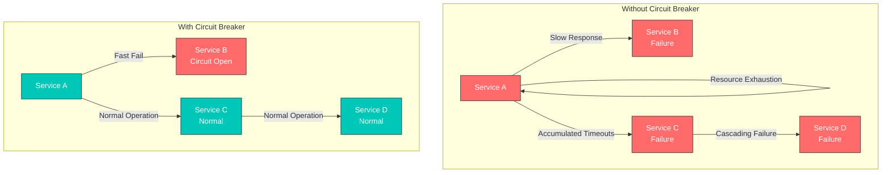
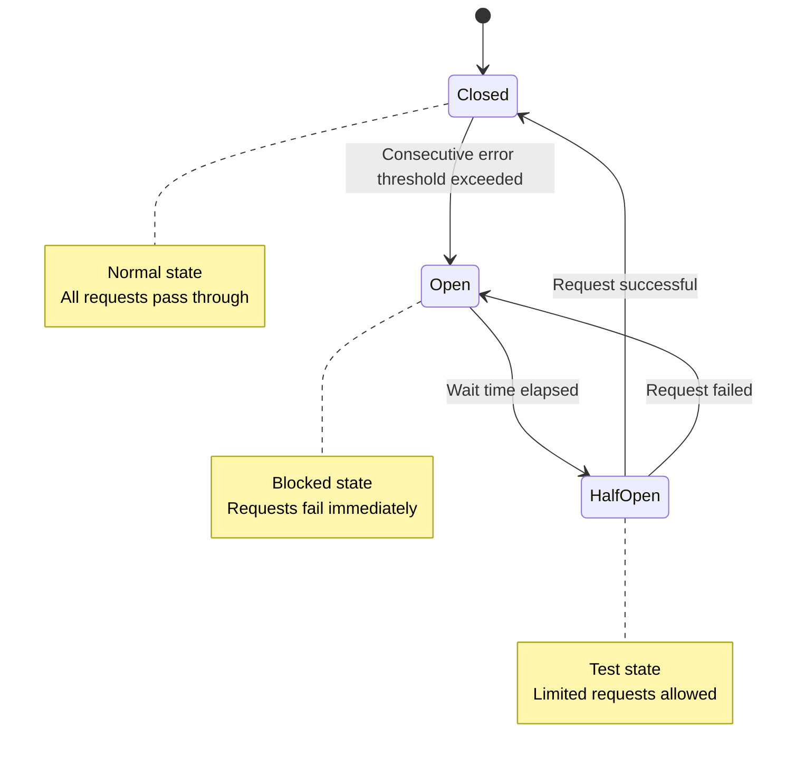
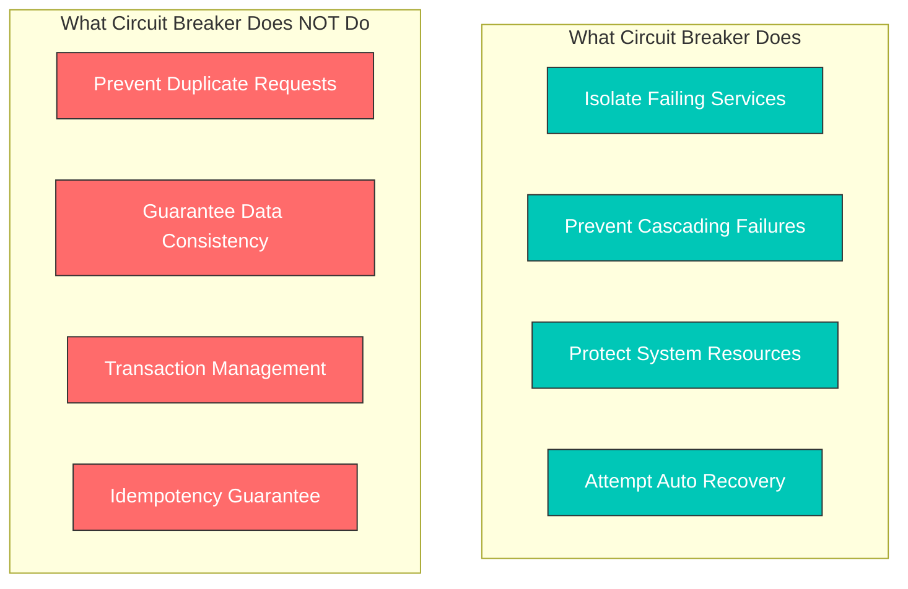
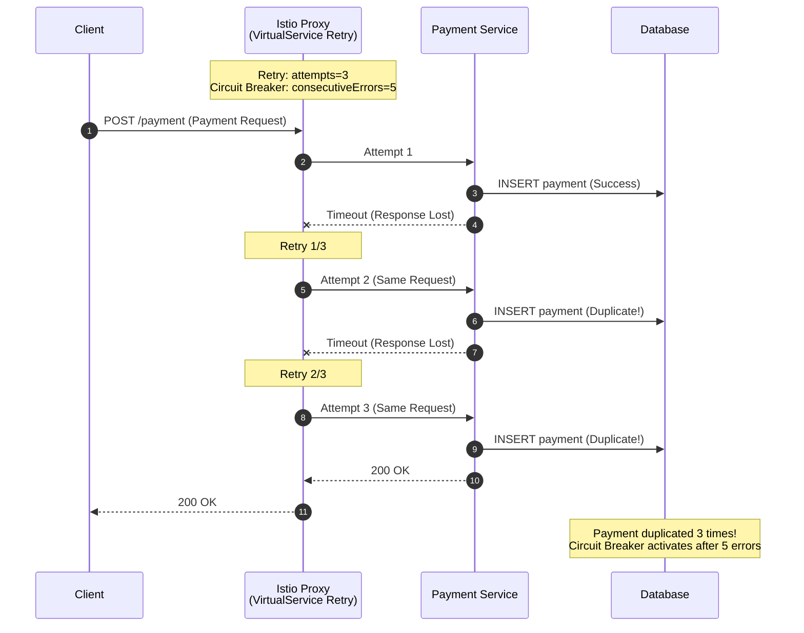

# Circuit Breaker

Circuit Breaker aísla automáticamente los servicios que fallan para evitar fallos en cascada.

## Tabla de contenido

1. [¿Por qué Circuit Breaker?](#why-circuit-breaker)
2. [Descripción general de Circuit Breaker](#circuit-breaker-overview)
3. [Configuración del Connection Pool](#connection-pool-settings)
4. [Detección de valores atípicos](#outlier-detection)
5. [Combinación con la política de Retry](#combination-with-retry-policy)
6. [Ejemplos prácticos](#practical-examples)
7. [Circuit Breaker para servicios externos](#external-service-circuit-breaker)
8. [Monitoreo y depuración](#monitoring-and-debugging)
9. [Consideraciones importantes](#important-considerations)
10. [Mejores prácticas](#best-practices)

## ¿Por qué Circuit Breaker?

### Prevención de fallos en cascada

En una arquitectura de microservicios, evita que los fallos de un servicio se propaguen a otros servicios.



### Beneficios principales

| Problema | Sin Circuit Breaker | Con Circuit Breaker |
|---------|------------------------|----------------------|
| **Tiempo de respuesta** | Espera hasta el timeout (30 s+) | Fallo inmediato (1 ms) |
| **Uso de recursos** | Agotamiento de hilos/conexiones | Protección de recursos |
| **Propagación de fallos** | Se producen fallos en cascada | Aislamiento de fallos |
| **Tiempo de recuperación** | Requiere intervención manual | Intentos de recuperación automática |

## Descripción general de Circuit Breaker



## Configuración del Connection Pool

```yaml
apiVersion: networking.istio.io/v1
kind: DestinationRule
metadata:
  name: reviews-circuit-breaker
spec:
  host: reviews
  trafficPolicy:
    connectionPool:
      tcp:
        maxConnections: 100
      http:
        http1MaxPendingRequests: 50
        http2MaxRequests: 100
        maxRequestsPerConnection: 2
```

## Detección de valores atípicos

La detección de valores atípicos elimina automáticamente las instancias no saludables.

```yaml
apiVersion: networking.istio.io/v1
kind: DestinationRule
metadata:
  name: reviews-outlier
spec:
  host: reviews
  trafficPolicy:
    outlierDetection:
      consecutiveErrors: 5        # 5 consecutive errors
      interval: 30s               # Check every 30 seconds
      baseEjectionTime: 30s       # Remove for 30 seconds
      maxEjectionPercent: 50      # Remove up to 50%
      minHealthPercent: 40        # Maintain at least 40%
```

### Configuración avanzada de detección de valores atípicos

```yaml
apiVersion: networking.istio.io/v1
kind: DestinationRule
metadata:
  name: advanced-outlier
spec:
  host: api-service
  trafficPolicy:
    outlierDetection:
      # Consecutive error based
      consecutiveGatewayErrors: 5    # 5xx errors 5 times
      consecutive5xxErrors: 3        # 500~599 errors 3 times

      # Time intervals
      interval: 10s                  # Check every 10 seconds
      baseEjectionTime: 30s          # First ejection time
      maxEjectionTime: 300s          # Maximum ejection time

      # Rate limits
      maxEjectionPercent: 50         # Remove up to 50%
      minHealthPercent: 30           # Maintain at least 30%

      # Success rate based
      splitExternalLocalOriginErrors: true
```

## Combinación con la política de Retry

Use Circuit Breaker junto con Retry para aumentar la resiliencia.

### Combinación básica

```yaml
apiVersion: networking.istio.io/v1
kind: VirtualService
metadata:
  name: reviews-retry
spec:
  hosts:
  - reviews
  http:
  - route:
    - destination:
        host: reviews
    retries:
      attempts: 3                    # 3 retries
      perTryTimeout: 2s              # 2 second timeout per attempt
      retryOn: 5xx,reset,connect-failure
---
apiVersion: networking.istio.io/v1
kind: DestinationRule
metadata:
  name: reviews-circuit-breaker
spec:
  host: reviews
  trafficPolicy:
    connectionPool:
      http:
        http1MaxPendingRequests: 10
        maxRequestsPerConnection: 2
    outlierDetection:
      consecutiveErrors: 5
      interval: 10s
      baseEjectionTime: 30s
```

### Patrón de presupuesto de Retry

```yaml
apiVersion: networking.istio.io/v1
kind: VirtualService
metadata:
  name: payment-retry-budget
spec:
  hosts:
  - payment-service
  http:
  - route:
    - destination:
        host: payment-service
    retries:
      attempts: 2                    # Minimize retries
      perTryTimeout: 1s              # Fast fail
      retryOn: retriable-4xx,5xx
---
apiVersion: networking.istio.io/v1
kind: DestinationRule
metadata:
  name: payment-circuit-breaker
spec:
  host: payment-service
  trafficPolicy:
    connectionPool:
      http:
        http1MaxPendingRequests: 5   # Low queue
        maxRequestsPerConnection: 1  # 1 request per connection
    outlierDetection:
      consecutiveErrors: 3           # Fast blocking
      interval: 5s
      baseEjectionTime: 60s          # Long recovery time
```

## Ejemplos prácticos

### 1. Circuit Breaker para servicios dentro de la malla

#### Escenario: Protección del servicio de base de datos

```yaml
apiVersion: networking.istio.io/v1
kind: DestinationRule
metadata:
  name: database-service-circuit-breaker
  namespace: production
spec:
  host: database-service
  trafficPolicy:
    connectionPool:
      tcp:
        maxConnections: 100          # Maximum 100 connections
      http:
        http1MaxPendingRequests: 50  # 50 pending requests
        http2MaxRequests: 100        # HTTP/2 100 concurrent requests
        maxRequestsPerConnection: 2  # Maximum 2 requests per connection
        idleTimeout: 60s             # Idle connection timeout
    outlierDetection:
      consecutiveErrors: 5
      interval: 30s
      baseEjectionTime: 30s
      maxEjectionPercent: 50
  subsets:
  - name: v1
    labels:
      version: v1
  - name: v2
    labels:
      version: v2
```

**Casos de uso**:
- Evitar el agotamiento del Connection Pool de la base de datos
- Bloquear fallos en cascada provocados por consultas lentas
- Eliminar automáticamente las instancias no saludables

### 2. Patrón maxConnections: 1 (conexión única)

#### Escenario: Sistema heredado o servicio con recursos limitados

```yaml
apiVersion: networking.istio.io/v1
kind: DestinationRule
metadata:
  name: legacy-system-protection
spec:
  host: legacy-api-service
  trafficPolicy:
    connectionPool:
      tcp:
        maxConnections: 1            # Limit to 1 connection
      http:
        http1MaxPendingRequests: 1   # 1 pending request
        maxRequestsPerConnection: 1  # 1 request per connection
        h2UpgradePolicy: DO_NOT_UPGRADE  # Prevent HTTP/2 upgrade
    outlierDetection:
      consecutiveErrors: 1           # Block immediately on 1 error
      interval: 10s
      baseEjectionTime: 60s
```

**Casos de uso**:
- Cuando los sistemas heredados no pueden gestionar conexiones simultáneas
- Cuando los límites de tasa de una API externa son muy estrictos
- Cuando se requiere procesamiento secuencial con una única conexión

### 3. Circuit Breaker por Subset

#### Escenario: Diferentes configuraciones de Circuit Breaker por versión

```yaml
apiVersion: networking.istio.io/v1
kind: DestinationRule
metadata:
  name: reviews-subset-circuit-breaker
spec:
  host: reviews
  trafficPolicy:
    # Default policy (all subsets)
    connectionPool:
      http:
        http1MaxPendingRequests: 50
        maxRequestsPerConnection: 2
    outlierDetection:
      consecutiveErrors: 5
      interval: 30s
      baseEjectionTime: 30s
  subsets:
  - name: v1
    labels:
      version: v1
    # v1 uses default policy

  - name: v2
    labels:
      version: v2
    trafficPolicy:
      # v2 has stricter policy (new version testing)
      connectionPool:
        http:
          http1MaxPendingRequests: 10
          maxRequestsPerConnection: 1
      outlierDetection:
        consecutiveErrors: 3
        interval: 10s
        baseEjectionTime: 60s

  - name: v3-canary
    labels:
      version: v3
    trafficPolicy:
      # v3 Canary is very strict (initial deployment)
      connectionPool:
        http:
          http1MaxPendingRequests: 5
          maxRequestsPerConnection: 1
      outlierDetection:
        consecutiveErrors: 1
        interval: 5s
        baseEjectionTime: 120s
```

### 4. Patrón avanzado de Connection Pool

#### Escenario: Servicio de alto rendimiento

```yaml
apiVersion: networking.istio.io/v1
kind: DestinationRule
metadata:
  name: high-performance-service
spec:
  host: api-gateway
  trafficPolicy:
    connectionPool:
      tcp:
        maxConnections: 1000         # High concurrent connections
        connectTimeout: 3s
        tcpKeepalive:
          time: 7200s
          interval: 75s
          probes: 9
      http:
        http1MaxPendingRequests: 500
        http2MaxRequests: 1000
        maxRequestsPerConnection: 100  # Connection reuse
        idleTimeout: 300s
        h2UpgradePolicy: UPGRADE       # Use HTTP/2
    outlierDetection:
      consecutiveErrors: 10          # Lenient setting
      interval: 60s
      baseEjectionTime: 30s
      maxEjectionPercent: 20         # Remove up to 20% only
```

### 5. Circuit Breaker basado en Health Check

```yaml
apiVersion: networking.istio.io/v1
kind: DestinationRule
metadata:
  name: health-check-circuit-breaker
spec:
  host: payment-service
  trafficPolicy:
    outlierDetection:
      # HTTP status code based
      consecutiveGatewayErrors: 5    # 502, 503, 504
      consecutive5xxErrors: 3        # 500~599

      # Performance based
      interval: 10s
      baseEjectionTime: 30s
      maxEjectionTime: 300s          # Maximum 5 minutes

      # Dynamic adjustment
      splitExternalLocalOriginErrors: true
      consecutiveLocalOriginFailures: 5
```

## Circuit Breaker para servicios externos

Úselo con ServiceEntry para proteger servicios externos.

### 1. Circuit Breaker para API externa

```yaml
# ServiceEntry: Register external API
apiVersion: networking.istio.io/v1
kind: ServiceEntry
metadata:
  name: external-payment-api
spec:
  hosts:
  - api.payment-provider.com
  ports:
  - number: 443
    name: https
    protocol: HTTPS
  location: MESH_EXTERNAL
  resolution: DNS
---
# DestinationRule: Apply Circuit Breaker
apiVersion: networking.istio.io/v1
kind: DestinationRule
metadata:
  name: external-payment-api-circuit-breaker
spec:
  host: api.payment-provider.com
  trafficPolicy:
    connectionPool:
      tcp:
        maxConnections: 10           # External API is limited
      http:
        http1MaxPendingRequests: 5
        maxRequestsPerConnection: 1  # Minimize connection reuse
    outlierDetection:
      consecutiveErrors: 3           # Fast blocking
      interval: 30s
      baseEjectionTime: 120s         # Long recovery time
      maxEjectionPercent: 100        # Can completely block
    tls:
      mode: SIMPLE                   # TLS connection
```

### 2. Circuit Breaker para base de datos externa

```yaml
apiVersion: networking.istio.io/v1
kind: ServiceEntry
metadata:
  name: external-mongodb
spec:
  hosts:
  - mongodb.external-cluster.com
  ports:
  - number: 27017
    name: tcp
    protocol: TCP
  location: MESH_EXTERNAL
  resolution: DNS
---
apiVersion: networking.istio.io/v1
kind: DestinationRule
metadata:
  name: external-mongodb-circuit-breaker
spec:
  host: mongodb.external-cluster.com
  trafficPolicy:
    connectionPool:
      tcp:
        maxConnections: 50
        connectTimeout: 5s
    outlierDetection:
      consecutiveErrors: 5
      interval: 60s
      baseEjectionTime: 60s
```

### 3. Servicio externo con límite de tasa

```yaml
apiVersion: networking.istio.io/v1
kind: ServiceEntry
metadata:
  name: rate-limited-api
spec:
  hosts:
  - api.rate-limited-service.com
  ports:
  - number: 443
    name: https
    protocol: HTTPS
  location: MESH_EXTERNAL
  resolution: DNS
---
apiVersion: networking.istio.io/v1
kind: DestinationRule
metadata:
  name: rate-limited-api-protection
spec:
  host: api.rate-limited-service.com
  trafficPolicy:
    connectionPool:
      http:
        http1MaxPendingRequests: 1   # Minimize queue
        maxRequestsPerConnection: 1  # Prevent rate limit exceeding
        idleTimeout: 1s              # Fast connection release
    outlierDetection:
      consecutiveErrors: 1           # Block immediately on 429 error
      interval: 60s
      baseEjectionTime: 300s         # Wait 5 minutes (rate limit reset)
---
# VirtualService: Retry settings
apiVersion: networking.istio.io/v1
kind: VirtualService
metadata:
  name: rate-limited-api-retry
spec:
  hosts:
  - api.rate-limited-service.com
  http:
  - route:
    - destination:
        host: api.rate-limited-service.com
    retries:
      attempts: 0                    # Disable retry (rate limit)
    timeout: 10s
```

## Monitoreo y depuración

### Comprobar métricas de Envoy

```bash
# Check Circuit Breaker status
kubectl exec -it <pod-name> -c istio-proxy -- \
  curl localhost:15000/stats/prometheus | grep circuit_breakers

# Outlier Detection status
kubectl exec -it <pod-name> -c istio-proxy -- \
  curl localhost:15000/stats/prometheus | grep outlier_detection

# Connection Pool status
kubectl exec -it <pod-name> -c istio-proxy -- \
  curl localhost:15000/stats/prometheus | grep upstream_rq
```

### Métricas principales

```yaml
# Prometheus queries
# Circuit Breaker Open count
envoy_cluster_circuit_breakers_default_rq_open

# Pending request count
envoy_cluster_circuit_breakers_default_rq_pending_open

# Outlier Detection Ejection
envoy_cluster_outlier_detection_ejections_active

# Connection pool overflow
envoy_cluster_upstream_rq_pending_overflow

# Retry count
envoy_cluster_upstream_rq_retry
```

### Dashboard de Grafana

```yaml
# Circuit Breaker Dashboard
- expr: rate(envoy_cluster_circuit_breakers_default_rq_open[5m])
  legend: "Circuit Breaker Open Rate"

- expr: envoy_cluster_outlier_detection_ejections_active
  legend: "Ejected Instances"

- expr: rate(envoy_cluster_upstream_rq_pending_overflow[5m])
  legend: "Connection Pool Overflow"
```

### Comandos de istioctl

```bash
# Check Proxy configuration
istioctl proxy-config cluster <pod-name> --fqdn reviews.default.svc.cluster.local

# Check Circuit Breaker settings
istioctl proxy-config cluster <pod-name> -o json | \
  jq '.[] | select(.name=="outbound|9080||reviews.default.svc.cluster.local") | .circuitBreakers'

# Check Outlier Detection settings
istioctl proxy-config cluster <pod-name> -o json | \
  jq '.[] | select(.name=="outbound|9080||reviews.default.svc.cluster.local") | .outlierDetection'
```

## Consideraciones importantes

### Circuit Breaker no garantiza la consistencia de los datos

**Principio fundamental**: Circuit Breaker es una herramienta de **aislamiento de fallos**, no de **prevención de solicitudes duplicadas** ni de **garantía de consistencia de datos**.

#### Función y limitaciones de Circuit Breaker



#### Escenario problemático: Retry + Circuit Breaker



**Problema**: Antes de que Circuit Breaker se active (después de 5 errores consecutivos), ya se han producido **3 pagos duplicados**.

#### Ejemplo de uso incorrecto

```yaml
# Dangerous: POST request + Retry + Circuit Breaker
apiVersion: networking.istio.io/v1
kind: VirtualService
metadata:
  name: payment-dangerous
spec:
  hosts:
  - payment-service
  http:
  - route:
    - destination:
        host: payment-service
    retries:
      attempts: 3  # 3 retries on POST
      perTryTimeout: 2s
      retryOn: 5xx,reset
---
apiVersion: networking.istio.io/v1
kind: DestinationRule
metadata:
  name: payment-circuit-breaker
spec:
  host: payment-service
  trafficPolicy:
    outlierDetection:
      consecutiveErrors: 5
      interval: 30s
      baseEjectionTime: 30s

# Result:
# - Up to 15 duplicates possible before Circuit Breaker activates (3 retries x 5 errors)
# - Critical operations like payment, inventory deduction get duplicated
# - Data consistency destroyed
```

#### Patrones de uso correctos

**Patrón 1: Solo Circuit Breaker (deshabilitar Retry)**

```yaml
# Safe: Read-only + Circuit Breaker
apiVersion: networking.istio.io/v1
kind: VirtualService
metadata:
  name: product-catalog-safe
spec:
  hosts:
  - product-catalog
  http:
  - match:
    - method:
        regex: "GET|HEAD|OPTIONS"  # Read-only only
    route:
    - destination:
        host: product-catalog
    retries:
      attempts: 3  # GET is safe
      perTryTimeout: 2s
      retryOn: 5xx,reset,connect-failure
---
apiVersion: networking.istio.io/v1
kind: DestinationRule
metadata:
  name: product-catalog-circuit-breaker
spec:
  host: product-catalog
  trafficPolicy:
    outlierDetection:
      consecutiveErrors: 5
      interval: 30s
      baseEjectionTime: 30s
```

```yaml
# Safe: Disable Retry for POST
apiVersion: networking.istio.io/v1
kind: VirtualService
metadata:
  name: payment-safe
spec:
  hosts:
  - payment-service
  http:
  - match:
    - method:
        exact: POST
    route:
    - destination:
        host: payment-service
    timeout: 10s
    retries:
      attempts: 0  # Disable Retry for POST
      # Or
      # attempts: 1
      # retryOn: connect-failure,refused-stream  # Network only
---
apiVersion: networking.istio.io/v1
kind: DestinationRule
metadata:
  name: payment-circuit-breaker
spec:
  host: payment-service
  trafficPolicy:
    outlierDetection:
      consecutiveErrors: 5
      interval: 30s
      baseEjectionTime: 30s
```

**Patrón 2: Idempotencia en el nivel de aplicación + Circuit Breaker**

```python
# Server: Idempotency Key validation
@app.route('/payment', methods=['POST'])
def create_payment():
    idempotency_key = request.headers.get('X-Idempotency-Key')

    if not idempotency_key:
        return jsonify({"error": "Missing Idempotency-Key"}), 400

    # Check if request was already processed
    if redis.exists(f"payment:idempotency:{idempotency_key}"):
        cached_result = redis.get(f"payment:result:{idempotency_key}")
        return jsonify(json.loads(cached_result)), 200

    # Process new payment
    try:
        payment = process_payment(request.json)

        # Cache result (24 hours)
        redis.setex(f"payment:idempotency:{idempotency_key}", 86400, "1")
        redis.setex(f"payment:result:{idempotency_key}", 86400,
                    json.dumps(payment))

        return jsonify(payment), 201
    except Exception as e:
        return jsonify({"error": str(e)}), 500
```

```yaml
# Istio: Retry is safe when Idempotency is guaranteed
apiVersion: networking.istio.io/v1
kind: VirtualService
metadata:
  name: payment-with-idempotency
spec:
  hosts:
  - payment-service
  http:
  - match:
    - headers:
        x-idempotency-key:
          regex: ".+"  # Idempotency Key required
    route:
    - destination:
        host: payment-service
    retries:
      attempts: 3  # Safe with Idempotency
      perTryTimeout: 2s
      retryOn: 5xx,reset
  - route:  # Disable Retry without Idempotency Key
    - destination:
        host: payment-service
    retries:
      attempts: 0
```

#### Estrategia de seguridad por tipo de servicio

| Tipo de servicio | Retry | Circuit Breaker | Se requiere idempotencia |
|-------------|-------|----------------|---------------------|
| **Catálogo de productos** | 3 veces | Requerido | No se requiere |
| **Carrito de compras** | 3 veces | Requerido | No se requiere |
| **Creación de pedidos** | 0 veces | Requerido | Requerida |
| **Pago** | 0 veces | Requerido | Requerida |
| **Deducción de inventario** | 0 veces | Requerido | Requerida |
| **Acumulación de puntos** | 0 veces | Requerido | Requerida |
| **Envío de notificaciones** | 3 veces (idempotente) | Requerido | Recomendada |

#### Connection Pool y consistencia de datos

La configuración del Connection Pool tampoco **garantiza la consistencia de los datos**. Solo limita el número de conexiones simultáneas.

```yaml
# Misconception: Does maxConnections=1 prevent duplicates?
apiVersion: networking.istio.io/v1
kind: DestinationRule
metadata:
  name: payment-single-connection
spec:
  host: payment-service
  trafficPolicy:
    connectionPool:
      tcp:
        maxConnections: 1  # Does NOT prevent duplicates
      http:
        http1MaxPendingRequests: 1

# maxConnections=1:
# - Only limits concurrent connections
# - Cannot prevent duplicate requests from Retry
# - Retries after network timeout are separate connections
```

#### Lista de verificación práctica

**Verificación previa al despliegue**:

- [ ] Compruebe la configuración de Retry para solicitudes POST/PUT/DELETE/PATCH
- [ ] Establezca `attempts: 0` o `retryOn: connect-failure` para solicitudes no idempotentes
- [ ] Revise la posibilidad de duplicados al combinar Circuit Breaker y Retry
- [ ] Implemente Idempotency Key para operaciones críticas (pago, inventario)
- [ ] Confirme que exista lógica de validación en el nivel de aplicación
- [ ] Realice una simulación de fallos en el entorno de pruebas

**Monitoreo**:

```bash
# Check Retry occurrence count
kubectl exec -n <namespace> <pod> -c istio-proxy -- \
  curl -s localhost:15000/stats/prometheus | grep upstream_rq_retry

# Check Circuit Breaker activation
kubectl exec -n <namespace> <pod> -c istio-proxy -- \
  curl -s localhost:15000/stats/prometheus | grep circuit_breakers

# Check logs for suspected duplicate requests
kubectl logs -n <namespace> <pod> | grep -i "duplicate\|idempotency"
```

## Mejores prácticas

### 1. Configuración gradual

```yaml
# Stage 1: Start with lenient settings
apiVersion: networking.istio.io/v1
kind: DestinationRule
metadata:
  name: service-circuit-breaker-stage1
spec:
  host: my-service
  trafficPolicy:
    connectionPool:
      http:
        http1MaxPendingRequests: 100
        maxRequestsPerConnection: 10
    outlierDetection:
      consecutiveErrors: 10        # Lenient
      interval: 60s
      baseEjectionTime: 30s
```

```yaml
# Stage 2: Adjust after monitoring
apiVersion: networking.istio.io/v1
kind: DestinationRule
metadata:
  name: service-circuit-breaker-stage2
spec:
  host: my-service
  trafficPolicy:
    connectionPool:
      http:
        http1MaxPendingRequests: 50
        maxRequestsPerConnection: 5
    outlierDetection:
      consecutiveErrors: 5         # Moderate
      interval: 30s
      baseEjectionTime: 30s
```

### 2. Configuración específica por tipo de servicio

```yaml
# Frontend service: Lenient
connectionPool:
  http:
    http1MaxPendingRequests: 100
    maxRequestsPerConnection: 10
outlierDetection:
  consecutiveErrors: 10

# Backend service: Moderate
connectionPool:
  http:
    http1MaxPendingRequests: 50
    maxRequestsPerConnection: 5
outlierDetection:
  consecutiveErrors: 5

# Database/Cache: Strict
connectionPool:
  http:
    http1MaxPendingRequests: 10
    maxRequestsPerConnection: 2
outlierDetection:
  consecutiveErrors: 3

# External API: Very strict
connectionPool:
  http:
    http1MaxPendingRequests: 5
    maxRequestsPerConnection: 1
outlierDetection:
  consecutiveErrors: 1
```

### 3. Configuración de alertas

```yaml
# Prometheus Alert Rules
groups:
- name: circuit-breaker
  rules:
  - alert: CircuitBreakerOpen
    expr: envoy_cluster_circuit_breakers_default_rq_open > 0
    for: 1m
    annotations:
      summary: "Circuit breaker is open"

  - alert: HighConnectionPoolOverflow
    expr: rate(envoy_cluster_upstream_rq_pending_overflow[5m]) > 10
    for: 2m
    annotations:
      summary: "Connection pool overflow rate is high"

  - alert: HighOutlierEjectionRate
    expr: rate(envoy_cluster_outlier_detection_ejections_total[5m]) > 5
    for: 3m
    annotations:
      summary: "High outlier ejection rate"
```

### 4. Escenarios de prueba

```bash
#!/bin/bash
# Circuit Breaker test

# 1. Normal traffic
echo "=== Normal Traffic ==="
for i in {1..10}; do
  curl -s http://service/api | jq .status
  sleep 0.1
done

# 2. Increased load
echo "=== Increased Load ==="
for i in {1..100}; do
  curl -s http://service/api &
done
wait

# 3. Check Circuit Breaker status
echo "=== Circuit Breaker Status ==="
istioctl proxy-config cluster <pod> | grep circuit_breakers

# 4. Wait for recovery
echo "=== Waiting for Recovery ==="
sleep 30

# 5. Verify recovery
echo "=== Recovery Check ==="
curl -s http://service/api | jq .status
```

### 5. Plantilla de documentación

```yaml
apiVersion: networking.istio.io/v1
kind: DestinationRule
metadata:
  name: my-service-circuit-breaker
  annotations:
    # Configuration purpose
    purpose: "Protect database connection pool"

    # Threshold rationale
    threshold-rationale: |
      - maxConnections: 100 (DB connection pool size)
      - consecutiveErrors: 5 (observed error pattern)
      - baseEjectionTime: 30s (average recovery time)

    # Test results
    test-results: |
      - Load test: 1000 RPS without overflow
      - Failure test: Circuit opens after 5 errors
      - Recovery test: Auto-recovery after 30s

    # Operations guide
    operations: |
      - Monitor: envoy_cluster_circuit_breakers_*
      - Alert: Circuit open > 1min
      - Rollback: kubectl delete dr my-service-circuit-breaker
```

## Referencias

- [Istio Circuit Breaker](https://istio.io/latest/docs/tasks/traffic-management/circuit-breaking/)
- [Envoy Circuit Breaking](https://www.envoyproxy.io/docs/envoy/latest/intro/arch_overview/upstream/circuit_breaking)
- [Envoy Outlier Detection](https://www.envoyproxy.io/docs/envoy/latest/intro/arch_overview/upstream/outlier)
- [Netflix Hystrix](https://github.com/Netflix/Hystrix/wiki/How-it-Works)
