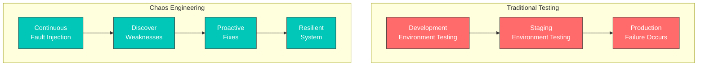
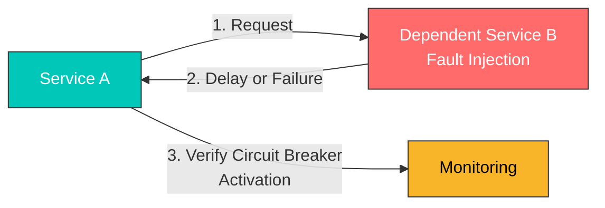
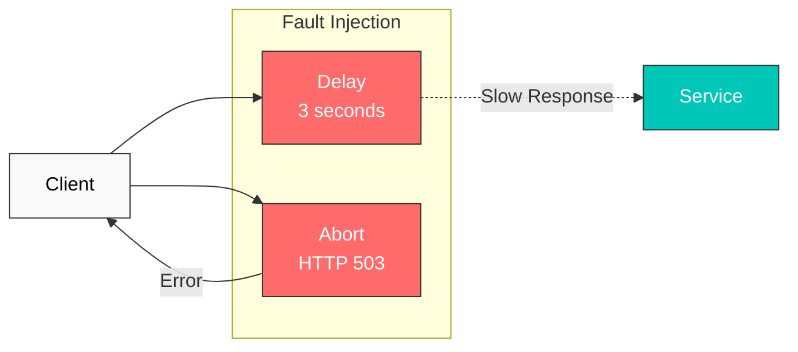
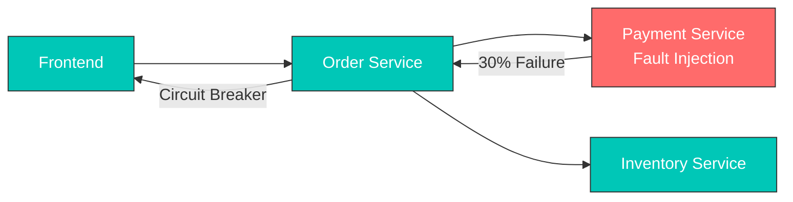
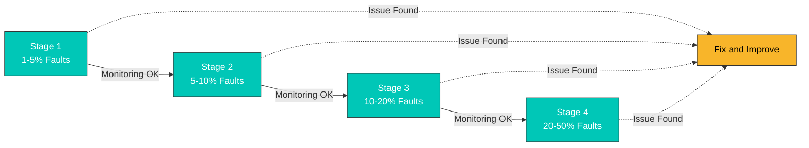

# Inyección de fallos

La inyección de fallos es una técnica que introduce intencionadamente fallos para probar la resiliencia del sistema.

## Tabla de contenido

1. [¿Por qué la inyección de fallos?](#por-qué-la-inyección-de-fallos)
2. [Cuándo usar la inyección de fallos](#cuándo-usar-la-inyección-de-fallos)
3. [Descripción general de la inyección de fallos](#descripción-general-de-la-inyección-de-fallos)
4. [Inyección de retraso](#inyección-de-retraso)
5. [Inyección de aborto](#inyección-de-aborto)
6. [Ejemplos prácticos](#ejemplos-prácticos)
7. [Escenarios del mundo real](#escenarios-del-mundo-real)
8. [Estrategias de prueba](#estrategias-de-prueba)
9. [Mejores prácticas](#mejores-prácticas)

## ¿Por qué la inyección de fallos?

### Prueba de resiliencia en entornos de producción

En la arquitectura de microservicios, numerosos servicios dependen unos de otros, y **un único fallo de servicio puede afectar a todo el sistema**. La inyección de fallos es esencial por los siguientes motivos:

#### 1. **Principio fundamental de Chaos Engineering**

Chaos Engineering, originado a partir de Chaos Monkey de Netflix, tiene como objetivo **experimentar fallos de forma proactiva en entornos de producción** y descubrir las debilidades del sistema.



#### 2. **Reproducción de escenarios reales de producción**

En entornos de producción, pueden ocurrir los siguientes problemas:

| Escenario | Causa | Prueba de inyección de fallos |
|----------|-------|---------------------|
| **Latencia de red** | Latencia de red entre regiones | Inyección de retraso |
| **Tiempo de espera del Service** | Consultas lentas a la base de datos | Inyección de retraso |
| **Fallo temporal** | Reinicio del Service, scale down | Inyección de aborto |
| **Fallo parcial** | Solo fallan algunos pods | Inyección basada en porcentaje |
| **Fallo en cascada** | El fallo de un Service se propaga a otros | Inyección de fallos combinada |

#### 3. **Verificación de la configuración de Circuit Breaker y Timeout**

Sin inyección de fallos, es **difícil confirmar si la configuración de Circuit Breaker y Timeout funciona realmente**.



#### 4. **Validación de Deployments seguros**

Al implementar nuevas versiones, puede verificar **si son seguras incluso cuando fallan los servicios dependientes**:

- ¿La nueva versión gestiona correctamente los tiempos de espera?
- ¿Realiza una degradación gradual cuando fallan los servicios dependientes?
- ¿La lógica de gestión de errores funciona correctamente?

## Cuándo usar la inyección de fallos

La inyección de fallos debe utilizarse en las siguientes situaciones:

### 1. **Entornos de desarrollo y prueba**

#### Escenario: desarrollo de un nuevo microservicio

```yaml
# Inject faults into service under development
apiVersion: networking.istio.io/v1
kind: VirtualService
metadata:
  name: payment-service-dev
  namespace: dev
spec:
  hosts:
  - payment-service
  http:
  - match:
    - headers:
        x-testing:
          exact: "true"  # Apply only to test traffic
    fault:
      delay:
        percentage:
          value: 50.0
        fixedDelay: 3s
      abort:
        percentage:
          value: 20.0
        httpStatus: 503
    route:
    - destination:
        host: payment-service
        subset: v2
```

**Caso de uso**:
- Probar cómo reacciona el Service de pedidos cuando el Service de pagos se ralentiza o falla
- Verificar que se muestren mensajes de error adecuados a los usuarios

### 2. **Pruebas de integración en el entorno de Staging**

#### Escenario: verificación final antes del Deployment en producción

```yaml
# Inject random faults into all dependent services
apiVersion: networking.istio.io/v1
kind: VirtualService
metadata:
  name: database-service-staging
spec:
  hosts:
  - database-service
  http:
  - fault:
      delay:
        percentage:
          value: 10.0  # 10% of requests delayed
        fixedDelay: 5s
      abort:
        percentage:
          value: 5.0   # 5% of requests fail
        httpStatus: 500
    route:
    - destination:
        host: database-service
```

**Caso de uso**:
- Verificar la resiliencia de todo el sistema antes del Deployment en producción
- Confirmar que las alertas de monitoreo funcionen correctamente

### 3. **Pruebas de Chaos en el entorno de producción**

#### Escenario: pruebas periódicas de resiliencia en producción

```yaml
# Inject faults at very low rate in production
apiVersion: networking.istio.io/v1
kind: VirtualService
metadata:
  name: recommendation-service-prod
spec:
  hosts:
  - recommendation-service
  http:
  - match:
    - headers:
        x-canary:
          exact: "true"  # Apply only to canary users
    fault:
      abort:
        percentage:
          value: 1.0  # Only 1% of requests fail
        httpStatus: 503
    route:
    - destination:
        host: recommendation-service
```

**Caso de uso**:
- Chaos Engineering al estilo de Netflix
- Verificar la capacidad de respuesta ante fallos reales en producción
- **Nota**: Comience con tasas muy bajas (1-5%) y supervise el impacto

### 4. **Ajuste de políticas de Timeout y Retry**

#### Escenario: búsqueda de valores de Timeout óptimos

```yaml
# Test with various delay times
apiVersion: networking.istio.io/v1
kind: VirtualService
metadata:
  name: search-service-timeout-test
spec:
  hosts:
  - search-service
  http:
  - match:
    - headers:
        x-test-scenario:
          exact: "slow-response"
    fault:
      delay:
        percentage:
          value: 100.0
        fixedDelay: 10s  # 10 second delay
    timeout: 5s  # 5 second timeout setting
    route:
    - destination:
        host: search-service
```

**Caso de uso**:
- Probar si la configuración actual de Timeout (5 segundos) es adecuada
- Verificar que el Timeout funcione cuando hay un retraso de 10 segundos
- Encontrar un valor óptimo que no perjudique la experiencia del usuario

### 5. **Verificación del funcionamiento de Circuit Breaker**

#### Escenario: confirmar que Circuit Breaker funciona correctamente

```yaml
# DestinationRule: Circuit Breaker configuration
apiVersion: networking.istio.io/v1
kind: DestinationRule
metadata:
  name: reviews-circuit-breaker
spec:
  host: reviews
  trafficPolicy:
    outlierDetection:
      consecutiveErrors: 5
      interval: 30s
      baseEjectionTime: 30s
---
# VirtualService: Fault injection
apiVersion: networking.istio.io/v1
kind: VirtualService
metadata:
  name: reviews-fault
spec:
  hosts:
  - reviews
  http:
  - fault:
      abort:
        percentage:
          value: 60.0  # 60% failure rate
        httpStatus: 503
    route:
    - destination:
        host: reviews
```

**Caso de uso**:
- Verificar que Circuit Breaker se active después de 5 errores consecutivos con una tasa de fallos del 60%
- Validar la recuperación automática después de 30 segundos

### 6. **Pruebas para grupos de usuarios específicos**

#### Escenario: inyectar fallos solo para beta testers

```yaml
# Inject faults only for specific users
apiVersion: networking.istio.io/v1
kind: VirtualService
metadata:
  name: api-service-beta
spec:
  hosts:
  - api-service
  http:
  - match:
    - headers:
        end-user:
          exact: "beta-tester"  # Beta testers only
    fault:
      delay:
        percentage:
          value: 20.0
        fixedDelay: 2s
    route:
    - destination:
        host: api-service
  - route:  # Normal routing for regular users
    - destination:
        host: api-service
```

**Caso de uso**:
- Probar de forma segura sin afectar a los usuarios reales
- Mejorar a partir de los comentarios de los beta testers

## Descripción general de la inyección de fallos



## Inyección de retraso

```yaml
apiVersion: networking.istio.io/v1
kind: VirtualService
metadata:
  name: reviews-delay
spec:
  hosts:
  - reviews
  http:
  - fault:
      delay:
        percentage:
          value: 10.0  # Inject delay in 10% of requests
        fixedDelay: 5s  # 5 second delay
    route:
    - destination:
        host: reviews
```

## Inyección de aborto

```yaml
apiVersion: networking.istio.io/v1
kind: VirtualService
metadata:
  name: reviews-abort
spec:
  hosts:
  - reviews
  http:
  - fault:
      abort:
        percentage:
          value: 10.0  # Abort 10% of requests
        httpStatus: 503  # Return HTTP 503 error
    route:
    - destination:
        host: reviews
```

## Ejemplos prácticos

### 1. Combinación de retraso y aborto

En entornos de producción reales, los retrasos y los fallos pueden ocurrir simultáneamente:

```yaml
apiVersion: networking.istio.io/v1
kind: VirtualService
metadata:
  name: ratings-combined-fault
spec:
  hosts:
  - ratings
  http:
  - fault:
      delay:
        percentage:
          value: 20.0  # 20% of requests delayed
        fixedDelay: 3s
      abort:
        percentage:
          value: 10.0  # 10% of requests fail
        httpStatus: 503
    route:
    - destination:
        host: ratings
```

**Resultado**:
- El 20% de las solicitudes recibe un retraso de 3 segundos
- El 10% de las solicitudes recibe un error 503 inmediato
- El 70% restante se procesa normalmente

### 2. Inyección de fallos condicional

Inyecte fallos solo bajo condiciones específicas:

```yaml
apiVersion: networking.istio.io/v1
kind: VirtualService
metadata:
  name: reviews-conditional-fault
spec:
  hosts:
  - reviews
  http:
  # Inject faults only for mobile users
  - match:
    - headers:
        user-agent:
          regex: ".*Mobile.*"
    fault:
      delay:
        percentage:
          value: 30.0
        fixedDelay: 2s
    route:
    - destination:
        host: reviews
        subset: v2
  # Normal routing for regular users
  - route:
    - destination:
        host: reviews
        subset: v1
```

### 3. Inyección progresiva de fallos

Pruebe aumentando gradualmente la tasa de fallos:

```yaml
# Stage 1: 5% faults
apiVersion: networking.istio.io/v1
kind: VirtualService
metadata:
  name: api-fault-stage1
spec:
  hosts:
  - api-service
  http:
  - fault:
      abort:
        percentage:
          value: 5.0
        httpStatus: 500
    route:
    - destination:
        host: api-service
---
# Stage 2: 10% faults (apply after monitoring)
apiVersion: networking.istio.io/v1
kind: VirtualService
metadata:
  name: api-fault-stage2
spec:
  hosts:
  - api-service
  http:
  - fault:
      abort:
        percentage:
          value: 10.0
        httpStatus: 500
    route:
    - destination:
        host: api-service
---
# Stage 3: 20% faults (apply after sufficient validation)
apiVersion: networking.istio.io/v1
kind: VirtualService
metadata:
  name: api-fault-stage3
spec:
  hosts:
  - api-service
  http:
  - fault:
      abort:
        percentage:
          value: 20.0
        httpStatus: 500
    route:
    - destination:
        host: api-service
```

### 4. Pruebas por código de estado HTTP

Pruebe con varios códigos de error HTTP:

```yaml
apiVersion: networking.istio.io/v1
kind: VirtualService
metadata:
  name: payment-error-scenarios
spec:
  hosts:
  - payment-service
  http:
  # Scenario 1: Service overload (503)
  - match:
    - headers:
        x-test-scenario:
          exact: "overload"
    fault:
      abort:
        percentage:
          value: 50.0
        httpStatus: 503
    route:
    - destination:
        host: payment-service
  # Scenario 2: Internal server error (500)
  - match:
    - headers:
        x-test-scenario:
          exact: "server-error"
    fault:
      abort:
        percentage:
          value: 30.0
        httpStatus: 500
    route:
    - destination:
        host: payment-service
  # Scenario 3: Gateway timeout (504)
  - match:
    - headers:
        x-test-scenario:
          exact: "timeout"
    fault:
      abort:
        percentage:
          value: 20.0
        httpStatus: 504
    route:
    - destination:
        host: payment-service
  # Default routing
  - route:
    - destination:
        host: payment-service
```

## Escenarios del mundo real

### Escenario 1: simulación de consultas lentas a la base de datos

**Situación**: las consultas a la base de datos se vuelven lentas de forma intermitente

```yaml
apiVersion: networking.istio.io/v1
kind: VirtualService
metadata:
  name: database-slow-query
  namespace: production
spec:
  hosts:
  - database-service
  http:
  - fault:
      delay:
        percentage:
          value: 15.0  # 15% of queries are slow
        fixedDelay: 8s   # 8 second delay
    route:
    - destination:
        host: database-service
```

**Objetivos de prueba**:
1. ¿Es adecuada la configuración de Timeout de la aplicación?
2. ¿Se agota el connection pool?
3. ¿Se muestran mensajes de error adecuados a los usuarios?

**Resultados esperados**:
- Un Timeout adecuado permite un fallo rápido (fail-fast)
- Gestión normal del connection pool
- Retraso en la respuesta de todo el sistema -> se necesita Circuit Breaker

### Escenario 2: prueba de fallo en cascada de microservicios

**Situación**: verificar si el fallo de un Service se propaga a otros servicios



```yaml
# Inject faults into payment service
apiVersion: networking.istio.io/v1
kind: VirtualService
metadata:
  name: payment-cascade-test
spec:
  hosts:
  - payment-service
  http:
  - fault:
      abort:
        percentage:
          value: 30.0  # 30% failure
        httpStatus: 503
    route:
    - destination:
        host: payment-service
---
# Configure Circuit Breaker for order service
apiVersion: networking.istio.io/v1
kind: DestinationRule
metadata:
  name: order-circuit-breaker
spec:
  host: order-service
  trafficPolicy:
    outlierDetection:
      consecutiveErrors: 5
      interval: 30s
      baseEjectionTime: 30s
```

**Objetivos de prueba**:
1. ¿El Service de pedidos gestiona correctamente el fallo de pago?
2. ¿Se activa Circuit Breaker para que el Service de inventario funcione normalmente?
3. ¿Se muestran mensajes adecuados al usuario en el frontend?

### Escenario 3: prueba de situación de límite de tasa de API

**Situación**: simular que una API externa alcanza el límite de tasa

```yaml
apiVersion: networking.istio.io/v1
kind: VirtualService
metadata:
  name: external-api-rate-limit
spec:
  hosts:
  - external-api-service
  http:
  - match:
    - headers:
        x-api-key:
          exact: "test-key"
    fault:
      abort:
        percentage:
          value: 40.0  # 40% of requests rate limited
        httpStatus: 429  # Too Many Requests
    route:
    - destination:
        host: external-api-service
```

**Objetivos de prueba**:
1. ¿Los errores 429 se gestionan adecuadamente?
2. ¿La lógica de Retry usa Exponential Backoff?
3. ¿Se utiliza caché para reducir las llamadas a la API?

### Escenario 4: simulación de latencia de red entre regiones

**Situación**: latencia al llamar a servicios en regiones diferentes

```yaml
apiVersion: networking.istio.io/v1
kind: VirtualService
metadata:
  name: cross-region-latency
spec:
  hosts:
  - us-east-service
  http:
  - match:
    - sourceLabels:
        region: "eu-west"  # Calling from EU to US
    fault:
      delay:
        percentage:
          value: 100.0
        fixedDelay: 150ms  # 150ms delay (transatlantic)
    route:
    - destination:
        host: us-east-service
```

**Objetivos de prueba**:
1. Confirmar el impacto de la latencia entre regiones en servicios globales
2. Determinar si es posible optimizar mediante caché o CDN
3. ¿Se cumple el objetivo de SLA (p. ej., 95% de las solicitudes en menos de 500 ms)?

### Escenario 5: simulación de fallo temporal durante el Deployment

**Situación**: algunos pods no están disponibles temporalmente durante Rolling Update

```yaml
apiVersion: networking.istio.io/v1
kind: VirtualService
metadata:
  name: deployment-transient-failure
spec:
  hosts:
  - app-service
  http:
  - match:
    - headers:
        x-deployment-test:
          exact: "true"
    fault:
      abort:
        percentage:
          value: 25.0  # 25% pods fail (1 out of 4)
        httpStatus: 503
      delay:
        percentage:
          value: 10.0
        fixedDelay: 5s   # Some start slowly
    route:
    - destination:
        host: app-service
        subset: v2
```

**Objetivos de prueba**:
1. Mantener la disponibilidad durante el Deployment (mínimo 75%)
2. ¿Readiness Probe funciona correctamente?
3. ¿Load Balancer enruta el tráfico solo a pods saludables?

## Estrategias de prueba

### 1. Chaos Engineering progresivo

Aumente gradualmente la tasa de fallos para encontrar los límites del sistema:



**Ejecución paso a paso**:

```bash
# Stage 1: 1% fault injection
kubectl apply -f fault-injection-1percent.yaml
# Monitor for 15 minutes
kubectl logs -f deployment/monitoring

# If no issues, proceed to stage 2
kubectl apply -f fault-injection-5percent.yaml
# Monitor for 15 minutes

# Continue...
```

### 2. Pruebas basadas en el tiempo

Inyecte fallos solo durante períodos de tiempo específicos:

```yaml
# Automate with CronJob
apiVersion: batch/v1
kind: CronJob
metadata:
  name: fault-injection-scheduler
spec:
  schedule: "0 2 * * *"  # Every day at 2 AM
  jobTemplate:
    spec:
      template:
        spec:
          containers:
          - name: apply-fault
            image: bitnami/kubectl
            command:
            - /bin/sh
            - -c
            - |
              kubectl apply -f /config/fault-injection.yaml
              sleep 3600  # Maintain for 1 hour
              kubectl delete -f /config/fault-injection.yaml
```

### 3. Pipeline de pruebas automatizadas

Intégrelo en el pipeline de CI/CD:

```yaml
# GitLab CI example
stages:
  - deploy
  - fault-injection-test
  - verify
  - cleanup

fault_injection_test:
  stage: fault-injection-test
  script:
    # Apply Fault Injection
    - kubectl apply -f tests/fault-injection.yaml

    # Run load test
    - k6 run --vus 100 --duration 5m tests/load-test.js

    # Validate metrics
    - |
      ERROR_RATE=$(curl -s "http://prometheus:9090/api/v1/query?query=rate(istio_requests_total{response_code=\"500\"}[5m])" | jq '.data.result[0].value[1]')
      if [ $(echo "$ERROR_RATE > 0.05" | bc) -eq 1 ]; then
        echo "Error rate too high: $ERROR_RATE"
        exit 1
      fi
  after_script:
    # Remove Fault Injection
    - kubectl delete -f tests/fault-injection.yaml
```

### 4. Monitoreo y alertas

Supervise las métricas clave durante la inyección de fallos:

```yaml
# Prometheus alert rules
apiVersion: v1
kind: ConfigMap
metadata:
  name: prometheus-alerts
data:
  fault-injection-alerts.yaml: |
    groups:
    - name: fault-injection
      rules:
      # Error rate increase
      - alert: HighErrorRate
        expr: rate(istio_requests_total{response_code=~"5.."}[5m]) > 0.1
        for: 2m
        annotations:
          summary: "High error rate during fault injection"

      # Circuit Breaker activation
      - alert: CircuitBreakerOpen
        expr: envoy_cluster_circuit_breakers_default_rq_open > 0
        for: 1m
        annotations:
          summary: "Circuit breaker opened"

      # Response time increase
      - alert: HighLatency
        expr: histogram_quantile(0.95, rate(istio_request_duration_milliseconds_bucket[5m])) > 3000
        for: 5m
        annotations:
          summary: "95th percentile latency > 3s"
```

### 5. Inyección de fallos Blue-Green

Inyecte fallos en el entorno Blue y compárelo con el entorno Green:

```yaml
# Blue environment: Fault Injection
apiVersion: networking.istio.io/v1
kind: VirtualService
metadata:
  name: app-blue-fault
spec:
  hosts:
  - app-service
  http:
  - match:
    - headers:
        x-version:
          exact: "blue"
    fault:
      delay:
        percentage:
          value: 20.0
        fixedDelay: 3s
    route:
    - destination:
        host: app-service
        subset: blue
---
# Green environment: Normal
apiVersion: networking.istio.io/v1
kind: VirtualService
metadata:
  name: app-green-normal
spec:
  hosts:
  - app-service
  http:
  - match:
    - headers:
        x-version:
          exact: "green"
    route:
    - destination:
        host: app-service
        subset: green
```

**Métricas de comparación**:
- Tasa de errores
- Tiempo de respuesta (P50, P95, P99)
- Indicadores de experiencia del usuario

## Mejores prácticas

### 1. Comience poco a poco

- **Comience inicialmente con tasas bajas de 1-5%**
- Pruebe exhaustivamente en entornos de desarrollo/Staging
- Ejecute en producción durante períodos de bajo impacto empresarial

### 2. El monitoreo es esencial

Prepare el dashboard de monitoreo antes de aplicar la inyección de fallos:

```yaml
# Grafana dashboard metrics
- istio_requests_total (Error rate)
- istio_request_duration_milliseconds (Latency)
- envoy_cluster_upstream_rq_retry (Retry count)
- envoy_cluster_circuit_breakers_* (Circuit Breaker status)
```

### 3. Use etiquetas claras

```yaml
apiVersion: networking.istio.io/v1
kind: VirtualService
metadata:
  name: payment-fault
  labels:
    fault-injection: "true"
    test-type: "chaos-engineering"
    test-date: "2025-01-15"
  annotations:
    description: "Testing payment service resilience"
    owner: "platform-team"
```

### 4. Mecanismo de rollback automático

```bash
#!/bin/bash
# Apply Fault Injection
kubectl apply -f fault-injection.yaml

# Monitor for 5 minutes
sleep 300

# Check error rate
ERROR_RATE=$(kubectl exec -it prometheus-pod -- \
  promtool query instant \
  'rate(istio_requests_total{response_code="500"}[5m])' | \
  jq '.data.result[0].value[1]')

# Rollback if threshold exceeded
if [ $(echo "$ERROR_RATE > 0.1" | bc) -eq 1 ]; then
  echo "Error rate too high, rolling back..."
  kubectl delete -f fault-injection.yaml
  exit 1
fi
```

### 5. Documentación

Documente todas las pruebas de inyección de fallos:

```yaml
apiVersion: networking.istio.io/v1
kind: VirtualService
metadata:
  name: api-fault-test
  annotations:
    # Test purpose
    test-purpose: "Verify Circuit Breaker activation"

    # Expected behavior
    expected-behavior: |
      - Circuit Breaker opens after 5 consecutive errors
      - Requests fail fast with 503 error
      - System recovers after 30 seconds

    # Success criteria
    success-criteria: |
      - Error rate < 5%
      - P95 latency < 500ms
      - No cascading failures

    # Rollback plan
    rollback-plan: "kubectl delete vs api-fault-test"
```

### 6. Precauciones para el entorno de producción

- **Evaluación del impacto empresarial**: Analice el impacto de la inyección de fallos en los usuarios reales
- **Expansión gradual**: Aumente lentamente de 1% -> 5% -> 10%
- **Configuración de alertas**: Alertas inmediatas cuando se superen los umbrales
- **Preparación para rollback**: Esté listo para realizar rollback inmediatamente en cualquier momento
- **Evite el horario laboral**: Elija períodos con poco tráfico

### 7. Pruebas periódicas

```yaml
# Weekly automated Chaos Test
apiVersion: batch/v1
kind: CronJob
metadata:
  name: weekly-chaos-test
spec:
  schedule: "0 3 * * 0"  # Every Sunday at 3 AM
  jobTemplate:
    spec:
      template:
        spec:
          serviceAccountName: chaos-tester
          containers:
          - name: chaos-test
            image: chaos-tester:latest
            env:
            - name: FAULT_PERCENTAGE
              value: "5"
            - name: DURATION
              value: "1h"
```

## Referencias

- [Inyección de fallos de Istio](https://istio.io/latest/docs/tasks/traffic-management/fault-injection/)
- [Principios de Chaos Engineering](https://principlesofchaos.org/)
- [Chaos Engineering de Netflix](https://netflix.github.io/chaosmonkey/)
- [Google SRE - Pruebas de fiabilidad](https://sre.google/sre-book/testing-reliability/)
