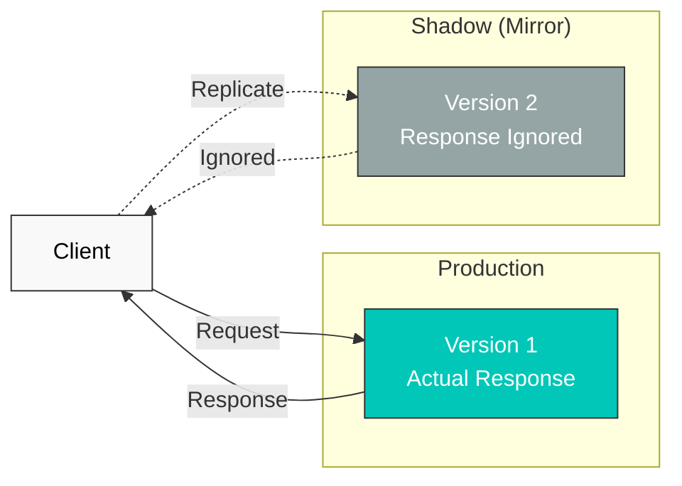

# Duplicación de tráfico

Traffic Mirroring (o Shadow Traffic) es una técnica que replica el tráfico de producción en tiempo real para probar nuevas versiones.

## Tabla de contenido

1. [Descripción general de Traffic Mirroring](#traffic-mirroring-overview)
2. [Configuración básica](#basic-configuration)
3. [Duplicación parcial](#partial-mirroring)
4. [Ejemplos prácticos](#practical-examples)
5. [Mejores prácticas](#best-practices)

## Descripción general de Traffic Mirroring



## Configuración básica

```yaml
apiVersion: networking.istio.io/v1
kind: VirtualService
metadata:
  name: reviews-mirror
spec:
  hosts:
  - reviews
  http:
  - route:
    - destination:
        host: reviews
        subset: v1
      weight: 100
    mirror:
      host: reviews
      subset: v2
    mirrorPercentage:
      value: 100  # 100% mirroring
```

## Duplicación parcial

```yaml
apiVersion: networking.istio.io/v1
kind: VirtualService
metadata:
  name: reviews-partial-mirror
spec:
  hosts:
  - reviews
  http:
  - route:
    - destination:
        host: reviews
        subset: v1
    mirror:
      host: reviews
      subset: v2
    mirrorPercentage:
      value: 10  # Mirror only 10%
```

## Referencias

- [Traffic Mirroring de Istio](https://istio.io/latest/docs/tasks/traffic-management/mirroring/)
