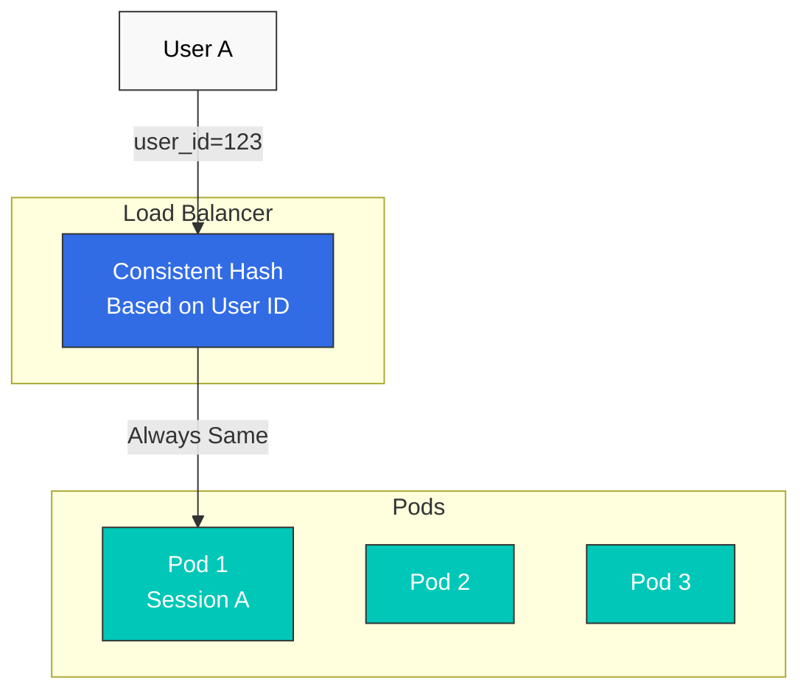

# Afinidad de sesión

La afinidad de sesión (o Sticky Session) es una técnica que enruta las solicitudes del mismo usuario al mismo Pod.

## Tabla de contenidos

1. [Descripción general de la afinidad de sesión](#session-affinity-overview)
2. [Basado en hash consistente](#consistent-hash-based)
3. [Basado en cookies](#cookie-based)
4. [Basado en encabezados](#header-based)
5. [Ejemplos prácticos](#practical-examples)

## Descripción general de la afinidad de sesión



## Basado en hash consistente

### Basado en encabezado HTTP

```yaml
apiVersion: networking.istio.io/v1
kind: DestinationRule
metadata:
  name: reviews-session-affinity
spec:
  host: reviews
  trafficPolicy:
    loadBalancer:
      consistentHash:
        httpHeaderName: "x-user-id"
```

### Basado en cookies

```yaml
apiVersion: networking.istio.io/v1
kind: DestinationRule
metadata:
  name: reviews-cookie-affinity
spec:
  host: reviews
  trafficPolicy:
    loadBalancer:
      consistentHash:
        httpCookie:
          name: "session-id"
          ttl: 0s  # Cookie expiration time (0s = session cookie)
```

### Basado en IP de origen

```yaml
apiVersion: networking.istio.io/v1
kind: DestinationRule
metadata:
  name: reviews-ip-affinity
spec:
  host: reviews
  trafficPolicy:
    loadBalancer:
      consistentHash:
        useSourceIp: true
```

## Referencias

- [Afinidad de sesión de Istio](https://istio.io/latest/docs/reference/config/networking/destination-rule/#LoadBalancerSettings-ConsistentHashLB)
