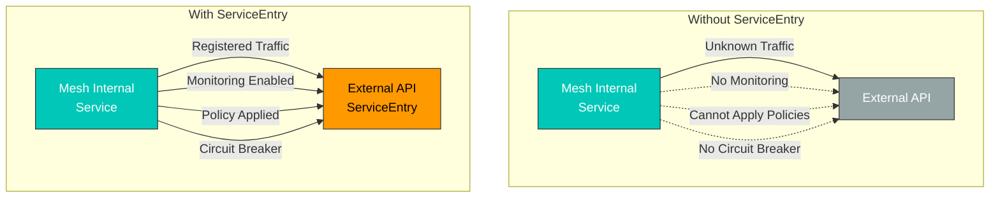
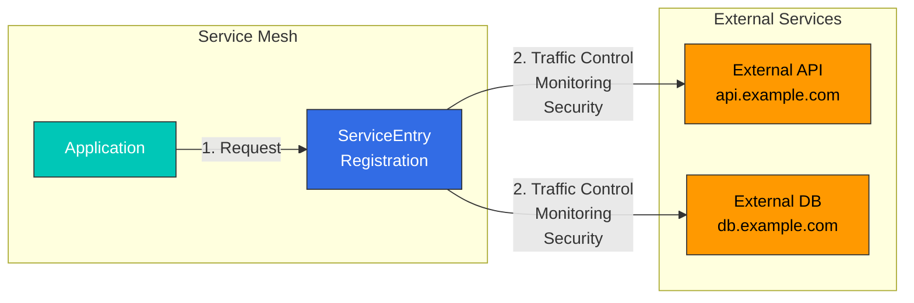

# ServiceEntry

ServiceEntry registra servicios externos en la malla de servicios de Istio, lo que permite gestionarlos como servicios internos.

## Tabla de contenidos

1. [¿Por qué ServiceEntry?](#why-serviceentry)
2. [Descripción general de ServiceEntry](#serviceentry-overview)
3. [Modos de resolución](#resolution-modes)
4. [Configuración de ubicación](#location-settings)
5. [Ejemplos prácticos](#practical-examples)
6. [Combinación con Egress Gateway](#combining-with-egress-gateway)
7. [Seguridad y TLS](#security-and-tls)
8. [Monitorización y control](#monitoring-and-control)
9. [Prácticas recomendadas](#best-practices)

## ¿Por qué ServiceEntry?

### La necesidad de gestionar servicios externos

De forma predeterminada, la malla de Istio no controla el tráfico hacia servicios externos. Con ServiceEntry:



### Beneficios principales

| Característica | Sin ServiceEntry | Con ServiceEntry |
|---------|---------------------|-------------------|
| **Monitorización** | Sin visibilidad | Recopilación completa de métricas |
| **Control de tráfico** | Imposible | Timeout, Retry, Circuit Breaker |
| **Seguridad** | Limitada | mTLS, gestión de certificados |
| **Control de Egress** | Se permite todo el tráfico externo | Permitir/bloquear explícitamente |
| **Descubrimiento de servicios** | Gestión manual | Búsqueda DNS automática |

## Descripción general de ServiceEntry

ServiceEntry agrega servicios externos al registro de servicios de Istio.



### Estructura básica

```yaml
apiVersion: networking.istio.io/v1
kind: ServiceEntry
metadata:
  name: external-api
spec:
  hosts:                  # External service hostname
  - api.example.com
  ports:                  # Port and protocol
  - number: 443
    name: https
    protocol: HTTPS
  location: MESH_EXTERNAL # External/internal location
  resolution: DNS         # Address resolution method
```

## Modos de resolución

ServiceEntry admite 4 modos de resolución de direcciones.

### 1. Resolución DNS

El modo más común, que resuelve direcciones IP dinámicamente mediante DNS.

```yaml
apiVersion: networking.istio.io/v1
kind: ServiceEntry
metadata:
  name: external-api-dns
spec:
  hosts:
  - api.example.com
  ports:
  - number: 443
    name: https
    protocol: HTTPS
  location: MESH_EXTERNAL
  resolution: DNS  # DNS lookup
```

**Casos de uso**:
- APIs públicas (AWS S3, Google Cloud Storage)
- Servicios SaaS (Stripe, SendGrid)
- Servicios administrados en la nube

### 2. Resolución STATIC

Especifica explícitamente direcciones IP fijas.

```yaml
apiVersion: networking.istio.io/v1
kind: ServiceEntry
metadata:
  name: external-api-static
spec:
  hosts:
  - legacy-api.company.internal
  addresses:
  - 10.10.10.10
  - 10.10.10.11
  ports:
  - number: 8080
    name: http
    protocol: HTTP
  location: MESH_EXTERNAL
  resolution: STATIC  # Fixed IP
  endpoints:
  - address: 10.10.10.10
  - address: 10.10.10.11
```

**Casos de uso**:
- Sistemas heredados (sin DNS)
- Requisitos de cumplimiento que exigen IP fijas
- Servicios de centros de datos internos

### 3. Resolución NONE

No realiza resolución de direcciones; usa tal cual la dirección proporcionada por el cliente.

```yaml
apiVersion: networking.istio.io/v1
kind: ServiceEntry
metadata:
  name: wildcard-api
spec:
  hosts:
  - "*.api.example.com"  # Wildcard
  ports:
  - number: 443
    name: https
    protocol: HTTPS
  location: MESH_EXTERNAL
  resolution: NONE  # No address resolution
```

**Casos de uso**:
- Dominios con comodines
- Balanceo de carga del lado del cliente
- Proxy TCP/TLS

### 4. Resolución DNS_ROUND_ROBIN (obsoleta)

Usa DNS round robin (ahora integrado en el modo DNS).

## Configuración de ubicación

### MESH_EXTERNAL (servicio externo)

Registra servicios fuera de la malla.

```yaml
apiVersion: networking.istio.io/v1
kind: ServiceEntry
metadata:
  name: external-service
spec:
  hosts:
  - external-api.com
  ports:
  - number: 443
    name: https
    protocol: HTTPS
  location: MESH_EXTERNAL  # External service
  resolution: DNS
```

**Características**:
- mTLS no se aplica
- Puede salir a través de Egress Gateway
- Se clasifica como tráfico externo

### MESH_INTERNAL (servicio interno)

Trata el servicio como interno de la malla (se usa rara vez).

```yaml
apiVersion: networking.istio.io/v1
kind: ServiceEntry
metadata:
  name: internal-vm-service
spec:
  hosts:
  - vm-service.internal
  ports:
  - number: 8080
    name: http
    protocol: HTTP
  location: MESH_INTERNAL  # Treat as internal service
  resolution: STATIC
  endpoints:
  - address: 10.0.0.5
    labels:
      app: vm-service
```

**Casos de uso**:
- Incluye cargas de trabajo de VM en la malla
- Entornos multiclúster
- Configuraciones de nube híbrida

## Ejemplos prácticos

### 1. Registro de una API REST externa

#### Escenario: API de pasarela de pagos

```yaml
apiVersion: networking.istio.io/v1
kind: ServiceEntry
metadata:
  name: payment-gateway-api
  namespace: production
spec:
  hosts:
  - api.payment-gateway.com
  ports:
  - number: 443
    name: https
    protocol: HTTPS
  location: MESH_EXTERNAL
  resolution: DNS
---
# VirtualService: Timeout and Retry settings
apiVersion: networking.istio.io/v1
kind: VirtualService
metadata:
  name: payment-gateway-routing
  namespace: production
spec:
  hosts:
  - api.payment-gateway.com
  http:
  - route:
    - destination:
        host: api.payment-gateway.com
    timeout: 10s
    retries:
      attempts: 3
      perTryTimeout: 3s
      retryOn: 5xx,reset,connect-failure
---
# DestinationRule: Circuit Breaker
apiVersion: networking.istio.io/v1
kind: DestinationRule
metadata:
  name: payment-gateway-circuit-breaker
  namespace: production
spec:
  host: api.payment-gateway.com
  trafficPolicy:
    connectionPool:
      http:
        http1MaxPendingRequests: 10
        maxRequestsPerConnection: 1
    outlierDetection:
      consecutiveErrors: 3
      interval: 30s
      baseEjectionTime: 120s
    tls:
      mode: SIMPLE  # TLS connection
```

### 2. Registro de una base de datos externa

#### Escenario: AWS RDS MySQL

```yaml
apiVersion: networking.istio.io/v1
kind: ServiceEntry
metadata:
  name: aws-rds-mysql
spec:
  hosts:
  - mydb.abc123.us-west-2.rds.amazonaws.com
  ports:
  - number: 3306
    name: tcp
    protocol: TCP
  location: MESH_EXTERNAL
  resolution: DNS
---
apiVersion: networking.istio.io/v1
kind: DestinationRule
metadata:
  name: aws-rds-mysql-circuit-breaker
spec:
  host: mydb.abc123.us-west-2.rds.amazonaws.com
  trafficPolicy:
    connectionPool:
      tcp:
        maxConnections: 100
        connectTimeout: 5s
    outlierDetection:
      consecutiveErrors: 5
      interval: 60s
      baseEjectionTime: 60s
```

### 3. Registro de un dominio con comodín

#### Escenario: acceso a un bucket de AWS S3

```yaml
apiVersion: networking.istio.io/v1
kind: ServiceEntry
metadata:
  name: aws-s3-buckets
spec:
  hosts:
  - "*.s3.amazonaws.com"
  - "*.s3.*.amazonaws.com"
  - "*.s3-*.amazonaws.com"
  ports:
  - number: 443
    name: https
    protocol: HTTPS
  location: MESH_EXTERNAL
  resolution: NONE  # Use NONE for wildcards
```

### 4. Servicio externo con varios endpoints

#### Escenario: API multirregión

```yaml
apiVersion: networking.istio.io/v1
kind: ServiceEntry
metadata:
  name: multi-region-api
spec:
  hosts:
  - api.global-service.com
  ports:
  - number: 443
    name: https
    protocol: HTTPS
  location: MESH_EXTERNAL
  resolution: DNS
---
apiVersion: networking.istio.io/v1
kind: VirtualService
metadata:
  name: multi-region-routing
spec:
  hosts:
  - api.global-service.com
  http:
  # Region-based routing
  - match:
    - headers:
        x-region:
          exact: "us-west"
    route:
    - destination:
        host: api.global-service.com
      headers:
        request:
          set:
            Host: us-west.api.global-service.com

  - match:
    - headers:
        x-region:
          exact: "eu-central"
    route:
    - destination:
        host: api.global-service.com
      headers:
        request:
          set:
            Host: eu-central.api.global-service.com

  # Default routing
  - route:
    - destination:
        host: api.global-service.com
```

### 5. Registro de un servicio TCP

#### Escenario: clúster Redis externo

```yaml
apiVersion: networking.istio.io/v1
kind: ServiceEntry
metadata:
  name: external-redis
spec:
  hosts:
  - redis.external-cluster.com
  addresses:
  - 203.0.113.10
  - 203.0.113.11
  ports:
  - number: 6379
    name: tcp
    protocol: TCP
  location: MESH_EXTERNAL
  resolution: STATIC
  endpoints:
  - address: 203.0.113.10
    labels:
      instance: primary
  - address: 203.0.113.11
    labels:
      instance: replica
---
apiVersion: networking.istio.io/v1
kind: DestinationRule
metadata:
  name: external-redis-lb
spec:
  host: redis.external-cluster.com
  trafficPolicy:
    loadBalancer:
      simple: ROUND_ROBIN
    connectionPool:
      tcp:
        maxConnections: 50
        connectTimeout: 3s
```

## Combinación con Egress Gateway

Controla centralizadamente el tráfico externo mediante Egress Gateway.

### Configuración básica de Egress Gateway

```yaml
# ServiceEntry: Register external service
apiVersion: networking.istio.io/v1
kind: ServiceEntry
metadata:
  name: external-api
spec:
  hosts:
  - api.example.com
  ports:
  - number: 443
    name: https
    protocol: HTTPS
  location: MESH_EXTERNAL
  resolution: DNS
---
# Gateway: Egress Gateway configuration
apiVersion: networking.istio.io/v1
kind: Gateway
metadata:
  name: egress-gateway
spec:
  selector:
    istio: egressgateway
  servers:
  - port:
      number: 443
      name: https
      protocol: HTTPS
    hosts:
    - api.example.com
    tls:
      mode: PASSTHROUGH
---
# VirtualService: Mesh internal -> Egress Gateway
apiVersion: networking.istio.io/v1
kind: VirtualService
metadata:
  name: direct-api-through-egress
spec:
  hosts:
  - api.example.com
  gateways:
  - mesh
  - egress-gateway
  http:
  - match:
    - gateways:
      - mesh
      port: 443
    route:
    - destination:
        host: istio-egressgateway.istio-system.svc.cluster.local
        port:
          number: 443
  - match:
    - gateways:
      - egress-gateway
      port: 443
    route:
    - destination:
        host: api.example.com
        port:
          number: 443
```

### Originación TLS (HTTP interno, HTTPS externo)

```yaml
apiVersion: networking.istio.io/v1
kind: ServiceEntry
metadata:
  name: external-http-to-https
spec:
  hosts:
  - api.secure-service.com
  ports:
  - number: 80
    name: http
    protocol: HTTP
  - number: 443
    name: https
    protocol: HTTPS
  location: MESH_EXTERNAL
  resolution: DNS
---
apiVersion: networking.istio.io/v1
kind: DestinationRule
metadata:
  name: originate-tls
spec:
  host: api.secure-service.com
  trafficPolicy:
    portLevelSettings:
    - port:
        number: 80
      tls:
        mode: SIMPLE  # HTTP -> HTTPS conversion
```

## Seguridad y TLS

### mTLS para un servicio externo

```yaml
apiVersion: networking.istio.io/v1
kind: ServiceEntry
metadata:
  name: mtls-external-service
spec:
  hosts:
  - mtls-api.example.com
  ports:
  - number: 443
    name: https
    protocol: HTTPS
  location: MESH_EXTERNAL
  resolution: DNS
---
apiVersion: networking.istio.io/v1
kind: DestinationRule
metadata:
  name: mtls-external-tls
spec:
  host: mtls-api.example.com
  trafficPolicy:
    tls:
      mode: MUTUAL
      clientCertificate: /etc/certs/client-cert.pem
      privateKey: /etc/certs/client-key.pem
      caCertificates: /etc/certs/ca-cert.pem
```

### Enrutamiento SNI

```yaml
apiVersion: networking.istio.io/v1
kind: Gateway
metadata:
  name: egress-sni-gateway
spec:
  selector:
    istio: egressgateway
  servers:
  - port:
      number: 443
      name: tls
      protocol: TLS
    hosts:
    - api.example.com
    - api2.example.com
    tls:
      mode: PASSTHROUGH
---
apiVersion: networking.istio.io/v1
kind: VirtualService
metadata:
  name: sni-routing
spec:
  hosts:
  - api.example.com
  - api2.example.com
  gateways:
  - mesh
  - egress-sni-gateway
  tls:
  - match:
    - gateways:
      - mesh
      port: 443
      sniHosts:
      - api.example.com
    route:
    - destination:
        host: istio-egressgateway.istio-system.svc.cluster.local
        port:
          number: 443
  - match:
    - gateways:
      - egress-sni-gateway
      port: 443
      sniHosts:
      - api.example.com
    route:
    - destination:
        host: api.example.com
        port:
          number: 443
```

## Monitorización y control

### Recopilación de métricas

```bash
# Check ServiceEntry traffic
kubectl exec -it <pod-name> -c istio-proxy -- \
  curl localhost:15000/stats/prometheus | grep "api.example.com"

# Egress traffic metrics
istio_requests_total{destination_service_name="api.example.com"}
```

### Consultas de Prometheus

```yaml
# External service request count
sum(rate(istio_requests_total{destination_service_namespace="",destination_service_name="api.example.com"}[5m]))

# External service error rate
sum(rate(istio_requests_total{destination_service_name="api.example.com",response_code=~"5.."}[5m])) /
sum(rate(istio_requests_total{destination_service_name="api.example.com"}[5m]))

# External service response time
histogram_quantile(0.95,
  sum(rate(istio_request_duration_milliseconds_bucket{destination_service_name="api.example.com"}[5m])) by (le)
)
```

### Bloqueo de tráfico Egress

```yaml
# Block all Egress by default
apiVersion: networking.istio.io/v1
kind: Sidecar
metadata:
  name: default
  namespace: default
spec:
  egress:
  - hosts:
    - "./*"  # Allow only same namespace
    - "istio-system/*"  # Allow istio-system
  outboundTrafficPolicy:
    mode: REGISTRY_ONLY  # Allow only those registered in ServiceEntry
```

## Prácticas recomendadas

### 1. Registro explícito de ServiceEntry

```yaml
# Good example: Explicit registration
apiVersion: networking.istio.io/v1
kind: ServiceEntry
metadata:
  name: payment-api
  namespace: production
  annotations:
    description: "Payment gateway API"
    owner: "payments-team"
    sla: "99.9%"
spec:
  hosts:
  - api.payment.com
  ports:
  - number: 443
    name: https
    protocol: HTTPS
  location: MESH_EXTERNAL
  resolution: DNS
```

### 2. Aplica siempre Circuit Breaker

```yaml
# Always apply Circuit Breaker for external services
apiVersion: networking.istio.io/v1
kind: DestinationRule
metadata:
  name: external-api-protection
spec:
  host: api.example.com
  trafficPolicy:
    connectionPool:
      http:
        http1MaxPendingRequests: 10
        maxRequestsPerConnection: 1
    outlierDetection:
      consecutiveErrors: 3
      interval: 30s
      baseEjectionTime: 120s
```

### 3. Configuración de Timeout

```yaml
# Set explicit Timeout for external services
apiVersion: networking.istio.io/v1
kind: VirtualService
metadata:
  name: external-api-timeout
spec:
  hosts:
  - api.example.com
  http:
  - route:
    - destination:
        host: api.example.com
    timeout: 10s  # Explicit Timeout
    retries:
      attempts: 2
      perTryTimeout: 5s
```

### 4. Usa Egress Gateway (producción)

```yaml
# Control external traffic through Egress Gateway in production
# - Centralized monitoring
# - Easy IP whitelist management
# - Consistent security policies
```

### 5. Aislamiento de Namespace

```yaml
# Isolate ServiceEntry by namespace
apiVersion: networking.istio.io/v1
kind: Sidecar
metadata:
  name: default
  namespace: team-a
spec:
  egress:
  - hosts:
    - "team-a/*"  # Only own namespace
    - "istio-system/*"
    - "external/*"  # Shared external services
  outboundTrafficPolicy:
    mode: REGISTRY_ONLY
```

### 6. Plantilla de documentación

```yaml
apiVersion: networking.istio.io/v1
kind: ServiceEntry
metadata:
  name: external-service
  annotations:
    # Service information
    service-description: "Third-party payment API"
    service-owner: "payments-team@company.com"
    service-documentation: "https://wiki.company.com/payment-api"

    # SLA information
    sla-availability: "99.9%"
    sla-latency-p95: "500ms"
    rate-limit: "1000 req/min"

    # Cost information
    cost-per-request: "$0.01"
    monthly-budget: "$10000"

    # Incident response
    oncall: "payments-oncall"
    escalation: "CTO"
    fallback-strategy: "Use cached data"
```

## Referencias

- [ServiceEntry de Istio](https://istio.io/latest/docs/reference/config/networking/service-entry/)
- [Tráfico Egress de Istio](https://istio.io/latest/docs/tasks/traffic-management/egress/)
- [Originación TLS de Istio](https://istio.io/latest/docs/tasks/traffic-management/egress/egress-tls-origination/)
- [Servicios externos de Envoy](https://www.envoyproxy.io/docs/envoy/latest/intro/arch_overview/upstream/service_discovery)
