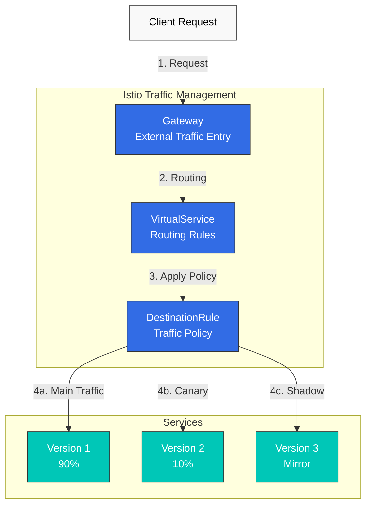
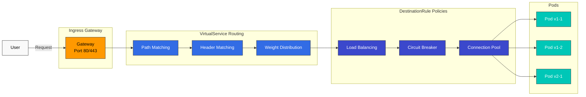

# Gestión del tráfico

Las capacidades de gestión del tráfico de Istio permiten un control detallado del flujo de tráfico dentro de la malla de servicios.

## Índice

1. [Gateway y VirtualService](01-gateway-virtualservice.md)
2. [Enrutamiento](02-routing.md)
3. [DestinationRule](03-destination-rule.md) ⭐ Concepto esencial
4. [División del tráfico](04-traffic-splitting.md)
5. [Reintentos y tiempo de espera](05-retry-timeout.md)
6. [Balanceo de carga](06-load-balancing.md)
7. [Circuit Breaker](07-circuit-breaker.md)
8. [Inyección de fallos](08-fault-injection.md)
9. [Duplicación del tráfico](09-traffic-mirror.md)
10. [Afinidad de sesión](10-session-affinity.md)
11. [Control de salida](11-egress-control.md)
12. [ServiceEntry (Gestión de servicios externos)](12-service-entry.md)

## Descripción general

La gestión del tráfico es una de las funciones principales de Istio y permite realizar las siguientes operaciones sin cambios en el código:

### Funciones principales



### 1. Enrutamiento inteligente

- **Basado en rutas**: `/api/v1` → Service A, `/api/v2` → Service B
- **Basado en encabezados**: `User-Agent: Mobile` → Versión móvil
- **Basado en cookies**: Enrutar usuarios específicos a versiones específicas
- **Basado en ponderación**: Distribuir el tráfico por proporción

### 2. Estrategias de Deployment

**Canary Deployment**:
```yaml
# Only 10% to new version
route:
- destination:
    host: reviews
    subset: v1
  weight: 90
- destination:
    host: reviews
    subset: v2
  weight: 10
```

**Blue/Green Deployment**:
```yaml
# Instant switch
route:
- destination:
    host: reviews
    subset: v2  # Switch to Green
  weight: 100
```

### 3. Patrones de resiliencia

- **Circuit Breaker**: Aislar servicios con fallos
- **Retry**: Reintentos automáticos
- **Timeout**: Límites de tiempo de respuesta
- **Rate Limiting**: Control de la tasa de solicitudes

### 4. Pruebas y depuración

- **Traffic Mirroring**: Replicar el tráfico de producción para pruebas
- **Fault Injection**: Inyección intencional de fallos
- **A/B Testing**: Ofrecer diferentes versiones a distintos grupos de usuarios

## Recursos principales

### Gateway

Define el punto de entrada para el tráfico externo hacia la malla.

```yaml
apiVersion: networking.istio.io/v1
kind: Gateway
metadata:
  name: my-gateway
spec:
  selector:
    istio: ingressgateway
  servers:
  - port:
      number: 80
      name: http
      protocol: HTTP
    hosts:
    - "myapp.example.com"
```

### VirtualService

Define cómo enrutar las solicitudes.

```yaml
apiVersion: networking.istio.io/v1
kind: VirtualService
metadata:
  name: reviews
spec:
  hosts:
  - reviews
  http:
  - match:
    - uri:
        prefix: "/v2"
    route:
    - destination:
        host: reviews
        subset: v2
  - route:
    - destination:
        host: reviews
        subset: v1
```

### DestinationRule

Define las políticas para el Service de destino.

```yaml
apiVersion: networking.istio.io/v1
kind: DestinationRule
metadata:
  name: reviews
spec:
  host: reviews
  trafficPolicy:
    loadBalancer:
      simple: LEAST_REQUEST
  subsets:
  - name: v1
    labels:
      version: v1
  - name: v2
    labels:
      version: v2
```

## Ejemplos prácticos

### Canary Deployment seguro

```yaml
# Step 1: Start with 5% traffic
apiVersion: networking.istio.io/v1
kind: VirtualService
metadata:
  name: reviews-canary
spec:
  hosts:
  - reviews
  http:
  - route:
    - destination:
        host: reviews
        subset: v1
      weight: 95
    - destination:
        host: reviews
        subset: v2
      weight: 5
```

Después de monitorear, aumente gradualmente si no hay problemas:
- 5% → 10% → 25% → 50% → 100%

### Enrutamiento basado en encabezados (pruebas de desarrolladores)

```yaml
apiVersion: networking.istio.io/v1
kind: VirtualService
metadata:
  name: reviews-dev
spec:
  hosts:
  - reviews
  http:
  # Developers use new version
  - match:
    - headers:
        x-dev-user:
          exact: "true"
    route:
    - destination:
        host: reviews
        subset: v2
  # Regular users use stable version
  - route:
    - destination:
        host: reviews
        subset: v1
```

### Circuit Breaker + Retry

```yaml
apiVersion: networking.istio.io/v1
kind: DestinationRule
metadata:
  name: reviews-resilient
spec:
  host: reviews
  trafficPolicy:
    # Connection Pool settings
    connectionPool:
      tcp:
        maxConnections: 100
      http:
        http1MaxPendingRequests: 50
        maxRequestsPerConnection: 2
    # Circuit Breaker
    outlierDetection:
      consecutiveErrors: 5
      interval: 30s
      baseEjectionTime: 30s
---
apiVersion: networking.istio.io/v1
kind: VirtualService
metadata:
  name: reviews-retry
spec:
  hosts:
  - reviews
  http:
  - route:
    - destination:
        host: reviews
    retries:
      attempts: 3
      perTryTimeout: 2s
      retryOn: 5xx,reset,connect-failure
    timeout: 10s
```

## Flujo de tráfico



## Ruta de aprendizaje

Para aprender eficazmente la gestión del tráfico, se recomienda el siguiente orden:

1. **[Gateway y VirtualService](01-gateway-virtualservice.md)** ⭐ Punto de partida
   - Comprender los conceptos básicos
   - Manejo del tráfico externo

2. **[Enrutamiento](02-routing.md)**
   - Patrones de enrutamiento avanzados
   - Enrutamiento condicional

3. **[DestinationRule](03-destination-rule.md)** ⭐ Concepto esencial
   - Comprender el concepto de Subset
   - Fundamentos de Traffic Policy
   - Integración con VirtualService

4. **[División del tráfico](04-traffic-splitting.md)**
   - Canary Deployment
   - Pruebas A/B

5. **[Reintentos y tiempo de espera](05-retry-timeout.md)**
   - Recuperación ante fallos
   - Control del tiempo de respuesta

6. **[Balanceo de carga](06-load-balancing.md)**
   - Diversos algoritmos
   - Optimización del rendimiento

7. **[Circuit Breaker](07-circuit-breaker.md)**
   - Aislamiento de fallos
   - Prevención de fallos en cascada

8. **[Inyección de fallos](08-fault-injection.md)**
   - Pruebas de fallos
   - Chaos Engineering

9. **[Duplicación del tráfico](09-traffic-mirror.md)**
   - Pruebas de producción
   - Validación de nuevas versiones

10. **[Afinidad de sesión](10-session-affinity.md)**
    - Sticky Session
    - Conservación del estado

11. **[Control de salida](11-egress-control.md)**
    - Acceso a servicios externos
    - Fortalecimiento de la seguridad

12. **[ServiceEntry](12-service-entry.md)**
    - Registro de servicios externos
    - Integración con Egress Gateway

## Prácticas recomendadas

### 1. Implementación gradual

```yaml
# ❌ Bad example: 100% at once
weight: 100

# ✅ Good example: Gradual increase
# 5% → Monitor → 10% → Monitor → ...
```

### 2. Configure siempre Timeout

```yaml
# ✅ Always set timeout
http:
- route:
  - destination:
      host: reviews
  timeout: 10s
```

### 3. Use Retry con cuidado

```yaml
# ✅ Only when idempotency is guaranteed
retries:
  attempts: 3
  perTryTimeout: 2s
  retryOn: 5xx,reset,connect-failure
```

### 4. Ajuste los umbrales de Circuit Breaker

```yaml
# ✅ Adjust according to service characteristics
outlierDetection:
  consecutiveErrors: 5      # Adjust per service
  interval: 30s
  baseEjectionTime: 30s
  maxEjectionPercent: 50    # Maximum 50% ejection
```

### 5. Monitoree las métricas

Monitoree siempre al modificar la gestión del tráfico:
- **Tasa de solicitudes**: Cambio en el número de solicitudes
- **Tasa de errores**: Proporción de errores
- **Latencia**: Latencia P50, P95, P99
- **Tasa de éxito**: Proporción de éxitos

## Solución de problemas

### El tráfico no se está enrutando

```bash
# 1. Check VirtualService
kubectl get virtualservice -n <namespace>
kubectl describe virtualservice <name> -n <namespace>

# 2. Check DestinationRule
kubectl get destinationrule -n <namespace>

# 3. Check pod labels
kubectl get pods --show-labels -n <namespace>

# 4. Analyze Istio configuration
istioctl analyze -n <namespace>
```

### La ponderación no se está aplicando

```bash
# Check Envoy configuration
istioctl proxy-config routes <pod-name> -n <namespace>

# Check cluster information
istioctl proxy-config clusters <pod-name> -n <namespace>
```

## Próximos pasos

1. **[Seguridad](../security/README.md)**: mTLS y autenticación/autorización
2. **[Observabilidad](../observability/README.md)**: Métricas, logs, traces
3. **[Resiliencia](../resilience/README.md)**: Rate Limiting, Zone Aware Routing

## Referencias

- [Gestión del tráfico de Istio](https://istio.io/latest/docs/concepts/traffic-management/)
- [Referencia de VirtualService](https://istio.io/latest/docs/reference/config/networking/virtual-service/)
- [Referencia de DestinationRule](https://istio.io/latest/docs/reference/config/networking/destination-rule/)
- [Referencia de Gateway](https://istio.io/latest/docs/reference/config/networking/gateway/)

## Cuestionario

Para comprobar lo aprendido en este capítulo, pruebe el [Cuestionario de gestión del tráfico de Istio](../../../quizzes/service-mesh/istio/traffic-management.md).
