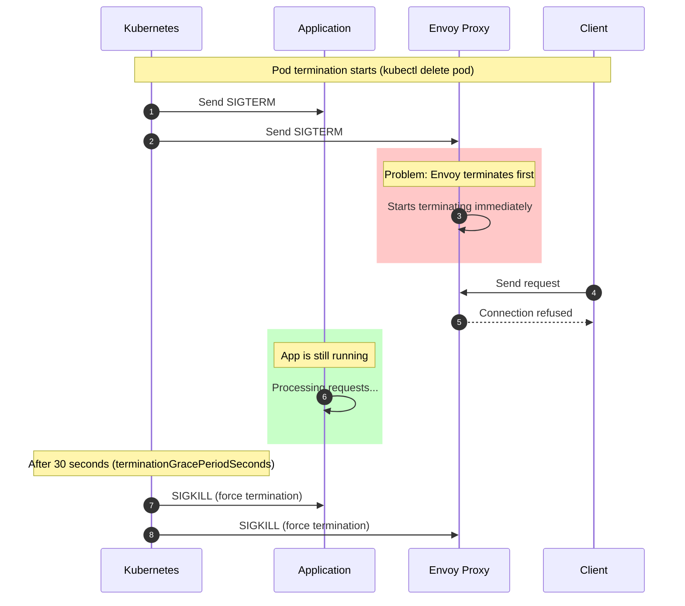
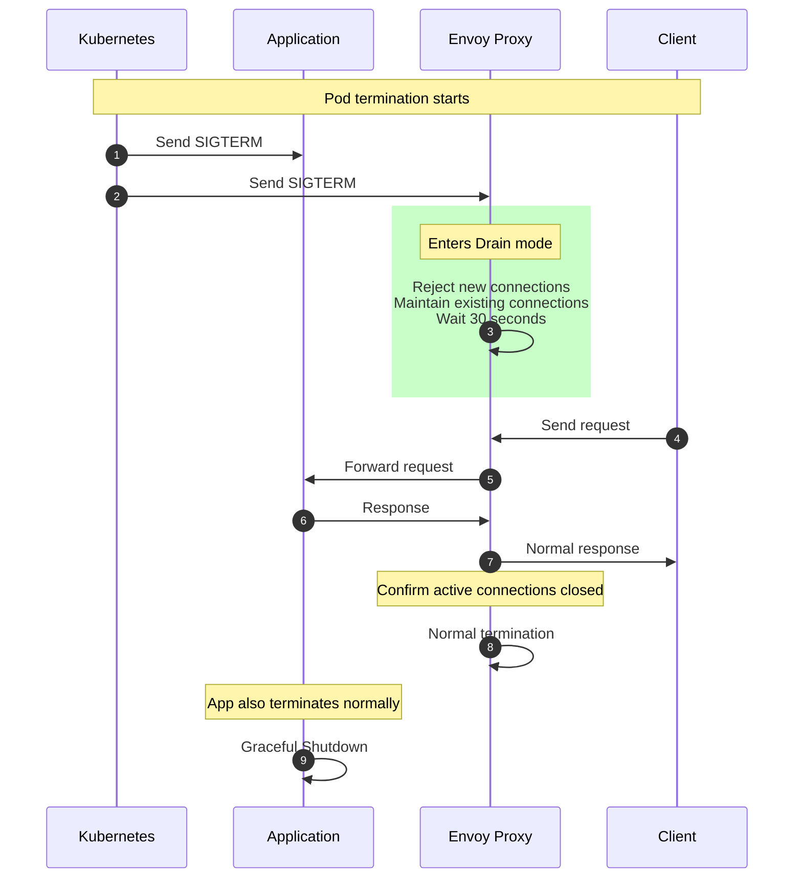
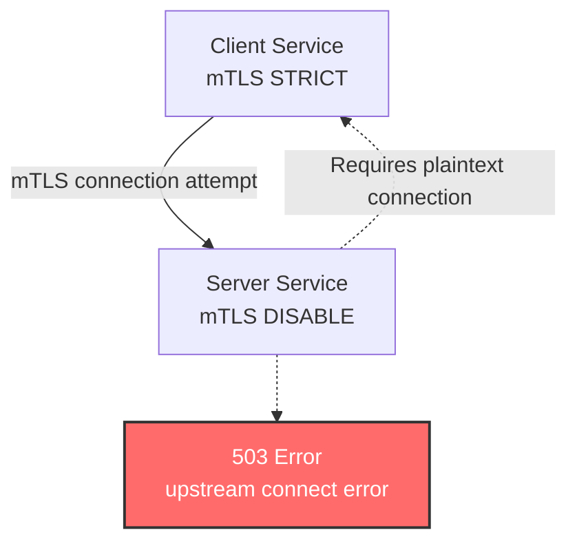

# Errores comunes de Istio y soluciones

> **Versión compatible**: Istio 1.28
> **Última actualización**: February 19, 2026

Este documento resume los errores más comunes encontrados al usar Istio y sus soluciones.

## Tabla de contenido

1. [Connection Errors During Pod Termination](#connection-errors-during-pod-termination)
2. [Sidecar Injection Issues](#sidecar-injection-issues)
3. [mTLS Connection Failure](#mtls-connection-failure)
4. [VirtualService Routing Failure](#virtualservice-routing-failure)
5. [Gateway Configuration Issues](#gateway-configuration-issues)
6. [Memory and Performance Issues](#memory-and-performance-issues)
7. [Certificate Expiration](#certificate-expiration)
8. [DNS Resolution Failure](#dns-resolution-failure)
9. [Envoy Initialization Timeout](#envoy-initialization-timeout)
10. [Debugging Tools](#debugging-tools)

## Errores de conexión durante la terminación de un Pod

### Descripción del problema

Cuando un Pod termina, el Sidecar de Envoy termina antes que la aplicación, lo que provoca errores de conexión.

**Síntomas**:
```
Connection reset by peer
Broken pipe
EOF
HTTP 503 Service Unavailable
```

### Causa raíz



**Causas raíz**:
1. Envoy y la aplicación reciben SIGTERM simultáneamente
2. Envoy termina más rápido que la aplicación
3. La aplicación sigue procesando solicitudes, pero Envoy ya ha terminado, lo que provoca un fallo de conexión

### Soluciones

#### Método 1: Configurar el Hook preStop de Envoy Proxy (recomendado)

Configure un Hook preStop para el contenedor Istio Proxy a fin de esperar hasta que se cierren todas las conexiones activas.

```yaml
apiVersion: apps/v1
kind: Deployment
metadata:
  name: myapp
spec:
  template:
    metadata:
      annotations:
        # Envoy waits for active connections to close
        proxy.istio.io/config: |
          terminationDrainDuration: 30s
    spec:
      terminationGracePeriodSeconds: 60
      containers:
      - name: myapp
        image: myapp:latest
        ports:
        - containerPort: 8080
```

**Cómo funciona**:


#### Método 2: Controlar el comportamiento de terminación de Envoy con una anotación de Pod

Puede ajustar con precisión el comportamiento de terminación de Envoy para cada Pod.

```yaml
apiVersion: apps/v1
kind: Deployment
metadata:
  name: myapp
spec:
  template:
    metadata:
      annotations:
        # Envoy waits for application startup
        proxy.istio.io/config: |
          holdApplicationUntilProxyStarts: true
          terminationDrainDuration: 30s
        # Envoy termination timeout
        sidecar.istio.io/terminationGracePeriodSeconds: "60"
    spec:
      terminationGracePeriodSeconds: 60
      containers:
      - name: myapp
        image: myapp:latest
```

**Explicación de la configuración**:
- `holdApplicationUntilProxyStarts: true`: Envoy se inicia antes que la aplicación
- `terminationDrainDuration: 30s`: Envoy drena durante 30 segundos al terminar
- `terminationGracePeriodSeconds: 60`: Período total de gracia para la terminación del Pod

#### Método 3: Configuración global (IstioOperator)

Aplique una política de terminación coherente en todo el clúster.

```yaml
apiVersion: install.istio.io/v1alpha1
kind: IstioOperator
metadata:
  name: istio-controlplane
spec:
  meshConfig:
    defaultConfig:
      terminationDrainDuration: 30s
      holdApplicationUntilProxyStarts: true
  values:
    global:
      proxy:
        lifecycle:
          preStop:
            exec:
              command:
              - /bin/sh
              - -c
              - |
                # Start Envoy drain
                curl -X POST http://localhost:15000/drain_listeners?graceful
                # Wait for active connections
                while [ $(netstat -plunt | grep tcp | grep -v TIME_WAIT | wc -l | xargs) -ne 0 ]; do
                  sleep 1;
                done
```

**Configuración recomendada**:
- `terminationDrainDuration`: 30 segundos (tiempo de drenaje de conexiones activas)
- `terminationGracePeriodSeconds`: 60 segundos (período de gracia antes de SIGKILL)
- Envoy comprueba las conexiones activas y realiza un apagado ordenado

### Método de verificación

```bash
# 1. Check logs during pod termination
kubectl logs -f <pod-name> -c istio-proxy --previous

# 2. Check connection status during termination
kubectl exec <pod-name> -c istio-proxy -- netstat -an | grep ESTABLISHED

# 3. Check termination events
kubectl get events --field-selector involvedObject.name=<pod-name>
```

### Prácticas recomendadas

```yaml
# Recommended configuration template
apiVersion: apps/v1
kind: Deployment
metadata:
  name: myapp
spec:
  template:
    metadata:
      annotations:
        # Envoy termination behavior control
        proxy.istio.io/config: |
          holdApplicationUntilProxyStarts: true
          terminationDrainDuration: 30s
    spec:
      terminationGracePeriodSeconds: 60
      containers:
      - name: myapp
        image: myapp:latest
        ports:
        - containerPort: 8080
        readinessProbe:
          httpGet:
            path: /health
            port: 8080
          periodSeconds: 5
          successThreshold: 1
          failureThreshold: 3
        # Optional: application graceful shutdown
        lifecycle:
          preStop:
            exec:
              command:
              - /bin/sh
              - -c
              - |
                # Disable readiness (optional)
                touch /tmp/not-ready
                # Wait for application requests to complete
                sleep 5
```

**Lista de comprobación**:
- **Configure terminationDrainDuration de Envoy** (¡lo más importante!)
- **holdApplicationUntilProxyStarts: true** (garantiza el orden de inicio)
- **Configure terminationGracePeriodSeconds con un valor suficiente** (mínimo 60 segundos)
- Configure ReadinessProbe (transición rápida a no saludable durante la terminación)
- Implemente el apagado ordenado de la aplicación (opcional)
- Configure la monitorización y el registro

**Puntos clave**:
- **¡No agregue sleep al contenedor de la aplicación!**
- **Configure Envoy para realizar un apagado ordenado en modo de drenaje.**

## Problemas de inyección de Sidecar

### Problema 1: Sidecar no inyectado

**Síntomas**:
```bash
kubectl get pod <pod-name> -o jsonpath='{.spec.containers[*].name}'
# Output: myapp (no istio-proxy)
```

**Causas y soluciones**:

#### 1. Falta la etiqueta de Namespace

```bash
# Check
kubectl get namespace <namespace> --show-labels

# Solution
kubectl label namespace <namespace> istio-injection=enabled
```

#### 2. Inyección deshabilitada mediante una anotación de Pod

```yaml
# Incorrect configuration
apiVersion: v1
kind: Pod
metadata:
  annotations:
    sidecar.istio.io/inject: "false"  # <- Injection disabled
```

**Solución**:
```yaml
# Correct configuration
apiVersion: v1
kind: Pod
metadata:
  annotations:
    sidecar.istio.io/inject: "true"
```

#### 3. Verificar el funcionamiento de Istio Sidecar Injector

```bash
# Check sidecar injector webhook
kubectl get mutatingwebhookconfigurations

# Check Istio injector logs
kubectl logs -n istio-system -l app=sidecar-injector
```

### Problema 2: Falta de recursos de Sidecar

**Síntomas**:
```
OOMKilled
CrashLoopBackOff
Error: container has runAsNonRoot and image has non-numeric user
```

**Solución**:

```yaml
apiVersion: v1
kind: Pod
metadata:
  annotations:
    sidecar.istio.io/proxyCPU: "200m"
    sidecar.istio.io/proxyMemory: "256Mi"
    sidecar.istio.io/proxyCPULimit: "1000m"
    sidecar.istio.io/proxyMemoryLimit: "512Mi"
spec:
  containers:
  - name: myapp
    image: myapp:latest
```

## Fallo de conexión mTLS

### Descripción del problema

**Síntomas**:
```
upstream connect error or disconnect/reset before headers
503 Service Unavailable
SSL routines:OPENSSL_internal:WRONG_VERSION_NUMBER
```

### Causa 1: Incompatibilidad en el modo PeerAuthentication



**Solución**:

```yaml
# Apply consistent mTLS policy across namespace
apiVersion: security.istio.io/v1
kind: PeerAuthentication
metadata:
  name: default
  namespace: istio-system
spec:
  mtls:
    mode: STRICT  # All services STRICT mode
```

### Causa 2: Conflicto entre DestinationRule y PeerAuthentication

```yaml
# Incorrect example
---
apiVersion: security.istio.io/v1
kind: PeerAuthentication
metadata:
  name: default
spec:
  mtls:
    mode: STRICT
---
apiVersion: networking.istio.io/v1
kind: DestinationRule
metadata:
  name: myapp
spec:
  host: myapp
  trafficPolicy:
    tls:
      mode: DISABLE  # <- Conflict!
```

**Solución**:
```yaml
# Correct example
apiVersion: networking.istio.io/v1
kind: DestinationRule
metadata:
  name: myapp
spec:
  host: myapp
  trafficPolicy:
    tls:
      mode: ISTIO_MUTUAL  # Matches PeerAuthentication
```

### Comandos de depuración

```bash
# 1. Check mTLS status
istioctl x describe pod <pod-name> -n <namespace>

# 2. Check PeerAuthentication policies
kubectl get peerauthentication -A

# 3. Check DestinationRule TLS settings
kubectl get destinationrule -A -o yaml | grep -A 5 "tls:"

# 4. Check Envoy cluster TLS settings
istioctl proxy-config clusters <pod-name> -n <namespace> --fqdn <service-name>
```

## Fallo de enrutamiento de VirtualService

### Problema 1: El tráfico no se enruta

**Síntomas**:
```
404 Not Found
default backend - 404
```

**Causas y soluciones**:

#### Coincidencia de Host incorrecta

```yaml
# Incorrect example
apiVersion: networking.istio.io/v1
kind: VirtualService
metadata:
  name: myapp
spec:
  hosts:
  - myapp.example.com  # <- DNS name
  http:
  - route:
    - destination:
        host: myapp  # <- Kubernetes Service name
```

**Solución**:
```yaml
# Correct example
apiVersion: networking.istio.io/v1
kind: VirtualService
metadata:
  name: myapp
  namespace: default
spec:
  hosts:
  - myapp  # Exactly matches Kubernetes Service name
  - myapp.default.svc.cluster.local  # Also add FQDN
  http:
  - route:
    - destination:
        host: myapp
```

### Problema 2: Subset no encontrado

**Síntomas**:
```
no healthy upstream
subset not found
```

**Causa**:
```yaml
# VirtualService exists but DestinationRule is missing
apiVersion: networking.istio.io/v1
kind: VirtualService
metadata:
  name: myapp
spec:
  http:
  - route:
    - destination:
        host: myapp
        subset: v1  # <- Subset not defined
```

**Solución**:
```yaml
# Add DestinationRule
apiVersion: networking.istio.io/v1
kind: DestinationRule
metadata:
  name: myapp
spec:
  host: myapp
  subsets:
  - name: v1
    labels:
      version: v1
  - name: v2
    labels:
      version: v2
```

### Depuración

```bash
# 1. Validate VirtualService
istioctl analyze -n <namespace>

# 2. Check routing rules
istioctl proxy-config routes <pod-name> -n <namespace>

# 3. Check VirtualService status
kubectl get virtualservice <name> -n <namespace> -o yaml
```

## Problemas de configuración de Gateway

### Problema 1: El tráfico no llega al Gateway

**Síntomas**:
```bash
curl: (7) Failed to connect to example.com port 443: Connection refused
```

**Causas y soluciones**:

#### 1. Comprobar el Service de Gateway

```bash
# Check Gateway Service status
kubectl get svc -n istio-system istio-ingressgateway

# Check External IP
kubectl get svc -n istio-system istio-ingressgateway -o jsonpath='{.status.loadBalancer.ingress[0].hostname}'
```

#### 2. Verificar la conexión entre Gateway y VirtualService

```yaml
# Incorrect example
---
apiVersion: networking.istio.io/v1
kind: Gateway
metadata:
  name: myapp-gateway
spec:
  selector:
    istio: ingressgateway
  servers:
  - port:
      number: 80
      name: http
      protocol: HTTP
    hosts:
    - "example.com"
---
apiVersion: networking.istio.io/v1
kind: VirtualService
metadata:
  name: myapp
spec:
  hosts:
  - "example.com"
  gateways:
  - my-gateway  # <- Gateway name typo!
```

**Solución**:
```yaml
# Correct example
apiVersion: networking.istio.io/v1
kind: VirtualService
metadata:
  name: myapp
spec:
  hosts:
  - "example.com"
  gateways:
  - myapp-gateway  # Exactly matches Gateway name
```

### Problema 2: Error de certificado HTTPS

**Síntomas**:
```
SSL certificate problem: self signed certificate
```

**Solución**:

```yaml
apiVersion: networking.istio.io/v1
kind: Gateway
metadata:
  name: myapp-gateway
spec:
  selector:
    istio: ingressgateway
  servers:
  - port:
      number: 443
      name: https
      protocol: HTTPS
    tls:
      mode: SIMPLE
      credentialName: myapp-tls-secret  # <- Specify exact Secret name
    hosts:
    - "example.com"
```

```bash
# Create TLS Secret
kubectl create secret tls myapp-tls-secret \
  --cert=path/to/cert.pem \
  --key=path/to/key.pem \
  -n istio-system
```

## Problemas de memoria y rendimiento

### Problema 1: Aumento del uso de memoria de Envoy

**Síntomas**:
```
OOMKilled
Memory usage > 1GB per pod
```

**Causas**:
- Se crean demasiados listeners/clusters
- ConfigMap/Secret grandes
- Fuga de memoria

**Solución**:

```yaml
# Limit scope with Sidecar resource
apiVersion: networking.istio.io/v1
kind: Sidecar
metadata:
  name: default
  namespace: default
spec:
  egress:
  - hosts:
    - "./*"  # Same namespace only
    - "istio-system/*"  # istio-system only
```

```yaml
# Envoy resource limits
apiVersion: v1
kind: Pod
metadata:
  annotations:
    sidecar.istio.io/proxyMemory: "512Mi"
    sidecar.istio.io/proxyMemoryLimit: "1Gi"
```

### Problema 2: Latencia alta

**Síntomas**:
- Latencia P99 > 1 segundo
- Errores de timeout frecuentes

**Solución**:

```yaml
# Set timeout in VirtualService
apiVersion: networking.istio.io/v1
kind: VirtualService
metadata:
  name: myapp
spec:
  http:
  - route:
    - destination:
        host: myapp
    timeout: 5s  # Total request timeout
    retries:
      attempts: 3
      perTryTimeout: 2s  # Timeout per retry
```

## Expiración de certificados

### Descripción del problema

**Síntomas**:
```
x509: certificate has expired
SSL handshake failed
```

**Causas**:
- El certificado de Istio CA expiró (valor predeterminado: 10 años)
- El certificado de Workload expiró (valor predeterminado: 24 horas, renovación automática)

**Solución**:

```bash
# 1. Check CA certificate
kubectl get secret istio-ca-secret -n istio-system -o jsonpath='{.data.ca-cert\.pem}' | base64 -d | openssl x509 -noout -dates

# 2. Check workload certificates
istioctl proxy-config secret <pod-name> -n <namespace>

# 3. Regenerate CA certificate
istioctl x ca root
```

## Fallo de resolución de DNS

### Descripción del problema

**Síntomas**:
```
no such host
DNS resolution failed
```

**Solución**:

```yaml
# Register external service with ServiceEntry
apiVersion: networking.istio.io/v1
kind: ServiceEntry
metadata:
  name: external-api
spec:
  hosts:
  - api.example.com
  ports:
  - number: 443
    name: https
    protocol: HTTPS
  location: MESH_EXTERNAL
  resolution: DNS
```

## Timeout de inicialización de Envoy

### Descripción del problema

**Síntomas**:
```
waiting for Envoy proxy to be ready
Readiness probe failed
```

**Solución**:

```yaml
apiVersion: v1
kind: Pod
metadata:
  annotations:
    proxy.istio.io/config: |
      holdApplicationUntilProxyStarts: true
spec:
  containers:
  - name: myapp
    image: myapp:latest
    readinessProbe:
      initialDelaySeconds: 10  # Wait for Envoy initialization
```

## Herramientas de depuración

### Comandos de istioctl

```bash
# 1. Analyze pod status
istioctl x describe pod <pod-name> -n <namespace>

# 2. Validate configuration
istioctl analyze -A

# 3. Check Envoy configuration
istioctl proxy-config all <pod-name> -n <namespace>

# 4. Change Envoy log level
istioctl proxy-config log <pod-name> --level debug

# 5. Generate bug report
istioctl bug-report
```

### API de administración de Envoy

```bash
# Port-forward to Envoy admin port
kubectl port-forward <pod-name> 15000:15000

# 1. Check cluster status
curl localhost:15000/clusters

# 2. Check statistics
curl localhost:15000/stats/prometheus

# 3. Configuration dump
curl localhost:15000/config_dump

# 4. Change logging level
curl -X POST localhost:15000/logging?level=debug
```

### Comprobación de logs comunes

```bash
# Application logs
kubectl logs <pod-name> -c <container-name>

# Envoy logs
kubectl logs <pod-name> -c istio-proxy

# Previous container logs (if restarted)
kubectl logs <pod-name> -c istio-proxy --previous

# Real-time logs
kubectl logs -f <pod-name> -c istio-proxy
```

## Referencias

### Documentación oficial
- [Guía de depuración de Istio](https://istio.io/latest/docs/ops/diagnostic-tools/)
- [Preguntas frecuentes de Istio](https://istio.io/latest/about/faq/)
- [Problemas comunes](https://istio.io/latest/docs/ops/common-problems/)

### Documentación relacionada
- [Observabilidad](../observability/README.md)
- [Seguridad](../security/README.md)
- [Gestión de tráfico](../traffic-management/README.md)

---

**Última actualización**: November 27, 2025
