# Arquitectura de Linkerd

> **Versiones compatibles**: Linkerd 2.16+
> **Última actualización**: February 22, 2026

## Descripción general

Linkerd sigue una arquitectura de service mesh compuesta por un plano de control y un plano de datos. Este documento proporciona explicaciones detalladas de la función de cada componente, sus interacciones, la jerarquía de certificados y el ciclo de vida del proxy.

## Arquitectura general

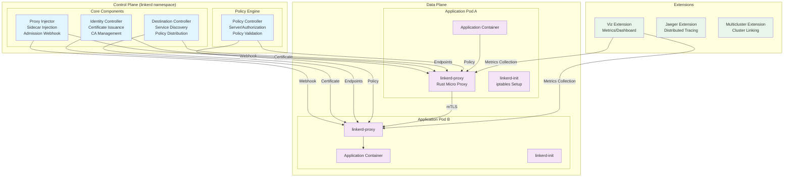

## Plano de control

El plano de control se implementa en el namespace `linkerd` y consta de componentes que configuran y gestionan los proxies del plano de datos.

### Destination Controller

El controlador Destination es el componente central responsable del descubrimiento de servicios y la distribución de políticas.

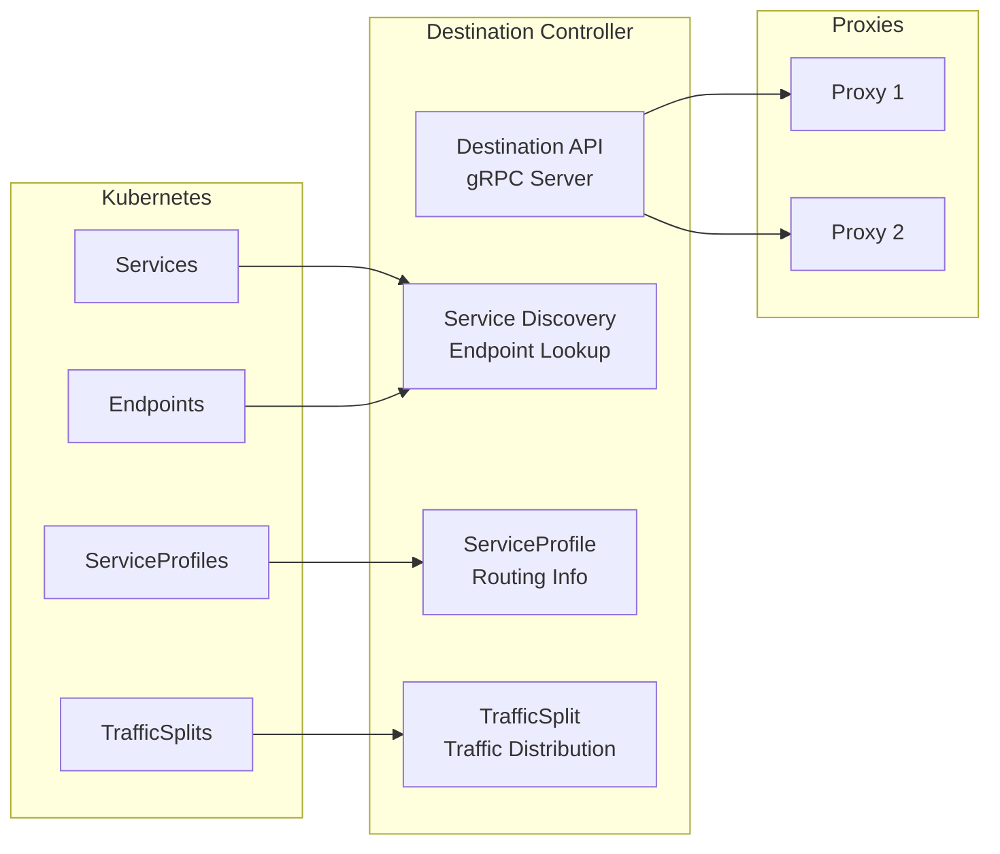

**Funciones principales:**

| Función | Descripción |
|----------|-------------|
| Descubrimiento de servicios | Supervisa los servicios y Endpoints de Kubernetes, y proporciona actualizaciones en tiempo real a los proxies |
| Distribución de políticas | Entrega políticas como ServiceProfile y TrafficSplit a los proxies |
| Información de balanceo de carga | Información de ponderación de Endpoints para el balanceo de carga basado en EWMA |
| Perfiles de servicio | Configuración de reintentos, tiempos de espera y métricas por ruta |

**Operación de la API Destination:**

```go
// Destination API sends updates to proxies via gRPC streaming
// Proxy requests information about target service
service Destination {
    // Get returns update stream for a specific destination
    rpc Get(GetDestination) returns (stream Update);

    // GetProfile returns service profile update stream
    rpc GetProfile(GetDestination) returns (stream DestinationProfile);
}
```

### Identity Controller

El controlador Identity gestiona la emisión y administración de certificados para mTLS.

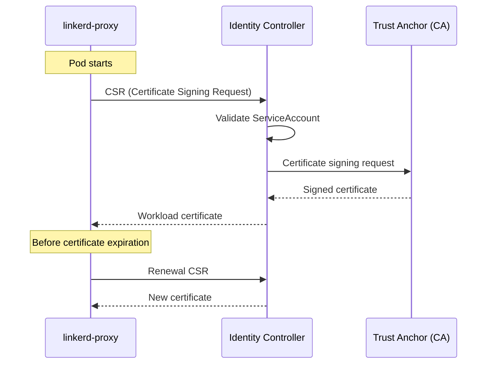

**Proceso de emisión de certificados:**

1. El proxy genera una CSR (Certificate Signing Request) al iniciarse.
2. El controlador Identity valida el ServiceAccount del Pod.
3. Firma el certificado con el Trust Anchor (Root CA).
4. Entrega el certificado de workload al proxy.
5. Validez predeterminada de 24 horas y renovación automática.

**Configuración de Identity:**

```yaml
# Identity settings in linkerd-config ConfigMap
apiVersion: v1
kind: ConfigMap
metadata:
  name: linkerd-config
  namespace: linkerd
data:
  values: |
    identity:
      issuer:
        # Certificate issuance lifetime (default 24 hours)
        issuanceLifetime: 24h0m0s
        # Clock skew allowance
        clockSkewAllowance: 20s
        # Issuer scheme (kubernetes.io/tls)
        scheme: kubernetes.io/tls
```

### Proxy Injector

El Proxy Injector funciona como un Kubernetes Admission Webhook para inyectar automáticamente sidecars en los Pods.

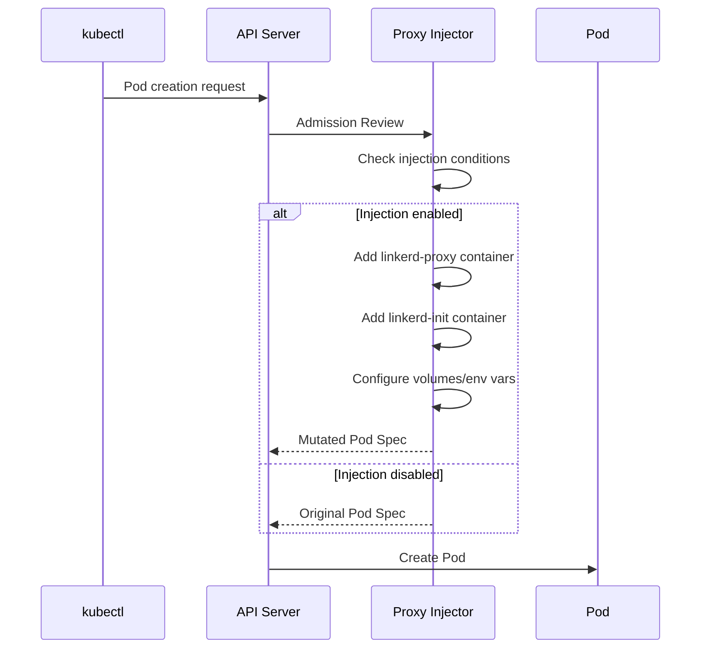

**Condiciones de inyección:**

```yaml
# Namespace-level injection enablement
apiVersion: v1
kind: Namespace
metadata:
  name: my-app
  annotations:
    linkerd.io/inject: enabled

---
# Pod-level injection control
apiVersion: v1
kind: Pod
metadata:
  name: my-pod
  annotations:
    # Enable injection
    linkerd.io/inject: enabled
    # Or disable
    # linkerd.io/inject: disabled
```

**Componentes inyectados:**

| Componente | Función |
|-----------|------|
| `linkerd-init` | Init container, configura reglas de iptables |
| `linkerd-proxy` | Contenedor sidecar, proxy de tráfico |
| Volúmenes | Tokens de identidad, configuración |
| Variables de entorno | Configuración del proxy, direcciones de destino |

### Policy Controller

El Policy Controller gestiona las políticas de autorización de Linkerd.

```yaml
# Server resource - defines inbound traffic
apiVersion: policy.linkerd.io/v1beta2
kind: Server
metadata:
  name: web-http
  namespace: my-app
spec:
  podSelector:
    matchLabels:
      app: web
  port: http
  proxyProtocol: HTTP/1

---
# ServerAuthorization - defines access permissions
apiVersion: policy.linkerd.io/v1beta2
kind: ServerAuthorization
metadata:
  name: web-authz
  namespace: my-app
spec:
  server:
    name: web-http
  client:
    meshTLS:
      serviceAccounts:
        - name: api-gateway
          namespace: my-app
```

## Plano de datos

El plano de datos consta de sidecars `linkerd-proxy` inyectados en los Pods de aplicación.

### linkerd2-proxy

El proxy del plano de datos de Linkerd es un micro-proxy ultraligero escrito en Rust.

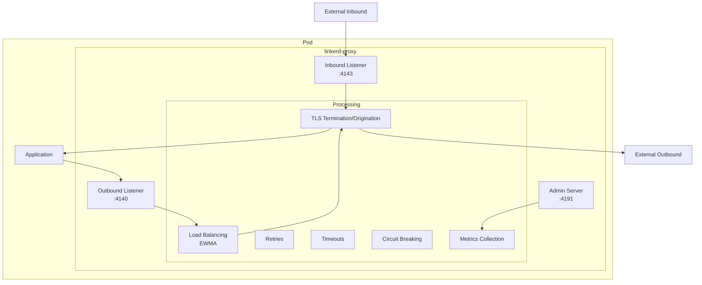

**Características del proxy:**

| Característica | Valor |
|----------------|-------|
| Lenguaje | Rust |
| Uso de memoria | ~10MB |
| Sobrecarga de CPU | Mínima |
| Sobrecarga de latencia | <1ms p99 |
| Protocolos | HTTP/1.1, HTTP/2, gRPC, TCP |
| TLS | TLS 1.3 (rustls) |

**Comparación con Istio Envoy:**

| Característica | linkerd2-proxy | Envoy (Istio) |
|----------------|---------------|---------------|
| Lenguaje | Rust | C++ |
| Memoria | ~10MB | ~50-100MB |
| Tamaño del binario | ~10MB | ~60MB |
| Latencia | <1ms p99 | 2-5ms p99 |
| Complejidad de configuración | Baja (automática) | Alta (xDS) |
| Extensibilidad | Limitada | Wasm, Lua |
| Compatibilidad de protocolos | HTTP, gRPC, TCP | Muy amplia |

### Flujo de tráfico del proxy

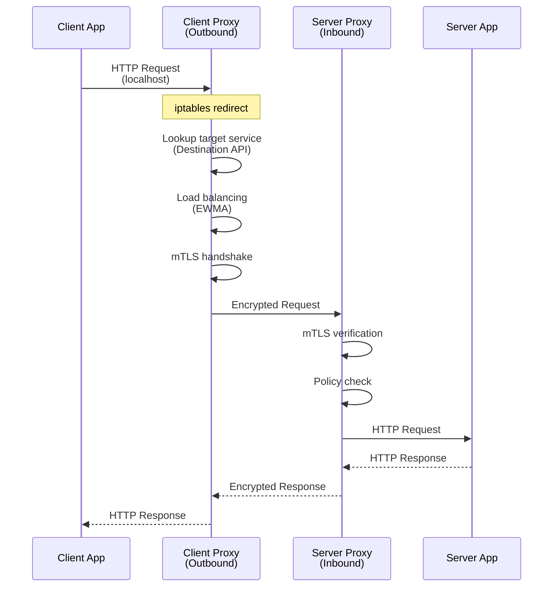

### linkerd-init (Init Container)

`linkerd-init` configura reglas de iptables para redirigir el tráfico al proxy.

```bash
# Example iptables rules set by linkerd-init
# Redirect outbound traffic (to port 4140)
iptables -t nat -A OUTPUT -p tcp -j REDIRECT --to-port 4140

# Redirect inbound traffic (to port 4143)
iptables -t nat -A PREROUTING -p tcp -j REDIRECT --to-port 4143

# Exclude proxy's own traffic
iptables -t nat -A OUTPUT -m owner --uid-owner 2102 -j RETURN
```

**Estructura del Pod inyectado:**

```yaml
apiVersion: v1
kind: Pod
metadata:
  name: my-app
  annotations:
    linkerd.io/inject: enabled
spec:
  initContainers:
  - name: linkerd-init
    image: cr.l5d.io/linkerd/proxy-init:v2.3.0
    args:
    - --incoming-proxy-port=4143
    - --outgoing-proxy-port=4140
    - --proxy-uid=2102
    securityContext:
      capabilities:
        add:
        - NET_ADMIN
        - NET_RAW

  containers:
  - name: my-app
    image: my-app:latest

  - name: linkerd-proxy
    image: cr.l5d.io/linkerd/proxy:stable-2.16.0
    ports:
    - containerPort: 4143  # Inbound
      name: linkerd-proxy
    - containerPort: 4191  # Admin/Metrics
      name: linkerd-admin
    env:
    - name: LINKERD2_PROXY_LOG
      value: warn,linkerd=info
    - name: LINKERD2_PROXY_DESTINATION_SVC_ADDR
      value: linkerd-dst.linkerd.svc.cluster.local:8086
    - name: LINKERD2_PROXY_IDENTITY_SVC_ADDR
      value: linkerd-identity.linkerd.svc.cluster.local:8080
    resources:
      requests:
        cpu: 100m
        memory: 64Mi
      limits:
        cpu: 1000m
        memory: 250Mi
    readinessProbe:
      httpGet:
        path: /ready
        port: 4191
    livenessProbe:
      httpGet:
        path: /live
        port: 4191
```

## Jerarquía de certificados

Linkerd utiliza una PKI (Public Key Infrastructure) jerárquica para implementar mTLS.

### Estructura de la jerarquía de certificados

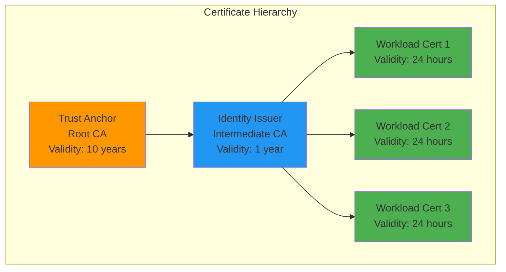

### Trust Anchor (Root CA)

El Trust Anchor es la raíz de la PKI y la base de confianza para todas las cadenas de certificados.

```bash
# Create Trust Anchor (using step CLI)
step certificate create root.linkerd.cluster.local ca.crt ca.key \
  --profile root-ca \
  --no-password \
  --insecure \
  --not-after=87600h  # 10 years

# Verify Trust Anchor
openssl x509 -in ca.crt -text -noout

# Example output:
# Certificate:
#     Data:
#         Version: 3 (0x2)
#         Serial Number: ...
#         Signature Algorithm: ecdsa-with-SHA256
#         Issuer: CN = root.linkerd.cluster.local
#         Validity
#             Not Before: Feb 21 00:00:00 2026 GMT
#             Not After : Feb 21 00:00:00 2036 GMT
#         Subject: CN = root.linkerd.cluster.local
#         ...
#         X509v3 extensions:
#             X509v3 Key Usage: critical
#                 Certificate Sign, CRL Sign
#             X509v3 Basic Constraints: critical
#                 CA:TRUE
```

**Almacenamiento de Trust Anchor:**

```yaml
# Stored as Kubernetes Secret
apiVersion: v1
kind: Secret
metadata:
  name: linkerd-identity-trust-roots
  namespace: linkerd
type: Opaque
data:
  ca-bundle.crt: <base64-encoded-ca.crt>
```

### Identity Issuer (Intermediate CA)

El Identity Issuer es la CA intermedia que emite certificados de workload.

```bash
# Create Identity Issuer certificate
step certificate create identity.linkerd.cluster.local issuer.crt issuer.key \
  --profile intermediate-ca \
  --ca ca.crt \
  --ca-key ca.key \
  --no-password \
  --insecure \
  --not-after=8760h  # 1 year

# Verify Issuer certificate
openssl x509 -in issuer.crt -text -noout
```

**Secret de Identity Issuer:**

```yaml
apiVersion: v1
kind: Secret
metadata:
  name: linkerd-identity-issuer
  namespace: linkerd
type: kubernetes.io/tls
data:
  tls.crt: <base64-encoded-issuer.crt>
  tls.key: <base64-encoded-issuer.key>
  ca.crt: <base64-encoded-ca.crt>
```

### Certificados de workload

Cada proxy recibe un certificado de workload único.

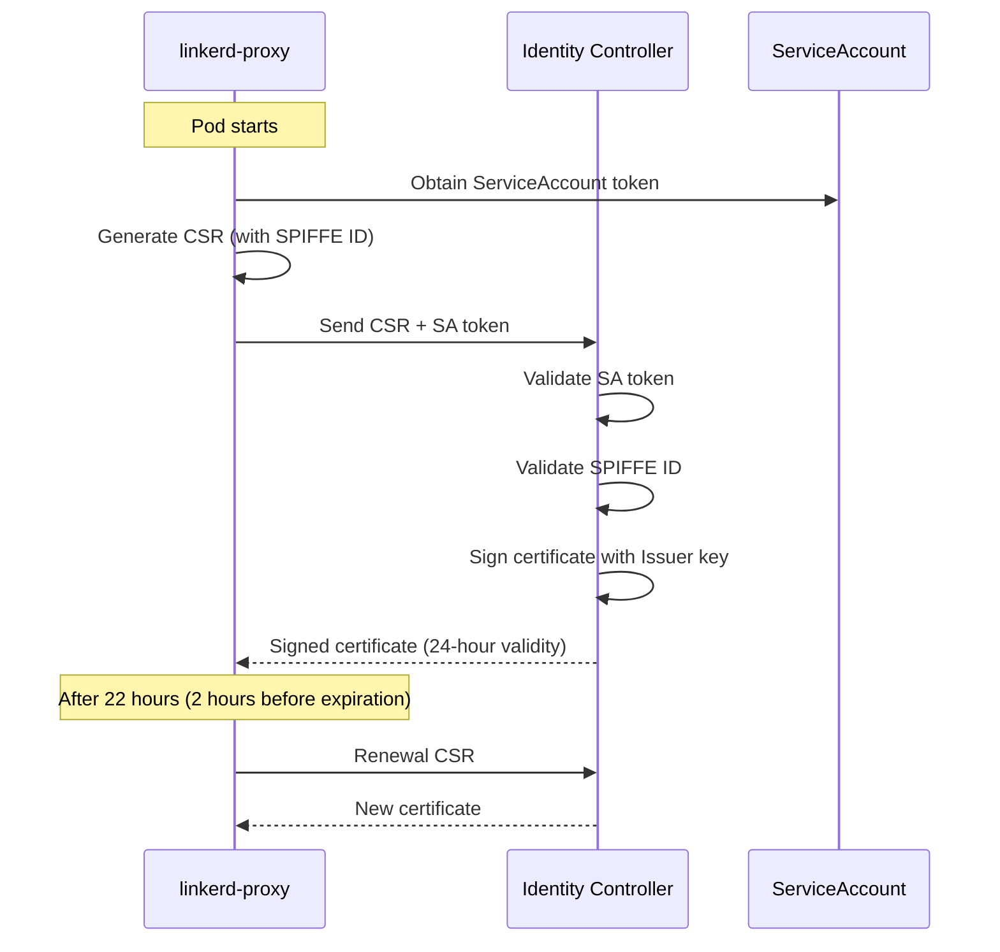

**Formato de ID SPIFFE:**

```
spiffe://root.linkerd.cluster.local/ns/<namespace>/sa/<service-account>

# Example:
spiffe://root.linkerd.cluster.local/ns/my-app/sa/web-service
```

### Rotación de certificados

```yaml
# Certificate lifetime configuration
identity:
  issuer:
    # Workload certificate lifetime (default 24 hours)
    issuanceLifetime: 24h0m0s
    # Clock skew allowance (default 20 seconds)
    clockSkewAllowance: 20s

# Proxy automatically renews certificates before expiration
# By default, renewal starts at 70% of certificate lifetime
```

**Rotación de Trust Anchor:**

```bash
# Create new Trust Anchor
step certificate create root.linkerd.cluster.local ca-new.crt ca-new.key \
  --profile root-ca \
  --no-password \
  --insecure \
  --not-after=87600h

# Create bundle (existing + new)
cat ca.crt ca-new.crt > ca-bundle.crt

# Update ConfigMap
kubectl create configmap linkerd-identity-trust-roots \
  --from-file=ca-bundle.crt=ca-bundle.crt \
  -n linkerd \
  --dry-run=client -o yaml | kubectl apply -f -

# Then restart all proxies to apply new bundle
kubectl rollout restart deploy -n my-app
```

## Detalles de la inyección de sidecar

### Flujo de trabajo de inyección

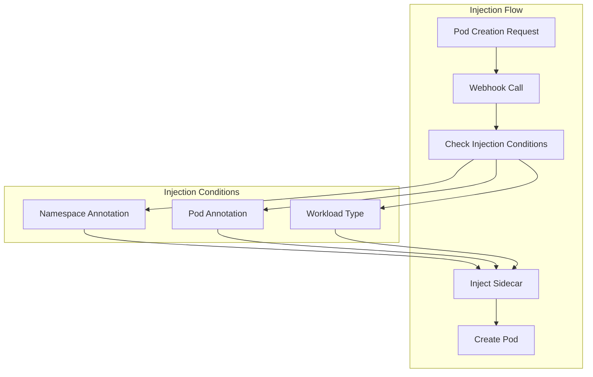

### Anotaciones de inyección

```yaml
# Namespace level
metadata:
  annotations:
    linkerd.io/inject: enabled  # Inject into all Pods

# Pod/Deployment level
metadata:
  annotations:
    # Enable/disable injection
    linkerd.io/inject: enabled|disabled

    # Proxy configuration overrides
    config.linkerd.io/proxy-cpu-request: "100m"
    config.linkerd.io/proxy-memory-request: "64Mi"
    config.linkerd.io/proxy-cpu-limit: "1"
    config.linkerd.io/proxy-memory-limit: "250Mi"

    # Proxy log level
    config.linkerd.io/proxy-log-level: "warn,linkerd=info"

    # Skip ports (bypass proxy)
    config.linkerd.io/skip-inbound-ports: "25,587"
    config.linkerd.io/skip-outbound-ports: "25,587"

    # Opaque ports (bypass protocol detection)
    config.linkerd.io/opaque-ports: "3306,5432"
```

### Readiness/Liveness del proxy

```yaml
# Proxy health check endpoints
livenessProbe:
  httpGet:
    path: /live
    port: 4191
  initialDelaySeconds: 10
  periodSeconds: 10

readinessProbe:
  httpGet:
    path: /ready
    port: 4191
  initialDelaySeconds: 2
  periodSeconds: 10
```

## Comunicación entre componentes

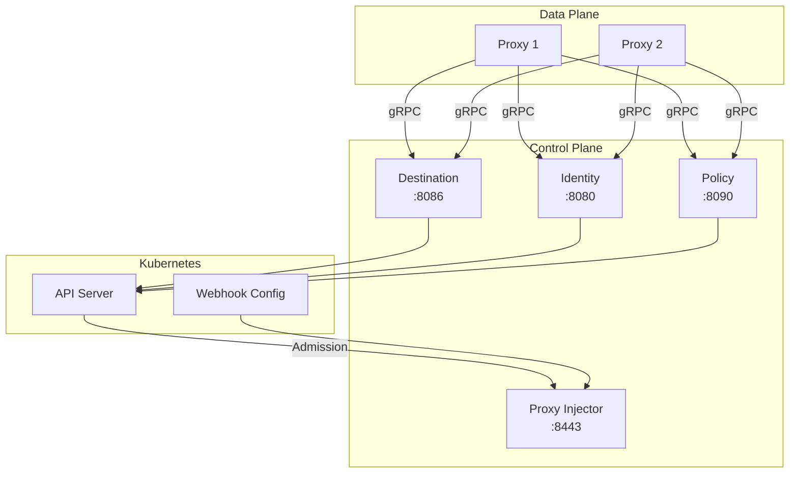

**Resumen de puertos:**

| Componente | Puerto | Protocolo | Propósito |
|-----------|------|----------|---------|
| Destination | 8086 | gRPC | API de descubrimiento de servicios |
| Identity | 8080 | gRPC | API de emisión de certificados |
| Policy | 8090 | gRPC | API de políticas |
| Proxy Injector | 8443 | HTTPS | Admission Webhook |
| Proxy (entrante) | 4143 | HTTP/gRPC | Tráfico entrante |
| Proxy (saliente) | 4140 | HTTP/gRPC | Tráfico saliente |
| Proxy (Admin) | 4191 | HTTP | Métricas, comprobaciones de estado |

## Comparación con la arquitectura de Istio

### Comparación del plano de control

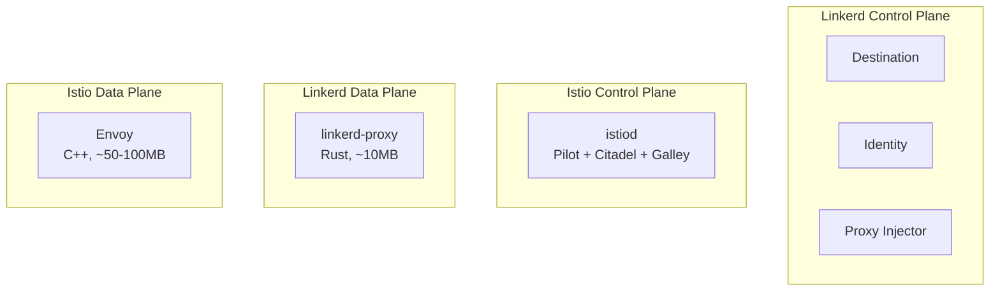

| Característica | Linkerd | Istio |
|----------------|---------|-------|
| Plano de control | Distribuido (3 componentes) | Unificado (istiod) |
| Proxy | linkerd2-proxy (Rust) | Envoy (C++) |
| Protocolo de configuración | gRPC personalizado | xDS (complejo) |
| Número de CRD | ~10 | ~50+ |
| Curva de aprendizaje | Suave | Pronunciada |
| Uso de recursos | Bajo | Alto |
| Extensibilidad | Limitada | Wasm, Lua |

### Comparación de proxies

```yaml
# Linkerd Proxy Resources (typical)
resources:
  requests:
    cpu: 100m
    memory: 64Mi
  limits:
    cpu: 1000m
    memory: 250Mi

# Envoy Proxy Resources (typical)
resources:
  requests:
    cpu: 100m
    memory: 128Mi
  limits:
    cpu: 2000m
    memory: 1Gi
```

## Próximos pasos

- [Gestión del tráfico](./03-traffic-management.md): ServiceProfile y división de tráfico
- [Seguridad](./04-security.md): mTLS y políticas de autorización
- [Observabilidad](./05-observability.md): Métricas y paneles

## Referencias

- [Arquitectura de Linkerd](https://linkerd.io/2/reference/architecture/)
- [linkerd2-proxy GitHub](https://github.com/linkerd/linkerd2-proxy)
- [Identidad de Linkerd](https://linkerd.io/2/features/automatic-mtls/)
- [Inyección de proxy](https://linkerd.io/2/features/proxy-injection/)
