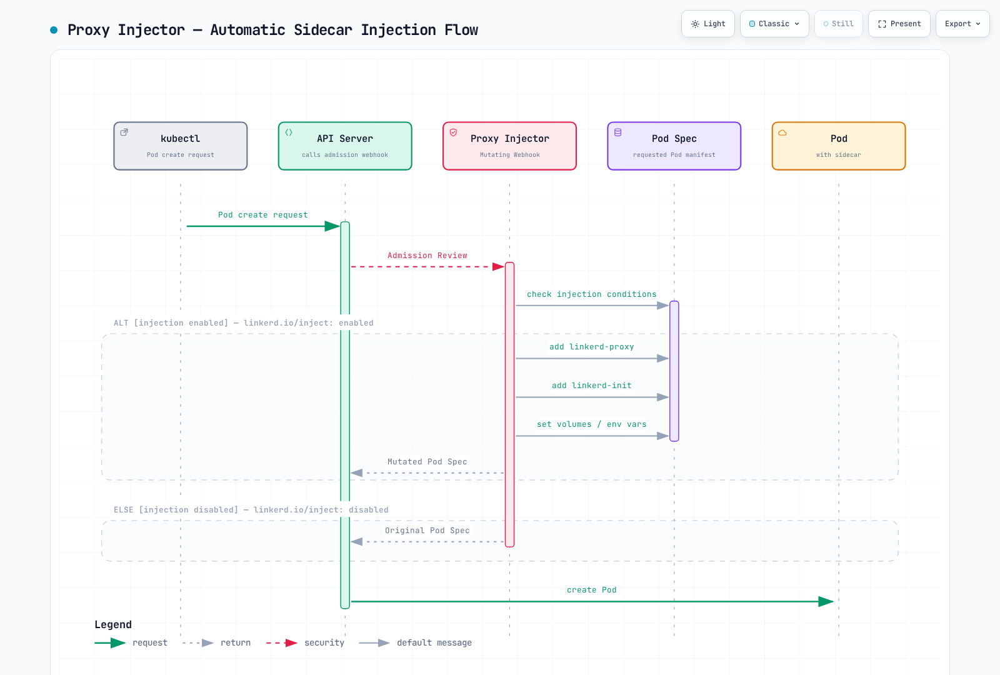

# Arquitectura de Linkerd

> **Última actualización**: September 11, 2026 · Linkerd edge-26.9.1 / proxy release/v2.368.0

Este capítulo explica las funciones actuales de los componentes, la jerarquía de identidad, la captura de tráfico y el ciclo de vida de la inyección. Utilice la [guía de instalación](01-installation.md) para la combinación compatible de versión/clúster y los artefactos de versiones fijadas. Los ejemplos siguientes ilustran configuraciones; no se realizó ningún despliegue real ni rotación de CA en esta auditoría.

## Arquitectura general


[Ver diagrama interactivo](https://www.atomai.click/kubernetes-docs/archmaps/en-service-mesh-linkerd-02-architecture-0.html)

El espacio de nombres predeterminado del plano de control es linkerd. El chart fijado tiene tres Deployments principales: linkerd-destination, linkerd-identity y linkerd-proxy-injector. Destination también contiene los contenedores de políticas y de validación de ServiceProfile; las funciones lógicas de controlador no equivalen a Deployments separados. Los componentes opcionales de Viz y multiclúster tienen sus propios ciclos de vida.

El plano de datos utiliza proxies Rust junto a las aplicaciones incorporadas. Los sidecars nativos son el valor predeterminado de esta versión. El Deployment Identity utiliza deliberadamente un proxy regular con la espera de inicio deshabilitada, por lo que la inspección debe considerar tanto containers como initContainers.

## Plano de control

### Controlador Destination

Destination observa el estado de descubrimiento y proporciona direcciones de endpoints, identidades esperadas e información de perfiles mediante API de streaming. Los valores predeterminados actuales utilizan EndpointSlices. Los ServiceProfiles siguen siendo un mecanismo de configuración anterior; el enrutamiento y la autorización de Gateway API también involucran al controlador de políticas. No describa el enrutamiento actual de Linkerd como únicamente SMI TrafficSplit ni suponga que Destination observa directamente los recursos de esa extensión heredada.

| Responsabilidad | Significado |
|---|---|
| Descubrimiento | Adiciones/eliminaciones de endpoints y metadatos del Service solicitado |
| Identidad esperada | Información que utiliza el proxy saliente para autenticar al par seleccionado |
| Perfiles | Configuración compatible de rutas/perfiles para métricas, reintentos y tiempos de espera |
| Entradas de equilibrio de carga | Información de endpoints y pesos configurados; las observaciones de latencia y la selección de solicitudes/conexiones durante la ejecución ocurren en el proxy |

Esto es un **extracto de un servicio Protocol Buffers**, no código fuente Go. Las definiciones de mensajes y las importaciones están en la API del proxy fijada:

```protobuf
// Excerpt: message definitions/imports are in the linked API source.
service Destination {
  rpc Get(GetDestination) returns (stream Update) {}
  rpc GetProfile(GetDestination) returns (stream DestinationProfile) {}
}
```

Get transmite actualizaciones de destinos; GetProfile transmite actualizaciones de perfiles. Ni un flujo ni una caché local hacen instantáneos los cambios de configuración ni eliminan la necesidad de gestionar endpoints no disponibles.

### Controlador Identity

El flujo de identidad predeterminado de Kubernetes es:

1. El inicio del proxy establece el material local de clave privada/CSR.
2. El cliente de identidad envía el CSR, la identidad solicitada y el token de ServiceAccount.
3. Identity valida el token mediante TokenReview de Kubernetes y deriva la identidad con formato DNS.
4. La **credencial de firma del emisor** configurada, normalmente el emisor intermedio, firma el certificado de la carga de trabajo.
5. El cliente carga el certificado/cadena devueltos y los renueva antes de su caducidad.

El ancla de confianza es la base de validación de la cadena. El controlador de identidad de Linkerd no requiere su clave privada; la raíz no actúa como firmante en línea de cada CSR de carga de trabajo.

Lo siguiente es un **fragmento de valores de Helm** para el responsable de la instalación:

```yaml
identity:
  issuer:
    issuanceLifetime: 24h0m0s
    clockSkewAllowance: 20s
    scheme: linkerd.io/tls
```

linkerd.io/tls es el esquema de emisor predeterminado. Una integración kubernetes.io/tls utiliza el formato de Secret correspondiente gestionado externamente. No cambie el esquema sin que coincidan el responsable de la credencial y las claves, ni sobrescriba toda la entrada values de linkerd-config con un ConfigMap parcial de identidad.

### Inyector de proxies



[Ver diagrama interactivo](https://www.atomai.click/kubernetes-docs/archmaps/en-service-mesh-linkerd-02-architecture-3.html)

El inyector es un webhook de admisión mutante. Su respuesta describe modificaciones que aplica el servidor de API; el diagrama es conceptual, no un ejemplo de formato de transmisión. Siguen aplicándose la selección real del webhook, las anulaciones del Pod y la elegibilidad de la plataforma.

Habilite un espacio de nombres seleccionado:

```yaml
apiVersion: v1
kind: Namespace
metadata:
  name: my-app
  annotations:
    linkerd.io/inject: enabled
```

Para un Deployment, coloque las anulaciones en su **plantilla de Pod**. Este fragmento pertenece a la definición existente de la carga de trabajo:

```yaml
spec:
  template:
    metadata:
      annotations:
        linkerd.io/inject: enabled
        config.linkerd.io/proxy-cpu-request: 100m
        config.linkerd.io/proxy-memory-request: 64Mi
        config.linkerd.io/proxy-cpu-limit: '1'
        config.linkerd.io/proxy-memory-limit: 250Mi
        config.linkerd.io/proxy-log-level: warn,linkerd=info
```

Utilice un valor literal, enabled o disabled, no enabled|disabled. Añadir una anotación no modifica Pods existentes. El webhook instalado excluye determinados espacios de nombres del sistema, y las anulaciones explícitas de Pod pueden deshabilitar una inyección que de otro modo estaría habilitada.

| Elemento inyectado/configurado | Función |
|---|---|
| linkerd-init | Configuración de captura de red del Pod cuando no se utiliza Linkerd CNI |
| linkerd-proxy | Proxy del plano de datos, normalmente un contenedor de inicialización reiniciable en esta versión |
| Token de identidad proyectado y almacenamiento local de identidad | Arranque y uso de certificados de cargas de trabajo; la clave del proxy no se distribuye como un Secret compartido de la carga de trabajo |
| Entorno/sondas/recursos | Configuración de ejecución específica de la versión generada por la inyección |

### Controlador de políticas

Policy controla la autorización entrante y el comportamiento compatible saliente/de enrutamiento de solicitudes. Este ejemplo selecciona Pods etiquetados app:web con un puerto declarado llamado http y autoriza al ServiceAccount api-gateway incorporado a la malla en my-app:

```yaml
apiVersion: policy.linkerd.io/v1beta3
kind: Server
metadata:
  name: web-http
  namespace: my-app
spec:
  podSelector:
    matchLabels:
      app: web
  port: http
  proxyProtocol: HTTP/1
  accessPolicy: deny
---
apiVersion: policy.linkerd.io/v1alpha1
kind: AuthorizationPolicy
metadata:
  name: web-api-gateway
  namespace: my-app
spec:
  targetRef:
    group: policy.linkerd.io
    kind: Server
    name: web-http
  requiredAuthenticationRefs:
  - kind: ServiceAccount
    name: api-gateway
```

Un Server selecciona pares de Pod/puerto existentes; no crea una aplicación, Service ni listener. El puerto con nombre debe existir. El tráfico seleccionado se deniega de forma predeterminada salvo que lo permita una política aplicable o una política de acceso alternativa seleccionada explícitamente. Prepare y pruebe el ámbito de la política antes de aplicarla.

AuthorizationPolicy puede dirigirse a un Server o a una ruta compatible. Las referencias a ServiceAccount son un requisito de autenticación práctico; MeshTLSAuthentication y NetworkAuthentication expresan conjuntos adicionales de identidades/redes. Todas las referencias de autenticación requeridas dentro de una política deben coincidir; revise otras políticas que también puedan autorizar tráfico.

Para un flujo de trabajo ServerAuthorization existente, esto es una **alternativa** compatible, no un requisito adicional que deba aplicarse junto con la autorización anterior:

```yaml
apiVersion: policy.linkerd.io/v1beta1
kind: ServerAuthorization
metadata:
  name: web-authz-legacy
  namespace: my-app
spec:
  server:
    name: web-http
  client:
    meshTLS:
      serviceAccounts:
      - name: api-gateway
        namespace: my-app
```

Los CRD publicados sirven ServerAuthorization v1beta1, no v1beta2 como en el ejemplo original. Server v1beta2 sigue sirviéndose; el ejemplo utiliza su versión actual de almacenamiento v1beta3. AuthorizationPolicy es la interfaz preferida, más flexible. No confunda estos recursos de Linkerd con los recursos de nombres similares de Istio en otro grupo de API.

## Plano de datos

### Comportamiento del proxy y ámbito de protocolos

linkerd2-proxy está escrito en Rust y diseñado específicamente para la malla. Admite HTTP/1.1, HTTP/2, gRPC y TCP. El enrutamiento/métricas HTTP requieren HTTP visible; el TLS originado en la aplicación es opaco y UDP/QUIC o el tráfico omitido no están cubiertos por la ruta del proxy TCP.

Para pares TCP aptos incorporados a la malla, Linkerd proporciona mTLS de transporte. El transporte de malla documentado utiliza TLS 1.3; el paso directo del TLS originado en la aplicación es una capa independiente. Los pares ajenos a la malla y las omisiones explícitas de captura necesitan consideración separada. La política entrante predeterminada acepta texto sin cifrar ajeno a la malla; mTLS automático no equivale a exigir acceso autenticado desde todos los orígenes.

El proxy utiliza equilibrio consciente de la latencia para solicitudes HTTP y equilibrio por conexión para TCP opaco. Los pesos de endpoints y las reglas de enrutamiento son distintos de las estimaciones de latencia durante la ejecución. No interprete EWMA como una garantía de que cada solicitud vaya a un único endpoint determinísticamente más rápido.

No existe una garantía universal de memoria de 10MB, p99 <1ms ni tamaño fijo del binario. Las mediciones dependen de la versión/compilación, arquitectura, número de conexiones, políticas/configuración, carga de trabajo e instrumentación.

### Flujo de tráfico del proxy


[Ver diagrama interactivo](https://www.atomai.click/kubernetes-docs/archmaps/en-service-mesh-linkerd-02-architecture-5.html)

El descubrimiento saliente, el enrutamiento/equilibrio, los reintentos y los tiempos de espera difieren de la autorización entrante. Una nueva conexión puede realizar descubrimiento y establecimiento de mTLS; las conexiones existentes y la configuración en caché pueden reutilizarse. El comportamiento seguro de reintento de solicitudes sigue siendo una decisión de aplicación/protocolo, especialmente para escrituras.

### Captura de tráfico: linkerd-init o CNI

Utilice la configuración generada de proxy-init o Linkerd CNI. Lo siguiente es un orden conceptual, **no comandos iptables del host que deban ejecutarse**:

```text
Inside the Pod network namespace:
  outbound TCP -> evaluate proxy-UID and configured bypass rules first
               -> redirect intercepted traffic to the outbound proxy (default 4140)
  inbound TCP  -> evaluate configured bypass rules
               -> redirect intercepted traffic to the inbound proxy (default 4143)

Linkerd CNI: installs the Linkerd-specific capture setup through the CNI chain.
linkerd-init: performs the setup at Pod startup when Linkerd CNI is not used.
```

El antiguo ejemplo añadía la exclusión por UID del proxy después de un REDIRECT de todo TCP, donde no protegería el propio tráfico saliente del proxy. Aplicar esas reglas en el espacio de nombres del host tampoco es la configuración de Linkerd específica del Pod. La implementación real incluye exclusiones/cadenas adicionales y admite modos de iptables configurados.

Los puertos opacos omiten la detección de protocolo y conservan el tratamiento del transporte por el proxy. Los puertos omitidos eluden el proxy y sus funciones de malla. Para tráfico donde el servidor habla primero, no utilice la omisión como sustituto de una configuración correcta de puertos opacos/protocolo.

### Inspeccionar el Pod generado en vez de construir un proxy a mano

El antiguo Pod ensamblado manualmente omitía material de identidad/arranque y presuponía una imagen upstream stable-2.16.0 no disponible. Genere o inspeccione la configuración con la CLI seleccionada y la configuración instalada del plano de control:

```bash
# The input is a complete, reviewed application manifest.
# Default mode adds the injection annotation for server-side admission.
linkerd inject web.yaml > web-annotated.yaml

# Manual mode materializes the proxy spec using the selected cluster configuration.
# Review/remove conflicting input config annotations before selecting CLI flags.
linkerd inject --manual --native-sidecar \
  --proxy-cpu-request 100m --proxy-memory-request 64Mi \
  --proxy-cpu-limit 1 --proxy-memory-limit 250Mi \
  web.yaml > web-manually-injected.yaml
```

El modo inject predeterminado es una transformación de anotaciones. En edge-26.9.1, la generación manual también consume anotaciones de configuración de la entrada existente: una anotación observada de solicitud de CPU de 700m tuvo prioridad sobre una opción CLI de 100m, y se aplicó una anotación de nivel de registro de entrada. Actualice/elimine entradas contradictorias e inspeccione los campos resultantes del proxy. Un proxy materializado manualmente no se regenera automáticamente mediante cambios posteriores de anotaciones; actualice la carga de trabajo generada mediante su responsable en vez de copiar un contenedor abreviado como instalación completa.

```bash
: "${APP_POD:?Set an application Pod name in my-app}"
kubectl -n my-app get pod "$APP_POD" -o json |
  jq '{pod: .metadata.name, proxies: ([.spec.containers[]?, .spec.initContainers[]?] | map(select(.name == "linkerd-proxy") | {image, restartPolicy, resources, startupProbe, readinessProbe, livenessProbe}))}'
```

Los sidecars nativos aparecen en initContainers con restartPolicy: Always. Se omite el contenedor linkerd-init con la ruta CNI configurada. Los endpoints de estado del proxy son /live y /ready en el puerto de administración configurado (4191 de forma predeterminada); el comportamiento nativo de inicio/disponibilidad y la disponibilidad de la aplicación son independientes.

## Jerarquía de certificados

| Material | Función/almacenamiento predeterminado |
|---|---|
| Certificado/paquete del ancla de confianza | Base pública de confianza; ConfigMap linkerd-identity-trust-roots, ca-bundle.crt |
| Clave privada de la CA raíz | Material del responsable de PKI; Linkerd no la necesita para funcionar |
| Certificado/clave privada del emisor | Secret linkerd-identity-issuer; el formato predeterminado utiliza crt.pem/key.pem |
| Integración de emisor TLS de Kubernetes | Alternativa configurada deliberadamente que utiliza tls.crt/tls.key y el esquema correspondiente |
| Clave/certificado de la carga de trabajo | Material de credenciales local del proxy; validez nominal del certificado de 24h, renovado automáticamente |

La validez del emisor y del ancla de confianza depende de su PKI configurada. Las raíces/emisores generados por la CLI de forma predeterminada tienen validez de un año; un ejemplo personalizado de diez años no es un valor predeterminado ni una recomendación universal. Inspeccione las fechas reales de los certificados en vez de copiar una marca temporal fija de ejemplo.

### Identidad de cargas de trabajo de Kubernetes

Para el mecanismo predeterminado de identidad de Kubernetes, la identidad tiene formato DNS:

```text
<service-account>.<namespace>.serviceaccount.identity.<linkerd-namespace>.<identity-trust-domain>

web-service.my-app.serviceaccount.identity.linkerd.cluster.local
```

Varios Pods que utilizan el mismo ServiceAccount comparten esta identidad, aunque cada uno conserva sus propias credenciales locales. El dominio de confianza de identidad es un concepto configurable, no necesariamente idéntico a un sufijo DNS de Kubernetes modificado.

La cadena original spiffe://root.linkerd.cluster.local/ns/.../sa/... no era el formato predeterminado de identidad de Kubernetes. Las identidades basadas en SPIFFE/SPIRE son compatibles con una [ruta de expansión de malla a cargas de trabajo externas](https://linkerd.io/docs/tasks/adding-non-kubernetes-workloads/) distinta; no sustituya TokenReview de Kubernetes por su modelo de identidad/arranque.

### Renovación y rotación

En proxy release/v2.368.0, el cliente de identidad normalmente programa el siguiente intento de certificado al 70% de la validez **restante**, acotado por los intervalos mínimo/máximo de actualización configurados. Las rutas de error/caducidad pueden utilizar el retraso mínimo. Esto no es una garantía fija de tiempo de reloj para todos los certificados.

Ese cliente reutiliza sus documentos de clave/CSR cargados al solicitar certificados renovados. Renovar certificados no equivale a rotar claves privadas, emisores o anclas de confianza.

```bash
set -euo pipefail
kubectl -n linkerd get configmap linkerd-identity-trust-roots \
  -o jsonpath='{.data.ca-bundle\.crt}' > trust-bundle.pem
openssl crl2pkcs7 -nocrl -certfile trust-bundle.pem |
  openssl pkcs7 -print_certs -text -noout
kubectl -n linkerd get secret linkerd-identity-issuer -o json |
  jq -er '.data["crt.pem"] // .data["tls.crt"]' |
  base64 -d | openssl x509 -noout -dates
```

Una transición completa del ancla de confianza tiene varias fases:

1. Inventariar las raíces válidas actuales, el emisor, todos los consumidores y los responsables de instalación/PKI.
2. Añadir la nueva raíz junto a la antigua mediante la configuración del responsable. Asegurar que los proxies/componentes del plano de control afectados y los pares multiclúster carguen realmente el paquete con ambas raíces.
3. Rotar el emisor a una credencial firmada por la nueva raíz y confirmar que el servicio de identidad la haya cargado.
4. Renovar/recrear los consumidores según requiera su fuente de configuración; verificar las credenciales nuevas reales y el tráfico mTLS por las rutas afectadas.
5. Eliminar la raíz antigua solo cuando ningún par necesario dependa de ella, propagar el paquete final y volver a verificar.

La antigua actualización de ConfigMap más el reinicio de un espacio de nombres terminaba antes de la transición del emisor y la eliminación de la raíz antigua; no era un procedimiento de rotación completo. Evite modificaciones directas que entren en conflicto con la gestión de Helm/cert-manager/trust-manager. Una raíz ya caducada necesita un procedimiento de recuperación, no una sustitución normal de una raíz válida.

```bash
linkerd check
linkerd check --proxy
kubectl -n linkerd get events --field-selector reason=IssuerUpdated
# Inspect each affected namespace/workload and its actual proxy version/identity.
kubectl -n my-app get pods -o wide
```

Un evento IssuerUpdated es una observación, no una prueba de que todos los proxies o clústeres remotos hayan completado la transición. cert-manager puede automatizar la renovación del emisor y trust-manager puede distribuir paquetes, pero el cambio de raíz sigue necesitando verificación coordinada. Siga el flujo [manual](https://linkerd.io/docs/tasks/manually-rotating-control-plane-tls-credentials/) o de [credenciales gestionadas](https://linkerd.io/docs/tasks/automatically-rotating-control-plane-tls-credentials/) para el diseño real de PKI; este capítulo no ejecutó una rotación.

## Detalles de inyección de sidecars


[Ver diagrama interactivo](https://www.atomai.click/kubernetes-docs/archmaps/en-service-mesh-linkerd-02-architecture-8.html)

Para cargas de trabajo gestionadas por controladores, utilice anotaciones de plantilla de Pod e inspeccione los Pods resultantes. Las claves metadata duplicadas en un mismo mapa YAML se sobrescriben/entran en conflicto; mantenga los ejemplos de espacio de nombres y carga de trabajo como recursos/fragmentos separados.

Las anotaciones de recursos/registros mostradas antes establecen las solicitudes/límites previstos del proxy y la configuración de registros. No son mediciones del consumo real. Las anulaciones de puertos opacos sustituyen la lista de puertos predeterminada en vez de añadir simplemente dos puertos de base de datos; conserve todos los puertos necesarios. Las anulaciones de puertos omitidos eliminan deliberadamente tráfico del tratamiento de la malla.

## Comunicación entre componentes


[Ver diagrama interactivo](https://www.atomai.click/kubernetes-docs/archmaps/en-service-mesh-linkerd-02-architecture-9.html)

| Componente/ruta | Puerto predeterminado | Protocolo/propósito |
|---|---|---|
| Service Destination | 8086 | gRPC de streaming para descubrimiento/perfiles |
| Service Identity | 8080 | gRPC de API de certificados |
| Service Policy | 8090 | gRPC de políticas |
| Inyector de proxies | Service 443 → Pod 8443 | Webhook de admisión HTTPS |
| Entrada del proxy | 4143 | TCP interceptado, incluidos HTTP/gRPC o tráfico opaco |
| Salida del proxy | 4140 | TCP saliente interceptado |
| Administración del proxy | 4191 | Endpoints HTTP de métricas y estado |

Estos puertos se pueden configurar y no constituyen una regla general de acceso a la red. El endpoint de administración no es una interfaz de configuración de enrutamiento al estilo Envoy; las políticas/configuración se entregan mediante las API del plano de control.

## Comparación con la arquitectura de Istio

| Aspecto | Linkerd | Istio |
|---|---|---|
| Organización del plano de control | Tres Deployments principales en esta versión, con varios controladores lógicos | Istiod unificado para las funciones principales de control, más componentes específicos del modo |
| Plano de datos | Proxies Rust diseñados específicamente | Sidecars Envoy o ztunnel de ambient con waypoints seleccionados |
| Configuración | API gRPC de streaming de Linkerd y sus recursos compatibles | xDS para Envoy y configuración compatible de Istio/Gateway API |
| Extensiones | Comprobar las funciones/API compatibles de Linkerd | Comprobar la compatibilidad y asociación de Envoy/Wasm/Lua específicas del modo/versión |
| Comparación de recursos/rendimiento | Medir cargas de trabajo equivalentes y la configuración real | Medir cargas de trabajo equivalentes y la configuración real |

xDS también utiliza habitualmente gRPC; el nombre de un protocolo no es una clasificación intrínseca de complejidad. El número de CRD varía según versiones y extensiones y no mide la sobrecarga durante la ejecución. Las solicitudes/límites son reservas/topes configurados, no memoria o latencia observadas. Compare la misma carga de trabajo, tráfico, protocolo, políticas y presupuesto de fallos antes de elegir; consulte la [comparación mantenida](../istio/comparison/README.md).

## Siguientes pasos y fuentes

- [Gestión del tráfico](03-traffic-management.md), [Seguridad](04-security.md), [Observabilidad](05-observability.md)
- [Cuestionario de arquitectura](../../quizzes/service-mesh/linkerd/architecture.md)
- [Arquitectura oficial](https://linkerd.io/docs/reference/architecture/), [inyección](https://linkerd.io/docs/features/proxy-injection/) y [referencia de políticas](https://linkerd.io/docs/reference/authorization-policy/)
- [mTLS automático](https://linkerd.io/docs/features/automatic-mtls/), [tratamiento de protocolos](https://linkerd.io/docs/features/protocol-detection/) y [equilibrio de carga](https://linkerd.io/docs/features/load-balancing/)
- [API Destination de la versión fijada](https://github.com/linkerd/linkerd2-proxy-api/blob/v0.20.0/proto/destination.proto)
- [Validación de tokens de Kubernetes](https://github.com/linkerd/linkerd2/blob/edge-26.9.1/controller/identity/validator.go) y [formato de identidad](https://github.com/linkerd/linkerd2/blob/edge-26.9.1/controller/identity/domain.go)
- [Implementación de renovación de certificados de la versión fijada](https://github.com/linkerd/linkerd2-proxy/blob/a66af8117769df060adda6233302a2d1c4142229/linkerd/proxy/identity-client/src/certify.rs)
