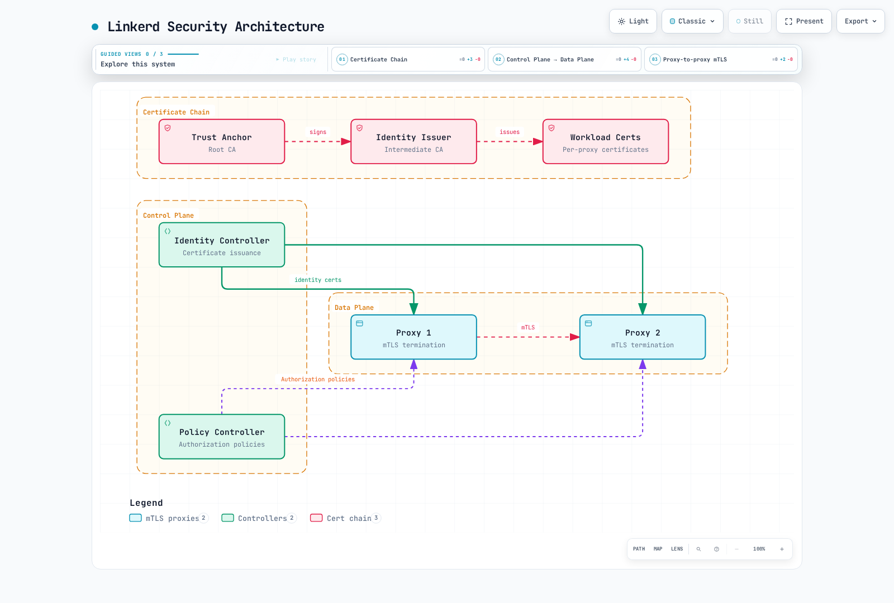

# Seguridad de Linkerd

> **Última actualización**: September 11, 2026 · Linkerd edge-26.9.1 · Ejemplos de cert-manager comprobados con 1.21.1

Linkerd proporciona autenticación de cargas de trabajo, cifrado de transporte y autorización entrante para el tráfico gestionado por sus proxies. La incorporación, las políticas, el ciclo de vida de los certificados y la seguridad de la aplicación siguen necesitando un diseño explícito. Utilice la combinación compatible de Kubernetes/Gateway API de la [guía de instalación](01-installation.md); los ejemplos de aquí presuponen esa instalación y cargas de trabajo de aplicaciones existentes.

## Arquitectura de seguridad



[Ver diagrama interactivo](https://www.atomai.click/kubernetes-docs/archmaps/en-service-mesh-linkerd-04-security-0.html)

## mTLS automático

Linkerd utiliza automáticamente mTLS para tráfico TCP apto entre Pods de la malla. Ambos proxies deben participar, confiar en la cadena de certificados y recibir el tráfico. Los puertos omitidos eluden el proxy; UDP queda fuera de este mecanismo TCP. El tráfico hacia o desde endpoints ajenos a la malla no adquiere mTLS de Linkerd simplemente porque un endpoint tenga un proxy.

Para una aplicación que habla HTTP sin cifrar, el proxy saliente autentica al proxy de destino y cifra el salto de red; el proxy receptor autentica al cliente y reenvía HTTP a su aplicación local. El TLS originado en la aplicación puede permanecer cifrado a través de la malla: Linkerd no descifra automáticamente todos los flujos TLS externos u opacos.

| Propiedad | Significado y límite |
|---|---|
| Cifrado transparente | No se requiere una implementación TLS de la aplicación para el salto apto entre proxies |
| Autenticación mutua | Los proxies autentican identidades de cargas de trabajo, no usuarios finales |
| TLS 1.3 | Protocolo TLS de la malla de la versión seleccionada |
| Renovación automática de certificados finales | Los proxies normalmente renuevan sus certificados de cargas de trabajo de corta duración |
| Ciclo de vida de raíz/emisor | Credenciales separadas que siguen necesitando rotación y monitorización |

De forma predeterminada, Linkerd acepta texto sin cifrar de orígenes ajenos a la malla. Las políticas de autorización pueden rechazarlo. Por tanto, «mTLS habilitado» es distinto de «todo acceso entrante requiere una identidad autenticada de la malla». Las políticas de red y los controles de admisión también deben cubrir las rutas que eluden u omiten el proxy.

### Observar el cifrado y la identidad

```bash
linkerd check --proxy
linkerd viz edges deploy -n production
linkerd viz tap deploy/api -n production --method GET
linkerd identity -n production -l app=api
kubectl -n production get pods -l app=api \
  -o custom-columns=NAME:.metadata.name,SERVICEACCOUNT:.spec.serviceAccountName
```

`viz edges` informa de las aristas observadas entre recursos y su estado de seguridad; no es un inventario de todas las conexiones posibles o inactivas. `tap` muestra tráfico observado compatible, no una auditoría completa de paquetes/seguridad. Su visualización no es la misma interfaz que los valores de etiquetas TLS de Prometheus. Compruebe tanto el tráfico aceptado como el denegado deliberadamente desde las identidades de cliente previstas.

`linkerd identity` recupera certificados públicos de Pods seleccionados mediante reenvío de puertos. Inspeccione sus SAN, emisor y validez. Esto evita suponer que un certificado final emitido está disponible en una ruta de archivo fija dentro de la imagen del proxy.

## Identidad de cargas de trabajo

Para la ruta estándar de identidad de Kubernetes, Linkerd utiliza esta identidad con formato DNS:

```text
<service-account>.<namespace>.serviceaccount.identity.<control-plane-namespace>.<trust-domain>

web.production.serviceaccount.identity.linkerd.cluster.local
api.production.serviceaccount.identity.linkerd.cluster.local
```

Los ejemplos utilizan el espacio de nombres del plano de control `linkerd` y el dominio de confianza `cluster.local`. El nombre común del certificado raíz no es en sí el ajuste de dominio de confianza de la carga de trabajo. Esto no es la URI de estilo Istio `spiffe://.../ns/.../sa/...` mostrada anteriormente aquí. Varios Pods con el mismo ServiceAccount comparten una identidad de autorización, aunque sus claves privadas/certificados son independientes.

El proxy genera su clave y CSR, y envía el CSR con su token proyectado de ServiceAccount a Identity. Identity valida el token mediante TokenReview de Kubernetes, comprueba la identidad solicitada y firma con la clave **del emisor**. La raíz firma el emisor; no firma cada solicitud del proxy. La clave privada no se deriva del token de ServiceAccount.

Los certificados predeterminados de cargas de trabajo duran unas 24 horas y se renuevan antes de caducar. Una solicitud de certificado no genera un ServiceAccount de Kubernetes nuevo y una renovación no demuestra que todas las claves roten en cada actualización. Consulte la [guía de arquitectura](02-architecture.md) para el ciclo de vida.

## Políticas de autorización

Estos recursos pertenecen a la API `policy.linkerd.io` de Linkerd. `AuthorizationPolicy` no es un recurso de Gateway API; se introdujo en Linkerd 2.12. Puede dirigirse a rutas que utilizan definiciones de Gateway API.

| Recurso | Función |
|---|---|
| Server | Selecciona un puerto entrante declarado en Pods coincidentes de su espacio de nombres |
| HTTPRoute/GRPCRoute asociado a Server | Selecciona un subconjunto de solicitudes entrantes |
| MeshTLSAuthentication | Describe las identidades de malla permitidas |
| NetworkAuthentication | Describe las redes IP de clientes permitidas; no proporciona mTLS |
| AuthorizationPolicy | Concede acceso a un destino cuando coinciden sus requisitos de autenticación |
| ServerAuthorization | Concesión anterior solo para Server; compatible como `v1beta1` en los CRD seleccionados |

`ServerAuthorization` y `AuthorizationPolicy` son mecanismos de concesión alternativos, no una canalización secuencial. Varias concesiones pueden ampliar el acceso; varias `requiredAuthenticationRefs` dentro de una AuthorizationPolicy deben coincidir **todas**. Una AuthorizationPolicy dirigida a un espacio de nombres cubre destinos de políticas definidos en ese espacio de nombres, no una política automática para cada puerto no declarado.

Los Servers no deben seleccionar pares de Pod/puerto superpuestos. Declare el puerto de la aplicación en la especificación del Pod. Un Server deniega de forma predeterminada el tráfico que no coincide incluso si la política predeterminada del espacio de nombres es permisiva. `accessPolicy: audit` puede ayudar a observar tráfico no coincidente durante la preparación, pero lo permite y no aplica una restricción.

### Política predeterminada

Esta anotación configura proxies recién creados en un espacio de nombres incorporado:

```yaml
apiVersion: v1
kind: Namespace
metadata:
  name: production
  annotations:
    linkerd.io/inject: enabled
    config.linkerd.io/default-inbound-policy: deny
```

Cambiar la anotación del espacio de nombres no actualiza el valor predeterminado ya inicializado en los proxies existentes. Coordine despliegues específicos por carga de trabajo y verifique la disponibilidad. Los CRD de políticas dinámicas son un mecanismo independiente y pueden actualizar políticas sin sustituir todos los Pods.

El valor Helm para todo el clúster es `proxy.defaultInboundPolicy`, no `policyController.defaultPolicy`. Combínelo con los valores completos de instalación, conservando la configuración de CA y la responsabilidad de gestión de la versión:

```yaml
proxy:
  defaultInboundPolicy: deny
```

| Valor predeterminado | Significado |
|---|---|
| all-unauthenticated | Permite tráfico sin exigir autenticación de malla; valor predeterminado de instalación |
| all-authenticated | Requiere clientes autenticados de la malla, incluidos clientes multiclúster con confianza apropiada |
| cluster-authenticated | Requiere clientes autenticados del mismo clúster |
| cluster-unauthenticated | Permite clientes del ámbito de red del clúster configurado sin exigir autenticación de malla |
| deny | Deniega tráfico no coincidente, sujeto a políticas explícitas y al tratamiento documentado de sondas |
| audit | Permite tráfico no coincidente mientras registra evidencia de auditoría |

El ámbito de clúster no es una identidad de usuario final ni un límite de autorización de la aplicación. Verifique las redes configuradas y las direcciones de origen visibles en el proxy.

### Ejemplo de microservicios

Para estos recursos de ejemplo separados, prepare cargas de trabajo frontend/API/PostgreSQL incorporadas a la malla en `production`, con `app: frontend/api/postgres`, los puertos declarados a continuación y sus ServiceAccounts correspondientes. Prepare la carga de trabajo de ingreso incorporada a la malla con ServiceAccount `edge-gateway` en el espacio de nombres `ingress`; ese nombre por sí solo no instala ni autentica un gateway.

```yaml
apiVersion: policy.linkerd.io/v1beta3
kind: Server
metadata:
  name: frontend-http
  namespace: production
spec:
  podSelector:
    matchLabels:
      app: frontend
  port: 8080
  proxyProtocol: HTTP/1
  accessPolicy: deny
---
apiVersion: policy.linkerd.io/v1alpha1
kind: AuthorizationPolicy
metadata:
  name: frontend-from-gateway
  namespace: production
spec:
  targetRef:
    group: policy.linkerd.io
    kind: Server
    name: frontend-http
  requiredAuthenticationRefs:
  - kind: ServiceAccount
    name: edge-gateway
    namespace: ingress
---
apiVersion: policy.linkerd.io/v1beta3
kind: Server
metadata:
  name: api-http
  namespace: production
spec:
  podSelector:
    matchLabels:
      app: api
  port: 8080
  proxyProtocol: HTTP/1
  accessPolicy: deny
---
apiVersion: policy.linkerd.io/v1alpha1
kind: AuthorizationPolicy
metadata:
  name: api-from-frontend
  namespace: production
spec:
  targetRef:
    group: policy.linkerd.io
    kind: Server
    name: api-http
  requiredAuthenticationRefs:
  - kind: ServiceAccount
    name: frontend
    namespace: production
---
apiVersion: policy.linkerd.io/v1beta3
kind: Server
metadata:
  name: database-tcp
  namespace: production
spec:
  podSelector:
    matchLabels:
      app: postgres
  port: 5432
  proxyProtocol: opaque
  accessPolicy: deny
---
apiVersion: policy.linkerd.io/v1alpha1
kind: AuthorizationPolicy
metadata:
  name: database-from-api
  namespace: production
spec:
  targetRef:
    group: policy.linkerd.io
    kind: Server
    name: database-tcp
  requiredAuthenticationRefs:
  - kind: ServiceAccount
    name: api
    namespace: production
```

La cadena de llamadas prevista es gateway → frontend → API → base de datos. Un nombre de ServiceAccount en YAML no basta: el cliente debe presentar la identidad autenticada de esa cuenta. Verifique que ninguna concesión más amplia de espacio de nombres/Server permita también clientes no deseados.

Linkerd normalmente añade autorizaciones para sondas HTTP de estado/disponibilidad declaradas cuando no hay una ruta explícita asociada al Server. Cuando se asocian recursos HTTPRoute/GRPCRoute, esas concesiones predeterminadas de sondas no se crean; modele explícitamente las rutas de sondas necesarias y su acceso limitado. No conceda acceso sin autenticar a todo un puerto de negocio solo para que una sonda tenga éxito.

Como referencia, esta **concesión heredada alternativa** equivale a la concesión de la API para el cliente frontend. No necesita combinarse con la AuthorizationPolicy anterior:

```yaml
apiVersion: policy.linkerd.io/v1beta1
kind: ServerAuthorization
metadata:
  name: api-from-frontend-legacy
  namespace: production
spec:
  server:
    name: api-http
  client:
    meshTLS:
      serviceAccounts:
      - name: frontend
        namespace: production
```

La versión seleccionada no sirve `ServerAuthorization/v1beta2`; no deduzca la versión de API de un recurso a partir de la versión de Server. `client.unauthenticated:true` permite clientes sin autenticación de malla, mientras que `meshTLS.identities:["*"]` sigue exigiendo una identidad de malla y concede acceso de forma muy amplia.

### Puertos de métricas y verificación

Para un **puerto de métricas de aplicación 9091** declarado explícitamente en el Pod de API, una concesión de ejemplo es:

```yaml
apiVersion: policy.linkerd.io/v1beta3
kind: Server
metadata:
  name: api-app-metrics
  namespace: production
spec:
  podSelector:
    matchLabels:
      app: api
  port: 9091
  proxyProtocol: HTTP/1
  accessPolicy: deny
---
apiVersion: policy.linkerd.io/v1alpha1
kind: AuthorizationPolicy
metadata:
  name: metrics-from-prometheus
  namespace: production
spec:
  targetRef:
    group: policy.linkerd.io
    kind: Server
    name: api-app-metrics
  requiredAuthenticationRefs:
  - kind: ServiceAccount
    name: prometheus
    namespace: monitoring
```

Esto es distinto del puerto de administración del propio proxy, normalmente **4191**. La configuración de proxy-init excluye los puertos de administración/control de la interceptación entrante ordinaria. Por tanto, un Server en 4191 no convierte ese endpoint en un puerto de aplicación protegido con mTLS. Utilice los controles reales de clúster/red y rutas de acceso restringidas para endpoints de gestión.

```bash
kubectl -n production get servers,authorizationpolicies,serverauthorizations
kubectl -n production get server api-http -o yaml
# Set this to an actual selected API Pod.
api_pod=api-example-pod
linkerd diagnostics policy -n production "pod/$api_pod" 8080 -o json
linkerd viz authz deploy/api -n production
```

Un rechazo conocido de política HTTP normalmente produce HTTP 403; el tráfico opaco/TCP puede rechazarse a nivel de conexión. Una política modificada puede interrumpir conexiones existentes. Los eventos `Forbidden` de Kubernetes no son un registro automático por solicitud de las denegaciones de autorización del proxy. Utilice diagnósticos de políticas y las métricas de autorización HTTP/TCP apropiadas.


## Gestión de certificados

| Credencial | Propósito | Consideraciones de gestión predeterminada/manual |
|---|---|---|
| Paquete de certificados del ancla de confianza | Raíces públicas aceptadas por la malla | Normalmente ConfigMap `linkerd-identity-trust-roots`, clave `ca-bundle.crt` |
| Certificado/clave del emisor de identidad | CA intermedia utilizada por Identity para firmar certificados de cargas de trabajo | Secret `linkerd-identity-issuer`; los nombres de las claves dependen del esquema del emisor |
| Certificado/clave de la carga de trabajo | Credencial TLS por proxy | Certificado final de corta duración, renovado automáticamente por el proxy |

La raíz y el emisor generados de forma predeterminada por la CLI caducan después de un año; los certificados finales de cargas de trabajo normalmente duran 24 horas. Es posible elegir manualmente una raíz de diez años, pero no es una recomendación universal ni el valor predeterminado de instalación. Elija duraciones y antelación de renovación según la política de CA y el proceso de recuperación, y siga todos los certificados de la cadena.

Las credenciales de raíz/emisor proporcionadas a Linkerd requieren **ECDSA P-256**. La [guía de instalación](01-installation.md) incluye parámetros explícitos de generación y tratamiento local de claves privadas. Mantenga la clave de firma raíz separada del paquete público de confianza; un ConfigMap público nunca debe contener esa clave.

### Leer las credenciales públicas efectivas

```bash
set -euo pipefail
umask 077
# Public trust bundle: ConfigMap data is not base64-encoded.
kubectl -n linkerd get configmap linkerd-identity-trust-roots -o json \
  | jq -er '.data["ca-bundle.crt"] | select(length > 0)' > current-trust.pem
# Select only public certificate data from the issuer Secret, never its key.
kubectl -n linkerd get secret linkerd-identity-issuer -o json \
  | jq -er '(.data["tls.crt"] // .data["crt.pem"]) | select(length > 0)' \
  | base64 -d > current-issuer.pem

# Show every certificate in a multi-root bundle, not only its first entry.
openssl crl2pkcs7 -nocrl -certfile current-trust.pem \
  | openssl pkcs7 -print_certs -text -noout
openssl x509 -in current-issuer.pem -noout -subject -issuer -dates
# Nonzero exit means expiration is within this window or parsing failed.
openssl x509 -in current-issuer.pem -noout -checkend 86400
```

Con el esquema predeterminado `linkerd.io/tls`, el Secret del emisor utiliza `crt.pem`/`key.pem`; `kubernetes.io/tls` utiliza `tls.crt`/`tls.key`. El comando selecciona únicamente datos de certificados públicos. Compruebe el esquema configurado y el responsable del recurso antes de cambiar nada.

Inspeccione todas las raíces de un paquete. `openssl x509` por sí solo examina únicamente el primer certificado; no es una auditoría completa de caducidad de varias raíces. Verifique la cadena del emisor respecto a las anclas de confianza previstas, además de las fechas, y proporcione certificados intermedios cuando la cadena los requiera. Un fallo de análisis o lectura de API debe notificarse como fallo, no como «certificado sano».

### Renovación del emisor sin cambiar el ancla de confianza

Actualice el emisor mediante su responsable: valores completos de certificados Helm/CLI para un Secret gestionado por Linkerd, o el controlador de certificados para un Secret gestionado. Identity observa sus archivos de emisor montados, valida la sustitución y recarga un emisor válido; un reinicio general del Deployment Identity no es un paso obligatorio en cada renovación.

```bash
kubectl -n linkerd get events --field-selector reason=IssuerUpdated
kubectl -n linkerd get events --field-selector reason=IssuerUpdateSkipped
kubectl -n linkerd logs deployment/linkerd-identity -c identity --tail=100
linkerd check --proxy
linkerd identity -n production -l app=api
```

`IssuerUpdated` confirma que Identity aceptó una actualización. Investigue `IssuerUpdateSkipped` o los errores de validación. Los certificados finales existentes de los proxies pueden seguir firmados por el emisor anterior hasta su renovación normal; esto es esperable mientras ambas cadenas sigan siendo válidas. Sustituir inmediatamente todos los certificados finales es una operación coordinada de cargas de trabajo independiente.

### Rotación del ancla de confianza

Sustituir una raíz necesita una transición por etapas. El procedimiento para una raíz sana no es un método de recuperación garantizado para una raíz que ya ha caducado.

1. Inventaríe el paquete de raíces activo, la cadena del emisor, los recursos gestionados y todos los consumidores, incluidos proxies del plano de control, cargas de trabajo, cargas de trabajo externas y clústeres vinculados. Confirme la capacidad/disponibilidad para el despliegue previsto.
2. Genere la nueva raíz y conserve el **paquete público antiguo+nuevo**. Actualice el paquete mediante su responsable real.
3. Distribuya ese paquete con ambas raíces a todos los consumidores antes de cambiar el emisor. Los proxies reciben la confianza mediante la configuración de instalación/inyección; escribir un ConfigMap por sí solo no demuestra que los procesos existentes lo hayan recargado.
4. Verifique la distribución mediante `linkerd check --proxy` y comprobaciones de cargas de trabajo/entre clústeres. Después emita y cargue un emisor firmado por la raíz nueva.
5. Permita o coordine deliberadamente la renovación de certificados finales y verifique que todos los clientes/servidores pertinentes utilicen la cadena nueva. Una espera fija o solo un despliegue exitoso del controlador no bastan.
6. Elimine la raíz antigua mediante el responsable del paquete, propague el paquete final a todos los consumidores y vuelva a verificar las conexiones y la confianza.

Conserve el material de reversión y monitorice cada etapa. Reinicie únicamente controladores de cargas de trabajo de la malla revisados, con tratamiento apropiado de disponibilidad/interrupciones; un bucle de Deployments de todos los espacios de nombres omite otros tipos de cargas de trabajo y puede interrumpir cargas sin relación. Este documento no afirma que una rotación no probada carezca de interrupciones.

## Gestión externa de certificados

### Renovación del emisor con cert-manager

Este ejemplo presupone un certificado de CA validado y existente y una clave de firma ECDSA P-256 en el Secret `linkerd-trust-anchor` del espacio de nombres `linkerd`. Un CA Issuer de cert-manager conserva esa clave de firma en el clúster; elija otra integración de CA si no encaja con el modelo de confianza. La versión de cert-manager elegida debe admitir la versión de Kubernetes del clúster.

```yaml
apiVersion: cert-manager.io/v1
kind: Issuer
metadata:
  name: linkerd-trust-anchor
  namespace: linkerd
spec:
  ca:
    secretName: linkerd-trust-anchor
---
apiVersion: cert-manager.io/v1
kind: Certificate
metadata:
  name: linkerd-identity-issuer
  namespace: linkerd
spec:
  secretName: linkerd-identity-issuer
  duration: 8760h
  renewBefore: 720h
  issuerRef:
    name: linkerd-trust-anchor
    kind: Issuer
    group: cert-manager.io
  commonName: identity.linkerd.cluster.local
  isCA: true
  privateKey:
    algorithm: ECDSA
    size: 256
    rotationPolicy: Always
  usages:
  - cert sign
  - crl sign
  - server auth
  - client auth
```

El emisor es una CA porque firma los certificados finales de cargas de trabajo. `rotationPolicy: Always` hace explícita la rotación de claves. Aquí 8760h son 365 días y `renewBefore:720h` significa renovación **30 días antes de la caducidad**, no cada 30 días. Asegúrese de que la CA superior siga siendo válida el tiempo suficiente: el CA Issuer no impone automáticamente todas las restricciones de duración de cadena/longitud de ruta, y actualizar su Secret de CA no vuelve a emitir automáticamente todos los certificados dependientes.

```bash
kubectl -n linkerd get issuer linkerd-trust-anchor
kubectl -n linkerd get certificate linkerd-identity-issuer
kubectl -n linkerd describe certificate linkerd-identity-issuer
# Inspect public certificate contents and effective issuer loading as above.
```

El Certificate debe estar Ready, su Secret debe tener las claves/cadena esperadas e Identity debe aceptarlo antes de que esta sea una integración funcional.

### Elegir explícitamente quién gestiona el paquete de confianza

**Opción A: cert-manager gestiona el emisor; Helm gestiona el paquete público de confianza.** Guarde esto como `managed-issuer-values.yaml` y proporcione el paquete raíz mediante los valores completos y revisados del chart:

```yaml
identity:
  externalCA: false
  issuer:
    scheme: kubernetes.io/tls
```

```bash
# Merge into the complete reviewed values from the installation guide.
# In this option, Helm owns the public trust bundle; cert-manager owns the issuer.
helm template linkerd-control-plane linkerd-edge/linkerd-control-plane \
  --version 2026.9.1 -n linkerd \
  -f reviewed-values.yaml -f managed-issuer-values.yaml \
  --set-file identityTrustAnchorsPEM=ca.crt > reviewed-control-plane.yaml
```

Con `kubernetes.io/tls`, el chart espera que exista el Secret del emisor en vez de crear uno con formato Linkerd. Con `externalCA:false`, Helm sigue creando el ConfigMap público de confianza. Revise los objetos renderizados y su gestión existente antes de un despliegue mediante el flujo de instalación.

**Opción B: un controlador externo también gestiona el ConfigMap de confianza.** En ese modelo distinto de gestión:

```yaml
identity:
  externalCA: true
  issuer:
    scheme: kubernetes.io/tls
```

`identity.externalCA:true` significa que el chart **no** crea `linkerd-identity-trust-roots`. Un controlador externo como trust-manager debe proporcionar ese ConfigMap en el espacio de nombres del plano de control con `ca-bundle.crt`. Pasar únicamente `identityTrustAnchorsPEM` y omitir el ConfigMap externo no completa esta configuración.

Para la rotación gestionada de raíces, conserve el **certificado público** anterior en el paquete de superposición, coordine la renovación del emisor y los despliegues de consumidores, y después retírelo. No copie un Secret de CA completo solo para conservar su certificado público. cert-manager/trust-manager no automatizan todos los reinicios de cargas de trabajo y transiciones de confianza.

### Límite de la integración con Vault

Vault puede participar en el diseño de CA, pero una receta ordinaria de firma de certificados finales PKI `sign/<role>` no es un flujo completo de emisor de Linkerd. Linkerd requiere un certificado de CA intermedia real; establecer `isCA:true` en un recurso Certificate por sí solo no demuestra que el endpoint de Vault conceda esa capacidad.

Verifique el endpoint de firma y la correspondencia de solicitudes/respuestas de la integración seleccionada. Vault documenta `root/sign-intermediate` con privilegios y endpoints de firma intermedia específicos del emisor; el permiso para utilizarlos concede capacidad de emisión de CA y necesita un rol/política restringido deliberadamente. Valide también ECDSA P-256, la cadena devuelta, la duración del emisor, la confianza del servidor Vault y el comportamiento de renovación.

Para la autenticación de cert-manager, prefiera el flujo documentado de tokens ServiceAccount de corta duración cuando corresponda, con el RBAC de TokenRequest necesario, la configuración de autenticación Kubernetes/JWT de Vault y las audiencias. Un Secret llamado `vault-token` no basta por sí solo. El antiguo YAML omitía estos requisitos y una ruta demostrada de emisión de CA intermedia, por lo que no se presenta como una receta de despliegue probada.

## Seguridad de la aplicación y monitorización

| Responsabilidad | Aportación de Linkerd | Controles adicionales |
|---|---|---|
| Salto de red | mTLS entre proxies aptos | TLS para otros saltos, restricciones de red y exposición de endpoints |
| Autenticación de cargas de trabajo | Identidad de malla derivada de ServiceAccount | Autenticación de usuarios finales/clientes de API y validación de tokens |
| Acceso a servicios | Políticas de autorización entrante | Roles de aplicación, autorización de inquilinos y objetos |
| Tratamiento de datos | No valida entradas de negocio | Validación de entradas, tratamiento de salidas y protección de datos |

Una identidad frontend permitida no demuestra que su cliente sea administrador. Las aplicaciones deben validar las credenciales de usuario y los permisos de negocio, además de las entradas.

### Alertas de seguridad significativas

Las reglas siguientes requieren Prometheus Operator y un Prometheus que seleccione este PrometheusRule, además de recopilaciones que conserven las etiquetas mostradas de namespace/deployment e identidad TLS del proxy. Revise el ámbito de destinos y clústeres para backends compartidos.

```yaml
apiVersion: monitoring.coreos.com/v1
kind: PrometheusRule
metadata:
  name: linkerd-security-alerts
  namespace: monitoring
spec:
  groups:
  - name: linkerd-security
    rules:
    - alert: LinkerdWorkloadCertificateExpiring
      expr: identity_cert_expiration_timestamp_seconds{namespace="production"} - time() < 3600
      for: 10m
      labels:
        severity: warning
      annotations:
        summary: Proxy workload certificate has less than one hour remaining
    - alert: LinkerdIssuerCertificateExpiring
      expr: issuer_cert_ttl_seconds{job="linkerd-controller",component="identity"} < 86400
      for: 10m
      labels:
        severity: warning
      annotations:
        summary: Identity issuer has less than one day remaining
    - alert: LinkerdInboundHTTPWithoutMeshIdentity
      expr: |-
        ((sum(rate(response_total{namespace="production",deployment="api",direction="inbound"}[5m])) - (sum(rate(response_total{namespace="production",deployment="api",direction="inbound",tls="true",client_id!=""}[5m])) or vector(0))) / sum(rate(response_total{namespace="production",deployment="api",direction="inbound"}[5m])) > 0.10)
        and on() (sum(rate(response_total{namespace="production",deployment="api",direction="inbound"}[5m])) > 0)
      for: 5m
      labels:
        severity: warning
      annotations:
        summary: More than 10% of observed API HTTP responses lack authenticated mesh client identity
    - alert: LinkerdInboundHTTPAuthorizationDenied
      expr: sum(rate(inbound_http_authz_deny_total{namespace="production",deployment="api"}[5m])) > 0
      for: 5m
      labels:
        severity: warning
      annotations:
        summary: API inbound HTTP authorization denials observed
```

`identity_cert_expiration_timestamp_seconds` mide la **hora absoluta de caducidad de un certificado final del proxy**. Una advertencia de siete días coincidiría siempre con un certificado final predeterminado sano de 24 horas. `issuer_cert_ttl_seconds` del controlador ya es una duración restante; no le reste `time()`. Su selector utiliza las etiquetas predeterminadas de trabajo/componente del controlador Viz; esa recopilación no añade una etiqueta de espacio de nombres. Adapte el selector si un recopilador personalizado cambia esas etiquetas. Ajuste los umbrales a las duraciones configuradas de credenciales y al intervalo de renovación esperado, y monitorice por separado las raíces públicas y la disponibilidad de recopilación.

Para el proxy seleccionado, las etiquetas TLS incluyen `true`, `no_identity`, `disabled` y `opaque`; la consulta original `tls="false"` no coincidía con las series previstas. `tls="true"` por sí solo también puede carecer de identidad de cliente. El ejemplo compara las respuestas HTTP entrantes completadas de la API con aquellas que tienen tanto TLS como un `client_id` autenticado no vacío, utilizando tasas y una condición de tráfico positivo.

Esta proporción **no es un porcentaje de todos los bytes de red ni de todo el tráfico sin cifrar**. No cubre rutas omitidas ni TCP opaco y depende de conservar etiquetas de identidad. Las sondas previstas o las rutas deliberadamente sin autenticación necesitan su propio ámbito/base de referencia. Para tráfico completamente autenticado sin una serie sin autenticar, la proporción subyacente es cero y esta alerta no se activa. La ausencia de tráfico o de datos no demuestra seguridad.

Los contadores de denegación de autorización HTTP son distintos de los fallos de inicio de sesión de la aplicación. Utilice los contadores de autorización TCP para conexiones opacas y no deduzca «sin denegaciones» de una recopilación ausente. Los registros/métricas del modo auditoría registran tráfico no coincidente permitido, no rechazos aplicados.

## Siguientes pasos y referencias

- [Observabilidad](05-observability.md), [multiclúster](06-multi-cluster.md), [buenas prácticas](07-best-practices.md), [cuestionario de seguridad](../../quizzes/service-mesh/linkerd/security.md)
- [mTLS automático](https://linkerd.io/docs/features/automatic-mtls/)
- [Comportamiento de autorización](https://linkerd.io/docs/features/server-policy/) y [referencia de API](https://linkerd.io/docs/reference/authorization-policy/)
- [CLI de identidad](https://linkerd.io/docs/reference/cli/identity/)
- [Rotación manual de credenciales](https://linkerd.io/docs/tasks/manually-rotating-control-plane-tls-credentials/)
- [Rotación gestionada de credenciales](https://linkerd.io/docs/tasks/automatically-rotating-control-plane-tls-credentials/)
- [Métricas del proxy](https://linkerd.io/docs/reference/proxy-metrics/)
- [Implementación publicada de recarga de Identity/métricas del emisor](https://github.com/linkerd/linkerd2/blob/edge-26.9.1/pkg/identity/service.go)
- [Gestión de credenciales del chart publicado](https://github.com/linkerd/linkerd2/blob/edge-26.9.1/charts/linkerd-control-plane/templates/identity.yaml)
- [CA Issuer de cert-manager](https://cert-manager.io/docs/configuration/ca/) y [autenticación de Vault](https://cert-manager.io/docs/configuration/vault/)
- [Firma intermedia de Vault](https://developer.hashicorp.com/vault/api-docs/secret/pki#sign-intermediate)
