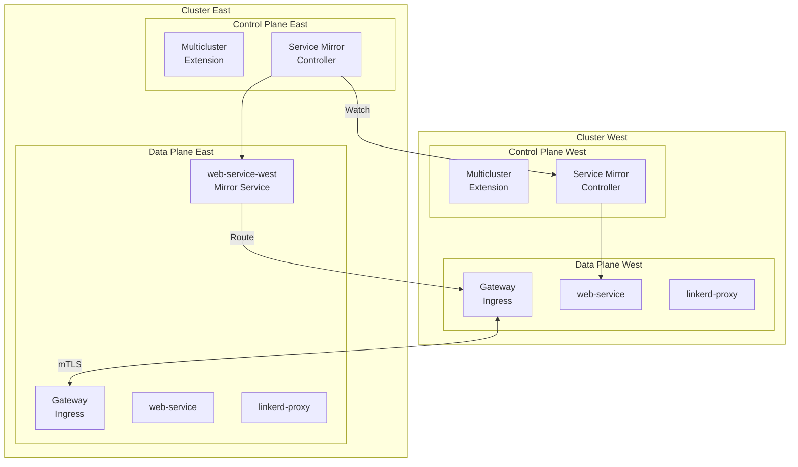
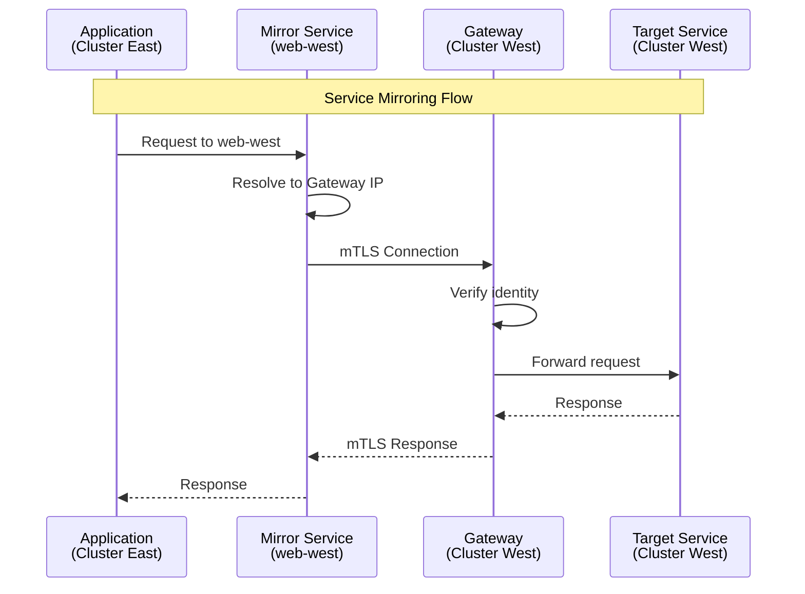
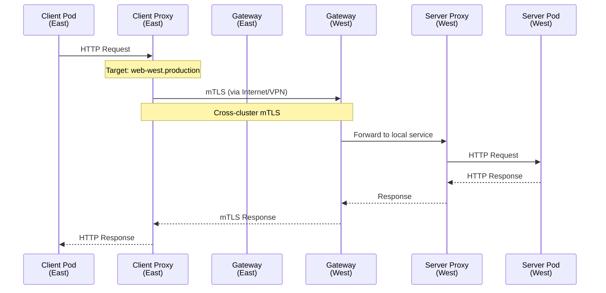
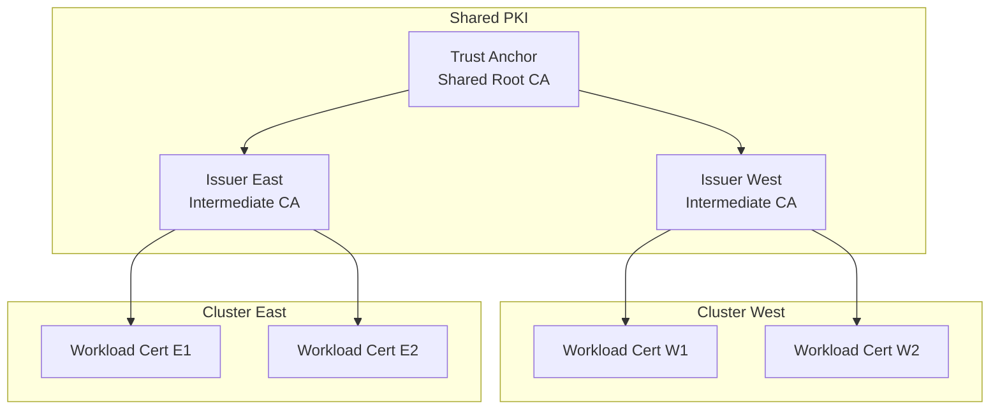

# Linkerd Multi-cluster

> **Versiones compatibles**: Linkerd 2.16+
> **Última actualización**: February 22, 2026

## Descripción general

La funcionalidad multi-cluster de Linkerd proporciona comunicación segura y transparente entre múltiples clusters de Kubernetes mediante una arquitectura de Service Mirroring. Este documento cubre la configuración multi-cluster, el mirroring de servicios, el failover y la configuración en entornos EKS.

## Arquitectura multi-cluster



## Concepto de Service Mirroring

### Cómo funciona



### Características de Service Mirroring

| Característica | Descripción |
|----------------|-------------|
| Descubrimiento transparente | Los servicios remotos aparecen como servicios locales |
| Seguridad mTLS | La comunicación entre clusters está cifrada |
| Health Checks | Comprobaciones automáticas de disponibilidad para servicios remotos |
| Load Balancing | Distribución basada en latencia con el algoritmo EWMA |

## Configuración multi-cluster

### Requisitos previos

```bash
# Linkerd must be installed on both clusters
# Must use the same Trust Anchor (important!)

# Check cluster contexts
kubectl config get-contexts

# Example contexts:
# - west (us-west-2)
# - east (us-east-1)
```

### Crear un Trust Anchor compartido

```bash
# Both clusters need the same Trust Anchor for mutual trust

# Create Trust Anchor
step certificate create root.linkerd.cluster.local ca.crt ca.key \
  --profile root-ca \
  --no-password \
  --insecure \
  --not-after=87600h

# Create Issuer for each cluster
# Cluster West
step certificate create identity.linkerd.cluster.local issuer-west.crt issuer-west.key \
  --profile intermediate-ca \
  --ca ca.crt \
  --ca-key ca.key \
  --no-password \
  --insecure \
  --not-after=8760h

# Cluster East
step certificate create identity.linkerd.cluster.local issuer-east.crt issuer-east.key \
  --profile intermediate-ca \
  --ca ca.crt \
  --ca-key ca.key \
  --no-password \
  --insecure \
  --not-after=8760h
```

### Instalar Linkerd en ambos clusters

```bash
# Install on Cluster West
kubectl config use-context west

linkerd install --crds | kubectl apply -f -
linkerd install \
  --identity-trust-anchors-file ca.crt \
  --identity-issuer-certificate-file issuer-west.crt \
  --identity-issuer-key-file issuer-west.key \
  | kubectl apply -f -

# Install on Cluster East
kubectl config use-context east

linkerd install --crds | kubectl apply -f -
linkerd install \
  --identity-trust-anchors-file ca.crt \
  --identity-issuer-certificate-file issuer-east.crt \
  --identity-issuer-key-file issuer-east.key \
  | kubectl apply -f -
```

### Instalar la extensión Multicluster

```bash
# Cluster West
kubectl config use-context west
linkerd multicluster install | kubectl apply -f -
linkerd multicluster check

# Cluster East
kubectl config use-context east
linkerd multicluster install | kubectl apply -f -
linkerd multicluster check
```

### Vincular clusters

```bash
# Register West cluster credentials to East
kubectl config use-context west

# Create Link (so East can see West)
linkerd multicluster link --cluster-name west | kubectl --context=east apply -f -

# Verify connection
kubectl --context=east get links

# Check gateway status
linkerd --context=east multicluster gateways

# Expected output:
# CLUSTER  ALIVE    NUM_SVC  LATENCY
# west     True           3      5ms
```

### Conexión bidireccional

```bash
# East -> West connection
kubectl config use-context east
linkerd multicluster link --cluster-name east | kubectl --context=west apply -f -

# Verify on both sides
linkerd --context=west multicluster gateways
linkerd --context=east multicluster gateways
```

## Exportación e importación de servicios

### Exportar servicios

```yaml
# Export service from West cluster
apiVersion: v1
kind: Service
metadata:
  name: web
  namespace: production
  labels:
    mirror.linkerd.io/exported: "true"  # Export with this label
spec:
  selector:
    app: web
  ports:
  - port: 80
    targetPort: 8080
```

```bash
# Or add label to existing service
kubectl --context=west label svc web -n production mirror.linkerd.io/exported=true
```

### Verificar los servicios mirror

```bash
# Check mirror services in East cluster
kubectl --context=east get svc -n production

# Expected output:
# NAME        TYPE        CLUSTER-IP      PORT(S)
# web         ClusterIP   10.100.0.1      80/TCP      # Local service
# web-west    ClusterIP   10.100.0.2      80/TCP      # Mirrored from West

# Check endpoints
kubectl --context=east get endpoints web-west -n production
```

### Usar servicios mirror

```yaml
# Call West service from application in East cluster
apiVersion: apps/v1
kind: Deployment
metadata:
  name: client
  namespace: production
spec:
  template:
    spec:
      containers:
      - name: client
        image: client:latest
        env:
        # Local service
        - name: WEB_URL
          value: "http://web.production.svc.cluster.local"
        # West cluster service
        - name: WEB_WEST_URL
          value: "http://web-west.production.svc.cluster.local"
```

## División de tráfico entre clusters

### TrafficSplit para la distribución de tráfico entre clusters

```yaml
# Split traffic between local and West in East cluster
apiVersion: split.smi-spec.io/v1alpha2
kind: TrafficSplit
metadata:
  name: web-split
  namespace: production
spec:
  service: web  # Main service
  backends:
  - service: web          # Local (East)
    weight: 80
  - service: web-west     # Remote (West)
    weight: 20
```

### Configuración de failover

```yaml
# Default: local priority, failover to remote on failure
apiVersion: split.smi-spec.io/v1alpha2
kind: TrafficSplit
metadata:
  name: web-failover
  namespace: production
spec:
  service: web
  backends:
  - service: web          # Primary (local)
    weight: 100
  - service: web-west     # Backup (remote)
    weight: 0
# Manual weight adjustment required when local service fails
```

### Failover automático (con Flagger)

```yaml
# Configure automatic failover with Flagger
apiVersion: flagger.app/v1beta1
kind: Canary
metadata:
  name: web
  namespace: production
spec:
  targetRef:
    apiVersion: apps/v1
    kind: Deployment
    name: web

  service:
    port: 80

  analysis:
    interval: 30s
    threshold: 3
    metrics:
    - name: request-success-rate
      thresholdRange:
        min: 99
      interval: 1m

    # Failover to remote cluster on failure
    webhooks:
    - name: failover-to-west
      type: rollback
      url: http://flagger-loadtester/failover
      metadata:
        cmd: |
          kubectl patch trafficsplit web-split -p '{"spec":{"backends":[{"service":"web","weight":0},{"service":"web-west","weight":100}]}}'
```

## Flujo de tráfico entre clusters



## Patrones multi-cluster de EKS

### Configuración multirregión

```bash
# Create clusters (eksctl)
# US West region
eksctl create cluster \
  --name linkerd-west \
  --region us-west-2 \
  --nodegroup-name workers \
  --node-type m5.large \
  --nodes 3

# US East region
eksctl create cluster \
  --name linkerd-east \
  --region us-east-1 \
  --nodegroup-name workers \
  --node-type m5.large \
  --nodes 3
```

### Configuración de Gateway NLB

```yaml
# multicluster-values.yaml (for EKS)
gateway:
  serviceType: LoadBalancer
  serviceAnnotations:
    # Use NLB
    service.beta.kubernetes.io/aws-load-balancer-type: "nlb"
    # Internet facing (accessible from other regions)
    service.beta.kubernetes.io/aws-load-balancer-scheme: "internet-facing"
    # Cross-zone load balancing
    service.beta.kubernetes.io/aws-load-balancer-cross-zone-load-balancing-enabled: "true"
    # IP target
    service.beta.kubernetes.io/aws-load-balancer-nlb-target-type: "ip"
```

```bash
# Install with Helm
helm install linkerd-multicluster linkerd/linkerd-multicluster \
  -n linkerd-multicluster \
  --create-namespace \
  -f multicluster-values.yaml
```

### Private Link (VPC Peering)

```yaml
# Internal-only NLB configuration
gateway:
  serviceType: LoadBalancer
  serviceAnnotations:
    service.beta.kubernetes.io/aws-load-balancer-type: "nlb"
    service.beta.kubernetes.io/aws-load-balancer-scheme: "internal"
    service.beta.kubernetes.io/aws-load-balancer-nlb-target-type: "ip"

# Requires VPC Peering or Transit Gateway connection
```

### Configuración de múltiples cuentas

```bash
# Cluster in Account A
eksctl create cluster \
  --name linkerd-account-a \
  --region us-west-2

# Cluster in Account B
eksctl create cluster \
  --name linkerd-account-b \
  --region us-west-2

# Cross-account IAM role setup required
# VPC Peering or PrivateLink configuration required
```

## Seguridad entre clusters

### Trust Anchor compartido



### Políticas de autorización por cluster

```yaml
# Allow only specific services from East cluster in West cluster
apiVersion: policy.linkerd.io/v1beta2
kind: ServerAuthorization
metadata:
  name: allow-east-cluster
  namespace: production
spec:
  server:
    name: web-server
  client:
    meshTLS:
      identities:
        # Allow only specific service from East cluster
        - "spiffe://root.linkerd.cluster.local/ns/production/sa/api-gateway"
```

## Observabilidad (multi-cluster)

### Métricas entre clusters

```bash
# Check gateway status
linkerd multicluster gateways

# Expected output:
# CLUSTER  ALIVE    NUM_SVC  LATENCY
# west     True           5      10ms
# east     True           3       8ms

# Mirror service status
linkerd viz stat deploy -n production --to svc/web-west
```

### Federación de Prometheus

```yaml
# Collect metrics from each cluster in central Prometheus
# prometheus-federation.yaml
scrape_configs:
  - job_name: 'federate-west'
    honor_labels: true
    metrics_path: '/federate'
    params:
      'match[]':
        - '{__name__=~"response_total|request_total|response_latency_ms_bucket"}'
    static_configs:
      - targets:
        - 'prometheus-west.monitoring:9090'
    relabel_configs:
      - target_label: cluster
        replacement: west

  - job_name: 'federate-east'
    honor_labels: true
    metrics_path: '/federate'
    params:
      'match[]':
        - '{__name__=~"response_total|request_total|response_latency_ms_bucket"}'
    static_configs:
      - targets:
        - 'prometheus-east.monitoring:9090'
    relabel_configs:
      - target_label: cluster
        replacement: east
```

### Dashboard entre clusters

```promql
# Success rate by cluster
sum(rate(response_total{classification="success"}[5m])) by (cluster)
/
sum(rate(response_total[5m])) by (cluster)

# Cross-cluster traffic latency
histogram_quantile(0.99,
  sum(rate(response_latency_ms_bucket{dst_cluster!=""}[5m])) by (le, src_cluster, dst_cluster)
)
```

## Solución de problemas

### Problemas de conexión

```bash
# Check gateway connection
linkerd multicluster gateways

# If ALIVE is False:
# 1. Check network connectivity
kubectl --context=east get svc -n linkerd-multicluster

# 2. Check Gateway logs
kubectl --context=west logs -n linkerd-multicluster deploy/linkerd-gateway

# 3. Check probe status
linkerd --context=east diagnostics proxy-metrics -n linkerd-multicluster deploy/linkerd-gateway | grep probe
```

### Problemas de Service Mirroring

```bash
# Mirror controller logs
kubectl --context=east logs -n linkerd-multicluster deploy/linkerd-service-mirror-west

# Check mirror services
kubectl --context=east get svc -n production | grep west

# Check endpoints
kubectl --context=east get endpoints -n production | grep west
```

### Problemas de certificados

```bash
# Verify Trust Anchor match
# Both clusters must have the same Trust Anchor

kubectl --context=west get cm linkerd-config -n linkerd -o yaml | grep -A5 "trustAnchorsPem"
kubectl --context=east get cm linkerd-config -n linkerd -o yaml | grep -A5 "trustAnchorsPem"

# Validate certificate chain
linkerd --context=west check --proxy
linkerd --context=east check --proxy
```

## Próximos pasos

- [Prácticas recomendadas](./07-best-practices.md): Configuración multi-cluster de producción

## Referencias

- [Linkerd Multi-cluster](https://linkerd.io/2/features/multicluster/)
- [Service Mirroring](https://linkerd.io/2/tasks/installing-multicluster/)
- [Comunicación multi-cluster](https://linkerd.io/2/tasks/multicluster/)
