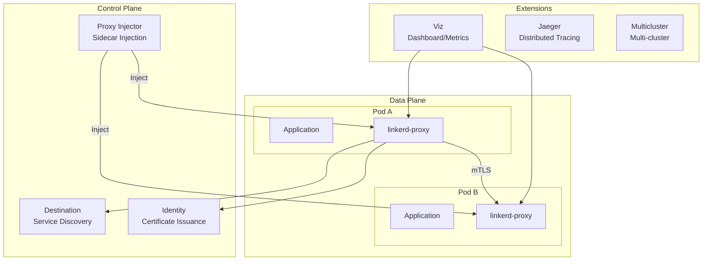

# Linkerd

> **Versiones compatibles**: Linkerd 2.16+ **Última actualización**: July 21, 2026

### Actualización de julio de 2026: edge-26.7.1 — No se permiten solicitudes a puertos de Service no definidos

La versión edge-26.7.1, publicada el 16 de julio de 2026, incluye una corrección **que cambia el comportamiento (incompatible)**. Anteriormente, si se definía un ServiceProfile para el Service de destino, aún se permitían solicitudes a puertos no definidos en el Service. Ahora, el controlador de destino devuelve un `DestinationProfile` vacío para las solicitudes `GetProfile` en puertos no definidos en el Service, lo que hace que el proxy recurra a la API de políticas de cliente, que devuelve correctamente un filtro Forbidden y rechaza la conexión. Si alguna carga de trabajo se comunica a través de puertos no declarados en sus recursos Service, depure las definiciones de puertos antes de actualizar. Consulte las [notas de la versión](https://github.com/linkerd/linkerd2/releases/tag/edge-26.7.1) para obtener más detalles.

## Descripción general

Linkerd es un proyecto graduado de CNCF (Cloud Native Computing Foundation) y una solución ligera de service mesh. Desarrollado originalmente por Buoyant en 2016, fue el proyecto que acuñó por primera vez el término "service mesh". Los valores fundamentales de Linkerd son la simplicidad, la seguridad predeterminada y una sobrecarga mínima de recursos, lo que hace que la comunicación entre servicios en entornos Kubernetes sea segura y confiable.

### Propuestas de valor fundamentales

| Valor                   | Descripción                                                              |
| ----------------------- | ------------------------------------------------------------------------ |
| **Simplicidad**         | Valores predeterminados razonables que funcionan de inmediato sin configuración compleja |
| **Seguridad predeterminada** | Cifrado mTLS automático sin ninguna configuración                      |
| **Ligero**              | Micro-proxy escrito en Rust con uso mínimo de recursos (~10MB de memoria)  |
| **Alto rendimiento**    | Menos de 1ms de sobrecarga de latencia p99                                       |
| **Facilidad operativa** | Actualizaciones sencillas y herramientas de depuración intuitivas                            |

## Descripción general de la arquitectura de Linkerd



## Comparación de service mesh

Compare Linkerd, Istio y Cilium Service Mesh para comprender las características de cada solución.

| Característica                | Linkerd               | Istio                  | Cilium Service Mesh     |
| ---------------------- | --------------------- | ---------------------- | ----------------------- |
| **Proxy**              | linkerd2-proxy (Rust) | Envoy (C++)            | eBPF + Envoy (opcional) |
| **Uso de recursos**     | Muy bajo (~10MB)     | Alto (~50-100MB)      | Bajo (modo eBPF)         |
| **Sobrecarga de latencia**   | <1ms p99              | 2-5ms p99              | <1ms (modo eBPF)        |
| **Complejidad**         | Baja                   | Alta                   | Media                  |
| **mTLS**               | Automático (predeterminado)   | Requiere configuración | Requiere configuración  |
| **Gestión de tráfico** | Básica (SMI)           | Muy completa              | Básica                   |
| **Observabilidad**      | Buena (integrada)       | Excelente              | Buena (Hubble)           |
| **Multicluster**      | Reflejo de Service     | Configuración compleja          | ClusterMesh             |
| **Integración CNI**    | Independiente              | Independiente              | Nativa                  |
| **Estado de CNCF**        | Graduado             | Graduado              | Graduado               |
| **Curva de aprendizaje**     | Suave                | Pronunciada                  | Media                  |
| **Comunidad**          | Activa                | Muy activa            | Activa                  |

## Cuándo elegir Linkerd

### Casos de uso adecuados

1. **Cuando la simplicidad es importante**
   * Cuando se necesitan capacidades básicas de service mesh en lugar de funciones complejas de gestión de tráfico
   * Equipos de operaciones pequeños o equipos con experiencia limitada en service mesh
   * Cuando la adopción rápida y una curva de aprendizaje baja son prioridades
2. **Cuando la eficiencia de recursos es crítica**
   * Entornos que ejecutan muchos Pods por nodo
   * Cuando se debe minimizar la sobrecarga del sidecar
   * Aplicaciones sensibles a la latencia
3. **Cuando la seguridad debe ser predeterminada**
   * Cuando se necesita mTLS automático sin configuración
   * Implementación de red de confianza cero
   * Requisitos de cifrado para cumplimiento normativo
4. **Cuando se requiere simplicidad operativa**
   * Preferencia por procesos de actualización sencillos
   * CRDs y configuración mínimos
   * Herramientas de CLI intuitivas

### Casos de uso menos adecuados

1. **Necesidades avanzadas de gestión de tráfico**
   * Reglas de enrutamiento complejas, manipulación de encabezados
   * Algoritmos avanzados de balanceo de carga
   * Amplio soporte de protocolos (más allá de gRPC)
2. **Integración de cargas de trabajo de VM**
   * Integración con cargas de trabajo fuera de Kubernetes
   * Entornos mixtos de VM y contenedores
3. **Entornos multiprotocolo a gran escala**
   * Necesidad de soporte para diversos protocolos (Kafka, MongoDB, etc.)
   * Requisitos complejos de extensiones Wasm

## Estructura de la documentación

Esta sección cubre las principales características y métodos operativos de Linkerd:

| Documento                                       | Descripción                                                                         |
| ---------------------------------------------- | ----------------------------------------------------------------------------------- |
| [Instalación y configuración](01-installation.md)   | Instalación de CLI, instalación del control plane, configuración de HA, extensiones          |
| [Arquitectura](02-architecture.md)             | Detalles del control plane, data plane y jerarquía de certificados                            |
| [Gestión de tráfico](03-traffic-management.md) | ServiceProfile, TrafficSplit, reintentos, tiempos de espera, despliegues canary                 |
| [Seguridad](04-security.md)                     | mTLS, políticas de autorización, gestión de certificados, integración de CA externa       |
| [Observabilidad](05-observability.md)           | Métricas, dashboards, herramientas de CLI, integración de Prometheus/Grafana, rastreo distribuido |
| [Multicluster](06-multi-cluster.md)           | Reflejo de Service, vinculación de clústeres, failover                                        |
| [Mejores prácticas](07-best-practices.md)         | Lista de verificación de producción, ajuste de rendimiento, resolución de problemas                           |

## Inicio rápido

### 1. Instalar Linkerd CLI

```bash
# Linux/macOS
curl --proto '=https' --tlsv1.2 -sSfL https://run.linkerd.io/install | sh
export PATH=$HOME/.linkerd2/bin:$PATH

# Verify installation
linkerd version
```

### 2. Validación previa del clúster

```bash
# Verify cluster meets Linkerd requirements
linkerd check --pre
```

### 3. Instalar Linkerd

```bash
# Install CRDs
linkerd install --crds | kubectl apply -f -

# Install control plane
linkerd install | kubectl apply -f -

# Verify installation
linkerd check
```

### 4. Agregar la aplicación al mesh

```bash
# Enable automatic injection for namespace
kubectl annotate namespace my-app linkerd.io/inject=enabled

# Restart existing deployments to inject proxy
kubectl rollout restart deployment -n my-app

# Or manually inject
kubectl get deploy -n my-app -o yaml | linkerd inject - | kubectl apply -f -
```

### 5. Instalar y acceder al dashboard

```bash
# Install Viz extension
linkerd viz install | kubectl apply -f -

# Open dashboard
linkerd viz dashboard
```

## Comprobación del estado de los componentes de Linkerd

```bash
# Full status check
linkerd check

# Control plane status
linkerd check --proxy

# Data plane proxy status
linkerd viz stat deploy -n my-app

# Real-time traffic monitoring
linkerd viz tap deploy/my-app -n my-app
```

## Conceptos fundamentales

### Proxy de data plane

Linkerd inyecta un contenedor sidecar llamado `linkerd-proxy` en cada Pod. Este proxy:

* Está escrito en Rust para seguridad de memoria y alto rendimiento
* Usa solo ~10MB de memoria
* Añade menos de 1ms de latencia
* Gestiona todo el tráfico entrante/saliente
* Aplica automáticamente el cifrado mTLS

### Descubrimiento de servicios

El componente Destination supervisa los servicios de Kubernetes y proporciona información de endpoints a los proxies:

* Actualizaciones de endpoints en tiempo real
* Información de enrutamiento basada en ServiceProfile
* Distribución de políticas de división de tráfico

### mTLS automático

Linkerd cifra automáticamente todo el tráfico del mesh sin configuración:

1. El componente Identity emite certificados a cada proxy
2. Autenticación TLS mutua entre proxies
3. Renovación automática de certificados (predeterminado de 24 horas)

## Próximos pasos

1. [**Instalación y configuración**](01-installation.md): Guía detallada para instalar Linkerd en su clúster
2. [**Arquitectura**](02-architecture.md): Comprensión de la estructura interna de Linkerd
3. [**Cuestionarios**](https://github.com/Atom-oh/kubernetes-docs/blob/main/en/quizzes/service-mesh/linkerd/README.md): Pruebe sus conocimientos

## Referencias

* [Documentación oficial de Linkerd](https://linkerd.io/2/overview/)
* [Linkerd GitHub](https://github.com/linkerd/linkerd2)
* [Página del proyecto Linkerd de CNCF](https://www.cncf.io/projects/linkerd/)
* [Comunidad de Slack de Linkerd](https://slack.linkerd.io/)
* [Blog de Buoyant](https://buoyant.io/blog)
