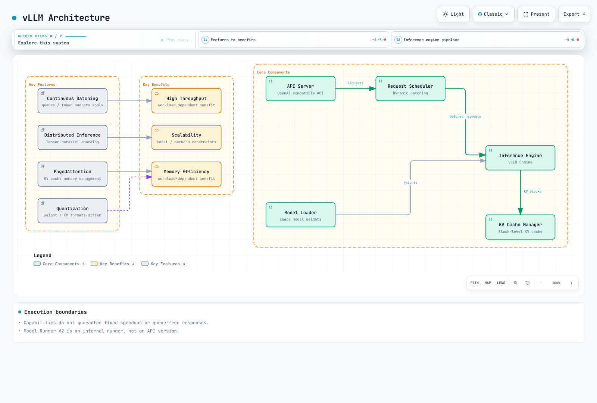
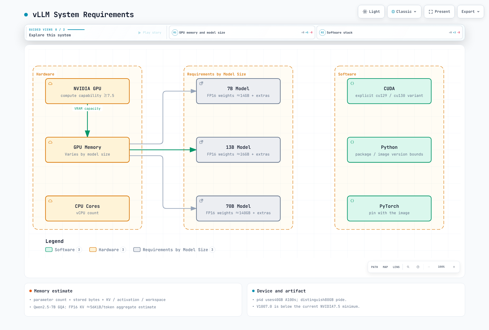
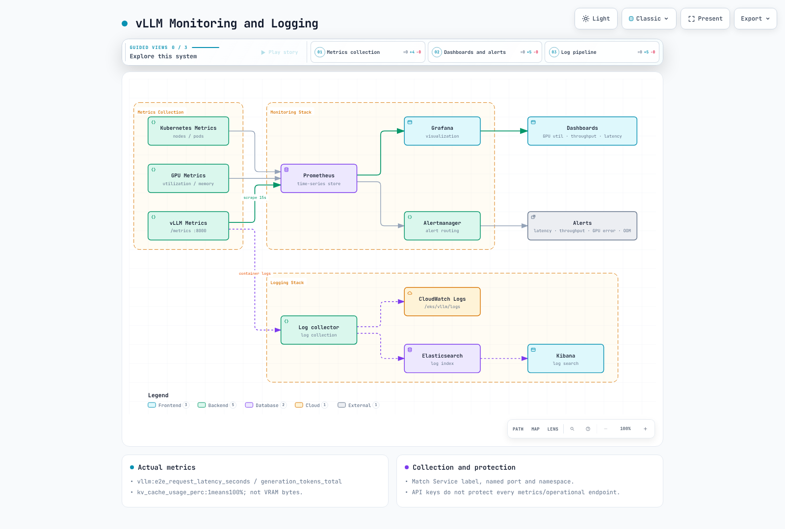
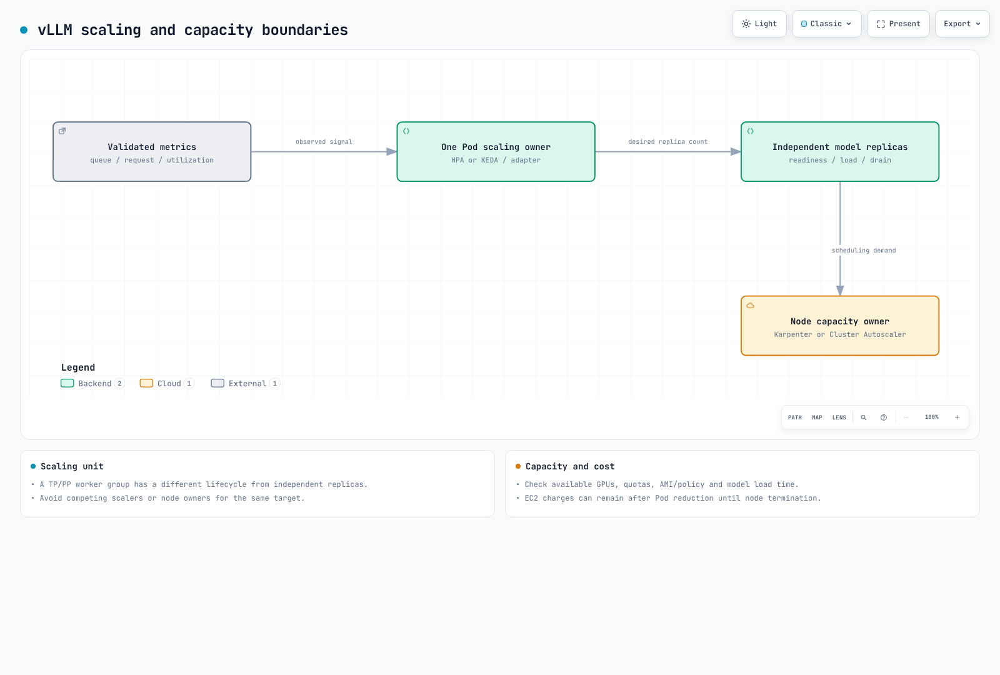
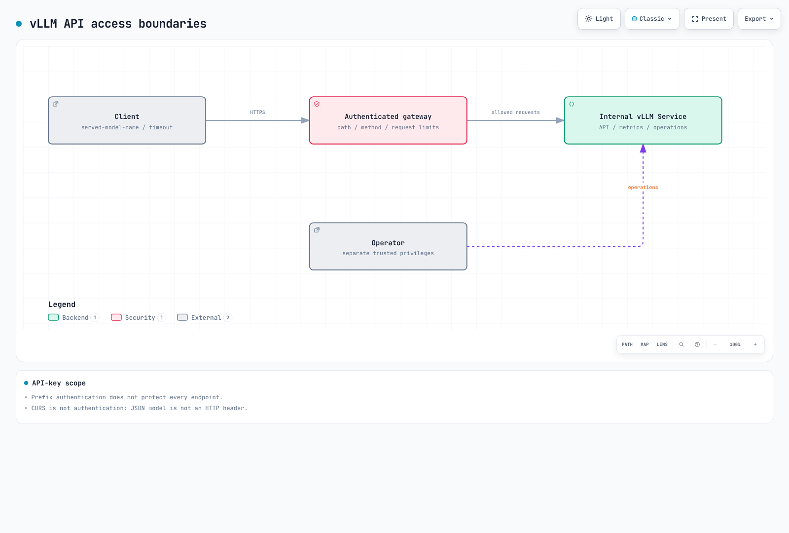

# vLLM デプロイと最適化

> **レビュー基準**: vLLM 0.29.0、CUDA 12.9 イメージバリアント。過去の 0.6.4.post1 ベンチマークは分離
> **最終更新**: September 12, 2026

vLLM は、生成モデルおよびサポート対象のマルチモーダル／pooling ワークロード向けのオープンソース推論エンジンです。「Vector Language Model」と展開してはいけません。この章では、普遍的な高速化やモデルサポートを保証することなく、特定のリリースと EKS の運用境界を確認します。

## ラボ環境のセットアップ

基準バージョンは、2026 年 9 月 9 日にリリースされた [v0.29.0](https://github.com/vllm-project/vllm/releases/tag/v0.29.0) です。デフォルトの PyPI/Docker パスは CUDA 13.0 を使用し、別途 v0.29.0-cu129 イメージがあります。一部のタグ付きインストール文書では CUDA 12.9 をデフォルトとしていますが、実際のイメージバリアント／digest を確認してください。

PyPI には Python >=3.10, <3.15 が必要ですが、タグ付き GPU ガイドでは 3.10～3.13 が記載されています。これはすべての Python/PyTorch/CUDA の組み合わせを保証するものではありません。NVIDIA パスには compute capability 7.5 以降が必要であり、V100 (7.0) は対象外です。Kernel、dtype、quantization によっては、追加のデバイス要件が課されることがあります。

[AI/ML workloads](01-ai-ml-workloads.md) にある AMI/driver/device-plugin の条件に従ってください。CUDA イメージは Trainium/Inferentia のそのまま使えるデプロイではありません。Neuron またはその他のプラットフォーム plugin は個別に検証してください。g5.2xlarge や 50GB を普遍的な最小値と見なすのではなく、モデル／cache／同時実行数に応じて GPU、RAM、disk を見積もってください。

## vLLM の概要

vLLM は、次の特徴を持つ LLM 推論エンジンです。



[🔍 インタラクティブ図を表示](https://www.atomai.click/kubernetes-docs/archmaps/en-ai-ml-02-vllm-deployment-0.html)

### 機能とサポート境界

| 機能 | 意味と条件 |
| --- | --- |
| PagedAttention / KV cache | token block を管理して無駄を削減します。kernel/cache layout はモデル／backend に依存します |
| Continuous batching | scheduler が各ステップで処理を調整します。即時受付、queueing、固定的な高速化を保証するものではありません |
| TP / PP / DP / EP | Tensor、pipeline、data、expert parallelism は異なる軸であり、モデル／backend／network のサポートが必要です |
| Precision / quantization | FP16/BF16 dtype と FP8/INT8/INT4/AWQ format、および weight quantization と KV-cache quantization を区別してください |
| Prefix caching / chunked prefill | サポート対象モデルのデフォルトと override を確認してください。完全なレスポンス caching や精度向上ではありません |
| Structured outputs | response_format または structured_outputs は format を制約します。真実性と業務上の有効性には別途チェックが必要です |
| Tool calling | モデル／chat template／parser と client execution loop が必要です。server が自動的に tool を実行することはありません |
| LoRA | モデルサポートと adapter registration が必要です。リクエストの model だけを変更しても adapter は load されません |

0.29.0 では Model Runner V2 がデフォルトの runner になります。これは OpenAI-compatible API のバージョンでも、別個の「vLLM Engine V2」でもありません。model-family 名はすべてのサイズ、quantization、vision バリアントを保証しません。architecture、artifact/tokenizer、chat template、kernel を確認してください。

### 現行 CLI 機能の設定

非推奨の python -m vllm.entrypoints.openai.api_server ではなく vllm serve を使用してください。以前の --speculative-model/--num-speculative-tokens オプションは、現行 CLI では --speculative-config に置き換えられています。

```bash
# Syntax when compatible target/draft models and sufficient memory are prepared.
vllm serve /models/target \
  --speculative-config '{"model":"/models/draft","method":"draft_model","num_speculative_tokens":5}'
```

これは syntax を示すものであり、これらのモデルファイルを提供したり高速化を確立したりするものではありません。draft acceptance、追加メモリ、通信コストにより、得られる効果が相殺されることがあります。

起動時 LoRA は --enable-lora --lora-modules adapter=/models/adapter で登録します。runtime load/unload には、別途 VLLM_ALLOW_RUNTIME_LORA_UPDATING の opt-in と制限された operator path が必要です。--enable-auto-tool-choice には適切な --tool-call-parser が必要です。multimodal URL にも、SSRF control、許可 domain、download/decode limit が必要です。

## システム要件

EKS 上で vLLM をデプロイするためのシステム要件：



[🔍 インタラクティブ図を表示](https://www.atomai.click/kubernetes-docs/archmaps/en-ai-ml-02-vllm-deployment-1.html)

weight memory の見積もりは、parameter count × 保存バイト数から始めます。70B の FP16/BF16 weight のみでは約 140GB となるため、80GB は普遍的な 70B の要件ではありません。KV cache、activation、CUDA graph/workspace、communication buffer を追加し、quantization metadata と複製された tensor を考慮してください。

一般的な dense-attention KV の推定値を以下に示します。MHA 専用の式から hidden size を代用するのではなく、GQA/MQA には KV-head count を使用してください。

```text
KV bytes ≈ 2 × layers × KV_heads × head_dim × cached_tokens × bytes_per_element
```

cached_tokens は、同時リクエスト間で保持される token の合計です。TP sharding/replication、sliding window、MLA、hybrid architecture は個別に扱う必要があります。現行の Qwen2.5-7B config は 28 layer、4 KV head、head dimension 128 です。element あたり 2 byte とすると約 56KiB/token、1 つの 4096-token sequence では 224MiB です。これは集約された推定値であり、GPU あたりまたはモデル全体の実測 memory ではありません。

p4d.24xlarge は 40GB A100 を使用します。80GB A100 の p4de instance と区別してください。p5/g6/g6e およびその他の選択肢は、リージョンの capacity、driver、ワークロード要件と照らして比較してください。GPU あたり CPU 4 core、または weight の 2 倍の RAM といった固定ルールは、計測の代わりにはなりません。

## EKS インフラストラクチャ設定


[🔍 インタラクティブ図を表示](https://www.atomai.click/kubernetes-docs/archmaps/en-ai-ml-02-vllm-deployment-2.html)

## Storage とモデルの準備

FSx for Lustre は選択肢の 1 つであり、必須でも普遍的に最適でもありません。local NVMe/EBS、再利用可能な cache、object storage、shared filesystem を、load 時間、コスト、同時実行性で比較してください。emptyDir は container restart 後も残存できますが、Pod の削除／再作成後は残存しません。

[static FSx PV/PVC and dynamic provisioning](01-ai-ml-workloads.md#storage-and-caching) を区別してください。Hugging Face snapshot_download は S3 からではなく Hugging Face から download します。repository revision、integrity、license、access permission を記録してください。gated model の場合は token を file として mount し、その file を読み取る download stage を使用してください。実行可能な remote code をデフォルトで trust してはいけません。

以下の例では、token を使用せず、public Qwen3-0.6B の検証済み revision を使用します。その emptyDir cache は Pod 再作成後に再度 download されます。multi-node worker では、同じモデル revision/path が必要です。

## vLLM デプロイ

### Deployment アーキテクチャ

次の図は、EKS 上に vLLM をデプロイするための 2 つの主要なアーキテクチャを示しています。


[🔍 インタラクティブ図を表示](https://www.atomai.click/kubernetes-docs/archmaps/en-ai-ml-02-vllm-deployment-3.html)

### Single-GPU 設定例

これは **GPU 実行前にレビューするための template** です。namespace と GPU driver/plugin を準備してください。digest は v0.29.0-cu129 amd64 artifact を識別し、model revision は検査した public Qwen3-0.6B snapshot を識別します。この audit では image pull、non-root 実行、kernel compilation、inference は実行されていないため、環境での検証が必要です。

Recreate は追加の GPU replica を必要としない一方、更新時の downtime が発生します。startupProbe は起動に約 15 分を許容します。readiness は SLA ではありません。Service は ClusterIP であり、public ingress を作成しません。

```yaml
apiVersion: apps/v1
kind: Deployment
metadata:
  name: vllm-demo
  namespace: ml-inference
spec:
  replicas: 1
  strategy:
    type: Recreate
  selector:
    matchLabels:
      app: vllm-demo
  template:
    metadata:
      labels:
        app: vllm-demo
    spec:
      automountServiceAccountToken: false
      nodeSelector:
        kubernetes.io/arch: amd64
      securityContext:
        runAsNonRoot: true
        runAsUser: 1000
        runAsGroup: 1000
        fsGroup: 1000
        seccompProfile:
          type: RuntimeDefault
      containers:
        - name: vllm
          image: vllm/vllm-openai@sha256:3e10e8189823e0f7ae4620c271bcdaaf64127ec7d0edc351591a508498b7684a
          command: ["vllm", "serve"]
          args:
            - Qwen/Qwen3-0.6B
            - --revision=c1899de289a04d12100db370d81485cdf75e47ca
            - --served-model-name=qwen3-demo
            - --dtype=float16
            - --max-model-len=2048
            - --max-num-seqs=8
            - --gpu-memory-utilization=0.80
            - --host=0.0.0.0
            - --port=8000
          env:
            - name: HF_HOME
              value: /cache/huggingface
            - name: XDG_CACHE_HOME
              value: /cache
            - name: XDG_CONFIG_HOME
              value: /cache/config
            - name: VLLM_NO_USAGE_STATS
              value: "1"
            - name: VLLM_CACHE_ROOT
              value: /cache/vllm
            - name: TORCHINDUCTOR_CACHE_DIR
              value: /cache/torchinductor
            - name: TRITON_CACHE_DIR
              value: /cache/triton
          ports:
            - name: http
              containerPort: 8000
          resources:
            requests:
              cpu: "2"
              memory: 4Gi
              ephemeral-storage: 4Gi
            limits:
              cpu: "4"
              memory: 12Gi
              ephemeral-storage: 12Gi
              nvidia.com/gpu: 1
          securityContext:
            allowPrivilegeEscalation: false
            readOnlyRootFilesystem: true
            capabilities:
              drop: [ALL]
          startupProbe:
            httpGet:
              path: /health
              port: http
            periodSeconds: 10
            failureThreshold: 90
          readinessProbe:
            httpGet:
              path: /health
              port: http
            periodSeconds: 10
          volumeMounts:
            - name: cache
              mountPath: /cache
            - name: tmp
              mountPath: /tmp
            - name: shm
              mountPath: /dev/shm
      volumes:
        - name: cache
          emptyDir:
            sizeLimit: 8Gi
        - name: tmp
          emptyDir:
            sizeLimit: 1Gi
        - name: shm
          emptyDir:
            medium: Memory
            sizeLimit: 2Gi
---
apiVersion: v1
kind: Service
metadata:
  name: vllm-demo
  namespace: ml-inference
  labels:
    app: vllm-demo
spec:
  type: ClusterIP
  selector:
    app: vllm-demo
  ports:
    - name: http
      port: 8000
      targetPort: http
```

### Multi-Node Sharding と独立した Replica の比較

1 つの model replica を sharding するには、TP/PP と Ray または multiprocessing の coordination が必要です。独立した API-server replica はそれぞれモデルを load して horizontal scaling を提供します。これらは異なる設計です。

0.29.0 は multiprocessing の --nnodes、--node-rank、--master-addr、--master-port をサポートしています。古い --rank、--tensor-parallel-rank、--distributed-init-method の例は、これらの CLI オプションではありません。各 8 GPU を提供する準備済みの 2 node では、command の形は次のとおりです。

```bash
# node0: substitute an actual trusted head IP and identical prepared model path.
vllm serve /models/model --distributed-executor-backend mp \
  --tensor-parallel-size 8 --pipeline-parallel-size 2 \
  --nnodes 2 --node-rank 0 --master-addr 10.0.0.10 --master-port 29500
# node1: the worker does not start a duplicate API server.
vllm serve /models/model --distributed-executor-backend mp \
  --tensor-parallel-size 8 --pipeline-parallel-size 2 \
  --nnodes 2 --node-rank 1 --master-addr 10.0.0.10 --master-port 29500 --headless
```

これらの command は node、model file、connectivity を作成しません。Kubernetes には適切な concurrent worker creation、readiness 前の DNS、Pod ごとの VLLM_HOST_IP、internal connectivity、shared memory が必要です。Ray では、1 つの API entry point を --distributed-executor-backend ray で起動する前に、動作する cluster と互換性のある Ray dependency が必要です。[Ray](ray/README.md) を参照してください。internal communication port は private に保ってください。

## パフォーマンス最適化


[🔍 インタラクティブ図を表示](https://www.atomai.click/kubernetes-docs/archmaps/en-ai-ml-02-vllm-deployment-4.html)

### Memory、Scheduler、Communication オプション

0.29.0 の CacheConfig は gpu_memory_utilization のデフォルトを 0.92 としていますが、これはすべての process VRAM に対する hard cap ではありません。例では明示的に 0.80 を選択しています。--kv-cache-memory-bytes は自動 KV-cache sizing を override するため、option precedence を確認してください。

--swap-space は現行 CLI にはありません。weight CPU offload と KV offload は別個の capability/configuration であり、host RAM が GPU 制限を解決する保証ではありません。prefix caching はサポート対象モデルではデフォルトで有効になることがあります。chunked prefill もモデル依存です。queue limit、token budget、max-num-seqs、max-model-len は異なる control です。

EFA には、サポートされる EC2 device、AMI/plugin/network、AWS OFI NCCL/libfabric が必要です。作り物の NCCL_IB_ENABLE_RDMA flag や任意の mlx5/GID 設定を、普遍的なデフォルトとしてコピーしないでください。現行の NVIDIA/PyTorch variable と実際の backend log を確認してください。single-node の NCCL test は multi-node EFA のパフォーマンスを証明しません。

## 過去の計測: Single L4 GPU 上の Qwen2.5-7B

これらは、[2026 年 9 月 4 日の repository commit](https://github.com/Atom-oh/kubernetes-docs/commit/8622d388cb684dc4f68083af7be6d91f80b79106) で報告された過去の計測です。この audit では raw request result/server log または完全な client artifact は見つからず、実験を再実行していません。報告された数値は保持されており、現行 0.29.0 のパフォーマンスや独立して再現された結果として再分類していません。


[🔍 インタラクティブ図を表示](https://www.atomai.click/kubernetes-docs/archmaps/en-ai-ml-02-vllm-deployment-6.html)

### セットアップ

- **Cluster**: 専用の Karpenter NodePool（`bench-gpu`、オンデマンドの `g6.2xlarge` — 1x NVIDIA L4、24GB GPU memory、8 vCPU、32 GiB RAM）。`nvidia.com/gpu=true:NoSchedule` の taint があり、既存の `nvidia-device-plugin` daemonset に参加する label が設定され、実行直後に削除されました。
- **Server**: `vllm/vllm-openai:v0.6.4.post1`（2024-11-15 リリース — vLLM project はその後、prefix caching がデフォルトで有効な V1 engine をリリースしているため、現行 vLLM ではなく、この release line の snapshot として扱ってください）、モデル `Qwen/Qwen2.5-7B-Instruct`、`--dtype bfloat16 --max-model-len 4096 --gpu-memory-utilization 0.90`。quantization、speculative decoding、prefix caching なしの 1 precision（bf16、モデルの native dtype）— このページの別箇所で説明した通常のデフォルトです。
- **Client**: cluster **内部**（別の非 GPU node）の Job として実行された Python `ThreadPoolExecutor`。`vllm-server` ClusterIP Service を通じて `/v1/chat/completions` にアクセスしました。non-streaming、`temperature=0`、`max_tokens=128`、8 個の短い prompt を順番に使用（1～2 文の回答を求める Kubernetes concept question）。実際には、すべての response は 1～2 文で止まるのではなく、128-token cap に近い値で実行されました（3 つすべての concurrent batch で一貫して平均約 102 token）。これは concurrency level 間の throughput を同条件で比較するのに有用ですが、latency 数値を「短い質問への回答時間」として読む前に留意してください。
- **Cold start**: vLLM engine の startup log から `/health` endpoint が `200` を返すまで約 4.5 分 — 主に Hugging Face から Pod の ephemeral cache へ Qwen2.5-7B-Instruct weight 約 15 GB を download した時間です。image pull 時間は含まれていません。個別には計測されませんでした。

### 再現

```yaml
# NodePool (Karpenter) - dedicated, deleted after the run — nodeClassRef points at the cluster's existing GPU EC2NodeClass (AMI/subnets/SG), not shown here
apiVersion: karpenter.sh/v1
kind: NodePool
metadata: { name: bench-gpu }
spec:
  limits: { cpu: "16", memory: 128Gi, nvidia.com/gpu: "1" }
  template:
    metadata:
      labels: { node-type: bench-gpu, nvidia.com/device-plugin.config: default }
    spec:
      expireAfter: 6h
      nodeClassRef: { group: karpenter.k8s.aws, kind: EC2NodeClass, name: gpu }
      requirements:
        - { key: node.kubernetes.io/instance-type, operator: In, values: [g6.2xlarge] }
      taints: [{ key: nvidia.com/gpu, value: "true", effect: NoSchedule }]
---
# vLLM server (namespace bench-gpu) + the ClusterIP Service the client calls
apiVersion: apps/v1
kind: Deployment
metadata: { name: vllm-server, namespace: bench-gpu }
spec:
  replicas: 1
  selector: { matchLabels: { app: vllm-server } }
  template:
    metadata: { labels: { app: vllm-server } }
    spec:
      nodeSelector: { node-type: bench-gpu }
      tolerations: [{ key: nvidia.com/gpu, value: "true", effect: NoSchedule }]
      containers:
        - name: vllm
          image: vllm/vllm-openai:v0.6.4.post1
          args: ["--model", "Qwen/Qwen2.5-7B-Instruct", "--max-model-len", "4096",
                 "--gpu-memory-utilization", "0.90", "--dtype", "bfloat16"]
          ports: [{ containerPort: 8000 }]
          resources:
            limits: { nvidia.com/gpu: "1" }
            requests: { nvidia.com/gpu: "1", cpu: "3", memory: 20Gi }
          readinessProbe: { httpGet: { path: /health, port: 8000 }, initialDelaySeconds: 30, periodSeconds: 10, failureThreshold: 60 }
---
apiVersion: v1
kind: Service
metadata: { name: vllm-server, namespace: bench-gpu }
spec:
  selector: { app: vllm-server }
  ports: [{ port: 8000, targetPort: 8000 }]
```

manifest は報告された環境の一部を示します。namespace の作成、既存の EC2NodeClass、完全な client script は省略されているため、完全な再現を確立するものではありません。nvidia.com/device-plugin.config:default は、その shared DaemonSet 設定の条件であり、普遍的な scheduling label 要件ではありません。報告されたオンデマンドの主張にも、実際の過去の configuration が必要です。

### 結果

| Concurrency | Requests | Wall time | Client latency p50 / p90 | Client aggregate throughput | Server-reported peak generation throughput | GPU KV cache usage |
|---|---|---|---|---|---|---|
| 1 (serial) | 10 | ~53.2 s (リクエスト latency の合計) | 5.65 s / 7.43 s | リクエストあたり ~17-18 tokens/s | ~17 tokens/s | 0.1-0.2% |
| 4 | 16 | 27.78 s | 6.99 s / 7.88 s | 58.67 tokens/s | 65-66 tokens/s | 0.4-0.7% |
| 8 | 32 | 30.02 s | 7.18 s / 8.15 s | 109.04 tokens/s | 123-129 tokens/s | 0.8-1.4% |
| 16 | 64 | 31.35 s | 7.52 s / 8.74 s | 208.08 tokens/s | 最大 243 tokens/s | 1.5-2.6% |

Client aggregate throughput は、completion-token count を計測された wall time で割ったものです。Server Avg generation throughput は interval average です。最大の log 値は瞬間的な「真の peak」ではありません。time window、token accounting、HTTP boundary は異なるため、直接交換可能な metric ではありません。

### 解釈

報告された p50 は 5.65s から 7.52s へ、約 33.1% 増加しました。concurrency 4→8→16 での aggregate throughput は 58.67→109.04→208.08tokens/s でした。この batching の観測と、根本的な bottleneck の因果的証明を区別してください。

約 300GB/s の bandwidth を 15.2GB の weight で割ると、理想化した roofline は約 20 tokens/s となります。この audit には bandwidth または FLOP execution を直接計測する profiler evidence がないため、「確実に memory-bound」や「追加リクエストはほぼ無料」とは結論付けられません。KV-cache occupancy と総 VRAM 使用量は異なる量です。

### 注意事項

これは 1 model、1 precision（bf16）、1 GPU type、1 context length での single run（n=1）です。一般的な vLLM/L4 パフォーマンスの主張ではなく、校正済みの 1 data point として扱ってください。client は cluster 内部（別の非 GPU node）で実行されたため、network latency は外部 caller ではなく intra-cluster hop を反映します。ここでの latency は最初の token までの時間（TTFT）ではなく、完全な end-to-end HTTP response time です。streaming はテストされていません。prefix caching、speculative decoding、FP8、multi-GPU tensor parallelism（いずれも本ページの前半で説明）は実施されていません。完全な再現には不足している execution artifact と環境詳細が必要です。これらの数値を異なる model size、GPU、prompt length に外挿しないでください。

## Monitoring と Logging



[🔍 インタラクティブ図を表示](https://www.atomai.click/kubernetes-docs/archmaps/en-ai-ml-02-vllm-deployment-5.html)

### Metrics と Logs

デフォルトの /metrics endpoint は API の port 8000 を使用します。別の 8001 port や --enable-metrics=true を作り出してはいけません。ServiceMonitor では Service label、named port、namespace selection を一致させてください。

```promql
# End-to-end p95 by model
histogram_quantile(0.95, sum by (le, model_name) (rate(vllm:e2e_request_latency_seconds_bucket[5m])))
# Generation-token throughput
sum by (model_name) (rate(vllm:generation_tokens_total[5m]))
# Queued requests
sum by (model_name) (vllm:num_requests_waiting)
```

vllm:kv_cache_usage_perc は、1 が 100% を意味する ratio であり、総 GPU-memory byte ではありません。gateway error/cancellation を success counter とともに観測し、healthy な idle period を low-throughput outage と呼ばないでください。実際の endpoint name/label を確認してください。CRI framing と application log を区別し、prompt/output/token の無差別な logging は避けてください。

## Autoscaling



[🔍 インタラクティブ図を表示](https://www.atomai.click/kubernetes-docs/archmaps/en-ai-ml-02-vllm-deployment-10.html)

### Autoscaling と可用性

HPA/KEDA による独立した replica の scaling は、sharded model の worker group の scaling とは異なります。StatefulSet replica を増やしても、TP/PP が自動的に再設定されるわけではありません。adapter request/queue signal を検証し、CPU request なしに CPU-utilization HPA を使用しないでください。同じ capacity に対して Karpenter/Cluster Autoscaler の owner が競合しないようにしてください。

PDB は一部の voluntary eviction を制約しますが、すべての failure を制約するわけではありません。独立した replica は AZ をまたいで配置できます。communication-heavy な TP/PP group を AZ 間に配置する場合は、別途 latency/cost への影響があります。interruption-free update を主張する前に、model loading、warmup、draining、in-flight stream、spare GPU を検証してください。

## セキュリティ設定

--api-key はすべての endpoint を保護しません。このバージョンの middleware は /v1、/v2、/inference、/cohere prefix を保護します。/invocations、/metrics、一部の operational endpoint には追加の保護が必要です。認証済み gateway は必要な path/method のみを許可する必要があります。distributed communication は信頼できる network に制限してください。CORS は authentication ではありません。

runtime LoRA、remote model code、multimodal URL はそれぞれ trust/permission/SSRF boundary を導入します。「ignore instructions」を regex で block しても、すべての prompt injection を防いだり PII の削除を保証したりすることはできません。tool/data permission は model output とは独立して強制してください。

secret は file として提供し、Pod/container securityContext field を正しく配置してください。NetworkPolicy selector、DNS、scrape direction、internal traffic を実際の configuration と一致させてください。Pod annotation では API-server auditing を有効にできません。Secret RequestResponse body を log に記録しないでください。EKS control-plane audit と application access log は別物です。

## Client 統合



[🔍 インタラクティブ図を表示](https://www.atomai.click/kubernetes-docs/archmaps/en-ai-ml-02-vllm-deployment-7.html)

### Client リクエスト

deployment/readiness の検証後、認可された developer は kubectl port-forward -n ml-inference service/vllm-demo 8000:8000 を使用できます。デフォルトの localhost binding を維持してください。この local の例は production gateway authentication の代替ではありません。

```python
import json
import urllib.request

payload = {
    "model": "qwen3-demo",
    "messages": [{"role": "user", "content": "Explain a Kubernetes Pod briefly."}],
    "max_tokens": 64,
    "temperature": 0,
    "chat_template_kwargs": {"enable_thinking": False},
}
request = urllib.request.Request(
    "http://127.0.0.1:8000/v1/chat/completions",
    data=json.dumps(payload).encode(),
    headers={"Content-Type": "application/json"},
    method="POST",
)
with urllib.request.urlopen(request, timeout=60) as response:
    result = json.load(response)
print(result["choices"][0]["message"]["content"])
```

リクエストの model は served-model-name または /v1/models と一致する必要があります。production client には、file ベースの gateway credential に加え、timeout/error/stream 処理が必要です。JSON body の model field は HTTP model header ではないため、header routing が自動的にそれを検査することはありません。

## 検証範囲

CLI argument、metric、authentication、artifact metadata について、固定された source を検査しました。Kubernetes schema/local HTTP fixture は、実際の vLLM parser/kernel/GPU 実行を検証しません。この audit では model weight を download したり、GPU server/cloud resource を作成したりしていません。

## 参考資料

- [vLLM 0.29.0 release](https://github.com/vllm-project/vllm/releases/tag/v0.29.0)
- [Parallelism and scaling](https://github.com/vllm-project/vllm/blob/v0.29.0/docs/serving/parallelism_scaling.md)
- [Security boundaries](https://github.com/vllm-project/vllm/blob/v0.29.0/docs/usage/security.md)
- [Production metrics](https://github.com/vllm-project/vllm/blob/v0.29.0/docs/usage/metrics.md)
- [Structured outputs](https://github.com/vllm-project/vllm/blob/v0.29.0/docs/features/structured_outputs.md)
- [LoRA adapters](https://github.com/vllm-project/vllm/blob/v0.29.0/docs/features/lora.md)

## クイズ

この章で学んだ内容を確認するには、[Topic Quiz](../quizzes/ai-ml/04-vllm-deployment-quiz.md) に取り組んでください。
