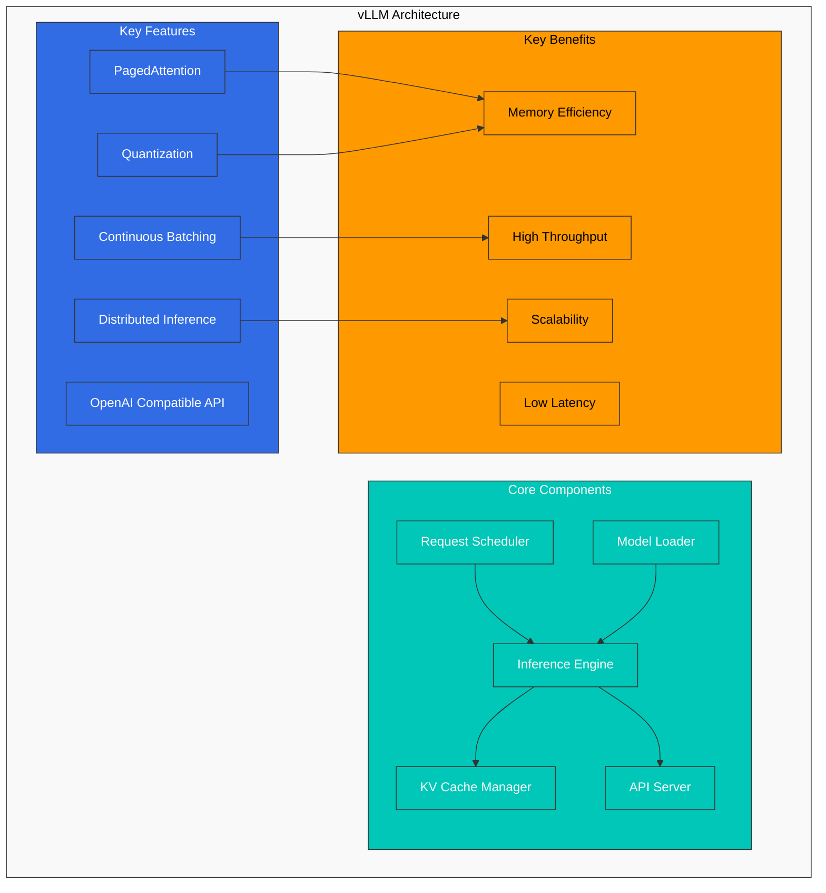
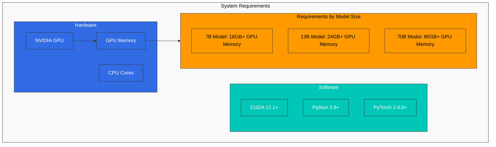
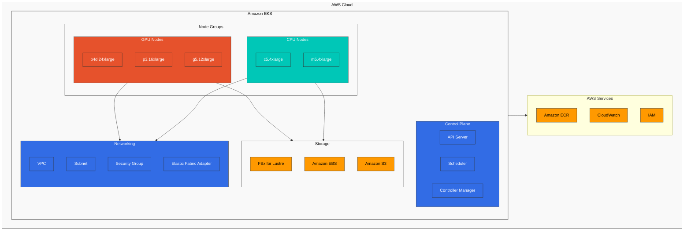
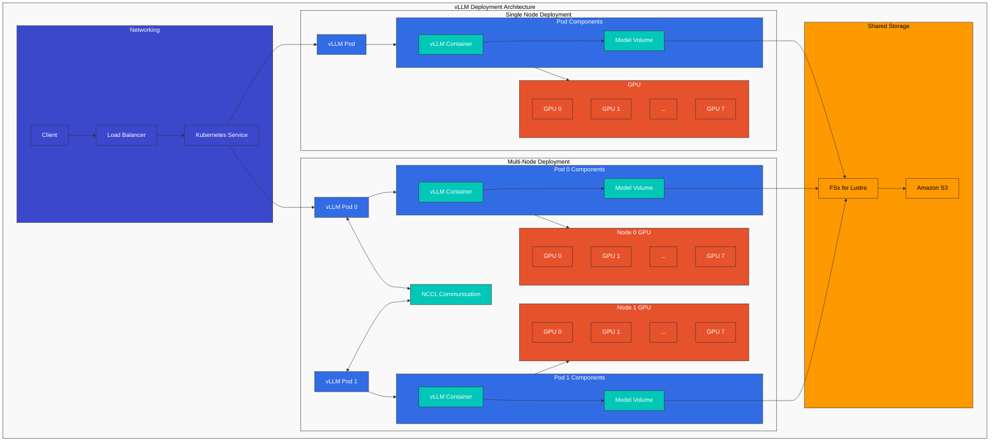
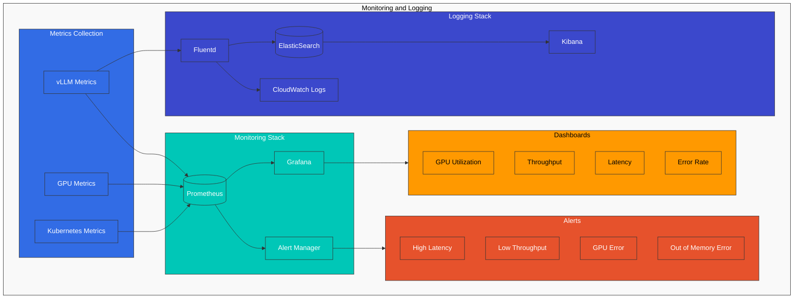
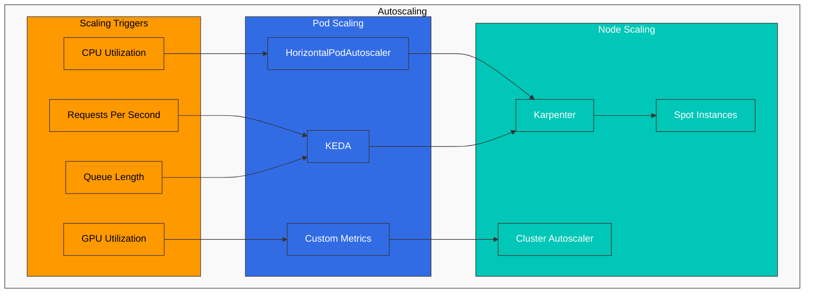
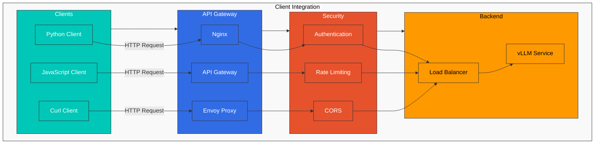

# vLLM Deployment & Optimization

> **サポート対象バージョン**: Kubernetes 1.31, 1.32, 1.33  
> **最終更新**: April 9, 2026

vLLM は、Large Language Models (LLMs) 向けの、最も広く採用されているオープンソースの高性能 inference engine です。この章では、vLLM の最新機能とアーキテクチャを見ていき、EKS 上で本番規模でデプロイおよび最適化する方法を学びます。

## Lab Environment Setup

このドキュメントの例に沿って進めるには、以下のツールと環境が必要です。

### Required Tools and Resources
- kubectl v1.31 or higher
- Helm v3.10 or higher
- EKS cluster with NVIDIA GPUs (minimum recommended: g5.2xlarge instance)
- NVIDIA drivers and NVIDIA Device Plugin installed
- At least 50GB of disk space

### GPU Node Setup

```bash
# Install NVIDIA Device Plugin
kubectl apply -f https://raw.githubusercontent.com/NVIDIA/k8s-device-plugin/v0.14.0/nvidia-device-plugin.yml

# Verify GPU nodes
kubectl get nodes "-o=custom-columns=NAME:.metadata.name,GPU:.status.allocatable.nvidia\.com/gpu"
```

## Introduction to vLLM

vLLM は、以下の特徴を持つ LLM inference engine です。



### Key Features of vLLM

1. **PagedAttention**:
   - KV cache を効率的に管理する memory management technology
   - operating system の virtual memory management から着想を得ています
   - 最大 10 倍多くの concurrent request processing を可能にします

2. **Continuous Batching**:
   - GPU utilization を最大化するために request を動的に batch 化します
   - 新しい request が到着すると直ちに処理を開始します
   - 最大 2 倍の throughput 向上

3. **Distributed Inference**:
   - tensor parallelization により大規模 model をサポートします
   - 複数 GPU にまたがる model sharding
   - 175B+ parameter model をサポートします

4. **Quantization**:
   - INT8、FP16 を含むさまざまな precision をサポートします
   - memory usage を削減し、inference speed を向上させます
   - 最小限の accuracy loss で最大 2 倍の memory efficiency 向上

## Supported Models

vLLM は以下の model をサポートしています。

| Model Family | Supported Models | Quantization Options |
|-------------|-----------------|---------------------|
| **LLaMA 3 / 3.1 / 3.2 / 3.3** | 1B, 3B, 8B, 70B, 405B | FP16, BF16, FP8, INT8, INT4, AWQ, GPTQ |
| **DeepSeek V3 / R1** | 7B, 67B, 671B (MoE) | FP16, BF16, FP8, AWQ, GPTQ |
| **Qwen 2 / 2.5 / QwQ** | 0.5B ~ 72B | FP16, BF16, FP8, INT8, AWQ, GPTQ |
| **Mistral / Mixtral** | 7B, 8x7B, 8x22B, Large 2 | FP16, BF16, FP8, AWQ, GPTQ |
| **Gemma 2 / 3** | 2B, 9B, 27B | FP16, BF16, INT8 |
| **Phi-3 / Phi-4** | 3.8B, 7B, 14B | FP16, BF16, INT8, AWQ |
| **Command R / R+** | 35B, 104B | FP16, BF16 |
| **DBRX** | 132B (MoE) | FP16, BF16 |
| **StarCoder 2** | 3B, 7B, 15B | FP16, BF16 |
| **Vision Models (VLM)** | LLaVA, Pixtral, Qwen2-VL, InternVL | FP16, BF16 |

1. **PagedAttention**: 長い sequence を処理する際の memory usage を最適化する、memory efficient な attention mechanism です。
2. **Continuous Batching**: throughput を向上させるために request を動的に batch 化します。
3. **Distributed Inference**: 大規模 model を扱うため、複数の GPU と node に model を分散します。
4. **Quantization**: memory usage を削減し throughput を向上させるため、INT8/INT4 quantization をサポートします。
5. **OpenAI Compatible API**: OpenAI API と互換性のある interface を提供します。

### Latest vLLM Features (v0.6+)

vLLM は急速に進化しており、最近の release では重要な新機能が追加されています。

#### Speculative Decoding

小さな draft model を使用して複数の candidate token を生成し、それを大きな model が 1 回の pass で検証することで、inference speed を 2〜3 倍向上させます。

```bash
python -m vllm.entrypoints.openai.api_server \
  --model meta-llama/Llama-3.1-70B-Instruct \
  --speculative-model meta-llama/Llama-3.1-8B-Instruct \
  --num-speculative-tokens 5
```

#### Prefix Caching

同じ system prompt や context を共有する request 間で KV cache を自動的に再利用し、TTFT (Time to First Token) を大幅に短縮します。

```bash
--enable-prefix-caching
```

#### Chunked Prefill

長い prompt prefill を、decode step と interleave される小さな chunk に分割し、long-context request が他の request の latency に与える影響を低減します。

```bash
--enable-chunked-prefill --max-num-batched-tokens 2048
```

#### Dynamic LoRA Adapter Loading

runtime に複数の LoRA adapter を動的に load/unload し、単一の base model から多数の customized model を提供します。

```bash
--enable-lora --max-loras 4 --max-lora-rank 64
```

```python
# Specify LoRA model in API request
response = client.chat.completions.create(
    model="my-custom-lora-adapter",
    messages=[{"role": "user", "content": "Hello!"}]
)
```

#### Structured Output

JSON Schema、regex pattern、CFG (Context-Free Grammar) による制約付き output generation をサポートし、信頼性の高い structured data generation を実現します。

```python
from openai import OpenAI
client = OpenAI(base_url="http://vllm-service:8000/v1")

response = client.chat.completions.create(
    model="meta-llama/Llama-3.1-8B-Instruct",
    messages=[{"role": "user", "content": "Return user information as JSON"}],
    response_format={
        "type": "json_schema",
        "json_schema": {
            "name": "user_info",
            "schema": {
                "type": "object",
                "properties": {
                    "name": {"type": "string"},
                    "age": {"type": "integer"},
                    "email": {"type": "string"}
                },
                "required": ["name", "age", "email"]
            }
        }
    }
)
```

#### Tool Calling

agent workflow との統合のために、OpenAI 互換の Tool/Function Calling をサポートします。

```python
response = client.chat.completions.create(
    model="meta-llama/Llama-3.1-8B-Instruct",
    messages=[{"role": "user", "content": "What's the weather in Seoul?"}],
    tools=[{
        "type": "function",
        "function": {
            "name": "get_weather",
            "description": "Get the current weather for a specified location",
            "parameters": {
                "type": "object",
                "properties": {
                    "location": {"type": "string", "description": "City name"}
                },
                "required": ["location"]
            }
        }
    }]
)
```

#### FP8 Quantization

Hopper (H100) および Ada Lovelace (L4, L40S) GPU 上で FP8 quantization をサポートし、ほぼ同等の accuracy を維持しながら memory usage を半減します。

```bash
--quantization fp8 --kv-cache-dtype fp8
```

#### Vision-Language Model (VLM) Serving

画像と text の両方を同時に処理する multimodal model をサポートします。

```python
response = client.chat.completions.create(
    model="llava-hf/llava-v1.6-mistral-7b-hf",
    messages=[{
        "role": "user",
        "content": [
            {"type": "text", "text": "Describe this image"},
            {"type": "image_url", "image_url": {"url": "data:image/png;base64,..."}}
        ]
    }]
)
```

## System Requirements

EKS 上で vLLM をデプロイするための system requirements は以下のとおりです。



1. **Hardware**:
   - NVIDIA GPU (Volta, Turing, Ampere, Hopper architecture)
   - 最小 GPU memory: model size によって異なります
     - 7B model: 最小 16GB GPU memory
     - 13B model: 最小 24GB GPU memory
     - 70B model: 最小 80GB GPU memory (または複数 GPU に分散)

2. **Software**:
   - CUDA 12.1 or higher (CUDA 12.4 recommended for FP8)
   - Python 3.9 or higher
   - PyTorch 2.4.0 or higher

3. **EKS Node Types**:
   - p5.48xlarge: 8x NVIDIA H100 GPU, 80GB each (highest performance)
   - p4d.24xlarge: 8x NVIDIA A100 GPU, 40GB or 80GB each
   - g6.12xlarge: 4x NVIDIA L4 GPU, 24GB each (cost-effective)
   - g5.12xlarge: 4x NVIDIA A10G GPU, 24GB each
   - g6e.12xlarge: 4x NVIDIA L40S GPU, 48GB each
   - trn1.32xlarge: 16x AWS Trainium, 32GB each (AWS silicon)

## EKS Infrastructure Configuration



## Storage Configuration

vLLM は大きな model weight を load する必要があるため、高性能な storage を必要とします。

### FSx for Lustre Setup

FSx for Lustre は、大きな model weight を迅速に load するのに適した高性能 parallel file system です。

```yaml
apiVersion: fsx.aws.k8s.io/v1beta1
kind: Lustre
metadata:
  name: vllm-models
spec:
  deploymentType: SCRATCH_2
  storageCapacity: 1200
  subnetIds:
    - subnet-0123456789abcdef0
  securityGroupIds:
    - sg-0123456789abcdef0
  perUnitStorageThroughput: 200
---
apiVersion: storage.k8s.io/v1
kind: StorageClass
metadata:
  name: fsx-lustre-sc
provisioner: fsx.csi.aws.com
parameters:
  fileSystemId: fs-0123456789abcdef0
  mountName: vllm-models
---
apiVersion: v1
kind: PersistentVolumeClaim
metadata:
  name: vllm-models-pvc
spec:
  accessModes:
    - ReadWriteMany
  storageClassName: fsx-lustre-sc
  resources:
    requests:
      storage: 1200Gi
```

### Downloading Models from S3

Hugging Face model を S3 に保存し、FSx for Lustre に download するための Job です。

```yaml
apiVersion: batch/v1
kind: Job
metadata:
  name: model-download
spec:
  template:
    spec:
      containers:
      - name: model-download
        image: huggingface/transformers:latest
        command:
        - python
        - -c
        - |
          from huggingface_hub import snapshot_download
          import os

          model_id = "meta-llama/Llama-3.1-70B-Instruct"
          dest_dir = "/models/llama-3.1-70b"

          os.makedirs(dest_dir, exist_ok=True)
          snapshot_download(repo_id=model_id, local_dir=dest_dir, token=os.environ["HF_TOKEN"])
        env:
        - name: HF_TOKEN
          valueFrom:
            secretKeyRef:
              name: huggingface-token
              key: token
        volumeMounts:
        - name: models-volume
          mountPath: /models
      restartPolicy: Never
      volumes:
      - name: models-volume
        persistentVolumeClaim:
          claimName: vllm-models-pvc
```

## vLLM Deployment

### Deployment Architecture

次の図は、EKS 上に vLLM をデプロイするための 2 つの主要な architecture を示しています。



### Single Node Deployment

単一 node 上の単一 GPU または複数 GPU で vLLM を実行する Deployment です。

```yaml
apiVersion: apps/v1
kind: Deployment
metadata:
  name: vllm-inference
spec:
  replicas: 1
  selector:
    matchLabels:
      app: vllm-inference
  template:
    metadata:
      labels:
        app: vllm-inference
    spec:
      containers:
      - name: vllm-server
        image: vllm/vllm-openai:latest
        command:
        - python
        - -m
        - vllm.entrypoints.openai.api_server
        - --model=/models/llama-3.1-70b
        - --tensor-parallel-size=8
        - --gpu-memory-utilization=0.95
        - --max-num-batched-tokens=16384
        - --enable-prefix-caching
        - --enable-chunked-prefill
        - --port=8000
        ports:
        - containerPort: 8000
        resources:
          limits:
            nvidia.com/gpu: 8
        volumeMounts:
        - name: models-volume
          mountPath: /models
        env:
        - name: CUDA_VISIBLE_DEVICES
          value: "0,1,2,3,4,5,6,7"
      volumes:
      - name: models-volume
        persistentVolumeClaim:
          claimName: vllm-models-pvc
---
apiVersion: v1
kind: Service
metadata:
  name: vllm-inference
spec:
  selector:
    app: vllm-inference
  ports:
  - port: 8000
    targetPort: 8000
  type: LoadBalancer
```

### Multi-Node Distributed Deployment

大規模 model を複数 node に分散する方法です。

```yaml
apiVersion: v1
kind: ConfigMap
metadata:
  name: vllm-config
data:
  hostfile: |
    vllm-inference-0 slots=8
    vllm-inference-1 slots=8
  run_server.sh: |
    #!/bin/bash

    RANK=$HOSTNAME
    if [[ $HOSTNAME == "vllm-inference-0" ]]; then
      RANK=0
    elif [[ $HOSTNAME == "vllm-inference-1" ]]; then
      RANK=1
    fi

    python -m vllm.entrypoints.openai.api_server \
      --model=/models/llama-3.1-70b \
      --tensor-parallel-size=16 \
      --pipeline-parallel-size=1 \
      --max-num-batched-tokens=8192 \
      --port=8000 \
      --host=0.0.0.0 \
      --master-addr=vllm-inference-0 \
      --master-port=29500 \
      --rank=$RANK
---
apiVersion: apps/v1
kind: StatefulSet
metadata:
  name: vllm-inference
spec:
  serviceName: "vllm-inference"
  replicas: 2
  selector:
    matchLabels:
      app: vllm-inference
  template:
    metadata:
      labels:
        app: vllm-inference
    spec:
      affinity:
        podAntiAffinity:
          requiredDuringSchedulingIgnoredDuringExecution:
          - labelSelector:
              matchExpressions:
              - key: app
                operator: In
                values:
                - vllm-inference
            topologyKey: kubernetes.io/hostname
      containers:
      - name: vllm-server
        image: vllm/vllm-openai:latest
        command:
        - bash
        - /config/run_server.sh
        ports:
        - containerPort: 8000
        - containerPort: 29500
        resources:
          limits:
            nvidia.com/gpu: 8
        volumeMounts:
        - name: models-volume
          mountPath: /models
        - name: config-volume
          mountPath: /config
        env:
        - name: CUDA_VISIBLE_DEVICES
          value: "0,1,2,3,4,5,6,7"
        - name: NCCL_DEBUG
          value: "INFO"
        - name: NCCL_IB_DISABLE
          value: "0"
        - name: NCCL_IB_GID_INDEX
          value: "3"
        - name: NCCL_NET_GDR_LEVEL
          value: "5"
      volumes:
      - name: models-volume
        persistentVolumeClaim:
          claimName: vllm-models-pvc
      - name: config-volume
        configMap:
          name: vllm-config
          defaultMode: 0755
---
apiVersion: v1
kind: Service
metadata:
  name: vllm-inference
spec:
  selector:
    app: vllm-inference
  ports:
  - port: 8000
    targetPort: 8000
    name: api
  - port: 29500
    targetPort: 29500
    name: nccl
  clusterIP: None
---
apiVersion: v1
kind: Service
metadata:
  name: vllm-inference-lb
spec:
  selector:
    app: vllm-inference
    statefulset.kubernetes.io/pod-name: vllm-inference-0
  ports:
  - port: 8000
    targetPort: 8000
  type: LoadBalancer
```

## Performance Optimization

```mermaid
flowchart TD
    subgraph Optimization [Performance Optimization]
        subgraph GPUMemory [GPU Memory Optimization]
            MemoryUtil[GPU Memory Utilization Adjustment]
            Quantization[Quantization Application]
            SwapSpace[Swap Space Utilization]
        end

        subgraph Throughput [Throughput Optimization]
            BatchSize[Batch Size Adjustment]
            KVCache[KV Cache Optimization]
            TensorParallel[Tensor Parallel Processing]
        end

        subgraph NetworkOpt [Network Optimization]
            EFA[EFA Utilization]
            NCCLSettings[NCCL Settings Optimization]
            NodePlacement[Node Placement Optimization]
        end
    end

    MemoryUtil -->|--gpu-memory-utilization=0.9| Performance([Performance Improvement])
    Quantization -->|--quantization awq| Performance
    SwapSpace -->|--swap-space=16| Performance

    BatchSize -->|--max-num-batched-tokens=8192| Performance
    KVCache -->|--block-size=16| Performance
    TensorParallel -->|--tensor-parallel-size=8| Performance

    EFA -->|vpc.amazonaws.com/efa: 1| Performance
    NCCLSettings -->|NCCL_DEBUG=INFO| Performance
    NodePlacement -->|topology.kubernetes.io/zone| Performance

    classDef gpuMemNode fill:#326CE5,stroke:#333,stroke-width:1px,color:white;
    classDef throughputNode fill:#00C7B7,stroke:#333,stroke-width:1px,color:white;
    classDef networkNode fill:#E6522C,stroke:#333,stroke-width:1px,color:white;
    classDef performanceNode fill:#FF9900,stroke:#333,stroke-width:1px,color:black;
    classDef default fill:#f9f9f9,stroke:#333,stroke-width:1px,color:black;

    class MemoryUtil,Quantization,SwapSpace,GPUMemory gpuMemNode;
    class BatchSize,KVCache,TensorParallel,Throughput throughputNode;
    class EFA,NCCLSettings,NodePlacement,NetworkOpt networkNode;
    class Performance performanceNode;
    class Optimization default;
```



### GPU Memory Optimization

vLLM の GPU memory usage を最適化する方法です。

1. **GPU Memory Utilization Adjustment**:

```bash
--gpu-memory-utilization=0.9
```

2. **Quantization Application**:

```bash
--quantization awq
```

3. **Swap Space Utilization**:

```bash
--swap-space=16
```

### Throughput Optimization

vLLM の throughput を最適化する方法です。

1. **Batch Size Adjustment**:

```bash
--max-num-batched-tokens=8192
```

2. **KV Cache Optimization**:

```bash
--block-size=16
```

3. **Tensor Parallel Processing Adjustment**:

```bash
--tensor-parallel-size=8
```

### Network Optimization

distributed deployment における network performance を最適化する方法です。

1. **EFA (Elastic Fabric Adapter) Utilization**:

```yaml
resources:
  limits:
    nvidia.com/gpu: 8
    vpc.amazonaws.com/efa: 1
```

2. **NCCL Settings Optimization**:

```yaml
env:
- name: NCCL_DEBUG
  value: "INFO"
- name: NCCL_MIN_NCHANNELS
  value: "4"
- name: NCCL_SOCKET_IFNAME
  value: "^lo,docker"
- name: NCCL_ASYNC_ERROR_HANDLING
  value: "1"
```

3. **Node Placement Optimization**:

```yaml
affinity:
  nodeAffinity:
    requiredDuringSchedulingIgnoredDuringExecution:
      nodeSelectorTerms:
      - matchExpressions:
        - key: topology.kubernetes.io/zone
          operator: In
          values:
          - us-west-2a
```

## Monitoring and Logging



### Prometheus Metrics

vLLM server から Prometheus metrics を収集する方法です。

```yaml
apiVersion: v1
kind: Service
metadata:
  name: vllm-metrics
  labels:
    app: vllm-inference
spec:
  selector:
    app: vllm-inference
  ports:
  - port: 8001
    targetPort: 8001
    name: metrics
---
apiVersion: monitoring.coreos.com/v1
kind: ServiceMonitor
metadata:
  name: vllm-metrics
  namespace: monitoring
spec:
  selector:
    matchLabels:
      app: vllm-inference
  endpoints:
  - port: metrics
    interval: 15s
```

### Log Collection

vLLM server logs を CloudWatch に収集する方法です。

```yaml
apiVersion: v1
kind: ConfigMap
metadata:
  name: fluentd-config
  namespace: logging
data:
  fluent.conf: |
    <source>
      @type tail
      path /var/log/containers/vllm-*.log
      pos_file /var/log/fluentd-vllm.log.pos
      tag kubernetes.vllm.*
      read_from_head true
      <parse>
        @type json
        time_format %Y-%m-%dT%H:%M:%S.%NZ
      </parse>
    </source>

    <filter kubernetes.vllm.**>
      @type kubernetes_metadata
      @id filter_kube_metadata
    </filter>

    <match kubernetes.vllm.**>
      @type cloudwatch_logs
      log_group_name /eks/vllm/logs
      log_stream_name_key $.kubernetes.pod_name
      remove_log_stream_name_key true
      auto_create_stream true
      region us-west-2
    </match>
```

## Autoscaling



### HPA (Horizontal Pod Autoscaler)

request volume に基づいて vLLM server を自動的に scale する方法です。

```yaml
apiVersion: autoscaling/v2
kind: HorizontalPodAutoscaler
metadata:
  name: vllm-inference-hpa
spec:
  scaleTargetRef:
    apiVersion: apps/v1
    kind: Deployment
    name: vllm-inference
  minReplicas: 1
  maxReplicas: 5
  metrics:
  - type: Resource
    resource:
      name: cpu
      target:
        type: Utilization
        averageUtilization: 70
  - type: Pods
    pods:
      metric:
        name: requests_per_second
      target:
        type: AverageValue
        averageValue: 100
```

### Node Autoscaling with Karpenter

GPU node を自動的に provision する方法です。

```yaml
apiVersion: karpenter.sh/v1
kind: NodePool
metadata:
  name: vllm-gpu
spec:
  template:
    spec:
      requirements:
      - key: node.kubernetes.io/instance-type
        operator: In
        values:
        - p3.16xlarge
        - g5.12xlarge
      - key: karpenter.sh/capacity-type
        operator: In
        values:
        - on-demand
      - key: kubernetes.io/arch
        operator: In
        values:
        - amd64
      - key: vpc.amazonaws.com/efa
        operator: In
        values:
        - "true"
      nodeClassRef:
        name: vllm-gpu-class
  limits:
    nvidia.com/gpu: 32
---
apiVersion: karpenter.k8s.aws/v1
kind: EC2NodeClass
metadata:
  name: vllm-gpu-class
spec:
  subnetSelector:
    karpenter.sh/discovery: vllm-cluster
  securityGroupSelector:
    karpenter.sh/discovery: vllm-cluster
  ttlSecondsAfterEmpty: 30
```

## Security Configuration

### Network Policy

vLLM server への network access を制限する方法です。

```yaml
apiVersion: networking.k8s.io/v1
kind: NetworkPolicy
metadata:
  name: vllm-network-policy
spec:
  podSelector:
    matchLabels:
      app: vllm-inference
  policyTypes:
  - Ingress
  - Egress
  ingress:
  - from:
    - podSelector:
        matchLabels:
          app: api-gateway
    ports:
    - protocol: TCP
      port: 8000
  - from:
    - podSelector:
        matchLabels:
          app: vllm-inference
    ports:
    - protocol: TCP
      port: 29500
  egress:
  - to:
    - podSelector:
        matchLabels:
          app: vllm-inference
    ports:
    - protocol: TCP
      port: 29500
  - to:
    ports:
    - protocol: TCP
      port: 443
```

### Security Context

container security context を設定する方法です。

```yaml
securityContext:
  runAsUser: 1000
  runAsGroup: 1000
  fsGroup: 1000
  allowPrivilegeEscalation: false
  capabilities:
    drop:
    - ALL
```

## Client Integration



### API Gateway

vLLM server の前段に API gateway をデプロイする方法です。

```yaml
apiVersion: apps/v1
kind: Deployment
metadata:
  name: api-gateway
spec:
  replicas: 3
  selector:
    matchLabels:
      app: api-gateway
  template:
    metadata:
      labels:
        app: api-gateway
    spec:
      containers:
      - name: api-gateway
        image: nginx:latest
        ports:
        - containerPort: 80
        volumeMounts:
        - name: nginx-config
          mountPath: /etc/nginx/conf.d
      volumes:
      - name: nginx-config
        configMap:
          name: nginx-config
---
apiVersion: v1
kind: ConfigMap
metadata:
  name: nginx-config
data:
  default.conf: |
    server {
      listen 80;

      location /v1/ {
        proxy_pass http://vllm-inference:8000;
        proxy_set_header Host $host;
        proxy_set_header X-Real-IP $remote_addr;
      }
    }
---
apiVersion: v1
kind: Service
metadata:
  name: api-gateway
spec:
  selector:
    app: api-gateway
  ports:
  - port: 80
    targetPort: 80
  type: LoadBalancer
```

### Client Example

Python client を使用して vLLM server に request を送信する方法です。

```python
import requests
import json

url = "http://api-gateway/v1/completions"

payload = {
    "model": "llama-3.1-70b",
    "prompt": "Once upon a time",
    "max_tokens": 100,
    "temperature": 0.7
}

headers = {
    "Content-Type": "application/json"
}

response = requests.post(url, headers=headers, data=json.dumps(payload))

print(response.json())
```

## Best Practices

### Resource Management

1. **Consider Memory Overhead**:
   - GPU memory に加えて、十分な CPU memory を割り当てます。
   - model size の約 2 倍の CPU memory を割り当てることを推奨します。

2. **CPU Core Allocation**:
   - GPU あたり少なくとも 4 CPU core を割り当てます。
   - tensor parallelization を使用する場合は、より多くの CPU core が必要になることがあります。

3. **Node Selection**:
   - model size に基づいて適切な node type を選択します。
   - memory bandwidth が高い node を選択します。

### High Availability

1. **Multi-Availability Zone Deployment**:
   - 複数の availability zone にわたって vLLM server をデプロイします。
   - 各 availability zone で十分な capacity を確保します。

2. **Load Balancing**:
   - 複数の vLLM server instance に request を分散します。
   - 同じ user からの request が同じ server に route されるように session affinity を設定します。

3. **Failure Recovery**:
   - failed server を検出するための health check を設定します。
   - automatic recovery mechanism を実装します。

### Cost Optimization

1. **Utilize Spot Instances**:
   - cost を削減するために Spot instance を使用します。
   - interruption-tolerant workload に適しています。

2. **Model Quantization**:
   - memory usage を削減するために INT8 または INT4 quantization を適用します。
   - accuracy と performance の balance を検討します。

3. **Autoscaling**:
   - request volume に基づいて server を自動的に scale します。
   - idle time には server を scale down して cost を削減します。

## Conclusion

vLLM は最も活発に開発されているオープンソースの LLM inference engine であり、Speculative Decoding、Prefix Caching、dynamic LoRA loading、Structured Output、Tool Calling など、本番環境に不可欠な機能を包括的にサポートしています。EKS 上で適切な GPU instance selection、高性能 storage、network optimization、auto-scaling と組み合わせることで、cost-effective で scalable な LLM serving platform を構築できます。SGLang や TGI など他の framework との比較については、[Inference Frameworks](./04-inference-frameworks.md) の章を参照してください。

## References

- [vLLM Official Documentation](https://docs.vllm.ai/) - vLLM の公式ドキュメントと最新機能ガイド
- [AI on EKS](https://awslabs.github.io/ai-on-eks/) - EKS 上で AI/ML workload をデプロイするための AWS guide と example

## Quiz

この章で学んだ内容を確認するには、[Topic Quiz](../quizzes/ai-ml/04-vllm-deployment-quiz.md) に挑戦してください。
