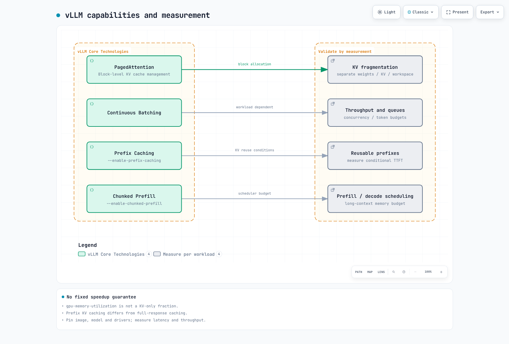

# EKS 上で Agentic AI Platform を構築する

> **レビュー基準**: Kagent 0.10.1 / Gateway Inference Extension 1.6.1 / LangGraph 1.2.11 / Langfuse SDK 4.15.2
> **最終更新**: September 12, 2026

Agentic AI は、単純な質問応答を超え、自律的に計画を作成し、ツールを使用して、反復的に目標を達成します。本章では、EKS 上での Agentic AI platform の設計方法とその運用境界を扱います。

## 1. Agentic AI Platform の概要

### Agentic AI とは

Agentic AI は、次の特性を持つ自律型 AI システムです。


[🔍 インタラクティブな図を表示](https://www.atomai.click/kubernetes-docs/archmaps/en-ai-ml-03-agentic-ai-platform-0.html)

1. **自律的な計画**: 複雑なタスクをサブタスクに分解し、実行順序を決定します。
2. **ツールベースの実行**: 外部 API、データベース、コード実行ツールなど、さまざまなツールを活用します。
3. **反復的な改善**: 実行結果を評価し、必要に応じて計画を修正します。
4. **状態管理**: 長時間実行されるタスクの状態とメモリを維持します。

### Kubernetes を選択する場面

Kubernetes は、Agentic AI platform 向けに次の中核機能を提供します。

| 要件 | Kubernetes ソリューション |
|-------------|---------------------|
| GPU オーケストレーション | Device Plugin, GPU Operator, MIG |
| Auto Scaling | HPA, VPA, Karpenter |
| マルチテナント分離 | RBAC, Namespace, 強制された NetworkPolicy, workload identity |
| 高可用性 | replicas, probes, 配置および復旧テスト |
| Service Mesh | 構成済みの gateway/mesh 実装 |
| コスト最適化 | Spot instances, Node 統合 |

### 4 つの主要な技術的課題

Agentic AI platform を構築する際に解決すべき主な課題:


[🔍 インタラクティブな図を表示](https://www.atomai.click/kubernetes-docs/archmaps/en-ai-ml-03-agentic-ai-platform-1.html)

---

## 2. GPU とコストのベースライン

外部モデル API を使用する Agent が、必ずしも GPU を必要とするわけではありません。セルフホスト型 inference では、weights/precision、KV cache、concurrency、CPU architecture、driver compatibility に基づいてデバイスを選択する必要があります。[レビュー済み GPU ガイド](01-ai-ml-workloads.md)を使用し、AL2023 NVIDIA AMI 上での重複した driver/toolkit インストールを避けてください。

MIG はサポート対象の GPU を分割します。1 つの MIG instance 内での time-slicing は、その共有 workload 間に memory/fault isolation を追加しません。これは software security boundary ではありません。同様に、80 GB には一般に 70B FP16 weights は収まりません。

GPU Operator Helm values は ConfigMap/HelmRelease resources とは異なります。Flux HelmRelease を helm --values として渡しても、意図した設定は適用されません。MIG manager ConfigMap references、profile node labels、plugin strategy は一致している必要があります。device-plugin.config labels は ConfigMap 名ではなく configuration key を選択します。MIG の再構成は workloads を中断させる可能性があり、この監査では実施しませんでした。

価格には region/OS/purchase mode/date と quota のコンテキストが必要です。以前の出典のない時間単価表および固定の節約率は、現行の価格根拠ではありません。セルフホスト型の合計 GPU idle time、storage/transfer、operation、recovery cost を、測定された成功 throughput と比較してください。

## 3. Model Serving (vLLM)

### vLLM アーキテクチャ

vLLM は、次の中核技術を通じて高性能な LLM inference を提供します。



[🔍 インタラクティブな図を表示](https://www.atomai.click/kubernetes-docs/archmaps/en-ai-ml-03-agentic-ai-platform-2.html)

### レビュー済みの Serving Path

0.29.0 の image/model revisions、startup probes、private Service、実際の CLI options については、[最新の vLLM ガイド](02-vllm-deployment.md)を使用してください。single-GPU NodePool は、以前の four-GPU/200Gi Pod を配置できません。TP/PP groups と独立した replicas を区別し、memory needs を計算してください。

Prefix cache は、完全な responses ではなく、サポートされる KV prefixes を再利用します。GPU memory utilization は KV-cache fraction だけではなく、swap-space は現在の CLI にありません。llm-d disaggregation は、role arguments を持つ架空の 2 つの prefill/decode images ではありません。実際の release の model server、KV connector、scheduler、gateway、hardware/network の組み合わせを検証してください。

## 4. Inference Gateway

### Gateway API ベースの AI Workload Routing

Kubernetes Gateway API を拡張して、AI inference workloads を効率的に routing します。

### Kgateway + InferencePool アーキテクチャ


[🔍 インタラクティブな図を表示](https://www.atomai.click/kubernetes-docs/archmaps/en-ai-ml-03-agentic-ai-platform-3.html)

#### InferencePool v1

Gateway API と Gateway API Inference Extension は別々の API です。Extension 1.6.1 は、targetPorts と endpointPickerRef を備えた inference.networking.k8s.io/v1 を使用します。以前の架空の EndpointPicker CRD/endpointPickerConfig はこの schema ではありません。

この schema-checked example には、9002 上の EPP Service、model Pods、サポートする gateway controller が必要です。InferencePool 単体では、authentication、rate limits、prefix-aware selection algorithm は構成されません。

```yaml
apiVersion: inference.networking.k8s.io/v1
kind: InferencePool
metadata:
  name: model-pool
  namespace: ai-inference
spec:
  selector:
    matchLabels:
      app: vllm-demo
  targetPorts:
    - number: 8000
  endpointPickerRef:
    name: model-epp
    kind: Service
    group: ""
    port:
      number: 9002
    failureMode: FailClose
```

selector は同一 Namespace の Pods のみと一致します。EndpointPickerRef はデフォルトで Service reference および FailClose になります。HTTPRoute、EPP configuration/version support、TLS、gateway status をまとめて検証してください。API definitions または Kgateway installation で、すべての plugin capabilities が有効になるわけではありません。

### LiteLLM 1.100.1 Provider Gateway

LiteLLM provider adaptation と InferencePool endpoint selection は異なる layers です。Provider APIs は paths、authentication、payloads、responses、streaming が異なります。OpenAI JSON を変更せずに Anthropic endpoint へ forwarding しても、有効な adapter ではありません。

現在の Router fallback shape を以下に示します。proxy command/args を実際の config file に接続し、必要に応じて Redis/database、credentials、callbacks を別途提供してください。

```yaml
model_list:
  - model_name: local-primary
    litellm_params:
      model: openai/qwen3-demo
      api_base: http://vllm-demo.ml-inference:8000/v1
  - model_name: local-fallback
    litellm_params:
      model: openai/qwen3-demo
      api_base: http://vllm-secondary.ml-inference:8000/v1
router_settings:
  fallbacks:
    - local-primary: [local-fallback]
  num_retries: 0
```

これは構成を例示しており、準備済みの endpoints と authentication が必要です。application clients には master key ではなく scoped credentials を付与してください。外部 fallback は data-egress path です。routing 前に tenant provider/data policy を強制してください。model-selected name または client header によってそれをバイパスさせてはなりません。


## 5. RAG データと Retrieval Boundaries

最新の検査済み Milvus release は 3.0.1 です。別途レビュー済みの Operator 1.3.9 は、デフォルトで Milvus 2.6.11 を使用します。これらは 1 つの version ではなく、広範な compatibility table はテスト済みの 3.x upgrade の証明にはなりません。operator repository は https://zilliztech.github.io/milvus-operator/ であり、通常の Milvus chart repository とは別です。

Vector dimensions は実際の embedding output と一致する必要があります。ingestion と queries について、revision、dimensions options、tokenizer、normalization、distance metric を記録してください。Index parameters は異なります。HNSW M/efConstruction を GPU_IVF_FLAT に単純に再利用することはできません。GPU indexing には互換性のある images、version、devices、component roles が必要です。indexNode に GPU を要求しても、自動的に acceleration されるわけではありません。

tenant_id field だけでは isolation は強制されません。authenticated identity から scope を導出し、server-side retrieval filters を適用して、返される documents を検証してください。document deletion/change と embedding-version lifecycle も管理してください。

### Chunking と Hybrid Search

現在の splitter imports では langchain_text_splitters を使用します。RecursiveCharacterTextSplitter の chunk_size はデフォルトで tokens ではなく characters です。Token splitting は embedding model の tokenizer と実際の input limit に一致させる必要があります。Semantic chunking は embedding calls/cost を追加し、より良い品質を保証するものではありません。

Hybrid search では、同一の authorization filters を伴う、単なる 2 回の searches ではなく、RRF や calibrated scores などの fusion が必要です。recall、precision、latency を評価してください。retries を制限し、retry exhaustion 後に常に生成するのではなく、evidence がない場合は棄権してください。


## 6. AI Agent Deployment (Kagent)

### Kagent の概要

Kagent は Kubernetes-native AI agent lifecycle management tool です。


[🔍 インタラクティブな図を表示](https://www.atomai.click/kubernetes-docs/archmaps/en-ai-ml-03-agentic-ai-platform-4.html)

### Kagent 0.10.1 Agent API

Kagent は自動的な kubectl execution だけに限定されません。Declarative agents は Go/Python ADK runtimes を使用します。BYO は user-provided A2A agent をホストします。LangGraph は別途統合された workflow framework であり、Kagent と同じ runtime ではありません。

この Agent は、別途承認/構成された同一 Namespace の ModelConfig と RemoteMCPServer resources を参照します。実際の MCP service/search_documents tool、authentication、TLS、data permissions を提供してください。これは tool を作成することも、Kubernetes write access を付与することもありません。

```yaml
apiVersion: kagent.dev/v1alpha2
kind: Agent
metadata:
  name: research-agent
  namespace: ai-agents
spec:
  type: Declarative
  description: Retrieves authorized documents and cites their sources
  declarative:
    runtime: go
    modelConfig: approved-internal-model
    systemMessage: 'Use approved document tools. Cite retrieved sources.

      If evidence is missing, say so. Do not execute arbitrary code.

      '
    tools:
    - type: McpServer
      mcpServer:
        apiGroup: kagent.dev
        kind: RemoteMCPServer
        name: document-tools
        toolNames:
        - search_documents
    deployment:
      replicas: 1
      resources:
        requests:
          cpu: 250m
          memory: 256Mi
        limits:
          cpu: '1'
          memory: 1Gi
```

ModelConfig.apiKeySecret は file delivery を意味しません。検査済みの OpenAI translator は、OPENAI_API_KEY SecretKeyRef environment variable を作成します。no-secret-environment policy の下では、検証済みの file-credential BYO/runtime または authentication gateway path を使用してください。token-delegation/audience design なしに apiKeyPassthrough を有効にしても、代替にはなりません。

An eval() calculator と架空の permissions fields は security boundaries ではありません。実際の tool server で least privilege、input validation、resource limits、approval、idempotency を実装してください。Agent replicas によって shared memory/session stores が自動的に高可用になるわけではありません。

### 実行可能な LangGraph Control Flow

この local example は、明示的な retrieve/rewrite/generate callbacks を備えた実際の SDK を使用します。その demo は LLM または vector DB を呼び出しません。元の question を保持し、rewrites を 2 回に制限し、documents がない場合は棄権します。SQLite context manager は正しく使用され、永続化された state は再オープン後にチェックされています。

```python
from typing import Callable, TypedDict
from langgraph.graph import StateGraph, START, END
from langgraph.checkpoint.sqlite import SqliteSaver


class QAState(TypedDict):
    question: str
    search_query: str
    documents: list[str]
    answer: str
    retries: int


def build_graph(retrieve: Callable[[str], list[str]],
                rewrite: Callable[[str], str],
                generate: Callable[[str, list[str]], str]):
    def search(state: QAState):
        return {"documents": retrieve(state["search_query"])}

    def route(state: QAState):
        if state["documents"]:
            return "answer"
        return "rewrite" if state["retries"] < 2 else "abstain"

    def rewrite_query(state: QAState):
        return {"search_query": rewrite(state["search_query"]),
                "retries": state["retries"] + 1}

    def answer(state: QAState):
        return {"answer": generate(state["question"], state["documents"])}

    def abstain(state: QAState):
        return {"answer": "No supporting documents were found."}

    graph = StateGraph(QAState)
    graph.add_node("retrieve", search)
    graph.add_node("rewrite", rewrite_query)
    graph.add_node("answer", answer)
    graph.add_node("abstain", abstain)
    graph.add_edge(START, "retrieve")
    graph.add_conditional_edges("retrieve", route,
                               {"answer": "answer", "rewrite": "rewrite", "abstain": "abstain"})
    graph.add_edge("rewrite", "retrieve")
    graph.add_edge("answer", END)
    graph.add_edge("abstain", END)
    return graph


if __name__ == "__main__":
    # Deterministic local fixtures, not a vector database or LLM quality test.
    graph = build_graph(
        retrieve=lambda query: ["A Pod groups containers."] if query == "pod" else [],
        rewrite=lambda query: "pod",
        generate=lambda question, documents: documents[0],
    )
    initial = {"question": "What is a Pod?", "search_query": "unknown",
               "documents": [], "answer": "", "retries": 0}
    # Server-derived authorized tenant/session identity is required in a real app.
    config = {"configurable": {"thread_id": "tenant-a/session-1"}, "recursion_limit": 12}
    with SqliteSaver.from_conn_string("agent-state.sqlite") as saver:
        app = graph.compile(checkpointer=saver)
        print(app.invoke(initial, config)["answer"])
        print(app.get_state(config).values["retries"])
```

Production thread_id は、DB authorization、encryption、concurrency、retention controls とともに、authenticated tenant/session identity に紐付ける必要があります。:memory: は process exit 後に存続しません。SqliteSaver は PostgreSQL DSN を使用できません。適切な Postgres saver を使用してください。get_state_history() を読むだけでは execution は復元されません。checkpoint configuration と実際の resume/replay semantics を使用してください。

supervisor output を allowed enum に対して検証し、unknown values/budget exhaustion を処理してください。substring COMPLETE が INCOMPLETE を success として扱ってはなりません。モデルに tool の使用を求めるだけでは、それ自体で tool を実行または検証しません。

## 7. Langfuse と Operational Observability

Langfuse SDK 4.15.2 は、古い trace()/generation() APIs を start_as_current_observation()、create_score()、および関連 methods に置き換えます。この監査では、real server ingestion/storage/authentication ではなく、in-memory exporter を使用して 1 つの trace 内の 3 つの retrieval/generation/parent spans を検証しました。

```python
from pathlib import Path
from langfuse import Langfuse

# Read existing Secret-volume files; do not put credentials in source.
client = Langfuse(
    public_key=Path("/run/secrets/langfuse/public-key").read_text().strip(),
    secret_key=Path("/run/secrets/langfuse/secret-key").read_text().strip(),
    base_url="https://langfuse.example.internal",
)
with client.start_as_current_observation(name="rag", as_type="span"):
    with client.start_as_current_observation(name="retrieve", as_type="span") as span:
        span.update(metadata={"document_count": 2})
    with client.start_as_current_observation(name="generate", as_type="generation",
                                           model="prepared-model-alias") as generation:
        # Supply actual provider usage; these values only illustrate the shape.
        generation.update(usage_details={"input": 10, "output": 5})
client.flush()
client.shutdown()
```

Langfuse chart 2.1.0 は app 4.24.0 を参照しており、最新の検査済み server 4.35.0 とは異なります。Web/worker、PostgreSQL、Redis/Valkey、object storage、ClickHouse が必要です。chart は ClickHouse Operator/cert-manager prerequisites をチェックします。Offline rendering は、deployed operator ではなく、simulated API capability information を提供しました。デフォルトの charts には secret environment delivery が含まれており、承認済みの file-only credential deployments ではありません。

DCGM FB_USED は percentage ではなく quantity です。units と total memory を検証してください。GPU utilization80% または temperature85C は universal health thresholds ではありません。latency/queues/errors/throttling と実際の device limits を併せて観測してください。

### Response Caches とコスト

Cache keys は、tenant/authorization scope、model/prompt/retrieved-data revision、generation settings、関連する tool state を取得する必要があります。shared model+prompt keys は、別の user の result を再利用する可能性があります。private または変化する external state に対しては、caching を無効にするか、明示的な expiry/invalidation を定義してください。

Token-price estimates は invoices ではありません。cache read/write、batch、retries、routing calls、self-hosted fixed costs を含めてください。budget、quality、provider policy に違反する cheapest-model fallback を拒否してください。KEDA cron trigger は、他の triggers に対してより低い nighttime cap を課しません。CronJob timezone、concurrency/deadline/retry、persisted results を定義してください。


## 8. Evaluation と Quality Management

Ragas 0.4.3 は、削除された vertexai module を import するため、resolved langchain-community 0.4.2 に対して import に失敗しました。langchain 0.3.27、core 0.3.79、community 0.3.31、openai integration 0.3.35 に pin した別の environment では、imports と SingleTurnSample/EvaluationDataset construction が成功しました。これが current LangGraph と 1 つの dependency stack を共有すると仮定しないでください。

Faithfulness/AnswerRelevancy などの現在の collection APIs には明示的な LLM/embedding adapters が必要です。古い ragas.metrics singleton imports は deprecation warnings を出します。Evaluation には model-call cost/failure handling、dataset/judge/prompt revisions、missing/NaN treatment が必要です。ここでは metric imports/schema のみをテストしており、0.92 などの quality score は測定していません。

A/B ConfigMap 単体では traffic を routing しません。実際の consumer/controller、stable assignment、equivalent authorization/data context、sufficient samples、guardrail metrics を実装してください。恣意的な model quality/pricing tables では、30–50% の savings は確立されません。

finance example の compliance_check function は regulatory compliance を認証するものではありません。authenticated account scope、monotonic sensitive/approval conditions（後から true を false で上書きしない）、side-effect idempotency、audit、human handoff criteria を設計してください。


## 9. Review Baselines と Validation Scope

| コンポーネント | ベースライン | 検証済みの範囲 |
| --- | --- | --- |
| Kagent |0.10.1 / v1alpha2 | 公式 Helm/CRDs および Agent/ModelConfig/RemoteMCPServer schemas |
| Inference Extension |1.6.1 / v1 | InferencePool schema。live EPP/gateway なし |
| LiteLLM |1.100.1 | Router fallback configuration。provider call なし |
| Milvus | server/SDK3.0.1; Operator 1.3.9 | Operator Helm/synthetic vector schema。database なし |
| LangGraph |1.2.11 + sqlite saver 3.1.1 | Bounded retrieval、abstention、state recovery |
| Langfuse | SDK 4.15.2 / chart 2.1.0 | Local trace/spans と offline chart inspection |
| Ragas |0.4.3 | Compatible isolated imports/schema。evaluator model calls なし |

Schemas、Helm、local SDK checks は、full-platform deployment、authentication、HA、GPU performance を証明するものではありません。cloud resources または paid model calls は使用していません。

## 10. 次のステップ

### 演習クイズ

Agentic AI platform への理解を確認するため、次のクイズに取り組んでください。
- [Agentic AI Platform クイズ](../quizzes/ai-ml/08-agentic-ai-platform-quiz.md)

### 関連ドキュメント

- [vLLM Deployment 詳細ガイド](./02-vllm-deployment.md) - 詳細な vLLM installation と optimization
- [AI/ML Workloads](./01-ai-ml-workloads.md) - Kubernetes における AI/ML workload management

### 参考資料

- [Kagent 0.10.1](https://github.com/kagent-dev/kagent/tree/v0.10.1)
- [InferencePool v1 API](https://github.com/kubernetes-sigs/gateway-api-inference-extension/blob/v1.6.1/api/v1/inferencepool_types.go)
- [Milvus Operator 1.3.9](https://github.com/zilliztech/milvus-operator/tree/milvus-operator-1.3.9)
- [Langfuse SDK 4.15.2](https://github.com/langfuse/langfuse-python/tree/v4.15.2)
- [Langfuse Helm2.1.0](https://github.com/langfuse/langfuse-k8s/releases/tag/langfuse-2.1.0)
- [LangGraph persistence](https://docs.langchain.com/oss/python/langgraph/persistence)
- [LiteLLM Router](https://docs.litellm.ai/docs/routing)
- [Ragas 0.4.3](https://pypi.org/project/ragas/0.4.3/)
