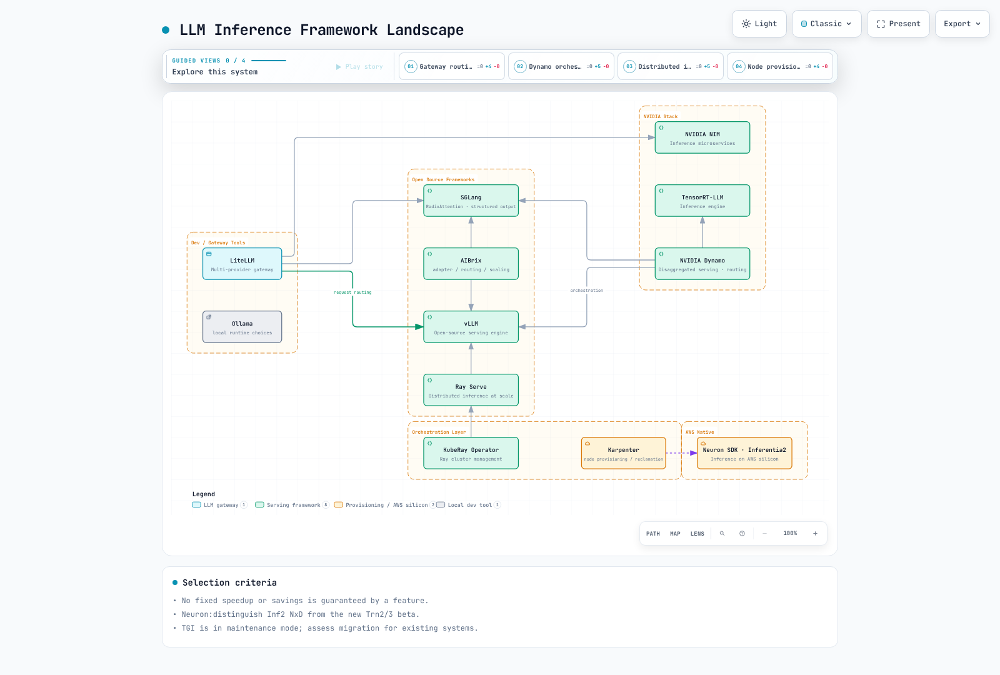
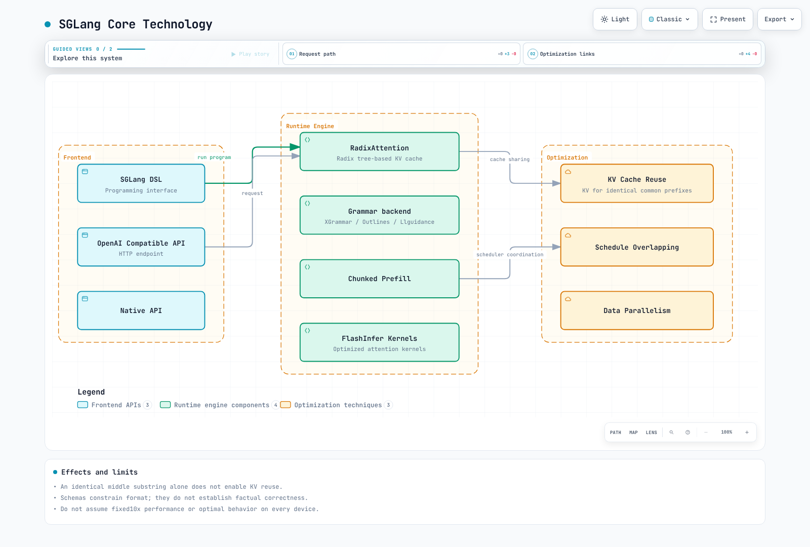

# LLM Serving のための Inference Frameworks

> **最終更新**: September 12, 2026
> **対象範囲**: 公式リリース、API、chart、およびローカルチェック。GPU/Neuron モデルの実行は含みません。

推論エンジン、分散実行レイヤー、Kubernetes controller、provider gateway は個別に選定してください。「OpenAI-compatible」は、endpoint、field、streaming、tool call、認証が同一であることを意味しません。

## Inference Framework の全体像



[インタラクティブな図を表示](https://www.atomai.click/kubernetes-docs/archmaps/en-ai-ml-04-inference-frameworks-0.html)

| コンポーネント | 確認済みベースライン | 選定チェック項目 |
| --- | --- | --- |
| NIM LLM/VLM | 2.0.12 documentation; separate 3.0 offering | Model、profile、hardware、support agreement、backend |
| Dynamo | 1.4.2 | Aggregated/disaggregated serving、KV transfer、planner、controller |
| AIBrix | 0.7.0 | Envoy Gateway、adapter/controller、autoscaling |
| SGLang | 0.5.19 | Model、grammar backend、device、測定済み workload |
| vLLM / Ray Serve | vLLM 0.29.0 / Ray 2.58.0 / KubeRay 1.7.0 | 個別に検証済みの image/model/controller の組み合わせ |
| TGI | 3.3.7; maintenance mode | 既存 system の maintenance と migration 計画 |
| Ollama | 0.34.0 | ローカル API access、model storage、準備 |
| LiteLLM | 1.100.1 | Provider adaptation、認証、fallback、cost instrumentation |
| Neuron | SDK 2.32.0; Helm 1.10.0 | Instance 固有の plugin/compiler/driver 互換性 |

万能な yes/no の feature matrix は避けてください。Dynamo の計画、vLLM/SGLang の disaggregation、CPU および GGUF support は、release、backend、hardware に依存します。Adapter loading と model alias は tenant 認証境界ではありません。

## NVIDIA NIM

container、model profile、GPU 互換性、support agreement をまとめて確認してください。NIM Operator 3.1.2 は LLM/VLM 2.0.12 container とは別です。確認した 2.0.12 release では vLLM 0.27.1 が文書化されています。NIM が常に TensorRT-LLM を使用するとは限りません。Dynamo ベースの 3.0 offering を 2.0 と同じ deployment path とみなさないでください。


[インタラクティブな図を表示](https://www.atomai.click/kubernetes-docs/archmaps/en-ai-ml-04-inference-frameworks-1.html)

### Deployment の準備と Profile

AMI、driver/toolkit、device-plugin の要件については [GPU guide](01-ai-ml-workloads.md) を使用してください。常に driver installation を有効にすると、provider AMI と競合する可能性があります。Karpenter NodePool/EC2NodeClass、実際に schedulable な CPU/RAM/GPU resource、および device 数を確認してください。8 GPU の Pod は 1 GPU または 4 GPU の node には収まりません。また Custom AMI には明示的な EKS bootstrap configuration が必要です。

container の profile list にある、support された profile ID/name で NIM_MODEL_PROFILE を使用してください。古い NIM_MANIFEST_PROFILE や、作り出した vllm-bf16-tp8 string が有効だと想定しないでください。image digest、model revision、profile、driver、実際の検証をまとめて記録してください。

NGC image-pull credential と runtime model-download credential は異なる役割を果たします。文書化された NGC_API_KEY environment path は、file-only credential policy を満たしません。承認済みの prepared-model path または検証済みの credential adapter を使用してください。実際の key を shell argument や source に絶対に置かないでください。internal Service だけでは inference request を認証できません。

異なる node 上の replica 間で、1 つの EBS RWO PVC を共有しないでください。replica ごとの storage/local cache または適切な shared filesystem を選び、download failure、storage performance、startup probe、rollout をテストしてください。model は常に image に埋め込まれているわけではなく、cache は FSx/S3 と自動的に同期しません。

### Metrics と GenAI-Perf

確認した NIM 2.0.12 documentation は、native vLLM backend metrics を pass through する `/v1/metrics` を公開しています。作り出した nim_* 名や `/metrics` をコピーするのではなく、実際の name、unit、label を確認してください。Grafana ConfigMap には、対応する datasource/sidecar と Prometheus scraping が必要です。millisecond panel に seconds をそのまま表示しないでください。

TTFT、ITL、end-to-end latency、successful throughput、queueing について workload 固有の SLO を定義してください。token interval が均一である場合、近似値は `TTFT + (output tokens - 1) × ITL` に network/postprocessing overhead を別途加えたものです。500ms や GPU80% などの target は、万能な health standard ではありません。

GenAI-Perf 0.0.16 は、profile subcommand と synthetic-input-tokens-mean/output-tokens-mean option を使用します。以下の command は準備済み internal endpoint に負荷をかけるものですが、この audit では実行していません。最初に perf_analyzer、tokenizer、その他の distribution dependency を準備してください。

```bash
genai-perf profile   --endpoint-type chat   --service-kind openai   --url http://127.0.0.1:8000   --model approved-model-alias   --concurrency 2   --synthetic-input-tokens-mean 128   --output-tokens-mean 64   --num-prompts 20   --profile-export-file profile_export.json
```

analyze が JSON の postprocessing のみであると想定しないでください。sweep setting は追加の profiling を実行する可能性があります。raw request、failure、tokenizer、warmup、concurrency、model/backend revision を保持してください。GPU utilization には実際の metrics collection が必要です。

## NVIDIA Dynamo

公式の 1.4.2 Kubernetes path は Dynamo platform、DynamoGraphDeployment (DGD)、DynamoGraphDeploymentRequest (DGDR) を使用します。以前に作り出された dynamo-router/dynamo-worker image、KV_CACHE_HOST、任意の router YAML では実装されません。DGDR は profiling と DGD creation を要求します。read-only inspection ではありません。


[インタラクティブな図を表示](https://www.atomai.click/kubernetes-docs/archmaps/en-ai-ml-04-inference-frameworks-2.html)

### 実際の DGD 構造

この **schema-checked configuration** は、public model と制限された execution setting 向けに、公式の 1.4.2 v1beta1 aggregated example を適応したものです。platform/controller、namespace、GPU、model access、networking が必要です。deployment 前に model/image digest を pin し、実際の hardware を検証してください。この audit では model を実行していません。

```yaml
apiVersion: nvidia.com/v1beta1
kind: DynamoGraphDeployment
metadata:
  name: vllm-agg
  namespace: dynamo-system
spec:
  components:
  - name: Frontend
    podTemplate:
      spec:
        containers:
        - image: nvcr.io/nvidia/ai-dynamo/vllm-runtime:1.4.2
          name: main
          resources:
            requests:
              cpu: 250m
              memory: 512Mi
            limits:
              cpu: '1'
              memory: 2Gi
    replicas: 1
    type: frontend
  - name: VllmDecodeWorker
    podTemplate:
      spec:
        containers:
        - args:
          - --model
          - Qwen/Qwen3-0.6B
          - --max-model-len
          - '2048'
          - --max-num-seqs
          - '8'
          command:
          - python3
          - -m
          - dynamo.vllm
          image: nvcr.io/nvidia/ai-dynamo/vllm-runtime:1.4.2
          name: main
          resources:
            limits:
              nvidia.com/gpu: '1'
              cpu: '4'
              memory: 12Gi
            requests:
              ephemeral-storage: 2Gi
              cpu: '2'
              memory: 4Gi
          workingDir: /workspace/examples/backends/vllm
    replicas: 1
    type: worker
```

Disaggregation には、互換性のある prefill/decode role、KV connector/format、model revision、networking が必要です。backend や GPU の任意の混在が、自動的に相互運用できるわけではありません。KV-aware routing は locality と load のバランスを取ります。固定の 0.7/0.3 formula は万能な実装ではありません。Redis はすべての Dynamo deployment に必須の KV tensor store ではありません。

確認した platform chart の cluster-wide operator は、crd-apply init container を介して CRD を管理します。upgradeCRD=false は external management を選択しますが、CRD requirement を取り除くものではありません。planner、discovery、NATS/etcd、Grove/KAI、その他の release 固有の setting を確認してください。chart rendering は CRD application、authorization、live discovery を検証しません。

## AIBrix

Version0.7.0 は Envoy Gateway、gateway plugin、controller-manager、metadata service を使用します。KubeRay は Ray ベース capability では optional です。以前の standalone aibrix-registry server と /v1/lora/register API は、確認した 0.7.0 installation path ではありません。

### ModelAdapter と PodAutoscaler

実際の ModelAdapter field には baseModel、podSelector、artifactURL が含まれます。replicas を省略すると、matching Pod のすべてに adapter を load します。1 では 1 つの Pod を選択し、他の値は拒否されます。example bucket/revision と base model は承認済みの value に置き換えてください。controller の download permission、runtime compatibility、adapter capacity/lifecycle、tenant authorization は個別に検証してください。

```yaml
apiVersion: model.aibrix.ai/v1alpha1
kind: ModelAdapter
metadata:
  name: support-lora
  namespace: ai-inference
spec:
  baseModel: approved-base-model
  podSelector:
    matchLabels:
      model.aibrix.ai/name: approved-base-model
  artifactURL: s3://REPLACE_WITH_APPROVED_BUCKET/adapters/support/REVISION/
  replicas: 1
```

PodAutoscaler0.7.0 は、任意の autoscaler ConfigMap ではなく、metricsSources と HPA/KPA/APA strategy を使用します。この CPU example には metrics-server、workload CPU request、controller が必要です。GPU queue ベースの scaling を検証するものではありません。同じ target に対して scaler owner が競合しないようにしてください。

```yaml
apiVersion: autoscaling.aibrix.ai/v1alpha1
kind: PodAutoscaler
metadata:
  name: model-cpu
  namespace: ai-inference
spec:
  scaleTargetRef:
    apiVersion: apps/v1
    kind: Deployment
    name: prepared-model-server
  minReplicas: 1
  maxReplicas: 3
  scalingStrategy: HPA
  metricsSources:
  - metricSourceType: resource
    targetMetric: cpu
    targetValue: '70'
```

## Ray Serve の統合

監査済みの [Ray Serve](ray/04-ray-serve.md) および [KubeRay](ray/02-kuberay-operator.md) API を使用してください。KubeRay reconciliation、Ray worker autoscaling、Serve replica autoscaling には異なる役割があります。RayCluster を通常の Deployment HPA scale target として使用したり、生成される cluster/Serve Service 名や selector を推測したりしないでください。

code と dependency は head だけでなく execution worker に到達しなければなりません。user_config は constructor argument を自動的に変更しません。適切な reconfigure path を実装してください。互換 API には、実際の chat template、streaming、cancellation、finish reason、usage、error が必要です。role string を連結して stream=true を無視するだけでは不十分です。古い Ray2.9/operator1.1 example と無条件の trust_remote_code=True は削除されました。

## SGLang

Version0.5.19 の RadixAttention は、共通 prefix に対して KV を再利用します。任意に重複する途中の substring は、交換可能な cached prefix ではありません。Model、KV format、access policy は一致しなければなりません。現在の grammar backend には、default の XGrammar と代替の Outlines/Llguidance が含まれます。「compressed FSM により常に 10x 高速」というのは一般的な結論ではありません。



[インタラクティブな図を表示](https://www.atomai.click/kubernetes-docs/archmaps/en-ai-ml-04-inference-frameworks-3.html)

### Structured Request の例

この client は、SGLang の json_schema request shape を support する承認済み gateway を前提とします。通常の completion と output shape を確認します。検証では、synthetic response と failure case を用いる local HTTP fixture を使用します。model accuracy を測定するものではありません。JSON の有効性は、事実上の正確性や tool authorization を保証しません。

```python
from pathlib import Path
import json
from urllib.request import Request, urlopen

# Existing private gateway and a scoped credential mounted as a file.
base_url = "https://inference.example.internal/v1"
credential = Path("/run/secrets/inference/token").read_text().strip()
payload = {
    "model": "approved-model-alias",
    "messages": [{"role": "user", "content": "Return the city Seoul and country Korea."}],
    "temperature": 0,
    "max_tokens": 128,
    "response_format": {
        "type": "json_schema",
        "json_schema": {
            "name": "location",
            "schema": {
                "type": "object",
                "properties": {"city": {"type": "string"}, "country": {"type": "string"}},
                "required": ["city", "country"],
                "additionalProperties": False,
            },
        },
    },
}
request = Request(
    base_url + "/chat/completions",
    data=json.dumps(payload).encode(),
    headers={"Content-Type": "application/json", "Authorization": "Bearer " + credential},
    method="POST",
)
with urlopen(request, timeout=30) as response:
    result = json.load(response)
choice = result["choices"][0]
if choice["finish_reason"] != "stop":
    raise RuntimeError("Generation did not complete normally")
location = json.loads(choice["message"]["content"])
if set(location) != {"city", "country"} or not all(isinstance(v, str) for v in location.values()):
    raise ValueError("Unexpected output shape")
print(location)
```

SGLang の function/system/user/assistant/gen DSL API はこの release にも残っています。function を宣言しても inference は実行されません。準備済みの RuntimeEndpoint/backend に接続して実行してください。installation 時に Torch、FlashInfer、hardware 互換性を検証してください。この audit では full GPU SDK を install せず、DSL も model に接続していません。

## Hugging Face TGI

公式 repository は **maintenance mode** を宣言しています。確認した最新 release は 3.3.7(December19,2025) です。minor fix、documentation、maintenance を受け付けており、新しい engine の採用は vLLM/SGLang などへ誘導しています。新規 project に対する汎用 default recommendation ではなくなりました。既存 deployment を migration する際は、model、template、streaming、metrics、SLO の互換性を検証してください。

--quantize=awq を追加しても、通常の model から AWQ weight が自動的に生成されるわけではありません。その format で準備された support 対象の model を使用してください。floating tag、欠落した gated-model credential、短い liveness deadline は reproducibility と startup 成功を損ないます。

## Ollama

0.34.0 では、model の pull と serving は別々の operation です。sleep10 を含む postStart hook は readiness を保証しません。承認済み model を prestage するか、health check、上限付き retry、failure handling を備えた別の preparation procedure を使用してください。mutable な model tag と storage permission を記録してください。

local Ollama API は user 認証を提供しません。公開する前に authorization と path control を前段に置いてください。Pod localhost にのみ bind された server には、Service 経由で到達できません。OLLAMA_HOST は listening scope を変更するものであり、認証ではありません。model-management endpoint と inference endpoint の scope を個別に設定してください。

Modelfile は base model、system prompt、generation setting を定義します。model を train したり Kubernetes image を build したりするものではありません。大規模 multitenancy を想定するのではなく、model size、device、backend ごとの CPU/GPU support を検証してください。

## LiteLLM

[Agentic AI guide](03-agentic-ai-platform.md) の監査済み 1.100.1 Router configuration を使用してください。provider gateway は inference engine とは別の layer です。alias を gpt-4-equivalent と呼んでも、同等の quality が確立されるわけではありません。fallback はまず、allowed-provider と data-egress policy を満たさなければなりません。

実際の configuration file を proxy command に接続し、必要に応じて client credential、DB/Redis、callback を構成してください。dummy key や ClusterIP は認証ではありません。drop_params=true は意味のある request condition を取り除く可能性があります。request、success、failure、retry、cache cost を区別してください。

## AWS Neuron と Inferentia2

chip、NeuronCore、host RAM/HBM を区別してください。各 Inferentia2 chip には 2 個の NeuronCore-v2 core と 32GiB の HBM があります。

| Instance | Chip | NeuronCore-v2 | Device HBM (GiB) | Host RAM (GiB) | vCPU |
| --- | --- | --- | --- | --- | --- |
| inf2.xlarge | 1 | 2 | 32 | 16 | 4 |
| inf2.8xlarge | 1 | 2 | 32 | 128 | 32 |
| inf2.24xlarge | 6 | 12 | 192 | 384 | 96 |
| inf2.48xlarge | 12 | 24 | 384 | 768 | 192 |

### Device 割り当てと Plugin Path

aws.amazon.com/neuron は **device 全体**を割り当てます。aws.amazon.com/neuroncore は **core** を割り当てます。以前の inf2.xlarge example では、1 device、4 vCPU、16Gi RAM の node に対して neuron:2、8 CPU、24Gi RAM を request していました。これは schedule できません。NEURON_RT_VISIBLE_CORES は runtime scope を選択するもので、未割り当ての device を作成するものではありません。選んだ release に対して、NUM_CORES および logical-core policy との precedence を確認してください。

確認した公式 Helm1.10.0 には、device-plugin、scheduler、node-problem-detector の option が含まれます。installation 前に、render された DaemonSet、hostPath、RBAC、recovery behavior を確認してください。この command は local output のみを生成します。

```bash
helm template neuron-audit oci://public.ecr.aws/neuron/neuron-helm-chart   --version 1.10.0 --namespace kube-system --include-crds > neuron-rendered.yaml
```

SDK2.32.0 では 2 つの別個の path が文書化されています。**Inf2/Trn1/Trn2 向けの vLLM0.16 を伴う NxD Inference plugin0.5.x** と、**Trn2/Trn3 専用の新しい vLLM Neuron beta0.24.0.1.1.0** です。詳細な NxD guide は依然として 0.5.0/SDK2.29 を示す一方、overview は 0.5.3 を示しています。選択した plugin tag、DLC、正確な dependency を検証してください。Inf2 に最新 beta を install したり、古い 2.18 DLC に pip install を追加したりすることは、互換性の検証ではありません。

Neuron compilation には、support された model implementation、shape/batch/sequence bucket、TP、compiler/SDK、hardware、cache artifact が必要です。未使用の tp_degree dictionary とともに generic Transformers model で torch_neuronx.trace を呼び出しても、分散 causal-LM serving は実装されません。compiler output file と tokenizer directory は異なる artifact です。この audit では compiler も Neuron instance も実行していません。

## Performance、Cost、Operations

出典のない A100 ranking table と固定の 40–70% savings claim は削除されました。同じ model/revision/precision、input/output-token distribution、concurrency、success rate、SLO、warmup、日付付き price を比較してください。1 日あたり 100 万 request を 30 日続けると 3,000 万 request です。仮想的な月額 48,000 dollars は 1,000 request あたり 1.60 dollars です。以前の 0.80 という数値は算術的に誤っていました。この例は現在の AWS pricing ではありません。

engine を変更する際は、実際の payload、template、streaming、usage、failure behavior を regression してください。shard された model group と独立した replica を区別し、StatefulSet の ordered readiness が相互に待機する worker を block していないか確認してください。StatefulSet だけでは TP/PP、rendezvous、NCCL は構成されません。

model size、restart/download concurrency、authorization、cost を使用して local cache、EBS、EFS、FSx を比較してください。EFS が FSx より常に遅いわけではなく、過去の gp3 limit は現在の guarantee ではありません。[GPU/storage example](01-ai-ml-workloads.md) を参照してください。

operations の前に、実際の environment で authentication、TLS、management path、probe、placement、quota、単一の scaler owner、metrics unit、pin された model revision、cache lifecycle、rollout/rollback、interruption recovery をテストしてください。

## 検証範囲

チェック対象は、公式 chart/CRD、実際の SDK/CLI source、local HTTP request/failure fixture、Markdown、image です。GPU/Neuron model execution、throughput/cost measurement、cloud deployment、model download は実行していません。schema/chart の成功は、admission、authorization、model compatibility、production readiness を確立するものではありません。

## 参考資料

- [NIM 2.0 release notes](https://docs.nvidia.com/nim/large-language-models/2.0.12/about-nim-llm/release-notes.html)
- [NIM configuration](https://docs.nvidia.com/nim/large-language-models/2.0.12/reference/environment-variables.html)
- [NIM observability](https://docs.nvidia.com/nim/large-language-models/2.0.12/reference/logging-and-observability.html)
- [Dynamo 1.4.2](https://github.com/ai-dynamo/dynamo/tree/v1.4.2)
- [AIBrix 0.7.0](https://github.com/aibrix/aibrix/tree/v0.7.0)
- [SGLang 0.5.19 structured output](https://github.com/sgl-project/sglang/blob/v0.5.19/docs/docs/advanced_features/structured_outputs.mdx)
- [TGI maintenance notice](https://github.com/huggingface/text-generation-inference)
- [Ollama 0.34.0](https://github.com/ollama/ollama/tree/v0.34.0)
- [GenAI-Perf 0.0.16](https://pypi.org/project/genai-perf/0.0.16/)
- [Neuron SDK 2.32.0 inference paths](https://github.com/aws-neuron/aws-neuron-sdk/blob/v2.32.0/libraries/vllm-neuron/neuron-inference-overview.rst)
- [Inf2 architecture](https://awsdocs-neuron.readthedocs-hosted.com/en/latest/about-neuron/arch/neuron-hardware/inf2-arch.html)
- [Neuron Kubernetes components](https://github.com/aws-neuron/neuron-helm-charts)

## クイズ

[Inference Frameworks Quiz](../quizzes/ai-ml/04-inference-frameworks-quiz.md)
