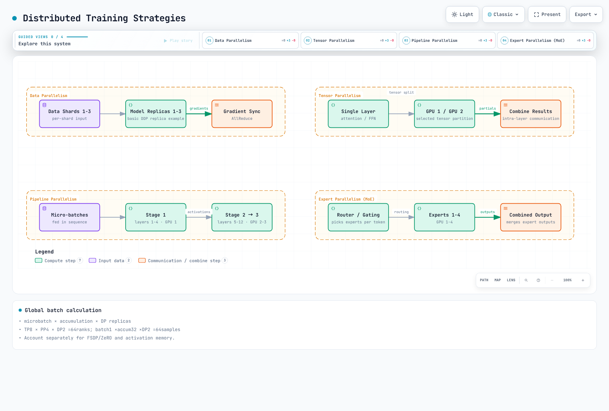
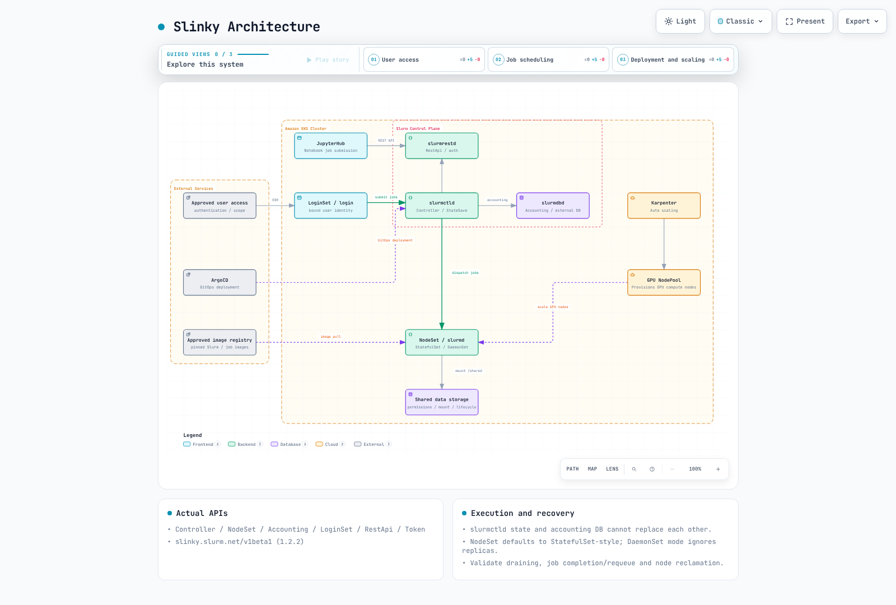

# EKS でのモデル学習

> **最終更新**: September 12, 2026
> **ベースライン**: Slinky1.2.2, MPI Operator0.8.2, Volcano1.15.2, PyTorch2.14.0, Neuron SDK2.32.0

分散学習には、互換性のあるモデルコード、データシャーディング、ランチャー、デバイス割り当て、通信、チェックポイントが必要です。有効な manifest または Running Pod は、学習やリカバリが機能することを証明しません。

単一 GPU QLoRA および SageMaker AI/EKS の比較については、イメージのサポートライフサイクルと実行制限を含む [Qwen ガイド](sagemaker-ai/README.md)を参照してください。

## 学習パイプライン


[インタラクティブ図を表示](https://www.atomai.click/kubernetes-docs/archmaps/en-ai-ml-05-model-training-0.html)

## 分散学習戦略



[インタラクティブ図を表示](https://www.atomai.click/kubernetes-docs/archmaps/en-ai-ml-05-model-training-1.html)

| 戦略 | 分割単位 | 検証する制約 |
| --- | --- | --- |
| DDP | 異なるデータバッチ、モデルレプリカ | 学習状態・activation メモリおよび gradient synchronization |
| FSDP / ZeRO | パラメータ、gradient、optimizer state | ステージ固有の通信およびチェックポイント形式 |
| TP | レイヤー内の Tensor 演算 | head/hidden 次元、backend、topology |
| PP | レイヤーステージ | microbatch、pipeline bubble、activation 転送 |
| Expert parallel | MoE expert および token dispatch | 不均衡、all-to-all、routing capacity |
| 組み合わせ | DP/TP/PP/context/expert group | サポートされる device mesh および総 rank 数 |

100B パラメータを超えれば常に3Dが最適であるとは限りません。weight 以外の optimizer、gradient、activation、通信メモリを考慮し、その上で throughput とリカバリコストを比較してください。DDP all-reduce にパラメータサーバーは必要ありません。

TP8×PP4×DP2 は64rank を意味します。グローバル batch は **microbatch × accumulation × DP replica** です:1×32×2=64であり、すべての TP/PP rank を再度掛けて2048にはなりません。可変長 packing では、sample と token を別々に追跡してください。

## Slurm と Slinky

公式リポジトリは SlinkyProject/slurm-operator です。Tag1.2.2 とその OCI chart を検証しました。GitHub releases/latest は404を返したため、最新の GitHub release とは説明していません。1.2 のドキュメントでは最小 Kubernetes1.29 および Slurm25.11(data parser0.0.44)が記載されています。最小互換性は運用上のサポートライフサイクルを保証するものではありません。



[インタラクティブ図を表示](https://www.atomai.click/kubernetes-docs/archmaps/en-ai-ml-05-model-training-2.html)

### 実際の API とライフサイクル

Version1.2.2 は `slinky.slurm.net/v1beta1` に Controller、NodeSet、Accounting、LoginSet、RestApi、Token を定義します。以前の SlurmCluster/SlurmNodeSet の例はこの API ではありません。NodeSet は controllerRef と Pod template を使用します。デフォルトの scalingMode は StatefulSet のように動作します。DaemonSet mode は一致する Kubernetes node ごとに1つの Pod を作成し、replica を無視します。これらは NodeSet-controller mode であり、slurmd が常に Kubernetes DaemonSet resource として実行される証拠ではありません。

slurmctld は job/node/partition state と scheduling を管理するため、その StateSaveLocation を保持してください。slurmdbd は accounting database へのアクセスと record を処理するものであり、controller state の代替ではありません。login/REST/job identity、filesystem permission、Slurm key/JWT、DB credential の配信・ローテーションをまとめて設計してください。Public NLB SSH 公開はデフォルトの前提条件ではありません。

まず実際の chart を render してください。これらの command はローカルファイルを生成するだけです。運用デプロイには別途、cert-manager/CRD/operator/Slurm の順序、永続化/database、user identity、互換性のある Slurm image が必要です。

```bash
helm template slurm-api oci://ghcr.io/slinkyproject/charts/slurm-operator-crds   --version 1.2.2 > slurm-crds.yaml
helm template slurm-control oci://ghcr.io/slinkyproject/charts/slurm-operator   --version 1.2.2 --namespace slinky > slurm-operator.yaml
helm template slurm-example oci://ghcr.io/slinkyproject/charts/slurm   --version 1.2.2 --namespace slurm   --set-json 'nodesets={"cpu-example":{}}'   --set partitions.all.enabled=true > slurm-example.yaml
```

Argo CD Application は実在する chart path/revision と実際の values を参照する必要があります。作り物の compute.partitions/efa.enabled 設定では構成されません。pruning、CRD/PVC 削除、Slurm draining/requeue、job 終了 timeout をレビューしてください。NodeSet の scale-in と EC2 の終了は別個の control loop です。

### Slurm からの torchrun 起動

ノードごとに1つの torchrun launcher を実行し、GPU ごとの process をその launcher に作成させます。以前は8つの Slurm task がそれぞれ8 process を起動しており、ノードごとに64process が生成されていました。この例は4node×8process を意図しており、この監査では実際の Slurm/GPU allocation は実行していません。

```bash
#!/bin/bash
#SBATCH --job-name=distributed-training
#SBATCH --nodes=4
#SBATCH --ntasks-per-node=1
#SBATCH --gpus-per-node=8
#SBATCH --cpus-per-task=16
#SBATCH --time=01:00:00
set -euo pipefail

: "${SLURM_NNODES:?Run within an approved Slurm allocation}"
: "${SLURM_JOB_ID:?}"
: "${SLURM_JOB_NODELIST:?}"
export MASTER_ADDR
MASTER_ADDR=$(scontrol show hostnames "$SLURM_JOB_NODELIST" | head -n 1)
export MASTER_PORT=29500

# One torchrun launcher per Slurm node, eight training processes per launcher.
# train.py, dependencies, data, credentials and checkpoints must be prepared.
srun --ntasks="$SLURM_NNODES" --ntasks-per-node=1 bash -c '
  exec torchrun \
    --nnodes="$SLURM_NNODES" \
    --nproc-per-node=8 \
    --node-rank="$SLURM_PROCID" \
    --rdzv-id="$SLURM_JOB_ID" \
    --rdzv-backend=c10d \
    --rdzv-endpoint="$MASTER_ADDR:$MASTER_PORT" \
    /workspace/train.py
'
```

Slurm が task ごとの GPU 可視性を制限する場合は、各 launcher が意図する8つすべての GPU を受け取ることを確認してください。train.py は LOCAL_RANK/RANK/WORLD_SIZE、device binding、DDP/sampler、バージョン管理された data/model、resume を実装する必要があります。shell fixture では、4つの launcher、異なる node rank、共通の rendezvous endpoint を検証しました。

## GPU 通信と EFA

FI_PROVIDER=efa は libfabric provider を選択しますが、EFA のインストール、interface のアタッチ、NCCL との統合は行いません。サポートされる EFA 有効 instance、driver/libfabric、aws-ofi-nccl、device plugin/Pod allocation、security group、実際の transport をまとめて検証してください。RAID0 や subnet tag で EFA が有効になるわけではありません。

通信する node は同じ AZ を共有する必要があります。パフォーマンスのため cluster placement group が推奨されます。学習 Pod が制限された NodePool を実際に使用することを確認してください。帯域幅と EFA-device 数は instance により異なり、400Gbps が普遍的ではありません。古い Ring/Simple、IB_DISABLE、SOCKET_IFNAME、FI_EFA_USE_DEVICE_RDMA 設定を盲目的に強制すると、現在の plugin に干渉する可能性があります。release documentation、log、collective test を検証してください。

Karpenter budgets.nodes=0 は自発的な disruption path を制限しますが、Spot reclamation、node failure、強制終了、すべての expiration を防ぐものではありません。do-not-disrupt/PDB と terminationGracePeriod/expireAfter の相互作用を確認し、checkpoint recovery を保持してください。各 bootstrap で浮動 version の driver installer を取得したり、device type をまたいで GPU clock を固定したりすることは避けてください。

## BioNeMo

確認した3.0.0 は **BioNeMo Recipes** であり、TransformerEngine ベースの model/checkpoint と、PyTorch、Accelerate、Lightning 向けの recipe を提供します。ESM-2、AMPLIFY、Geneformer などに対する recipe 固有の support を確認してください。BioNeMo1.5 の MegaMolBART module を3.0 API であるかのように実行しないでください。生物学的評価および model/data permission は別途必要であり、GPU allocation だけでは recipe を準備できません。

## Trainium と Neuron

SDK2.32.0 の torch-neuronx、NeuronX Distributed Training/model implementation、Optimum Neuron path を区別してください。transformers-neuronx の inference support は一般的な training support ではありません。古い2.18 DLC に任意の pip package を追加するのではなく、TensorFlow/JAX/PyTorch version を選択した hardware/SDK に照らして確認してください。

Optimum Neuron0.4.5 には NeuronTrainer/NeuronTrainingArguments と、専用の Neuron training-model implementation が含まれます。一般的な BertForPreTraining を読み込み、未定義の dataset/tokenizer variable を渡しても完全な TP training にはなりません。サポートされる model/config、label/collator、tokenizer/revision、optimizer/checkpoint format、launcher を準備してください。CPU 例の PyTorch2.14 は Neuron SDK 互換性を示すものではありません。

### Multi-node Job と事前コンパイル

Job parallelism=4 は4つの Pod を起動するだけで、rank や rendezvous を構成しません。Indexed Job には completionMode/index と1つの共有 master endpoint が必要です。各 Pod の MASTER_ADDR を自身の status.podIP に設定すると、worker は異なる master を参照します。coordinator/controller topology とサポートされる launcher を使用し、train_lora.py、data、compile cache、device を準備してください。

neuron_parallel_compile は graph を抽出・コンパイルするものであり、実際の training の代替ではありません。その後に個別に training を実行し、cache hit、shape、compiler/SDK revision を検証してください。core と device の違いについては、[Neuron unit distinctions](04-inference-frameworks.md)を参照してください。

## Ray Train、MPI、Volcano

監査済みの Ray2.58/KubeRay1.7 [Train ガイド](ray/03-ray-train-tune.md)を使用してください。worker 間で report-call count を一致させ、実際の Checkpoint object を report してください。get_checkpoint() は以前の recovery state を取得するものであり、新しい save context manager ではありません。resources_per_worker GPU8 を指定しても、1つの worker 内で8つの DDP process が自動的に起動されるわけではありません。

MPI Operator0.8.2 は kubeflow.org/v2beta1 を使用します。slotsPerWorker は hostfile slot を宣言しますが、mpirun -np、mapping、GPU binding を独立して決定するものではありません。Launcher/Worker code、MPI/SSH implementation、サポートされる image、CRD/RBAC を準備してください。4worker×8slot だけでは32GPU process が保証されません。

Volcano1.15.2 の minAvailable は EC2 node ではなく **Pod/member** を数えます。十分に provision された3 node に4 Pod を配置できる場合があります。gang plugin は minimum-member/resource 条件を適用しますが、同時の container startup や training success を保証するものではありません。追加 worker、elastic-runtime support、RestartJob/requeue の動作をレビューしてください。

JupyterHub GPU profile は実際の image/device label と authorization に一致する必要があります。g5.xlarge は A100 profile ではなく A10G です。設定を実行中の Hub に組み込み、user ごとの storage、quota、networking、idle culling を構成してください。

## 学習ストレージとチェックポイント

監査済みの CSI path は [GPU/storage ガイド](01-ai-ml-workloads.md)を使用してください。既存の FSx filesystem を static PV で mount することは、dynamic provisioning で新規作成することとは異なります。FileSystem dataRepositoryAssociations field を作り出したり、SCRATCH_2 と persistent-only throughput setting を混在させたりしないでください。DRA/import/export API、policy、completion を個別に検証してください。

EFS PVC capacity request は物理ストレージ quota ではありません。access-point UID/GID、directory permission、CSI identity、networking、mount target を検証してください。ローカル checkpoint は S3 transfer が完了するまでリモートで durable ではありません。

recovery には model、optimizer、scheduler、RNG、使用時は scaler、data/sampler cursor、すべての sharded state が必要です。複数の rank が1つの file を上書きすることを避け、framework-aware distributed saving を使用してください。以前の有効な checkpoint を削除する前に、completion manifest/checksum、remote transfer、restore を検証してください。作り物の checkpoint-manager image や auto_resume=true ConfigMap では、これらの機能は実装されません。

### 実行可能な小規模 CPU 例

この合成16sample・1 CPU thread の例は、4回の optimizer update を実行します。accumulation、境界付き cosine schedule、一時 file の置換、optimizer/RNG の復元を示します。PyTorch2.14.0+cpu では、中断なしの training と2 step 後の resume で同一の結果が得られました。これは GPU、分散、リモート durability のテストではありません。

```python
from pathlib import Path
import math
import os
import tempfile
import torch


def lr_factor(step, warmup_steps, total_steps, min_ratio=0.1):
    if not 0 <= warmup_steps < total_steps or not 0 <= min_ratio <= 1:
        raise ValueError("Invalid schedule bounds")
    if step < 0:
        raise ValueError("Step must be non-negative")
    if step < warmup_steps:
        return step / max(1, warmup_steps)
    progress = min(1.0, (step - warmup_steps) / (total_steps - warmup_steps))
    return min_ratio + (1 - min_ratio) * (1 + math.cos(math.pi * progress)) / 2


def save_checkpoint(path, state):
    path = Path(path)
    path.parent.mkdir(parents=True, exist_ok=True)
    temporary = None
    try:
        with tempfile.NamedTemporaryFile(dir=path.parent, delete=False) as output:
            temporary = output.name
            torch.save(state, output)
            output.flush()
            os.fsync(output.fileno())
        os.replace(temporary, path)
    finally:
        if temporary is not None and os.path.exists(temporary):
            os.unlink(temporary)


def train_toy(checkpoint_path, stop_after=4, resume=False):
    # Tiny deterministic CPU example; no GPU, dataset or model download.
    torch.set_num_threads(1)
    torch.manual_seed(17)
    model = torch.nn.Linear(2, 1)
    optimizer = torch.optim.SGD(model.parameters(), lr=0.05, momentum=0.9)
    scheduler = torch.optim.lr_scheduler.LambdaLR(
        optimizer, lambda step: lr_factor(step, 1, 4)
    )
    inputs = torch.arange(32, dtype=torch.float32).reshape(16, 2) / 32
    targets = inputs.sum(dim=1, keepdim=True)
    start = 0
    if resume:
        saved = torch.load(checkpoint_path, map_location="cpu", weights_only=True)
        model.load_state_dict(saved["model"])
        optimizer.load_state_dict(saved["optimizer"])
        scheduler.load_state_dict(saved["scheduler"])
        torch.set_rng_state(saved["torch_rng"])
        start = saved["optimizer_step"]
    if not start <= stop_after <= 4:
        raise ValueError("Invalid stopping point")
    for step in range(start, stop_after):
        optimizer.zero_grad(set_to_none=True)
        # Two equal-sized microbatches per optimizer update.
        for microbatch in range(2):
            offset = step * 4 + microbatch * 2
            prediction = model(inputs[offset:offset + 2])
            loss = torch.nn.functional.mse_loss(prediction, targets[offset:offset + 2]) / 2
            loss.backward()
        torch.nn.utils.clip_grad_norm_(model.parameters(), 1.0)
        optimizer.step()
        scheduler.step()
        save_checkpoint(checkpoint_path, {
            "model": model.state_dict(),
            "optimizer": optimizer.state_dict(),
            "scheduler": scheduler.state_dict(),
            "optimizer_step": step + 1,
            "torch_rng": torch.get_rng_state(),
        })
    return {name: value.detach().clone() for name, value in model.state_dict().items()}


if __name__ == "__main__":
    path = Path("toy-training.pt")
    train_toy(path, stop_after=2)
    train_toy(path, stop_after=4, resume=True)
    print("Completed four CPU optimizer updates, including checkpoint resume.")
```

この例は1つの filesystem 上での completed-file replacement を示すものであり、filesystem crash/directory metadata durability、S3 transaction、分散 checkpoint protocol を示すものではありません。固定された data order も、一般的な sampler recovery を実装していません。普遍的な500step/five-copy rule ではなく、save latency、failure rate、許容できる失われる作業量、cost を用いて checkpoint interval/retention を選択してください。

## 数値精度とメモリ最適化

現在の PyTorch API では torch.amp.autocast と torch.amp.GradScaler を使用します。BF16 は FP32 と exponent-bit count を共有しますが、mantissa precision や正確な maximum finite value は共有しません。一般に FP16 型の loss scaling を回避できますが、hardware、operation、convergence を検証してください。Autocast はすべての weight/optimizer state を BF16 に変換するものではありません。

activation checkpointing は backward 中に activation を再計算し、compute と memory をトレードオフします。disk checkpoint とは異なり、3–4x の節約も30% の slowdown も保証しません。use_reentrant を明示的に指定し、gradient、dropout/RNG、stateful layer を検証してください。

Flash Attention/SDPA backend の選択は dtype、head size、device、mask に依存します。training state を定義し、evaluation 中は dropout_p=0 を渡してください。明示的/causal mask の組み合わせに対する API support を確認してください。use_cache=False だけでは attention backend は導入されません。

DeepSpeed0.19.6 の ZeRO1 は optimizer state を partition し、2 は gradient を追加し、3 は parameter を追加します。CPU/NVMe offload は別途構成されるもので、Stage3 により自動で有効になるわけではありません。auto value を置換する上位レベルの integration と、純粋な DeepSpeed configuration を区別してください。buffer、activation、最大 layer により、無制限の memory 削減は妨げられます。

scheduler は accumulation microstep ではなく optimizer update によって進めてください。cosine が training horizon 後に再上昇しないよう progress を clamp し、例のように warmup/total-step の境界を検証してください。

## 検証範囲

すべてのガイド/quiz の prose と76個の一意な original code block をレビューしました。確認範囲には、公式 Slinky Helm/CRD、MPI/Volcano API と SDK source、小規模 CPU training/resume、shell-launcher fixture が含まれます。GPU/Neuron/EFA、Slurm/MPI cluster、実際の pretrained model、cloud resource は実行していません。ローカルの code/schema verification は production deployment validation とは異なります。

## 参考資料

- [Slinky 1.2.2](https://github.com/SlinkyProject/slurm-operator/tree/v1.2.2)
- [Slurm controller](https://slurm.schedmd.com/slurmctld.html)
- [Slurm accounting daemon](https://slurm.schedmd.com/slurmdbd.html)
- [MPI Operator 0.8.2](https://github.com/kubeflow/mpi-operator/tree/v0.8.2)
- [Volcano 1.15.2 gang plugin](https://github.com/volcano-sh/volcano/blob/v1.15.2/pkg/scheduler/plugins/gang/gang.go)
- [EKS EFA networking](https://docs.aws.amazon.com/eks/latest/best-practices/aiml-networking.html)
- [BioNeMo 3.0.0 recipes](https://github.com/NVIDIA/bionemo-framework/tree/v3.0.0)
- [Optimum Neuron 0.4.5](https://github.com/huggingface/optimum-neuron/tree/v0.4.5)
- [Neuron SDK 2.32.0](https://github.com/aws-neuron/aws-neuron-sdk/tree/v2.32.0)
- [PyTorch 2.14 launcher](https://github.com/pytorch/pytorch/blob/v2.14.0/torch/distributed/run.py)
- [DeepSpeed 0.19.6 ZeRO configuration](https://github.com/deepspeedai/DeepSpeed/blob/v0.19.6/deepspeed/runtime/zero/config.py)

## クイズ

[モデル学習クイズ](../quizzes/ai-ml/05-model-training-quiz.md)
