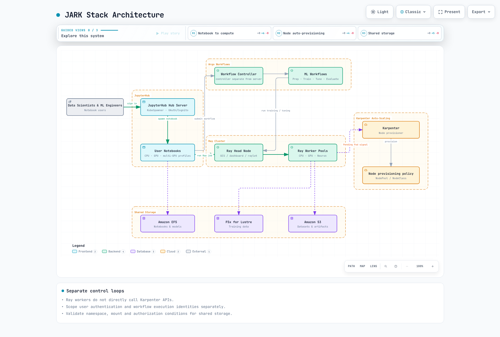

# EKS 上の AI インフラストラクチャ

> **最終更新**: September12,2026
> **基準バージョン**: GPU Operator26.7.0 / NVIDIA DRA0.5.0 / Argo Workflows4.1.3 / JupyterHub chart4.4.2 / Mountpoint CSI2.8.0

AI インフラストラクチャは、notebook、パイプライン、分散ランタイム、デバイス/ノード、ストレージ/ネットワーク、および認可を組み合わせたものです。ツールの一覧や Helm リリースの成功が、プラットフォームのセキュリティ、可用性、モデル実行を保証するわけではありません。

## レイヤーと責務


[View interactive diagram](https://www.atomai.click/kubernetes-docs/archmaps/en-ai-ml-06-ai-infrastructure-0.html)

ワークロードはモデル/データ/実行コードを所有し、プラットフォームはワークフロー、ランタイム、レジストリを所有し、コンピュートは実際のデバイス、Pod、ノード容量を所有します。IAM、ネットワーク、ストレージのアイデンティティはこれらのレイヤーを横断します。Spot を有効にした NodePool は、容量も復旧やコスト削減も保証しません。

## JARK スタック

JARK は JupyterHub、Argo Workflows、Ray、Karpenter を組み合わせたものです。これは統合パターンであり、自動的に接続された単一の製品ではありません。notebook の認可、ワークフローの投入、Ray ジョブ、Kubernetes のスケジューリング、ノードのプロビジョニングを明示的に接続してください。



[View interactive diagram](https://www.atomai.click/kubernetes-docs/archmaps/en-ai-ml-06-ai-infrastructure-1.html)

### JupyterHub の認証と notebook プロファイル

chart4.4.2 は appVersion5.5.2 を宣言しており、調査した最新の PyPI 上の Hub6.0.0 とは異なります。ローカルの API チェックでは Hub6.0.0/OAuthenticator17.4.0/KubeSpawner7.1.0 を使用しました。運用する chart イメージ内の実際のパッケージ組み合わせを検証してください。

Cognito は OIDC プロバイダーの選択肢の1つです。コールバック URL、token/userInfo エンドポイント、スコープ、安定した username クレームを一致させ、明示的な許可ポリシーを設定してください。MFA や企業フェデレーションはプロバイダー側で設定する必要があります。GenericOAuthenticator が自動的に有効化するわけではありません。

この Hub 設定は、/run/secrets/oidc にマウントされた既存の Secret ボリュームを前提としています。実際のシークレットは ConfigMap、ソースコード、環境変数に置かないでください。この Python ファイルを Hub の実際の設定パスに組み込み、URI や承認済みの sub の値を自分の環境向けに置き換えてください。

```python
from pathlib import Path

c.JupyterHub.authenticator_class = "oauthenticator.generic.GenericOAuthenticator"
c.GenericOAuthenticator.client_id = "prepared-client-id"
c.GenericOAuthenticator.client_secret = Path("/run/secrets/oidc/client-secret").read_text().strip()
c.GenericOAuthenticator.oauth_callback_url = "https://jupyter.example.com/hub/oauth_callback"
c.GenericOAuthenticator.authorize_url = "https://prepared-domain.auth.us-west-2.amazoncognito.com/oauth2/authorize"
c.GenericOAuthenticator.token_url = "https://prepared-domain.auth.us-west-2.amazoncognito.com/oauth2/token"
c.GenericOAuthenticator.userdata_url = "https://prepared-domain.auth.us-west-2.amazoncognito.com/oauth2/userInfo"
c.GenericOAuthenticator.scope = ["openid", "profile", "email"]
c.GenericOAuthenticator.username_claim = "sub"
c.GenericOAuthenticator.allow_all = False
c.GenericOAuthenticator.allow_existing_users = False
c.GenericOAuthenticator.allowed_users = {"replace-with-approved-cognito-sub"}
```

この例では allow_all=False、明示的な allowed_users、allow_existing_users=False を設定しています。ローカルのチェックでは、承認済みのアイデンティティ1つを許可し、未承認のユーザーや以前のユーザーを拒否しました。実際の OAuth ログインやトークン交換は実行していません。

notebook の CPU/RAM の保証値と上限値を区別し、実際の GPU イメージ、ラベル、toleration、ドライバーを一致させてください。古い jupyter/*:gpu タグが CUDA を提供すると想定しないでください。PVC は利用する Pod と同じ namespace に存在する必要があります。jupyterhub の Pod が ml-platform の PVC を名前だけで参照することはできません。ユーザーごとのアクセスポイント、UID/GID、クォータ、共有モデルへの書き込み権限を確認してください。EFS の storage_capacity は物理的な容量上限ではありません。

### Argo Workflows のデータフロー

以前のワークフローは、存在しないテンプレート、アーティファクト、スクリプトを参照していました。この **小さなデータフローのフィクスチャ** は6つのステージで構成されます。値を Python のソースコードに埋め込む代わりに、環境変数と JSON でパラメーターを受け渡します。2つの係数の間で選択を行うだけであり、実際の画像分類の学習、Ray クラスター、外部レジストリのパイプラインではありません。

Argo4.1.3 のオフライン lint と6つすべての Python スクリプト本体をローカルで検証しました。運用前に、prepared-workflow-runner を最小権限で用意し、イメージダイジェスト、クォータ、アーティファクトストレージを別途設定してください。

```yaml
apiVersion: argoproj.io/v1alpha1
kind: Workflow
metadata:
  generateName: toy-dataflow-
  namespace: argo
spec:
  entrypoint: pipeline
  serviceAccountName: prepared-workflow-runner
  parallelism: 1
  activeDeadlineSeconds: 600
  arguments:
    parameters:
    - name: data
      value: '[[1,2],[2,4],[3,6],[4,8]]'
  templates:
  - name: pipeline
    dag:
      tasks:
      - name: validate
        template: validate
        arguments:
          parameters:
          - name: data
            value: '{{workflow.parameters.data}}'
      - name: prepare
        template: prepare
        arguments:
          parameters:
          - name: data
            value: '{{tasks.validate.outputs.result}}'
        dependencies:
        - validate
      - name: tune
        template: tune
        arguments:
          parameters:
          - name: data
            value: '{{tasks.prepare.outputs.result}}'
        dependencies:
        - prepare
      - name: train
        template: train
        arguments:
          parameters:
          - name: scale
            value: '{{tasks.tune.outputs.result}}'
        dependencies:
        - tune
      - name: evaluate
        template: evaluate
        arguments:
          parameters:
          - name: model
            value: '{{tasks.train.outputs.result}}'
          - name: data
            value: '{{tasks.prepare.outputs.result}}'
        dependencies:
        - train
      - name: register
        template: register
        arguments:
          parameters:
          - name: model
            value: '{{tasks.train.outputs.result}}'
        dependencies:
        - evaluate
        when: '{{tasks.evaluate.outputs.result}} == 0'
  - name: validate
    inputs:
      parameters:
      - name: data
    script:
      image: python:3.12.14-slim-trixie
      command:
      - python
      env:
      - name: DATA
        value: '{{inputs.parameters.data}}'
      resources:
        requests:
          cpu: 100m
          memory: 64Mi
        limits:
          cpu: 500m
          memory: 128Mi
      source: 'import json, os

        rows = json.loads(os.environ["DATA"])

        assert rows and all(len(row) == 2 for row in rows)

        assert all(isinstance(v, (int, float)) for row in rows for v in row)

        print(json.dumps(rows))

        '
  - name: prepare
    inputs:
      parameters:
      - name: data
    script:
      image: python:3.12.14-slim-trixie
      command:
      - python
      env:
      - name: DATA
        value: '{{inputs.parameters.data}}'
      resources:
        requests:
          cpu: 100m
          memory: 64Mi
        limits:
          cpu: 500m
          memory: 128Mi
      source: 'import json, os

        rows = json.loads(os.environ["DATA"])

        print(json.dumps({"train": rows[:2], "test": rows[2:]}))

        '
  - name: tune
    inputs:
      parameters:
      - name: data
    script:
      image: python:3.12.14-slim-trixie
      command:
      - python
      env:
      - name: DATA
        value: '{{inputs.parameters.data}}'
      resources:
        requests:
          cpu: 100m
          memory: 64Mi
        limits:
          cpu: 500m
          memory: 128Mi
      source: 'import json, os

        data = json.loads(os.environ["DATA"])

        candidates = [1.0, 2.0]

        loss = lambda scale: sum((scale*x-y)**2 for x,y in data["train"]) / len(data["train"])

        print(min(candidates, key=loss))

        '
  - name: train
    inputs:
      parameters:
      - name: scale
    script:
      image: python:3.12.14-slim-trixie
      command:
      - python
      env:
      - name: SCALE
        value: '{{inputs.parameters.scale}}'
      resources:
        requests:
          cpu: 100m
          memory: 64Mi
        limits:
          cpu: 500m
          memory: 128Mi
      source: 'import json, os

        print(json.dumps({"scale": float(os.environ["SCALE"]), "fixture": True}))

        '
  - name: evaluate
    inputs:
      parameters:
      - name: model
      - name: data
    script:
      image: python:3.12.14-slim-trixie
      command:
      - python
      env:
      - name: MODEL
        value: '{{inputs.parameters.model}}'
      - name: DATA
        value: '{{inputs.parameters.data}}'
      resources:
        requests:
          cpu: 100m
          memory: 64Mi
        limits:
          cpu: 500m
          memory: 128Mi
      source: 'import json, os

        model = json.loads(os.environ["MODEL"])

        held_out = json.loads(os.environ["DATA"])["test"]

        print(sum((model["scale"]*x-y)**2 for x,y in held_out) / len(held_out))

        '
  - name: register
    inputs:
      parameters:
      - name: model
    script:
      image: python:3.12.14-slim-trixie
      command:
      - python
      env:
      - name: MODEL
        value: '{{inputs.parameters.model}}'
      resources:
        requests:
          cpu: 100m
          memory: 64Mi
        limits:
          cpu: 500m
          memory: 128Mi
      source: 'import json, os

        model = json.loads(os.environ["MODEL"])

        print(json.dumps({"candidate": model, "note": "fixture output only; no registry write"}))

        '
```

フィクスチャの MSE0 は4件の合成サンプルから得られたものであり、実際のモデル品質の測定結果ではありません。本番のワークフローには、train/test の分離、データ/モデルのリビジョン、失敗/リトライ/冪等性のルール、実際のアーティファクトの受け渡しが必要です。artifactRepositoryRef は boto3 をインストールしたり、アプリケーションにダウンロード権限を付与したりはしません。

### Ray と Karpenter

[Ray ガイド](ray/README.md) の監査済みの Ray2.58/KubeRay1.7 の手順を使用してください。GCS は Global Control Service を意味します。スケジューリングは raylet と連携します。head は CPU を公開している場合に処理を実行することがあります。CPU/GPU/Neuron の worker 間で未検証の Ray/Python の組み合わせは避けてください。Neuron イメージにも Ray と互換性のあるフレームワークが必要です。

Ray のオートスケーリングは worker Pod の需要を表現し、Kubernetes のスケジューラーが Pod を配置し、Karpenter がサポートされたノード容量を供給します。Ray の worker が Karpenter の API を直接呼び出すことはありません。メモリや GPU の product ラベルを実際のノードに一致させてください。40GB の p4d A100 を80GB のラベルで選択しないでください。

AL2023 の NVIDIA AMI 上でドライバーを重複導入したり、containerd の設定全体を上書きしたりしないでください。Karpenter の limits は絶対的なアドミッションやコストの上限ではなく、consolidation は DCGM の20% 使用率しきい値を直接使用するわけでもありません。requests、スケジューリングの実現可能性、価格、中断の制約を確認してください。

## DRA API とサポート境界

DRA は、DeviceClass、ResourceSlice、ResourceClaim/Template を通じてデバイスの属性、要求、割り当てを表現します。ドライバーが slice を公開し、scheduler/driver のコンポーネントが claim を割り当てて準備します。手書きの ResourceSlice が実際の GPU を生み出すことはありません。Kubernetes API の成熟度と NVIDIA ドライバーの機能の成熟度は別物です。


[View interactive diagram](https://www.atomai.click/kubernetes-docs/archmaps/en-ai-ml-06-ai-infrastructure-2.html)

### 現行の claim の例

調査した Kubernetes1.36.2 の resource.k8s.io/v1 スキーマは requests.exactly を使用します。NVIDIA driver0.5 の前提条件は、GPU の割り当て(1.34.2+) と ComputeDomains(1.32+) を区別しています。EKS が実際に提供する API とパッチ/プラットフォームバージョンを検証してください。「1.31+ ですべての DRA 機能が使える」というのは不正確です。

この **スキーマの例** は、GPU claim1つとインベントリコマンドを実行する Pod を定義します。ml-workloads namespace、gpu.nvidia.com DeviceClass、driver/CDI、ノード、権限は別途用意してください。この監査では GPU の実行は行っていません。

```yaml
apiVersion: resource.k8s.io/v1
kind: ResourceClaimTemplate
metadata:
  namespace: ml-workloads
  name: single-gpu
spec:
  spec:
    devices:
      requests:
      - name: gpu
        exactly:
          deviceClassName: gpu.nvidia.com
          count: 1
---
apiVersion: v1
kind: Pod
metadata:
  name: gpu-inventory-demo
  namespace: ml-workloads
spec:
  restartPolicy: Never
  automountServiceAccountToken: false
  containers:
  - name: inspect
    image: ubuntu:24.04
    command:
    - nvidia-smi
    - -L
    resources:
      claims:
      - name: gpu
      requests:
        cpu: 100m
        memory: 64Mi
      limits:
        cpu: 500m
        memory: 128Mi
  resourceClaims:
  - name: gpu
    resourceClaimTemplateName: single-gpu
  tolerations:
  - key: nvidia.com/gpu
    operator: Exists
    effect: NoSchedule
```

CEL では、実際に公開されている型付きの属性やドメイン構造を使用しなければなりません。以前の device.topology.node==device.topology.node は、同一ノードへの配置を表現しておらず、API にも一致していません。matchAttribute には実際の修飾された属性が必要です。通常の単一 Pod の GPU claim が、NVL72 ラック全体の72GPU を自動的に割り当てることはありません。

### NVIDIA0.5 と GPU Operator26.7

0.5 の README では GPU の割り当てを依然として実験的でデフォルト無効と記述しており、インストール手順/chart および Operator26.7 のドキュメントと矛盾しています。実際のスタンドアロン chart は resources.gpus.enabled=true をデフォルトとしますが、device plugin との衝突を避けるため、明示的なオプトインがない場合は **レンダリングを拒否** します。デフォルトのインストールが GPU を暗黙的に無効化して成功する、と説明しないでください。

Operator26.7 の管理パスでは gpu-cluster という名前の GPUCluster シングルトンを使用し、これは ClusterPolicy と相互排他です。ドライバーが事前インストールされている場合の手順では、clusterPolicy.deployCR=false、gpuCluster.deployCR=true、driver.enabled=false を設定します。GPUCluster がドライバー/toolkit の準備すべてを置き換えるわけではありません。driver/CDI の前提条件は自分で用意してください。スタンドアロンの DRA リリースを重複してインストールしないでください。ローカルのレンダリングは提供されている DeviceClass API をシミュレートしたものであり、実際のクラスターの機能を有効化したわけではありません。

フル GPU/既存 MIG および ComputeDomain のサポートを、alpha の DynamicMIG、MPS、TimeSlicingSettings と区別してください。調査した0.5 の feature gate のコードでは、これら3つが false/Alpha と宣言されています。一部のドキュメントの GA ラベルはソースの Beta ラベルと異なる場合もあります。対象リリースのサポートマトリクス、コード、設定を必ずまとめて記録してください。GPU Operator25.3 だけで、すべてのサポートが成立するわけではありません。

device plugin も既存の MIG、time-slicing、実験的な MPS の経路をサポートします。GPU の共有は DRA 専用の機能ではありません。3g.20gb は1つのインスタンスプロファイルの名前であり、20GB のインスタンスが3つあるという意味ではありません。MIG や排他的な割り当てが、ホスト、ドライバー、権限、あらゆるサイドチャネルを自動的に分離するわけではありません。MPS や time-slicing はセキュリティ境界ではありません。

### マルチノード NVLink と ComputeDomains

GB200 は Grace Blackwell であり、Grace Hopper ではありません。ComputeDomains は Pod/ノードをまたいで MNNVL/IMEX のリソースを調整します。ラック、EC2 インスタンス、Kubernetes ノード、Pod を区別し、実際の clique/fabric/デバイス/ドライバーのサポートを検証してください。架空の nvswitchEnabled/graceHopperMode フィールドやスケジューリングゲートがトポロジーを設定することはありません。ゲートを削除するコントローラーのないスケジューリングゲートは、Pod を待機状態のままにします。

## エージェントプラットフォームと MCP

[Agentic AI ガイド](03-agentic-ai-platform.md) の現行の Kagent/LangGraph/Langfuse/Milvus API を使用してください。GitLab は任意のソース/CI プラットフォームです。特権 runner や公開 ingress はベースラインの要件ではありません。ジョブのアイデンティティ、ネットワーク、シークレット、イメージビルドの権限を分離し、プロバイダーの資格情報の受け渡しを検証してください。

MCP はツールの一覧取得や呼び出しといったプロトコル操作を定義するものであり、Kubernetes の標準的な自動ディスカバリーコントローラーやゲートウェイのディストリビューションではありません。以前の ghcr.io/anthropics/mcp-gateway:latest イメージと mcp.anthropic.com/tool のラベル/設定は未検証の実装であり、削除されました。実際のサーバー/ゲートウェイのリリースを選択し、トランスポート、認証、認可、タイムアウト、ツールの入力スキーマを検証してください。URL の環境変数がそれらの操作を実装するわけではありません。

Milvus に GPU リソースを要求しても GPU インデックスが有効になるわけではありません。埋め込みの次元数/モデルのリビジョン、インデックスのパラメーター、削除/更新のライフサイクル、テナントのフィルターを一致させてください。Langfuse2.x の Deployment を現行の4.x プラットフォームのインストールとして使用しないでください。バックエンドの依存関係、ファイルベースの資格情報、計測 API、機微データの保持期間を確認してください。

## ストレージとネットワーク

EFS のアクセスポイントの IAM/UID/GID、ディレクトリの権限、同一 namespace での PVC の利用を検証してください。IAM のマウントオプションだけでは、controller やマウントアイデンティティの資格情報は設定されません。

サポートされている FSx CSI のパラメーターと容量の単位を使用してください。PERSISTENT_2 に対する架空の s3ImportPath/s3ExportPath 設定や、無効な10Ti の容量をコピーしないでください。既存/静的なファイルシステムと新規にプロビジョニングされるファイルシステム、DRA、バックアップの互換性を [ストレージガイド](01-ai-ml-workloads.md) で区別してください。

Mountpoint CSI2.8.0 は既存の S3 バケットに対する **静的 PV** をサポートします。StorageClass/PVC のみで動的にバケットを作成する例は削除しました。Mountpoint は完全な POSIX 互換ではありません。rename、ランダム書き込み、ロック、チェックポイントの挙動を確認してください。2.8 のサポート表からは AL2/Ubuntu22.04 が削除され、インストールはリポジトリのブランチではなく EKS アドオンまたは公式 chart を使うよう案内されています。

インターフェイス数に、すでに集約値であるインスタンスの帯域幅を掛け算しないでください。以前の p4d の「4×400Gbps」と trn1n の「16×1600Gbps」という数値は誤りでした。同一 AZ への配置、実際のインターフェイス、driver/libfabric/NCCL、デバイス/Pod の割り当て、セキュリティグループについては [トレーニングのネットワークガイド](05-model-training.md) を参照してください。RAID0 や efa-enabled のタグが EFA を有効化するわけではありません。

サブネットは分離の一部にすぎません。ワークロードの ingress/egress と EFA の自己参照の要件は、実際の SG/IAM リソースで設定してください。ConfigMap に格納された Terraform 風の YAML がネットワークルールを適用することはありません。VPC CIDR 全体からのデフォルトアクセスは避けてください。

## GPU の可観測性とアラート

DCGM Exporter4.6.0-4.8.3 は XID_ERRORS を最後のエラー **コードのゲージ** として定義しています。increase(XID_ERRORS) はエラー件数ではなく、31→13 というコードの変化をリセットと誤読する可能性があります。現在のコードを観測するか、XID_ERRORS_TOTAL カウンターを別途有効にしてください。すべての XID がハードウェア障害を示すわけではありません。

FB_USED/FB_FREE は MiB 単位のゲージであり、以下の比率は0～1 の範囲になります。予約された VRAM が多いことは必ずしも OOM を意味しません。割り当ての失敗、ワークロードの挙動、モデルキャッシュ、利用可能なメモリをまとめて確認してください。85C/20% という固定のしきい値は、普遍的な障害/回収の基準ではありません。PCIe スループットや NVLink 帯域幅のゲージに rate() を適用する前に、実際のメトリクスの型と単位を確認してください。

これらのルールは Prometheus1つあたりクラスター1つを前提としています。複数クラスターを統合する場合は、集約や join に cluster ラベルを含めてください。実際のノード/UUID/MIG のラベルと、kube-state-metrics のリソースラベルの正規化を確認してください。

```yaml
groups:
- name: gpu-observations
  rules:
  - record: gpu:framebuffer_used_ratio
    expr: DCGM_FI_DEV_FB_USED / (DCGM_FI_DEV_FB_USED + DCGM_FI_DEV_FB_FREE)
  - alert: GPUReportedXIDCode
    expr: DCGM_FI_DEV_XID_ERRORS > 0
    for: 1m
    labels:
      severity: warning
    annotations:
      summary: "Inspect the reported XID code and workload context"
  - record: namespace:pending_gpu_requesting_pods:count
    expr: |
      count by (namespace) (
        max by (namespace, pod) (kube_pod_status_phase{phase="Pending"} == 1)
        and on (namespace, pod)
        max by (namespace, pod) (kube_pod_container_resource_requests{resource="nvidia_com_gpu"} > 0)
      )
```

pending のルールは GPU を要求して待機している Pod を数えますが、待機の原因が GPU 不足であることを証明するものではありません。GPU を要求するコンテナーが複数あっても、Pod ごとに1回だけカウントされます。イベント、PVC、affinity、taint、クォータ、claim、イメージの pull を確認してください。すべてのアラートにノードラベルが存在すると想定しないでください。

DCGM、Ray、Karpenter について、実際の Prometheus のルール選択と正しい Service/ポートのスクレイピングを設定してください。Grafana のファイルによるプロビジョニングは、HTTP のダッシュボードラッパーとは異なります。ラベルだけでデータソースが接続されることはありません。Neuron monitor の出力と exporter のエンドポイントは別途準備が必要です。

## 検証の範囲

元のガイド/クイズの本文すべてと58個のユニークなコードブロックをレビューしました。チェック対象は、DRA/Pod のスキーマ、公式 Helm、OAuthenticator の許可ポリシー、Argo のオフライン lint/スクリプト本体、Prometheus のフィクスチャです。実際の OAuth/クラスター/GPU/DRA の割り当て、モデル、S3 マウント、MCP サーバーは実行していません。クラウドリソースの作成や課金対象の呼び出しも行っていません。

## 参考資料

- [GPU Operator26.7 DRA installation](https://docs.nvidia.com/datacenter/cloud-native/gpu-operator/26.7/dra-intro-install.html)
- [NVIDIA DRA0.5 source](https://github.com/kubernetes-sigs/dra-driver-nvidia-gpu/tree/v0.5.0)
- [DRA0.5 prerequisites](https://github.com/kubernetes-sigs/dra-driver-nvidia-gpu/blob/v0.5.0/site/content/docs/prerequisites.md)
- [DRA0.5 feature gates](https://github.com/kubernetes-sigs/dra-driver-nvidia-gpu/blob/v0.5.0/pkg/featuregates/featuregates.go)
- [OAuthenticator17.4](https://github.com/jupyterhub/oauthenticator/tree/17.4.0)
- [JupyterHub chart4.4.2](https://github.com/jupyterhub/zero-to-jupyterhub-k8s/releases/tag/4.4.2)
- [Argo Workflows4.1.3](https://github.com/argoproj/argo-workflows/tree/v4.1.3)
- [Mountpoint CSI2.8.0](https://github.com/awslabs/mountpoint-s3-csi-driver/tree/v2.8.0)
- [DCGM Exporter counter definitions](https://github.com/NVIDIA/dcgm-exporter/blob/4.6.0-4.8.3/etc/default-counters.csv)
- [MCP tools specification](https://modelcontextprotocol.io/specification/2025-11-25/server/tools)

## クイズ

[AI インフラストラクチャクイズ](../quizzes/ai-ml/06-ai-infrastructure-quiz.md)
