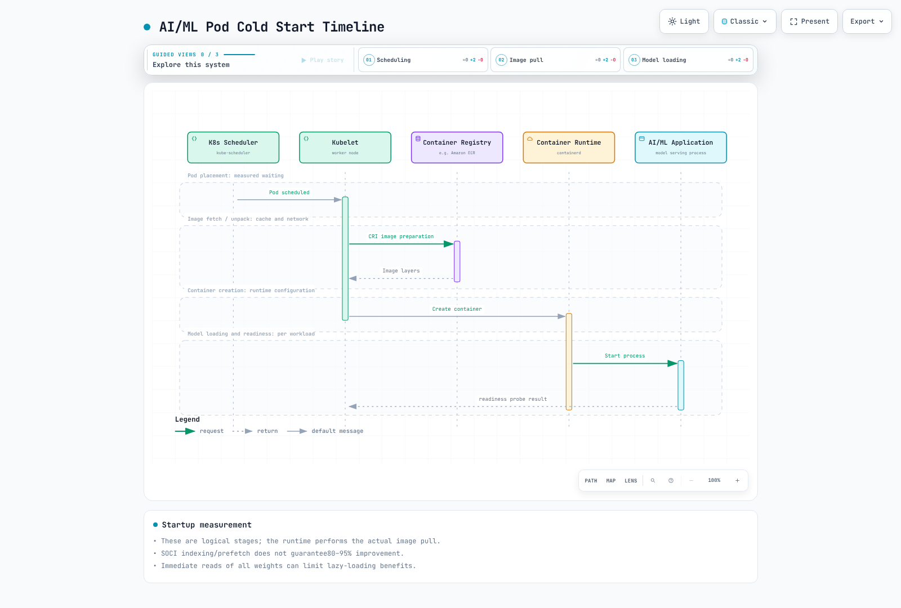

# EKS における AI/ML ベストプラクティス

> **最終更新**: September 12, 2026
> **ベースライン**: inference-perf0.6.1 / SOCI0.15.0 / Karpenter1.14.1 / External Secrets2.10.0

同一のワークロードに対し、レイテンシー、成功率、スループット、コスト、リカバリを用いて改善を評価します。GPU、snapshotter、共有機能が、一定の高速化率または削減率を保証するわけではありません。


[インタラクティブ図を表示](https://www.atomai.click/kubernetes-docs/archmaps/en-ai-ml-07-ai-ml-best-practices-0.html)

## LLM Inference のベンチマーク


[インタラクティブ図を表示](https://www.atomai.click/kubernetes-docs/archmaps/en-ai-ml-07-ai-ml-best-practices-1.html)

| 指標 | 定義と注意事項 |
| --- | --- |
| TTFT | 送信から最初の **空でない出力** を受信するまで。最初の HTTP/SSE フレームにトークンが含まれるとは限りません |
| ITL | トークン/チャンク間の間隔。ネットワークチャンクには複数のトークンが含まれる場合があります |
| TPOT | 最初のトークン以降のツール定義の平均。出力トークンが 1 個以下の場合は未定義です |
| E2E | リクエストから完了までの時間。キュー、ネットワーク、後処理の境界を記録します |
| リクエストスループット | 成功して完了したリクエスト数 / 指定の測定ウィンドウ |
| トークンスループット | ウィンドウ内の出力トークン合計 / 時間。リクエスト TPS の非加重平均ではありません |
| Goodput | 成功およびレイテンシー SLO 基準を満たすリクエストのレート |

実際のトークンタイムスタンプがある場合、平均 ITL は (最後のトークン時刻 - 最初のトークン時刻)/(トークン数 - 1) です。非ストリーミング応答では、実際の TTFT/ITL は測定できません。tokenizer、空または単一トークンの出力、失敗、warmup の除外を指定してください。500ms/50ms は普遍的な SLO ではありません。

### inference-perf と GenAI-Perf

inference-perf は Kubernetes SIGs/wg-serving のベンチマークツールです。確認した PyPI パッケージは 0.6.1 ですが、その Git tag の pyproject では依然として 0.5.0 と記載されています。このメタデータの不一致は記録されています。実際の CLI は --config_file または --server.type のような構造化オプションを使用し、以前の benchmark --endpoint --prompt-length インターフェイスは使用しません。

この **内部 mock** 設定はモデルサーバーを呼び出しません。実際の 0.6.1 CLI は、1 worker で 3 リクエストを完了しました。mock のトークン数はゼロで、TTFT/TPOT は null のため、これらはモデルパフォーマンスの結果ではありません。

```yaml
api:
  type: chat
  streaming: false
data:
  type: mock
load:
  type: concurrent
  stages:
    - concurrency_level: 1
      num_requests: 3
  num_workers: 1
  worker_max_concurrency: 1
  base_seed: 17
server:
  type: mock
  base_url: http://127.0.0.1:8000
report:
  request_lifecycle:
    summary: true
    per_stage: true
    per_request: true
storage:
  local_storage:
    path: ./benchmark-fixture-results
```

```bash
inference-perf --config_file benchmark-fixture.yaml
```

実際の endpoint に切り替える前に、server/API type、model alias、streaming、tokenizer、認証を検証してください。設定には secret header が含まれる場合があり、マージされた設定はログに記録されるため、credential の配信とマスキングを検証してください。dataset のプライバシーおよび使用許可を尊重して、出力ファイル、生の request/response、失敗を保持してください。

一定/Poisson レートは 1 秒あたりの到着数を測定し、concurrent load は同時実行数を制御します。同じ数値設定は同等ではありません。単一リクエストのベースライン、上限付きの負荷ランプ、バースト、現実的な分布をテストしてください。飽和曲線だけでは CPU/GPU/memory のボトルネックを証明できません。profiling、キュー、ネットワーキング、client capacity を確認してください。

作り上げた --backend vllm の組み合わせではなく、GenAI-Perf0.0.16 の監査済み [profile/endpoint/service/token options](04-inference-frameworks.md) を使用してください。GPU metrics には別途収集が必要です。load-generator の CPU/network 制限を確認してください。Benchmark Job には、検証済みの image、設定キー、PVC、deadline、重複負荷を考慮した retry semantics が必要です。

## Container 起動の最適化



[インタラクティブ図を表示](https://www.atomai.click/kubernetes-docs/archmaps/en-ai-ml-07-ai-ml-best-practices-2.html)

image 転送、展開、model のダウンロード/ロード、readiness を個別に測定してください。出典のない「常に 5～15 分」および「80～95% の削減」表は削除されました。45GB/1Gbps≈360 秒は、圧縮サイズ、protocol、disk、concurrency overhead を除外した理想化された転送計算にすぎず、測定された pull 時間ではありません。

外部 model artifact は image の変更/pull を減らせますが、ダウンロードおよび cache-management コストを追加します。準備済み image は、環境によっては適切な場合があります。initialization は失敗を伝播し、revision、checksum、完了を検証する必要があります。以前の S3 sync の後に成功した echo を実行する方法はダウンロード失敗を隠す可能性があるため、削除されました。

Multi-stage build では、実行可能ファイル/shared library を含め、Python interpreter/ABI と CUDA/runtime library を整合させる必要があります。Ubuntu22.04 の python3.11 と pip3 が同じ interpreter を使用する、または site-packages のみをコピーすればよいとは仮定しないでください。サポート対象の distribution package/wheel を使用し、image 内で import/entrypoint をテストしてください。明示的な書き込み可能 cache/tmp/model mount を備えた read-only root filesystem を優先してください。

### SOCI0.15

SOCI は lazy image loading をサポートしますが、起動時にすべての weight/library をすぐに読み込む場合は利点が小さくなる可能性があります。index が存在しても、CRI が SOCI snapshotter を使用するよう設定されるわけではありません。containerd/CRI integration、image/index digest、registry compatibility を検証してください。host containerd socket を公開する未検証の privileged DaemonSet は削除されました。

Version0.15 の create/push は --ref ではなく位置指定の image reference を受け取ります。現在の getting-started では、SOCI 対応 image を作成するために convert を使用します。standalone mode は containerd または sudo を使用せず、ローカル OCI layout を処理します。

```bash
soci convert --standalone --format oci-dir input-oci-layout output-soci-layout
```

入力は通常の docker-save tarball ではなく OCI layout である必要があります。すべての layer が min-layer-size より小さい場合、変換に失敗することがあります。この監査では、min-layer-size=0 を明示した 1 つの synthetic layer を変換し、8 個の blob digest を検証しました。container 起動ベンチマークは実行していません。公開時には、変換済み image/index を一緒に保持してください。

### Bottlerocket Bootstrap

1.64 では、`bootstrap-containers.<name>.user-data` は bootstrap container がファイルとして使用する **base64 data** です。settings 内のプレーンな shell text は自動的には実行されません。source image は実在し、host image store/namespace を正しく使用する必要があります。静的な images-prefetched=true label は成功の証拠ではありません。

mode=once は実行後に off になります。essential=true の失敗は boot を停止します。false は失敗を許可するため、設定を readiness の要件に合わせてください。allowed-unsafe-sysctls は privileged-container の切り替えではありません。測定には prefetch が node preparation time に与える影響を含めてください。

## GPU、Neuron、Storage の選択

parameters×bytes は weight の下限にすぎません。architecture を考慮した KV cache、activation、workspace、communication buffer、fragmentation、sharding 制約を含めてください。13B FP16 weight≈26GB は 24GB に収まらず、70B FP16≈140GB は 4 台の 24GB GPU の合計を超えます。host CPU を増やしても、変更していない GPU VRAM が拡張されるわけではありません。

p4d.24xlarge8×40GB と p4de8×80GB A100 を区別してください。G5g は Arm/T4G を使用します。image/kernel architecture を検証してください。inf2.48xlarge192vCPUs/768GiB host RAM、12chips/24NeuronCores/384GiB HBM については、[監査済みの Inf2 table](04-inference-frameworks.md) を参照してください。P5 のような family name はすべての size で GPU 数を固定するものではありません。選択時には、利用可能な generation、region、quota、price を再確認してください。

LoRA は trainable adapter state を削減しますが、base weight/activation は保持し、QLoRA とは異なります。ほとんどの LoRA model が 24GB に収まると仮定する関数を使用しないでください。peak memory、latency、throughput、restart を測定してください。

10TB の dataset cutoff だけで storage を選択しないでください。access pattern、concurrency、metadata、latency、semantics、durability、cost を比較してください。現在の一般的な gp3 ドキュメントでは、size/IOPS/instance の制約を受けて、baseline は 3000IOPS/125MiB/s、maximum は 80000IOPS/2000MiB/s と記載されています。Outposts は異なります。過去の 16000IOPS/1GB/s 制限が普遍的に現在も有効とは限りません。

EFS Elastic throughput、FSx/CSI/S3 association、Mountpoint POSIX 制限については、[infrastructure guide](06-ai-infrastructure.md) を使用してください。S3 には無限の throughput も固定の latency もありません。EFS が常に FSx より遅いわけではありません。instance store/tmpfs は ephemeral です。GPU KV cache は通常 GPU memory にあり、SSD/tmpfs に自動的に存在するわけではありません。

### Model Cache の検証

config.json ファイルは weight のダウンロード完了を証明しません。immutable read-only storage を公開する前に、信頼できる release manifest/revision に照らして **すべてのファイル** を検証してください。concurrent downloader の競合と部分的に書き込まれたファイルを防止してください。

このローカル validator はダウンロード/削除を行いません。テストは、完全なファイル、誤った revision、部分的/欠落した weight、traversal、外部 symlink を対象にします。manifest の信頼性と検証後の immutability は、別個の要件として残ります。

```python
from pathlib import Path
import hashlib
import re


def verify_model_cache(root, manifest, expected_revision):
    """Verify files against a separately trusted release manifest; no downloads/deletion."""
    root = Path(root).resolve(strict=True)
    if manifest.get("revision") != expected_revision:
        raise ValueError("Model revision mismatch")
    files = manifest.get("files")
    if not isinstance(files, dict) or not files:
        raise ValueError("Empty or invalid release manifest")
    for relative, expected_hash in files.items():
        name = Path(relative)
        if name.is_absolute() or ".." in name.parts or not name.parts:
            raise ValueError("Unsafe manifest path")
        if not isinstance(expected_hash, str) or not re.fullmatch(r"[0-9a-f]{64}", expected_hash):
            raise ValueError("Invalid SHA256")
        target = (root / name).resolve(strict=True)
        if not target.is_relative_to(root) or not target.is_file():
            raise ValueError("File escapes the cache or is not a regular file")
        digest = hashlib.sha256()
        with target.open("rb") as source:
            for chunk in iter(lambda: source.read(1024 * 1024), b""):
                digest.update(chunk)
        if digest.hexdigest() != expected_hash:
            raise ValueError("Incomplete or corrupt model file: " + relative)
    return root
```

checkpoint には、[training/recovery example](05-model-training.md) と同様に optimizer/RNG/data-cursor および shard state が必要です。transfer、checksum、completion manifest が成功する前に、以前の有効なコピーを削除しないでください。以前の ls/xargs rm -rf loop は directory content と checkpoint path を混同し、read-only mount を通じて削除を試行していたため、削除されました。最初の sync を 30 分遅らせる、または termination flushing を省略すると、失われる作業への曝露が増加します。

## Networking と Scheduling

EFA は適したワークロードの communication を改善しますが、すべての DDP 実行に必要なわけではありません。interface、same-AZ placement、driver/libfabric/aws-ofi-nccl、Pod resource、security group、実際の transport を検証してください。RAID0/subnet tag では有効になりません。未検証の NCCL_TIMEOUT や、無批判にコピーした Ring/Simple/IB_DISABLE 設定を避けてください。torchrun --nnodes は node 数を数え、total-process WORLD_SIZE ではありません。

Karpenter1.14.1 の実際の placementGroupSelector を使用してください。aws:ec2:placement-group tag は placement API ではなく、aws: は user-tag namespace ではありません。この **schema example** には承認済みの AMI/subnet/SG/role identifier と既存の placement group が必要です。この例では amiFamily AL2023 を指定しているため、置き換えには別の OS 用 AMI ではなく、検証済みの EKS AL2023 AMI を使用する必要があります。EFA networkInterfaces 設定は完了しません。

```yaml
apiVersion: karpenter.k8s.aws/v1
kind: EC2NodeClass
metadata:
  name: prepared-gpu-class
spec:
  role: REPLACE_WITH_APPROVED_NODE_ROLE
  amiSelectorTerms:
  - id: ami-0123456789abcdef0
  subnetSelectorTerms:
  - id: subnet-0123456789abcdef0
  securityGroupSelectorTerms:
  - id: sg-0123456789abcdef0
  placementGroupSelector:
    name: prepared-training-placement-group
  amiFamily: AL2023
```

### Disruption Budget と Spot

この budget は月曜日から金曜日の **09:00～17:00UTC** に適用されます。以前の 0 9-17 * * 1-5 は、17:00 まで毎時 8 時間の window を開始していたため、保護を翌日の 01:00 まで延長していました。同時の budget にはより厳しい制限が適用され、local timezone に自動的には従いません。

```yaml
apiVersion: karpenter.sh/v1
kind: NodePool
metadata:
  name: reviewed-gpu-pool
spec:
  template:
    spec:
      nodeClassRef:
        group: karpenter.k8s.aws
        kind: EC2NodeClass
        name: prepared-gpu-class
      requirements:
      - key: karpenter.sh/capacity-type
        operator: In
        values:
        - on-demand
        - spot
  disruption:
    consolidationPolicy: WhenEmptyOrUnderutilized
    consolidateAfter: 5m
    budgets:
    - nodes: '0'
      schedule: 0 9 * * 1-5
      duration: 8h
    - nodes: 30%
```

budgets.nodes=0 は自発的な disruption を制限しますが、Spot interruption、node failure、forceful expiration は制限しません。Spot-only requirement は必須であり、on-demand fallback を伴う preference ではありません。ScheduleAnyway topology spread は soft です。実際の replica、capacity、AZ distribution を検証してください。

terminationGracePeriodSeconds=120 は、EC2 が 120 秒を付与することを保証しません。実際の termination を通じて、gateway readiness/draining、endpoint propagation、SIGTERM、active stream、retry、duplicate をテストしてください。vLLM /drain API を作り上げないでください。Inference cache、session、TP group には state/restart cost があります。

## 可観測性とコスト

[現在の vLLM metrics](02-vllm-deployment.md) と [DCGM rules](06-ai-infrastructure.md) を使用してください。KV occupancy は vllm:kv_cache_usage_perc であり、以前の gpu_cache_usage_perc ではありません。cache が満杯になると即座に request を拒否すると仮定するのではなく、queue/preemption と backend behavior を観測してください。ゼロ除算を処理して、現在の hit/query counter から prefix-hit ratio を導出してください。

DCGM FB_USED/FREE は MiB gauge です。XID_ERRORS は最後の code です。存在しない FB_TOTAL や gauge に対する increase() を避けてください。temperature だけでは thermal throttling を証明できません。clock、power、throttle reason、workload を比較してください。Prometheus label/histogram aggregation を一致させ、式に対する avg_over_time には有効な subquery syntax を使用してください。

VPA Off は CPU/memory recommendation を提供しますが、自動的な GPU-instance selection は行いません。以前の rightsizing script は最初の series だけを確認し、0～1 の ratio を 50/90 と比較していたため、削除されました。workload 全体で、削除後の peak、queue、SLO、recovery を確認してください。

実際の region/OS/purchase term、utilization、idle/failure time、storage、transfer、operation を使用して savings を記録してください。Spot/Savings Plans/RI は discount と capacity guarantee が異なります。固定の 60～90% 表や、optimization savings percentage の追加を避けてください。測定された baseline と variability を使用し、commitment-purchase の決定は別途行ってください。

## Model Access と Secret Management

S3 ListBucket と GetObject は、それぞれ bucket/object ARN およびサポートされる condition key を使用します。general-purpose bucket では、ABAC が明示的に有効化された後に aws:ResourceTag/Environment のような bucket-tag condition を使用できます。ABAC はデフォルトで無効です。tag condition だけをコピーするのではなく、bucket status、信頼された tag-administration permission、identity/bucket policy、action/resource pairing を検証してください。有効化しても必要な Allow が作成されたり、他の Deny policy が上書きされたりすることはありません。信頼関係にある ServiceAccount namespace/name、SDK credential chain、実際の request identity を検証してください。vLLM はすべての S3 model URI を自動的にダウンロードするわけではありません。

確認した ESO2.10.0 CRD は **v1 を serve** し、v1beta1 は served=false です。この例では、すでに承認済みの同一 namespace の SecretStore を参照します。remote key、permission、rotation、target lifecycle は別途準備してください。

```yaml
apiVersion: external-secrets.io/v1
kind: ExternalSecret
metadata:
  name: model-download-token
  namespace: ai-ml
spec:
  refreshPolicy: Periodic
  refreshInterval: 1h
  secretStoreRef:
    name: approved-secrets-manager
    kind: SecretStore
  target:
    name: model-download-credential
    creationPolicy: Owner
  data:
  - secretKey: token
    remoteRef:
      key: approved/model-download
      property: token
```

Kubernetes Secret を volume として mount し、必要に応じて application にファイルを再読み込みさせてください。subPath mount は自動更新を受け取りません。environment variable または startup 時にのみ読み取る値は自動的に reload されません。ESO refresh は、それ自体が upstream credential issuance/rotation ではありません。provider rotation、Secret access、application reload を個別に検証してください。

CloudTrail Secrets Manager API record は、ローカル Secret file のすべての application read を記録するわけではありません。kubectl describe が通常 SecretKeyRef value を表示すると主張しないでください。ただし environment による配信は process/debugging surface を公開し、file-credential policy とは異なります。例や log に実際の secret を絶対に出力しないでください。

NetworkPolicy には CNI enforcement が必要です。selector の AND/OR semantics、デフォルトの namespace-name label、TCP/UDP の両方の DNS を検証してください。10.0.0.0/8 の health-check 開放と「internet443 は S3-only」を意味する rule は削除されました。準備済み model を使用する場合、runtime egress を必要な path に制限し、gateway で inference/management API を区別してください。

Audit log は、適切に prompt/secret をマスキングしながら、user/workload identity、model revision、action、outcome、request ID を記録する必要があります。containerd CRI log を Docker として解析する、または request を含む行だけを保持する方法では、audit event が失われる可能性があります。ConfigMap だけでなく、実際の collector、parser、IAM、buffer、retention、delivery failure を検証してください。

## 検証範囲

元の guide/quiz のすべての prose と 87 個の一意な code block をレビューしました。検証には、3 件の native inference-perf mock request、SOCI local OCI conversion、6 件の cache case、3 件の Karpenter/ESO schema、cron arithmetic が含まれます。GPU/real-model benchmark、container-startup measurement、host SOCI installation、cloud resource、secret provider は実行していません。

## 参考資料

- [inference-perf0.6.1](https://github.com/kubernetes-sigs/inference-perf/tree/v0.6.1)
- [SOCI0.15 CLI](https://github.com/awslabs/soci-snapshotter/blob/v0.15.0/docs/cli-usage.md)
- [Bottlerocket1.64 bootstrap settings](https://bottlerocket.dev/en/os/1.64.x/api/settings/bootstrap-containers/)
- [Karpenter1.14.1 CRD](https://github.com/aws/karpenter-provider-aws/tree/v1.14.1/pkg/apis/crds)
- [Karpenter disruption](https://karpenter.sh/docs/concepts/disruption/)
- [ESO2.10 ExternalSecret CRD](https://github.com/external-secrets/external-secrets/blob/helm-chart-2.10.0/config/crds/bases/external-secrets.io_externalsecrets.yaml)
- [Kubernetes Secret の更新](https://kubernetes.io/docs/concepts/configuration/secret/)
- [S3 general-purpose bucket ABAC の有効化](https://docs.aws.amazon.com/AmazonS3/latest/userguide/buckets-tagging-enable-abac.html)
- [EBS gp3 performance](https://docs.aws.amazon.com/ebs/latest/userguide/general-purpose.html)

## クイズ

[AI/ML ベストプラクティス クイズ](../quizzes/ai-ml/07-ai-ml-best-practices-quiz.md)
