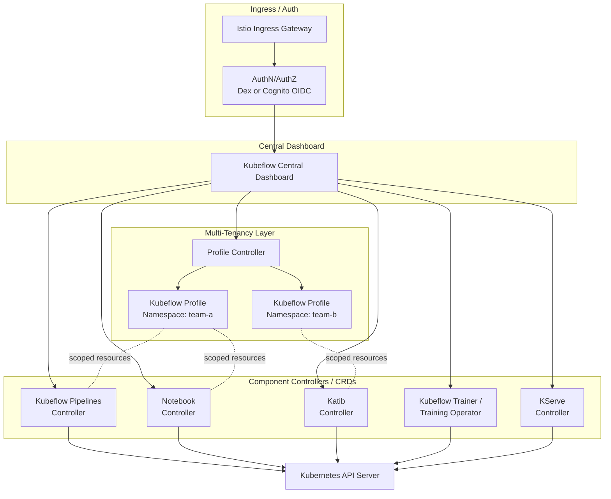

# パート 1: EKS 上の Kubeflow アーキテクチャとインストール

> **サポート対象バージョン**: Kubeflow Community Distribution 26.03 (Kubeflow Pipelines 2.16.0, Katib 0.19.0), Kubernetes 1.34+
> **最終更新**: August 19, 2026

## ラボ環境のセットアップ

このドキュメントの例を実行するには、次のツールと環境が必要です。

### 必要なツール

* kubectl v1.34 以降
* 動作する Amazon EKS クラスター
* マニフェストベースの Deployment 用の kustomize（最近の kubectl に同梱、または単体でインストール）
* 代わりに Terraform ベースの Deployment パスを使用する場合は Terraform
* S3 または RDS にアクセスする必要がある Pod 用に、Kubernetes Service Account に関連付けられた IAM ロール（IRSA または EKS Pod Identity）
* バンドルされた Dex ではなく Cognito をクラスター認証に使用する場合は、Amazon Cognito user pool

## Kubeflow とは？

Kubeflow は、Kubernetes 上でネイティブに実行されるオープンソースの機械学習プラットフォームです。単一のツールではなく、独立して開発された一連のコンポーネントを、1 つのインストールと 1 つの Central Dashboard にまとめた Distribution です。

- **Kubeflow Pipelines** — コンテナ化されたステップの有向非巡回グラフ（DAG）として、複数ステップの ML ワークフローをオーケストレーションします。
- **Notebooks** — ユーザーの namespace にスコープを限定して、Jupyter（およびその他の）notebook server を Kubernetes Pod としてプロビジョニングします。
- **Katib** — ハイパーパラメータチューニングとニューラルアーキテクチャ探索を、Kubernetes ネイティブのジョブとして実行します。
- **Kubeflow Trainer** — 分散トレーニングジョブをスケジューリングします（このシリーズでは、レガシーの Training Operator とその後継の v2 の両方を扱います）。
- **KServe** — Dashboard 内の専用 Web アプリを含め、トレーニング済みモデルをスケーラブルな推論エンドポイントとして提供します。

価値提案は、これらすべてのコンポーネントが同じ Kubernetes API、同じ RBAC と namespace モデル、同じ基盤となるコンピュート上に配置されることです。そのため、すでに Kubernetes を運用しているプラットフォームチームは、ML 専用ワークロード向けに別のスタックを立ち上げる必要がありません。

### CNCF Graduation — 2026 年 8 月 17 日

2026 年 8 月 17 日、[Cloud Native Computing Foundation は発表しました](https://www.cncf.io/announcements/2026/08/17/cncf-announces-kubeflows-graduation-solidifying-the-standard-for-cloud-native-ai-operations/)。**Kubeflow は Graduation しました**。これは、広範な本番採用、健全なマルチベンダーのコントリビュータ基盤、堅実なガバナンスを実証したプロジェクトに与えられる、CNCF の最高成熟度ティアです。Kubeflow は 2023 年に incubating project として CNCF に参加し（2017 年に Google で生まれました）、Graduation に到達するためには、独立した第三者セキュリティ監査に合格し、プロジェクトガバナンスのための正式な steering committee を設置する必要がありました。Kubeflow を評価するプラットフォームチームにとって、Graduation は重要なシグナルです。もはや初期段階の賭けとしてではなく、規制対象の本番 AI ワークロードに十分安定していると CNCF が見なすプロジェクトとして扱われます。

## リリースモデルと現行バージョン

**Kubeflow Community Distribution** は、AWS が `kubeflow-manifests` を介してパッケージ化するようなベンダー Distribution とは異なり、Kubeflow プロジェクト自身が保守するリファレンス Distribution です。年におよそ 2 回のベースリリースとともに、**カレンダーバージョニング**（`YY.MM.patch`）を使用します。執筆時点のベースリリースは **26.03** で、次のコンポーネントをバンドルしています。

| コンポーネント | 26.03 のバージョン |
| --- | --- |
| Kubeflow Pipelines | 2.16.0 |
| KServe web app | 0.16.1 |
| Training Operator (legacy v1) | 1.9.2 |
| Kubeflow Trainer (v2) | v2.1.0 |
| Katib | 0.19.0 |
| Notebooks | v2 リリースが近づいています |

後続のパッチ **26.03.1** では、これらのいくつかがさらに更新されました（Kubeflow Pipelines 2.16.1、KServe web app v0.18.0、Kubeflow Trainer v2.2.0、Notebooks の v2 `workspaces` は beta に到達）。26.03 自体が引き続き最新であると仮定せず、必ず最新のパッチレベルを [Kubeflow Community Distribution releases](https://github.com/kubeflow/community-distribution/releases) で確認してください。

ここで注目すべきニュアンスがあります。新しい `TrainJob`、`ClusterTrainingRuntime`、`TrainingRuntime` Custom Resource を中心に構築された **Kubeflow Trainer v2** は、26.03 で 1.9.2 として提供されるレガシー Training Operator（v1）の、プロジェクトが指定する後継です。移行期間中、両者は並行して存在します。このシリーズのパート 5 では Trainer v2 の API と移行パスを詳しく扱います。このインストールに焦点を当てたパートでは、Distribution の Training Operator バージョン番号だけでは、実際にどのトレーニング API に対してジョブを書くことになるかの全体像は分からない、と知っておけば十分です。

## コンポーネントアーキテクチャ

Kubeflow のアーキテクチャは、各コンポーネントが controller と CRD のセットとしてやり取りする共有 Kubernetes API server を中心としています。Istio ベースのマルチテナンシーレイヤーが namespace 分離を提供し、Central Dashboard が単一の UI エントリーポイントを提供します。

特に重要な点は次のとおりです。

- **テナンシー境界としての Profile。** 「Kubeflow Profile」は Kubernetes namespace に RBAC binding、resource quota、Istio `AuthorizationPolicy` object のバンドルを加えたもので、単一の `Profile` Custom Resource から Profile Controller によってすべて Reconcile されます。通常、各ユーザーまたはチームに 1 つの Profile が与えられ、他のすべてのコンポーネント（Notebooks、Pipelines run、Katib experiment）は、要求したユーザーの Profile namespace 内に Resource を作成します。
- **分離メカニズムとしての Istio。** Kubeflow は、ある Profile の namespace 宛てのリクエストが別の Profile のワークロードによって処理されないことを保証するために、Istio の sidecar proxy と `AuthorizationPolicy` resource に依存しています。これにより、各コンポーネントが独自の認可ロジックを再実装せずにマルチテナンシーが可能になります。
- **独立した controller としてのコンポーネント。** Pipelines、Notebooks、Katib、Trainer、KServe はそれぞれ別個の controller と CRD のセットであり、同じ Kubernetes API server に対して Reconcile します。これが Kubeflow リリースを「Distribution」と表現する理由です。プロジェクトは各コンポーネントの互換バージョンを固定し、まとめて提供しますが、それぞれは独立してバージョン管理され、原理上は単独で実行できます。

## EKS 上のインストールアプローチ

Kubeflow の upstream manifest は、比較的自己完結した Deployment を前提としています。認証には Dex、Pipelines/Katib metadata にはクラスター内 MySQL StatefulSet、Pipelines artifact storage には MinIO を使用します。これらのデフォルトはいずれも本番 EKS Deployment には理想的ではないため、AWS は **`awslabs/kubeflow-manifests`** を保守しています。これは、Kubeflow にバンドルされたセルフホスト依存関係を、マネージド AWS service に置き換える Distribution overlay です。

| Kubeflow のデフォルト | AWS ネイティブの代替 |
| --- | --- |
| Dex（static または LDAP-backed OIDC） | OIDC provider としての Amazon Cognito user pool |
| Pipelines/Katib metadata 用のクラスター内 MySQL | Amazon RDS（MySQL 互換） |
| Pipelines artifact storage 用の MinIO | Amazon S3 |

`awslabs/kubeflow-manifests` では、これらの置換を組み合わせるための並行した 2 つの Deployment パスを文書化しています。

1. **マニフェストベース（`kustomize`）** — upstream Kubeflow manifest の上に重ねる kustomize overlay のセットです。既存（または新規作成）の RDS instance、S3 bucket、Cognito user pool に対して、`kubectl apply -k` で直接適用します。
2. **Terraform ベース** — サポートする AWS infrastructure（RDS、S3、Cognito、IAM role）をプロビジョニングする Terraform module です。その後、同じ apply の一部として kustomize ベースの manifest インストールを実行するため、AWS 側と Kubernetes 側を、分断された 2 つのステップではなく一緒に立ち上げます。

どちらを選ぶかは、ほとんどの場合、残りの infrastructure がすでにどのようにプロビジョニングされているかで決まります。EKS add-on やサポートする AWS resource をほかでも Terraform で管理しているチームは、通常、一貫性のために Terraform パスを好みます。より手動で確認可能なインストールを好むチーム、またはほかの IaC tool を通じてすでに RDS/S3/Cognito をプロビジョニングしているチームは、多くの場合、プレーンな kustomize ガイドから始めます。

## IAM アクセスパターン: IRSA、KFPv2、そして Pod Identity への移行

Kubeflow Pipelines Pod に S3 artifact bucket へのアクセスを許可することは、EKS インストールで最初に検討される IAM の決定です。表面的に済ませず理解する価値のある経緯があります。

- **IRSA は標準的なメカニズムでした。** IAM role を Kubernetes Service Account にバインドすることで、Pipelines Pod が長期間有効な static credential を持たずに S3 を読み書きできるようにします。これは、`kubeflow-manifests` が RDS/S3 Deployment パス向けに文書化している、通常の最小権限かつ Pod 単位でスコープされたアプローチです。
- **特に KFPv2 の IRSA サポートは、歴史的に遅れていました。** 以前の `kubeflow-manifests` ガイダンスでは、IRSA が KFPv1 pipeline ではサポートされる一方、KFPv2 ではまだサポートされないことが指摘されていました。また、KFPv2 の Deployment では、当面の回避策として static credential を持つ専用 IAM user を使用することを推奨し、KFPv2 の IRSA サポートは今後提供予定として追跡していました。
- **EKS Pod Identity は、EKS における新しい IAM-to-Pod binding の全般的な方向性です。** Pod に AWS permission を付与するために AWS が顧客を導いている、より新しくシンプルなメカニズムであり、Kubeflow だけでなく EKS ワークロード全般に適用されます。これを読む時点で、`kubeflow-manifests` の Pipelines ガイダンスが KFPv2 の Pod Identity サポートを完全に取り込んでいるかは、どちらかの前提に基づいてインストールを構築するのではなく、現行の `awslabs/kubeflow-manifests` ドキュメントで直接確認する価値があります。これは AWS Distribution で急速に変化している領域であり、古いドキュメントから仮定するよりも、その時点で検証する方がよい種類の詳細です。

実践的な要点は次のとおりです。特定の Pipelines バージョンで現在どのメカニズム（IRSA、IAM user の回避策、または Pod Identity）が必要かを決めつけず、IAM resource をプロビジョニングする前に現行のコンポーネントガイドを確認してください。

## マネージド代替サービスではなく EKS 上で Kubeflow を実行する理由

Amazon SageMaker（および類似のフルマネージド ML プラットフォーム）は、このドキュメントで扱う運用面を実質的にすべて取り除きます。適用する manifest も、アップグレードする controller も、理解すべき Istio mesh もありません。特に既存の Kubernetes 運用能力を持たないチームにとって、これは正当で、多くの場合正しい選択です。

EKS 上の Kubeflow の複雑さが報われるのは、環境においてすでにいくつかの条件が真である場合です。

- **すでに EKS 上で混在ワークロードを実行している。** データ処理、アプリケーション service、ML トレーニングのすべてで、クラスターの node pool、Karpenter autoscaling、observability stack を共有する必要がある場合、ML プラットフォームを単なる追加の Kubernetes controller セットとして実行することで、第二の並行した運用モデルを維持せずに済みます。
- **ポータビリティが必要、またはプラットフォームロックインを避けたい。** Kubeflow の pipeline、training job、serving manifest は Kubernetes ネイティブの artifact です。同じ YAML は、ある程度の労力をかければ、準拠する任意の Kubernetes クラスターで実行できます。これはマルチクラウドまたはオンプレミスとクラウドを組み合わせる戦略で重要です。
- **トレーニング/サービングスタックを細かく制御したい。** カスタム training runtime、特定の accelerator scheduling の動作、またはマネージド service が必要な形で公開していない serving framework は、基盤となる controller を自ら所有する場合の方が、いずれも容易に対応できます。

トレードオフは現実的です。チームは、manifest と CRD のアップグレード管理、Istio の運用知識、そして前述した IAM/networking の構成を担うことになります。他のデータおよび ML tool に関する、このドキュメントサイトの「なぜ EKS 上で実行するのか」セクションと同様に、これは Kubeflow が SageMaker より厳密に優れているという主張ではありません。追加の運用コストを負担する価値がある条件を説明するものです。

## 次のステップ

このシリーズのパート 2 では、Kubeflow Pipelines を詳しく扱います。pipeline の作成、KFP SDK、EKS 上の artifact/metadata storage パターンを解説します。

[メインページに戻る](./README.md)

## クイズ

この章で学んだ内容を確認するには、[トピッククイズ](../../quizzes/ai-ml/kubeflow/01-architecture-installation-quiz.md) に挑戦してください。
