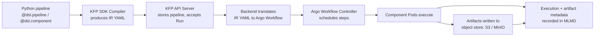

# パート 2: Kubeflow Pipelines

> **サポート対象バージョン**: Kubeflow Pipelines 2.16.0, Kubeflow Community Distribution 26.03
> **最終更新**: August 19, 2026

## ラボ環境のセットアップ

このドキュメントの例を実行するには、以下のツールと環境が必要です:

### 必要なツール

* パイプラインのコンパイル用に、`kfp` SDK（`pip install kfp`）をローカルにインストールした Python 3.10+
* Kubeflow Pipelines がインストールされたクラスタを指す kubectl v1.34 以降（パート 1 を参照）
* KFP の artifact store を S3 に指定する場合、S3 アクセスを付与する IRSA role または EKS Pod Identity association（下記の「EKS 固有の Artifact Storage」を参照）

## Kubeflow Pipelines とは

Kubeflow Pipelines（KFP）は、Kubeflow プラットフォーム内の ML pipeline を構築、実行、追跡するための workflow orchestration engine です。ML pipeline は、型付けされた入力と出力をそれぞれ持つコンテナ化されたステップの DAG です。KFP SDK を使用して Python で pipeline を作成し、コンパイルして KFP backend に送信します。backend は各ステップを Pod としてスケジューリングし、Run の status と artifact を追跡します。

内部では、KFP の backend は [Argo Workflows](https://argoproj.github.io/workflows/) 上に構築されています。コンパイル済み pipeline が KFP API server に到達すると、Argo `Workflow` resource に変換され、実際に Pod を作成して順序付けるのは Argo の controller です。KFP は Argo 単体では提供しないレイヤー、すなわち作成用の Python SDK、Run と artifact を参照する UI、Experiment/Run tracking model、lineage 用の ML Metadata（MLMD）store を追加します。

## KFP v2 Architecture: 直接の Argo YAML ではなく IR YAML

Kubeflow Pipelines 2.16.0 は、Kubeflow Community Distribution 26.03 リリースに含まれるバージョンです。これは KFP v2 SDK および backend 上に構築されており、Python pipeline 定義を実行可能な workflow にする方法は、legacy v1 SDK と比較して変更されました:

* **v1 SDK**: `dsl-compile` は Python pipeline function を Argo `Workflow` YAML manifest に直接コンパイルしていました。コンパイル済み artifact は Argo 固有であり、異なる backend が必要な場合は別の compiler が必要でした。
* **v2 SDK**: pipeline は **Intermediate Representation（IR）YAML**、すなわち DAG、component、型付き artifact、parameter を記述する backend 非依存の `PipelineSpec` にコンパイルされます。KFP backend は送信時にその IR を Argo `Workflow` に変換します。

実用上の利点は、Argo の object model に縛られない、安定して文書化された pipeline spec です。また、`kfp.compiler.Compiler().compile(...)` から得られる artifact、つまり IR YAML は、任意の KFP 互換 backend に渡すものであり、Argo manifest を一度だけ使用するのではなく、KFP API server が保存し、その pipeline の各 Run で再送信するものでもあります。

## コアコンセプト

* **Pipeline** — `@dsl.pipeline` decorator を用いて Python で作成され、IR YAML にコンパイルされる component の DAG。
* **Component** — 型付けされた入力と出力を持つ、単一のコンテナ化されたステップ。`@dsl.component` を用いて作成され、component は固有の container spec にコンパイルされます。runtime では、1 つの Pod（または executor configuration によっては Pod 内の 1 ステップ）になります。
* **Run** — 特定の入力 parameter セットに対する pipeline（または単一 component）の 1 回の実行。
* **Experiment** — 関連する Run の名前付きグループ。結果の整理と比較に使用されます（例: 同一 pipeline での異なる hyperparameter Run）。
* **Artifact** — component 間を流れる型付き出力で、object store 内のファイルにより裏付けられます。KFP v2 は artifact に `Dataset`、`Model`、`Metrics`、`ClassificationMetrics`、`HTML`、`Markdown` という first-class type を与えるため、component の signature は出力を生成することだけでなく、その種類も文書化します。
* **ML Metadata（MLMD）store** — すべての component execution、その入力/出力、処理した artifact を記録する backing store（ほとんどの KFP install では MySQL-backed service）。これにより KFP UI は artifact lineage、すなわち学習済み model を、それを生成した正確な dataset と code を経由して Run をまたいで遡る追跡を表示できます。

## Pipeline Run がシステムを通過する流れ



KFP SDK の役割は IR YAML の生成で終了します。API server 以降のすべては backend の責任です。この分離により、「backend 非依存の spec」という主張が具体化されます。SDK は、基盤で Argo Workflows が scheduling を行っていることを認識する必要も、気にかける必要もありません。

## EKS 固有の Artifact Storage

KFP は、デフォルトの artifact store としてクラスタ内 MinIO deployment を提供します。再構成しない限り、component が生成するすべての artifact（`Dataset`、学習済み `Model`、metrics file）は実際の S3 bucket ではなく MinIO bucket に書き込まれます。自己完結型の demo には問題ありませんが、EKS では S3 が無料で提供する durability、クラスタ外からのアクセス、IAM-based access control を重複して提供する、追加の stateful service を実行・運用することになります。

`awslabs/kubeflow-manifests` project では、クラスタ内 MinIO の代わりに KFP の artifact store を S3 に指定するパターンを文書化しています。pipeline root と artifact object-store credential を再構成し、component が S3 bucket に直接 read/write するようにします。ここで [パート 1](./01-architecture-installation.md) で扱った identity mechanism が直接関係します。KFP pipeline Pod（特に `pipeline-runner` ServiceAccount）が実行される ServiceAccount には、その S3 bucket に対する permission を持つ IRSA role または EKS Pod Identity association が必要です。artifact の write/read 時に行われる object-store call は、クラスタ内 MinIO endpoint ではなく AWS に直接送られるためです。パート 1 では IRSA/Pod Identity のセットアップ方法を詳しく説明しています。このセクションでは、その identity が pipeline lifecycle のどこで使用されるかのみを示します。

## シンプルな 2 ステップ Pipeline

以下は、最初の component から 2 番目の component に型付き `Dataset` artifact を渡す、KFP v2 SDK の decorator を使用した最小限の `data-prep -> train` pipeline を示します:

```python
from kfp import dsl, compiler
from kfp.dsl import Dataset, Model, Output, Input

@dsl.component(base_image="python:3.11-slim")
def prepare_data(output_dataset: Output[Dataset]):
    import pandas as pd

    # In a real pipeline this would read from S3 or another source
    df = pd.DataFrame({"feature": [1, 2, 3, 4], "label": [0, 1, 0, 1]})
    df.to_csv(output_dataset.path, index=False)

@dsl.component(base_image="python:3.11-slim", packages_to_install=["scikit-learn", "pandas"])
def train_model(input_dataset: Input[Dataset], output_model: Output[Model]):
    import pandas as pd
    from sklearn.linear_model import LogisticRegression
    import pickle

    df = pd.read_csv(input_dataset.path)
    clf = LogisticRegression().fit(df[["feature"]], df["label"])
    with open(output_model.path, "wb") as f:
        pickle.dump(clf, f)

@dsl.pipeline(name="data-prep-train-pipeline")
def data_prep_train_pipeline():
    prep_task = prepare_data()
    train_task = train_model(input_dataset=prep_task.outputs["output_dataset"])

compiler.Compiler().compile(
    pipeline_func=data_prep_train_pipeline,
    package_path="data_prep_train_pipeline.yaml",
)
```

この例について注目すべき点をいくつか示します:

* `output_dataset: Output[Dataset]` と `input_dataset: Input[Dataset]` は、KFP v2 で型付き artifact parameter を宣言する方法です。SDK は、各 component が書き込み/読み取りする storage path の provisioning を含め、`prep_task.outputs["output_dataset"]` を `train_model` の入力に接続します。
* 各 `@dsl.component` は独自の container image build context にコンパイルされます（または、`packages_to_install` により指定した Python package をインストールした `base_image` を再利用します）。そのため、`prepare_data` と `train_model` は、宣言された artifact によってのみ接続される独立した Pod として実行されます。
* `compiler.Compiler().compile(...)` は前述の IR YAML を生成します。これは KFP UI に upload するか、KFP Python client 経由で送信して Run を作成する file です。

## Caching の動作

KFP は、component の入力（parameter value、入力 artifact content、component 自身の定義）を hash 化して component execution を cache します。後続の Run が、過去の成功した execution と一致する input hash を持つ component を送信すると、KFP は再実行を省略して cache 済みの出力を再利用します。したがって、`train_model` ステップだけを修正後に pipeline を再実行しても、その入力と code が変更されていなければ、`prepare_data` を再実行して時間を浪費することはありません。

これは反復的な開発に便利ですが、実際には実行したい rerun を暗黙的に隠す可能性があります（例: 外部 state に依存するものの、宣言された入力に変更が反映されない component）。Caching は無効にできます:

* Component 単位: pipeline function 内の task に対して `set_caching_options(enable_caching=False)` call を設定します。例: `prep_task.set_caching_options(enable_caching=False)`。
* Run 単位: component ごとではなく pipeline submission 全体の caching を無効にします。この目的のために、KFP UI の「Run」dialog には submission 時の caching toggle があります。

## 次のステップ

pipeline を作成、コンパイル、実行した後、通常はそれらの pipeline component の背後にある interactive development を、そもそもどこで行うかが次の問いになります。[パート 3: Kubeflow Notebooks](./03-notebooks.md) では、team が pipeline component にパッケージ化される code を作成し反復するために使用する、ユーザーごとの notebook environment を扱います。また、このシリーズの後半にある [パート 6: KServe — Kubernetes 上の Model Serving](./06-kserve.md) では、それらの pipeline が最終的に生成する model の serving を扱います。

[メインページに戻る](./README.md)

## クイズ

この章で学んだ内容を確認するには、[トピッククイズ](../../quizzes/ai-ml/kubeflow/02-pipelines-quiz.md) に挑戦してください。
