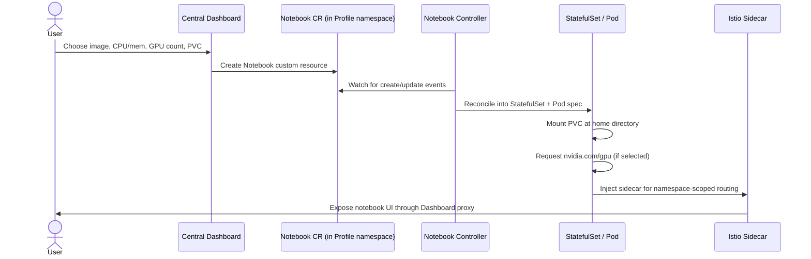

# パート3: Kubeflow Notebooks

> **サポート対象バージョン**: Kubeflow Community Distribution 26.03, Kubernetes 1.34+
> **最終更新**: August 19, 2026

## ラボ環境のセットアップ

このドキュメントの例に沿って進めるには、以下のツールと環境が必要です。

### 必要なツール

* Kubeflow がインストールされたクラスターを対象とする kubectl v1.34 以降（パート1を参照）
* ノートブックサーバーを起動するための、Kubeflow Central Dashboard 内のユーザー Profile（namespace）へのアクセス
* GPU 対応ノートブックを起動する予定がある場合は、[Karpenter](../../autoscaling/02-karpenter.md) 経由で構成された GPU 対応 `NodePool`/`EC2NodeClass` のペア
* カスタムノートブックイメージをビルドして参照する予定がある場合は、コンテナレジストリ（例: Amazon ECR）へのプッシュアクセス

## Kubeflow Notebooks とは？

Kubeflow Notebooks を使用すると、データサイエンティストは、Deployment マニフェストや Dockerfile を自分で書くことなく、完全に構成された対話型開発環境（JupyterLab、RStudio、または code-server（ブラウザ上の VS Code））を、クラスター内で実行される Pod として起動できます。コントローラーは、目的のノートブック（イメージ、CPU/メモリ/GPU リクエスト、ストレージ）を記述するカスタムリソースを監視し、通常の Kubernetes オブジェクトへとリコンサイルします。また、Istio の namespace 単位ルーティングにより、生成されたサーバーは、Kubeflow の他の部分で使用されるものと同じ Central Dashboard を通じて公開されます。

共有 JupyterHub Deployment や一回限りの `kubectl run` ではなく、この方法でノートブックを実行する利点は、各ユーザーの環境がクラスターの通常の運用モデルに完全に参加できることです。同じスケジューラーによってスケジュールされるため、他のワークロードと同様に GPU node pool を競合利用し、そのメリットを受けます。同じ namespace スコープの RBAC およびネットワークポリシーの対象になります。また、プラットフォームチームが他のすべての用途ですでに使用している `kubectl`/GitOps ツールで、一時停止、リサイズ、または削除できます。

## バージョンの背景: Notebooks v1 と今後の v2

Kubeflow Community Distribution 26.03 時点で、Kubeflow Notebooks は長年の **v1** 設計で動作しています。これは Kubernetes `StatefulSet`/Pod spec を比較的薄くラップした `Notebook` カスタムリソースであり、Central Dashboard のノートブック UI から起動されます。本ドキュメントの残りで詳しく説明するのはこのアーキテクチャであり、現在 26.03 をデプロイすると利用するものです。

このプロジェクトでは、2 つの新しいカスタムリソース `Workspace` と `WorkspaceKind` を中心とする **v2 リリースに向けて積極的に取り組んでいます**。これらは、「ノートブック環境の外観」（管理者が定義・バージョン管理する `WorkspaceKind` テンプレート）と、「特定のユーザーが実行している環境」（kind を参照する `Workspace`）を分離します。26.03 ベースディストリビューション時点では、v2（`Workspaces`）はテスト用の alpha マニフェストを提供していました。26.03.1 パッチで **beta** に移行しましたが、**まだ一般提供には達していません**。v2 が本番利用可能になれば、v1 の `Notebook` CRD はメンテナンス専用の状態に移行すると予想されています。v2 は計画に値する将来を見据えた文脈として扱ってください。いずれかの API による本番プラットフォーム設計を確定する前に、現在の GA ステータスについて [Kubeflow Notebooks docs](https://www.kubeflow.org/docs/components/notebooks/) を確認してください。

## マルチテナンシーモデル: ノートブック境界としての Profile

すべての Kubeflow Notebooks ユーザーは **Profile** 内で操作します。これは Kubeflow の他の部分で使用される、ユーザーごとに namespace を割り当てる構成と同じです（パート1で説明）。Profile を作成すると、以下がプロビジョニングされます。

* そのユーザー（またはチーム）専用の Kubernetes namespace。
* Profile Controller を通じて、ユーザーの権限を自身の namespace に限定する RBAC バインディング。
* namespace 内のサービス（ノートブック Pod を含む）に到達できるアイデンティティを制限する Istio `AuthorizationPolicy`。これにより、デフォルトでは、あるユーザーのノートブックは他ユーザーのワークロードから到達できず、また他ユーザーのワークロードに到達することもできません。

ノートブックサーバーは常に Profile namespace 内に作成され、共有 namespace には決して作成されません。これにより、プラットフォームチームは、各ユーザーの Pod が相互に到達可能になることなく、セルフサービスでのノートブック作成を提供できます。分離境界は、pipeline 実行、KServe エンドポイント、クラスター内のその他すべてのユーザー単位リソースで使用されるものと同じです。

### 永続ストレージ

Central Dashboard の spawner では、ユーザーは 1 つ以上の PersistentVolumeClaim をノートブック Pod にアタッチできます。通常はノートブックサーバーのホームディレクトリにマウントされます（例: upstream の Jupyter Docker Stacks の規約に従う、Jupyter ベースイメージの `/home/jovyan`）。永続オブジェクトは Pod ではなく claim であるため、ユーザーのファイル、インストール済みパッケージ、Jupyter 設定は、Pod の再起動、ノードの置換、またはノートブック自体を意図的に停止・再開するサイクルを経ても保持されます。EKS では、この PVC は通常、単一 Pod の ReadWriteOnce アクセス向けには Amazon EBS CSI driver によって、チームが同じ作業ディレクトリを複数のノートブックまたは pipeline Pod 間で読み書き共有したい場合には、その CSI driver 経由の Amazon EFS によってバックアップされます。

### アイドル状態の削減

実行中のノートブック Pod は、誰かが実際に使用しているかどうかにかかわらず、存在する限りリクエストした CPU、メモリ、そして最もコストのかかる GPU 割り当てを保持します。そのため、Kubeflow Notebooks には、設定された期間アイドル状態にあるノートブックを停止（削除ではない）できるカリングメカニズムが含まれています。カリングにより、アイドル状態のノートブックが占有していたノード容量が解放されます。特に GPU 対応ノートブックでは重要であり、ユーザーが離席した後もアイドル状態のサーバーが高価な GPU インスタンスを何時間も占有し続けることを防ぎます。カリングでは基盤となる PVC には一切触れないため、カリングされたノートブックの環境とファイルは、次回起動時にユーザーが残した状態そのままです。

## ノートブックのリコンサイルフロー

コントローラーのリコンサイルループは、Kubernetes の他の場所で使用されるものと同じパターンです。ダッシュボードでの操作ごとに Pod を直接作成するのではなく、ライブの `StatefulSet` を `Notebook` カスタムリソースが現在宣言している状態へ継続的にリコンサイルします。たとえばダッシュボード主導の停止では、命令型の Pod delete を発行する代わりに、カスタムリソースの望ましい状態をレプリカ 0 に更新します。そのため、ノートブック Pod を実行すべきかどうかについての唯一の信頼できる情報源は、ダッシュボード UI ではなくコントローラーです。

## EKS 上の Notebooks 向け GPU スケジューリング

アクセラレーターへのアクセスが必要なノートブック Pod は、クラスター内の他の Pod と同じ方法でリクエストします。`Notebook` カスタムリソースにある spawner の GPU フィールドが、基盤となる Pod spec の `resources.limits."nvidia.com/gpu"` エントリに変換され、GPU ノード上で実行される NVIDIA device plugin が、`nvidia.com/gpu` をスケジューラーに対する割り当て可能リソースとしてアドバタイズします。

つまり、ノートブックの GPU スケジューリングは、クラスターの他の GPU 容量とは別のサブシステムではありません。トレーニングジョブ、KServe エンドポイント、その他すべての GPU ワークロードを支えるものと同じ GPU 対応 node pool を競合利用し、そのリソースによって処理されます。EKS では、この容量は一般に Karpenter によって動的にプロビジョニングされます。Karpenter は、ノートブック Pod の `nvidia.com/gpu` リクエストを既存容量で満たせない場合に GPU `NodePool` をスケールアップし、ノートブックがカリングまたは停止されると再びスケールダウンできます。GPU 対応 Karpenter NodePool の設定、インスタンスタイプの選択、アクセラレーターノード向けの taint/toleration の仕組みについては、[Karpenter for Autoscaling](../../autoscaling/02-karpenter.md) で詳しく説明しています。ここで覚えておくべきノートブック固有のポイントは、アイドル状態の GPU ノートブックが、GPU node pool がゼロまでスケールダウンできない最も一般的な原因の 1 つであることです。まさにそれを防ぐために、前述のカリング動作が存在します。

## カスタムノートブックイメージ

Kubeflow spawner に付属する標準ノートブックイメージは、一般的な JupyterLab/RStudio/code-server のベースラインをカバーしています。しかし、本番環境でノートブックを実行するほとんどのチームは、実行中のコンテナ内で手作業で依存関係を `pip install` するのではなく、すべてのデータサイエンティストが同一で再現可能な環境から開始できるよう、独自のカスタムイメージをビルドして参照します。

一般的なパターンは以下のとおりです。

1. **ノートブックサーバー、Kubeflow SDK 統合、および spawner が想定する UID/作業ディレクトリの規約がすでに含まれている、upstream の Kubeflow（または Jupyter Docker Stacks）ベースイメージから開始します。**
2. **チームで実際に必要な依存関係をレイヤーとして追加します。** 固定された Python/R パッケージセット、内部ライブラリ、GPU フレームワークのバージョン（対象 node pool の CUDA driver と一致するもの）、およびチームで標準化する認証情報不要のツールが含まれます。
3. **クラスターが pull 可能なレジストリへイメージをビルドしてプッシュします。** EKS では通常 Amazon ECR を使用し、他の本番イメージと同様にイメージスキャンおよびライフサイクルポリシーを適用します。
4. **spawner からイメージを参照します。** Central Dashboard の spawner UI はイメージフィールドで任意のイメージ参照を受け付けます（管理者が構成した allow-list の対象となります）。したがって、カスタムイメージはエンドユーザーの観点では標準イメージとまったく同じように動作し、選択できる別のオプションにすぎません。

これらのイメージを、他のアプリケーションイメージと同じ CI パイプラインでバージョン管理および再ビルドすることにより、チーム全体でノートブック環境を再現可能にします。同じイメージタグを選択した 2 人のデータサイエンティストは、各ユーザーのカーネルが時間の経過とともに手動インストールでずれていくのではなく、バイト単位で同一のパッケージセットを取得できます。

## 次のステップ

このドキュメントでは、Kubeflow Notebooks の機能、各ユーザーのノートブックを分離する Profile ベースのマルチテナンシーモデル、永続ストレージとアイドル状態のカリング、ノートブックコントローラーのリコンサイルフロー、EKS での GPU スケジューリング、そして再現可能な環境のためにカスタムノートブックイメージをビルドする実践について説明しました。パート4では、ここで導入した Profile およびカスタムリソースのパターンを基盤として、Katib とハイパーパラメータチューニングに進みます。

[メインページに戻る](./README.md)

## クイズ

この章で学んだ内容を確認するには、[トピッククイズ](../../quizzes/ai-ml/kubeflow/03-notebooks-quiz.md) に挑戦してください。
