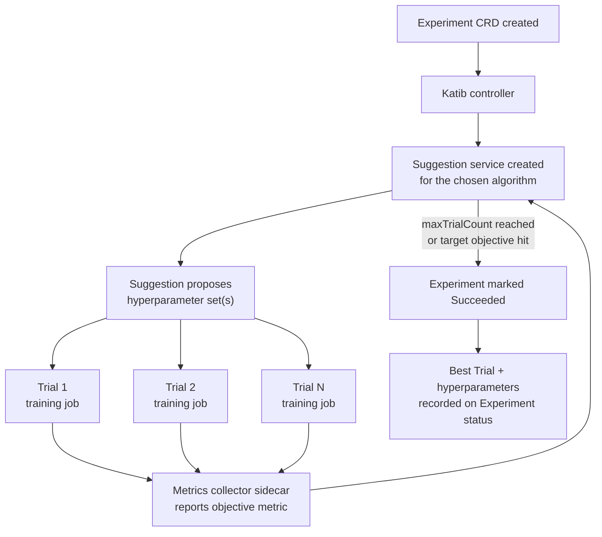

# Part 4: Katib — ハイパーパラメータチューニングと AutoML

> **対応バージョン**: Katib 0.19.0, Kubeflow Community Distribution 26.03
> **最終更新**: August 19, 2026

## ラボ環境のセットアップ

このドキュメントの例に従うには、以下のツールと環境が必要です。

### 必要なツール

* Kubeflow がインストールされたクラスターを対象とする kubectl v1.34 以降（Part 1 を参照）
* Experiments を送信するための、Kubeflow Central Dashboard 内のユーザー Profile（namespace）へのアクセス
* GPU 対応 Trials を実行する予定がある場合、[Karpenter](../../autoscaling/02-karpenter.md) を介して設定された GPU 対応の `NodePool`/`EC2NodeClass` ペア
* `trialTemplate` から参照するための動作するトレーニングジョブテンプレート（例: Part 5 の `TrainJob`/`ClusterTrainingRuntime` ペア、またはプレーンな Kubernetes `Job`）

## Katib とは

このシリーズのこれまでのパートでは、Kubeflow の notebook と pipeline レイヤーを扱いました。このドキュメントでは、Kubeflow の Kubernetes ネイティブなハイパーパラメータチューニングおよび AutoML コンポーネントである **Katib** を扱います。Katib は「どの学習率、バッチサイズ、ネットワーク深度を使うべきか」という問いを、編集・実行・確認を繰り返す手動ループではなく、クラスターでスケジュールされる宣言的な探索に変えます。また、クラスターに後付けした専用スケジューラではなく、Custom Resources、pods、services という通常の Kubernetes オブジェクトを組み合わせて実現します。

Katib は、多数のトレーニングジョブを並列実行し、それぞれに異なるハイパーパラメータの組み合わせを与え、その結果を利用して次に試す組み合わせを決定することで、ハイパーパラメータ最適化（HPO）とニューラルアーキテクチャ探索を自動化します。これは、協調して動作する次の 3 つの要素を中心に構築されています。

* **Experiment** — 1 回のチューニング実行を記述する CRD です。最適化する objective、ハイパーパラメータの探索空間、使用する探索アルゴリズム、1 つのトレーニングジョブの実行方法を記述するテンプレートを指定します。
* **Trial** — Katib controller によって作成される CRD で、特定のハイパーパラメータの組み合わせを使用する 1 回のトレーニング実行を表します。`maxTrialCount: 50` の Experiment は、その存続期間を通じて最大 50 個の Trials を生成します。
* **Suggestion** — 探索アルゴリズムを実装する service（CRD によっても支えられています）です。完了済みおよび進行中の Trials から結果を受け取り、次に試すハイパーパラメータセットを提案します。

関係は階層的です。1 つの Experiment は多数の Trials を所有し、各 Trial は Kubernetes が他の workload と同様にスケジュールおよび実行する実際のトレーニングジョブ（Kubernetes `Job`、または Kubeflow Trainer と統合された場合の `TrainJob` などのトレーニングジョブリソース — Part 5 を参照）を所有します。すべてが CRD であるため、`kubectl get experiments`、`kubectl get trials`、およびそれらに対する `kubectl describe` は Deployment や Job の場合とまったく同じように動作します。状態を確認するために別の CLI や UI は必要ありませんが、Katib UI（Kubeflow Central Dashboard の一部）では Trial の進捗とメトリクス曲線を視覚的に確認できます。

## 探索アルゴリズム

Katib には、Suggestion service を通じて公開されるプラグイン可能な探索アルゴリズム一式が含まれています。各アルゴリズムは、「これまでの結果を踏まえ、次の Trial は何を試すべきか」という同じ問いに対し、異なる戦略と、探索コストと探索効率の異なるトレードオフで答えます。

| アルゴリズム | 適した用途 | 概念的な動作 |
|---|---|---|
| **ランダム探索** | 低コストのベースライン、または非常に大きい／十分に理解されていない探索空間 | 定義された空間から、ハイパーパラメータの組み合わせを独立かつ一様にランダムサンプリングします。過去の Trials の記憶はありません。 |
| **グリッド探索** | 網羅的なカバレッジが現実的な、小規模で低次元の探索空間 | 各ハイパーパラメータに指定された離散値のすべての組み合わせを列挙します。完全なカバレッジを保証しますが、パラメータ数に対して組み合わせ爆発的にスケールします。 |
| **ベイズ最適化** | 各 Trial のコストが重要で、情報に基づくサンプリングが効果を発揮する、トレーニングコストの高いモデル | ハイパーパラメータが objective metric にどのように対応するかの確率モデルを構築し、そのモデルを使用して、これまでの最良結果を改善する可能性が最も高い次の点を選びます。多くの workloads でランダム探索より少ない Trials で収束しますが、提案間にある程度の逐次的な依存関係が生じます。 |
| **Hyperband** | 「早期の段階で有望そうか」を低コストで有用なシグナルとして得られる workloads（例: 数 epoch 後の loss 曲線） | 少ないリソース予算で多数の設定を実行し、最も低い性能のものを積極的に破棄し、解放された予算を生存した設定のより長い実行に再配分します。設定ごとの網羅的な情報を、早期の枝刈りと引き換えにします。 |
| **CMA-ES およびその他の高度な戦略** | 連続的で高次元の探索空間、または母集団型探索の恩恵を受ける workloads（例: population-based training） | 候補設定の母集団または分布を世代ごとに進化させ、どの候補が良好な性能を示したかに基づいてサンプリング分布を適応させます。単純なサンプリングよりも、進化的／最適化アルゴリズムに概念的に近いものです。 |

どのアルゴリズムを選ぶかは、各 Trial のコストと、探索空間が持つ構造の量に依存します。ランダム探索はベースラインを確立するための妥当なデフォルトです。1 つの Trial のトレーニングコストが高く、Trials の総数を減らすことが実質的に重要になった場合は、ベイズ最適化と Hyperband がより一般的な選択肢です。

## Experiment の構造

Experiment の spec には、チューニング実行の動作を理解する上で最も重要な 3 つの部分があります。

* **`objective`** — 最適化する metric（例: `accuracy` または `loss`）と目標（`maximize` または `minimize`）を指定します。また、到達時に「十分に良い」として Experiment を早期停止するために使用できる、オプションの目標値も含みます。
* **`parameters`** — 探索空間です。ハイパーパラメータごとに 1 エントリがあり、それぞれに名前、型、連続範囲（min/max、学習率のような値に有用）、または離散値リスト（optimizer の選択やカテゴリ型アーキテクチャフラグのような値に有用）を指定します。
* **`trialTemplate`** — 各 Trial の実際のトレーニングジョブの構築方法を記述します。基盤となる job spec のテンプレートに、Suggestion service がその Trial に対して提案した特定のハイパーパラメータ値で置換されるプレースホルダーを含めます。現在の Kubeflow デプロイでは、このテンプレートは一般に **Kubeflow Trainer**（Part 5 で詳しく説明）によって管理されるトレーニングジョブリソースを指します。ここでの Katib の役割は、分散トレーニングジョブの実行方法を再実装することではなく、注入する*値*を決定することです。

追加の 2 つの Experiment レベルフィールドは、何を探索するかではなく、探索の実行方法を形作ります。

* **`parallelTrialCount`** — 同時に実行できる Trials の数です。
* **`maxTrialCount`** — 目標 objective 値に到達したかどうかにかかわらず、停止するまでに Experiment がその存続期間を通じて実行する Trials の総数です。

## 早期停止

勝てないことがわかる Trial を、すべて完了まで実行する必要はありません。Katib は **早期停止**をサポートしており、トレーニングの途中で明らかに性能が低い Trial を、その割り当てられたリソースをすべて消費する前に終了します。一般的に使用されるアプローチは **median-stopping rule** です。あるトレーニング時点で、Trial の中間 objective 値を、同じ時点における他の Trials の中間値の中央値と比較します。明確に劣っている場合、その Trial は競争力のある結果になる可能性がすでに低いため、完了まで実行させずに停止されます。

早期停止と Hyperband のようなアルゴリズムは、成果につながらないトレーニングにコンピューティングリソースを浪費しないという関連する問題を解決しますが、異なるレベルで動作します。Hyperband は各設定にどの程度の予算を先に与えるかを決める*探索戦略*である一方、早期停止は、すでに実行中の Trial に対して、他の Trial と比較した進捗に基づいて適用される*実行時チェック*です。

## Experiment のエンドツーエンドの実行方法

ループは次のように動作します。Katib controller が Experiment を reconcile し、要求されたアルゴリズム用の Suggestion service を開始します。Suggestion service は、`parallelTrialCount` によって制限される 1 つ以上のハイパーパラメータの組み合わせを提案します。controller は各提案に対して Trial CRD と、その基盤となるトレーニングジョブを作成します。Trials が結果を報告すると、その結果が Suggestion service にフィードバックされ、次の提案ラウンドに反映されます。このループは、`maxTrialCount` に到達するか、objective の目標値が満たされるまで継続します。実行中は、Experiment の status が、これまでに観測された最高性能の Trial で継続的に更新されます。Experiment が完了すると、その最良 Trial のハイパーパラメータと metric 値が最終結果として記録されます。

## メトリクス収集

トレーニングジョブは、Katib Experiment の一部であることをネイティブには認識していないため、Katib には各 Trial の pod から objective metric を取り出す方法が必要です。これは、トレーニングコンテナと並んで Trial pod に注入される **metrics-collector sidecar** を介して行われます。sidecar の役割は、トレーニングコンテナの出力を監視することです。通常は、認識可能な metric パターンを stdout／ログファイルから tail するか、トレーニングコードが公開する metrics endpoint をスクレイピングし、解析した objective metric 値を Katib の metrics store に報告します。

この sidecar パターンにより、トレーニングコード自体はほぼ Katib 非依存に保たれます。すでに parse 可能な形式で epoch ごとの accuracy または loss を出力するトレーニングスクリプトは、Katib と統合するために書き直す必要がありません。collector が抽出を行います。また、収集戦略の選択（ログ解析と endpoint スクレイピング）が、Katib による中間進捗の監視の信頼性と頻度に影響することも意味します。これは、早期停止および Hyperband 型アルゴリズムがその進捗にどの程度適切に作用できるかに影響します。

## EKS で Katib Experiments を実行する場合: リソース圧力

Katib の並行性を制御する設定は、固定的で過剰にプロビジョニングされたオンプレミスクラスターの場合より、EKS ではより重要な形でクラスター容量と直接相互作用します。

* **`parallelTrialCount` はリソース需要を増幅します。** 同時実行される各 Trial は完全なトレーニングジョブです。個々の Trials が GPUs をリクエストする場合、`parallelTrialCount` が 8 であれば、時間を分散した 8 個のリクエストではなく、8 個の同時 GPU リクエストが一度にクラスターへ送られます。書面上では控えめに見える Experiment（`maxTrialCount: 100`）でも、`parallelTrialCount` を高く設定すると、需要が急激かつ短期間に急増する可能性があります。
* **クラスターのオートスケーリングは追随する必要があります。** EKS では、この圧力は通常、保留中の Trial pods の急増に応じて GPU 対応 nodes をプロビジョニングする [Karpenter](../../autoscaling/02-karpenter.md) によって吸収されます。GPU instance types は汎用 instances よりプロビジョニングのリードタイムが長いことが多いため、`parallelTrialCount` が高い場合、初期の Trials は実際にトレーニングするのではなく nodes を待機する可能性があります。Suggestion アルゴリズム自体が遅いと判断する前に、Trial pod events で確認する価値があります。
* **`parallelTrialCount` と `maxTrialCount` は個別ではなく併せて調整してください。** 同じ総数の Trials をより速く完了する高い `parallelTrialCount` よりも、より長時間実行される Experiment と低い `parallelTrialCount` のほうが、共有クラスター容量への負荷が穏やかであることが多いです。適切なバランスは、クラスターがチューニング実行専用か、他の workloads と共有されているかに依存します。
* **早期停止は無駄なコストを直接削減します。** 早期終了した各 Trial は GPU 割り当てをより早く解放するため、median-stopping rule（前述の「早期停止」を参照）は探索効率の最適化にとどまりません。EKS では、適切なハイパーパラメータセットに収束するまでにチューニング実行が蓄積する GPU 時間コストを直接制御する手段でもあります。

## 次のステップ

Katib は、ハイパーパラメータ探索を Kubernetes ネイティブな制御ループに変換します。Experiment が objective と探索空間を記述し、Suggestion service がプラグイン可能な探索アルゴリズムを使用してハイパーパラメータの組み合わせを提案し、Trials が通常のトレーニングジョブとしてそれらの組み合わせを実行し、metrics-collector sidecar が結果を報告することで、探索は最良の設定に収束できます。EKS では、実用上のポイントは `parallelTrialCount`/`maxTrialCount` をオートスケーリング容量と調整することです。特に GPU 対応 Trials では、チューニング実行の並行性が、クラスターが実際に nodes をプロビジョニングできる速さを上回らないようにします。

Part 5 では **Kubeflow Trainer** を扱います。これは、各 Trial の分散トレーニングジョブを実際に実行するために、Katib の `trialTemplate` が通常委譲するコンポーネントです。

[メインページに戻る](./README.md)

## クイズ

この章で学んだ内容を確認するには、[トピッククイズ](../../quizzes/ai-ml/kubeflow/04-katib-quiz.md) に挑戦してください。
