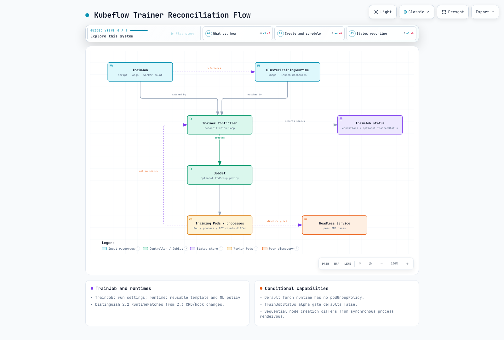

# パート 5: Kubeflow Trainer と分散トレーニング

> **レビューのベースライン**: Trainer 2.2.0 / Community Distribution 26.03.1; 2.3.0 へのアップグレード比較を別途実施
> **最終更新**: September 12, 2026

## ラボ環境のセットアップ

互換性のある Kubernetes、Trainer controller/CRD、runtime、および JobSet などの依存関係を使用します。GPU はワークロードに依存します。CPU トレーニングも可能です。GPU ワークロードには、追加で driver、device plugin、node capacity、networking が必要です。ここでの検証は Helm のレンダリングと schema の確認であり、トレーニングの実行ではありません。

## フレームワーク固有の Operator から統一 API へ

Kubernetes 上の分散トレーニングは Kubeflow project 内で実際のアーキテクチャ上の転換を経験しており、これは YAML を扱う前に理解すべき最も重要な点です。

### 当初の Training Operator (v1)

Kubeflow が 2021 年に統合した Training Operator は、**フレームワーク固有の CRD** アプローチを採用していました。サポートする各 ML framework には固有の Custom Resource Definition があり、それぞれの controller が、その framework に固有の分散トレーニングの semantics を実装していました。

* **`PyTorchJob`** — controller は PyTorch の分散 launch 規則を理解し、`torch.distributed` が process group を形成できるよう、各 worker Pod に `MASTER_ADDR`、`RANK`、`WORLD_SIZE` などの environment variable を注入しました。
* **`TFJob`** — controller は代わりに、TensorFlow の distribution strategy が期待する `TF_CONFIG` environment variable（cluster の task role — chief、worker、parameter server — を記述する JSON blob）を構築しました。
* **`MPIJob`** — controller は Pod をまたいだ MPI job の起動を処理し、一連の worker Pod に対して `mpirun` スタイルの launcher を調整しました。

この 3 つに加えて、v1 Training Operator には他のいくつかの framework 向けの CRD も含まれていました。各 CRD は、「worker が互いを発見し、role に合意する方法」という framework ごとの考え方を個別の controller に直接エンコードしていたため、framework の追加には integration が必要でした。一方で、共有の Job-controller 基盤は引き続き再利用できました。

### Kubeflow Trainer v2 への移行

Kubeflow Trainer v2 は、framework ごとに 1 つの CRD を用意するのではなく、次の 2 つの概念を中心とする単一の統一 API に置き換えます。

* **`TrainJob`** — 実行する*内容*を記述します。トレーニング script/entrypoint、argument、resource 数（例: worker 数）、およびそれを実行すべき runtime への参照です。これは ML practitioner が個別のトレーニング実行のために作成する object です。
* **`TrainingRuntime` / `ClusterTrainingRuntime`** — 実行する*方法*を記述します。container image、分散 launch の仕組み（worker が互いを発見する方法、使用する env var または launcher process）、デフォルトの resource shape を含む、再利用可能で framework 固有の実行 template です。platform team は PyTorch DDP runtime や MPI runtime など、これらの小さなセットを一度定義します。その後、多くの異なる `TrainJob` が、多数のトレーニング実行で同じ runtime を参照します。

これは Kubernetes の他の場所にも見られるパターンを反映しています。再利用可能な「template」resource と、それを利用する「instance」を分離するもので、多数の `PersistentVolumeClaim` が参照する再利用可能な template である `StorageClass` と似た考え方です。実用上の利点は、platform team が複雑な分散 launch の仕組みを 1 か所（runtime）で所有・version 管理できる一方、job を送信する ML practitioner は script を指定し、名前で runtime を要求するだけでよいことです。runtime は繰り返しの設定を減らしますが、トレーニング code は引き続き、互換性のある分散 initialization、data sharding、checkpointing、recovery を処理する必要があります。

### 2.2.0 と 2.3.0 の違い

[Trainer 2.2.0](https://github.com/kubeflow/trainer/releases/tag/v2.2.0) は 2026 年 3 月 20 日にリリースされ、26.03.1 にバンドルされています。JAX/XGBoost runtime と Flux policy/integration が追加されていますが、機能が含まれることは、すべての image、network、accelerator 構成との互換性を証明するものではありません。

2.2.0 では `PodTemplateOverrides` が `RuntimePatches` に置き換えられ、Torch policy から `numProcPerNode` が削除され、`ElasticPolicy` も削除されました。runtime の Torch policy と実行ごとの `trainer.numProcPerNode` を混同しないでください。以前の 2.x manifest でも移行が必要になる場合があります。

`status.trainerStatus` の runtime progress/metrics には、**alpha TrainJobStatus feature gate（デフォルトでは無効）**が必要です。トレーニング code は、機能する TLS/projected ServiceAccount-token access で status server に report する必要があります。注入される token/CA environment value は secret の内容ではなく file path です。log を出力するだけでは、status metrics は自動的に設定されません。

2026 年 8 月 7 日にリリースされた [2.3.0](https://github.com/kubeflow/trainer/releases/tag/v2.3.0) は、runtime finalizer/snapshot と Helm CRD の配置を変更します。release note では、2.0/2.1/2.2 の installation は、以降の version に進む前に 2.3 を経由する必要があるとされています。アップグレード前に CRD の Helm ownership と release 固有の移行を確認してください。既存の CRD の削除は通常のアップグレード修正ではありません。

公開されている OCI chart も異なります。2.2 は 8 つの default runtime を直接レンダリングしますが、2.3 はそれらを post-install/post-upgrade installer Job によって適用される runtimes.yaml ConfigMap にパッケージ化します。2.3 hook は実行時に kubectl を install し、server-side で resource を force-apply し、その management label により prune します。pre-delete hook も存在します。GitOps の hook 処理、network access、runtime ownership を確認してください。このレビューでは hook を実行せずにレンダリングしました。

### レガシー API の移行

26.03.1 には Trainer 2.2.0 と legacy Training Operator 1.9.2 が含まれています。それらが共存していることは、どの team の移行進捗も示しません。PyTorchJob/TFJob/MPIJob と TrainJob は異なる API であり、自動的には変換されません。

[pinned official migration document](https://github.com/kubeflow/trainer/blob/v2.3.0/docs/operator-guides/migration.md) は、PyTorchJob から default Torch runtime への例と SDK の方向性を提供しますが、すべての framework/field に対応する網羅的な mapping ではありません。各ワークロードについて replica role、launch command、environment、retry、storage、scheduling/networking、checkpoint recovery を比較してください。

## TrainJob と Runtime の責務

`TrainingRuntime` は namespaced であり、`ClusterTrainingRuntime` は cluster-scoped です。どちらも実行 template と ML policy を含みます。`TrainJob.runtimeRef` は kind/name を選択し、trainer field では command/argument、training Pod 数、Pod ごとの resource を設定できます。permission と許可する override は別途管理する必要があります。

デフォルトの `torch-distributed` runtime には `mlPolicy.numNodes: 1`、`torch: {}`、および JobSet template があります。2.2.0 では `pytorch/pytorch:2.10.0-cuda12.8-cudnn9-runtime` を参照します。image/runtime の revision を記録し、architecture、driver、communication library を確認してください。このレビューでは image を実行せず、model のトレーニングも行っていません。

ここでの numNodes はトレーニング Pod 数を表し、EC2 instance 数と 1 対 1 には対応しません。process 数、Pod ごとの GPU 数、複数の Pod の placement は個別に計算してください。

## Kubernetes 上の分散トレーニングの仕組み

JobSet と runtime は Job/Pod を構成し、Service/DNS と rank/rendezvous 構成を用いて process discovery を行います。headless Service だけでは process state や IP は維持されません。stable Pod naming、hostname/subdomain、network condition も依然として重要です。

**Trainer を install しても、gang scheduling が自動的に有効になるわけではありません。** 2.2.0 の default Torch runtime には podGroupPolicy がありません。これらの PodGroup path に対応する Coscheduling/Volcano policy、CRD、scheduler integration は install/configure する必要があります。Kueue admission も実際の Pod scheduling とは別のものです。

固定サイズの synchronous training では、通信に必要なすべての process が ready である必要がありますが、node が同時に作成される必要はありません。順次 provisioning でも rendezvous timeout 内に成功する可能性があり、サポートされる elastic workload には異なる rule があります。gang admission は部分的な allocation を減らしますが、すべての EC2 shortage や application deadlock を解決することはできません。[Karpenter](../../autoscaling/02-karpenter.md) capacity を JobSet、scheduler、framework の timeout/retry と調整してください。

[🔍 インタラクティブ図を表示](https://www.atomai.click/kubernetes-docs/archmaps/en-ai-ml-kubeflow-05-training-operator-0.html)

## クロスリファレンス: Katib と TrainJob

Katib 0.19.0 は、構成された Trial template で TrainJob を使用できます。trialResources の登録、runtime、success/failure condition、primary Pod/container、metric collection を一致させてください。Katib の metrics reporting は、Trainer の opt-in status server とは別です。成功した TrainJob が model を KServe に自動的に deploy することはありません。

## 検証とソース

公式 OCI Trainer Helm chart 2.2.0 および 2.3.0 を取得し、default runtime を有効にしてレンダリングしました。CRD/runtime schema を確認しました。API admission/CEL、実際の upgrade、JobSet 作成、分散/GPU トレーニング、status-server reporting は実行していません。

- [2.2.0 TrainJob API](https://github.com/kubeflow/trainer/blob/v2.2.0/pkg/apis/trainer/v1alpha1/trainjob_types.go)
- [TrainJobStatus のデフォルト feature gate](https://github.com/kubeflow/trainer/blob/v2.2.0/pkg/features/features.go)
- [条件付き Coscheduling PodGroup 作成](https://github.com/kubeflow/trainer/blob/v2.2.0/pkg/runtime/framework/plugins/coscheduling/coscheduling.go)
- [デフォルト Torch runtime](https://github.com/kubeflow/trainer/blob/v2.2.0/manifests/base/runtimes/torch_distributed.yaml)

## 次のステップ

フレームワーク固有の CRD から統一された `TrainJob`/runtime model への移行を踏まえ、[パート 6: KServe — Kubernetes 上の Model Serving](./06-kserve.md) では、`TrainJob` によるトレーニングが完了した model に何が起こるか、すなわち inference のために serving する方法を取り上げます。

[メインページに戻る](./README.md)

## クイズ

この章で学んだ内容を確認するには、[トピッククイズ](../../quizzes/ai-ml/kubeflow/05-training-operator-quiz.md)に挑戦してください。
