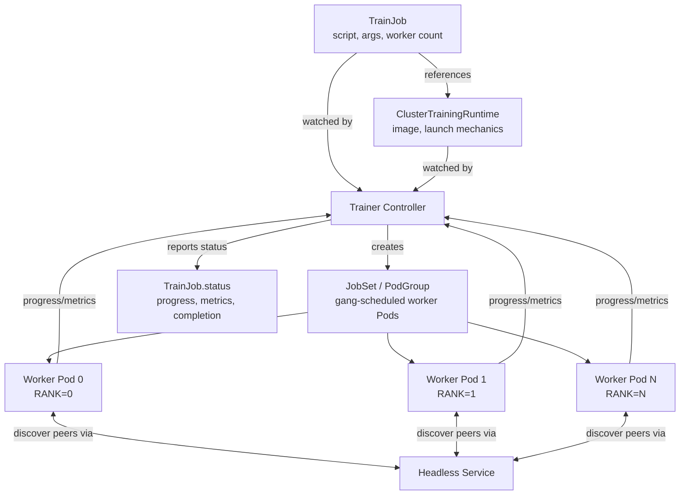

# パート5: Kubeflow Trainer と分散トレーニング

> **サポート対象バージョン**: Kubeflow Trainer v2.1（26.03 に同梱）から v2.3、レガシー Training Operator 1.9.2（Kubeflow Community Distribution 26.03 に同梱）
> **最終更新**: August 19, 2026

## ラボ環境のセットアップ

このドキュメントの例に沿って進めるには、次のツールと環境が必要です。

### 必要なツール

* kubectl v1.34 以降
* GPU 対応ノードプールを持つ稼働中の Amazon EKS クラスター（[Karpenter](../../autoscaling/02-karpenter.md) および以下で参照する GPU ノードスケジューリングの資料を参照。このドキュメントではそのセットアップを再説明しません）
* Community Distribution を通じてインストールされた Kubeflow、またはスタンドアロンでインストールされた Kubeflow Trainer

## フレームワーク固有の Operator から統合 API へ

Kubernetes 上の分散トレーニングは、Kubeflow プロジェクト内で実際にアーキテクチャ上の大きな変化を遂げています。YAML に触れる前に、これを理解することが最も重要です。

### 元の Training Operator（v1）

Kubeflow が 2021 年に統合した Training Operator は、**フレームワーク固有の CRD** アプローチを採用していました。サポート対象の各 ML フレームワークには、それぞれ独自の Custom Resource Definition があり、各フレームワーク固有の分散トレーニングのセマンティクスを実装する独自の controller がありました。

* **`PyTorchJob`** — controller は PyTorch の分散起動規約を理解し、各 worker Pod に `MASTER_ADDR`、`RANK`、`WORLD_SIZE` などの環境変数を注入して、`torch.distributed` がプロセスグループを形成できるようにしました。
* **`TFJob`** — controller は代わりに、TensorFlow の分散ストラテジーが期待する `TF_CONFIG` 環境変数（クラスターのタスクロール — chief、worker、parameter server — を記述する JSON blob）を構築しました。
* **`MPIJob`** — controller は Pod をまたいだ MPI job の起動を処理し、worker Pod 群に対して `mpirun` スタイルの launcher を調整しました。

これら 3 つ以外にも、v1 Training Operator は少数の他のフレームワーク向け CRD を提供していました。各 CRD は、「worker が互いを見つけ、ロールについて合意する方法」というフレームワークごとの考え方を個別の controller に直接エンコードしていたため、新しいフレームワークの追加は既存の基盤を再利用するのではなく、まったく新しい controller を作成することを意味していました。

### Kubeflow Trainer v2 への移行

Kubeflow Trainer v2 は、フレームワークごとに 1 つの CRD ではなく、2 つの概念を中心に構築された単一の統合 API でこれを置き換えます。

* **`TrainJob`** — *何を* 実行するかを記述します。トレーニングスクリプト/entrypoint、引数、リソース数（例: worker 数）、およびそれを実行する runtime への参照です。これは、ML 実務者が個別のトレーニング実行のために作成するオブジェクトです。
* **`TrainingRuntime` / `ClusterTrainingRuntime`** — *どのように* 実行するかを記述します。コンテナイメージ、分散起動メカニズム（worker が互いを検出する方法、使用する環境変数または launcher プロセス）、デフォルトのリソース構成をカバーする、再利用可能でフレームワーク固有の実行テンプレートです。プラットフォームチームは、たとえば PyTorch DDP runtime や MPI runtime など、少数のこれらを一度定義し、多くの異なる `TrainJob` が多くのトレーニング実行にわたって同じ runtime を参照します。

これは Kubernetes の他の場所で見られるパターンを反映しています。再利用可能な「テンプレート」リソースとそれを利用する「インスタンス」を分離するもので、`StorageClass` が多くの `PersistentVolumeClaim` から参照される再利用可能なテンプレートであることと精神的に似ています。実用上の利点は、プラットフォームチームが難しい分散起動メカニズムを 1 か所（runtime）で管理し、バージョン管理できる点です。一方で job を送信する ML 実務者は、スクリプトを指定して名前で runtime を要求するだけで済み、rank の割り当てやアドレス検出が内部で実際にどのように行われるかを知る必要も気にする必要もありません。

[release notes](https://github.com/kubeflow/trainer/releases) によると、**Kubeflow Trainer v2.2**（2026 年 3 月頃にリリースされ、Kubeflow Community Distribution の 26.03.1 パッチから同梱されるバージョン。26.03 自体には v2.1.0 が同梱されます）は、次の機能によってこれを拡張しています。

* 既存の PyTorch サポートに加え、ファーストクラスの **JAX** および **XGBoost** トレーニング runtime を提供します。これにより、これらのフレームワークの分散トレーニングも、独自の CRD ではなく同じ `TrainJob`/runtime 分割を通じて実行されるようになりました。
* 強化された **observability**: トレーニングの進行状況とメトリクスを、トレーニングスクリプト自体から `TrainJob` の status へ伝播できます。これにより、実行の進捗を確認するために operator がログや別のメトリクス backend を調べる必要がなくなります。
* **Flux Framework integration**: MPI スタイルのワークロード向けに HPC スタイルの job launcher を Trainer エコシステムへ導入します。より単純な `mpirun` 起動ではなく、Flux のスケジューリングおよびプロセス起動モデルの恩恵を受ける、密結合で HPC 指向の分散 job に役立ちます。

### 移行は実際に進んでいますが、完了していません

エコシステムの現状を過大評価しないことが重要です。**Kubeflow Community Distribution 26.03** には、そのリリース時点でなお **レガシー Training Operator 1.9.2** — v1 のフレームワーク固有 CRD の operator — が同梱されています。Kubeflow Trainer v2 とレガシー Training Operator は現在エコシステム内で共存しており、あるチームの job を `PyTorchJob`/`TFJob`/`MPIJob` manifest から `TrainJob` + runtime へ移行することは、すでに特定のクラスターで完了していると想定できる切り替えではなく、多くのチームがまだ途中段階にある**現在進行中の移行**です。

実際の移行を計画している場合、このドキュメントを移行ガイドとして扱わないでください。権威あるフィールド単位のリファレンスは、[kubeflow.org](https://www.kubeflow.org/docs/components/trainer/operator-guides/migration/) の **"Migrating to Kubeflow Trainer v2"** です。そのガイドでは、各 v1 CRD のフィールドを `TrainJob` とデフォルト runtime に対応付ける具体的なマッピングを扱っています。これをここで網羅的に繰り返すことは対象範囲外です。

すでに Trainer v2 を実行している方への別の注意点として、**Trainer v2.3.0**（2026 年 8 月リリース）は、このドキュメントで説明する runtime CRD に対する破壊的変更を伴って v2.2 の後にリリースされました。Runtime Finalizer は削除され、CRD は Helm chart の template directory に移動しました。また、このバージョンの [release notes](https://github.com/kubeflow/trainer/releases) では、v2.0/v2.1/v2.2 のクラスターはさらにアップグレードする前に v2.3 へアップグレードする必要があると明記されています。すでに Trainer v2 を実行しているクラスターをアップグレードする前に、このガイダンスを直接確認してください。

## TrainJob の概念的な構成

概念的なレベルでは（このドキュメントで検証していない正確なフィールド名を作り出すことなく）、たとえば PyTorch の分散データ並列（DDP）実行用の `TrainJob` は、責務をおおよそ次のように分割します。

* プラットフォームチームが一度作成する **`ClusterTrainingRuntime`**。トレーニングコンテナイメージ（またはベースイメージの要件）、デフォルトの worker replica 数、PyTorch DDP の分散起動メカニズム（worker が rendezvous address を検出し、rank/world size に合意する方法）をまとめます。
* トレーニング実行ごとに作成される **`TrainJob`**。その名前で `ClusterTrainingRuntime` を参照し、実行固有の要素、すなわち実行する実際のトレーニングスクリプトまたはコマンド、スクリプト引数（学習率、dataset path、epoch 数など）、およびこの実行に必要な worker 数を指定します。

`TrainJob` は意図的に「薄い」オブジェクトです。分散協調が*どのように*行われるかに関する複雑さのほとんどは、個々の job manifest ではなく runtime にあります。これにより runtime は多くのトレーニング実行で再利用可能になり、通常は個々のデータサイエンティストではなくプラットフォームチームが runtime 定義を所有して堅牢化する理由となります。

## Kubernetes 上の分散トレーニングの仕組み

どのフレームワークの runtime が使われているかに関係なく、Kubernetes 上のマルチ worker 分散トレーニングは、一般に同じいくつかのプリミティブを通じて協調します。

* worker Pod の前に置かれる **headless Service**。これにより、再スケジュール時に変わり得る Pod IP に依存せず、各 worker が他の worker の安定して解決可能な DNS 名を得られます。
* 各 worker にその rank、総 worker 数、および rendezvous/coordinator として動作する worker のアドレスを伝える **注入された環境変数**（または同等の config file/init ステップ）。これは PyTorch では `MASTER_ADDR`/`RANK`/`WORLD_SIZE`、TensorFlow では `TF_CONFIG` が担っていたメカニズムであり、Trainer v2 では runtime 抽象化のもとで一般化されています。
* **Gang scheduling の考慮事項**: 分散トレーニング job は一般に、トレーニングを開始する前に*すべての* worker がスケジュールされ実行中になる必要があります。worker の半分だけがスケジュールされ、残りを無期限に待つ job は GPU 容量を無駄にし、deadlock する可能性があります。これが、分散トレーニング controller が各 Pod を独立してスケジュールする Kubernetes のデフォルト動作ではなく、job の Pod をグループ化して scheduler が全か無かの単位として扱う gang-scheduling プリミティブに一般的に依存する（または統合する）理由です。

特に EKS では、これは GPU ノードプールのプロビジョニングとスケーリングの方法に直接関係します。たとえば 8 個の GPU worker を必要とする分散 job には、autoscaler によって 1 つずつ追加されるのではなく、8 個の GPU 対応ノード（または slot）が同時に利用可能である必要があります。GPU ノードプールのサイジングとスケーリングの仕組み（Karpenter NodePool、instance type の選択、GPU の binpacking）は、ここで再説明するのではなく、このサイトの autoscaling および GPU スケジューリング資料で扱っています。このドキュメントで要点として押さえるべきなのは、すべての worker を同時にスケジュールできないトレーニング job は、`TrainJob`/runtime の設定がどれほど正しくても停止してしまうため、gang-scheduling の要件と GPU ノードプールの弾力性を一緒に設計する必要があるということです。

## クロスリファレンス: Katib と TrainJob

このシリーズのパート 4 では、Kubeflow のハイパーパラメータチューニングコンポーネントである Katib を扱います。experiment 内の各 Katib Trial では、1 つのハイパーパラメータの組み合わせを実際に実行するための基盤となるトレーニング job が必要です。Trainer v2 ベースのセットアップでは、その基盤 job は通常、Katib により Trial ごとにテンプレート化される `TrainJob` であり、各 Trial が選択したハイパーパラメータ値がスクリプト引数として注入されます。上記で説明した runtime/job の分割はここにも適用されます。Katib は分散起動メカニズムについて何も知る必要はなく、プラットフォームチームがすでに定義した runtime に対して Trial ごとに `TrainJob` を生成し、報告されたメトリクスを読み戻して次にどこを探索するかを判断するだけです。

## 次のステップ

フレームワーク固有の CRD から統合された `TrainJob`/runtime モデルへの移行を踏まえ、[パート 6: KServe — Kubernetes 上のモデルサービング](./06-kserve.md) では、`TrainJob` によるトレーニングが完了したモデルがどうなるか、すなわち推論のために提供する方法を扱います。

[メインページに戻る](./README.md)

## クイズ

この章で学んだ内容を確認するには、[トピッククイズ](../../quizzes/ai-ml/kubeflow/05-training-operator-quiz.md) に挑戦してください。
