# Part 6: KServe — Kubernetes でのモデルサービング

> **対応バージョン**: KServe（Kubeflow Community Distribution 26.03 に同梱の web app v0.16.1）
> **最終更新**: August 19, 2026

## ラボ環境のセットアップ

このドキュメントの例に沿って進めるには、以下のツールと環境が必要です。

### 必要なツール

* kubectl v1.34 以降、および動作する EKS クラスター
* Kubeflow（Part 1）がインストール済みで、Central Dashboard に KServe web app が表示されていること
* GPU 対応モデルをサービングする予定がある場合は、GPU 対応の `NodePool`/`EC2NodeClass` ペアを備えた [Karpenter](../../autoscaling/02-karpenter.md)
* KServe の Serverless デプロイモードを使用する予定がある場合は、クラスターにインストール済みの Knative Serving

## KServe とは何か、また Kubeflow とどう関係するのか？

Parts 1〜5 では、Kubeflow の全体アーキテクチャ、Pipelines、Notebooks、Katib、Kubeflow Trainer、すなわち EKS 上でモデルを*トレーニング*するために必要なすべてを扱いました。この最後のパートでは、トレーニング後に起こること、すなわちそのモデルを **KServe** によりスケーラブルで本番グレードの推論エンドポイントとしてサービングする方法を扱います。

KServe は独立したプロジェクトとして始まったわけではありません。トレーニング済みモデルを稼働中の推論エンドポイントに変換する役割を担う **KFServing** として Kubeflow 内で始まりました。プロジェクトの成熟に伴い、独自のトップレベルのスタンドアロンリポジトリへ分離されて **KServe** に改名されました。現在は Kubeflow 専用のサブコンポーネントではなく、Kubeflow がまったく存在しない任意の Kubernetes クラスターにもインストールして運用できます。

一方、Kubeflow は引き続き KServe をデフォルトのモデルサービングレイヤーとして同梱しています。Central Dashboard のモデルサービング web app は KServe CRD 上の薄い UI であり、Kubeflow Community Distribution はその配布版の他コンポーネントとともに、その web app の特定バージョンを固定しています。

この分離が重要な実用上の理由が一つあります。**KServe controller/CRD のバージョンと Kubeflow web-app UI のバージョンは同じ番号ではなく、連動して移行するわけでもありません。** KServe には、Kubeflow Community Distribution のカレンダーバージョン方式のリリース系列とは別に、独自のメンテナーとロードマップにより決まる独立したリリースサイクルがあります（このドキュメントのバージョン行にある `26.03` は KServe 自体ではなく、Distribution を指します）。Kubeflow Community Distribution 26.03 のリリースには KServe web application **v0.16.1** が同梱されていますが、この番号が示すのは dashboard との統合であり、特定のクラスターで実行される基盤の KServe controller と CRD のバージョンとは限りません。プラットフォームチームは、KServe controller を、それと通信する Kubeflow web app とは独立してアップグレードできますし、実際によくそうします。`InferenceService` をトラブルシューティングする際は、Kubeflow dashboard に表示されるバージョンと一致すると仮定せず、クラスターにインストールされている controller/CRD のバージョンを直接確認してください（例: KServe controller manager の image tag）。

インストールされているバージョンにかかわらず、KServe が公開する中核の抽象化は **`InferenceService`** custom resource です。これはモデル、サービング方法、スケーリング方法を記述する単一の Kubernetes オブジェクトです。

## InferenceService の構成: Predictor、Transformer、Explainer

`InferenceService` は最大で 3 つの論理コンポーネントから構築され、そのうち必須なのは 1 つだけです。

* **Predictor**（必須）— モデルサーバー自体です。実際にモデル artifact をロードし、推論リクエストに応答するコンポーネントです。KServe には一般的なフレームワーク向けの組み込み Predictor サポートがあり、代表例として SKLearn、XGBoost、PyTorch（TorchServe 経由）、NVIDIA Triton Inference Server があります。そのため、これらのフレームワークの Predictor spec ではモデル artifact の場所を指定するだけで、サービングコードを書かずに動作するサーバーを得られます。これらの組み込みサーバー以外の場合、Predictor は KServe の推論プロトコルを自ら実装する **custom container** を実行することもできます。
* **Transformer**（任意）— Predictor の前に置かれる前処理/後処理ステップです。Transformer は通常、リクエストがモデルに到達する前に入力 feature engineering を処理し、またはモデルの生出力を下流コンシューマーが期待する形式に整形します。これを Predictor から分離することで、モデルサーバー自体を汎用的に保ち、異なるクライアント契約間で再利用できます。
* **Explainer**（任意）— 単なる予測とともに、またはその代わりにモデルの説明（例: feature-importance や counterfactual explanation）を生成するコンポーネントです。消費側アプリケーションがモデル出力を受け取るだけでなく、その根拠を示す必要がある場合に有用です。

必須なのは Predictor だけです。多くの本番 `InferenceService` オブジェクトは Predictor のみで構成され、ユースケースで前処理/後処理や説明可能性が特に必要な場合にのみ Transformer または Explainer を追加します。

## デプロイモード: Serverless と Raw Deployment

KServe は、`InferenceService` の Pod が実際にどのようにクラスター上で作成・管理されるかについて、2 つの異なるデプロイモードをサポートします。EKS 上で KServe を実行する際、両者の選択は最も重要な決定の一つです。

### Serverless モード（Knative ベース）

Serverless モードでは、KServe は Pod ライフサイクル管理を **Knative Serving** に委任します。Knative は `InferenceService` と基盤の Deployment の間に位置し、リクエストトラフィックを監視して Predictor（および任意の Transformer/Explainer）の Pod をスケールアップ・スケールダウンします。トラフィックがまったくない場合は、**ゼロ Pod** までスケールダウンできます。これが Serverless モードの中心的な機能です。断続的にリクエストを受けるモデルでは、アイドル時に Pod、ひいては GPU を稼働させ続ける必要がありません。

そのトレードオフは **コールドスタートレイテンシー** です。現在ゼロまでスケールダウンしているモデルにリクエストが到着すると、Knative は新しい Pod をスケジュールし、container の起動を待ち、モデルサーバーがモデル artifact をメモリにロードするのを待ってから、最初のリクエストに応答します。GPU 対応インスタンス上の大規模モデルでは、このコールドスタートは大きくなる可能性があります。Pod がサービング可能になる前に、モデル artifact のダウンロードと GPU driver/runtime の初期化の両方が実際の時間を追加するためです。

### Raw Deployment モード

Raw Deployment モードでは、KServe が通常の Kubernetes **Deployment**、**Service**、および（任意で）**HorizontalPodAutoscaler** を直接管理します。Knative への依存はまったくありません。このモードは運用上よりシンプルであり（クラスターにインストール、アップグレード、理解すべきシステムが一つ減ります）、Deployment で構成した最小 replica 数を下回ってスケールしないため、Knative のコールドスタート動作を完全に回避します。その代償として、Raw Deployment モードには **scale-to-zero** がありません。トラフィックの有無にかかわらず、少なくとも最小数の Predictor Pod（および存在する場合はその GPU）が常に稼働します。

### 選択方法

| 考慮事項 | Serverless（Knative） | Raw Deployment |
| --- | --- | --- |
| Scale-to-zero | はい | いいえ |
| ゼロからのスケールアップ時のコールドスタートレイテンシー | 発生する。大規模/GPU モデルでは大きくなる可能性がある | 該当なし |
| 追加のクラスター依存関係 | Knative Serving のインストールが必要 | なし |
| 最適な用途 | アイドル時の GPU コストが重要な、スパイク状、断続的、または低トラフィックの推論ワークロード | warm Pod が常に利用可能でなければならない、レイテンシーに敏感なワークロードまたは安定したトラフィックのワークロード |

実用的な経験則は次のとおりです。リクエスト間でアイドル状態にあるモデルの GPU コストが実際の予算上の懸念であり、ワークロードが時折のコールドスタート遅延を許容できるなら、Serverless モードの scale-to-zero は Knative 依存を追加する価値があります。ワークロードが各リクエストで一貫して低いレイテンシーを必要とする場合、または Pod がアイドルになることがほとんどないほどトラフィックがすでに安定している場合は、Raw Deployment モードのシンプルさと warm Pod の保証が通常より適しています。

```mermaid
flowchart TB
    A[Client request] --> B[InferenceService]
    B --> C{Predictor spec}
    C --> D[Optional: Transformer<br/>pre/post-processing]
    C --> E[Optional: Explainer]
    D --> F{Deployment mode}
    E --> F
    C --> F
    F -->|Serverless| G[Knative-managed pod<br/>scale-to-zero capable]
    F -->|Raw Deployment| H[Plain Deployment/Service<br/>+ HPA, no scale-to-zero]
    G --> I[Model server loads<br/>artifact, runs inference]
    H --> I
    I --> J[Response to client]
```

## Autoscaling: Knative Concurrency/RPS と HPA

2 つのデプロイモードの違いは、ゼロまでスケールできるかどうかだけではありません。ワークロードが稼働している間に使用する autoscaling の仕組みも根本的に異なります。

* **Serverless モード** は **Knative 独自の autoscaler** を使用します。これはリソース使用率ではなく、リクエストレベルのシグナル、通常は **concurrency**（Pod が同時に処理しているリクエスト数）または **requests per second (RPS)** に基づいて Pod をスケールします。遅いモデルは CPU が飽和するはるか前に同時リクエストで飽和する場合があり、CPU ベースのシグナルよりもリクエストレベルのシグナルでスケールする方がトラフィックバーストへの反応が速いため、これは推論ワークロードにより直接的に適合します。
* **Raw Deployment モード** は標準の Kubernetes **HorizontalPodAutoscaler** に依存し、CPU/メモリ使用率または custom metrics（例: metrics adapter を介して公開される GPU 使用率メトリクス）に基づいてスケールします。これは、クラスター上の他の Kubernetes Deployment と同じ autoscaling モデルです。

どちらの仕組みも普遍的に「優れている」わけではありません。適切な選択は、上記の「デプロイモード: Serverless と Raw Deployment」と同じデプロイモードの判断に従います。concurrency/RPS ベースのスケーリングは、リクエストレベルの backpressure が真のボトルネックとなるバースト性の高い推論トラフィックに適しています。HPA ベースのスケーリングは、CPU/GPU 使用率がすでに負荷の信頼できる代替指標となっており、チームがリクエストレベルのシグナルを得るためだけに Knative を導入したくないワークロードに適しています。

## 段階的なモデル更新のための Canary Rollout

新しいモデルバージョンを安全に rollout すること、つまり完全にコミットする前に実トラフィックの一部で検証することは、サービングにおける中核的な関心事であり、KServe にはこのための組み込みの仕組みがあります。`InferenceService` を更新して新しいモデル revision を参照させることができ、KServe は構成された割合に従って、以前の（stable）revision と新しい（canary）revision の間でライブトラフィックを分割します。その後、信頼性が高まるにつれてトラフィックを新しい revision へ徐々に増やすことも、新しい revision に問題がある場合はトラフィック分割を戻すだけで以前の revision に rollback することもできます。

これは、このドキュメントサイトの他の場所で扱う Istio および Argo Rollouts ベースの traffic-splitting パターン（[Istio traffic management](../../service-mesh/istio/traffic-management/04-traffic-splitting.md) および [Argo Rollouts](../../service-mesh/istio/advanced/08-argo-rollouts.md) の資料を参照）とは異なる仕組みです。KServe の canary rollout は、service mesh の traffic-splitting プリミティブや汎用の progressive-delivery controller を介するのではなく、KServe control plane 自体に組み込まれ、特に `InferenceService` revision のレベルで動作します。ほかのすべてのワークロードの canary release で Istio または Argo Rollouts をすでに標準化しているプラットフォームチームは、KServe 独自の仕組みが別のモデルサービング固有の経路であることを認識しておく必要があります。置換を必須とするものではありませんが、対象ワークロードが特に `InferenceService` の場合に知っておく価値のある別個のツールです。

## EKS 上の GPU 推論

GPU 上でモデルをサービングするには、Predictor spec が GPU device plugin により公開されるリソース（例: NVIDIA GPU resource type）に対して、container の resource requests/limits を通じ、他の Kubernetes Pod と同じ方法で GPU リソースを要求します。PyTorch や Triton などのフレームワーク向け KServe 組み込み Predictor サーバーは、最初から GPU に対応しています。そのため、Predictor spec が GPU を要求すれば、基盤のモデルサーバーは追加の KServe 固有設定なしに推論でそれを使用します。

この要求の node provisioning 側では、このサイトの autoscaling 資料で扱う [Karpenter の GPU node pool](../../autoscaling/02-karpenter.md) が直接関係します。既存のどの node でも満たせない GPU リソースを要求する `InferenceService` Predictor Pod があると、Karpenter は一致する GPU 対応 EC2 instance を provision します。Pod がその容量を必要としなくなると、Karpenter の consolidation 動作によりその容量の right-size または回収が行われます。特に Serverless モードでは、ゼロにスケールした Predictor の背後の GPU node は、無期限に予約されたままになるのではなく、consolidation の候補になります。KServe 独自のスケーリング決定（上記の「Autoscaling: Knative Concurrency/RPS と HPA」を参照）と、それに対する Karpenter の node レベルの応答との相互作用は、EKS 上の他の autoscale されたワークロードに対してこのドキュメントの他の場所で使用する一般的な 2 層 autoscaling パターンに従います。すなわち、一方の control loop が必要な Pod 数を決定し、別個で独立した control loop がそれを実行するのに必要な node 数を決定します。

## 次のステップ

KServe は、必須の Predictor と任意の Transformer/Explainer コンポーネントを中心に構築された単一の `InferenceService` resource を通じて、トレーニング済みモデルを Kubernetes ネイティブな推論エンドポイントへ変換します。最も重要な運用上の判断は、Serverless（Knative ベース、scale-to-zero、concurrency/RPS autoscaling、コールドスタートリスク）と Raw Deployment（通常の Deployment/HPA、常時 warm、Knative 依存なし）のどちらを選ぶかです。この判断は、特定モデルのトラフィックパターンにおいて、アイドル時の GPU コストと一貫した低レイテンシーのどちらがより重要かによって行う必要があります。組み込みの canary rollout は、プラットフォームの他の場所で使用される Istio/Argo Rollouts の仕組みとは異なる、KServe 独自のモデル固有 progressive-delivery 経路を提供します。また、GPU 対応 Predictor は Karpenter の GPU node pool と直接組み合わせて、EKS 上で適切にサイズ調整された推論容量を実現します。

これで EKS 上の Kubeflow 全 6 部シリーズを締めくくります。アーキテクチャとインストール（Part 1）、Pipelines（Part 2）、Notebooks（Part 3）、Katib（Part 4）、Kubeflow Trainer（Part 5）、そしてこのパートの KServe によるモデルサービングレイヤーです。

---

[メインページに戻る](./README.md)

## クイズ

この章で学んだ内容を確認するには、[トピッククイズ](../../quizzes/ai-ml/kubeflow/06-kserve-quiz.md) に挑戦してください。
