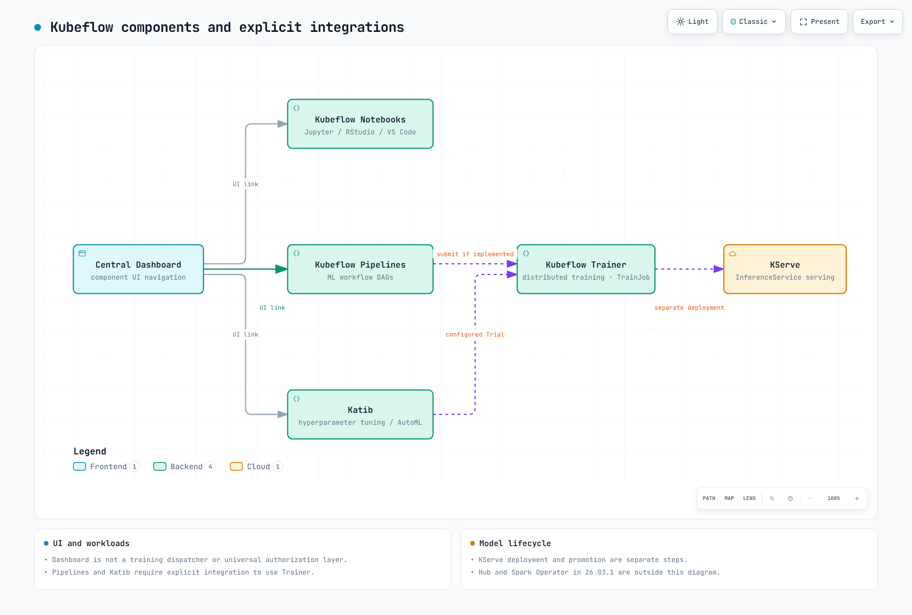

# EKS 上の Kubeflow 詳細解説

> **レビュー基準**: Kubeflow Community Distribution 26.03.1
> **最終更新**: September 12, 2026

## 概要

Kubeflow は、ML パイプライン、ノートブック、チューニング、トレーニング、サービングのための Kubernetes ベースのツールを提供します。Community Distribution はコンポーネントのリビジョン、共有サービス、ダッシュボードをまとめています。個別のプロジェクトには、それぞれ独自のリリースとインストール要件もあります。

CNCF は [2026 年 8 月 17 日に Kubeflow の卒業を発表しました](https://www.cncf.io/announcements/2026/08/17/cncf-announces-kubeflows-graduation-solidifying-the-standard-for-cloud-native-ai-operations/)。これは、独立したセキュリティ監査を含む、プロジェクトの成熟度とガバナンスを認めるものです。これは、特定の EKS デプロイメントのセキュリティまたは規制コンプライアンスを認定するものではありません。

## コンポーネントマップ

| コンポーネント | 目的 | API または概念 | ガイド |
| --- | --- | --- | --- |
| Dashboard、Profiles、アクセス管理 | UI ナビゲーション、namespace の所有権とメンバーシップ | Cluster-scoped `Profile`; オプションの quota | [パート 1](01-architecture-installation.md) |
| Pipelines | ワークフローのコンパイルと実行、run と artifact の追跡 | Pipeline/Run/Experiment APIs; オプションの Kubernetes Native API mode では `Pipeline`/`PipelineVersion` CRDs を追加 | [パート 2](02-pipelines.md) |
| Notebooks | ユーザーのノートブックワークロード | `Notebook`; image と PVC の構成 | [パート 3](03-notebooks.md) |
| Katib | ハイパーパラメータ検索と trial | `Experiment`、`Trial`、`Suggestion` CRDs | [パート 4](04-katib.md) |
| Trainer | 構成済み runtime を使用した分散トレーニング | `TrainJob`、`TrainingRuntime`、`ClusterTrainingRuntime` | [パート 5](05-training-operator.md) |
| KServe | モデル推論 Service | `InferenceService`; mode 固有の依存関係 | [パート 6](06-kserve.md) |

このマップはガイドの対象範囲を示しており、distribution 全体を網羅するものではありません。リリース 26.03.1 には Hub/model registry と Spark Operator も含まれます。KFP Experiment は Katib Experiment CRD ではありません。

[🔍 インタラクティブな図を表示](https://www.atomai.click/kubernetes-docs/archmaps/en-ai-ml-kubeflow-readme-0.html)

ダッシュボードはコンポーネントの UI をリンクします。Pipelines と Katib が Trainer を使用するのは、その実装がサポート対象のトレーニングリソースを明示的に送信する場合に限られます。トレーニング済み artifact を KServe に接続するには別途デプロイメント手順が必要です。この図はモデル昇格が自動的に行われることを示すものではありません。

## EKS で実行する理由

既存の EKS プラットフォームは、容量管理、ストレージ統合、ワークロード ID、モニタリングを ML ワークロードと共有できます。互換性は引き続き Kubernetes バージョン、CPU アーキテクチャ、image、ネットワーキング、ストレージドライバー、認証に依存します。Kubernetes conformance だけでは不十分です。リリースドキュメントには ARM64 image のカバレッジが不完全であることが記載されています。

チームは、コンポーネント/CRD のアップグレード、テナント認可、永続データ、認証情報、リカバリに引き続き責任を負います。[Amazon SageMaker AI](../sagemaker-ai/README.md) は一部のインフラストラクチャ責任を軽減しますが、データアクセス、アプリケーションの正確性、モデル品質、コスト管理には依然として責任者が必要です。必要なインターフェイス、運用能力、ワークロード制約に基づいて選択してください。

## 現在対象としている内容

1. [パート 1: EKS 上のアーキテクチャとインストール](01-architecture-installation.md) — 現行のコミュニティリリース、従来の AWS distribution の制限、Profiles、ID、manifest のレンダリング。
2. [パート 2: Pipelines](02-pipelines.md) — SDK v2、コンパイル、実行、artifact ストレージ。
3. [パート 3: Notebooks](03-notebooks.md) — ワークロード、Profiles、ストレージ、GPU 配置。
4. [パート 4: Katib](04-katib.md) — experiment、trial、検索、早期停止。
5. [パート 5: Trainer](05-training-operator.md) — 従来の Training Operator と Trainer v2 API。
6. [パート 6: KServe](06-kserve.md) — 推論リソース、デプロイメントモード、ロールアウト。

各章のコンポーネント基準を使用してください。インストールを選択する前に、[26.03.1 リリース](https://github.com/kubeflow/community-distribution/releases/tag/26.03.1) と [固定されたインベントリ](https://github.com/kubeflow/community-distribution/blob/26.03.1/README.md) を確認してください。
