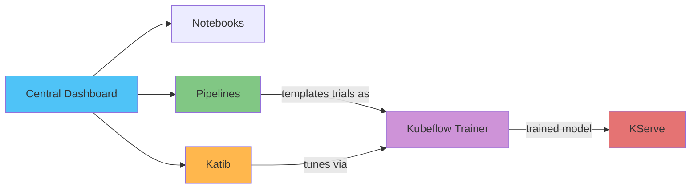

# EKS 上の Kubeflow 詳細解説

> **対応バージョン**: Kubeflow Community Distribution 26.03
> **最終更新**: August 19, 2026

## 概要

Kubeflow は Kubernetes 向けのオープンソース機械学習プラットフォームです。単一のモノリシックアプリケーションではなく、パイプラインオーケストレーション、ノートブック、ハイパーパラメータチューニング、分散トレーニング、モデルサービングなど、チームが ML ワークロードをエンドツーエンドで実行するために必要な要素を、Kubernetes ネイティブのコントローラーと CRD のセットとして提供します。2026 年 8 月 17 日、CNCF は Kubeflow の卒業を発表しました（Kubeflow は 2023 年にインキュベーションプロジェクトとして参加）。これは、独立したセキュリティ監査と正式な運営委員会の設立に続くものであり、プロジェクトの本番環境における成熟度を示す強いシグナルです。

## コンポーネントマップ

| コンポーネント | 解決する課題 | CRD / コアコンセプト | 詳細解説 |
|-----------|--------------------|---------------------|-----------|
| **Central Dashboard & Profiles** | マルチテナントアクセス、ユーザーごとの namespace 分離 | Profile (namespace) | [パート 1](01-architecture-installation.md) |
| **Kubeflow Pipelines** | DAG として複数ステップの ML ワークフローをオーケストレーション | `Pipeline`, `Run`, `Experiment` | [パート 2](02-pipelines.md) |
| **Kubeflow Notebooks** | 管理されたユーザーごとの Jupyter/RStudio/VS Code 環境 | `Notebook` | [パート 3](03-notebooks.md) |
| **Katib** | ハイパーパラメータチューニングと AutoML | `Experiment`, `Trial`, `Suggestion` | [パート 4](04-katib.md) |
| **Kubeflow Trainer** | フレームワークをまたぐ分散モデル学習 | `TrainJob`, `ClusterTrainingRuntime` | [パート 5](05-training-operator.md) |
| **KServe** | モデルサービングと推論 | `InferenceService` | [パート 6](06-kserve.md) |

## EKS で実行する理由

Kubeflow のコンポーネントは、準拠する任意の Kubernetes クラスターで実行できるよう設計されています。つまり、このドキュメントサイトで既に扱っている EKS 向けの運用プラクティス、すなわち Karpenter によるオートスケーリング（GPU ノードプールを含む）、AWS サービスアクセスのための IRSA/Pod Identity、EBS/S3 ストレージ統合、Prometheus/Grafana による可観測性は、別個の ML 専用プラットフォームを必要とせず、ML ワークロードに直接適用できます。フルマネージドの代替手段（例: Amazon SageMaker）とのトレードオフは、[Data on EKS](../../data-on-eks/README.md) で扱うものと同じです。クラスター上の全ワークロードで共有される単一のデプロイメント/可観測性モデル、およびプラットフォーム全体を一度に導入するのではなく Kubeflow の任意のコンポーネントを個別に実行できる能力と引き換えに、より大きな運用責任（Operator のアップグレード、ストレージ/アイデンティティの接続）を負います。

## 現在扱っている内容

1. [パート 1: EKS 上の Kubeflow アーキテクチャとインストール](01-architecture-installation.md) — コンポーネントアーキテクチャ、CNCF 卒業の背景、EKS での `awslabs/kubeflow-manifests` を使用したインストール
2. [パート 2: Kubeflow Pipelines](02-pipelines.md) — KFP SDK v2、IR ベースのパイプラインコンパイル、S3 バックエンドのアーティファクトストレージ
3. [パート 3: Kubeflow Notebooks](03-notebooks.md) — ユーザーごとのノートブックサーバー、Profile ベースのマルチテナンシー、GPU スケジューリング
4. [パート 4: Katib — ハイパーパラメータチューニングと AutoML](04-katib.md) — Experiment/Trial/Suggestion モデル、探索アルゴリズム、早期停止
5. [パート 5: Kubeflow Trainer と分散トレーニング](05-training-operator.md) — v1 Training Operator から Kubeflow Trainer v2 への移行、TrainJob/TrainingRuntime
6. [パート 6: KServe — Kubernetes 上のモデルサービング](06-kserve.md) — InferenceService、Serverless と Raw Deployment モード、カナリアロールアウト
