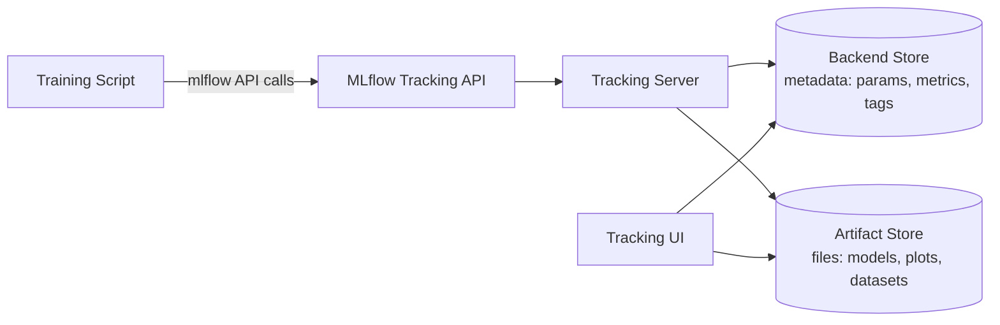

# パート1: MLflow Tracking

> **対応バージョン**: MLflow 3.15.1
> **最終更新**: August 19, 2026

## Lab環境のセットアップ

このドキュメントの例に沿って進めるには、以下のツールと環境が必要です。

### 必要なツール

* Python 3.10以降
* `pip install mlflow`（このドキュメントではMLflow 3.xを前提としています。例と完全に一致させたい場合は、`mlflow==3.15.1` のように特定の固定バージョンをインストールしてください）
* 稼働中のMLflow tracking serverへのアクセス。あるいは、これらの例のために `mlflow server` でローカルに実行してください。EKS上で本番用tracking serverを立ち上げる方法は、[パート3: EKS Deployment](./03-eks-deployment.md)で説明します
* 数行のlogging codeを追加できるtraining scriptまたはnotebook（任意のscikit-learn、PyTorch、または類似の例で動作します）

## MLflow Trackingとは？

MLflow Trackingは、machine learningのtraining runに関する情報をログ記録およびクエリするMLflowの機能です。データを記録するためのPython（およびREST）APIと、それを閲覧するためのUIを組み合わせています。ログ記録されるものはいくつかのカテゴリに分かれます。parameters（learning rateやbatch sizeなど、runへの入力）、metrics（accuracyやlossなど、training中またはtraining後に測定される出力）、artifacts（plot、dataset、シリアライズされたmodelなど、runが生成する任意のfile）、そしてMLflow 3以降では、単なるfileではなくfirst-class entityとして追跡されるmodelそのものです。

これらはすべて、**tracking server** を通じて記録されます。これは実際には、1つのAPIの背後で連携する2つのstoreです。structured metadataを保持するbackend storeと、大きなbinary fileを保持するartifact storeです。このドキュメントの残りでは、日常的にTrackingを使用するために必要な概念を扱います。backend/artifact storeの分離は独自のtracking serverをdeployする際により重要になるため、パート3でさらに詳しく取り上げます。

## コアコンセプト: ExperimentsとRuns

**Experiment** は、名前付きのRunのコレクションです。通常はprojectごと、または反復作業中のmodelごとに1つのexperimentを作成します。**Run** はtraining codeの1回の実行です。つまり、modelのtraining、評価、または記録する価値のある何かを生成するための1回の呼び出しです。各runはそれぞれ独自のparameters、metrics、tags、artifactsを取得するため、同じexperiment内でrun同士を比較し、どのconfigurationが最も優れた性能を示したかを確認できます。

最小限のtracking callは次のようになります。

```python
import mlflow

with mlflow.start_run():
    mlflow.log_param("learning_rate", 0.01)
    mlflow.log_metric("accuracy", 0.92)
    mlflow.log_artifact("confusion_matrix.png")
```

`with mlflow.start_run()` context managerはrunを開始し、block内のすべてのlogging callをそのrunに関連付け、blockを抜けると自動的に閉じます。

### Autologging

重要な値ごとに手動で `log_param` と `log_metric` を呼び出すのは、すぐに煩雑になります。MLflowの **autologging** 機能は、一般的なML libraryをinstrumentationし、training codeを変更せずにtraining中のparameters、metrics、artifactsを自動的に取得します。1回の呼び出しで有効になります。

```python
mlflow.autolog()
```

これにより、現在のprocessで使用されている対応frameworkのautologgingが有効になります。MLflowにはframework固有のautolog functionも用意されています。たとえばscikit-learn用とPyTorch用があり、MLflowが検出できるすべてのlibraryではなく、1つのlibraryだけでautologgingを有効にしたい場合に利用できます。日常的なtraining runではautologgingが適したデフォルトです。custom evaluation metricsやdomain-specific artifactsなど、autologgingが認識できない値を取得する必要がある場合は、手動loggingが引き続き役立ちます。

## MLflow 3における変化: ModelsをFirst-Class Entitiesとして扱う

MLflow 1.xまたは2.xを使用したことがあれば、model trackingの仕組みが現在とは異なっていたことをご存じでしょう。以前のrun中心のmodelでは、ログ記録されたmodelは単に **Runの下にネストされたartifact** でした。activeな `mlflow.start_run()` block内で `mlflow.sklearn.log_model(...)` を呼び出すと、model fileはplotやdatasetとともにそのrunのartifact directoryに配置されました。modelを見つけるには、まずそれを生成したrunを見つける必要がありました。

MLflow 3では、modelを生成したRunとは分離された独自のfirst-class entityとして **`LoggedModel`** を導入することで、これが変わります。これにより、いくつかの結果が生じます。

* activeな `mlflow.start_run()` contextがなくても、直接 `mlflow.sklearn.log_model(...)` を呼び出せます。trackingするためにmodelをrunの下にネストする必要はありません。
* tracking UIには、Experiments/Runs viewとは別の専用 **Logged Models** viewがあります。ここでは、重要なmodelを生成したrunを探し回る代わりに、modelを直接閲覧および比較できます。
* modelがもはや1つのrunの下にある単なるfileではないため、MLflow 3ではmodelと、それに関連するruns、traces、prompts、evaluation metricsの間で、より豊かなlineageを追跡できます。modelは、単一のtraining executionに永続的に紐付けられるのではなく、それをtrainingしたrun、評価したruns、およびそれをservingして生成されたすべてのtracesにリンクできます。

これにより、model versioningと比較が単一のtraining runから切り離されます。これは、同じmodelを多数のrunにわたって反復する場合や、従来のtraining loopの外部で完全にmodelを生成する場合（たとえば、既存のLLMをcustom logicでラップする場合）に特に重要です。

## GenAIとLLM Observability: Tracing

MLflowの当初の対象は、従来型ML experiment tracking、すなわちtraining runのparams、metrics、artifactsでした。MLflow 3は、この同じtracking systemを拡張し、**GenAIおよびagent observability** を別のtoolではなくコア機能として扱います。そのための仕組みが **tracing** です。

Tracingは、LLMまたはagent callの内部stepを **spans** のtreeとして取得します。各spanはretrieval call、tool invocation、基盤となるmodelへのcallなどの1つのstepを表し、各stepのtoken usageとcostも含みます。MLflowはLangChainを含む一般的なLLMおよびagent framework向けのauto-instrumentationと、PydanticAIやsmolagentsなどのframework向けの新しいauto-tracing integrationを提供しています。そのため、多くの場合、tracingの有効化にapplication codeの変更はほとんど、またはまったく必要ありません。tracesはexperimentsおよびrunsに使用される同じtracking UIで確認でき、MLflow 3が追跡するlineageを反映して、それらを生成したmodel、prompt、またはevaluation runにリンクできます。

実際には、従来型ML trainingとLLM/agent developmentの両方を行うteamは、GenAI側のために別個のobservability toolを立ち上げるのではなく、1つのMLflow Tracking deploymentを両方に使用できます。

## Backend StoreとArtifact Store

tracking serverは、保存するものを2つのカテゴリに分け、それぞれ異なる種類のstorageを使用します。

* **Backend store**: structured metadata、すなわちparameters、metrics、tags、experiments、runs、（MLflow 3では）logged modelsを説明するrecordです。迅速なlocal experimentationを超えるteam規模では、defaultのlocal file-based storeではなく、PostgreSQLやMySQLなどの実際のrelational databaseが必要です。
* **Artifact store**: 大きなbinary object、すなわちmodel file、plot、dataset、およびrunが生成するその他すべてのfileです。通常はdatabaseではなく、S3-compatible bucketなどのobject storageです。

この分離が重要なのは、2つのstoreでdurability、scaling、access patternの要件が異なるためです。databaseは多数の小さなstructured writeとqueryに適しており、object storageは大きなfileの保存と取得に適しています。[パート3: EKS Deployment](./03-eks-deployment.md)では、独自のtracking serverをEKSで実行する際に、このことが意味するinfrastructureの選択について詳しく説明します。ここでは、2つのstoreが存在し、異なる目的を果たすことを知っておけば十分です。



training scriptはどちらのstoreとも直接通信しません。常にTracking APIを経由し、tracking serverがmetadata writeをbackend storeへ、file writeをartifact storeへroutingします。UIは両方のstoreから読み取り、experiments、runs、logged models、tracesをrenderします。

## 次のステップ

このドキュメントでは、MLflow Trackingが記録する内容、ExperimentsとRunsがそのdataを整理する方法、MLflow 3の `LoggedModel` entityが以前のrunにネストされたmodelと比較してmodel trackingをどのように変えるか、そしてtracingが同じsystemをGenAIおよびagent observabilityへどのように拡張するかを説明しました。[パート2: Model Registry](./02-model-registry.md)では、runが保存する価値のあるmodelを生成した後に行うこと、すなわち登録、versioning、および `champion` のようなaliasを使用してproductionへpromoteする方法を説明します。[パート3: EKS Deployment](./03-eks-deployment.md)では、上で紹介したbackend storeとartifact storeの選択を含め、独自のtracking serverをEKSで実行する方法を扱います。

[メインページに戻る](./README.md)

## クイズ

この章で学んだ内容を確認するには、[トピッククイズ](../../quizzes/ai-ml/mlflow/01-tracking-quiz.md)に挑戦してください。
