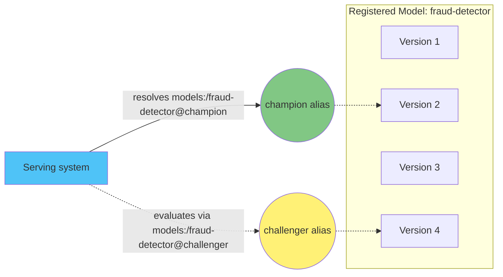

# Part 2: MLflow Model Registry

> **対応バージョン**: MLflow 3.15.1
> **最終更新**: August 19, 2026

## Lab Environment Setup

このドキュメントの例に沿って進めるには、次のツールと環境が必要です。

### Required Tools and Resources
- Python 3.10 以降
- `pip install mlflow`
- レジストリへのアクセス権を持つ、実行中の MLflow tracking server へのアクセス（セットアップ方法は [Part 1: MLflow Tracking](01-tracking.md)、またはクラスターでホストする server については [Part 3: Deploying MLflow on EKS](03-eks-deployment.md) を参照）

## What the Model Registry Is

[Part 1](01-tracking.md) では、Tracking、すなわち Run と Experiment に対するパラメーター、メトリクス、artifact、`LoggedModel` エンティティの記録について説明しました。Run は 1 回のトレーニング試行の記録です。その識別子はビジネス上の意味ではなく、いつどのように実行されたかに紐づくため、「出荷するモデル」を扱うための適切な単位ではありません。

Model Registry は、**Registered Models** を導入することでこの問題を解決します。これはモデルバージョンを名前付きかつバージョン管理された形で収集し、個々のトレーニング Run や Experiment から独立した、安定したモデルの識別子を提供します。「現在本番で使われているモデルを生成した Run はどれか」と問う代わりに、チームは「現在の `fraud-detector` とは何か」と問い、以降にいくつの Experiment が実行されたかにかかわらず一貫した回答を得られます。

レジストリは、開発から本番までのモデルのライフサイクル、すなわち登録、レビュー、昇格、最終的な廃止を、すべて 1 つの永続的な名前に対して追跡しながら管理するために存在します。

## Core Concepts

### Registered Model

Registered Model は、たとえば `fraud-detector` のような名前です。これはレジストリにおける最上位のエンティティです。モデルに付加されたすべてのバージョン、alias、tag、description は、モデルの存続期間を通じてこの 1 つの名前の下に蓄積されます。

### Model Version

Model Version は、Registered Model の名前の下に登録される、不変で番号付けされたバージョンです（`fraud-detector` のバージョン 1、バージョン 2 など）。各バージョンは一度だけ作成され、その後は変更されません。新しいトレーニング結果は、古いバージョンの編集ではなく、新しいバージョンになります。

すべての Model Version は、元になった基盤の `LoggedModel`（またはそれを生成した Run）を参照します。これにより、レジストリは Tracking と結び付けられます。バージョンは Run の履歴における特定時点へのポインターであり、元のものから乖離したコピーではありません。

### Aliases

alias は、特定の Model Version を指す可変の名前付きポインターです。たとえば `champion` や `challenger` が該当します。バージョン番号とは異なり、alias は移動できます。今日 `champion` がバージョン 4 を指していても、評価が成功した後には、alias を利用するものに手を加えずにチームはそれをバージョン 7 に付け替えられます。

alias は、現在、レジストリ内でモデルの役割またはライフサイクル段階を表す主要な仕組みです。Serving system または下流の job は、一度 `models:/fraud-detector@champion` を解決するように記述しておけば、基盤となるバージョンが変わってもコードを変更せずに、常にその alias を現在保持しているバージョンをロードします。

### The Legacy Stage Model (For Reference Only)

以前の MLflow デプロイでは異なる仕組みが使われていました。各 Model Version は `Staging`、`Production`、`Archived` のいずれかの **stage** を持ち、モデルを先に進めるには stage を遷移させていました。このモデルは、tag と組み合わせた alias に置き換えられています。単一のバージョンが複数の alias（または alias なし）を保持でき、alias 名は固定されたライフサイクルラベルの集合に制限されないため、こちらの方が柔軟です。新しい作業では、stage ではなく alias と tag を使用してください。stage transition を使う古い MLflow デプロイに遭遇した場合、それはこのレガシーなアプローチです。

## Registering a Model

Model Version は 2 つの方法のいずれかで作成され、どちらも Part 1 で説明した内容を基にしています。

**ログ記録後に登録する。** トレーニング Run がモデルを artifact（または Part 1 に従い `LoggedModel`）としてログ記録した後、`mlflow.register_model(model_uri, name)` を呼び出すことで個別に登録できます。ここで、`model_uri` はすでにログ記録されたモデルを指し、`name` は登録先の Registered Model です。これは、モデルを登録する判断がトレーニングステップ自体とは独立している場合に適しています。たとえば、評価しきい値を満たすモデルだけを登録するレビューステップが該当します。

**ログ記録時に登録する。** あるいは、flavor 固有の `log_model` 呼び出しの `registered_model_name` パラメーター（たとえば `mlflow.sklearn.log_model(..., registered_model_name="fraud-detector")`）を使用すると、ログ記録と同じ呼び出しでモデルを新しい Model Version として登録します。これは、特定のトレーニング script の各 Run が自動的に候補バージョンを生成することを意図している場合に適しています。

どちらの方法でも、名前付き Registered Model の下に新しい不変の Model Version が作成されます。どちらの方法でも alias は移動しません。これは、以下で説明する別個の意図的なアクションです。

## Governance and the Handoff Workflow

レジストリの組織上の主な価値は、候補モデルを生成することと、どの候補が Serving できるほど信頼できるかを判断することという、異なる 2 つの関心事の間の引き渡し地点となることです。

一般的なワークフローは次のとおりです。

1. データサイエンスチームはモデルをトレーニングし、有望な各結果を、上記いずれかの登録方法を使用して、共有された Registered Model 名の下に新しい Model Version として登録します。
2. CI/CD で自動化する、手動で行う、またはその両方による評価または承認プロセスが、テストデータ、公平性チェック、またはビジネスメトリクスに対して候補バージョンをレビューします。
3. バージョンがそれらのゲートを通過した後にのみ、通常は手作業ではなく自動化された pipeline から client API（`set_registered_model_alias`）を介して、何らかの処理が `champion` alias をそのバージョンに向けます。
4. このパートの対象外である Serving infrastructure は、`models:/fraud-detector@champion` を解決するよう一度だけ記述され、バージョン番号をハードコードする必要はありません。`champion` が移動すると、次の解決では単に新しいバージョンが取得されます。

この分離により、候補モデルを生成する人や system が、本番で Serving するものを直接制御する必要がなくなり、モデルを利用する system もバージョン番号を手作業で追跡する必要がなくなります。現在 Serving しているものを妨げずに、昇格評価中のバージョンを示すため、`champion` と併せて `challenger` alias が一般的に使用されます。

## Lineage and Reproducibility

すべての Model Version は、それを生成した Run、およびその Run が持つ Part 1 のパラメーター、code、dataset reference へのリンクを保持するため、チームは「現在 `champion` として Serving されているモデルを生成した正確な code と data は何か」といった監査上の質問に常に答えられます。連鎖は、alias、Model Version、Run、その Run にログ記録されたパラメーターと artifact です。

Model Version は、基盤となる Run の tag とは独立して、独自の tag と description もサポートします。これは、たとえば、バージョンの昇格を承認した人物や、alias の移動を正当化した評価 report へのリンクといった、レジストリ固有のコンテキストを、トレーニング Run 自体の metadata に混在させずに記録するのに役立ちます。

## Next Steps

Part 2 では、レジストリ自体、すなわち Registered Model、Model Version、現在のライフサイクルの仕組みである alias、そして登録が [Part 1: MLflow Tracking](01-tracking.md) にどのように接続するかを説明しました。登録済みモデルを実際の inference endpoint にロードすることは別の関心事であり、このシリーズの対象外です。代わりに [Part 3: Deploying MLflow on EKS](03-eks-deployment.md) では、Tracking と Model Registry の両方が依存する tracking server と backing store のセットアップを説明します。

[メインページに戻る](./README.md)

## Quiz

[Model Registry クイズ](../../quizzes/ai-ml/mlflow/02-model-registry-quiz.md) で理解度を確認しましょう。
