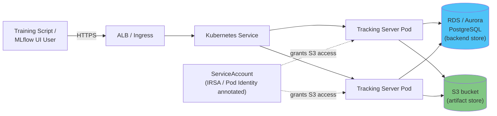

# パート3：EKS での MLflow のデプロイ

> **サポート対象バージョン**: MLflow 3.15.1, Kubernetes 1.34+
> **最終更新**: August 19, 2026

## Lab 環境のセットアップ

このドキュメントの例に沿って進めるには、以下のツールと環境が必要です。

### 必要なツール

* 稼働中の Amazon EKS クラスターを指す kubectl v1.34 以降
* コミュニティ Helm chart のインストール方法を選ぶ場合は Helm v3
* backend store 用の既存の Amazon RDS または Aurora PostgreSQL インスタンス（またはそれをプロビジョニングする能力）
* artifact store 用の S3 bucket
* tracking server にその S3 bucket へのアクセスを付与する IRSA role または EKS Pod Identity association

## MLflow Tracking Server を EKS で実行する理由

ここでのトレードオフは、このドキュメントサイトで扱う他のセルフホスト型 ML インフラストラクチャと同じパターンに従います。すでに EKS を運用しているチームは、別個の運用モデルを学ぶ代わりに、MLflow についてもクラスター上の他のすべてと同じ deployment manifest、observability stack、IAM パターン（IRSA または Pod Identity）を再利用できます。その代償として、そのチームは、Databricks 管理の MLflow や SageMaker の MLflow 互換 tracking 機能のようなマネージドな代替サービスに training code を向けるのではなく、backend store や artifact store とともに tracking server プロセス自体を運用することになります。どちらの選択も普遍的に正しいわけではありません。チームが既存の Kubernetes 運用領域にサービスをもう 1 つ追加したいか、あるいは運用するサービスを 1 つ減らしたいかにかかっています。

## アーキテクチャ

EKS 上の本番 MLflow デプロイには 3 つの構成要素があり、実際のチームが tracking server を共有するようになると、どれも省略できません。

**MLflow Tracking Server。** これは `mlflow server` を実行するコンテナで、client SDK（`mlflow.log_metric`、`mlflow.log_artifact` など）が通信する REST API と、人々が experiment や run を閲覧する Web UI の両方を公開します。設計上 stateless であり、すべての永続的な状態は backend store と artifact store に存在するため、Service と Ingress（通常は ALB をプロビジョニングする AWS Load Balancer Controller が背後にある）を前面に配置した Kubernetes Deployment に自然に適合します。

**Backend store。** MLflow のデフォルトの backend store はローカルの SQLite file です。これは laptop で 1 人の experimenter が使うには問題ありませんが、複数のプロセスが同時に書き込む必要が出た瞬間に破綻します。SQLite は、共有チーム用 tracking server に必要なレベルの同時アクセスをサポートしていません。AWS では、標準的な置き換えは実際のリレーショナル database です。Amazon RDS for PostgreSQL、または事前にサイズを決めるのではなく database を tracking load に応じてスケールさせたい場合は Aurora Serverless v2 を使用します。backend store には、MLflow のすべての構造化 metadata（experiment、run、parameter、metric、registered model、model version、alias（[パート2](02-model-registry.md) を参照））が格納されます。SQL でクエリ可能であることの恩恵を受けるものすべてです。

**Artifact store。** Backend store の行は小さいですが、MLflow がそれらと一緒にログに記録するものは多くの場合そうではありません。シリアル化された model、plot、dataset、その他の大きなバイナリ object は、database ではなく別の artifact store に格納されます。AWS では Amazon S3 を使用します。tracking server はデフォルト artifact root として設定された S3 URI 配下に artifact を書き込み、読み取ります。また client は、server の設定に応じて tracking server の proxy 経由または直接の S3 access で artifact を取得します。



## インストール方法

上記の構成要素をクラスターで実行するには、実用的な方法が 2 つあります。

**独自の manifest を作成する。** `mlflow server` コンテナ用の Deployment、その前面の Service、外部に公開するための Ingress（または type `LoadBalancer` の Service）を作成し、backend store の接続文字列と S3 artifact root を、コンテナの環境変数または command-line flag として渡します。これにより、YAML を自分で保守する代わりに、あらゆる詳細を完全に制御できます。

**コミュニティ Helm chart を使用する。** `community-charts/helm-charts` プロジェクトは、このユースケース専用の MLflow chart を維持しています。

```bash
helm repo add community-charts https://community-charts.github.io/helm-charts
helm repo update
helm search repo community-charts/mlflow
```

この chart は、概念レベルで上記の構成要素の設定を公開します。SQLite ではなく外部 database 接続を backend store に指定すること、S3 bucket を artifact store に指定すること、そして replica count、resource request、Ingress 設定など通常の Kubernetes に関する事項です。これらは chart version 間で変更される可能性があるため、デプロイ前に正確な `values.yaml` key と現在の default について chart 自身のドキュメントを確認してください。

どちらの方法でも、同じ runtime architecture に到達します。1 つ以上の stateless tracking server Pod、それらすべてが接続する database、それらすべてが接続する S3 bucket です。

## Artifact store への IAM アクセス

tracking server Pod には、S3 artifact bucket 内の object を読み書きするための AWS permission が必要です。たとえば、その bucket の prefix にスコープを限定した `s3:PutObject` や `s3:GetObject` です。EKS で IAM role を Kubernetes ServiceAccount にバインドするための長年の仕組みは IRSA（IAM Roles for Service Accounts）です。これは ServiceAccount に `eks.amazonaws.com/role-arn` を annotation として付与し、それを使用する Pod がその role の一時的な credential を受け取れるようにします。EKS Pod Identity は IAM role を Pod にバインドする新しい仕組みであり、workload にかかわらず、一般に EKS 上で新しい IAM-to-pod binding を作成する際の推奨 default になりつつあります。どちらの仕組みでも、static AWS credential を tracking server の環境および設定から除外できます。新しい MLflow デプロイでは、Pod Identity がよりモダンな出発点であり、IRSA はすでにそれを標準化しているクラスターやチームでは引き続き有効な選択肢です。

## 運用上の注意

**複数の replica を実行する。** Postgres を backend に持つ tracking server は stateless です。すべての共有状態は Pod ではなく database と S3 に存在するため、可用性のために Service と Ingress の背後で複数の replica を安全に実行できます。これは SQLite を backend に持つ単一プロセスのデフォルトとは重要な違いです。SQLite は concurrent writer を許容しないため、安全にスケールアウトすることがまったくできません。

**health probe を設定する。** 長時間実行される Kubernetes service と同様に、tracking server の health endpoint に対して readiness probe と liveness probe を設定してください。これにより、Service は実際に request を処理できる Pod にのみ traffic をルーティングし、停止状態の Pod は自動的に再起動されます。release により異なる場合があるため、想定で決めるのではなく、実行している MLflow version に対して正確な health-check path を確認してください。

**書き込みパターンに合わせて database をサイズ設定する。** ログに記録されるすべての parameter、metric、metric step は backend store への書き込みです。そのため、metric を高頻度（たとえば epoch ごとではなく step ごと）に記録する training job は、database に実際の負荷をかけます。Aurora Serverless v2 は、database を年間を通じてピーク load に合わせてサイズ設定することなく、training run による突発的な tracking load を吸収できるため、特に検討する価値があります。

## 次のステップ

これで 3 部構成の MLflow シリーズは終わりです。[パート1](01-tracking.md) では experiment と run のログ記録を扱い、[パート2](02-model-registry.md) では Model Registry で training 済み model に安定した version 付きの identity を与えることを扱い、このパートでは EKS 上での tracking server、backend store、artifact store の実行を扱いました。model に registered version または alias がある場合、多くのチームが次に行う自然なステップは、その特定の version を serving system（KServe、カスタム FastAPI または Flask wrapper、SageMaker、あるいはまったく別のもの）にロードすることです。この serving layer はそれ自体が幅広い topic であり、このシリーズの範囲外です。

[メインページに戻る](./README.md)

## クイズ

この章で学んだ内容をテストするには、[トピッククイズ](../../quizzes/ai-ml/mlflow/03-eks-deployment-quiz.md) に挑戦してください。
