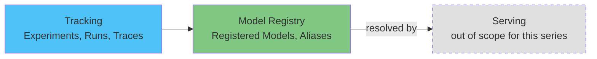

# EKS 上の MLflow 詳細解説

> **サポート対象バージョン**: MLflow 3.15.1
> **最終更新**: August 19, 2026

## 概要

MLflow は、機械学習ライフサイクル（実験の追跡、モデルのパッケージ化とバージョニング、さらに MLflow 3 以降では GenAI/LLM のオブザーバビリティ）を管理するオープンソースプラットフォームです。シンプルな API を介して、任意のトレーニングスクリプトやエージェントがログを記録できる tracking server を提供します。Kubernetes ネイティブの controller を含む完全なプラットフォームをまとめて提供する Kubeflow とは異なり、MLflow は単一の Service（tracking server とその backend/artifact store）であり、チームは通常、Kubeflow、カスタムのトレーニング環境、あるいは他の何もない環境と併せて実行します。

## コンポーネントマップ

| 概念 | 解決する課題 | 詳細解説 |
|---------|--------------------|-----------|
| **Tracking** | 実験パラメータ、メトリクス、artifact、モデル、GenAI trace を記録・照会する | [パート 1](01-tracking.md) |
| **Model Registry** | 単一のトレーニング run に依存しない、安定したバージョン管理済みのモデル ID を提供する | [パート 2](02-model-registry.md) |
| **EKS Deployment** | tracking server、backend store、artifact store を EKS 上で実行する | [パート 3](03-eks-deployment.md) |

## EKS 上でこれを実行する理由

このトレードオフは、本ドキュメントサイトの他の data/ML セクションで扱っているものと同じです。すでに EKS を運用しているチームは、クラスター上の他のすべてと同様に、MLflow の tracking server にも同じ deployment、IAM（IRSA/Pod Identity）、およびオブザーバビリティのパターンを再利用できます。その代わり、マネージドな代替手段を利用するのではなく、tracking server、その backend database、および artifact store を直接運用します。

## 現在カバーしている内容

1. [パート 1: MLflow Tracking](01-tracking.md) — 実験、run、autologging、MLflow 3 における `LoggedModel` への移行、および GenAI tracing
2. [パート 2: MLflow Model Registry](02-model-registry.md) — Registered Models、Model Versions、alias、および lineage
3. [パート 3: EKS での MLflow のデプロイ](03-eks-deployment.md) — tracking server、PostgreSQL backend store、S3 artifact store、および IAM access
