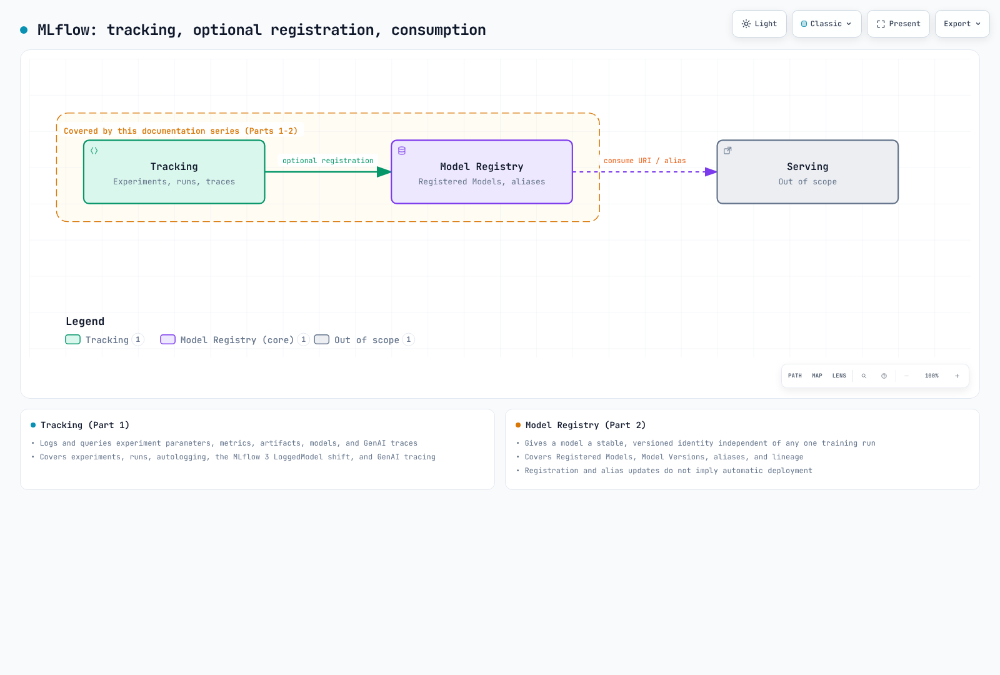

# MLflow on EKS Deep Dive

> **レビュー基準**: MLflow 3.16.0
> **ドキュメント確認日**: September 12, 2026

## 概要

MLflow は、実験のトラッキング、モデルのロギングと登録、バージョン管理、GenAI の評価、および tracing を提供します。Tracing は 2.14.0 で導入され、3.x では LoggedModel、評価、UI 連携が拡張されました。バージョン 3.16.0 は 2026-09-04 にリリースされました。

SDK と SQLite でローカルに利用することも、SQL metadata store と artifact store を分離した HTTP tracking service として運用することもできます。論理的な 1 つのサービスが、必ずしも 1 つの Pod や 1 つのストレージシステムである必要はありません。本シリーズでは Tracking、Registry、EKS へのデプロイを扱います。MLflow のすべての機能や GPU 学習の成功を検証するものではありません。

## コンポーネントマップ

| Concept | Problem It Solves | Deep Dive |
|---------|--------------------|-----------|
| **Tracking** | experiment の parameters、metrics、artifacts、models、GenAI traces を記録・照会する | [Part 1](01-tracking.md) |
| **Model Registry** | 個々の training run に依存しない、安定したバージョン付きの識別子をモデルに与える | [Part 2](02-model-registry.md) |
| **EKS Deployment** | tracking server、backend store、artifact store を EKS 上で稼働させる | [Part 3](03-eks-deployment.md) |

[🔍 インタラクティブ図を表示](https://www.atomai.click/kubernetes-docs/archmaps/en-ai-ml-mlflow-readme-0.html)

## なぜ EKS で稼働させるのか

トレードオフは、本ドキュメントサイトの data/ML セクションの他の箇所で扱っているものと同じです。すでに EKS を運用しているチームは、MLflow の tracking server に対しても、クラスター上の他のワークロードと同じデプロイ、IAM（IRSA/Pod Identity）、オブザーバビリティのパターンを再利用できます。その代わりに、マネージドな代替手段を使わず、tracking server とその backend database、artifact store を自ら運用することになります。

[SageMaker AI ガイドブック](../sagemaker-ai/README.md) では Qwen の比較設計を説明しています。この例は過去のバージョンに個別に固定されており、使用している DLC がパッチ提供終了に達したため、現在は GPU での実行がブロックされています。本シリーズにおける MLflow 3.16.0 のローカル検証は、その例のエンドツーエンド検証ではありません。

Model Registry への登録は、ライフサイクル上の任意のステップです。serving システムは model URI や alias を別途の設定を通じて参照するため、登録や alias の変更によってモデルが自動的にデプロイされることはありません。

## 現在扱っている内容

1. [Part 1: MLflow Tracking](01-tracking.md) — experiments、runs、autologging、MLflow 3 における `LoggedModel` への移行、GenAI tracing
2. [Part 2: MLflow Model Registry](02-model-registry.md) — Registered Models、Model Versions、aliases、lineage
3. [Part 3: Deploying MLflow on EKS](03-eks-deployment.md) — tracking server、PostgreSQL backend store、S3 artifact store、IAM アクセス

## 一次情報源

- [MLflow 3.16.0 release](https://github.com/mlflow/mlflow/releases/tag/v3.16.0)
- [Tracing introduced in MLflow 2.14.0](https://github.com/mlflow/mlflow/releases/tag/v2.14.0)
- [Backend store](https://mlflow.org/docs/3.16.0/self-hosting/architecture/backend-store/)
